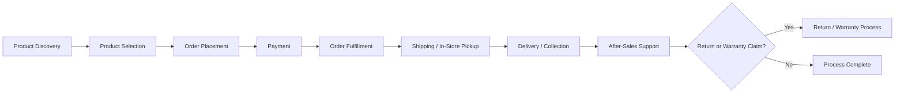

# Business Requirements Document (BRD)

## 1. Introduction

This Business Requirements Document (BRD) defines the business needs, objectives, stakeholders, processes, rules, and expected outcomes for the **StackLeo Tech Store** project. It translates the foundational direction established in `00_Project_Overview` into a structured business requirements reference for the project.

This document is the primary business foundation for all subsequent documentation, including Product, System Design, Database, API, Backend, Frontend, Testing, and Deployment documentation. Any future documentation that conflicts with the requirements defined here should be reconciled against this document.

This document is business-focused. It does not describe implementation approach, technology choices, system architecture, API design, or database structure, all of which are addressed in dedicated technical documentation elsewhere in the repository.

## 2. Business Background

StackLeo is a technology and electronics company building **StackLeo Tech Store**, a marketplace positioned as a single, reliable destination for technology products — reflected in its tagline, *"Everything Tech, One Marketplace."*

The technology and electronics retail sector in Bangladesh is served today through a mix of independent physical retailers and fragmented online storefronts, with inconsistent product authenticity, pricing transparency, and customer service standards. StackLeo intends to address this gap by combining an online marketplace with a physical retail presence, offering customers a consistent and trustworthy experience across both channels.

StackLeo Tech Store currently operates as a single-seller, Business-to-Consumer (B2C) business, with a business model designed to be future-ready for Business-to-Business (B2B) sales and multi-vendor marketplace operations.

## 3. Business Problem Statement

Customers seeking technology and electronics products in Bangladesh currently face:

- Fragmented purchasing options across inconsistent online and offline retailers.
- Uncertainty around product authenticity and genuine warranty coverage.
- Inconsistent pricing, service quality, and after-sales support across sellers.
- Limited ability to reliably compare and discover technology products across categories in one place.

These conditions create friction and reduce customer trust, limiting the market's overall growth potential and making it difficult for customers to identify a dependable source for technology purchases.

## 4. Business Opportunity

StackLeo Tech Store has the opportunity to become the trusted, centralized marketplace for technology and electronics in Bangladesh by:

- Offering a broad, well-organized catalog spanning the full range of technology product categories.
- Operating consistently across both an online store and a physical retail presence.
- Building customer trust through genuine products, transparent pricing, and dependable service.
- Establishing a scalable foundation that can expand into B2B sales and multi-vendor marketplace operations as the business matures.

Capturing this opportunity positions StackLeo as a recognized, trusted brand in Bangladesh's technology e-commerce industry, ahead of further regional growth.

## 5. Business Objectives

- Establish StackLeo Tech Store as a credible and trusted technology marketplace in Bangladesh.
- Deliver a consistent customer experience across online and physical retail channels.
- Offer a broad, well-organized catalog covering all core technology product categories.
- Build sustainable revenue through direct-to-consumer sales.
- Create a business and platform foundation capable of supporting future B2B and multi-vendor marketplace growth.

## 6. Project Goals

- Define clear, well-documented business requirements to guide all subsequent project documentation.
- Ensure business processes, rules, and policies are established before functional and technical design begins.
- Ensure the business requirements support a customer-focused, trust-driven marketplace across all sales channels.
- Provide a stable business foundation that can evolve without requiring a redefinition of the company's core direction.

Detailed business, customer, operational, and technical goals are defined in `00_Project_Overview/project-goals.md`.

## 7. Business Scope

The business scope of StackLeo Tech Store includes:

- Direct-to-consumer (B2C) retail of technology and electronics products.
- Sales conducted through both an online store and a physical retail store.
- A product catalog spanning smartphones, laptops, tablets, smart watches, audio devices, computer components, mobile accessories, laptop accessories, networking devices, gaming accessories, storage devices, and office electronics.
- Business processes, rules, and policies covering pricing, order fulfillment, payment, shipping, warranty, and returns.
- A business foundation designed to support future expansion into B2B sales and multi-vendor marketplace operations.

## 8. Out of Scope

The following are explicitly excluded from the current business requirements:

- Operating as a multi-vendor marketplace where third-party sellers list and manage their own products.
- Business-to-business (B2B) sales processes, bulk ordering, and organizational account management.
- Expansion into markets outside Bangladesh.
- Manufacturing or in-house production of technology products.
- Product categories outside technology and electronics.
- Technical architecture, API design, database structure, and technology stack decisions.

Overall project scope boundaries are defined in `00_Project_Overview/project-scope.md`.

## 9. Stakeholders

| Stakeholder | Interest in This Document |
|---|---|
| Founder / Business Owner | Confirms the business needs and objectives align with StackLeo's overall direction. |
| Project Lead / Product Manager | Uses this document as the basis for scope, planning, and prioritization decisions. |
| Business Analyst | Maintains and evolves the business requirements as the project progresses. |
| Solution Architect / Technical Lead | References this document to define system and technical direction. |
| Development, QA, and Operations Teams | Rely on this document to understand the business context behind their work. |
| Customers | Benefit indirectly through a platform designed around clearly defined business needs. |

A complete list of stakeholders, their roles, and responsibilities is maintained in `00_Project_Overview/stakeholders.md`.

## 10. Target Customers

| Segment | Description |
|---|---|
| Individual Consumers | Customers purchasing technology and electronics products for personal use. |
| Tech Enthusiasts | Customers seeking a wide range of tech products and the latest devices in one place. |
| Gamers | Customers purchasing gaming accessories and related peripherals. |
| Professionals & Students | Customers purchasing laptops, tablets, and office electronics for work or study. |
| Small Businesses (Future) | Business customers expected to be served as the platform expands toward B2B capabilities. |

## 11. Customer Personas

| Persona | Description | Key Needs |
|---|---|---|
| The Everyday Buyer | A general consumer purchasing a phone, laptop, or accessory for personal use. | Genuine products, fair pricing, simple purchasing experience. |
| The Tech Enthusiast | A customer who closely follows technology trends and seeks the latest devices. | Broad selection, up-to-date catalog, detailed product information. |
| The Gamer | A customer purchasing gaming accessories, peripherals, and related components. | Specialized product availability, performance-relevant details. |
| The Professional / Student | A customer purchasing devices primarily for work or academic use. | Reliable devices, warranty assurance, dependable after-sales support. |
| The Value-Conscious Shopper | A customer comparing prices and seeking the best available deal. | Transparent pricing, trustworthy promotions, honest product listings. |

## 12. Business Processes (High-Level)

The following core business processes support the StackLeo Tech Store customer journey, from product discovery through to after-sales support:

- **Product Discovery** — Customers browse or search the catalog, either online or in-store.
- **Product Selection** — Customers review product details and choose items to purchase.
- **Order Placement** — Customers confirm their order through the online store or in-person at the retail location.
- **Payment** — Customers complete payment through an available payment method.
- **Order Fulfillment** — The business prepares the order for shipping or in-store handover.
- **Shipping / In-Store Pickup** — Orders are shipped to the customer or collected directly from the retail store.
- **After-Sales Support** — Customers receive support for questions, issues, warranty claims, or returns.

## 13. Sales Channels

| Channel | Description |
|---|---|
| Online Store | The primary digital marketplace where customers browse, purchase, and arrange delivery of products. |
| Physical Retail Store | A StackLeo-operated storefront where customers can view, purchase, and collect products in person. |

Both channels are expected to offer a consistent product catalog, pricing approach, and brand experience, reinforcing the tagline *"Everything Tech, One Marketplace."* Coordination between online and physical retail inventory and operations is a core business requirement.

## 14. Revenue Streams

| Revenue Stream | Description |
|---|---|
| Online Product Sales | Direct-to-consumer sales completed through the online store. |
| In-Store Product Sales | Direct-to-consumer sales completed at the physical retail store. |
| Future B2B Sales | Anticipated revenue from bulk or organizational purchasing once B2B capabilities are introduced. |
| Future Marketplace Commission | Anticipated revenue from third-party seller transactions once multi-vendor marketplace capabilities are introduced. |

Current revenue generation is limited to direct product sales through the online and physical retail channels. Future revenue streams are directional and subject to further business planning.

## 15. Product Strategy

StackLeo Tech Store's product strategy centers on offering a broad, well-organized, and trustworthy catalog of technology and electronics products, consistently available across both sales channels.

**Core Product Categories:**

| Category | Description |
|---|---|
| Smartphones | Mobile phones and related devices. |
| Laptops | Portable computers for personal, professional, and academic use. |
| Tablets | Portable touchscreen computing devices. |
| Smart Watches | Wearable smart devices. |
| Audio Devices | Headphones, earbuds, speakers, and related audio equipment. |
| Computer Components | Internal hardware components for desktop and custom computer builds. |
| Mobile Accessories | Accessories supporting smartphones, such as cases and chargers. |
| Laptop Accessories | Accessories supporting laptops, such as bags and docking devices. |
| Networking Devices | Routers, modems, and related connectivity devices. |
| Gaming Accessories | Peripherals and accessories supporting gaming use cases. |
| Storage Devices | External and internal data storage devices. |
| Office Electronics | Electronic devices supporting office and productivity use cases. |

The product strategy emphasizes genuine, quality-assured products across all categories, with catalog breadth prioritized to reinforce the platform's "everything tech" positioning.

## 16. Order Fulfillment Overview

Order fulfillment at StackLeo Tech Store is expected to accommodate both sales channels:

- Orders placed through the online store are fulfilled through packaging and shipment to the customer's specified address, or made available for in-store pickup where offered.
- Orders placed at the physical retail store are fulfilled directly at the point of sale, with immediate product handover where stock is available.
- Inventory visibility must be coordinated across both channels to avoid overselling and to maintain accurate stock availability.
- Fulfillment processes must support consistent order accuracy and timeliness regardless of the originating sales channel.

Detailed fulfillment workflows and operational procedures are addressed in dedicated operational documentation.

## 17. Payment Strategy

- Customers must be able to complete payment through commonly used and trusted payment methods in Bangladesh.
- Both digital payment methods and cash-based payment (including in-store payment and cash on delivery) must be supported to accommodate customer preference.
- Payment processes must be secure, reliable, and consistent across both the online store and physical retail store.
- Payment strategy must support future scalability as transaction volume grows and as the business expands toward B2B sales.

Specific payment provider selection and technical integration approach are addressed in dedicated technical documentation.

## 18. Shipping Strategy

- The online store must offer reliable delivery to customers within Bangladesh.
- Delivery timeframes and coverage areas must be clearly communicated to customers at the point of purchase.
- The physical retail store must offer an in-store pickup or direct purchase alternative for customers who prefer not to use delivery.
- Shipping strategy must remain scalable to accommodate growing order volumes without compromising delivery reliability.

Detailed shipping policy terms are defined in `shipping-policy.md`.

## 19. Warranty & Return Overview

- Products sold through StackLeo Tech Store must be covered by a clearly defined warranty policy appropriate to each product category.
- Customers must have access to a clearly defined return process for eligible products, consistent across both sales channels.
- Warranty and return processes must reinforce customer trust and align with the platform's reliability-focused positioning.
- Warranty and return handling must be consistent regardless of whether the original purchase was made online or in-store.

Detailed terms are defined in `warranty-policy.md` and `return-policy.md`.

## 20. Success Metrics (Business KPIs)

| KPI Category | Example Metric |
|---|---|
| Customer Growth | Growth in total number of customers across both sales channels. |
| Sales Performance | Total sales volume and revenue across the online store and physical retail store. |
| Customer Trust | Customer satisfaction and repeat purchase rate. |
| Catalog Health | Breadth and availability of products across all core categories. |
| Operational Reliability | Order fulfillment accuracy and timeliness across both channels. |
| Channel Consistency | Consistency of pricing, catalog, and experience between online and in-store channels. |

Detailed, measurable targets will be defined in dedicated business planning documentation as the project progresses.

## 21. Business Risks

| Risk | Potential Impact |
|---|---|
| Slower-than-expected customer adoption | Reduced revenue growth and delayed return on investment. |
| Inconsistent experience between online and physical retail channels | Erosion of customer trust in the brand's reliability. |
| Supply chain or sourcing disruptions | Reduced product availability and customer dissatisfaction. |
| Increased competition in technology e-commerce | Pressure on pricing, market share, and customer retention. |
| Regulatory or compliance changes | Increased operational complexity or cost. |

Mitigation strategies for these risks will be addressed through dedicated business and operational planning.

## 22. Assumptions

- Customers in Bangladesh are willing to purchase technology and electronics products through both online and physical retail channels.
- StackLeo has, or can establish, the sourcing capability to support the full range of listed product categories.
- Reliable logistics and delivery support are available to serve online customers across Bangladesh.
- The physical retail store can be established and operated in a manner consistent with the online store's brand and service standards.

A complete list of project-wide assumptions is maintained in `00_Project_Overview/assumptions.md`.

## 23. Constraints

- Business operations are currently limited to Bangladesh as the primary market.
- The current business model is limited to single-seller B2C operations, with multi-vendor and B2B capabilities deferred to future phases.
- Resourcing for the physical retail store is limited to what StackLeo can directly establish and operate at this stage.
- Budget and operational capacity limit the pace at which additional product categories or channels can be introduced.

A complete list of project-wide constraints is maintained in `00_Project_Overview/constraints.md`.

## 24. Future Business Expansion

- Introduction of business-to-business (B2B) sales capabilities for organizational and bulk customers.
- Introduction of multi-vendor marketplace capabilities, enabling third-party sellers to list products on the platform.
- Expansion of the physical retail presence to additional locations, subject to business performance and demand.
- Expansion of product categories beyond the current core catalog.
- Regional expansion beyond Bangladesh, following sustainable growth within the primary market.

## 25. Document Information

| Property | Value |
|----------|-------|
| Document | business-requirements.md |
| Version | 1.0.0 |
| Status | Active |
| Maintained By | StackLeo |
| Last Updated | 2026-07-17 |

---

© StackLeo. All Rights Reserved.
