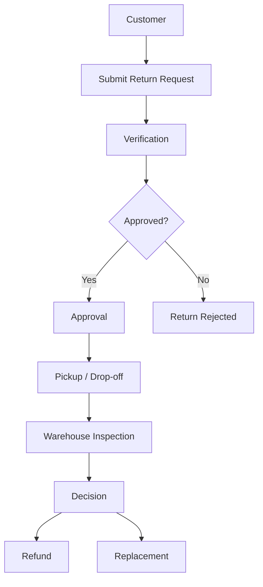
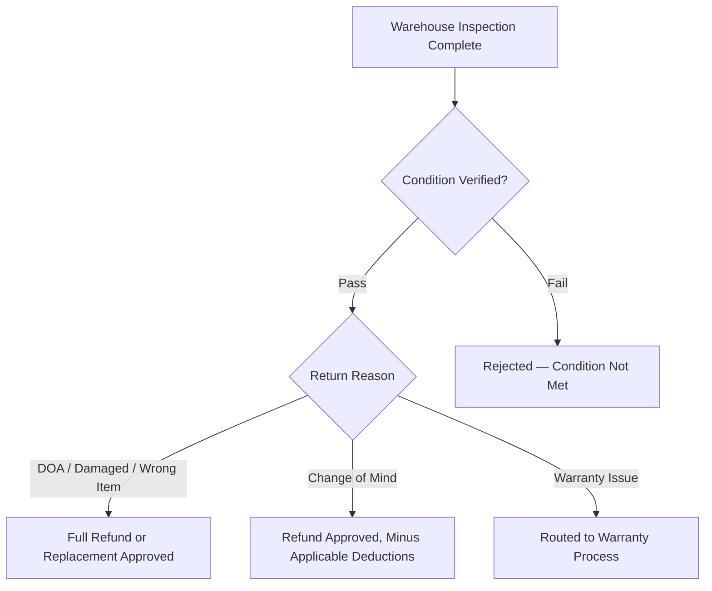
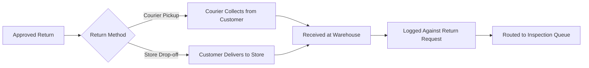

# Return & Replacement Policy

## 1. Document Purpose

This document defines the official Return & Replacement Policy for **StackLeo Tech Store**. It is the single source of truth for how returns, replacements, exchanges, and related refunds are evaluated, processed, and resolved across all sales channels.

This document is intended for use by customers, customer support, the operations team, the warehouse team, the finance team, the admin panel, the QA team, and — once activated — future marketplace sellers. It balances fair customer treatment with fraud prevention and operational efficiency, and serves as the authoritative reference underlying the return-related business rules defined in `business-rules.md` (Sections 7.4–7.5).

This document defines policy only. It does not describe implementation approach, technology choices, API design, or database structure, all of which are addressed in dedicated technical documentation elsewhere in the repository.

## 2. Return Policy Philosophy

StackLeo's return policy reflects the same trust-first philosophy defined in `mission.md`: customers should never feel penalized for receiving a defective, incorrect, or misrepresented product, while the policy must also protect the business from misuse, fraud, and unsustainable operational cost.

Returns are treated as a normal, expected part of retail operations — not as an adversarial process. At the same time, every return is subject to fair, consistent verification to protect genuine customers, honest sellers, and the long-term sustainability of the business.

## 3. Eligible Products

| Category | Return Eligibility |
|---|---|
| Smartphones, Laptops, Tablets | Eligible, subject to condition and time window requirements. |
| Smart Watches, Audio Devices | Eligible, subject to hygiene and packaging conditions defined in Section 4. |
| Computer Components | Eligible if uninstalled, unused, and in original condition. |
| Mobile & Laptop Accessories | Eligible, subject to hygiene-sensitive restrictions defined in Section 4. |
| Networking Devices | Eligible, subject to condition and original packaging requirements. |
| Gaming Accessories | Eligible, subject to hygiene-sensitive restrictions defined in Section 4. |
| Storage Devices | Eligible only if factory-sealed and unopened, due to data security sensitivity. |
| Office Electronics | Eligible, subject to condition and original packaging requirements. |

## 4. Non-Returnable Products

| Category | Reason for Exclusion |
|---|---|
| Opened Software Licenses | Software activation cannot be reliably reversed once a license is redeemed. |
| Gift Cards | Non-physical, non-reversible stored value instruments. |
| Downloadable Products | Digital delivery cannot be returned once accessed or downloaded. |
| Hygiene-Sensitive Accessories (e.g., earbuds, in-ear headphones) | Health and hygiene considerations once the product has been used or unsealed. |
| Customized or Personalized Products | Products modified to individual customer specification cannot be resold. |
| Clearance or Final Sale Items | Explicitly marked as non-returnable at the time of sale, where applicable. |

Non-returnable status must be clearly disclosed to the customer on the product listing prior to purchase.

## 5. Return Eligibility Conditions

| Rule ID | Description | Priority | Notes |
|---|---|---|---|
| BR-RET-001 | A return request must be submitted within the applicable return window defined in Section 6 for the relevant return reason. | Critical | Requests submitted after the window has closed are not eligible, except where required by applicable consumer protection law. |
| BR-RET-002 | The returned product must be in the condition it was received, free from user-induced damage, unless the return reason is Damaged Product or DOA. | Critical | Reasonable inspection wear from evaluation is acceptable; functional or cosmetic damage caused by misuse is not. |
| BR-RET-003 | The returned product must include its original packaging, where packaging is a standard part of the product presentation. | High | Missing packaging may result in a partial refund adjustment rather than outright rejection, at Admin discretion. |
| BR-RET-004 | All accessories, manuals, and included items originally shipped with the product must be returned together with the product. | High | Missing accessories may be handled per Section 20. |
| BR-RET-005 | A valid invoice or verifiable proof of purchase from StackLeo Tech Store must accompany the return request. | Critical | Order history lookup by verified account may substitute for a physical invoice. |
| BR-RET-006 | Where a physical warranty card was issued with the product, it must be presented for warranty-linked return evaluation. | Medium | Not applicable where warranty is tracked electronically against the order record. |
| BR-RET-007 | For serialized products (e.g., smartphones, laptops), the serial number or IMEI on the returned unit must match the serial number or IMEI recorded at the time of sale. | Critical | A mismatch triggers fraud review under Section 16. |

## 6. Return Time Window

| Return Reason | Return Window |
|---|---|
| Dead on Arrival (DOA) | 7 days from delivery |
| Wrong Product Delivered | 7 days from delivery |
| Damaged Product (in transit) | 3 days from delivery |
| Missing Items / Accessories | 7 days from delivery |
| Change of Mind | 3 days from delivery, unopened and unused only |
| Warranty-Related Issue | Per applicable warranty period, defined in `warranty-policy.md` |

Return windows are measured in calendar days from the confirmed delivery or store pickup date, consistent with `business-rules.md` (BR-069).

## 7. Return Request Process

| Return Status | Description |
|---|---|
| Requested | Customer has submitted a return request, pending initial verification. |
| Under Verification | Request is being checked against eligibility conditions and order records. |
| Approved | Request has passed verification and is authorized to proceed. |
| Rejected | Request does not meet eligibility conditions, per Section 9. |
| Pickup Scheduled / Drop-off Pending | Logistics arranged for the product to be returned to StackLeo. |
| In Transit to Warehouse | Product is being returned via courier or physical store. |
| Under Inspection | Product has arrived and is undergoing physical inspection, per Section 15. |
| Resolution Approved | Inspection confirms eligibility for refund, replacement, or exchange. |
| Refund Processed / Replacement Shipped | Final resolution has been executed. |
| Closed | Return case is fully resolved with no further pending action. |

## 8. Return Approval Rules

| Rule ID | Description | Priority | Notes |
|---|---|---|---|
| BR-RET-008 | A return is approved only after the returned product passes warehouse inspection against the eligibility conditions in Section 5. | Critical | None |
| BR-RET-009 | Returns for Dead on Arrival, Wrong Product, or Damaged Product reasons are approved for full refund or replacement once inspection confirms the reported condition. | Critical | None |
| BR-RET-010 | Change of Mind returns are approved only if the product is unopened, unused, and in fully resalable condition. | High | A restocking deduction may apply, per Section 14. |
| BR-RET-011 | Warranty-related issues identified during a return request must be routed to the warranty claim process defined in `warranty-policy.md`, rather than processed as a standard return. | High | None |

## 9. Return Rejection Rules

| Rule ID | Description | Priority | Notes |
|---|---|---|---|
| BR-RET-012 | A return request must be rejected if the return window defined in Section 6 has expired. | Critical | Exceptions may apply where required by applicable consumer protection law. |
| BR-RET-013 | A return request must be rejected if the product shows user-induced damage inconsistent with the stated return reason. | Critical | None |
| BR-RET-014 | A return request must be rejected if the serial number or IMEI does not match the original sale record. | Critical | Escalated to fraud review, per Section 16. |
| BR-RET-015 | A return request must be rejected if the product is listed as non-returnable under Section 4, unless the issue relates to a manufacturer defect covered by warranty. | High | None |
| BR-RET-016 | A rejected return must include a clear, documented reason communicated to the customer, with an option to escalate to customer support. | High | None |

## 10. Replacement Policy

| Rule ID | Description | Priority | Notes |
|---|---|---|---|
| BR-RET-017 | A replacement is offered only where equivalent stock of the same product and variant is available, consistent with `business-rules.md` (BR-071). | Critical | If unavailable, a refund must be offered instead. |
| BR-RET-018 | A replacement unit must be inspected prior to dispatch to confirm it is free from defects. | High | None |
| BR-RET-019 | Replacement shipments follow the same reverse and forward logistics standards as standard orders, per Section 13. | Medium | None |
| BR-RET-020 | A replacement request does not require additional payment from the customer where the original issue is attributable to StackLeo or a manufacturer defect. | Critical | None |

## 11. Exchange Policy

| Rule ID | Description | Priority | Notes |
|---|---|---|---|
| BR-RET-021 | An exchange for a different product, variant, or model is permitted only for Change of Mind returns meeting the conditions in BR-RET-010. | Medium | Not applicable to DOA, damaged, or warranty-related returns, which follow replacement rules instead. |
| BR-RET-022 | Where an exchange involves a price difference, the customer must pay any additional amount, or receive a refund of the difference, before the exchange is finalized. | High | None |
| BR-RET-023 | An exchange request is subject to the same return window as a standard Change of Mind return. | Medium | None |

## 12. Refund Policy Overview

| Refund Method | Description |
|---|---|
| Original Payment Method | Refunds for online payments are returned to the original card, mobile banking, or digital payment method used. |
| Cash on Delivery (COD) Refund | Refunded via bank transfer or mobile banking to the customer, since no original digital payment method exists. |
| Bank Transfer | Available as a refund method where the original payment method cannot be credited directly. |
| Mobile Banking (e.g., bKash, Nagad) | Available as a refund method for both online and COD orders, subject to customer-provided account details. |

| Rule ID | Description | Priority | Notes |
|---|---|---|---|
| BR-RET-024 | Refunds must be issued to the original payment method wherever technically possible, consistent with `business-rules.md` (BR-061). | High | COD orders default to bank transfer or mobile banking. |
| BR-RET-025 | Refund processing must begin only after warehouse inspection confirms return eligibility, except where a refund is issued in place of replacement due to stock unavailability. | Critical | None |
| BR-RET-026 | Refund processing time must be communicated to the customer at the time of return approval. | Medium | Typical processing time is defined through operational finance planning. |
| BR-RET-027 | Partial refunds apply where only part of a multi-item order is returned, calculated strictly against the returned items, consistent with `business-rules.md` (BR-062). | High | None |

## 13. Reverse Logistics Workflow

| Rule ID | Description | Priority | Notes |
|---|---|---|---|
| BR-RET-028 | Every returned product must be logged against its originating return request immediately upon receipt at the warehouse or store. | Critical | None |
| BR-RET-029 | Reverse logistics pickup must be scheduled through an approved courier partner, consistent with `shipping-policy.md`. | High | None |
| BR-RET-030 | A returned product must not be reintroduced to sellable inventory until it has passed inspection, per Section 15. | Critical | None |

## 14. Return Shipping Charges

| Responsibility Model | When It Applies |
|---|---|
| Company Pays | Applies to Dead on Arrival, Wrong Product Delivered, Damaged Product, and Missing Items returns, where the issue is attributable to StackLeo or the courier. |
| Customer Pays | Applies to Change of Mind returns, where the customer initiates the return for reasons unrelated to product or delivery fault. |
| Shared Responsibility | May apply to warranty-related returns where partial responsibility is determined during inspection, per the terms defined in `warranty-policy.md`. |

| Rule ID | Description | Priority | Notes |
|---|---|---|---|
| BR-RET-031 | Return shipping charges must be determined based on the return reason, per the responsibility model defined above. | High | None |
| BR-RET-032 | A restocking deduction may apply to Change of Mind returns to offset return shipping and handling cost. | Medium | Deduction amount is governed by `pricing-strategy.md`. |
| BR-RET-033 | Return shipping charges must be clearly communicated to the customer before pickup or drop-off is scheduled. | High | None |

## 15. Product Inspection Process

| Rule ID | Description | Priority | Notes |
|---|---|---|---|
| BR-RET-034 | Every returned product must undergo physical inspection against the eligibility conditions in Section 5 before a refund, replacement, or exchange is finalized. | Critical | None |
| BR-RET-035 | Inspection must verify serial number or IMEI match, physical condition, completeness of accessories, and packaging condition. | Critical | None |
| BR-RET-036 | Inspection outcomes must be documented and retained for audit purposes, consistent with `business-rules.md` (BR-104). | High | None |

## 16. Fraud Prevention Rules

| Rule ID | Description | Priority | Notes |
|---|---|---|---|
| BR-RET-037 | The serial number or IMEI of a returned serialized product must be verified against the original sale record before approval. | Critical | Mismatch results in automatic escalation to fraud review. |
| BR-RET-038 | Photo evidence of the reported issue (e.g., damage, wrong item) must be submitted by the customer at the time of return request for applicable return reasons. | High | Not required for Change of Mind returns. |
| BR-RET-039 | Purchase verification against StackLeo's order records is required before any return request is approved. | Critical | None |
| BR-RET-040 | Products showing evidence of tampering, unauthorized repair, or component substitution must be rejected and escalated for fraud review. | Critical | None |
| BR-RET-041 | Customers with a pattern of repeated, high-frequency return requests may be flagged for manual review before further returns are approved. | Medium | Threshold definitions maintained through operational fraud policy. |

## 17. Customer Responsibilities

- Submit return requests within the applicable return window defined in Section 6.
- Provide accurate information and, where required, photo evidence supporting the return reason.
- Return the product complete with original packaging and accessories, where applicable.
- Make the product reasonably available for courier pickup or deliver it to a store location as arranged.
- Cooperate with the inspection process and respond promptly to requests for additional information.

## 18. Company Responsibilities

- Provide a clear, accessible process for submitting and tracking return requests.
- Communicate return status changes promptly and transparently to the customer.
- Complete inspection and issue a decision within a reasonable, communicated timeframe.
- Process approved refunds, replacements, or exchanges promptly following decision.
- Apply return, rejection, and fraud prevention rules consistently and fairly across all customers.

## 19. Warranty vs Return Difference

| Aspect | Return | Warranty Claim |
|---|---|---|
| Purpose | Resolves issues with the original purchase transaction, such as wrong item, damage, or change of mind. | Resolves product defects or failures arising after purchase, within the manufacturer's or StackLeo's warranty period. |
| Time Window | Governed by the return windows in Section 6. | Governed by the applicable warranty period in `warranty-policy.md`. |
| Typical Resolution | Refund, replacement, or exchange. | Repair or replacement, per `warranty-policy.md`. |
| Condition Requirement | Product must generally be unused or in near-original condition, depending on reason. | Product may show normal usage wear; defect must be verified as covered under warranty terms. |

Where a request could reasonably be classified as either, it should default to the return process if within the return window, and to the warranty process thereafter.

## 20. Special Cases

| Case | Handling |
|---|---|
| Wrong Product Delivered | Treated as a Company Pays return; full refund or correct product replacement offered, with return shipping covered by StackLeo. |
| Courier Damage | Investigated jointly with the responsible courier partner per `shipping-policy.md`; customer is offered replacement or refund without needing to establish fault themselves. |
| Missing Accessories | Customer may request the missing accessory be shipped separately, or receive a partial refund reflecting the missing item's value. |
| Manufacturer Defect | Routed to the warranty process defined in `warranty-policy.md`, unless reported within the standard return window, in which case standard return handling applies. |
| Fake or Counterfeit Product Claim | Treated as a Critical priority case; escalated immediately for investigation, with the customer offered a full refund upon verification. |
| Partial Shipment | Missing items are shipped separately at no additional cost, or refunded if unavailable; the received items are not required to be returned. |

## 21. Marketplace Return Policy (Future)

Once multi-vendor marketplace capabilities described in `business-model.md` are activated, the following principles will govern seller-fulfilled returns:

- Marketplace sellers must honor, at minimum, the return windows and conditions defined in this policy.
- Return requests for marketplace seller products must be submitted through the same centralized StackLeo return process used for StackLeo-sold products, preserving a consistent customer experience.
- StackLeo will mediate disputes between customers and marketplace sellers that cannot be resolved directly, consistent with `business-rules.md` (BR-131).
- Refunds for marketplace seller orders will be processed through the escrow mechanism defined in `business-rules.md` (BR-132) prior to seller settlement.

This section will be expanded into full operational policy prior to marketplace launch.

## 22. Corporate Customer Return Policy

For future corporate and bulk buyers, referenced in `business-model.md` and `business-requirements.md`, return handling will differ from standard B2C returns as follows:

- Corporate returns will be governed by the terms specified in the applicable corporate sales agreement, which may define bulk-specific return windows and conditions.
- Bulk product returns will require pre-approval and a return manifest identifying affected units by serial number or SKU.
- Restocking deductions for corporate Change of Mind returns may differ from standard B2C terms, as negotiated per account.

Detailed corporate return terms will be finalized prior to the launch of corporate sales capabilities.

## 23. Return KPIs

| KPI | Description |
|---|---|
| Return Rate | Proportion of orders resulting in a return request, overall and by category. |
| Refund Processing Time | Average time from return approval to refund completion. |
| Replacement Time | Average time from return approval to replacement delivery. |
| Customer Satisfaction | Customer-reported satisfaction with the return experience. |
| Fraud Detection Rate | Proportion of return requests flagged and confirmed as fraudulent or policy-violating. |
| Return Rejection Rate | Proportion of return requests rejected, and the distribution of rejection reasons. |

## 24. Governance

| Role | Responsibility |
|---|---|
| Business Analyst | Maintains and updates this return policy document. |
| Operations Team | Executes return, inspection, and reverse logistics processes in line with this policy. |
| Finance Function | Oversees refund processing accuracy and reconciliation. |
| QA Team | Monitors return and inspection outcomes for quality and consistency issues. |
| Founder / Business Owner | Approves material changes to return policy terms affecting customer experience or cost exposure. |

Any change to this policy must be reflected by updating this document, incrementing its version number, and recording the change in `00_Project_Overview/changelog.md`. Changes affecting refund timelines, non-returnable categories, or fraud thresholds require review consistent with the approval process defined in `business-rules.md` (Section 20.5).

## 25. Future Improvements

- Extend return and inspection processes to support multiple warehouse locations with location-aware routing.
- Formalize in-store return handling for products originally purchased online, and vice versa.
- Expand fraud prevention with AI-assisted detection for pattern-based return abuse, once such capability is evaluated under `business-rules.md` (Section 19).
- Introduce marketplace seller-specific return dashboards and dispute workflows ahead of marketplace launch.
- Evaluate international return logistics in connection with future regional expansion referenced in `vision.md`.
- Introduce dedicated corporate return workflows aligned with negotiated account terms.

## 26. Document Information

| Property | Value |
|----------|-------|
| Document | return-policy.md |
| Version | 1.0.0 |
| Status | Active |
| Maintained By | StackLeo |
| Last Updated | 2026-07-17 |

---

© StackLeo. All Rights Reserved.
