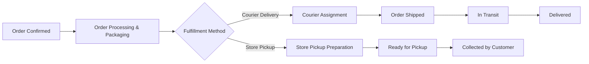
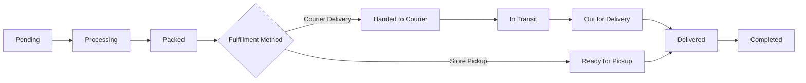
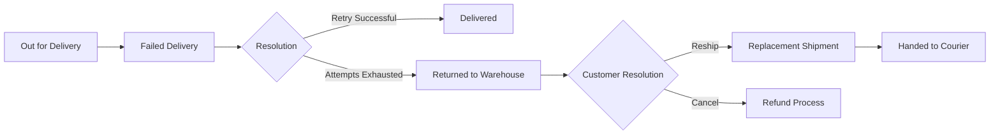

# Shipping Policy

## 1. Document Purpose

This document defines the official shipping and delivery policy for **StackLeo Tech Store**. It explains shipping methods, delivery zone classification, logistics workflows, shipping charges, service levels, customer responsibilities, and operational policies governing order delivery.

This document serves as the official logistics policy reference for customers, operations, customer support, and future product development. Detailed shipping business rules are documented in `business-rules.md` (Section 8); this document defines the strategic and customer-facing policy behind those rules.

This document describes shipping policy at a business level. It does not describe implementation approach, technology choices, courier system integrations, or platform design, all of which are addressed in dedicated technical documentation elsewhere in the repository.

## 2. Shipping Philosophy

Shipping and delivery form a critical part of the trust StackLeo aims to build with customers, as defined in `vision.md` and `mission.md`. A reliable, transparent, and consistent delivery experience reinforces the confidence customers place in StackLeo Tech Store as a single, dependable marketplace.

StackLeo's shipping philosophy prioritizes accurate delivery estimates, transparent charges, and dependable courier partnerships over the lowest possible cost, ensuring that the delivery experience reflects the same trustworthiness customers expect from the products they purchase.

## 3. Shipping Methods

| Shipping Method | Description |
|---|---|
| Courier Delivery | Orders delivered to the customer's specified address through an approved courier partner. |
| Store Pickup | Orders reserved for collection directly at a StackLeo physical retail location. |

StackLeo works with multiple courier partners to ensure reliable coverage and service continuity across delivery zones.

| Courier Partner | Role |
|---|---|
| SteadFast | Primary courier partner for standard nationwide delivery. |
| Pathao Courier | Courier partner supporting urban and same-day delivery capable areas. |
| RedX | Courier partner supporting nationwide delivery coverage. |
| Paperfly | Courier partner supporting nationwide and last-mile delivery coverage. |
| Store Pickup | Direct handover of orders at a StackLeo physical retail location. |

Courier partner assignment for a given order is determined by delivery zone, order characteristics, and courier availability, consistent with `business-rules.md` (BR-074).

## 4. Delivery Coverage

StackLeo Tech Store delivers to serviceable areas within Bangladesh, as supported by its courier partner network. Coverage is expected to expand over time as courier partnerships and delivery infrastructure grow.

| Coverage Type | Description |
|---|---|
| Nationwide Courier Coverage | Delivery available across areas serviced by StackLeo's courier partners. |
| Store Pickup Coverage | Available at StackLeo physical retail store locations. |
| Non-Serviceable Areas | Areas not currently covered by any courier partner; orders to these areas cannot be placed for delivery. |

Checkout must prevent order placement for delivery to non-serviceable addresses, consistent with `business-rules.md` (BR-075).

## 5. Delivery Zone Classification

Delivery zones are classified based on courier density, infrastructure maturity, and expected delivery performance. Zone classification determines applicable delivery charges, expected delivery times, and courier availability.

| Attribute | Zone A — Dhaka Metro | Zone B — Major Cities | Zone C — District Towns | Zone D — Remote Areas |
|---|---|---|---|---|
| Coverage | Dhaka city and immediate metropolitan area. | Chattogram, Sylhet, Khulna, Rajshahi, and other major divisional cities. | District and sub-district town centers across Bangladesh. | Rural, hard-to-reach, or low courier-density locations. |
| Expected Delivery Time | 1–2 business days | 2–3 business days | 3–5 business days | 5–8 business days |
| Standard Shipping Charge | Lowest standard charge | Standard charge | Moderate charge | Highest standard charge |
| Courier Availability | All courier partners (SteadFast, Pathao Courier, RedX, Paperfly) | SteadFast, RedX, Paperfly; Pathao Courier where serviceable | SteadFast, RedX, Paperfly | SteadFast, RedX, Paperfly, subject to last-mile network reach |
| Special Restrictions | Same-day or express delivery may be available in select areas. | Standard delivery only; express delivery not guaranteed. | Cash on Delivery limits may apply for high-value orders, per `business-rules.md` (BR-055). | Certain bulky or high-value products may require Store Pickup or advance confirmation before dispatch. |

Exact zone boundaries and courier assignment per postal area are maintained and updated through operational logistics planning, in coordination with courier partners.

## 6. Estimated Delivery Times

| Zone | Estimated Delivery Time |
|---|---|
| Zone A — Dhaka Metro | 1–2 business days |
| Zone B — Major Cities | 2–3 business days |
| Zone C — District Towns | 3–5 business days |
| Zone D — Remote Areas | 5–8 business days |
| Store Pickup | Available once the order is confirmed as ready for collection, typically within 1 business day for in-stock items. |

Estimated delivery times are indicative and may vary due to courier operating conditions, weather, national holidays, or other circumstances outside StackLeo's direct control, as addressed in Section 15.

## 7. Shipping Charges

Shipping charges are calculated based on delivery zone and, where applicable, order weight or value, consistent with `business-rules.md` (BR-077) and `pricing-strategy.md` (Section 14).

| Zone | Illustrative Delivery Charge |
|---|---|
| Zone A — Dhaka Metro | Lowest standard charge, reflecting shorter delivery distance and courier density. |
| Zone B — Major Cities | Standard charge. |
| Zone C — District Towns | Moderate charge, reflecting extended courier network reach. |
| Zone D — Remote Areas | Highest standard charge, reflecting limited courier density and last-mile complexity. |
| Store Pickup | No delivery charge applies. |

Exact delivery charge amounts are maintained and updated through pricing governance defined in `pricing-strategy.md` and must be clearly displayed to the customer before checkout confirmation.

## 8. Free Shipping Policy

- StackLeo may offer free shipping on orders meeting a defined minimum order value, as an ongoing or promotional incentive.
- Free shipping eligibility, where active, must be clearly communicated to the customer prior to checkout.
- Free shipping promotions must be evaluated for margin impact prior to activation, consistent with `pricing-strategy.md` (Section 19).
- Free shipping thresholds may vary by delivery zone to reflect differences in delivery cost.

## 9. Order Processing Workflow

- **Order Confirmed** — The order has passed checkout validation and payment confirmation.
- **Order Processing & Packaging** — The order is picked, packed, and prepared for its fulfillment method.
- **Courier Assignment** — The order is assigned to an appropriate courier partner based on delivery zone.
- **Store Pickup Preparation** — The order is prepared and held at the designated store location.
- **Shipped / Ready for Pickup** — The customer is notified that the order is in transit or ready for collection.
- **Delivered / Collected** — The order reaches its final fulfillment outcome.

## 10. Courier Assignment Policy

### 10.1 Automatic Courier Selection

- By default, courier partner assignment is determined automatically based on the order's delivery zone, courier availability, and courier SLA performance.
- Automatic selection must prioritize the courier partner with the best available combination of coverage reliability and expected delivery time for the given zone.
- Automatic selection must fall back to the next best-performing available courier if the preferred courier partner cannot service the order.

### 10.2 Manual Courier Assignment

- Manual courier assignment by an authorized Admin role is permitted for exceptional cases, such as high-value orders, bulky items, or known courier service disruptions.
- Manual assignment must be recorded with a reason, consistent with the audit logging requirement in `business-rules.md` (BR-104).

### 10.3 Courier SLA

- Each courier partner must be evaluated against defined Service Level Agreement (SLA) expectations, including on-time delivery rate and failed delivery rate.
- Courier partners falling consistently below agreed SLA thresholds must be reviewed for reduced order allocation or partnership reassessment.

### 10.4 Delivery Optimization

- Courier assignment should account for delivery cost efficiency alongside reliability, avoiding unnecessary cost where multiple courier partners offer comparable service levels.
- Delivery optimization should consider order consolidation where multiple orders are destined for the same or adjacent delivery areas.

### 10.5 Store Pickup Eligibility

- An order is eligible for store pickup only when the ordered stock is confirmed available at the selected store location, consistent with `business-rules.md` (BR-079).
- Store pickup eligibility must be clearly indicated to the customer at checkout, based on real-time store-level stock visibility.

## 11. Warehouse Fulfillment Policy

- Orders must be picked and packed accurately against the confirmed order details prior to handover to a courier partner or store pickup preparation.
- Stock must be validated at the point of packaging to confirm continued availability, consistent with inventory rules defined in `business-rules.md` (Section 3).
- Fulfillment processing times should remain consistent regardless of which courier partner is subsequently assigned.

## 12. Store Pickup Policy

- Store pickup is available only where the ordered stock is confirmed available at the selected store location, consistent with `business-rules.md` (BR-079).
- Customers must be notified once their order is ready for collection.
- Customers must present valid order confirmation and identification matching the order details at the time of pickup.
- Orders not collected within a defined holding period must be returned to available inventory, with the customer notified accordingly.

## 13. Delivery Status Lifecycle

Every order fulfilled through courier delivery or store pickup progresses through a defined sequence of delivery statuses, providing customers and operations with clear visibility into order progress.

| Status | Description |
|---|---|
| Pending | Order confirmed but not yet started processing. |
| Processing | Order is being picked and prepared for packaging. |
| Packed | Order is packed and ready for handover, either to a courier or to store pickup holding. |
| Ready for Pickup | Order is available for customer collection at the selected store location. |
| Handed to Courier | Order has been handed to the assigned courier partner. |
| In Transit | Order is moving through the courier network toward the delivery destination. |
| Out for Delivery | Order is with the local delivery agent for final-mile delivery. |
| Delivered | Order has been successfully delivered to, or collected by, the customer. |
| Completed | Order is confirmed as fully resolved, with no pending delivery, return, or dispute action. |

### 13.1 Exception Flows

| Exception Flow | Description |
|---|---|
| Failed Delivery | Triggered when a delivery attempt is unsuccessful, per Section 14. The order re-enters delivery attempt handling, subject to the maximum attempts policy in `business-rules.md` (BR-081). |
| Returned to Warehouse | Triggered when delivery attempts are exhausted or an order is refused; stock is returned to inventory and the customer is notified. |
| Replacement Shipment | Triggered when the customer opts to have the order reshipped following a return to warehouse or a confirmed return/warranty resolution, subject to stock availability per `business-rules.md` (BR-071). |
| Refund Process | Triggered when the customer opts for cancellation or refund instead of reshipment, following the refund rules defined in `business-rules.md` (Section 6.4). |

## 14. Failed Delivery Policy

- A failed delivery attempt must be recorded, and the customer must be notified with instructions for re-delivery or alternative resolution, consistent with `business-rules.md` (BR-080).
- StackLeo defines a maximum number of delivery attempts per order, beyond which the order is returned to inventory and the customer is contacted directly, consistent with `business-rules.md` (BR-081).
- Repeated failed deliveries attributable to incorrect or incomplete address information provided by the customer may result in additional delivery charges for re-attempted delivery.

## 15. Delivery Exceptions

The following circumstances may affect estimated delivery times and are considered outside StackLeo's direct operational control:

- National holidays and public observances affecting courier operations.
- Severe weather conditions or natural events disrupting transportation.
- Regional disruptions affecting courier network operations, particularly in Zone C and Zone D areas.
- Unforeseen courier partner service interruptions.

StackLeo will communicate known, significant delivery exceptions to affected customers as promptly as possible.

## 16. Packaging Standards

- All products must be packaged to prevent damage during transit, appropriate to the product category and its fragility.
- Packaging must protect customer privacy by avoiding external indication of product contents where reasonably practicable.
- Packaging must include all required order documentation, such as the invoice, consistent with `business-rules.md` (BR-072).

## 17. Shipment Tracking

- Every shipped order must provide the customer with accessible tracking information, consistent with `business-rules.md` (BR-076).
- Tracking information must reflect the order's current status within the delivery status lifecycle defined in Section 13.
- Customers should be able to access tracking information through their order history at any point after the order is handed to a courier.

## 18. Customer Responsibilities

- Customers are responsible for providing complete and accurate delivery address and contact information at checkout.
- Customers are responsible for being reasonably available to receive delivery within the estimated delivery window, or for promptly arranging an alternative as needed.
- Customers selecting store pickup are responsible for collecting their order within the defined holding period.
- Customers are responsible for promptly reporting any delivery issue, so that StackLeo can take timely corrective action.

## 19. Lost or Damaged Shipment Policy

- Any shipment reported lost in transit must be investigated with the responsible courier partner, and the customer must be offered a replacement or refund upon confirmation of loss.
- Any shipment reported damaged upon delivery must be reviewed against the condition requirements defined in `return-policy.md`, and resolved through replacement or refund as appropriate.
- Customers should report lost or damaged shipments as promptly as possible to support timely investigation and resolution.

## 20. Delivery SLA Targets

| SLA Metric | Target |
|---|---|
| On-Time Delivery Rate | Consistently high proportion of orders delivered within their estimated delivery window, per zone. |
| Failed Delivery Rate | Consistently low proportion of orders experiencing failed delivery attempts. |
| Order Processing Time | Orders processed and handed to courier or prepared for pickup within a defined standard timeframe after confirmation. |
| Return to Origin (RTO) Rate | Consistently low proportion of orders returned to warehouse due to exhausted delivery attempts or refusal. |
| Lost Shipment Rate | Consistently low proportion of shipments reported lost in transit. |

Specific numeric SLA targets and thresholds are to be defined and maintained through dedicated operational planning, in coordination with courier partners.

## 21. Shipping KPIs

| KPI | Description |
|---|---|
| On-Time Delivery Rate | Proportion of orders delivered within the estimated delivery window for their zone. |
| Average Delivery Time | Average time elapsed from order handover to courier through to delivery confirmation. |
| Failed Delivery Rate | Proportion of delivery attempts that are unsuccessful. |
| RTO Rate | Proportion of orders returned to warehouse following exhausted delivery attempts or customer refusal. |
| Shipping Cost per Order | Average delivery cost incurred per order, tracked by zone and courier partner. |
| Courier SLA Compliance | Proportion of orders fulfilled by each courier partner within agreed SLA targets. |
| Customer Satisfaction Score | Customer-reported satisfaction specifically related to the delivery experience. |

## 22. Future Logistics Roadmap

- Evaluate the introduction of an own delivery fleet to supplement courier partnerships, improving control over delivery consistency and cost, particularly within Zone A and Zone B.
- Expand delivery coverage and reduce delivery times within Zone C and Zone D as courier network reach grows.
- Introduce international shipping capability in connection with future regional expansion, subject to establishing reliable international courier or freight partnerships and applicable customs and compliance requirements.
- Explore additional delivery options, such as scheduled or same-day delivery, in high-density urban areas as demand and courier capability allow.
- Integrate delivery performance data more closely into courier partner selection and review processes, per Section 10.3.

## 23. Document Information

| Property | Value |
|----------|-------|
| Document | shipping-policy.md |
| Version | 1.0.0 |
| Status | Active |
| Maintained By | StackLeo |
| Last Updated | 2026-07-17 |

---

© StackLeo. All Rights Reserved.
