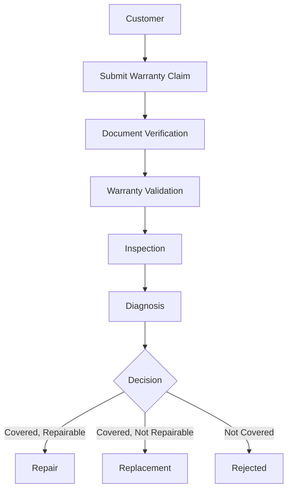
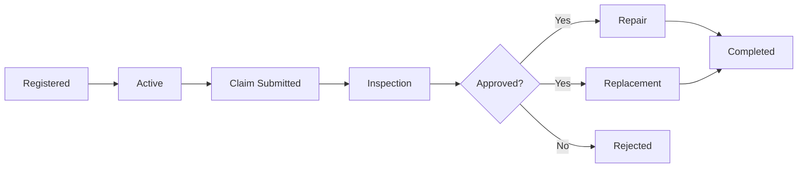

# Warranty Policy

## 1. Document Purpose

This document defines the official Warranty Policy for **StackLeo Tech Store**. It is the single source of truth for warranty eligibility, coverage, exclusions, claim processes, repair and replacement conditions, service workflows, and governance.

This document is intended for use by customers, customer support, the sales team, the warehouse team, the service team, the warranty team, the finance team, the operations team, the admin team, and — once activated — future marketplace sellers. It works alongside `return-policy.md`, which governs return and replacement outside of warranty-based claims, and `business-rules.md` (Section 9), which defines the underlying warranty business rules.

This document defines policy only. It does not describe implementation approach, technology choices, API design, or database structure, all of which are addressed in dedicated technical documentation elsewhere in the repository.

## 2. Warranty Philosophy

Warranty coverage is one of the clearest expressions of the trust StackLeo commits to its customers, as defined in `vision.md` and `mission.md`. A customer who purchases a genuine product from StackLeo should never be left without recourse when a legitimate manufacturing defect or hardware failure occurs.

At the same time, warranty coverage must be applied fairly and consistently, protecting the business from misuse, fraudulent claims, and unsustainable service cost. StackLeo's warranty philosophy is to be generous and transparent with genuine claims, while remaining firm and consistent against claims that fall outside defined coverage.

## 3. Warranty Overview

Every product sold through StackLeo Tech Store carries warranty coverage — either a manufacturer warranty administered on the brand's behalf, or a StackLeo-issued warranty where no manufacturer warranty applies. Warranty coverage applies consistently across all sales channels, including the online store and physical retail store, and is designed to extend cleanly to future channels such as the mobile app, POS, and marketplace.

Warranty coverage is distinct from the return and replacement rights described in `return-policy.md`. Returns address issues with the original purchase transaction; warranty addresses product failures arising during ownership, within the applicable coverage period.

## 4. Warranty Types

| Warranty Type | Description | Status |
|---|---|---|
| Manufacturer Warranty | Warranty coverage provided directly by the product's brand or manufacturer, administered through StackLeo as the point of sale and, where applicable, service coordination. | Current |
| StackLeo Warranty | A StackLeo-issued service warranty applied where no manufacturer warranty exists or where StackLeo chooses to supplement brand coverage. | Current |
| Extended Warranty | An optional, customer-purchased warranty extension beyond the standard coverage period, referenced as a revenue stream in `business-model.md`. | Current |
| International Warranty (Future) | Warranty honored across international markets StackLeo may enter in the future, subject to regional service partnerships. | Future |
| Seller Warranty (Future) | Warranty coverage provided by individual marketplace sellers once multi-vendor marketplace capabilities are activated. | Future |

## 5. Warranty Coverage

The following are generally covered under manufacturer and StackLeo warranty terms, subject to the specific terms applicable to each product category:

| Covered Item | Description |
|---|---|
| Manufacturing Defects | Faults present in the product due to errors in the manufacturing process. |
| Hardware Failure | Failure of internal components under normal, intended use conditions. |
| Factory Defects | Defects existing at the time of manufacture, not caused by use, handling, or shipping. |
| Functional Issues | Product failing to perform its intended core function despite normal, intended use. |

Warranty coverage applies only to defects arising under normal use consistent with the manufacturer's intended purpose for the product.

## 6. Warranty Exclusions

| Excluded Item | Description |
|---|---|
| Physical Damage | Cracks, dents, or breakage caused by impact, dropping, or mishandling. |
| Water Damage | Damage caused by liquid exposure, unless the product is explicitly rated for such exposure and used within rated limits. |
| Burn Damage | Damage caused by fire, excessive heat exposure, or improper charging equipment. |
| Electrical Surge Damage | Damage caused by power surges, unstable power sources, or use of incompatible power equipment. |
| Unauthorized Repair | Damage or malfunction resulting from repair attempted outside brand-authorized or StackLeo-approved service channels. |
| Missing or Altered Serial Number | Products with a missing, removed, or altered serial number or IMEI. |
| Modified Products | Products that have been physically or functionally modified from their original manufactured state. |
| Customer Negligence | Damage resulting from misuse, improper storage, or failure to follow manufacturer usage guidelines. |

| Rule ID | Rule Name | Description | Business Reason | Priority | Exceptions | Future Notes |
|---|---|---|---|---|---|---|
| WR-001 | Physical Damage Exclusion | Warranty does not cover damage caused by impact, dropping, or mishandling. | Prevents warranty misuse for damage outside manufacturing responsibility. | Critical | None | — |
| WR-002 | Water Damage Exclusion | Warranty does not cover liquid damage unless the product is rated for such exposure and used within rated limits. | Protects against claims for damage outside intended use conditions. | Critical | Products with verified liquid-resistance ratings are evaluated against their specific rating. | — |
| WR-003 | Burn Damage Exclusion | Warranty does not cover damage from fire, excessive heat, or improper charging equipment. | Excludes damage caused by external hazards or incompatible accessories. | Critical | None | — |
| WR-004 | Electrical Surge Exclusion | Warranty does not cover damage caused by power surges or incompatible power sources. | Excludes damage caused by external electrical conditions outside product defect. | Critical | None | — |
| WR-005 | Unauthorized Repair Exclusion | Warranty is void if the product has been serviced outside brand-authorized or StackLeo-approved channels. | Protects service quality standards and prevents further damage from unqualified repair. | Critical | None | — |
| WR-006 | Missing Serial Number Exclusion | Warranty cannot be validated or honored if the serial number or IMEI is missing, removed, or altered. | Serial number is the basis for ownership and coverage verification. | Critical | None | — |
| WR-007 | Modified Product Exclusion | Warranty is void for products that have been physically or functionally modified from their original state. | Modifications can introduce faults unrelated to original manufacturing. | Critical | None | — |
| WR-008 | Customer Negligence Exclusion | Warranty does not cover damage resulting from misuse or failure to follow manufacturer usage guidelines. | Distinguishes manufacturing responsibility from customer handling responsibility. | High | None | — |

## 7. Warranty Duration

| Product Category | Standard Warranty Duration |
|---|---|
| Smartphones | 12 months (manufacturer), extendable |
| Laptops | 12–24 months, depending on brand policy |
| Tablets | 12 months (manufacturer), extendable |
| Smart Watches | 12 months (manufacturer) |
| Computer Components | 12–36 months, depending on component type and brand |
| Accessories | 3–6 months (StackLeo warranty, where no manufacturer warranty applies) |
| Networking Devices | 12–24 months, depending on brand policy |
| Storage Devices | 12–60 months, depending on product tier and brand policy |

Exact warranty durations are determined by brand-specific manufacturer terms where applicable, or by the StackLeo warranty schedule maintained by the warranty team where no manufacturer warranty exists.

## 8. Warranty Registration Policy

| Rule ID | Rule Name | Description | Business Reason | Priority | Exceptions | Future Notes |
|---|---|---|---|---|---|---|
| WR-009 | Automatic Warranty Activation | Warranty coverage begins automatically from the confirmed delivery or store pickup date, without requiring separate customer registration. | Reduces friction and ensures no customer is unintentionally left uncovered. | Critical | Certain brands may require formal registration directly with the manufacturer; StackLeo will communicate this where applicable. | Digital warranty cards, per Section 28, will formalize activation records. |
| WR-010 | Warranty Record Linked to Order | Warranty coverage is linked to the original order record, serial number, and customer account. | Enables accurate, verifiable warranty status lookup. | Critical | None | QR code verification, per Section 28, will allow direct lookup from the physical product. |
| WR-011 | Extended Warranty Registration | Extended warranty coverage, where purchased, must be recorded against the specific product serial number at the time of sale. | Ensures extended coverage is applied to the correct unit. | High | None | — |

## 9. Warranty Claim Process

| Rule ID | Rule Name | Description | Business Reason | Priority | Exceptions | Future Notes |
|---|---|---|---|---|---|---|
| WR-012 | Claim Submission Requirement | A warranty claim must be submitted with a description of the issue and the required documents defined in Section 10. | Ensures sufficient information to begin verification. | Critical | None | Future self-service portal, per Section 28, will streamline submission. |
| WR-013 | Claim Window Enforcement | A warranty claim must be submitted within the applicable warranty duration defined in Section 7. | Establishes clear, fair boundaries for coverage. | Critical | None | — |
| WR-014 | Sequential Claim Validation | A claim must pass document verification and warranty validation before proceeding to physical inspection. | Prevents unnecessary logistics cost for claims that are clearly ineligible. | High | None | — |
| WR-015 | Claim Decision Communication | The customer must be informed of the claim decision (repair, replacement, or rejection) with a clear explanation. | Maintains transparency and customer trust throughout the process. | High | None | — |

## 10. Required Documents

| Document | Purpose |
|---|---|
| Invoice | Confirms the product was purchased from StackLeo Tech Store and establishes the purchase date. |
| Warranty Card | Confirms warranty terms where a physical card was issued with the product. |
| Serial Number | Confirms the specific unit's identity for coverage verification. |
| IMEI (where applicable) | Confirms the specific mobile device's identity, used alongside or in place of serial number for mobile devices. |
| Purchase Verification | Confirms the transaction against StackLeo's order records, particularly where a physical invoice is unavailable. |

| Rule ID | Rule Name | Description | Business Reason | Priority | Exceptions | Future Notes |
|---|---|---|---|---|---|---|
| WR-016 | Invoice or Order Record Requirement | A warranty claim must be supported by a valid invoice or a verifiable StackLeo order record. | Confirms the product was genuinely purchased from StackLeo. | Critical | Verified account order history may substitute for a physical invoice. | — |
| WR-017 | Serial Number / IMEI Match Requirement | The serial number or IMEI on the product must match the number recorded at the time of sale. | Confirms the unit under claim is the unit originally purchased. | Critical | None | — |
| WR-018 | Warranty Card Presentation | Where a physical warranty card was issued, it should be presented to support the claim, where available. | Supports verification where separate physical documentation exists. | Medium | Not required where warranty is tracked electronically against the order. | Digital warranty cards, per Section 28, are intended to eventually replace physical cards. |

## 11. Product Inspection Process

| Rule ID | Rule Name | Description | Business Reason | Priority | Exceptions | Future Notes |
|---|---|---|---|---|---|---|
| WR-019 | Mandatory Physical Inspection | Every warranty claim involving a physical defect must undergo inspection before a repair or replacement decision is made. | Confirms the reported issue and its cause before committing service resources. | Critical | None | — |
| WR-020 | Inspection Documentation | Inspection findings must be documented, including cause of failure and coverage determination. | Supports audit accountability and consistent decision-making. | High | None | — |
| WR-021 | Inspection Timeframe | Inspection must be completed within a defined standard timeframe from product receipt. | Maintains customer confidence in claim resolution speed. | High | None | See Repair Time SLA, Section 21. |

## 12. Repair Policy

| Rule ID | Rule Name | Description | Business Reason | Priority | Exceptions | Future Notes |
|---|---|---|---|---|---|---|
| WR-022 | Repair as Default Resolution | Repair is the default resolution for covered defects where the product can be restored to normal function. | Balances customer satisfaction with cost-effective resolution. | High | Replacement is used where repair is not feasible, per Section 13. | — |
| WR-023 | Authorized Repair Channel Only | Warranty repairs must be performed only through brand-authorized or StackLeo-approved repair channels. | Preserves repair quality and warranty validity. | Critical | None | Authorized repair partner network expansion is addressed in Section 28. |
| WR-024 | Genuine Spare Parts Requirement | Repairs must use genuine or brand-approved spare parts only. | Preserves product quality, safety, and warranty integrity. | Critical | None | See Section 20. |
| WR-025 | Repair Outcome Verification | A repaired product must be tested and verified as fully functional before being returned to the customer. | Prevents recurring issues and repeat claims. | High | None | — |

## 13. Replacement Policy

| Rule ID | Rule Name | Description | Business Reason | Priority | Exceptions | Future Notes |
|---|---|---|---|---|---|---|
| WR-026 | Replacement When Repair Is Not Feasible | A replacement is offered when the product cannot be repaired, or when repair is not offered for the product category. | Ensures a fair resolution when repair is not a viable option. | Critical | None | — |
| WR-027 | Like-for-Like Replacement | Replacement units must match the original product's model and specification wherever possible. | Ensures fair, equivalent resolution for the customer. | High | If the exact model is unavailable, a comparable or upgraded unit may be offered with customer consent. | — |
| WR-028 | Replacement Stock Dependency | A replacement is subject to the availability of equivalent stock, consistent with `business-rules.md` (BR-071). | Prevents commitments the business cannot immediately fulfill. | High | If stock is unavailable, a refund or store credit alternative must be offered. | — |
| WR-029 | Replacement Warranty Continuity | A replacement unit carries the remainder of the original warranty period, not a new full warranty term, unless otherwise specified by the brand. | Prevents unintended extension of coverage through repeated replacement. | Medium | Brand policy may specify a new warranty term for certain categories. | — |

## 14. Dead on Arrival (DOA) Policy

| Rule ID | Rule Name | Description | Business Reason | Priority | Exceptions | Future Notes |
|---|---|---|---|---|---|---|
| WR-030 | DOA Definition | A product is considered Dead on Arrival if it fails to function upon first use within the DOA window defined in `return-policy.md` (Section 6). | Provides a clear, time-bound definition distinguishing DOA from later warranty claims. | Critical | None | — |
| WR-031 | DOA Priority Handling | DOA claims must be prioritized for expedited inspection and resolution ahead of standard warranty claims. | Minimizes customer inconvenience for a failure present from first use. | Critical | None | — |
| WR-032 | DOA Resolution Default | DOA claims default to full replacement rather than repair, subject to stock availability. | A brand-new product failing immediately warrants replacement rather than repair. | High | If replacement stock is unavailable, a full refund must be offered. | — |

## 15. Service Center Policy

| Rule ID | Rule Name | Description | Business Reason | Priority | Exceptions | Future Notes |
|---|---|---|---|---|---|---|
| WR-033 | Approved Service Center Requirement | Warranty repairs must be conducted only at brand-authorized or StackLeo-approved service centers. | Preserves repair quality and warranty validity. | Critical | None | Authorized repair partner network expansion, per Section 28. |
| WR-034 | Service Center Capacity Planning | Service center capacity must be reviewed periodically against warranty claim volume to maintain repair time SLA targets. | Prevents service delays from capacity shortfalls. | Medium | None | Multiple service center support, per Section 28. |
| WR-035 | Service Center Accountability | Each service center's repair outcomes must be tracked for quality and turnaround performance. | Supports consistent service quality across locations and partners. | Medium | None | — |

## 16. Warranty Status Lifecycle

| Status | Description |
|---|---|
| Registered | Warranty coverage is recorded against the product at the time of sale. |
| Active | Warranty is currently within its valid coverage period. |
| Claim Submitted | Customer has submitted a warranty claim for an active warranty. |
| Inspection | Claimed product is undergoing physical inspection and diagnosis. |
| Approved | Claim has passed inspection and is authorized for repair or replacement. |
| Rejected | Claim does not meet warranty coverage conditions. |
| Repair | Product is undergoing authorized repair. |
| Replacement | Product is being replaced with an equivalent unit. |
| Completed | Claim is fully resolved, with the product repaired, replaced, or the claim closed. |

## 17. Customer Responsibilities

- Use the product in accordance with the manufacturer's intended purpose and usage guidelines.
- Retain the invoice, warranty card, and original packaging where reasonably practicable.
- Submit warranty claims within the applicable coverage period, with accurate issue descriptions.
- Make the product available for inspection or service center drop-off as arranged.
- Avoid seeking repair through unauthorized channels, which may void warranty coverage.

## 18. Company Responsibilities

- Clearly communicate warranty terms, duration, and exclusions at the point of sale.
- Provide an accessible, transparent warranty claim process across all sales channels.
- Coordinate promptly with brands and authorized service centers to resolve claims.
- Complete inspection, diagnosis, and resolution within communicated SLA targets.
- Apply warranty coverage, exclusions, and fraud prevention rules consistently and fairly.

## 19. Brand Responsibilities

- Honor the manufacturer warranty terms applicable to their products, as represented to StackLeo and customers.
- Provide StackLeo and authorized service centers with the necessary repair support, spare parts, and technical documentation.
- Communicate any changes to warranty terms or coverage promptly to StackLeo.
- Support timely resolution of claims routed through StackLeo as the point of sale.

## 20. Spare Parts Policy

| Rule ID | Rule Name | Description | Business Reason | Priority | Exceptions | Future Notes |
|---|---|---|---|---|---|---|
| WR-036 | Genuine Parts Requirement | Only genuine or brand-approved spare parts may be used in warranty repairs. | Preserves product safety, quality, and warranty integrity. | Critical | None | — |
| WR-037 | Spare Parts Availability Tracking | Spare parts availability must be tracked to support accurate repair time estimates. | Prevents delays and supports SLA compliance. | Medium | None | — |
| WR-038 | Spare Parts Sourcing Priority | Spare parts must be sourced from the brand or its authorized distributors before any alternative approved source is considered. | Ensures parts authenticity and warranty compliance. | High | None | — |

## 21. Repair Time SLA

| SLA Metric | Target |
|---|---|
| Inspection Completion Time | Completed within a defined standard timeframe from product receipt. |
| Repair Turnaround Time | Completed within a defined standard timeframe from diagnosis confirmation. |
| Replacement Dispatch Time | Replacement unit dispatched within a defined standard timeframe from approval. |
| Claim-to-Resolution Time | Total time from claim submission to final resolution, tracked and reviewed periodically. |

| Rule ID | Rule Name | Description | Business Reason | Priority | Exceptions | Future Notes |
|---|---|---|---|---|---|---|
| WR-039 | SLA Target Communication | Repair and replacement SLA targets must be communicated to the customer at claim approval. | Sets clear expectations and reduces support inquiries. | High | None | — |
| WR-040 | SLA Breach Escalation | Claims exceeding SLA targets must be escalated to the warranty team for expedited handling. | Prevents prolonged customer inconvenience. | Medium | None | — |

## 22. Warranty Fraud Prevention

| Rule ID | Rule Name | Description | Business Reason | Priority | Exceptions | Future Notes |
|---|---|---|---|---|---|---|
| WR-041 | Serial Number Verification | The product serial number must be verified against the original sale record before any claim is approved. | Confirms the unit under claim is genuinely a StackLeo-sold product. | Critical | None | — |
| WR-042 | IMEI Verification | For mobile devices, IMEI must be verified against the original sale record and checked for consistency. | Confirms device identity and prevents substitution fraud. | Critical | None | AI-assisted validation, per Section 28. |
| WR-043 | Purchase Validation | Every claim must be validated against StackLeo's order records before proceeding to inspection. | Prevents claims against products not genuinely purchased from StackLeo. | Critical | None | — |
| WR-044 | Tamper Detection | Products showing evidence of unauthorized opening, modification, or component substitution must be flagged and reviewed before any resolution is offered. | Protects against fraudulent claims involving altered products. | Critical | None | — |
| WR-045 | Fake Invoice Detection | Invoices submitted in support of a claim must be verified against StackLeo's official order and invoice records. | Prevents fraudulent claims using falsified documentation. | Critical | None | AI-assisted document verification, per Section 28. |

## 23. Corporate Customer Warranty

For future corporate and bulk buyers, referenced in `business-model.md` and `business-requirements.md`, warranty handling will include the following considerations:

| Rule ID | Rule Name | Description | Business Reason | Priority | Exceptions | Future Notes |
|---|---|---|---|---|---|---|
| WR-046 | Bulk Warranty Registration | Corporate purchases must have warranty coverage registered against each individual unit's serial number, not the bulk order as a whole. | Ensures accurate, unit-level warranty tracking for bulk purchases. | High | None | — |
| WR-047 | Consolidated Corporate Claim Handling | Corporate customers may submit multiple unit claims under a single consolidated claim reference for administrative efficiency. | Reduces administrative burden for organizational buyers. | Medium | None | — |
| WR-048 | Corporate SLA Terms | Corporate accounts may negotiate defined repair and replacement SLA terms as part of their sales agreement. | Supports business-critical equipment needs of organizational buyers. | Medium | Subject to formal corporate sales agreement terms. | — |

## 24. Marketplace Warranty (Future)

Once multi-vendor marketplace capabilities described in `business-model.md` are activated, the following principles will govern seller-fulfilled product warranty:

| Rule ID | Rule Name | Description | Business Reason | Priority | Exceptions | Future Notes |
|---|---|---|---|---|---|---|
| WR-049 | Seller Warranty Disclosure | Marketplace sellers must clearly disclose applicable warranty terms for each listed product prior to sale. | Ensures customers understand coverage before purchasing from a marketplace seller. | Critical | Not yet active. | — |
| WR-050 | Minimum Marketplace Warranty Standard | Marketplace sellers must offer warranty terms meeting or exceeding a minimum standard defined by StackLeo. | Preserves consistent customer trust across all marketplace sellers. | Critical | Not yet active. | — |
| WR-051 | Marketplace Warranty Dispute Mediation | StackLeo will mediate warranty disputes between customers and marketplace sellers that cannot be resolved directly. | Preserves platform-wide trust independent of individual seller conduct. | High | Not yet active. | Consistent with `business-rules.md` (BR-131). |

## 25. International Warranty (Future)

Should StackLeo pursue regional expansion as described in `vision.md`, the following principles will guide international warranty handling:

| Rule ID | Rule Name | Description | Business Reason | Priority | Exceptions | Future Notes |
|---|---|---|---|---|---|---|
| WR-052 | International Warranty Honoring | Products sold internationally must have clearly defined warranty terms applicable to the customer's local market. | Ensures customers understand coverage regardless of market. | High | Not yet active. | — |
| WR-053 | Cross-Border Service Coordination | International warranty claims will be coordinated with regional service partners or the original brand's local support network. | Supports feasible claim resolution outside Bangladesh. | High | Not yet active. | Requires establishment of regional service partnerships prior to activation. |

## 26. Warranty KPIs

| KPI | Description |
|---|---|
| Claim Approval Rate | Proportion of submitted warranty claims approved for repair or replacement. |
| Repair Time | Average time from claim approval to completed repair. |
| Replacement Rate | Proportion of approved claims resolved through replacement rather than repair. |
| Warranty Cost | Total cost incurred in fulfilling warranty obligations, tracked by category and brand. |
| Customer Satisfaction | Customer-reported satisfaction with the warranty claim experience. |
| Fraud Detection Rate | Proportion of claims flagged and confirmed as fraudulent or non-compliant. |

## 27. Governance

| Role | Responsibility |
|---|---|
| Warranty Team | Maintains and administers warranty claims, coverage records, and brand coordination. |
| Business Analyst | Maintains and updates this warranty policy document. |
| Service Team | Executes repair and inspection processes in line with this policy. |
| Finance Function | Oversees warranty-related cost tracking and reconciliation. |
| Founder / Business Owner | Approves material changes to warranty terms affecting customer experience or cost exposure. |

Any change to this policy must be reflected by updating this document, incrementing its version number, and recording the change in `00_Project_Overview/changelog.md`. Changes affecting coverage duration, exclusions, or fraud thresholds require review consistent with the approval process defined in `business-rules.md` (Section 20.5).

## 28. Future Improvements

- Introduce digital warranty cards, replacing reliance on physical warranty documentation.
- Introduce QR code warranty verification, allowing customers and service centers to instantly verify coverage from the product itself.
- Launch a customer self-service warranty portal for claim submission and status tracking.
- Expand the authorized repair partner network to support multiple service centers and reduce repair turnaround time.
- Evaluate AI-assisted warranty validation to support serial number, IMEI, and invoice verification at greater scale and speed.
- Extend warranty operations to support multiple warehouses and regional service coordination as the business grows.

## 29. Document Information

| Property | Value |
|----------|-------|
| Document | warranty-policy.md |
| Version | 1.0.0 |
| Status | Active |
| Maintained By | StackLeo |
| Last Updated | 2026-07-17 |

---

© StackLeo. All Rights Reserved.
