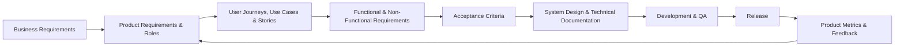
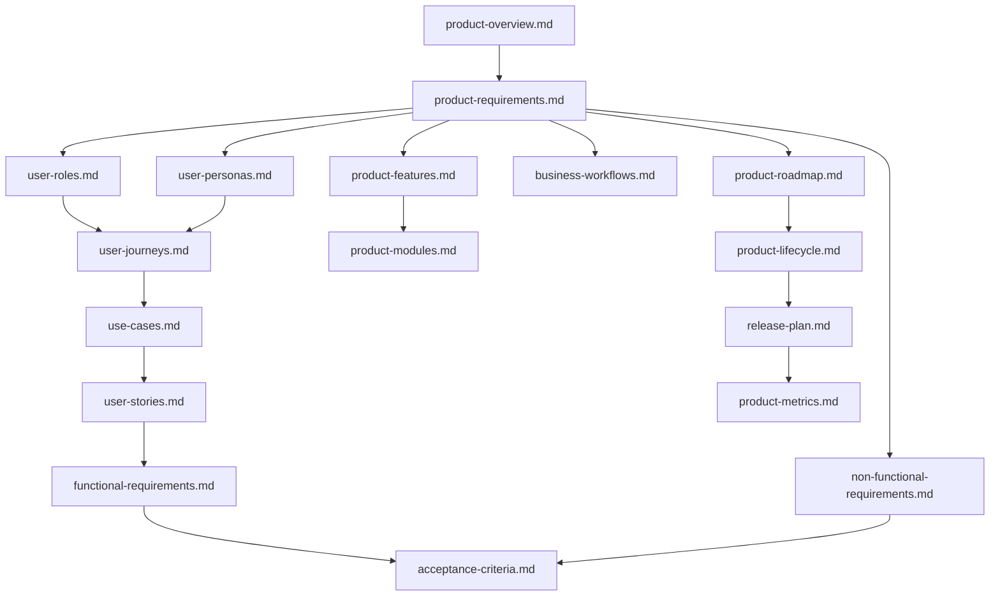

# 02_Product

## 1. Folder Overview

This folder contains the product documentation for the **StackLeo Tech Store** project. It defines what the product is, who it serves, how it behaves, and how it is expected to evolve — translating the business foundations established in `00_Project_Overview` and `01_Business` into concrete product requirements, user-centered design inputs, and functional expectations.

This README describes the contents of this folder only. It is not the project's main README and does not describe the repository as a whole.

## 2. Purpose of this Folder

The `02_Product` folder serves as the single source of truth for what StackLeo Tech Store must do for its users and the business. It bridges business strategy and technical execution: everything in this folder is derived from the business context defined in `01_Business`, and everything in future technical folders (system design, database, API, backend, frontend, testing, deployment) is derived from what is defined here.

This folder gives Product Managers, Business Analysts, UI/UX Designers, Frontend Developers, Backend Developers, QA Engineers, DevOps Engineers, and stakeholders a shared, consistent understanding of the product before design and engineering work begins.

## 3. Documentation Objectives

The documents in this folder are intended to:

- Define the product's purpose, scope, and core capabilities at a functional level.
- Describe who uses the product, in what roles, and through what journeys and scenarios.
- Translate business requirements into functional and non-functional product requirements.
- Define acceptance criteria that establish when a requirement is considered complete.
- Document the business workflows the product must support.
- Track the product's lifecycle, release plan, and evolving metrics over time.
- Record product-level assumptions, constraints, and terminology to reduce ambiguity across teams.

## 4. Product Documentation Principles

- **Business-Derived** — every product requirement must trace back to a business need defined in `01_Business`.
- **User-Centered** — product decisions are grounded in defined user roles, personas, and journeys, not assumptions.
- **Implementation-Agnostic** — this folder defines *what* the product must do, not *how* it is built; technology, architecture, API, and database design belong to dedicated technical documentation elsewhere in the repository.
- **Traceable** — requirements, use cases, user stories, and acceptance criteria are structured so that each can be traced to its origin and its downstream implementation.
- **Future-Ready** — documentation accounts for planned future capabilities (B2B, corporate sales, wholesale, multi-vendor marketplace) without over-specifying them before they are prioritized.

## 5. Folder Structure

```
02_Product/
├── README.md
├── product-overview.md
├── product-requirements.md
├── product-roadmap.md
├── product-features.md
├── product-modules.md
├── user-roles.md
├── user-personas.md
├── user-journeys.md
├── use-cases.md
├── user-stories.md
├── functional-requirements.md
├── non-functional-requirements.md
├── acceptance-criteria.md
├── business-workflows.md
├── product-lifecycle.md
├── release-plan.md
├── product-metrics.md
├── assumptions.md
├── constraints.md
├── glossary.md
└── changelog.md
```

## 6. Document Descriptions

| Document | Purpose |
|---|---|
| `product-overview.md` | Introduces StackLeo Tech Store as a product — its concept, value, and place within the business. |
| `product-requirements.md` | Defines the formal Product Requirements Document (PRD) consolidating what the product must deliver. |
| `product-roadmap.md` | Presents the product-level phased delivery plan, aligned with `00_Project_Overview/project-roadmap.md`. |
| `product-features.md` | Describes the product's feature set at a functional, customer-facing level. |
| `product-modules.md` | Defines the major functional modules that make up the product. |
| `user-roles.md` | Defines the distinct user roles that interact with the product and their permissions boundaries. |
| `user-personas.md` | Describes representative product users in depth, building on `01_Business/target-market.md`. |
| `user-journeys.md` | Maps end-to-end journeys users take through the product. |
| `use-cases.md` | Documents discrete interactions between users and the product. |
| `user-stories.md` | Expresses product requirements from the user's perspective, in a structured, actionable format. |
| `functional-requirements.md` | Defines what the product must do, feature by feature. |
| `non-functional-requirements.md` | Defines the quality attributes the product must exhibit, such as reliability and usability. |
| `acceptance-criteria.md` | Defines the conditions that must be met for a requirement to be considered complete. |
| `business-workflows.md` | Documents the end-to-end business processes the product must support. |
| `product-lifecycle.md` | Describes the stages a product, feature, or release moves through over time. |
| `release-plan.md` | Defines how and when product capabilities are planned for release. |
| `product-metrics.md` | Defines how product success and health are measured. |
| `assumptions.md` | Records product-level assumptions made during planning. |
| `constraints.md` | Documents product-level limitations and boundaries. |
| `glossary.md` | Defines product-specific terminology, extending `01_Business/glossary.md` where needed. |
| `changelog.md` | Maintains a record of significant changes to this folder's documentation. |

## 7. Recommended Reading Order

For readers new to the product, the following order is recommended:

1. `product-overview.md` — Understand what the product is.
2. `product-requirements.md` — Understand the formal requirements driving the product.
3. `user-roles.md` and `user-personas.md` — Understand who uses the product.
4. `user-journeys.md`, `use-cases.md`, and `user-stories.md` — Understand how users interact with the product.
5. `product-features.md` and `product-modules.md` — Understand what the product offers and how it is structured.
6. `functional-requirements.md` and `non-functional-requirements.md` — Understand detailed product behavior and quality expectations.
7. `acceptance-criteria.md` — Understand how requirement completion is verified.
8. `business-workflows.md` — Understand the end-to-end processes the product supports.
9. `product-roadmap.md`, `product-lifecycle.md`, and `release-plan.md` — Understand how the product evolves over time.
10. `product-metrics.md` — Understand how product success is measured.
11. `assumptions.md`, `constraints.md`, and `glossary.md` — Review supporting context and terminology.
12. `changelog.md` — Review the history of changes to this folder's documentation.

## 8. Product Development Lifecycle

Documentation in this folder supports the following high-level product development lifecycle:



Product documentation is treated as a living input to this cycle: metrics and feedback gathered after release flow back into future product requirements, keeping the documentation aligned with real-world product performance.

## 9. Stakeholders Using This Folder

| Stakeholder | How They Use This Folder |
|---|---|
| Product Manager / Project Lead | Owns and maintains product scope, requirements, and roadmap alignment. |
| Business Analyst | Ensures product documentation accurately reflects business requirements. |
| UI/UX Designers | Use personas, journeys, and use cases to inform design decisions. |
| Frontend Developers | Reference functional requirements, user stories, and acceptance criteria to build customer-facing features. |
| Backend Developers | Reference functional and non-functional requirements and business workflows to inform system behavior. |
| QA Engineers | Use acceptance criteria and use cases to design and validate test coverage. |
| DevOps Engineers | Reference the release plan and non-functional requirements relevant to deployment and reliability. |
| Stakeholders / Founders | Use the product overview, roadmap, and metrics to track product direction and progress. |

A complete list of project-wide stakeholders is maintained in `00_Project_Overview/stakeholders.md`.

## 10. Documentation Standards

- Every document must clearly state its purpose and its relationship to adjacent documents in this folder.
- Requirements must be specific, verifiable, and free of ambiguous language.
- User-facing terminology must remain consistent with `glossary.md` and `01_Business/glossary.md`.
- Documents must describe product behavior and intent only — no implementation approach, technology stack, API design, or database schema.
- Diagrams, where used, must be created with Mermaid to remain version-controlled and renderable directly in Markdown.
- Every document must include a Document Information table consistent with the format used across this repository.

## 11. Contribution Guidelines

- Proposed additions or changes to product documentation should be reviewed against `01_Business/business-requirements.md` to confirm business alignment before being finalized.
- New requirements, features, or user stories should be added to the relevant existing document rather than creating fragmented, duplicate documents.
- Any new terminology introduced should be added to `glossary.md`.
- Significant changes should be discussed with the Product Manager / Project Lead prior to being merged into this folder.
- All meaningful changes must be recorded in `changelog.md`.

## 12. Versioning Strategy

Documents in this folder follow the same Semantic Versioning (SemVer) approach defined in `00_Project_Overview/changelog.md`:

| Segment | When It Changes |
|---|---|
| MAJOR | A fundamental change to product direction, scope, or core requirements. |
| MINOR | Addition of new features, requirements, or documents that do not change prior meaning. |
| PATCH | Corrections, clarifications, or formatting updates that do not change meaning or scope. |

Each document maintains its own version number in its Document Information section, and folder-wide changes are tracked in `changelog.md`.

## 13. Document Relationships



This diagram illustrates the general flow of derivation between documents: the product overview grounds the requirements, requirements inform user-centered design inputs and feature definitions, and these converge into verifiable functional and non-functional requirements and acceptance criteria, which in turn inform release planning and measurement.

## 14. Maintenance Guidelines

- Keep documents concise, factual, and free of implementation-level detail.
- Update the relevant document promptly when product understanding, scope, or requirements change, and log the change in `changelog.md`.
- Avoid duplicating content across documents; reference related documents instead of repeating information.
- Ensure product documentation remains consistent with `00_Project_Overview` and `01_Business` as those documents evolve.
- Write for a mixed audience — avoid unexplained jargon and align terminology with `glossary.md`.
- Keep this README aligned with the actual contents of the folder whenever documents are added, renamed, or removed.

## 15. Document Information

| Property | Value |
|----------|-------|
| Folder | 02_Product |
| Version | 1.0.0 |
| Status | Active |
| Maintained By | StackLeo |
| Last Updated | 2026-07-17 |

---

© StackLeo. All Rights Reserved.
