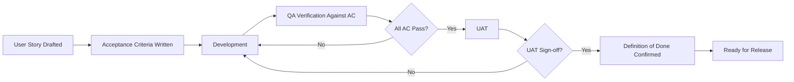
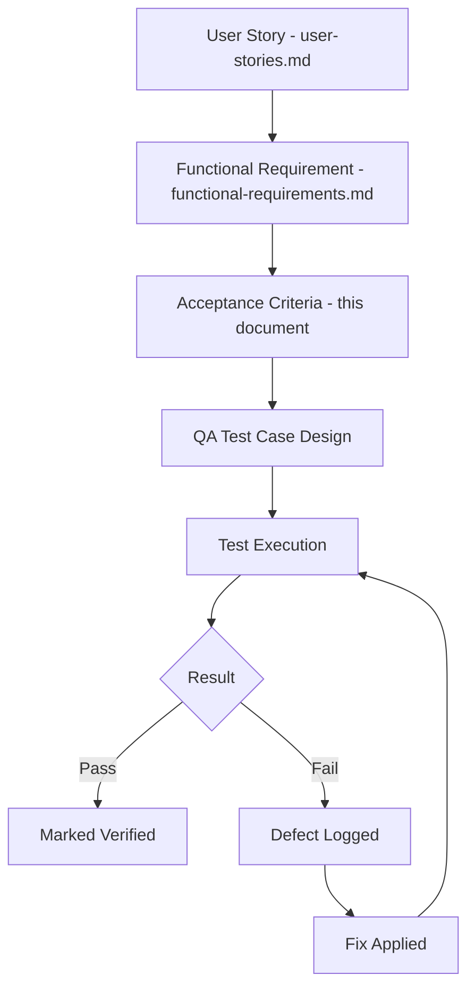
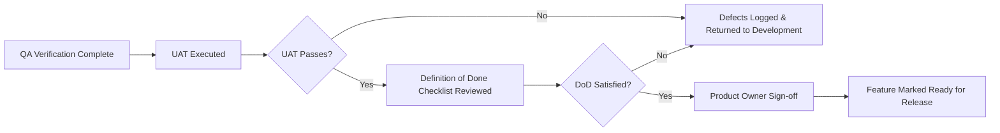
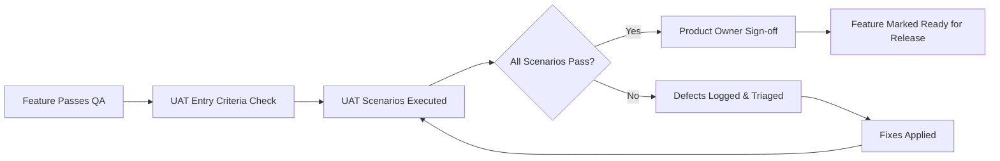

# Acceptance Criteria Specification

## 1. Document Purpose

This document is the official Acceptance Criteria Specification (ACS) for **StackLeo Tech Store**. It defines the conditions that must be satisfied before a feature is considered complete and accepted by Product, QA, and Business stakeholders, using Behavior-Driven Development (BDD) and IEEE 29148-inspired conventions.

This document is the primary reference for Product Owners, QA Engineers, Developers, UX Designers, Business Analysts, UAT Teams, and Stakeholders. Every acceptance criterion traces to a user story in `user-stories.md`, a functional requirement in `functional-requirements.md`, and, where relevant, a non-functional requirement in `non-functional-requirements.md`.

This document defines verification conditions only. It does not describe implementation approach, technology choices, API design, or database structure, all of which are addressed in dedicated technical documentation elsewhere in the repository.

## 2. Acceptance Criteria Philosophy

Acceptance criteria exist to remove ambiguity about when a piece of work is genuinely finished — not merely coded, but verified to deliver the intended business and customer value. They translate a user story's intent into concrete, observable conditions that can be objectively checked.

- **Relationship with User Stories** — each acceptance criterion elaborates a specific user story from `user-stories.md`, making its Given/When/Then scenarios explicit and testable.
- **Relationship with Functional Requirements** — acceptance criteria verify the behavior mandated by `functional-requirements.md`, providing the concrete test conditions a requirement's "Success Criteria" and "Error Conditions" imply.
- **Relationship with QA** — acceptance criteria form the basis for QA test case design, ensuring test coverage is derived from business intent rather than incidental implementation detail.
- **Relationship with UAT** — acceptance criteria form the checklist business stakeholders use during User Acceptance Testing (Section 7) to confirm the delivered capability meets real business need.
- **Definition of Done (DoD)** — acceptance criteria are a necessary but not sufficient condition for "Done." A feature is Done only once its acceptance criteria pass *and* the broader Definition of Done checklist in Section 6 is satisfied.

## 3. Acceptance Criteria Standards

Every acceptance criterion in this document is written to be:

- **Clear** — understandable without requiring implementation knowledge.
- **Testable** — verifiable through observable system behavior.
- **Measurable** — expressed with an objective pass/fail condition.
- **Unambiguous** — free of subjective or vague language.
- **Independent** — verifiable without depending on the outcome of unrelated criteria.
- **Business-Focused** — expressed in terms of business and customer outcomes, not technical mechanics.
- **Traceable** — linked to its originating user story and functional requirement.

## 4. Feature Categories

| Category | AC Count |
|---|---|
| Authentication | 2 |
| User Management | 1 |
| Product Catalog | 1 |
| Categories | 1 |
| Brands | 1 |
| Search | 1 |
| Filters | 1 |
| Wishlist | 1 |
| Compare | 1 |
| Cart | 2 |
| Checkout | 2 |
| Payments | 2 |
| Orders | 2 |
| Shipping | 1 |
| Returns | 2 |
| Refunds | 1 |
| Warranty | 2 |
| Reviews | 1 |
| Notifications | 1 |
| Customer Dashboard | 1 |
| Inventory | 1 |
| Reports | 1 |
| Analytics | 1 |
| Coupons | 1 |
| Promotions | 1 |
| Corporate Sales (Future) | 1 |
| Marketplace (Future) | 1 |
| AI Features (Future) | 1 |
| Administration | 2 |

**Total Acceptance Criteria: 39**

---

## 5. Acceptance Criteria Specifications

### 5.1 Authentication

#### AC-001 — Customer Registration

- **Feature:** Authentication | **User Story Reference:** US-001 | **Functional Requirement Reference:** FR-001
- **Preconditions:** Guest has not previously registered with the provided contact detail.
- **Acceptance Criteria:**
  - Given a Guest provides a valid, unregistered email or mobile number and a compliant password, When they submit the registration form, Then a verification code is sent and the account is created in a pending-verification state.
  - Given a Guest enters the correct verification code within its validity window, When submitted, Then the account is activated and the Guest is signed in.
  - Given a Guest enters an already-registered contact detail, When they submit the form, Then registration is blocked with a message directing them to log in.
- **Validation Rules:** Contact detail format validity; password meets minimum strength (NFR-025); uniqueness of contact detail (BR-001).
- **Success Scenario:** Account is created, verified, and immediately usable for login and shopping.
- **Failure Scenario:** Verification code expires or is entered incorrectly beyond the allowed attempts, requiring a new code to be requested.
- **Edge Cases:** Verification code requested repeatedly in quick succession; registration attempted mid-checkout without losing cart contents.
- **Error Messages (Business Level):** "This email or mobile number is already registered. Please log in instead." / "Your verification code has expired. Please request a new one."
- **Accessibility Considerations:** Form fields and error messages must be announced correctly by screen readers (NFR-038, NFR-041).
- **Security Considerations:** Verification code must be rate-limited against brute-force guessing (NFR-031); password never displayed in plain text (NFR-027).
- **Performance Expectations:** Verification code delivery and account activation complete within the fast response targets defined in NFR-001, NFR-002.
- **UAT Checklist:** Register with valid details; attempt duplicate registration; attempt expired code; verify successful login post-registration.
- **Exit Criteria:** All Given/When/Then scenarios pass; DoD in Section 6 is satisfied.
- **Notes:** None.

#### AC-002 — Customer Login

- **Feature:** Authentication | **User Story Reference:** US-002 | **Functional Requirement Reference:** FR-002
- **Preconditions:** Customer holds a verified, active account.
- **Acceptance Criteria:**
  - Given valid credentials, When submitted, Then a session is established and the customer is redirected to their intended destination.
  - Given repeated invalid credential attempts reach the defined threshold, When the next attempt is made, Then the account is temporarily locked with clear recovery guidance.
  - Given a customer selects "Forgot Password," When they complete the reset flow, Then they can log in with the new password immediately.
- **Validation Rules:** Credential match against stored account record; lockout threshold enforcement (BR-005).
- **Success Scenario:** Customer is authenticated and reaches their intended page without unnecessary friction.
- **Failure Scenario:** Account is locked after repeated failures, with the customer informed of the wait time or recovery path.
- **Edge Cases:** Login attempted immediately after a password reset; concurrent login from multiple devices.
- **Error Messages (Business Level):** "Incorrect email/mobile number or password." / "Too many attempts. Please try again in a few minutes or reset your password."
- **Accessibility Considerations:** Error messages are programmatically associated with the relevant form field (NFR-041).
- **Security Considerations:** Login attempts are rate-limited (NFR-031); sessions expire after inactivity (NFR-024).
- **Performance Expectations:** Login completes within the fast response targets defined in NFR-002.
- **UAT Checklist:** Successful login; failed login messaging; lockout behavior; password reset flow.
- **Exit Criteria:** All Given/When/Then scenarios pass; DoD in Section 6 is satisfied.
- **Notes:** None.

### 5.2 User Management

#### AC-003 — Profile and Address Update

- **Feature:** User Management | **User Story Reference:** US-003, US-004 | **Functional Requirement Reference:** FR-003
- **Preconditions:** Customer is authenticated.
- **Acceptance Criteria:**
  - Given a customer edits non-verified profile fields, When saved, Then the update is applied immediately and confirmed to the customer.
  - Given a customer edits a verified contact field, When saved, Then re-verification is required before the change takes effect (BR-012).
  - Given a customer adds a new delivery address with all required fields, When saved, Then it becomes available for selection at checkout.
- **Validation Rules:** Address completeness (BR-008); contact field re-verification requirement (BR-012).
- **Success Scenario:** Profile and address changes are saved accurately and reflected immediately in the account.
- **Failure Scenario:** Incomplete address submission is rejected with clear field-level guidance.
- **Edge Cases:** Attempted update to a contact detail already used by another account; deletion of an address referenced by a pending order.
- **Error Messages (Business Level):** "Please complete all required address fields." / "This contact detail is already in use."
- **Accessibility Considerations:** Field labels and validation errors are correctly associated for assistive technology (NFR-041).
- **Security Considerations:** Contact field changes require re-verification to prevent unauthorized account takeover (NFR-024).
- **Performance Expectations:** Profile updates save within the fast response targets defined in NFR-001.
- **UAT Checklist:** Update non-verified field; update verified field and confirm re-verification; add/edit/remove address.
- **Exit Criteria:** All Given/When/Then scenarios pass; DoD in Section 6 is satisfied.
- **Notes:** None.

### 5.3 Product Catalog

#### AC-004 — Product Detail Display

- **Feature:** Product Catalog | **User Story Reference:** US-005, US-006 | **Functional Requirement Reference:** FR-005, FR-006
- **Preconditions:** Product is published.
- **Acceptance Criteria:**
  - Given a published product, When a customer opens its detail page, Then specifications, price, availability, and published reviews are displayed accurately.
  - Given a product has variants, When a customer selects a variant, Then price and availability update to reflect that specific variant.
  - Given a product is in Draft status, When any user attempts to view it directly, Then it is not accessible (BR-028).
- **Validation Rules:** Mandatory field completeness before publish (BR-013); variant-level stock accuracy (BR-019).
- **Success Scenario:** Customer views complete, accurate, current product information supporting a confident purchase decision.
- **Failure Scenario:** Product is discontinued while a customer has the page open; customer is informed clearly rather than shown a broken page.
- **Edge Cases:** Variant becomes out of stock while the page is open; product with no reviews yet.
- **Error Messages (Business Level):** "This product is no longer available." 
- **Accessibility Considerations:** Product images include descriptive alternative text; specifications are presented in a structured, screen-reader-navigable format (NFR-038, NFR-041).
- **Security Considerations:** No customer- or seller-sensitive data is exposed in public product content.
- **Performance Expectations:** Product detail page loads within the targets defined in NFR-003.
- **UAT Checklist:** View a standard product; view a product with variants; attempt to view a Draft product directly.
- **Exit Criteria:** All Given/When/Then scenarios pass; DoD in Section 6 is satisfied.
- **Notes:** None.

### 5.4 Categories

#### AC-005 — Category Browsing

- **Feature:** Categories | **User Story Reference:** US-007 | **Functional Requirement Reference:** FR-007
- **Preconditions:** Category exists with associated published products.
- **Acceptance Criteria:**
  - Given a customer selects a category, When the page loads, Then only correctly associated, published products are displayed.
  - Given a category has no currently published products, When selected, Then a clear, friendly empty-state message is shown instead of an error.
- **Validation Rules:** Category-product association integrity (BR-016, BR-017).
- **Success Scenario:** Customer sees an accurate, relevant product set for the selected category.
- **Failure Scenario:** Category-product linkage is broken, resulting in missing or incorrect products; this is treated as a defect, not expected behavior.
- **Edge Cases:** Subcategory selected within a parent category; category deleted while a customer has it open.
- **Error Messages (Business Level):** "No products currently available in this category. Check back soon."
- **Accessibility Considerations:** Category navigation is operable via keyboard and properly labeled for screen readers (NFR-037, NFR-038).
- **Security Considerations:** None specific.
- **Performance Expectations:** Category page loads within the targets defined in NFR-001, NFR-003.
- **UAT Checklist:** Browse a populated category; browse an empty category; navigate a subcategory.
- **Exit Criteria:** All Given/When/Then scenarios pass; DoD in Section 6 is satisfied.
- **Notes:** None.

### 5.5 Brands

#### AC-006 — Brand Browsing

- **Feature:** Brands | **User Story Reference:** US-008 | **Functional Requirement Reference:** FR-008
- **Preconditions:** Brand record is approved.
- **Acceptance Criteria:**
  - Given a customer selects an approved brand, When the page loads, Then only verified products from that brand are displayed.
- **Validation Rules:** Brand approval status (BR-015).
- **Success Scenario:** Customer views a complete, verified set of products for the selected brand.
- **Failure Scenario:** An unverified brand association is exposed publicly, which is treated as a defect.
- **Edge Cases:** Brand with a very small or very large product count.
- **Error Messages (Business Level):** "No products currently available for this brand."
- **Accessibility Considerations:** Brand imagery includes descriptive alternative text (NFR-038).
- **Security Considerations:** None specific.
- **Performance Expectations:** Brand page loads within the targets defined in NFR-001, NFR-003.
- **UAT Checklist:** Browse an approved brand; confirm unapproved brand associations are not publicly visible.
- **Exit Criteria:** All Given/When/Then scenarios pass; DoD in Section 6 is satisfied.
- **Notes:** None.

### 5.6 Search

#### AC-007 — Keyword Search

- **Feature:** Search | **User Story Reference:** US-009 | **Functional Requirement Reference:** FR-009
- **Preconditions:** None.
- **Acceptance Criteria:**
  - Given a customer enters a keyword matching published products, When submitted, Then relevant, ranked results are returned.
  - Given a customer enters a keyword with no matches, When submitted, Then a clear no-results state is shown with suggested categories.
- **Validation Rules:** Query sanitization for special characters; minimum query length handling.
- **Success Scenario:** Customer finds relevant products quickly.
- **Failure Scenario:** Search returns irrelevant results, leading to abandonment; treated as a quality defect subject to ongoing tuning.
- **Edge Cases:** Misspelled search terms; searches using a SKU or model number instead of a product name.
- **Error Messages (Business Level):** "No results found for '[query]'. Try browsing our categories instead."
- **Accessibility Considerations:** Search input and results are properly labeled and announced (NFR-038, NFR-041).
- **Security Considerations:** Search input is validated to prevent malformed or malicious query strings from disrupting the service.
- **Performance Expectations:** Search results return within the targets defined in NFR-004.
- **UAT Checklist:** Search with a matching term; search with no matches; search with a misspelled term.
- **Exit Criteria:** All Given/When/Then scenarios pass; DoD in Section 6 is satisfied.
- **Notes:** Future enhancement path toward AI Search, per AC-035.

### 5.7 Filters

#### AC-008 — Filter and Sort Results

- **Feature:** Filters | **User Story Reference:** US-010 | **Functional Requirement Reference:** FR-010
- **Preconditions:** A result set (search or category) is displayed.
- **Acceptance Criteria:**
  - Given a customer applies a price filter, When applied, Then only products within that range are displayed.
  - Given multiple filters are applied together, When combined, Then results reflect all applied criteria simultaneously.
- **Validation Rules:** Filter combination logic consistency (BR-020).
- **Success Scenario:** Customer narrows results to exactly the relevant subset.
- **Failure Scenario:** Filter combination yields zero results; customer is informed clearly rather than shown a blank page.
- **Edge Cases:** Conflicting filter combination (e.g., a brand filter with no products in the selected price range).
- **Error Messages (Business Level):** "No products match your selected filters. Try adjusting your criteria."
- **Accessibility Considerations:** Filter controls are operable via keyboard and clearly labeled (NFR-037).
- **Security Considerations:** None specific.
- **Performance Expectations:** Filtered results return within the targets defined in NFR-004.
- **UAT Checklist:** Apply a single filter; apply combined filters; apply a filter combination yielding zero results.
- **Exit Criteria:** All Given/When/Then scenarios pass; DoD in Section 6 is satisfied.
- **Notes:** None.

### 5.8 Wishlist

#### AC-009 — Wishlist Management

- **Feature:** Wishlist | **User Story Reference:** US-011 | **Functional Requirement Reference:** FR-011
- **Preconditions:** Customer is authenticated.
- **Acceptance Criteria:**
  - Given a customer selects "Add to Wishlist," When confirmed, Then the product appears in their wishlist immediately.
  - Given a wishlist item becomes out of stock, When the customer views their wishlist, Then its unavailable status is clearly indicated.
- **Validation Rules:** Wishlist entries are scoped to the authenticated customer only.
- **Success Scenario:** Customer can reliably save and later revisit products of interest.
- **Failure Scenario:** Wishlisted product is discontinued; item remains visible with a clear discontinued indicator rather than silently disappearing.
- **Edge Cases:** Adding a product already in the wishlist; wishlist reaching a very large number of items.
- **Error Messages (Business Level):** "This item is currently out of stock."
- **Accessibility Considerations:** Wishlist add/remove controls are operable via keyboard (NFR-037).
- **Security Considerations:** Wishlist data is accessible only to the owning customer (BR per Customer Rules).
- **Performance Expectations:** Wishlist updates apply within the targets defined in NFR-001.
- **UAT Checklist:** Add item to wishlist; remove item; view out-of-stock wishlist item.
- **Exit Criteria:** All Given/When/Then scenarios pass; DoD in Section 6 is satisfied.
- **Notes:** Classified Phase 2 per `product-roadmap.md`.

### 5.9 Compare

#### AC-010 — Product Comparison

- **Feature:** Compare | **User Story Reference:** US-012 | **Functional Requirement Reference:** FR-012
- **Preconditions:** At least two comparable products are selected.
- **Acceptance Criteria:**
  - Given two comparable products, When a customer opens comparison, Then specifications display accurately side by side.
- **Validation Rules:** Products selected for comparison belong to a compatible category set (BR-020).
- **Success Scenario:** Customer makes a confident decision based on an accurate side-by-side view.
- **Failure Scenario:** Products from incompatible categories are selected; the system prevents or clearly warns against this comparison.
- **Edge Cases:** Comparing products with partially missing specification data.
- **Error Messages (Business Level):** "These products can't be compared directly. Try selecting similar products."
- **Accessibility Considerations:** Comparison table uses proper table semantics for screen reader navigation (NFR-041).
- **Security Considerations:** None specific.
- **Performance Expectations:** Comparison view loads within the targets defined in NFR-001.
- **UAT Checklist:** Compare two similar products; attempt to compare incompatible products.
- **Exit Criteria:** All Given/When/Then scenarios pass; DoD in Section 6 is satisfied.
- **Notes:** Classified Phase 2 per `product-roadmap.md`.

### 5.10 Cart

#### AC-011 — Add Product to Cart

- **Feature:** Cart | **User Story Reference:** US-013 | **Functional Requirement Reference:** FR-013
- **Preconditions:** Product/variant is in stock.
- **Acceptance Criteria:**
  - Given sufficient stock, When a customer adds a product to cart, Then it appears with the correct quantity and current price.
  - Given a customer attempts to add more than available stock, When submitted, Then the quantity is capped at available stock with a clear message.
- **Validation Rules:** Stock sufficiency check (BR-040); per-customer quantity limits where configured (BR-041).
- **Success Scenario:** Cart accurately reflects the customer's intended, valid purchase selection.
- **Failure Scenario:** Stock changes between page load and add-to-cart action, requiring the customer to be informed immediately.
- **Edge Cases:** Adding the last remaining unit of a product; adding a product already in the cart (quantity increment).
- **Error Messages (Business Level):** "Only [X] units available. Your cart has been updated to reflect available stock."
- **Accessibility Considerations:** Add-to-cart confirmation is announced to screen readers (NFR-038).
- **Security Considerations:** Cart contents are scoped to the customer's own session/account.
- **Performance Expectations:** Add-to-cart action completes within the targets defined in NFR-002.
- **UAT Checklist:** Add in-stock item; attempt to exceed available stock; add an already-in-cart item again.
- **Exit Criteria:** All Given/When/Then scenarios pass; DoD in Section 6 is satisfied.
- **Notes:** None.

#### AC-012 — Update Cart Contents

- **Feature:** Cart | **User Story Reference:** US-014 | **Functional Requirement Reference:** FR-014
- **Preconditions:** Cart contains at least one item.
- **Acceptance Criteria:**
  - Given a customer changes an item's quantity, When updated, Then the cart total recalculates immediately and accurately.
  - Given a customer removes an item, When confirmed, Then it no longer appears in the cart or cart total.
- **Validation Rules:** Revalidation of stock and pricing on every cart change (BR-045, BR-046).
- **Success Scenario:** Cart remains accurate and current through any number of edits.
- **Failure Scenario:** Quantity updated to exceed newly reduced stock; customer is informed and quantity is adjusted.
- **Edge Cases:** Reducing quantity to zero (equivalent to removal); rapid successive quantity changes.
- **Error Messages (Business Level):** "This item's stock has changed. Your cart has been updated."
- **Accessibility Considerations:** Cart total updates are announced to assistive technology (NFR-038).
- **Security Considerations:** None beyond standard cart ownership scoping.
- **Performance Expectations:** Cart updates apply within the targets defined in NFR-002.
- **UAT Checklist:** Increase quantity; decrease quantity; remove an item; reduce stock externally and reload cart.
- **Exit Criteria:** All Given/When/Then scenarios pass; DoD in Section 6 is satisfied.
- **Notes:** None.

### 5.11 Checkout

#### AC-013 — Checkout Address and Delivery Selection

- **Feature:** Checkout | **User Story Reference:** US-015 | **Functional Requirement Reference:** FR-015
- **Preconditions:** Cart contains at least one valid item.
- **Acceptance Criteria:**
  - Given a saved address exists, When checkout loads, Then the default address is pre-selected and editable.
  - Given an address outside the serviceable delivery area, When selected, Then the customer is notified and offered store pickup where available.
- **Validation Rules:** Serviceable area check (BR-075); address completeness (BR-008).
- **Success Scenario:** Customer confirms accurate shipping details without confusion.
- **Failure Scenario:** Courier coverage is temporarily disrupted for an otherwise valid address; customer is clearly informed.
- **Edge Cases:** Customer with no saved address completing checkout for the first time.
- **Error Messages (Business Level):** "We currently don't deliver to this address. Store pickup is available at [location]."
- **Accessibility Considerations:** Address form fields and validation errors are correctly labeled (NFR-041).
- **Security Considerations:** Address data is transmitted and stored securely (NFR-027).
- **Performance Expectations:** Checkout step transitions occur within the targets defined in NFR-005.
- **UAT Checklist:** Checkout with saved address; checkout with new address; checkout with an out-of-area address.
- **Exit Criteria:** All Given/When/Then scenarios pass; DoD in Section 6 is satisfied.
- **Notes:** None.

#### AC-014 — Final Checkout Validation and Confirmation

- **Feature:** Checkout | **User Story Reference:** US-016, US-017 | **Functional Requirement Reference:** FR-016
- **Preconditions:** Shipping and payment method are selected.
- **Acceptance Criteria:**
  - Given all checkout details are valid, When the customer confirms, Then final stock and price are re-validated before order creation.
  - Given stock or price has changed since cart review, When re-validated, Then the customer is notified before the order is finalized.
- **Validation Rules:** Final stock validation (BR-051); final price validation (BR-052); order creation only on full validation (BR-053).
- **Success Scenario:** Order is confirmed with fully validated, current stock and pricing.
- **Failure Scenario:** A discrepancy is found at final validation; customer is shown the updated details and asked to reconfirm rather than being silently charged incorrectly.
- **Edge Cases:** Price change occurring in the exact moment between cart review and final confirmation.
- **Error Messages (Business Level):** "Some details in your order have changed. Please review before confirming."
- **Accessibility Considerations:** Change notifications are clearly announced, not solely conveyed by color (NFR-039, NFR-041).
- **Security Considerations:** Final validation prevents price/stock manipulation between steps.
- **Performance Expectations:** Final validation completes within the targets defined in NFR-005.
- **UAT Checklist:** Confirm order with no changes; confirm order after a price change; confirm order after a stock change.
- **Exit Criteria:** All Given/When/Then scenarios pass; DoD in Section 6 is satisfied.
- **Notes:** None.

### 5.12 Payments

#### AC-015 — Online Payment Processing

- **Feature:** Payments | **User Story Reference:** US-018 | **Functional Requirement Reference:** FR-017
- **Preconditions:** Checkout details are confirmed and a digital payment method is selected.
- **Acceptance Criteria:**
  - Given valid payment details, When submitted, Then the Payment Gateway confirms success and the order proceeds to confirmation.
  - Given the Payment Gateway returns failure or times out, When this occurs, Then the order is not confirmed and reserved stock is released.
- **Validation Rules:** Payment confirmation required before order creation (BR-057); secure gateway processing (BR-058).
- **Success Scenario:** Payment completes and the customer proceeds seamlessly to order confirmation.
- **Failure Scenario:** Payment fails; customer is offered a clear retry path within the active checkout session.
- **Edge Cases:** Payment succeeds at the gateway but confirmation is delayed in reaching StackLeo; duplicate submission during network delay.
- **Error Messages (Business Level):** "Your payment could not be completed. Please try again or choose a different payment method."
- **Accessibility Considerations:** Payment status updates are announced to assistive technology (NFR-038).
- **Security Considerations:** Payment data is processed through an approved, secure gateway partner (NFR-027); no sensitive payment data is stored directly.
- **Performance Expectations:** Payment processing completes within the targets defined in NFR-005, excluding external gateway latency.
- **UAT Checklist:** Successful payment; failed payment with retry; payment timeout scenario.
- **Exit Criteria:** All Given/When/Then scenarios pass; DoD in Section 6 is satisfied.
- **Notes:** None.

#### AC-016 — Cash on Delivery Confirmation

- **Feature:** Payments | **User Story Reference:** US-019 | **Functional Requirement Reference:** FR-018
- **Preconditions:** COD is eligible for the delivery zone and order value.
- **Acceptance Criteria:**
  - Given COD eligibility, When selected, Then the order is confirmed as "Placed" without requiring upfront online payment.
  - Given an order exceeds the COD eligibility threshold, When COD is attempted, Then it is unavailable and the customer is directed to an eligible payment method.
- **Validation Rules:** COD eligibility by delivery zone and order value (BR-055).
- **Success Scenario:** Order proceeds to fulfillment with payment deferred to delivery.
- **Failure Scenario:** COD selected for an ineligible order; option is clearly disabled with an explanation rather than allowed and later rejected.
- **Edge Cases:** Order value fluctuating around the COD threshold due to coupon application.
- **Error Messages (Business Level):** "Cash on Delivery isn't available for this order. Please choose another payment method."
- **Accessibility Considerations:** Disabled payment options are clearly indicated to assistive technology, not solely by visual styling (NFR-039).
- **Security Considerations:** None beyond standard order integrity checks.
- **Performance Expectations:** COD confirmation completes within the targets defined in NFR-005.
- **UAT Checklist:** Eligible COD order; ineligible high-value order; eligibility recalculation after coupon application.
- **Exit Criteria:** All Given/When/Then scenarios pass; DoD in Section 6 is satisfied.
- **Notes:** None.

### 5.13 Orders

#### AC-017 — Order Placement Confirmation

- **Feature:** Orders | **User Story Reference:** US-020 | **Functional Requirement Reference:** FR-020
- **Preconditions:** Payment is confirmed or COD is selected.
- **Acceptance Criteria:**
  - Given successful payment/COD confirmation, When processed, Then a uniquely referenced order record is created and displayed to the customer.
  - Given an order is created, When completed, Then a confirmation notification is sent via email/SMS.
- **Validation Rules:** Unique order reference assignment (BR-054); order creation only on validated checkout (BR-053).
- **Success Scenario:** Customer receives clear, prompt confirmation of a successfully placed order.
- **Failure Scenario:** Notification delivery fails despite successful order creation; order remains visible in the customer's account regardless.
- **Edge Cases:** Customer closes the browser immediately after confirming payment.
- **Error Messages (Business Level):** None applicable for the success path; delivery failure is handled silently with the order still visible in account history.
- **Accessibility Considerations:** Order confirmation is clearly announced and navigable (NFR-038).
- **Security Considerations:** Order reference is unique and non-guessable in sequence-sensitive contexts.
- **Performance Expectations:** Order confirmation displays within the targets defined in NFR-002.
- **UAT Checklist:** Place order via online payment; place order via COD; verify order appears in account history immediately.
- **Exit Criteria:** All Given/When/Then scenarios pass; DoD in Section 6 is satisfied.
- **Notes:** None.

#### AC-018 — Order Cancellation

- **Feature:** Orders | **User Story Reference:** US-022 | **Functional Requirement Reference:** FR-022
- **Preconditions:** Order has not yet entered Shipped status.
- **Acceptance Criteria:**
  - Given an order in Processing status, When the customer requests cancellation, Then the order is cancelled and stock/payment are released or refunded.
  - Given an order has already shipped, When cancellation is requested, Then the customer is redirected to the return process instead.
- **Validation Rules:** Cancellation window enforcement (BR-067); stock/refund release on cancellation (BR-068).
- **Success Scenario:** Customer cancels an unwanted order cleanly before it ships.
- **Failure Scenario:** Cancellation requested at the exact moment the order transitions to Shipped; the system resolves this deterministically (either cancellation succeeds or the order proceeds to the return flow, without an ambiguous state).
- **Edge Cases:** Cancellation of a partially fulfilled multi-item order.
- **Error Messages (Business Level):** "This order has already shipped and can no longer be cancelled. You can request a return once it arrives."
- **Accessibility Considerations:** Cancellation confirmation and outcome are clearly announced (NFR-038).
- **Security Considerations:** Only the order's owning customer (or authorized support agent) may initiate cancellation.
- **Performance Expectations:** Cancellation processes within the targets defined in NFR-002.
- **UAT Checklist:** Cancel a Processing order; attempt to cancel a Shipped order; verify stock/refund release.
- **Exit Criteria:** All Given/When/Then scenarios pass; DoD in Section 6 is satisfied.
- **Notes:** None.

### 5.14 Shipping

#### AC-019 — Delivery Status Tracking

- **Feature:** Shipping | **User Story Reference:** US-021, US-024 | **Functional Requirement Reference:** FR-021, FR-025
- **Preconditions:** Order has been confirmed.
- **Acceptance Criteria:**
  - Given a confirmed order, When the customer opens order details, Then the current delivery status lifecycle stage is displayed accurately.
  - Given a significant status change occurs (e.g., Out for Delivery), When it occurs, Then the customer receives a timely notification.
- **Validation Rules:** Status accurately reflects courier-reported data (BR-076).
- **Success Scenario:** Customer has clear, accurate, timely visibility into delivery progress.
- **Failure Scenario:** Courier reports a failed delivery attempt; customer is notified with clear next steps (BR-080).
- **Edge Cases:** Status has not updated for an unusually long period; store pickup order status differing from courier-delivery status flow.
- **Error Messages (Business Level):** "We're unable to retrieve the latest delivery status right now. Please check back shortly."
- **Accessibility Considerations:** Status timeline is presented in a structured, screen-reader-navigable format (NFR-041).
- **Security Considerations:** Tracking data is visible only to the order's owning customer.
- **Performance Expectations:** Tracking data updates within the targets defined in NFR-001.
- **UAT Checklist:** Track an in-transit order; track a delivered order; simulate a failed delivery attempt notification.
- **Exit Criteria:** All Given/When/Then scenarios pass; DoD in Section 6 is satisfied.
- **Notes:** None.

### 5.15 Returns

#### AC-020 — Return Request Submission

- **Feature:** Returns | **User Story Reference:** US-025 | **Functional Requirement Reference:** FR-026
- **Preconditions:** Order is within the applicable return window, per `01_Business/return-policy.md` (Section 6).
- **Acceptance Criteria:**
  - Given an order within the return window, When a customer submits a return request with a valid reason, Then the request enters verification.
  - Given a return window has expired, When a customer attempts to submit a request, Then it is blocked with a clear explanation of the window that applied.
- **Validation Rules:** Return window enforcement (BR-RET-001); non-returnable item exclusion (BR-RET-015).
- **Success Scenario:** Eligible return requests proceed smoothly into verification.
- **Failure Scenario:** Item is marked non-returnable, but the actual issue is a manufacturer defect; request is redirected to the warranty process instead of being flatly rejected.
- **Edge Cases:** Return requested on the last day of the eligibility window; multiple items in one order returned for different reasons.
- **Error Messages (Business Level):** "This item's return window closed on [date]. If it has a manufacturer defect, you can submit a warranty claim instead."
- **Accessibility Considerations:** Return reason selection and evidence upload are keyboard-operable (NFR-037).
- **Security Considerations:** Only the order's owning customer may submit a return request for that order.
- **Performance Expectations:** Return request submission completes within the targets defined in NFR-002.
- **UAT Checklist:** Submit an eligible return; attempt a return after window expiry; attempt to return a non-returnable item.
- **Exit Criteria:** All Given/When/Then scenarios pass; DoD in Section 6 is satisfied.
- **Notes:** None.

#### AC-021 — Return Approval Decision

- **Feature:** Returns | **User Story Reference:** US-026 | **Functional Requirement Reference:** FR-027
- **Preconditions:** Returned product has been received and inspected.
- **Acceptance Criteria:**
  - Given inspection confirms the reported condition, When reviewed, Then the return is approved for refund or replacement.
  - Given inspection reveals a serial number mismatch, When detected, Then the case is escalated for fraud review before any resolution.
- **Validation Rules:** Serial number verification (BR-RET-014); condition-based approval logic (BR-RET-008–BR-RET-011).
- **Success Scenario:** Genuine returns are approved promptly and fairly.
- **Failure Scenario:** Return is rejected; customer receives a specific, documented reason with an escalation path.
- **Edge Cases:** Partial approval where some items in a multi-item return pass inspection and others do not.
- **Error Messages (Business Level):** "Your return could not be approved because [specific reason]. Contact support if you believe this is incorrect."
- **Accessibility Considerations:** Decision notifications are clearly presented to the customer, not solely via status color (NFR-039).
- **Security Considerations:** Inspection findings and fraud escalations are logged for audit (NFR-028).
- **Performance Expectations:** Decision is communicated within the SLA targets defined in `01_Business/return-policy.md` (Section 20).
- **UAT Checklist:** Approve a return; reject a return with a documented reason; trigger a fraud escalation scenario.
- **Exit Criteria:** All Given/When/Then scenarios pass; DoD in Section 6 is satisfied.
- **Notes:** None.

### 5.16 Refunds

#### AC-022 — Refund Processing

- **Feature:** Refunds | **User Story Reference:** US-026 | **Functional Requirement Reference:** FR-028
- **Preconditions:** A return, cancellation, or warranty claim has been approved for refund.
- **Acceptance Criteria:**
  - Given an approved refund, When processed, Then the correct amount is issued to the original payment method.
  - Given the original payment method cannot be credited (e.g., a COD order), When this occurs, Then the refund is rerouted to bank transfer or mobile banking.
- **Validation Rules:** Refund amount matches approved return/cancellation value (BR-060, BR-062).
- **Success Scenario:** Customer receives an accurate, timely refund without needing to follow up.
- **Failure Scenario:** Refund routing fails for the original method; alternate method is used and the customer is clearly informed.
- **Edge Cases:** Partial refund for a partially returned multi-item order.
- **Error Messages (Business Level):** "Your refund has been issued via [method]. It may take a few business days to appear."
- **Accessibility Considerations:** Refund status is clearly presented in the customer dashboard (NFR-041).
- **Security Considerations:** Refund transactions are logged and reconciled against financial records (NFR-028).
- **Performance Expectations:** Refund processing time is communicated at approval and tracked against `01_Business/return-policy.md` (Section 23) KPIs.
- **UAT Checklist:** Full refund to original method; refund rerouted for COD order; partial refund for a multi-item order.
- **Exit Criteria:** All Given/When/Then scenarios pass; DoD in Section 6 is satisfied.
- **Notes:** None.

### 5.17 Warranty

#### AC-023 — Warranty Claim Submission

- **Feature:** Warranty | **User Story Reference:** US-027 | **Functional Requirement Reference:** FR-029
- **Preconditions:** Product is within its applicable warranty period.
- **Acceptance Criteria:**
  - Given a product within warranty, When a customer submits a claim with required documentation, Then the claim enters verification and inspection.
  - Given a claim reason is explicitly excluded (e.g., physical damage), When submitted, Then the customer is informed of likely rejection with policy reference before proceeding.
- **Validation Rules:** Warranty period validity (WR-013); serial number/IMEI verification (WR-017).
- **Success Scenario:** Genuine claims proceed smoothly into inspection.
- **Failure Scenario:** Serial number does not match the original sale record, triggering fraud review rather than automatic rejection or approval.
- **Edge Cases:** Claim submitted on the last day of the warranty period; product with both manufacturer and StackLeo warranty overlap.
- **Error Messages (Business Level):** "Based on the reason provided, this issue may not be covered under warranty. You can still submit your claim for review."
- **Accessibility Considerations:** Document upload and claim form are fully keyboard-operable (NFR-037).
- **Security Considerations:** Claim submissions are validated against purchase records to prevent fraudulent claims (WR-016).
- **Performance Expectations:** Claim submission completes within the targets defined in NFR-002.
- **UAT Checklist:** Submit a valid in-warranty claim; submit a claim with an excluded reason; submit a claim with a mismatched serial number.
- **Exit Criteria:** All Given/When/Then scenarios pass; DoD in Section 6 is satisfied.
- **Notes:** None.

#### AC-024 — Warranty Resolution Execution

- **Feature:** Warranty | **User Story Reference:** US-028 | **Functional Requirement Reference:** FR-030
- **Preconditions:** Claim has passed inspection and diagnosis.
- **Acceptance Criteria:**
  - Given a repairable defect, When diagnosed, Then the product is routed to authorized repair and the customer is informed of the expected timeframe.
  - Given repair is not feasible, When determined, Then a replacement is offered, subject to stock availability.
- **Validation Rules:** Authorized repair channel only (WR-023); genuine spare parts requirement (WR-024, WR-036).
- **Success Scenario:** Customer receives a timely, fair resolution consistent with warranty terms.
- **Failure Scenario:** Replacement stock is unavailable; customer is offered a refund alternative rather than an indefinite wait.
- **Edge Cases:** Dead on Arrival claim requiring expedited handling (WR-030–WR-032).
- **Error Messages (Business Level):** "A replacement isn't currently available. We can offer a refund instead — would you like to proceed?"
- **Accessibility Considerations:** Resolution status and options are clearly presented and navigable (NFR-041).
- **Security Considerations:** Repair and replacement actions are logged for audit and warranty cost tracking.
- **Performance Expectations:** Resolution is completed within the Repair Time SLA defined in `01_Business/warranty-policy.md` (Section 21).
- **UAT Checklist:** Repair resolution; replacement resolution; DOA expedited resolution; replacement-unavailable fallback to refund.
- **Exit Criteria:** All Given/When/Then scenarios pass; DoD in Section 6 is satisfied.
- **Notes:** None.

### 5.18 Reviews

#### AC-025 — Review Submission and Moderation

- **Feature:** Reviews | **User Story Reference:** US-029 | **Functional Requirement Reference:** FR-031
- **Preconditions:** Customer has a completed order for the product.
- **Acceptance Criteria:**
  - Given a completed order, When the customer submits a rating and review, Then it enters moderation before publishing.
  - Given a review violates content guidelines, When moderated, Then it is rejected with a documented reason.
- **Validation Rules:** Verified-purchase requirement (BR-088); single review per purchase (BR-089).
- **Success Scenario:** Genuine, policy-compliant reviews are published and visible to future buyers.
- **Failure Scenario:** Customer attempts to submit a second review for the same purchase; the system prevents duplication while allowing edits to the existing review.
- **Edge Cases:** Review submitted with photo/video evidence requiring additional moderation time.
- **Error Messages (Business Level):** "You've already reviewed this product. You can edit your existing review instead."
- **Accessibility Considerations:** Star rating input has an accessible text-based equivalent (NFR-041).
- **Security Considerations:** Review submission is tied to a verified purchase to prevent fraudulent reviews (BR-088).
- **Performance Expectations:** Review submission completes within the targets defined in NFR-002.
- **UAT Checklist:** Submit a valid review; attempt duplicate review; submit a review violating content guidelines.
- **Exit Criteria:** All Given/When/Then scenarios pass; DoD in Section 6 is satisfied.
- **Notes:** Classified Phase 2 per `product-roadmap.md`.

### 5.19 Notifications

#### AC-026 — Notification Delivery

- **Feature:** Notifications | **User Story Reference:** US-030 | **Functional Requirement Reference:** FR-032
- **Preconditions:** A notifiable event has occurred.
- **Acceptance Criteria:**
  - Given an order confirmation event, When triggered, Then the customer receives an email and, where applicable, an SMS notification.
  - Given a customer has opted out of marketing notifications, When a marketing event occurs, Then no marketing message is sent, while transactional notifications continue uninterrupted.
- **Validation Rules:** Consent enforcement for marketing channels (BR-122); mandatory transactional notifications (BR-120).
- **Success Scenario:** Customer receives exactly the communication they expect, through the channels they've enabled.
- **Failure Scenario:** Notification delivery fails; the underlying event (e.g., order status) remains visible in the customer's account regardless.
- **Edge Cases:** Customer without a verified mobile number, limiting SMS delivery eligibility.
- **Error Messages (Business Level):** Not customer-facing; delivery failures are handled operationally rather than surfaced as errors.
- **Accessibility Considerations:** Email and SMS content use plain, clear language suitable for assistive reading tools.
- **Security Considerations:** Notification content excludes sensitive payment details (NFR-027).
- **Performance Expectations:** Notifications are dispatched promptly following the triggering event (NFR-052).
- **UAT Checklist:** Order confirmation notification; opted-out marketing notification suppression; SMS to a verified number.
- **Exit Criteria:** All Given/When/Then scenarios pass; DoD in Section 6 is satisfied.
- **Notes:** None.

### 5.20 Customer Dashboard

#### AC-027 — Consolidated Account Overview

- **Feature:** Customer Dashboard | **User Story Reference:** US-031 | **Functional Requirement Reference:** FR-033
- **Preconditions:** Customer is authenticated.
- **Acceptance Criteria:**
  - Given a customer with order history, When they open their dashboard, Then orders, returns, and warranty statuses are aggregated accurately in one place.
  - Given one underlying data source (e.g., Warranty) is temporarily unavailable, When the dashboard loads, Then the remaining sections still load correctly with a clear notice for the unavailable section.
- **Validation Rules:** Data aggregation reflects current source-of-truth records (BR-073).
- **Success Scenario:** Customer sees a complete, accurate account overview without navigating multiple pages.
- **Failure Scenario:** A data source is delayed or unavailable; the dashboard degrades gracefully rather than failing entirely (NFR-015).
- **Edge Cases:** New customer with no order history yet.
- **Error Messages (Business Level):** "We're having trouble loading your warranty information right now. Your orders and returns are shown below."
- **Accessibility Considerations:** Dashboard sections are structured with clear headings for screen reader navigation (NFR-041).
- **Security Considerations:** Dashboard data is scoped strictly to the authenticated customer's own account.
- **Performance Expectations:** Dashboard loads within the targets defined in NFR-001.
- **UAT Checklist:** View dashboard with full order history; view dashboard as a new customer; simulate one data source being unavailable.
- **Exit Criteria:** All Given/When/Then scenarios pass; DoD in Section 6 is satisfied.
- **Notes:** None.

### 5.21 Inventory

#### AC-028 — Real-Time Stock Accuracy

- **Feature:** Inventory | **User Story Reference:** US-032 | **Functional Requirement Reference:** FR-034
- **Preconditions:** None; ongoing operational requirement.
- **Acceptance Criteria:**
  - Given a confirmed order, When stock is deducted, Then the customer-facing availability reflects the change without noticeable delay.
  - Given stock falls below a defined threshold, When this occurs, Then a low-stock alert is generated for the Inventory Manager.
- **Validation Rules:** Non-negative stock enforcement (BR-030); real-time deduction on order confirmation (BR-031).
- **Success Scenario:** Displayed availability always matches true, current stock.
- **Failure Scenario:** A discrepancy is detected between system and physical stock; it is flagged for adjustment rather than silently tolerated.
- **Edge Cases:** Simultaneous orders for the last unit of a product.
- **Error Messages (Business Level):** "This item just sold out. We're sorry for the inconvenience."
- **Accessibility Considerations:** Stock status (in stock/low stock/out of stock) is conveyed with text, not color alone (NFR-039).
- **Security Considerations:** Stock adjustment actions are logged and attributable (NFR-028).
- **Performance Expectations:** Stock updates propagate within the near-real-time targets defined in NFR-006.
- **UAT Checklist:** Order the last unit of a product; verify low-stock alert generation; simulate concurrent orders for limited stock.
- **Exit Criteria:** All Given/When/Then scenarios pass; DoD in Section 6 is satisfied.
- **Notes:** None.

### 5.22 Reports

#### AC-029 — Standard Business Reporting

- **Feature:** Reports | **User Story Reference:** US-034 | **Functional Requirement Reference:** FR-036
- **Preconditions:** Underlying data exists for the requested reporting period.
- **Acceptance Criteria:**
  - Given a selected report type and period, When generated by an authorized role, Then the report reflects complete, accurate data for that period.
- **Validation Rules:** Role-scoped report access (BR-105).
- **Success Scenario:** Authorized internal roles obtain accurate, timely reports to support decisions.
- **Failure Scenario:** Underlying data is incomplete for part of the requested period; the report clearly flags the gap rather than silently presenting incomplete data as complete.
- **Edge Cases:** Report requested for a period spanning a system data migration or outage.
- **Error Messages (Business Level):** "Data for [date range] may be incomplete due to a recent system event."
- **Accessibility Considerations:** Report tables and charts include accessible text alternatives for internal users relying on assistive technology.
- **Security Considerations:** Report access is restricted to roles with a documented business need (BR-105).
- **Performance Expectations:** Reports generate within a reasonable time for standard reporting periods (NFR-006).
- **UAT Checklist:** Generate a standard-period report; generate a report spanning an incomplete data period; attempt access as an unauthorized role.
- **Exit Criteria:** All Given/When/Then scenarios pass; DoD in Section 6 is satisfied.
- **Notes:** Classified Phase 2 per `product-roadmap.md`.

### 5.23 Analytics

#### AC-030 — Behavioral and Sales Analytics Dashboard

- **Feature:** Analytics | **User Story Reference:** US-035 | **Functional Requirement Reference:** FR-037
- **Preconditions:** Sufficient behavioral and transactional data exists.
- **Acceptance Criteria:**
  - Given available data, When the analytics dashboard is opened, Then behavioral and performance insights are displayed accurately.
- **Validation Rules:** Analytics reflect underlying, reconciled order and behavior data (BR-117).
- **Success Scenario:** Marketing and business teams gain reliable insight to guide decisions.
- **Failure Scenario:** Data quality issues undermine insight reliability; affected metrics are flagged rather than presented with false confidence.
- **Edge Cases:** Analytics requested for a newly launched product with minimal historical data.
- **Error Messages (Business Level):** "Limited data is available for this selection; insights may be less reliable."
- **Accessibility Considerations:** Charts include accessible data table alternatives.
- **Security Considerations:** Analytics access is restricted to authorized internal roles.
- **Performance Expectations:** Dashboard loads within a reasonable time for standard query scopes (NFR-006).
- **UAT Checklist:** View analytics for a mature product; view analytics for a newly launched product; verify role-based access restriction.
- **Exit Criteria:** All Given/When/Then scenarios pass; DoD in Section 6 is satisfied.
- **Notes:** Classified Phase 2 per `product-roadmap.md`.

### 5.24 Coupons

#### AC-031 — Coupon Code Application

- **Feature:** Coupons | **User Story Reference:** US-036 | **Functional Requirement Reference:** FR-038
- **Preconditions:** A valid, active coupon code exists.
- **Acceptance Criteria:**
  - Given a valid, eligible coupon, When applied, Then the order total reflects the discount accurately.
  - Given an expired or ineligible coupon, When applied, Then a clear error message is shown without altering the order total.
- **Validation Rules:** Coupon validity window and usage limits (BR-093, BR-094); single-coupon-per-order default (BR-042).
- **Success Scenario:** Customer successfully applies a valid discount to their order.
- **Failure Scenario:** Customer attempts to stack a non-stackable coupon with an active promotion; the system clearly explains why it cannot be combined.
- **Edge Cases:** Coupon applied, then a cart item removed such that the coupon no longer qualifies.
- **Error Messages (Business Level):** "This coupon code has expired." / "This coupon can't be combined with the current promotion."
- **Accessibility Considerations:** Coupon input and validation feedback are clearly announced (NFR-041).
- **Security Considerations:** Coupon redemption is rate-limited to prevent brute-force code guessing (NFR-031).
- **Performance Expectations:** Coupon validation completes within the targets defined in NFR-002.
- **UAT Checklist:** Apply a valid coupon; apply an expired coupon; attempt to stack incompatible coupons.
- **Exit Criteria:** All Given/When/Then scenarios pass; DoD in Section 6 is satisfied.
- **Notes:** Classified Phase 2 per `product-roadmap.md`.

### 5.25 Promotions

#### AC-032 — Flash Sale Execution

- **Feature:** Promotions | **User Story Reference:** US-038 | **Functional Requirement Reference:** FR-040
- **Preconditions:** Dedicated stock allocation for the flash sale is confirmed.
- **Acceptance Criteria:**
  - Given an active flash sale, When a customer purchases within the sale window, Then the flash sale price is honored against the allocated stock.
  - Given the flash sale's allocated stock is exhausted, When this occurs, Then the sale ends early for that product without affecting standard inventory pricing.
- **Validation Rules:** Dedicated stock allocation (BR-096); strict time boundary enforcement (BR-097).
- **Success Scenario:** Customers purchase at the advertised flash sale price within stock and time limits.
- **Failure Scenario:** Customer's checkout session spans the flash sale's end time; the system applies the price in effect at cart confirmation consistently and transparently.
- **Edge Cases:** Two customers attempting to purchase the last flash-sale unit simultaneously.
- **Error Messages (Business Level):** "This flash sale item just sold out."
- **Accessibility Considerations:** Sale countdown and stock indicators are conveyed with text, not solely visual styling (NFR-039).
- **Security Considerations:** Flash sale stock allocation is protected against overselling under concurrent load (BR-030, BR-031).
- **Performance Expectations:** Flash sale checkout remains responsive under concentrated demand (NFR-005, NFR-010).
- **UAT Checklist:** Purchase during an active flash sale; attempt purchase after stock exhaustion; attempt purchase after time window ends.
- **Exit Criteria:** All Given/When/Then scenarios pass; DoD in Section 6 is satisfied.
- **Notes:** Classified Phase 2 per `product-roadmap.md`.

### 5.26 Corporate Sales (Future)

#### AC-033 — Corporate Bulk Order Processing (Future)

- **Feature:** Corporate Sales | **User Story Reference:** US-039 | **Functional Requirement Reference:** FR-041
- **Preconditions:** A corporate account with agreed terms exists.
- **Acceptance Criteria:**
  - Given an approved corporate account, When a bulk order is submitted, Then it is validated against negotiated pricing and a formal invoice is issued.
- **Validation Rules:** Corporate account terms validation, per `01_Business/business-rules.md` (Sections 22–23).
- **Success Scenario:** Corporate buyer receives efficient, accurately priced bulk fulfillment.
- **Failure Scenario:** Requested quantity exceeds available stock or agreed terms; buyer is offered a partial fulfillment or adjusted quantity option.
- **Edge Cases:** Corporate order spanning multiple product categories with different negotiated terms.
- **Error Messages (Business Level):** "The requested quantity exceeds your account's current terms. Please contact your account manager."
- **Accessibility Considerations:** Corporate portal (future) follows the same accessibility standards as the core platform.
- **Security Considerations:** Corporate account data is scoped strictly to the owning organization (UR-036).
- **Performance Expectations:** Bulk order validation completes within a reasonable time proportional to order size.
- **UAT Checklist:** Submit a bulk order within terms; submit a bulk order exceeding terms; verify formal invoice issuance.
- **Exit Criteria:** All Given/When/Then scenarios pass; DoD in Section 6 is satisfied.
- **Notes:** Not yet active; targeted for Phase 4 per `product-roadmap.md`.

### 5.27 Marketplace (Future)

#### AC-034 — Marketplace Seller Onboarding (Future)

- **Feature:** Marketplace | **User Story Reference:** US-040 | **Functional Requirement Reference:** FR-042
- **Preconditions:** Marketplace capability is active.
- **Acceptance Criteria:**
  - Given a submitted application with valid documentation, When reviewed, Then the seller account is approved and activated.
  - Given incomplete or failed verification, When reviewed, Then the application is rejected or returned for correction with specific feedback.
- **Validation Rules:** Identity/business verification requirement (BR-106); brand authorization checks (BR-129).
- **Success Scenario:** Legitimate sellers are onboarded efficiently and begin listing products.
- **Failure Scenario:** Application fails verification; applicant receives clear, actionable feedback rather than a generic rejection.
- **Edge Cases:** Seller resubmits after an initial rejection with corrected documentation.
- **Error Messages (Business Level):** "Your application could not be verified. Please review the feedback provided and resubmit."
- **Accessibility Considerations:** Seller application form follows the same accessibility standards as the core platform.
- **Security Considerations:** Seller identity and business verification data is handled per NFR-027, NFR-032.
- **Performance Expectations:** Application review completes within a defined standard turnaround time.
- **UAT Checklist:** Submit a complete application; submit an incomplete application; resubmit after rejection.
- **Exit Criteria:** All Given/When/Then scenarios pass; DoD in Section 6 is satisfied.
- **Notes:** Not yet active; targeted for Phase 5 per `product-roadmap.md`.

### 5.28 AI Features (Future)

#### AC-035 — AI-Powered Product Recommendations (Future)

- **Feature:** AI Features | **User Story Reference:** US-042 | **Functional Requirement Reference:** FR-044
- **Preconditions:** AI Services module is active; sufficient behavioral data exists.
- **Acceptance Criteria:**
  - Given sufficient behavioral data, When a customer browses the catalog, Then relevant, personalized recommendations are displayed.
  - Given insufficient personal data (e.g., a new customer), When this occurs, Then category-level popularity is used as a fallback.
- **Validation Rules:** Recommendation relevance boundary (BR-134); no undisclosed sponsored placement mixed into organic recommendations.
- **Success Scenario:** Customers discover relevant products they may not have found through search alone.
- **Failure Scenario:** Recommendation confidence is too low to display meaningfully; the section is omitted rather than showing low-quality suggestions.
- **Edge Cases:** Customer with a single, atypical past purchase skewing recommendations.
- **Error Messages (Business Level):** Not applicable; low-confidence recommendations are simply not shown.
- **Accessibility Considerations:** Recommended product carousels are fully keyboard-navigable (NFR-037).
- **Security Considerations:** Recommendations do not expose other customers' behavioral data.
- **Performance Expectations:** Recommendations load without perceptibly delaying the surrounding page (NFR-001).
- **UAT Checklist:** View recommendations as an established customer; view recommendations as a new customer; verify no sponsored/organic conflation.
- **Exit Criteria:** All Given/When/Then scenarios pass; DoD in Section 6 is satisfied.
- **Notes:** Not yet active; targeted for Phase 6 per `product-roadmap.md`.

### 5.29 Administration

#### AC-036 — Role and Permission Assignment

- **Feature:** Administration | **User Story Reference:** — | **Functional Requirement Reference:** FR-046
- **Preconditions:** Requesting Actor holds sufficient authority to assign the target role.
- **Acceptance Criteria:**
  - Given an authorized Admin assigns a role at or below their authority level, When submitted, Then the assignment is applied and logged.
  - Given a user attempts to assign themselves a higher-privilege role, When attempted, Then the action is blocked (UR-006).
- **Validation Rules:** Least-privilege enforcement (BR-101, BR-102); no self-elevation (UR-006).
- **Success Scenario:** Roles are assigned accurately, consistent with least-privilege and separation-of-duties principles.
- **Failure Scenario:** Unauthorized role assignment is attempted; it is blocked and logged as a security event.
- **Edge Cases:** Bulk role reassignment during a team restructuring.
- **Error Messages (Business Level):** "You don't have permission to assign this role."
- **Accessibility Considerations:** Admin role management interface follows the same accessibility standards as the core platform.
- **Security Considerations:** Role assignment actions are fully audit-logged (BR-104, UR-031).
- **Performance Expectations:** Role assignment applies immediately upon approval.
- **UAT Checklist:** Assign a valid role; attempt self-elevation; attempt assignment beyond the requester's authority.
- **Exit Criteria:** All Given/When/Then scenarios pass; DoD in Section 6 is satisfied.
- **Notes:** None.

#### AC-037 — Audit Log Integrity

- **Feature:** Administration | **User Story Reference:** — | **Functional Requirement Reference:** FR-047
- **Preconditions:** A governed administrative action has occurred.
- **Acceptance Criteria:**
  - Given a governed action (e.g., price change, refund, role change), When performed, Then it is logged with actor identity and timestamp.
  - Given any attempt to modify or delete an existing audit log entry, When attempted, Then the action is blocked (UR-033).
- **Validation Rules:** Immutable audit logging (BR-104, UR-033).
- **Success Scenario:** A complete, trustworthy audit trail exists for all governed actions.
- **Failure Scenario:** A logging gap is detected for a governed action type; this is treated as a critical defect requiring immediate remediation.
- **Edge Cases:** High-volume administrative activity during a bulk operation.
- **Error Messages (Business Level):** Not applicable; audit log immutability is enforced silently and without user-facing messaging.
- **Accessibility Considerations:** Audit log viewer (for the Auditor role) follows the same accessibility standards as the core platform.
- **Security Considerations:** Audit logs are accessible only to the Auditor and Super Admin roles (per `user-roles.md`).
- **Performance Expectations:** Logging occurs synchronously with the governed action, without perceptible delay to the actor.
- **UAT Checklist:** Perform a governed action and verify logging; attempt to modify an existing log entry; verify Auditor read access.
- **Exit Criteria:** All Given/When/Then scenarios pass; DoD in Section 6 is satisfied.
- **Notes:** None.

---

## 5.30 Supporting Process Diagrams

*Diagram: Acceptance Flow — from user story through acceptance criteria verification to release readiness.*

*Diagram: User Story → Test Flow.*

*Diagram: Feature Sign-off Process.*

## 6. Definition of Done (DoD)

Every feature, regardless of category, must satisfy the following enterprise Definition of Done before being considered complete:

| DoD Item | Description |
|---|---|
| Development Complete | All planned functionality for the story/feature has been built according to its functional requirements. |
| Code Review Completed | Implementation has been reviewed and approved per engineering standards (NFR-049). |
| QA Passed | All acceptance criteria in Section 5 relevant to the feature have passed verification. |
| Security Review Passed | Feature has been reviewed against applicable security requirements in `non-functional-requirements.md` (Section 9). |
| Accessibility Verified | Feature meets WCAG 2.2 AA expectations defined in `non-functional-requirements.md` (Section 11). |
| Performance Verified | Feature meets the applicable performance targets defined in `non-functional-requirements.md` (Section 5). |
| Documentation Updated | Any related business, product, or technical documentation impacted by the change has been updated. |
| Product Owner Approval | The Product Owner has reviewed and accepted the completed feature against its user story and acceptance criteria. |
| Ready for Release | The feature is included in a release following the strategy defined in `product-roadmap.md` (Section 14). |

## 7. User Acceptance Testing (UAT)

### 7.1 UAT Objectives

UAT validates that a completed feature genuinely satisfies real business and customer need, beyond functional correctness alone — confirming the feature is usable, trustworthy, and aligned with the intent captured in `user-stories.md` and `use-cases.md`.

### 7.2 UAT Roles

| Role | Responsibility |
|---|---|
| Product Owner | Defines UAT scope and gives final sign-off. |
| Business Analyst | Validates traceability between UAT results and originating requirements. |
| QA Engineer | Supports UAT execution and triages any defects found. |
| Business Stakeholders / Representative Users | Execute UAT scenarios from a genuine business or customer perspective. |

### 7.3 UAT Process

*Diagram: UAT Workflow.*

### 7.4 Entry Criteria

- The feature has passed all applicable acceptance criteria in Section 5.
- The Definition of Done items in Section 6, except final Product Owner approval, are satisfied.
- A UAT environment representative of production is available.

### 7.5 Exit Criteria

- All UAT scenarios derived from the feature's acceptance criteria have been executed.
- No open Critical or High severity defects remain.
- The Product Owner has formally signed off.

### 7.6 Sign-off Process

Sign-off requires explicit Product Owner approval, recorded against the specific feature and its acceptance criteria IDs. Sign-off decisions and any accepted exceptions must be recorded in `00_Project_Overview/changelog.md`.

## 8. Traceability Matrix

| Business Goal (`01_Business/objectives.md`) | Feature | User Story | Functional Requirement | Acceptance Criteria | Test Case Reference |
|---|---|---|---|---|---|
| Build customer trust | Authentication | US-001, US-002 | FR-001, FR-002 | AC-001, AC-002 | Derived from AC UAT Checklists |
| Broad, well-organized catalog | Product Catalog, Categories, Brands, Search, Filters | US-005–US-010 | FR-005–FR-010 | AC-004–AC-008 | Derived from AC UAT Checklists |
| Reliable fulfillment | Cart, Checkout, Payments, Orders, Shipping | US-013–US-024 | FR-013–FR-025 | AC-011–AC-019 | Derived from AC UAT Checklists |
| Fair post-purchase support | Returns, Refunds, Warranty, Reviews | US-025–US-029 | FR-026–FR-031 | AC-020–AC-025 | Derived from AC UAT Checklists |
| Consistent operations | Inventory, Reports, Analytics | US-032, US-034, US-035 | FR-034, FR-036, FR-037 | AC-028–AC-030 | Derived from AC UAT Checklists |
| Growth through expansion | Corporate Sales, Marketplace, AI Features | US-039–US-044 | FR-041–FR-045 | AC-033–AC-035 | Derived from AC UAT Checklists |
| Governed, accountable operations | Administration | — | FR-046–FR-048 | AC-036, AC-037 | Derived from AC UAT Checklists |

Formal test case IDs are managed within dedicated QA tooling; each test case must reference its originating Acceptance Criteria ID from Section 5.

## 9. Exception & Negative Scenarios

| Scenario | Acceptance Criteria |
|---|---|
| Invalid Input | Given any form submission with invalid or incomplete data, When submitted, Then the system rejects it with a specific, field-level error message rather than a generic failure. |
| Unauthorized Access | Given a user attempts an action outside their role's permitted scope, When attempted, Then the action is blocked and, where applicable, logged (per `user-roles.md`, Section 12). |
| Payment Failures | Given a payment attempt fails or times out, When this occurs, Then the order is not confirmed, reserved stock is released, and the customer is offered a clear retry path (AC-015). |
| Out-of-Stock Products | Given a product's stock reaches zero, When a customer attempts to purchase it, Then the purchase is blocked with a clear message before checkout is reached (AC-011, AC-028). |
| Network Interruption | Given a network interruption occurs during checkout, When connectivity is restored, Then the customer's cart and progress are preserved wherever technically possible, and no duplicate order is created. |
| Duplicate Actions | Given a customer submits the same action twice in rapid succession (e.g., double-clicking "Place Order"), When this occurs, Then only one order/action is processed. |
| Session Timeout | Given a customer's session expires due to inactivity, When they attempt an action, Then they are prompted to re-authenticate without losing their cart contents where feasible (NFR-024). |
| Refund Rejection | Given a refund is determined ineligible, When the customer is informed, Then a specific, documented reason is provided along with any applicable escalation path. |
| Return Rejection | Given a return request fails inspection or eligibility checks, When rejected, Then the customer receives a specific, documented reason and an escalation path to Customer Support (AC-021). |

## 10. Governance

| Governance Aspect | Description |
|---|---|
| Ownership | The QA Architect, in partnership with the Product Owner, owns this specification's accuracy and completeness. |
| Review Process | Acceptance criteria are reviewed whenever their related user story (`user-stories.md`) or functional requirement (`functional-requirements.md`) changes materially. |
| Approval Workflow | New or materially changed acceptance criteria require Product Owner review and approval before being adopted as the basis for QA and UAT. |
| Versioning | This document follows the Semantic Versioning approach defined in `00_Project_Overview/changelog.md`. |
| Change Management | All additions, removals, or material changes to acceptance criteria must be recorded in `changelog.md` with supporting rationale. |

## 11. Document Information

| Property | Value |
|----------|-------|
| Document | acceptance-criteria.md |
| Version | 1.0.0 |
| Status | Active |
| Maintained By | StackLeo |
| Last Updated | 2026-07-17 |

---

© StackLeo. All Rights Reserved.
