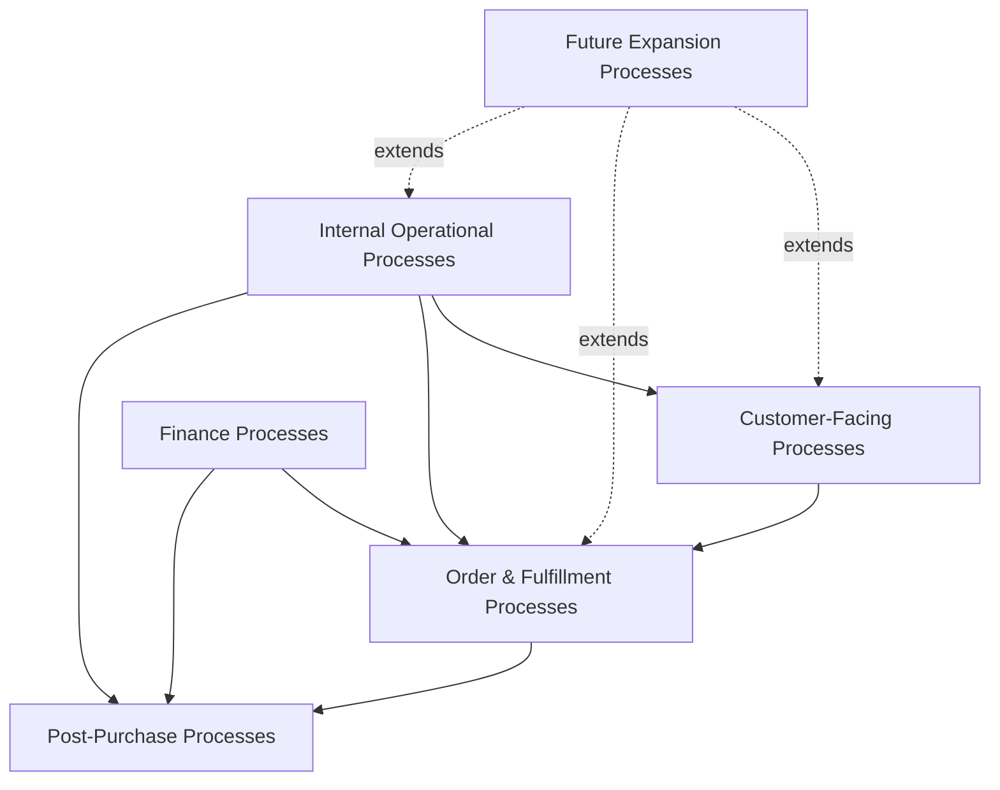
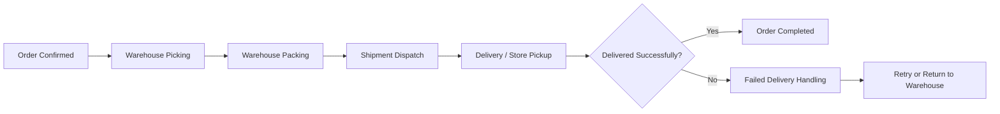
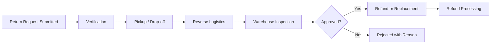
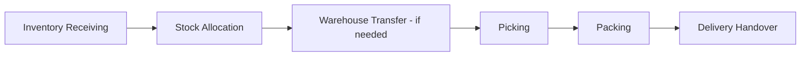
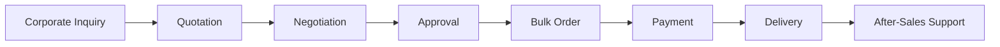
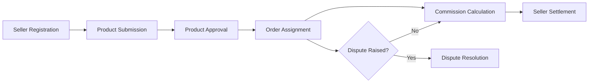
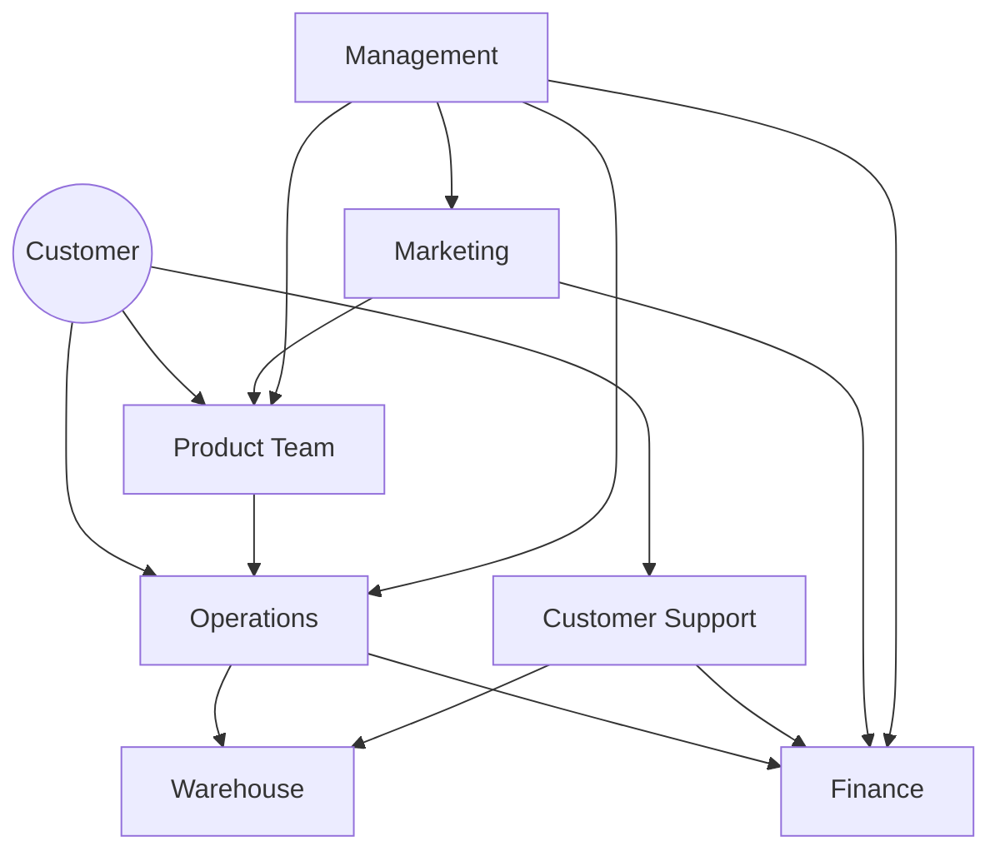

# Business Workflow Specification

## 1. Document Purpose

This document is the official Business Workflow Specification for **StackLeo Tech Store**. It defines every major business workflow executed across the organization and platform, modeled using BPMN-inspired process thinking. It aligns Product, Operations, Engineering, Customer Support, Finance, Warehouse, Marketing, Management, QA, and the future Marketplace team around a shared, end-to-end view of how the business actually operates.

This document sits above `use-cases.md` and `functional-requirements.md`: where those documents describe discrete system interactions and behaviors, this document describes the complete, cross-functional business process each interaction belongs to — including the people, decisions, and exceptions involved, not just the system's response.

This document defines business process only. It does not describe implementation approach, technology choices, API design, or database structure, all of which are addressed in dedicated technical documentation elsewhere in the repository.

## 2. Workflow Methodology

- **Workflow Concepts** — a workflow is a bounded, end-to-end business process with a clear trigger, a defined sequence of steps, and an observable outcome. Workflows may span multiple actors, systems, and departments.
- **Process Ownership** — every workflow has a designated business owner accountable for its performance and continuous improvement, defined in Section 12.
- **Swimlane Thinking** — each workflow's actors represent implicit swimlanes; responsibility hands off cleanly between actors at defined points, avoiding ambiguity about who is accountable at each stage.
- **Decision Points** — workflows explicitly identify where a decision branches the process (e.g., approved vs. rejected), rather than treating branching as an implementation detail.
- **Business Events** — workflows are triggered and connected by business events (e.g., "Order Confirmed," "Return Approved"), consistent with the event-based interaction model defined in `product-modules.md` (Section 10).
- **Continuous Improvement** — workflows are treated as living processes, reviewed against real operational data and refined over time, per Section 13.

## 3. Business Process Overview

StackLeo Tech Store's operating model spans five interconnected process domains:

*Diagram: End-to-End Business Process Map.*

Customer-facing processes (discovery through purchase) are fulfilled through internal operational processes (catalog, inventory, warehouse), financially reconciled through Finance processes, and supported post-purchase through Returns, Refunds, and Warranty. Future expansion processes (Corporate Sales, Marketplace, AI & Automation) extend this same operating model rather than replacing it, consistent with the phased approach defined in `product-roadmap.md`.

## 4. Workflow Inventory Summary

| Section | Workflow Count | Workflow ID Range |
|---|---|---|
| Customer Workflows | 20 | WF-001–WF-020 |
| Internal Business Workflows | 18 | WF-021–WF-038 |
| Finance Workflows | 5 | WF-039–WF-043 |
| Warehouse & Logistics Workflows | 6 | WF-044–WF-049 |
| Corporate Sales Workflows (Future) | 8 | WF-050–WF-057 |
| Marketplace Workflows (Future) | 7 | WF-058–WF-064 |
| AI & Automation Workflows (Future) | 6 | WF-065–WF-070 |

**Total Workflows: 70**

Each workflow below follows the template defined in Section 11, presented across four tables per section: **Identity**, **Actors & Data**, **Flow**, and **Traceability & Metrics**.

---

## 5. Customer Workflows

### 5.1 Identity

| ID | Workflow Name | Business Objective | Trigger |
|---|---|---|---|
| WF-001 | Guest Browsing | Let prospective customers evaluate the catalog before committing to an account. | Visitor arrives at the platform. |
| WF-002 | Registration | Convert a visitor into an authenticated, trackable customer. | Visitor chooses to register. |
| WF-003 | Login | Authenticate a returning customer securely. | Customer initiates login. |
| WF-004 | Product Search | Help customers find specific products quickly. | Customer submits a search query. |
| WF-005 | Product Comparison | Support confident purchase decisions among similar products. | Customer selects multiple products to compare. |
| WF-006 | Wishlist | Capture customer intent for future purchase. | Customer saves a product for later. |
| WF-007 | Add to Cart | Collect intended purchases prior to checkout. | Customer selects a product to buy. |
| WF-008 | Checkout | Convert a cart into a confirmed, payable order. | Customer initiates checkout. |
| WF-009 | Payment | Collect payment for a confirmed order. | Customer submits payment. |
| WF-010 | Order Placement | Create the authoritative record of a completed transaction. | Payment or COD confirmation succeeds. |
| WF-011 | Order Confirmation | Assure the customer their order was successfully placed. | Order record is created. |
| WF-012 | Order Tracking | Give the customer visibility into fulfillment progress. | Customer checks order status. |
| WF-013 | Delivery | Physically deliver or hand over the ordered product. | Order reaches dispatch readiness. |
| WF-014 | Invoice Download | Provide compliant proof of purchase. | Customer requests an invoice. |
| WF-015 | Return Request | Resolve issues with an eligible delivered order. | Customer requests a return. |
| WF-016 | Refund Request | Provide financial resolution for an approved case. | A return, cancellation, or claim is approved for refund. |
| WF-017 | Warranty Claim | Resolve a product defect under warranty. | Customer submits a warranty claim. |
| WF-018 | Review Submission | Capture verified customer feedback. | Customer submits a product review. |
| WF-019 | Customer Support | Resolve customer questions and issues. | Customer contacts support. |
| WF-020 | Repeat Purchase | Convert a satisfied customer into a returning one. | Customer initiates a new purchase after a prior order. |

### 5.2 Actors, Inputs & Outputs

| ID | Actors | Inputs | Outputs |
|---|---|---|---|
| WF-001 | Guest | Catalog data | Product awareness, potential registration |
| WF-002 | Guest, Email/SMS Service | Registration details | Verified Customer account |
| WF-003 | Customer | Credentials | Authenticated session |
| WF-004 | Customer | Search query | Ranked product results |
| WF-005 | Customer | Selected products | Side-by-side specification view |
| WF-006 | Customer | Product selection | Saved wishlist entry |
| WF-007 | Customer | Product, quantity | Updated cart |
| WF-008 | Customer, Payment Gateway | Cart, address, payment method | Confirmed checkout request |
| WF-009 | Customer, Payment Gateway, Courier Service (COD) | Payment method, order total | Payment confirmation or failure |
| WF-010 | Customer | Confirmed payment/COD | Order record |
| WF-011 | Customer, Email/SMS Service | Order record | Confirmation notification |
| WF-012 | Customer, Courier Service | Order reference | Current delivery status |
| WF-013 | Customer, Courier Service, Warehouse Staff | Packed order | Delivered/collected product |
| WF-014 | Customer | Order reference | Compliant invoice document |
| WF-015 | Customer, Customer Support, Warehouse Staff | Order, return reason | Return decision |
| WF-016 | Customer, Finance Officer, Payment Gateway | Approved return/cancellation | Completed refund |
| WF-017 | Customer, Customer Support, Service Center | Product, proof of purchase | Repair/replacement resolution |
| WF-018 | Customer, Admin (moderation) | Rating, feedback | Published review |
| WF-019 | Customer, Customer Support | Inquiry | Resolution or escalation |
| WF-020 | Customer | Prior order history | New order |

### 5.3 Flow

| ID | Main Flow | Decision Points | Exception Flow | Postconditions |
|---|---|---|---|---|
| WF-001 | Browse catalog → view products → optionally register | Register now vs. continue browsing | No matching products found | Visitor informed, browsing session continues or converts |
| WF-002 | Submit details → verify → activate | Contact detail already registered? | Verification code expires | Verified, active Customer account |
| WF-003 | Submit credentials → verify → session established | Credentials valid? | Repeated failures → lockout | Authenticated session |
| WF-004 | Enter keyword → return ranked results | Results found vs. zero results | Malformed query | Customer views relevant results or guided empty state |
| WF-005 | Select products → view side-by-side specs | Products comparable? | Incompatible category selection | Customer makes an informed choice |
| WF-006 | Add product → view wishlist later → optionally move to cart | Item still in stock? | Item discontinued | Wishlist reflects current, accurate saved items |
| WF-007 | Select product/quantity → validate stock → add | Sufficient stock? | Requested quantity exceeds stock | Cart reflects validated selection |
| WF-008 | Confirm address → select delivery → select payment → confirm | Address serviceable? Payment method eligible? | Non-serviceable address; incomplete fields | Confirmed checkout request passed to payment |
| WF-009 | Submit payment → gateway processes → confirm/fail | Payment succeeds? | Gateway timeout/failure | Order proceeds or stock is released |
| WF-010 | Create order → assign reference → notify | — | Notification delivery failure | Confirmed order enters fulfillment |
| WF-011 | Detect order creation → send confirmation | Channel available (email/SMS)? | Delivery failure | Customer informed of successful order |
| WF-012 | Open order → display current status | — | Status stale/unavailable | Customer has current visibility |
| WF-013 | Assign courier/pickup → transit → deliver/collect | Courier available? Attempt succeeds? | Failed delivery attempt | Product reaches customer or returns to warehouse |
| WF-014 | Request invoice → retrieve/generate → download | — | Generation delay | Customer holds compliant invoice |
| WF-015 | Submit request → verify eligibility → inspect → decide | Eligible? Inspection passes? | Window expired; serial mismatch | Return approved, rejected, or escalated |
| WF-016 | Approve trigger received → calculate → process → notify | Original method creditable? | Method cannot be credited | Refund completed and reconciled |
| WF-017 | Submit claim → verify → inspect → diagnose → resolve | Covered? Repairable? | Excluded cause; stock unavailable | Claim resolved via repair, replacement, or rejection |
| WF-018 | Submit review → moderate → publish/reject | Content compliant? | Policy violation | Genuine review published or rejected with reason |
| WF-019 | Contact support → investigate → resolve/escalate | Within standard policy? | Requires Finance/Admin escalation | Case resolved or escalated with context |
| WF-020 | Return to platform → repeat discovery/cart/checkout → order | Reorder from history vs. new browsing | Prior product/variant unavailable | New order placed |

### 5.4 Traceability & Metrics

| ID | Related Features / Modules | Related Stories / Use Cases / FR / AC | KPIs | Risks | Future Improvements |
|---|---|---|---|---|---|
| WF-001 | FEAT-008 / MOD-007 | US-005 / UC-005 / FR-005 / AC-004 | Browse-to-registration rate | Weak first impression drives no return visit | AI-personalized browsing (WF-066) |
| WF-002 | FEAT-001 / MOD-001 | US-001 / UC-001 / FR-001 / AC-001 | Registration completion rate | Verification friction causes abandonment | Federated sign-in |
| WF-003 | FEAT-001 / MOD-001 | US-002 / UC-002 / FR-002 / AC-002 | Login success rate | Lockout frustration | MFA readiness (NFR-026) |
| WF-004 | FEAT-011 / MOD-010 | US-009 / UC-009 / FR-009 / AC-007 | Search-to-purchase rate | Poor relevance ranking | AI Search (WF-065) |
| WF-005 | FEAT-006 / MOD-007 | US-012 / UC-012 / FR-012 / AC-010 | Compare-to-purchase rate | Missing specification data | AI-assisted comparison highlights |
| WF-006 | FEAT-005 / MOD-005 | US-011 / UC-011 / FR-011 / AC-009 | Wishlist conversion rate | No proactive re-engagement | Price/stock alerts |
| WF-007 | FEAT-015 / MOD-012 | US-013 / UC-013 / FR-013 / AC-011 | Cart abandonment rate | Stock conflict at checkout | Persistent cross-device cart |
| WF-008 | FEAT-016 / MOD-013 | US-015–017 / UC-015 / FR-015-016 / AC-013-014 | Checkout completion rate | Late-stage checkout friction | One-click checkout |
| WF-009 | FEAT-027–031 / MOD-014 | US-018-019 / UC-017-018 / FR-017-019 / AC-015-016 | Payment success rate | Gateway downtime | EMI, wallet support |
| WF-010 | FEAT-020 / MOD-017 | US-020 / UC-019 / FR-020 / AC-017 | Order Success Rate | Notification delivery failure | Real-time in-app confirmation |
| WF-011 | FEAT-020 / MOD-017, MOD-026 | US-020 / UC-019 / FR-020 / AC-017 | Notification delivery rate | Delayed/missing confirmation | Unified in-app notification center |
| WF-012 | FEAT-021 / MOD-019 | US-021 / UC-020 / FR-021 / AC-019 | Tracking engagement rate | Stale tracking data | Predictive delivery ETA |
| WF-013 | FEAT-035, FEAT-037 / MOD-019, MOD-020 | US-023-024 / UC-022-023 / FR-024-025 / AC-019 | On-Time Delivery Rate | Failed delivery attempts | Own delivery fleet |
| WF-014 | FEAT-022 / MOD-018 | — / UC-016 (context) / FR-023 / — | Invoice compliance rate | Generation delay | Digital invoice archive |
| WF-015 | FEAT-023 / MOD-022 | US-025 / UC-024 / FR-026 / AC-020 | Return Rate | Fraudulent return claims | Self-service eligibility checker |
| WF-016 | FEAT-024, FEAT-031 / MOD-023 | US-026 / UC-026 / FR-028 / AC-022 | Refund Processing Time | Reconciliation errors | Instant refund options |
| WF-017 | FEAT-026 / MOD-024 | US-027 / UC-027 / FR-029 / AC-023 | Claim Approval Rate | Long repair turnaround | QR code warranty verification |
| WF-018 | FEAT-038, FEAT-039 / MOD-025 | US-029 / UC-029 / FR-031 / AC-025 | Review submission rate | Moderation delay | Review helpfulness voting |
| WF-019 | FEAT-040 / MOD-026, MOD-005 | — / UC-025 / FR-032 / AC-026 | Support resolution time | Fragmented case visibility | AI chatbot (WF-070) |
| WF-020 | FEAT-020 / MOD-017, MOD-005 | See `user-journeys.md` JR-022 | Repeat Purchase Rate | Unresolved past issue deters return | One-click reorder, loyalty program |

---

## 6. Internal Business Workflows

### 6.1 Identity

| ID | Workflow Name | Business Objective | Trigger |
|---|---|---|---|
| WF-021 | Product Creation | Add new, accurate products to the catalog. | New product sourcing identified. |
| WF-022 | Product Approval | Ensure catalog quality before publication. | Product listing submitted. |
| WF-023 | Category Management | Maintain a navigable, accurate category structure. | Category structure change needed. |
| WF-024 | Brand Management | Maintain verified brand associations. | New brand relationship established. |
| WF-025 | Inventory Update | Keep stock levels accurate in real time. | Order, restock, or adjustment event. |
| WF-026 | Stock Replenishment | Prevent stockouts through timely reordering. | Low-stock threshold reached. |
| WF-027 | Warehouse Picking | Retrieve correct items for a confirmed order. | Order enters Processing status. |
| WF-028 | Warehouse Packing | Prepare picked items for safe dispatch. | Picking completed. |
| WF-029 | Shipment Dispatch | Hand off packed orders to courier or pickup holding. | Packing completed. |
| WF-030 | Order Cancellation | Stop an order before it is fulfilled, at customer or business request. | Cancellation request received. |
| WF-031 | Refund Approval | Authorize financial resolution for eligible cases. | Refund-eligible event occurs. |
| WF-032 | Return Approval | Determine return outcome based on inspection. | Returned product received. |
| WF-033 | Warranty Verification | Confirm claim legitimacy before resolution. | Warranty claim submitted. |
| WF-034 | Customer Complaint Resolution | Resolve dissatisfaction beyond standard return/warranty scope. | Complaint escalated to support. |
| WF-035 | Coupon Management | Create and govern discount codes. | Marketing requests a new coupon. |
| WF-036 | Promotion Management | Create and govern time-bound campaigns. | Marketing requests a new campaign. |
| WF-037 | Marketing Campaign Execution | Execute approved campaigns to drive engagement. | Campaign reaches scheduled start. |
| WF-038 | Report Generation | Produce reliable business reporting. | Report requested or scheduled. |

### 6.2 Actors, Inputs & Outputs

| ID | Actors | Inputs | Outputs |
|---|---|---|---|
| WF-021 | Product Manager | Sourcing data, specifications | Draft product listing |
| WF-022 | Product Manager, Admin | Draft listing | Published or returned listing |
| WF-023 | Product Manager, Admin | Category change request | Updated category hierarchy |
| WF-024 | Product Manager, Admin | Brand documentation | Approved brand record |
| WF-025 | Inventory Manager | Order/restock events | Updated stock levels |
| WF-026 | Inventory Manager, Vendor (Future) | Low-stock alert | Replenishment order |
| WF-027 | Warehouse Staff | Order manifest | Picked items |
| WF-028 | Warehouse Staff | Picked items | Packed, labeled shipment |
| WF-029 | Warehouse Staff, Courier Service | Packed shipment | Shipment in transit or ready for pickup |
| WF-030 | Customer, Customer Support, Admin | Cancellation request | Cancelled order, released stock/payment |
| WF-031 | Finance Officer, Admin | Refund-eligible event | Approved refund instruction |
| WF-032 | Customer Support, Warehouse Staff | Returned product | Approved/rejected decision |
| WF-033 | Customer Support, Service Center | Claim, serial/IMEI data | Verified/rejected claim |
| WF-034 | Customer Support, Admin | Escalated complaint | Documented resolution |
| WF-035 | Marketing Manager, Admin | Coupon parameters | Approved, active coupon |
| WF-036 | Marketing Manager, Admin | Campaign parameters | Approved, scheduled campaign |
| WF-037 | Marketing Manager | Approved campaign | Live campaign, performance data |
| WF-038 | Finance Officer, Business Analyst | Report parameters | Generated report |

### 6.3 Flow

| ID | Main Flow | Decision Points | Exception Flow | Postconditions |
|---|---|---|---|---|
| WF-021 | Gather product data → enter listing → submit for approval | Meets minimum completeness? | Missing mandatory fields | Draft listing awaiting approval |
| WF-022 | Review listing → approve/reject | Content and pricing acceptable? | Rejected for incompleteness | Listing published or returned |
| WF-023 | Propose category change → validate → apply | Existing products affected? | Category has active products (deletion blocked) | Updated, consistent category structure |
| WF-024 | Submit brand documentation → verify → approve | Brand legitimacy confirmed? | Verification fails | Approved brand available for product association |
| WF-025 | Detect order/restock event → deduct/replenish stock | — | Discrepancy vs. physical count | Accurate, current stock level |
| WF-026 | Alert triggered → review → place replenishment order | Sufficient supplier availability? | Supplier shortage | Stock replenished before stockout |
| WF-027 | Receive manifest → locate items → verify condition | Item available and correct condition? | Item missing/damaged → discrepancy report | Items ready for packing |
| WF-028 | Receive picked items → pack securely → label | — | Packaging materials insufficient | Shipment ready for dispatch |
| WF-029 | Assign courier/pickup → hand off | Courier available for zone? | Courier cannot service order → fallback assigned | Shipment in transit or held for pickup |
| WF-030 | Request received → validate order status → cancel | Order already shipped? | Shipped order redirected to return (WF-015) | Order cancelled, stock/payment released |
| WF-031 | Eligible event detected → calculate → approve | Amount and method correct? | Original method cannot be credited | Refund instruction approved for processing |
| WF-032 | Inspect returned product → decide | Condition matches claim? Serial matches? | Serial mismatch → fraud review | Return approved, rejected, or escalated |
| WF-033 | Review claim documents → verify serial/IMEI → decide | Within warranty? Excluded cause? | Mismatch or exclusion detected | Claim verified or rejected |
| WF-034 | Escalated case reviewed → investigated → resolved | Resolution within policy? | Requires cross-department coordination | Documented, communicated resolution |
| WF-035 | Define coupon parameters → submit for approval → activate | Approved? | Conflicts with active promotion | Active, governed coupon |
| WF-036 | Define campaign parameters → submit for approval → activate | Approved? | Pricing conflict | Active, governed campaign |
| WF-037 | Campaign activates → monitor performance → conclude | Performance within expectations? | Underperformance or over-discounting | Campaign concluded, results reviewed |
| WF-038 | Select report type/period → compile → deliver | Underlying data complete? | Incomplete data for period | Accurate, role-scoped report |

### 6.4 Traceability & Metrics

| ID | Related Features / Modules | Related Stories / Use Cases / FR / AC | KPIs | Risks | Future Improvements |
|---|---|---|---|---|---|
| WF-021 | FEAT-046 / MOD-007, MOD-029 | — / UC-005 (context) / FR-005 / — | Catalog completeness | Incomplete/inaccurate listings | Bulk import tools |
| WF-022 | FEAT-046 / MOD-007, MOD-029 | — / — / FR-005 / — | Time-to-publish | Approval backlog | Automated low-risk approvals |
| WF-023 | FEAT-009 / MOD-008 | US-007 / UC-007 / FR-007 / AC-005 | Category browse depth | Broken category-product linkage | Dynamic merchandising |
| WF-024 | FEAT-010 / MOD-009 | US-008 / UC-008 / FR-008 / AC-006 | Brand page engagement | Unauthorized brand association | Brand storefront pages |
| WF-025 | FEAT-032 / MOD-021 | US-032 / UC-032 / FR-034 / AC-028 | Stock accuracy rate | Overselling | Predictive stock alerts |
| WF-026 | FEAT-032 / MOD-021, MOD-020 | US-032 / UC-032 / FR-034 / AC-028 | Stockout rate | Supplier delay | Automated reorder suggestions |
| WF-027 | (supports FEAT-035, 037) / MOD-020, MOD-021 | US-032-033 / UC-033 / FR-034-035 / AC-028 | Picking accuracy | Picking errors | Multi-warehouse routing |
| WF-028 | (supports FEAT-035, 037) / MOD-020 | — / UC-033 / FR-034 / — | Packing accuracy | Insufficient materials | Packaging standardization |
| WF-029 | FEAT-035 / MOD-019 | US-023 / UC-022 / FR-024 / AC-013 | Courier SLA Compliance | Courier unavailability | Own delivery fleet |
| WF-030 | FEAT-020 / MOD-017, MOD-021, MOD-023 | US-022 / UC-021 / FR-022 / AC-018 | Order cancellation rate | Redirect confusion (shipped order) | Clearer self-service cancellation |
| WF-031 | FEAT-024 / MOD-023 | US-026 / UC-026 / FR-028 / AC-022 | Refund Processing Time | Reconciliation errors | Automated approval thresholds |
| WF-032 | FEAT-023, 025 / MOD-022 | US-026 / UC-025 / FR-027 / AC-021 | Return approval rate | Serial mismatch fraud | Self-service inspection scheduling |
| WF-033 | FEAT-026 / MOD-024 | US-028 / UC-028 / FR-030 / AC-024 | Claim Approval Rate | Fraudulent claims | AI-assisted validation (WF-067) |
| WF-034 | FEAT-040 / MOD-026, MOD-005 | — / UC-025 (context) / FR-032 / — | Complaint resolution time | Cross-department delay | Unified case management |
| WF-035 | FEAT-017 / MOD-015 | US-036 / UC-016, UC-036 / FR-038 / AC-031 | Coupon redemption rate | Coupon abuse | Personalized targeting |
| WF-036 | FEAT-018 / MOD-016 | US-037 / UC-037 / FR-039 / AC-032 (context) | Campaign-driven revenue | Over-discounting | AI-optimized timing |
| WF-037 | FEAT-018 / MOD-016, MOD-027 | US-038 / UC-038 / FR-040 / AC-032 | Promotion ROI | Margin erosion | Real-time performance dashboards |
| WF-038 | FEAT-051 / MOD-028 | US-034 / UC-034 / FR-036 / AC-029 | Report usage rate | Report inaccuracy | Scheduled report delivery |

---

## 7. Finance Workflows

### 7.1 Identity

| ID | Workflow Name | Business Objective | Trigger |
|---|---|---|---|
| WF-039 | Payment Verification | Confirm payment legitimacy before fulfillment. | Payment submitted. |
| WF-040 | Invoice Generation | Produce compliant financial documentation. | Order confirmed. |
| WF-041 | Refund Processing | Execute approved refunds accurately. | Refund approved. |
| WF-042 | Revenue Reconciliation | Ensure financial records match actual transactions. | Scheduled reconciliation cycle. |
| WF-043 | Settlement (Future Marketplace) | Pay marketplace sellers accurately and on schedule. | Settlement cycle reached. |

### 7.2 Actors, Inputs & Outputs

| ID | Actors | Inputs | Outputs |
|---|---|---|---|
| WF-039 | Payment Gateway, Finance Officer | Payment submission | Confirmed or failed payment status |
| WF-040 | Finance Officer (oversight) | Confirmed order | Compliant invoice |
| WF-041 | Finance Officer, Payment Gateway | Approved refund | Completed refund transaction |
| WF-042 | Finance Officer | Order, payment, refund records | Reconciled financial statement |
| WF-043 | Finance Officer, Marketplace Seller | Seller orders, commission data | Seller payout |

### 7.3 Flow

| ID | Main Flow | Decision Points | Exception Flow | Postconditions |
|---|---|---|---|---|
| WF-039 | Submit payment → gateway verifies → confirm | Payment successful? | Timeout/failure | Order proceeds or is blocked |
| WF-040 | Order confirmed → compile financial details → generate | — | Generation delay | Compliant invoice available |
| WF-041 | Approval received → calculate → process → reconcile | Original method creditable? | Rerouted to alternate method | Refund completed and reconciled |
| WF-042 | Compile period transactions → reconcile against gateway records → resolve discrepancies | Records match? | Discrepancy identified | Clean, accurate financial statement |
| WF-043 | Compile seller orders/commission → calculate payout → disburse | Amounts reconciled? | Discrepancy in commission calculation | Seller paid accurately and on schedule |

### 7.4 Traceability & Metrics

| ID | Related Features / Modules | Related Stories / Use Cases / FR / AC | KPIs | Risks | Future Improvements |
|---|---|---|---|---|---|
| WF-039 | FEAT-029, 030 / MOD-014 | US-018 / UC-017 / FR-017, 019 / AC-015 | Payment success rate | Gateway failure | Multi-gateway redundancy |
| WF-040 | FEAT-022 / MOD-018 | — / — / FR-023 / — | Invoice compliance rate | Compliance gaps | Digital invoice archive |
| WF-041 | FEAT-024, 031 / MOD-023 | US-026 / UC-026 / FR-028 / AC-022 | Refund Processing Time | Reconciliation errors | Automated reconciliation |
| WF-042 | FEAT-051 / MOD-028, MOD-014 | US-034 / UC-034 / FR-036 / AC-029 | Reconciliation accuracy | Manual cross-referencing errors | Automated reconciliation reporting |
| WF-043 | FEAT-057 (Future) / MOD-031 | US-041 (Future) / UC-041 / — / — | Marketplace settlement accuracy | Commission miscalculation | Real-time settlement dashboard |

---

## 8. Warehouse & Logistics Workflows

### 8.1 Identity

| ID | Workflow Name | Business Objective | Trigger |
|---|---|---|---|
| WF-044 | Inventory Receiving | Accurately onboard new stock into inventory. | Supplier delivery arrives. |
| WF-045 | Stock Allocation | Assign available stock across sales channels and orders. | Stock received or order placed. |
| WF-046 | Warehouse Transfer | Move stock between warehouse/store locations. | Location-level stock imbalance identified. |
| WF-047 | Delivery Handover | Transfer custody of a shipment to the courier. | Packed shipment ready for dispatch. |
| WF-048 | Failed Delivery Handling | Recover from an unsuccessful delivery attempt. | Courier reports failed attempt. |
| WF-049 | Reverse Logistics | Return a product from customer back to warehouse. | Return approved for physical return. |

### 8.2 Actors, Inputs & Outputs

| ID | Actors | Inputs | Outputs |
|---|---|---|---|
| WF-044 | Warehouse Staff, Inventory Manager | Supplier shipment | Verified, recorded stock |
| WF-045 | Inventory Manager | Stock levels, channel demand | Allocated, available stock |
| WF-046 | Warehouse Staff, Inventory Manager, Admin | Transfer request | Rebalanced stock across locations |
| WF-047 | Warehouse Staff, Courier Service | Packed shipment | Shipment in courier custody |
| WF-048 | Courier Service, Customer, Operations Manager | Failed attempt report | Re-delivery or return-to-warehouse |
| WF-049 | Customer, Courier Service, Warehouse Staff | Approved return | Product received and logged at warehouse |

### 8.3 Flow

| ID | Main Flow | Decision Points | Exception Flow | Postconditions |
|---|---|---|---|---|
| WF-044 | Receive shipment → verify against PO → record stock | Quantities/condition match PO? | Discrepancy vs. purchase order | Stock accurately onboarded |
| WF-045 | Assess demand across channels → allocate stock | Sufficient for all channels? | Insufficient stock for demand | Stock allocated per channel priority |
| WF-046 | Identify imbalance → authorize transfer → execute → record | Transfer authorized? | Unauthorized transfer attempt blocked | Stock rebalanced and recorded |
| WF-047 | Prepare shipment → courier collects → confirm handover | Courier on time? | Courier delay/no-show → fallback | Shipment in transit |
| WF-048 | Attempt delivery → log failure → notify customer → retry/return | Retry attempts remaining? | Attempts exhausted → return to warehouse | Delivered on retry or returned to inventory |
| WF-049 | Customer initiates return shipment/drop-off → courier/customer delivers → warehouse logs receipt | Received in expected condition? | Damaged in reverse transit | Product logged for inspection (WF-032) |

### 8.4 Traceability & Metrics

| ID | Related Features / Modules | Related Stories / Use Cases / FR / AC | KPIs | Risks | Future Improvements |
|---|---|---|---|---|---|
| WF-044 | FEAT-032 / MOD-020, MOD-021 | US-032 / UC-032 / FR-034 / AC-028 | Receiving accuracy | Supplier shipment discrepancy | Automated PO matching |
| WF-045 | FEAT-032, 033 / MOD-021 | US-032 / UC-032 / FR-034 / AC-028 | Channel stock accuracy | Overselling in one channel | Real-time cross-channel sync |
| WF-046 | FEAT-034 / MOD-020, MOD-021 | US-033 / UC-033 / FR-035 / AC-028 (context) | Multi-warehouse stock accuracy | Transfer errors | Automated inter-warehouse transfer |
| WF-047 | FEAT-035 / MOD-019, MOD-020 | US-023 / UC-022 / FR-024 / AC-013 | Handover timeliness | Courier delay | Delivery optimization routing |
| WF-048 | FEAT-036 / MOD-019 | US-024 / UC-023 / FR-025 / AC-019 | Failed Delivery Rate, RTO Rate | Repeated failed attempts | Proactive delivery-window confirmation |
| WF-049 | FEAT-023 / MOD-022, MOD-020 | US-025 / UC-024 / FR-026 / AC-020 | Reverse logistics turnaround | Damage in reverse transit | Dedicated reverse logistics tracking |

---

## 9. Corporate Sales Workflows (Future)

### 9.1 Identity

| ID | Workflow Name | Business Objective | Trigger |
|---|---|---|---|
| WF-050 | Corporate Inquiry | Capture organizational buyer interest. | Prospective corporate buyer contacts StackLeo. |
| WF-051 | Quotation | Provide formal pricing for a bulk requirement. | Corporate inquiry qualified. |
| WF-052 | Negotiation | Reach mutually agreeable bulk terms. | Quotation reviewed by buyer. |
| WF-053 | Approval | Formalize agreed corporate account terms. | Negotiation concluded. |
| WF-054 | Bulk Order | Process a bulk purchase under agreed terms. | Corporate buyer submits an order. |
| WF-055 | Payment (Corporate) | Collect payment per corporate account terms. | Bulk order confirmed. |
| WF-056 | Delivery (Corporate) | Fulfill bulk order to the organization's location(s). | Payment/terms confirmed. |
| WF-057 | After-Sales Support (Corporate) | Maintain the corporate relationship post-sale. | Corporate customer raises a need. |

### 9.2 Actors, Inputs & Outputs

| ID | Actors | Inputs | Outputs |
|---|---|---|---|
| WF-050 | Corporate Buyer, Sales Team | Inquiry details | Qualified lead |
| WF-051 | Sales Team, Finance Officer | Requirement specification | Formal quotation |
| WF-052 | Corporate Buyer, Sales Team | Quotation feedback | Agreed terms |
| WF-053 | Admin, Finance Officer | Agreed terms | Approved corporate account |
| WF-054 | Corporate Buyer, Finance Officer | Bulk order request | Validated, confirmed order |
| WF-055 | Corporate Buyer, Finance Officer | Order total, agreed terms | Confirmed payment |
| WF-056 | Warehouse Staff, Courier Service | Confirmed bulk order | Delivered bulk shipment |
| WF-057 | Corporate Buyer, Customer Support | Support need | Documented resolution |

### 9.3 Flow

| ID | Main Flow | Decision Points | Exception Flow | Postconditions |
|---|---|---|---|---|
| WF-050 | Inquiry received → qualify → route to sales | Genuine bulk/organizational need? | Inquiry does not meet corporate threshold | Qualified lead routed for quotation |
| WF-051 | Assess requirement → price under bulk terms → issue quotation | Standard bulk tier applies? | Non-standard requirement | Formal quotation issued |
| WF-052 | Buyer reviews → counter-proposes → agree | Terms acceptable to both parties? | Negotiation stalls | Mutually agreed terms |
| WF-053 | Formalize agreement → approve account | Terms compliant with policy? | Terms require exception approval | Approved, active corporate account |
| WF-054 | Submit order → validate against terms/stock → confirm | Within agreed terms and stock? | Exceeds terms or stock | Confirmed bulk order |
| WF-055 | Invoice per terms → collect payment → confirm | Payment received per terms? | Payment delay | Order proceeds to fulfillment |
| WF-056 | Prepare bulk shipment → dispatch → deliver | Delivery logistics feasible as agreed? | Delivery delay | Bulk order delivered |
| WF-057 | Buyer raises need → support investigates → resolves | Within standard account terms? | Requires account manager escalation | Documented, resolved outcome |

### 9.4 Traceability & Metrics

| ID | Related Features / Modules | Related Stories / Use Cases / FR / AC | KPIs | Risks | Future Improvements |
|---|---|---|---|---|---|
| WF-050 | FEAT-055 (Future) / MOD-030 | US-039 (Future) / UC-039 / FR-041 / AC-033 | Corporate lead volume | Low-quality leads | Self-service inquiry portal |
| WF-051 | FEAT-055 / MOD-030 | US-039 / UC-039 / FR-041 / AC-033 | Quotation turnaround time | Inconsistent pricing | Automated quotation tooling |
| WF-052 | FEAT-055 / MOD-030 | US-039 / UC-039 / FR-041 / AC-033 | Negotiation cycle time | Prolonged negotiation | Pre-approved tiered pricing |
| WF-053 | FEAT-055 / MOD-030, MOD-029 | US-039 / UC-039 / FR-041 / AC-033 | Account approval time | Non-standard term exceptions | Streamlined approval workflow |
| WF-054 | FEAT-055 / MOD-030 | US-039 / UC-039 / FR-041 / AC-033 | Corporate order volume | Exceeding agreed terms | Real-time terms validation |
| WF-055 | FEAT-055 / MOD-030, MOD-014 | US-039 / UC-039 / FR-041 / AC-033 | Corporate revenue contribution | Payment delay | Corporate invoicing automation |
| WF-056 | FEAT-055 / MOD-030, MOD-019 | US-039 / UC-039 / FR-041 / AC-033 | Corporate delivery reliability | Bulk delivery delay | Dedicated corporate logistics |
| WF-057 | FEAT-055 / MOD-030, MOD-026 | US-039 / UC-039 / FR-041 / AC-033 | Corporate satisfaction | Slow account-level support | Dedicated account manager model |

*All Corporate Sales workflows are not yet active; targeted for Phase 4 per `product-roadmap.md`.*

---

## 10. Marketplace Workflows (Future)

### 10.1 Identity

| ID | Workflow Name | Business Objective | Trigger |
|---|---|---|---|
| WF-058 | Seller Registration | Onboard verified third-party sellers. | Prospective seller applies. |
| WF-059 | Product Submission | Enable sellers to list products. | Approved seller submits a listing. |
| WF-060 | Product Approval (Marketplace) | Preserve catalog authenticity across sellers. | Listing submitted for review. |
| WF-061 | Order Assignment | Route marketplace orders to the correct seller. | Customer places a marketplace order. |
| WF-062 | Commission Calculation | Determine StackLeo's commission on a sale. | Marketplace order completes. |
| WF-063 | Seller Settlement | Pay sellers accurately and on schedule. | Settlement cycle reached. |
| WF-064 | Dispute Resolution | Resolve conflicts between customers and sellers. | Customer or seller raises a dispute. |

### 10.2 Actors, Inputs & Outputs

| ID | Actors | Inputs | Outputs |
|---|---|---|---|
| WF-058 | Marketplace Seller, Admin | Application, verification documents | Approved seller account |
| WF-059 | Marketplace Seller | Product listing data | Draft marketplace listing |
| WF-060 | Admin | Draft listing | Published or rejected listing |
| WF-061 | Customer, Marketplace Seller | Marketplace order | Order routed to seller |
| WF-062 | Finance Officer | Completed order, commission rate | Calculated commission |
| WF-063 | Finance Officer, Marketplace Seller | Reconciled orders, commission | Seller payout |
| WF-064 | Customer, Marketplace Seller, Admin | Dispute details | Mediated resolution |

### 10.3 Flow

| ID | Main Flow | Decision Points | Exception Flow | Postconditions |
|---|---|---|---|---|
| WF-058 | Submit application → verify identity/business → approve | Verification successful? | Failed verification | Verified seller account activated |
| WF-059 | Prepare listing → submit | Meets listing standards? | Missing required fields | Draft listing awaiting approval |
| WF-060 | Review listing → approve/reject | Authenticity and content compliant? | Unauthorized brand association | Listing published or rejected with feedback |
| WF-061 | Customer orders → system routes to seller | Seller has stock? | Seller cannot fulfill | Order routed for seller fulfillment |
| WF-062 | Order completes → apply commission rate → calculate | Rate correctly applied? | Rate miscalculation | Commission recorded against order |
| WF-063 | Reconcile period orders/commission → disburse | Amounts accurate? | Discrepancy identified | Seller paid accurately and on schedule |
| WF-064 | Dispute raised → investigate → mediate → resolve | Resolvable directly between parties? | Requires StackLeo mediation | Documented, agreed resolution |

### 10.4 Traceability & Metrics

| ID | Related Features / Modules | Related Stories / Use Cases / FR / AC | KPIs | Risks | Future Improvements |
|---|---|---|---|---|---|
| WF-058 | FEAT-056 (Future) / MOD-031 | US-040 / UC-040 / FR-042 / AC-034 | Verified seller count | Fraudulent seller applications | AI-assisted verification (WF-067) |
| WF-059 | FEAT-057 (Future) / MOD-031 | US-041 / UC-041 / FR-043 / — | Listing submission volume | Poor-quality listings | Guided listing templates |
| WF-060 | FEAT-057 (Future) / MOD-031, MOD-029 | US-041 / UC-041 / FR-043 / — | Listing approval turnaround | Approval bottleneck at scale | Automated authenticity checks |
| WF-061 | FEAT-057 (Future) / MOD-031 | US-041 / UC-041 / FR-043 / — | Marketplace order fulfillment rate | Seller cannot fulfill | Real-time seller stock sync |
| WF-062 | FEAT-057 (Future) / MOD-031 | — / — / — / — | Commission calculation accuracy | Miscalculation | Automated commission engine |
| WF-063 | FEAT-057 (Future) / MOD-031 | — / — / — / — | Marketplace settlement accuracy | Payout delay | Real-time settlement dashboard |
| WF-064 | FEAT-057 (Future) / MOD-031, MOD-026 | — / — / — / — | Dispute resolution time | Escalation volume at scale | Structured dispute workflow tooling |

*All Marketplace workflows are not yet active; targeted for Phase 5 per `product-roadmap.md`.*

---

## 11. AI & Automation Workflows (Future)

### 11.1 Identity

| ID | Workflow Name | Business Objective | Trigger |
|---|---|---|---|
| WF-065 | AI Search | Improve search relevance through intelligent ranking. | Customer submits a search query. |
| WF-066 | Recommendation Engine | Surface personalized product suggestions. | Customer browses catalog/product/checkout. |
| WF-067 | Fraud Detection | Identify fraudulent orders, returns, and claims. | Order, return, or claim submitted. |
| WF-068 | Dynamic Pricing | Adjust pricing within governed bounds based on signals. | Demand/inventory/competitive signal changes. |
| WF-069 | Inventory Forecasting | Predict future stock needs. | Scheduled forecasting cycle. |
| WF-070 | Smart Notifications | Deliver intelligently timed, relevant notifications. | Customer or business event occurs. |

### 11.2 Actors, Inputs & Outputs

| ID | Actors | Inputs | Outputs |
|---|---|---|---|
| WF-065 | Customer, AI Services | Search query, catalog data | Ranked, relevant results |
| WF-066 | Customer, AI Services | Behavior, catalog data | Personalized recommendations |
| WF-067 | AI Services, Customer Support | Order/return/claim data | Fraud risk flag |
| WF-068 | AI Services, Product Manager | Demand, inventory, competitive data | Adjusted price within bounds |
| WF-069 | AI Services, Inventory Manager | Historical sales, inventory data | Forecasted demand |
| WF-070 | AI Services, Customer | Customer behavior, event data | Timely, relevant notification |

### 11.3 Flow

| ID | Main Flow | Decision Points | Exception Flow | Postconditions |
|---|---|---|---|---|
| WF-065 | Analyze query → rank by relevance → return results | Confidence sufficient? | Low relevance confidence | Customer receives improved search results |
| WF-066 | Analyze behavior/catalog → generate suggestions → display | Sufficient personal data? | Insufficient data → category fallback | Customer views relevant recommendations |
| WF-067 | Analyze submission → score risk → flag if needed | Risk threshold exceeded? | High-risk flag → manual review | Case proceeds normally or is reviewed |
| WF-068 | Monitor signals → compute adjustment → apply within bounds | Within min/max boundaries? | Adjustment outside bounds → blocked | Price adjusted or held at boundary |
| WF-069 | Analyze historical data → generate forecast → inform replenishment | Forecast confidence acceptable? | Low-confidence forecast flagged | Inventory Manager receives forecast |
| WF-070 | Detect event → determine relevance/timing → send | Customer preferences allow channel? | Preference restricts channel | Customer receives timely, relevant notification |

### 11.4 Traceability & Metrics

| ID | Related Features / Modules | Related Stories / Use Cases / FR / AC | KPIs | Risks | Future Improvements |
|---|---|---|---|---|---|
| WF-065 | FEAT-059 (Future) / MOD-010, MOD-032 | US-044 (Future) / UC-042 (context) / FR-009 (extended) / AC-007 (context) | Search relevance score | Query ambiguity across categories | Voice-based search |
| WF-066 | FEAT-060 (Future) / MOD-011, MOD-032 | US-042 / UC-042 / FR-044 / AC-035 | Recommendation-driven revenue | Recommendation confidence too low | Cross-channel personalization |
| WF-067 | FEAT-064 (Future) / MOD-032 | — / — / — / NFR-030 (context) | Fraud Detection Rate | False positives affecting genuine customers | Cross-claim pattern detection |
| WF-068 | FEAT-062 (Future) / MOD-032, MOD-014 | — / — / — / — | Margin stability | Perceived unfair pricing | Competitor-aware pricing signals |
| WF-069 | FEAT-063 (Future) / MOD-032, MOD-021 | — / — / — / — | Forecast accuracy | Low-confidence forecasts misused | Multi-warehouse-aware forecasting |
| WF-070 | FEAT-061 (Future, chatbot-adjacent) / MOD-032, MOD-026 | US-043 / UC-043 / FR-045 / — | Notification engagement rate | Over-notification fatigue | Adaptive notification timing |

*All AI & Automation workflows are not yet active; targeted for Phase 6 per `product-roadmap.md`.*

---

## 12. Workflow Template

Every workflow in Sections 5–11 follows this consistent template:

| Field | Description |
|---|---|
| Workflow ID | Unique identifier in the format `WF-XXX`. |
| Workflow Name | Descriptive name of the workflow. |
| Business Objective | The business purpose the workflow serves. |
| Trigger | The event that initiates the workflow. |
| Actors | The people, roles, or systems involved. |
| Inputs | What the workflow requires to begin. |
| Outputs | What the workflow produces upon completion. |
| Preconditions | Implicit in the workflow's trigger and inputs; elaborated in `use-cases.md` for system-level detail. |
| Main Flow | The primary, expected sequence of steps. |
| Decision Points | Where the workflow branches based on a condition. |
| Alternative Flow | Valid variations that still reach a successful outcome, noted inline within Main Flow where applicable. |
| Exception Flow | Failure or edge-case paths and their handling. |
| Postconditions | The resulting business state once the workflow concludes. |
| Related Features / Modules | Cross-references to `product-features.md` and `product-modules.md`. |
| Related User Stories / Use Cases | Cross-references to `user-stories.md` and `use-cases.md`. |
| Related Functional Requirements / Acceptance Criteria | Cross-references to `functional-requirements.md` and `acceptance-criteria.md`. |
| KPIs | Metrics used to evaluate the workflow's health. |
| Risks | Known or anticipated risks to the workflow's success. |
| Future Improvements | Identified opportunities to enhance the workflow. |

## 13. Key Process Diagrams

*Diagram: Customer Purchase Workflow.*

*Diagram: Order Fulfillment Workflow.*

*Diagram: Return & Refund Workflow.*

*Diagram: Warehouse Workflow.*

*Diagram: Corporate Sales Workflow (Future).*

*Diagram: Marketplace Workflow (Future).*

*Diagram: Cross-Department Workflow.*

See Section 3 for the End-to-End Business Process Map (diagram 8).

## 14. Cross-Department Collaboration

| Department Pair | Nature of Interaction |
|---|---|
| Customer ↔ Product Team | Customer behavior and feedback (reviews, support patterns) inform catalog and feature decisions. |
| Customer ↔ Operations | Customer orders and delivery preferences drive fulfillment execution. |
| Customer ↔ Customer Support | Direct interaction for inquiries, returns, refunds, and warranty. |
| Product Team ↔ Operations | Catalog and inventory decisions (Section 6) require operational feasibility input. |
| Operations ↔ Warehouse | Operations coordinates fulfillment; Warehouse executes picking, packing, and dispatch. |
| Operations ↔ Finance | Order and refund events require financial reconciliation. |
| Customer Support ↔ Finance | Refund approvals require Finance Officer authorization (WF-031, WF-041). |
| Customer Support ↔ Warehouse | Return inspections require Warehouse Staff coordination (WF-032). |
| Marketing ↔ Product Team | Promotions and campaigns require catalog and stock coordination (WF-035, WF-036). |
| Marketing ↔ Finance | Campaign budgets and margin impact require Finance oversight. |
| Management ↔ All Departments | Oversight, prioritization, and cross-department conflict resolution. |

## 15. Workflow Ownership

| Workflow Section | Primary Owner |
|---|---|
| Customer Workflows | Product Manager, UX Design |
| Internal Business Workflows | Operations Manager, Product Manager |
| Finance Workflows | Finance Officer |
| Warehouse & Logistics Workflows | Operations Manager, Warehouse Staff Lead |
| Corporate Sales Workflows (Future) | Founder / Business Owner, Sales Team |
| Marketplace Workflows (Future) | Product Manager, Marketplace Operations (Future) |
| AI & Automation Workflows (Future) | Product Manager, Engineering |

## 16. Workflow KPIs Summary

| Workflow Domain | Representative KPIs |
|---|---|
| Customer Workflows | Conversion rate, cart abandonment rate, Order Success Rate, Customer Satisfaction |
| Internal Business Workflows | Catalog completeness, stock accuracy, time-to-publish, report usage rate |
| Finance Workflows | Payment success rate, Refund Processing Time, reconciliation accuracy |
| Warehouse & Logistics Workflows | Receiving accuracy, On-Time Delivery Rate, Failed Delivery Rate, RTO Rate |
| Corporate Sales Workflows (Future) | Corporate revenue contribution, quotation turnaround time |
| Marketplace Workflows (Future) | Verified seller count, Marketplace GMV share, dispute resolution time |
| AI & Automation Workflows (Future) | Search relevance score, Fraud Detection Rate, forecast accuracy |

## 17. Process Dependencies

| Downstream Workflow | Depends On |
|---|---|
| WF-008 Checkout | WF-007 Add to Cart |
| WF-010 Order Placement | WF-009 Payment |
| WF-013 Delivery | WF-029 Shipment Dispatch |
| WF-015 Return Request | WF-013 Delivery |
| WF-016 Refund Request | WF-015 Return Request or WF-030 Order Cancellation |
| WF-027 Warehouse Picking | WF-010 Order Placement, WF-025 Inventory Update |
| WF-042 Revenue Reconciliation | WF-039 Payment Verification, WF-041 Refund Processing |
| WF-054 Bulk Order (Future) | WF-053 Approval (Future) |
| WF-061 Order Assignment (Future) | WF-060 Product Approval (Future) |
| WF-063 Seller Settlement (Future) | WF-062 Commission Calculation (Future) |

## 18. Risk Register

| Risk | Affected Workflows | Mitigation Direction |
|---|---|---|
| Overselling during concurrent demand | WF-007, WF-009, WF-025, WF-045 | Real-time stock validation at each stage (BR-030–BR-039) |
| Fraudulent returns/warranty claims | WF-015, WF-017, WF-032, WF-033 | Serial/IMEI verification, fraud escalation paths |
| Courier service disruption | WF-013, WF-029, WF-047, WF-048 | Multi-courier redundancy per `01_Business/shipping-policy.md` |
| Refund/reconciliation errors | WF-016, WF-031, WF-041, WF-042 | Segregation of duties, automated reconciliation |
| Over-discounting eroding margin | WF-035, WF-036, WF-037 | Margin impact review before campaign approval |
| Marketplace seller quality risk (Future) | WF-058, WF-059, WF-060 | Curated onboarding and listing approval |
| AI recommendation/pricing overreach (Future) | WF-066, WF-068 | Governed bounds and transparency requirements |

## 19. Improvement Opportunities

| Opportunity | Related Workflows |
|---|---|
| AI-assisted search and discovery | WF-004, WF-065 |
| Self-service eligibility checks for returns/warranty | WF-015, WF-017 |
| Automated reconciliation and settlement | WF-042, WF-043, WF-063 |
| Predictive inventory and stock alerts | WF-025, WF-026, WF-069 |
| Unified cross-department case management | WF-019, WF-034, WF-064 |
| Own delivery fleet to reduce courier dependency | WF-013, WF-029, WF-047 |

## 20. Workflow Governance

| Governance Aspect | Description |
|---|---|
| Workflow Ownership | Each workflow section has a designated owner, per Section 15, accountable for its performance and continuous improvement. |
| Process Review | Workflows are reviewed at the conclusion of each phase defined in `product-roadmap.md`, and whenever a related module, feature, or business rule changes materially. |
| Versioning | This document follows the Semantic Versioning approach defined in `00_Project_Overview/changelog.md`. |
| Change Management | Additions, removals, or material changes to a workflow must be recorded in `changelog.md`, with impact assessed against the Process Dependencies in Section 17. |
| Continuous Optimization | Workflow KPIs (Section 16) are reviewed regularly to identify degradation or improvement opportunities, feeding into Section 19. |

## 21. Document Information

| Property | Value |
|----------|-------|
| Document | business-workflows.md |
| Version | 1.0.0 |
| Status | Active |
| Maintained By | StackLeo |
| Last Updated | 2026-07-17 |

---

© StackLeo. All Rights Reserved.
