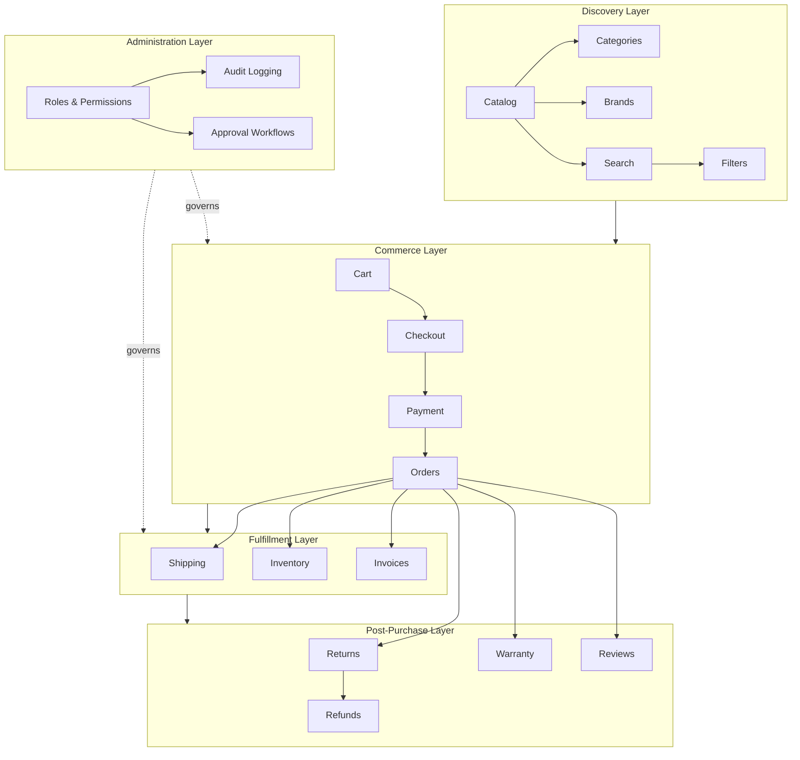
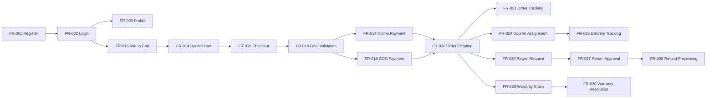
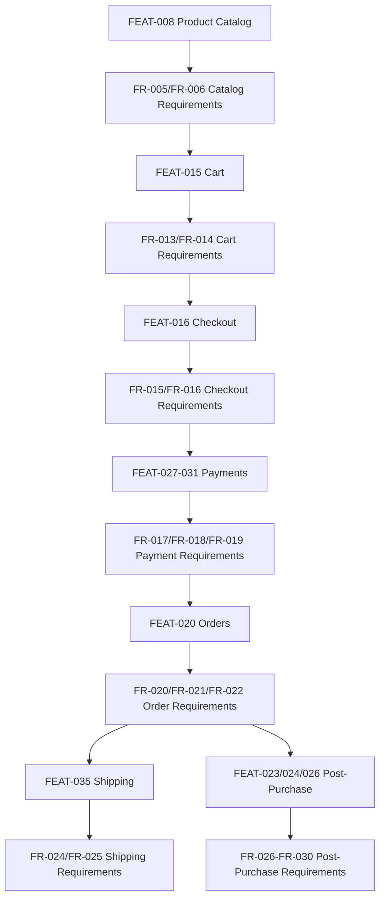

# Functional Requirements Specification

## 1. Document Purpose

This document is the official Functional Requirements Specification (FRS) for **StackLeo Tech Store**. It defines every functional capability the product must provide, from a business perspective, using IEEE 29148-inspired requirements writing conventions.

This document is the primary reference for Product, Design, Engineering, QA, DevOps, and Operations. Every requirement traces to a feature in `product-features.md`, a user story in `user-stories.md`, and a use case in `use-cases.md`, ensuring the specification remains grounded in validated business need rather than speculative scope.

This document defines functional behavior only. It does not describe implementation approach, technology choices, API design, or database structure, all of which are addressed in dedicated technical documentation elsewhere in the repository. Non-functional quality attributes (performance, reliability, security posture, usability) are addressed separately in `non-functional-requirements.md`.

## 2. Scope

This specification covers the functional capability required to deliver StackLeo Tech Store across its current sales channels (Web, Physical Store) and its planned future channels (Mobile App, POS), supporting the B2C business model today and the future B2B, corporate sales, wholesale, and multi-vendor marketplace models described in `01_Business/business-model.md`.

Requirements are organized into 30 functional categories, spanning customer-facing capability, internal administrative capability, and future capability not yet active. Requirements marked "Future" are included for completeness and roadmap alignment but are not part of the current MVP scope, per `00_Project_Overview/project-scope.md`.

## 3. Requirement Writing Standards

Each requirement in this document is written to be:

- **Atomic** — expressing a single, discrete capability rather than bundling multiple behaviors.
- **Testable** — expressed so that pass/fail verification is objectively possible.
- **Traceable** — linked to its originating feature, user story, and use case.
- **Unambiguous** — using precise, consistent language, with "shall" denoting a mandatory capability.
- **Complete** — including preconditions, triggers, expected behavior, and error conditions.
- **Consistent** — using terminology aligned with `01_Business/glossary.md` and `02_Product/glossary.md`.
- **Feasible** — scoped to a realistic, deliverable capability within the product's phased roadmap.

Requirement statements use the normative form "The system shall..." to denote mandatory behavior, consistent with IEEE 29148 convention.

## 4. Requirement Categories

| Category | Requirement Count |
|---|---|
| Authentication | 2 |
| User Management | 2 |
| Product Catalog | 2 |
| Categories | 1 |
| Brands | 1 |
| Search | 1 |
| Filters | 1 |
| Wishlist | 1 |
| Compare | 1 |
| Cart | 2 |
| Checkout | 2 |
| Payments | 3 |
| Orders | 3 |
| Invoices | 1 |
| Shipping | 2 |
| Returns | 2 |
| Refunds | 1 |
| Warranty | 2 |
| Reviews | 1 |
| Notifications | 1 |
| Customer Dashboard | 1 |
| Inventory | 2 |
| Reports | 1 |
| Analytics | 1 |
| Coupons | 1 |
| Promotions | 2 |
| Corporate Sales (Future) | 1 |
| Marketplace (Future) | 2 |
| AI Features (Future) | 2 |
| Administration | 3 |

**Total Functional Requirements: 50**

---

## 5. Functional Requirements

### 5.1 Authentication

#### FR-001 — Customer Registration

- **Title:** Customer Account Registration
- **Description:** The system shall allow a Guest to register a new Customer account using a valid, unique email address or mobile number.
- **Business Objective:** Enable the core customer relationship required for purchasing and order tracking.
- **Priority:** Must Have
- **Preconditions:** The provided contact detail is not already registered.
- **Trigger:** Guest submits the registration form.
- **Expected Behavior:** The system shall validate input, send a verification code, and activate the account upon successful verification.
- **Success Criteria:** A verified, active Customer account is created.
- **Error Conditions:** Duplicate contact detail; expired or invalid verification code.
- **Business Rules:** BR-001, BR-002, BR-003, BR-011
- **Dependencies:** None
- **Related User Stories:** US-001
- **Related Use Cases:** UC-001
- **Related PRDs:** `product-requirements.md`
- **Notes:** None.

#### FR-002 — Customer & Internal Login

- **Title:** Account Authentication
- **Description:** The system shall authenticate a Customer or internal Actor using verified credentials before granting access to role-scoped functionality.
- **Business Objective:** Protect account access and enforce authorization boundaries.
- **Priority:** Must Have
- **Preconditions:** Actor holds a verified, active account.
- **Trigger:** Actor submits login credentials.
- **Expected Behavior:** The system shall verify credentials and establish an authenticated session upon success.
- **Success Criteria:** Actor is authenticated and granted access consistent with their role.
- **Error Conditions:** Invalid credentials; repeated failed attempts triggering temporary lockout.
- **Business Rules:** BR-004, BR-005, BR-110, BR-114
- **Dependencies:** FR-001
- **Related User Stories:** US-002
- **Related Use Cases:** UC-002
- **Related PRDs:** `product-requirements.md`
- **Notes:** None.

### 5.2 User Management

#### FR-003 — Profile & Address Management

- **Title:** Customer Profile and Address Maintenance
- **Description:** The system shall allow an authenticated Customer to view and update their profile information and saved delivery addresses.
- **Business Objective:** Maintain accurate customer and delivery data to support reliable order fulfillment.
- **Priority:** Must Have
- **Preconditions:** Customer is authenticated.
- **Trigger:** Customer submits a profile or address update.
- **Expected Behavior:** The system shall validate and apply the update; changes to verified contact fields shall require re-verification.
- **Success Criteria:** Profile and address data reflect the customer's latest confirmed input.
- **Error Conditions:** Incomplete address submission; attempted use of a contact detail already registered to another account.
- **Business Rules:** BR-008, BR-009, BR-010, BR-012
- **Dependencies:** FR-002
- **Related User Stories:** US-003, US-004
- **Related Use Cases:** UC-003
- **Related PRDs:** `product-requirements.md`
- **Notes:** None.

#### FR-004 — Account Status Administration

- **Title:** Customer Account Status Management
- **Description:** The system shall allow an authorized Admin to suspend, reactivate, or close a customer account with a recorded reason.
- **Business Objective:** Enforce platform policy and support customer service resolution.
- **Priority:** Should Have
- **Preconditions:** A qualifying condition exists (e.g., policy violation, closure request).
- **Trigger:** Admin initiates a status change.
- **Expected Behavior:** The system shall apply the new status, log the change, and notify the customer where applicable.
- **Success Criteria:** Account status is updated and consistently enforced across all customer-facing functionality.
- **Error Conditions:** Status change attempted on an account under active dispute review.
- **Business Rules:** BR-006, BR-007, BR-104
- **Dependencies:** FR-002
- **Related User Stories:** —
- **Related Use Cases:** UC-004
- **Related PRDs:** `product-requirements.md`
- **Notes:** None.

### 5.3 Product Catalog

#### FR-005 — Catalog Content Maintenance

- **Title:** Product Listing Creation and Publishing
- **Description:** The system shall allow an authorized Product Manager or Content Manager to create, edit, and submit product listings for publish approval.
- **Business Objective:** Maintain an accurate, complete, and current product catalog.
- **Priority:** Must Have
- **Preconditions:** Product data meets minimum completeness requirements.
- **Trigger:** Product Manager submits a new or edited listing.
- **Expected Behavior:** The system shall hold the listing in Draft status until Admin publish approval is granted.
- **Success Criteria:** Published listings are accurate, complete, and consistently presented.
- **Error Conditions:** Listing submitted with missing mandatory fields (title, category, brand, price, image).
- **Business Rules:** BR-013, BR-014, BR-028
- **Dependencies:** None
- **Related User Stories:** —
- **Related Use Cases:** UC-005, UC-006
- **Related PRDs:** `product-requirements.md`
- **Notes:** None.

#### FR-006 — Product Detail Presentation

- **Title:** Product Detail Viewing
- **Description:** The system shall present complete product details, including specifications, pricing, availability, and reviews, to any Guest or Customer viewing a published product.
- **Business Objective:** Support informed purchase decisions and reduce post-purchase dissatisfaction.
- **Priority:** Must Have
- **Preconditions:** Product is published.
- **Trigger:** Actor opens a product detail page.
- **Expected Behavior:** The system shall display current specifications, price, availability, and published reviews for the selected product or variant.
- **Success Criteria:** Displayed information accurately reflects the current, authoritative product record.
- **Error Conditions:** Product has been discontinued while a customer is viewing it.
- **Business Rules:** BR-018, BR-029
- **Dependencies:** FR-005
- **Related User Stories:** US-005, US-006
- **Related Use Cases:** UC-006
- **Related PRDs:** `product-requirements.md`
- **Notes:** None.

### 5.4 Categories

#### FR-007 — Category-Based Navigation

- **Title:** Category Browsing
- **Description:** The system shall allow Guests and Customers to browse products organized by category hierarchy.
- **Business Objective:** Improve product discoverability without requiring a specific search term.
- **Priority:** Must Have
- **Preconditions:** Category exists with associated published products.
- **Trigger:** Actor selects a category.
- **Expected Behavior:** The system shall display only products correctly associated with the selected category.
- **Success Criteria:** Category browsing returns an accurate, complete product set.
- **Error Conditions:** Category-product association is broken or category displays as empty despite active products.
- **Business Rules:** BR-016, BR-017
- **Dependencies:** FR-005
- **Related User Stories:** US-007
- **Related Use Cases:** UC-007
- **Related PRDs:** `product-requirements.md`
- **Notes:** None.

### 5.5 Brands

#### FR-008 — Brand Association & Browsing

- **Title:** Brand-Based Product Browsing
- **Description:** The system shall associate every product with a verified brand record and allow Guests and Customers to browse products by brand.
- **Business Objective:** Reinforce authenticity assurance and support brand-driven purchase decisions.
- **Priority:** Should Have
- **Preconditions:** Brand record is approved.
- **Trigger:** Actor selects a brand.
- **Expected Behavior:** The system shall display only products verified against the selected, approved brand.
- **Success Criteria:** Brand pages display an accurate, verified product set.
- **Error Conditions:** Brand association is unverified or pending approval.
- **Business Rules:** BR-015
- **Dependencies:** FR-005
- **Related User Stories:** US-008
- **Related Use Cases:** UC-008
- **Related PRDs:** `product-requirements.md`
- **Notes:** None.

### 5.6 Search

#### FR-009 — Keyword Product Search

- **Title:** Catalog Keyword Search
- **Description:** The system shall allow Guests and Customers to search the catalog by keyword and receive relevant, ranked results.
- **Business Objective:** Reduce time-to-purchase and search abandonment.
- **Priority:** Must Have
- **Preconditions:** None.
- **Trigger:** Actor submits a search query.
- **Expected Behavior:** The system shall return ranked, relevant results or a clear no-results state with suggested categories.
- **Success Criteria:** Search results are relevant to the submitted query.
- **Error Conditions:** No matching products found; malformed query input.
- **Business Rules:** —
- **Dependencies:** FR-005
- **Related User Stories:** US-009
- **Related Use Cases:** UC-009
- **Related PRDs:** `product-requirements.md`
- **Notes:** Future enhancement path toward AI Search, per FR-044.

### 5.7 Filters

#### FR-010 — Result Filtering and Sorting

- **Title:** Search and Catalog Result Refinement
- **Description:** The system shall allow Guests and Customers to filter and sort search or category results by price, brand, category, and product attributes.
- **Business Objective:** Improve discovery precision, particularly across large catalogs.
- **Priority:** Should Have
- **Preconditions:** A result set is displayed.
- **Trigger:** Actor applies a filter or sort option.
- **Expected Behavior:** The system shall refine displayed results to reflect all applied filter and sort criteria.
- **Success Criteria:** Filtered results accurately reflect all applied criteria in combination.
- **Error Conditions:** Filter combination yields zero results.
- **Business Rules:** BR-020
- **Dependencies:** FR-009
- **Related User Stories:** US-010
- **Related Use Cases:** UC-010
- **Related PRDs:** `product-requirements.md`
- **Notes:** None.

### 5.8 Wishlist

#### FR-011 — Wishlist Management

- **Title:** Save Products for Later Consideration
- **Description:** The system shall allow an authenticated Customer to add, view, and remove products from a personal wishlist.
- **Business Objective:** Increase return visits and future conversion.
- **Priority:** Could Have
- **Preconditions:** Customer is authenticated.
- **Trigger:** Customer selects "Add to Wishlist" or opens their wishlist.
- **Expected Behavior:** The system shall persist wishlist selections and indicate current stock status for each item.
- **Success Criteria:** Wishlist accurately reflects the customer's saved products and their current availability.
- **Error Conditions:** Wishlisted product is discontinued.
- **Business Rules:** —
- **Dependencies:** FR-002, FR-006
- **Related User Stories:** US-011
- **Related Use Cases:** UC-011
- **Related PRDs:** `product-requirements.md`
- **Notes:** Classified Phase 2 per `product-roadmap.md`.

### 5.9 Compare

#### FR-012 — Product Comparison

- **Title:** Side-by-Side Product Comparison
- **Description:** The system shall allow a Customer to select multiple comparable products and view their specifications side by side.
- **Business Objective:** Improve purchase confidence and reduce post-purchase regret.
- **Priority:** Could Have
- **Preconditions:** At least two comparable products are selected.
- **Trigger:** Customer selects "Compare" on multiple products.
- **Expected Behavior:** The system shall display specifications for the selected products in a side-by-side view.
- **Success Criteria:** Comparison view accurately reflects the specifications of all selected products.
- **Error Conditions:** Selected products belong to incompatible categories.
- **Business Rules:** BR-020
- **Dependencies:** FR-006
- **Related User Stories:** US-012
- **Related Use Cases:** UC-012
- **Related PRDs:** `product-requirements.md`
- **Notes:** Classified Phase 2 per `product-roadmap.md`.

### 5.10 Cart

#### FR-013 — Add Product to Cart

- **Title:** Cart Item Addition
- **Description:** The system shall allow a Customer to add an in-stock product or variant to their cart at a specified quantity.
- **Business Objective:** Enable multi-item purchase collection prior to checkout.
- **Priority:** Must Have
- **Preconditions:** Product/variant is in stock.
- **Trigger:** Customer selects "Add to Cart."
- **Expected Behavior:** The system shall validate requested quantity against available stock before adding the item to the cart.
- **Success Criteria:** Cart accurately reflects added items and validated quantities.
- **Error Conditions:** Requested quantity exceeds available stock.
- **Business Rules:** BR-040, BR-041
- **Dependencies:** FR-006
- **Related User Stories:** US-013
- **Related Use Cases:** UC-013
- **Related PRDs:** `product-requirements.md`
- **Notes:** None.

#### FR-014 — Cart Content Update

- **Title:** Cart Quantity and Item Management
- **Description:** The system shall allow a Customer to update quantities or remove items from their cart prior to checkout.
- **Business Objective:** Reduce checkout errors and cart abandonment.
- **Priority:** Must Have
- **Preconditions:** Cart contains at least one item.
- **Trigger:** Customer changes a quantity or removes an item.
- **Expected Behavior:** The system shall revalidate stock and pricing and recalculate the cart total immediately.
- **Success Criteria:** Cart total and contents remain accurate after every update.
- **Error Conditions:** Adjusted quantity exceeds newly reduced stock.
- **Business Rules:** BR-045, BR-046
- **Dependencies:** FR-013
- **Related User Stories:** US-014
- **Related Use Cases:** UC-014
- **Related PRDs:** `product-requirements.md`
- **Notes:** None.

### 5.11 Checkout

#### FR-015 — Checkout Flow Execution

- **Title:** Checkout Address, Delivery, and Payment Selection
- **Description:** The system shall guide an authenticated Customer through confirming shipping address, delivery method, and payment method before order confirmation.
- **Business Objective:** Convert a validated cart into a confirmed order with complete, accurate information.
- **Priority:** Must Have
- **Preconditions:** Cart contains at least one valid item.
- **Trigger:** Customer selects "Checkout."
- **Expected Behavior:** The system shall collect and validate shipping, delivery, and payment selections before proceeding to order confirmation.
- **Success Criteria:** Checkout is completed with fully validated shipping, delivery, and payment information.
- **Error Conditions:** Delivery address outside serviceable area; incomplete required fields.
- **Business Rules:** BR-048, BR-049, BR-050, BR-075
- **Dependencies:** FR-014
- **Related User Stories:** US-015, US-016
- **Related Use Cases:** UC-015
- **Related PRDs:** `product-requirements.md`
- **Notes:** None.

#### FR-016 — Final Checkout Validation

- **Title:** Pre-Confirmation Stock and Price Validation
- **Description:** The system shall re-validate stock availability and pricing immediately before final order confirmation.
- **Business Objective:** Prevent overselling and pricing discrepancies between cart review and order placement.
- **Priority:** Must Have
- **Preconditions:** Checkout details are otherwise complete.
- **Trigger:** Customer confirms the order.
- **Expected Behavior:** The system shall recheck stock and recalculate final pricing, halting confirmation if a discrepancy is found until the customer is notified.
- **Success Criteria:** No order is confirmed with invalid stock or outdated pricing.
- **Error Conditions:** Stock or price has changed since the cart was last reviewed.
- **Business Rules:** BR-051, BR-052, BR-053
- **Dependencies:** FR-015
- **Related User Stories:** US-017
- **Related Use Cases:** UC-015
- **Related PRDs:** `product-requirements.md`
- **Notes:** None.

### 5.12 Payments

#### FR-017 — Online Payment Processing

- **Title:** Digital Payment Processing
- **Description:** The system shall process customer payments through an approved payment gateway for orders paid online.
- **Business Objective:** Expand payment convenience and reduce reliance on Cash on Delivery.
- **Priority:** Must Have
- **Preconditions:** Checkout details are confirmed and a digital payment method is selected.
- **Trigger:** Customer submits payment.
- **Expected Behavior:** The system shall submit payment details to the gateway and await a definitive success or failure confirmation before proceeding.
- **Success Criteria:** Payment status is accurately confirmed before order finalization.
- **Error Conditions:** Payment failure, timeout, or gateway unavailability.
- **Business Rules:** BR-057, BR-058
- **Dependencies:** FR-016
- **Related User Stories:** US-018
- **Related Use Cases:** UC-017
- **Related PRDs:** `product-requirements.md`
- **Notes:** None.

#### FR-018 — Cash on Delivery Processing

- **Title:** COD Order Confirmation
- **Description:** The system shall allow eligible orders to be confirmed for payment collection at the point of delivery.
- **Business Objective:** Accommodate customers hesitant to pay digitally upfront.
- **Priority:** Must Have
- **Preconditions:** COD is eligible for the delivery zone and order value.
- **Trigger:** Customer selects Cash on Delivery.
- **Expected Behavior:** The system shall confirm the order as "Placed" pending delivery-time payment collection.
- **Success Criteria:** COD orders proceed to fulfillment without requiring upfront digital payment.
- **Error Conditions:** Order value or delivery zone falls outside COD eligibility.
- **Business Rules:** BR-055, BR-056
- **Dependencies:** FR-015
- **Related User Stories:** US-019
- **Related Use Cases:** UC-018
- **Related PRDs:** `product-requirements.md`
- **Notes:** None.

#### FR-019 — Payment Failure Handling

- **Title:** Failed Payment Recovery
- **Description:** The system shall release reserved stock and prevent order confirmation when an online payment fails.
- **Business Objective:** Prevent unpaid orders from consuming inventory and provide the customer a clear recovery path.
- **Priority:** Must Have
- **Preconditions:** A payment attempt has been submitted.
- **Trigger:** Payment gateway returns a failure or timeout response.
- **Expected Behavior:** The system shall release reserved stock, leave the order unconfirmed, and offer the customer a retry option within the active checkout session.
- **Success Criteria:** No inventory remains reserved against a failed, unconfirmed payment.
- **Error Conditions:** Repeated payment failures across retries.
- **Business Rules:** BR-059
- **Dependencies:** FR-017
- **Related User Stories:** US-018
- **Related Use Cases:** UC-017
- **Related PRDs:** `product-requirements.md`
- **Notes:** None.

### 5.13 Orders

#### FR-020 — Order Creation

- **Title:** Confirmed Order Record Creation
- **Description:** The system shall create a uniquely referenced order record upon successful payment confirmation or COD selection.
- **Business Objective:** Establish the authoritative transactional record underpinning fulfillment and customer trust.
- **Priority:** Must Have
- **Preconditions:** Payment is confirmed, or COD is selected and eligible.
- **Trigger:** Checkout and payment steps complete successfully.
- **Expected Behavior:** The system shall create the order record, display confirmation, and send a confirmation notification.
- **Success Criteria:** Every successfully checked-out purchase results in exactly one order record.
- **Error Conditions:** Notification delivery failure despite successful order creation.
- **Business Rules:** BR-053, BR-054, BR-064
- **Dependencies:** FR-017, FR-018
- **Related User Stories:** US-020
- **Related Use Cases:** UC-019
- **Related PRDs:** `product-requirements.md`
- **Notes:** None.

#### FR-021 — Order Status Tracking

- **Title:** Order Status Visibility
- **Description:** The system shall display the current delivery status lifecycle stage of a confirmed order to the customer.
- **Business Objective:** Reduce support inquiries and build delivery trust.
- **Priority:** Must Have
- **Preconditions:** Order has been confirmed.
- **Trigger:** Customer opens order details or a tracking link.
- **Expected Behavior:** The system shall display the current, accurate status of the order.
- **Success Criteria:** Displayed status matches the order's actual fulfillment stage.
- **Error Conditions:** Tracking status has not updated for an extended period.
- **Business Rules:** BR-076
- **Dependencies:** FR-020
- **Related User Stories:** US-021
- **Related Use Cases:** UC-020
- **Related PRDs:** `product-requirements.md`
- **Notes:** None.

#### FR-022 — Order Cancellation

- **Title:** Pre-Shipment Order Cancellation
- **Description:** The system shall allow a Customer to cancel their order before it enters Shipped status.
- **Business Objective:** Provide customer flexibility while limiting fulfillment cost from late-stage cancellations.
- **Priority:** Must Have
- **Preconditions:** Order has not yet entered Shipped status.
- **Trigger:** Customer requests cancellation.
- **Expected Behavior:** The system shall cancel the order and release or refund associated stock and payment.
- **Success Criteria:** Cancelled orders correctly release stock and trigger any applicable refund.
- **Error Conditions:** Cancellation requested after the order has entered Shipped status.
- **Business Rules:** BR-066, BR-067, BR-068
- **Dependencies:** FR-020
- **Related User Stories:** US-022
- **Related Use Cases:** UC-021
- **Related PRDs:** `product-requirements.md`
- **Notes:** Cancellation after shipment is redirected to the Return process, per FR-026.

### 5.14 Invoices

#### FR-023 — Invoice Generation

- **Title:** Compliant Invoice Generation
- **Description:** The system shall generate a compliant invoice for every confirmed order, reflecting final pricing, taxes, and applicable charges.
- **Business Objective:** Ensure legal compliance and provide customer financial transparency.
- **Priority:** Must Have
- **Preconditions:** Order has been confirmed.
- **Trigger:** Order reaches confirmed status.
- **Expected Behavior:** The system shall generate and make accessible a compliant invoice reflecting the order's final financial details.
- **Success Criteria:** Every confirmed order has an accurate, retrievable, compliant invoice.
- **Error Conditions:** Invoice generation delay for a recently placed order.
- **Business Rules:** BR-072, BR-124, BR-125, BR-126
- **Dependencies:** FR-020
- **Related User Stories:** —
- **Related Use Cases:** UC-016 (referenced from `use-cases.md` context, if applicable)
- **Related PRDs:** `product-requirements.md`
- **Notes:** None.

### 5.15 Shipping

#### FR-024 — Courier Assignment

- **Title:** Automated Courier Assignment
- **Description:** The system shall assign each packed order to an appropriate courier partner based on delivery zone and courier availability.
- **Business Objective:** Ensure reliable, cost-efficient delivery coverage.
- **Priority:** Must Have
- **Preconditions:** Order has reached Packed status.
- **Trigger:** Order enters the fulfillment queue.
- **Expected Behavior:** The system shall assign the best-available courier partner, falling back to an alternative if the preferred partner cannot service the order.
- **Success Criteria:** Every packed order is assigned a courier capable of servicing its delivery zone.
- **Error Conditions:** No courier partner can service the delivery zone.
- **Business Rules:** BR-074
- **Dependencies:** FR-020
- **Related User Stories:** US-023
- **Related Use Cases:** UC-022
- **Related PRDs:** `product-requirements.md`
- **Notes:** None.

#### FR-025 — Delivery Status Tracking

- **Title:** Delivery Status Lifecycle Tracking
- **Description:** The system shall track and expose an order's delivery status lifecycle from courier handoff through delivery or store pickup collection.
- **Business Objective:** Provide customers and operations with accurate delivery visibility.
- **Priority:** Must Have
- **Preconditions:** Order has been handed to a courier or is ready for pickup.
- **Trigger:** Courier reports a status update, or the customer collects the order in-store.
- **Expected Behavior:** The system shall update the order's status and notify the customer of significant changes.
- **Success Criteria:** Delivery status accurately reflects real-world progress at each stage.
- **Error Conditions:** Failed delivery attempt; status update not received within expected timeframe.
- **Business Rules:** BR-076, BR-080, BR-081
- **Dependencies:** FR-024
- **Related User Stories:** US-024
- **Related Use Cases:** UC-023
- **Related PRDs:** `product-requirements.md`
- **Notes:** None.

### 5.16 Returns

#### FR-026 — Return Request Submission

- **Title:** Customer Return Request Submission
- **Description:** The system shall allow a Customer to submit a return request for an order within its applicable return window.
- **Business Objective:** Protect customer trust after purchase through a structured, fair return process.
- **Priority:** Must Have
- **Preconditions:** Order is within the applicable return window and item is eligible.
- **Trigger:** Customer submits a return request with a reason and supporting evidence.
- **Expected Behavior:** The system shall validate eligibility and route the request into the verification and inspection workflow.
- **Success Criteria:** Only eligible return requests proceed to verification.
- **Error Conditions:** Return window expired; item is designated non-returnable.
- **Business Rules:** BR-RET-001–BR-RET-007
- **Dependencies:** FR-020
- **Related User Stories:** US-025
- **Related Use Cases:** UC-024
- **Related PRDs:** `product-requirements.md`
- **Notes:** None.

#### FR-027 — Return Approval Decision

- **Title:** Return Inspection and Resolution Decision
- **Description:** The system shall support Customer Support in recording an approval or rejection decision for a return request based on warehouse inspection findings.
- **Business Objective:** Ensure return decisions are consistent, fair, and evidence-based.
- **Priority:** Must Have
- **Preconditions:** Returned product has been received and inspected.
- **Trigger:** Warehouse inspection is completed.
- **Expected Behavior:** The system shall record the decision (approved for refund/replacement, or rejected with reason) and trigger the corresponding downstream process.
- **Success Criteria:** Every inspected return reaches a clearly documented, policy-consistent decision.
- **Error Conditions:** Serial number mismatch detected during inspection, requiring fraud escalation.
- **Business Rules:** BR-RET-008–BR-RET-016
- **Dependencies:** FR-026
- **Related User Stories:** US-026
- **Related Use Cases:** UC-025
- **Related PRDs:** `product-requirements.md`
- **Notes:** None.

### 5.17 Refunds

#### FR-028 — Refund Processing

- **Title:** Approved Refund Execution
- **Description:** The system shall process refunds for approved returns, cancellations, or warranty claims to the customer's original or an appropriate alternate payment method.
- **Business Objective:** Ensure fair, accurate, and timely financial resolution for customers.
- **Priority:** Must Have
- **Preconditions:** A return, cancellation, or warranty claim has been approved for refund.
- **Trigger:** An approval event is received from Returns, Orders, or Warranty processing.
- **Expected Behavior:** The system shall calculate the refund amount, process it to the appropriate method, and notify the customer upon completion.
- **Success Criteria:** Refund amount and method are accurate and reconciled against financial records.
- **Error Conditions:** Original payment method cannot be credited, requiring rerouting to bank transfer or mobile banking.
- **Business Rules:** BR-060, BR-061, BR-062
- **Dependencies:** FR-027
- **Related User Stories:** US-026
- **Related Use Cases:** UC-026
- **Related PRDs:** `product-requirements.md`
- **Notes:** None.

### 5.18 Warranty

#### FR-029 — Warranty Claim Submission

- **Title:** Warranty Claim Intake
- **Description:** The system shall allow a Customer to submit a warranty claim for a product within its applicable warranty period, along with required documentation.
- **Business Objective:** Provide customers a reliable path to resolve genuine manufacturing defects.
- **Priority:** Must Have
- **Preconditions:** Product is within its applicable warranty period.
- **Trigger:** Customer submits a warranty claim.
- **Expected Behavior:** The system shall validate claim eligibility and route the claim to verification and inspection.
- **Success Criteria:** Only claims within warranty coverage proceed to inspection.
- **Error Conditions:** Claim reason is explicitly excluded (e.g., physical damage); serial number mismatch.
- **Business Rules:** WR-012–WR-021
- **Dependencies:** FR-020
- **Related User Stories:** US-027
- **Related Use Cases:** UC-027
- **Related PRDs:** `product-requirements.md`
- **Notes:** None.

#### FR-030 — Warranty Resolution Execution

- **Title:** Warranty Repair or Replacement Resolution
- **Description:** The system shall support the resolution of an approved warranty claim through repair or replacement, based on diagnosis.
- **Business Objective:** Deliver fair, timely resolution consistent with warranty terms.
- **Priority:** Must Have
- **Preconditions:** Claim has passed inspection and diagnosis.
- **Trigger:** Diagnosis is completed and a resolution type is determined.
- **Expected Behavior:** The system shall track the resolution through to completion and notify the customer upon fulfillment.
- **Success Criteria:** Every approved claim reaches a documented, completed resolution.
- **Error Conditions:** Replacement stock is unavailable, requiring a refund alternative.
- **Business Rules:** WR-022–WR-029
- **Dependencies:** FR-029
- **Related User Stories:** US-028
- **Related Use Cases:** UC-028
- **Related PRDs:** `product-requirements.md`
- **Notes:** None.

### 5.19 Reviews

#### FR-031 — Review Submission and Moderation

- **Title:** Verified-Purchase Review Submission
- **Description:** The system shall allow a Customer with a completed order to submit a rating and review for the purchased product, subject to moderation before publication.
- **Business Objective:** Build catalog-wide trust signals to inform future buyers.
- **Priority:** Should Have
- **Preconditions:** Customer has a completed order for the product.
- **Trigger:** Customer submits a review.
- **Expected Behavior:** The system shall route the submission through moderation before publishing it on the product page.
- **Success Criteria:** Only genuine, policy-compliant reviews are published.
- **Error Conditions:** Review violates content guidelines; duplicate submission for the same purchase.
- **Business Rules:** BR-088, BR-089, BR-090, BR-091, BR-092
- **Dependencies:** FR-020
- **Related User Stories:** US-029
- **Related Use Cases:** UC-029
- **Related PRDs:** `product-requirements.md`
- **Notes:** Classified Phase 2 per `product-roadmap.md`.

### 5.20 Notifications

#### FR-032 — Notification Delivery

- **Title:** Multi-Channel Customer Notification
- **Description:** The system shall deliver order, account, and promotional notifications to customers via their preferred, permitted channel (email, SMS, and future push/in-app).
- **Business Objective:** Keep customers informed while respecting communication preferences.
- **Priority:** Must Have
- **Preconditions:** A notifiable event has occurred.
- **Trigger:** An order, account, or promotional event triggers a notification.
- **Expected Behavior:** The system shall generate and deliver the notification via the appropriate, permitted channel.
- **Success Criteria:** Customers receive timely, accurate notifications consistent with their preferences.
- **Error Conditions:** Notification delivery failure.
- **Business Rules:** BR-120, BR-121, BR-122, BR-123
- **Dependencies:** FR-020
- **Related User Stories:** US-030
- **Related Use Cases:** UC-030
- **Related PRDs:** `product-requirements.md`
- **Notes:** None.

### 5.21 Customer Dashboard

#### FR-033 — Consolidated Account Overview

- **Title:** Unified Customer Dashboard
- **Description:** The system shall present a consolidated view of a customer's orders, returns, and warranty status in a single dashboard.
- **Business Objective:** Reduce friction in post-purchase self-service and reduce support burden.
- **Priority:** Must Have
- **Preconditions:** Customer is authenticated.
- **Trigger:** Customer navigates to their dashboard.
- **Expected Behavior:** The system shall aggregate and display current order, return, and warranty data.
- **Success Criteria:** Dashboard accurately reflects the customer's complete, current account state.
- **Error Conditions:** One underlying data source is temporarily unavailable.
- **Business Rules:** BR-073
- **Dependencies:** FR-020, FR-026, FR-029
- **Related User Stories:** US-031
- **Related Use Cases:** UC-031
- **Related PRDs:** `product-requirements.md`
- **Notes:** None.

### 5.22 Inventory

#### FR-034 — Real-Time Stock Tracking

- **Title:** Stock Level Tracking
- **Description:** The system shall maintain and expose real-time stock levels for every SKU across sales channels.
- **Business Objective:** Prevent overselling and support accurate customer-facing availability.
- **Priority:** Must Have
- **Preconditions:** None; ongoing operational requirement.
- **Trigger:** An order, restock, or adjustment event occurs.
- **Expected Behavior:** The system shall deduct, reserve, or replenish stock in near real time and generate low-stock alerts at defined thresholds.
- **Success Criteria:** Displayed availability accurately reflects true, current stock.
- **Error Conditions:** Discrepancy between system stock and physical count.
- **Business Rules:** BR-030–BR-037
- **Dependencies:** FR-005
- **Related User Stories:** US-032
- **Related Use Cases:** UC-032
- **Related PRDs:** `product-requirements.md`
- **Notes:** None.

#### FR-035 — Authorized Inventory Adjustment

- **Title:** Manual Inventory Adjustment
- **Description:** The system shall allow an authorized Inventory Manager to make manual stock adjustments with a recorded reason, subject to Admin authorization above a defined threshold.
- **Business Objective:** Maintain inventory accuracy following discrepancies or transfers, with appropriate accountability.
- **Priority:** Must Have
- **Preconditions:** A discrepancy or transfer requirement has been identified.
- **Trigger:** Inventory Manager submits an adjustment.
- **Expected Behavior:** The system shall apply the adjustment directly if within threshold, or hold it for Admin approval if above threshold.
- **Success Criteria:** All adjustments are accurately applied and fully auditable.
- **Error Conditions:** Adjustment submitted without a justification reason.
- **Business Rules:** BR-038, BR-039
- **Dependencies:** FR-034
- **Related User Stories:** US-033
- **Related Use Cases:** UC-033
- **Related PRDs:** `product-requirements.md`
- **Notes:** None.

### 5.23 Reports

#### FR-036 — Standard Business Reporting

- **Title:** Sales, Inventory, and Customer Reporting
- **Description:** The system shall generate standard business reports covering sales, inventory, and customer activity for authorized internal roles.
- **Business Objective:** Enable data-informed business and operational decisions.
- **Priority:** Should Have
- **Preconditions:** Underlying data exists for the requested reporting period.
- **Trigger:** An authorized Actor requests a report, or a scheduled report is due.
- **Expected Behavior:** The system shall compile and present an accurate, role-scoped report for the selected type and period.
- **Success Criteria:** Reports accurately reflect underlying order, inventory, and customer data.
- **Error Conditions:** Underlying data is incomplete for the requested period.
- **Business Rules:** BR-115–BR-119
- **Dependencies:** FR-020, FR-034
- **Related User Stories:** US-034
- **Related Use Cases:** UC-034
- **Related PRDs:** `product-requirements.md`
- **Notes:** Classified Phase 2 per `product-roadmap.md`.

### 5.24 Analytics

#### FR-037 — Behavioral & Performance Analytics

- **Title:** Customer and Sales Analytics
- **Description:** The system shall provide authorized internal roles with behavioral and performance analytics derived from customer and sales activity.
- **Business Objective:** Support strategic marketing and product decisions with data-driven insight.
- **Priority:** Should Have
- **Preconditions:** Sufficient behavioral and transactional data exists.
- **Trigger:** Authorized Actor opens the analytics dashboard.
- **Expected Behavior:** The system shall present aggregated behavioral and performance insights relevant to the selected view.
- **Success Criteria:** Analytics insights are accurate and reflect underlying data.
- **Error Conditions:** Data quality issues undermine insight reliability.
- **Business Rules:** BR-117
- **Dependencies:** FR-036
- **Related User Stories:** US-035
- **Related Use Cases:** UC-035
- **Related PRDs:** `product-requirements.md`
- **Notes:** Classified Phase 2 per `product-roadmap.md`.

### 5.25 Coupons

#### FR-038 — Coupon Code Application

- **Title:** Coupon Validation and Application
- **Description:** The system shall validate and apply an eligible coupon code to a cart or checkout, adjusting the order total accordingly.
- **Business Objective:** Drive promotional conversion while protecting margin through controlled discounting.
- **Priority:** Should Have
- **Preconditions:** A valid, active coupon code exists.
- **Trigger:** Customer enters a coupon code.
- **Expected Behavior:** The system shall validate eligibility criteria and apply the discount if valid, or return a clear error if not.
- **Success Criteria:** Only valid, eligible coupons affect the order total.
- **Error Conditions:** Coupon is expired, exhausted, or not applicable to cart contents.
- **Business Rules:** BR-042, BR-093, BR-094
- **Dependencies:** FR-014
- **Related User Stories:** US-036
- **Related Use Cases:** UC-016, UC-036
- **Related PRDs:** `product-requirements.md`
- **Notes:** Classified Phase 2 per `product-roadmap.md`.

### 5.26 Promotions

#### FR-039 — Promotional Campaign Management

- **Title:** Time-Bound Promotion Creation
- **Description:** The system shall allow an authorized Marketing Manager to configure a time-bound promotional campaign, subject to Admin approval before activation.
- **Business Objective:** Drive sales during targeted periods while protecting margin.
- **Priority:** Should Have
- **Preconditions:** A campaign concept and target products/categories are defined.
- **Trigger:** Marketing Manager submits a campaign for approval.
- **Expected Behavior:** The system shall hold the campaign pending approval and activate it automatically at its defined start time once approved.
- **Success Criteria:** Only approved campaigns activate, strictly within their defined time window.
- **Error Conditions:** Campaign parameters conflict with an existing active promotion.
- **Business Rules:** BR-095
- **Dependencies:** FR-005
- **Related User Stories:** US-037
- **Related Use Cases:** UC-037
- **Related PRDs:** `product-requirements.md`
- **Notes:** Classified Phase 2 per `product-roadmap.md`.

#### FR-040 — Flash Sale Execution

- **Title:** Limited-Stock Flash Sale
- **Description:** The system shall execute a flash sale using a dedicated, pre-allocated stock quantity, strictly within its defined start and end time.
- **Business Objective:** Drive urgency-based conversion without disrupting standard inventory availability.
- **Priority:** Should Have
- **Preconditions:** Dedicated stock allocation for the flash sale is confirmed.
- **Trigger:** Flash sale reaches its scheduled start time.
- **Expected Behavior:** The system shall honor the flash sale price only within the allocated stock and defined time window, ending automatically when either is exhausted.
- **Success Criteria:** Flash sale pricing never applies beyond its allocated stock or time window.
- **Error Conditions:** Allocated stock sells out before the scheduled end time.
- **Business Rules:** BR-096, BR-097
- **Dependencies:** FR-039
- **Related User Stories:** US-038
- **Related Use Cases:** UC-038
- **Related PRDs:** `product-requirements.md`
- **Notes:** Classified Phase 2 per `product-roadmap.md`.

### 5.27 Corporate Sales (Future)

#### FR-041 — Corporate Bulk Order Processing (Future)

- **Title:** Bulk Order Handling Under Corporate Terms
- **Description:** The system shall allow an approved Corporate Buyer to submit a bulk order validated against negotiated pricing and terms.
- **Business Objective:** Serve organizational and bulk buyers under formal, negotiated commercial terms.
- **Priority:** Won't Have (Current Release)
- **Preconditions:** A corporate account with agreed terms exists.
- **Trigger:** Corporate Buyer submits a bulk order request.
- **Expected Behavior:** The system shall validate the order against negotiated terms and generate a formal invoice upon confirmation.
- **Success Criteria:** Corporate orders are processed accurately against their specific negotiated terms.
- **Error Conditions:** Requested quantity exceeds available stock or agreed terms.
- **Business Rules:** `01_Business/business-rules.md` (Sections 22–23)
- **Dependencies:** FR-020
- **Related User Stories:** US-039
- **Related Use Cases:** UC-039
- **Related PRDs:** `product-requirements.md`
- **Notes:** Not yet active; targeted for Phase 4 per `product-roadmap.md`.

### 5.28 Marketplace (Future)

#### FR-042 — Seller Onboarding (Future)

- **Title:** Marketplace Seller Verification
- **Description:** The system shall support the verification and approval of a prospective marketplace seller before granting selling access.
- **Business Objective:** Preserve platform trust and product authenticity standards on the future marketplace.
- **Priority:** Won't Have (Current Release)
- **Preconditions:** Marketplace capability is active.
- **Trigger:** Prospective seller submits an application.
- **Expected Behavior:** The system shall route the application through identity/business verification before activating the seller account.
- **Success Criteria:** Only verified sellers gain active selling access.
- **Error Conditions:** Application fails verification.
- **Business Rules:** BR-106–BR-109
- **Dependencies:** None
- **Related User Stories:** US-040
- **Related Use Cases:** UC-040
- **Related PRDs:** `product-requirements.md`
- **Notes:** Not yet active; targeted for Phase 5 per `product-roadmap.md`.

#### FR-043 — Seller Listing Approval (Future)

- **Title:** Marketplace Listing Content Review
- **Description:** The system shall require Admin approval of a marketplace seller's product listing before it becomes publicly visible.
- **Business Objective:** Preserve catalog quality and authenticity across all marketplace sellers.
- **Priority:** Won't Have (Current Release)
- **Preconditions:** Seller account is approved and active.
- **Trigger:** Seller submits or edits a product listing.
- **Expected Behavior:** The system shall hold the listing pending review, publishing it only upon approval.
- **Success Criteria:** No unapproved marketplace listing becomes publicly visible.
- **Error Conditions:** Listing uses an unauthorized brand association.
- **Business Rules:** BR-109, BR-129
- **Dependencies:** FR-042
- **Related User Stories:** US-041
- **Related Use Cases:** UC-041
- **Related PRDs:** `product-requirements.md`
- **Notes:** Not yet active; targeted for Phase 5 per `product-roadmap.md`.

### 5.29 AI Features (Future)

#### FR-044 — AI-Powered Product Recommendations (Future)

- **Title:** Personalized Product Recommendations
- **Description:** The system shall generate personalized product recommendations based on customer behavior and catalog relevance.
- **Business Objective:** Increase conversion and average order value through relevant discovery.
- **Priority:** Won't Have (Current Release)
- **Preconditions:** AI Services module is active; sufficient behavioral data exists.
- **Trigger:** Customer browses the catalog, a product page, or reaches checkout confirmation.
- **Expected Behavior:** The system shall present recommendations based on available personal behavior data, falling back to category-level popularity when personal data is insufficient.
- **Success Criteria:** Displayed recommendations are relevant and improve engagement metrics over a non-personalized baseline.
- **Error Conditions:** Recommendation confidence is too low to display meaningfully.
- **Business Rules:** BR-134
- **Dependencies:** FR-009, FR-020
- **Related User Stories:** US-042
- **Related Use Cases:** UC-042
- **Related PRDs:** `product-requirements.md`
- **Notes:** Not yet active; targeted for Phase 6 per `product-roadmap.md`.

#### FR-045 — AI Chatbot Support (Future)

- **Title:** AI-Assisted Customer Support Chat
- **Description:** The system shall provide an AI chatbot capable of answering common customer questions and escalating unresolved or sensitive issues to human support.
- **Business Objective:** Reduce support load while preserving resolution quality and customer trust.
- **Priority:** Won't Have (Current Release)
- **Preconditions:** AI Chatbot capability is active.
- **Trigger:** Customer initiates a chat session.
- **Expected Behavior:** The system shall respond using policy-backed answers and escalate to human support when confidence is low or the issue is sensitive.
- **Success Criteria:** Common questions are resolved without human intervention; escalations retain full context.
- **Error Conditions:** Chatbot provides an answer inconsistent with current policy.
- **Business Rules:** BR-137
- **Dependencies:** FR-032
- **Related User Stories:** US-043
- **Related Use Cases:** UC-043
- **Related PRDs:** `product-requirements.md`
- **Notes:** Not yet active; targeted for Phase 6 per `product-roadmap.md`.

### 5.30 Administration

#### FR-046 — Role & Permission Management

- **Title:** Internal Role and Permission Administration
- **Description:** The system shall allow an authorized Super Admin or Admin to define and assign internal roles and their associated permissions.
- **Business Objective:** Enforce least-privilege access and clear accountability across internal operations.
- **Priority:** Must Have
- **Preconditions:** Requesting Actor holds sufficient authority to assign the target role.
- **Trigger:** Admin initiates a role assignment or permission change.
- **Expected Behavior:** The system shall apply the change only after confirming the requester's authorization level, per `user-roles.md`.
- **Success Criteria:** Role assignments consistently reflect least-privilege and separation-of-duties principles.
- **Error Conditions:** Attempted self-elevation or unauthorized role assignment.
- **Business Rules:** BR-101, BR-102, UR-001–UR-010
- **Dependencies:** FR-002
- **Related User Stories:** —
- **Related Use Cases:** —
- **Related PRDs:** `product-requirements.md`, `user-roles.md`
- **Notes:** None.

#### FR-047 — Audit Logging

- **Title:** Administrative Action Audit Trail
- **Description:** The system shall log every administrative action affecting pricing, inventory, orders, customer accounts, or role assignments, with actor identity and timestamp.
- **Business Objective:** Support accountability, dispute resolution, and regulatory compliance.
- **Priority:** Must Have
- **Preconditions:** An administrative action affecting a governed data domain has occurred.
- **Trigger:** A governed administrative action is performed.
- **Expected Behavior:** The system shall record the action, actor, and timestamp in an immutable audit log.
- **Success Criteria:** All governed administrative actions are fully, immutably logged.
- **Error Conditions:** Attempted modification or deletion of an existing audit log entry.
- **Business Rules:** BR-104, UR-025–UR-033
- **Dependencies:** FR-046
- **Related User Stories:** —
- **Related Use Cases:** —
- **Related PRDs:** `product-requirements.md`, `user-roles.md`
- **Notes:** None.

#### FR-048 — Administrative Approval Workflows

- **Title:** High-Impact Action Approval Enforcement
- **Description:** The system shall require independent approval for high-impact administrative actions, including price changes, product publishing, refund approval, and return approval.
- **Business Objective:** Enforce separation of duties and prevent unilateral high-impact actions.
- **Priority:** Must Have
- **Preconditions:** A high-impact action has been initiated.
- **Trigger:** Actor submits a price change, publish request, refund, or return decision.
- **Expected Behavior:** The system shall route the action to an independent approver before it takes effect, per `user-roles.md` (Section 10).
- **Success Criteria:** No high-impact action takes effect without independent approval.
- **Error Conditions:** Initiator attempts to also act as approver for the same action.
- **Business Rules:** BR-103, UR-008, UR-015–UR-018
- **Dependencies:** FR-046
- **Related User Stories:** —
- **Related Use Cases:** UC-025, UC-037
- **Related PRDs:** `product-requirements.md`, `user-roles.md`
- **Notes:** None.

---

## 6. Requirement Quality Checklist

Every requirement in Section 5 has been validated against the following quality attributes, consistent with IEEE 29148 practice:

| Attribute | Validation Approach |
|---|---|
| Atomic | Each requirement expresses a single discrete capability. |
| Testable | Each requirement includes explicit Success Criteria and Error Conditions. |
| Traceable | Each requirement links to a Related User Story and Use Case (where applicable) and originating Business Rules. |
| Unambiguous | Each requirement uses normative "shall" language with a single interpretation. |
| Complete | Each requirement specifies preconditions, trigger, expected behavior, and error handling. |
| Consistent | Terminology aligns with `01_Business/glossary.md` and related product documentation. |
| Feasible | Each requirement is scoped to a realistic capability within its assigned roadmap phase. |

## 7. Traceability

### 7.1 Business Goal → Feature → Requirement → User Story → Use Case

| Business Goal (`01_Business/objectives.md`) | Feature (`product-features.md`) | Functional Requirement | User Story | Use Case |
|---|---|---|---|---|
| Build customer trust | FEAT-001 | FR-001, FR-002 | US-001, US-002 | UC-001, UC-002 |
| Maintain broad, well-organized catalog | FEAT-008, FEAT-009, FEAT-010 | FR-005–FR-008 | US-005–US-008 | UC-005–UC-008 |
| Ensure consistent, reliable fulfillment | FEAT-020, FEAT-035 | FR-020–FR-025 | US-020–US-024 | UC-019–UC-023 |
| Reinforce trust through fair post-purchase support | FEAT-023, FEAT-024, FEAT-026 | FR-026–FR-030 | US-025–US-028 | UC-024–UC-028 |
| Achieve consistent operations across channels | FEAT-032, FEAT-037 | FR-034, FR-035 | US-032, US-033 | UC-032, UC-033 |
| Grow through corporate, wholesale, and marketplace expansion | FEAT-055, FEAT-056, FEAT-057 | FR-041–FR-043 | US-039–US-041 | UC-039–UC-041 |
| Improve efficiency through intelligent automation | FEAT-059, FEAT-060, FEAT-061 | FR-044, FR-045 | US-042–US-044 | UC-042, UC-043 |

## 8. Business Rules Mapping

| Requirement | Related Business Rules |
|---|---|
| FR-001 Customer Registration | BR-001, BR-002, BR-003, BR-011 |
| FR-013 Add Product to Cart | BR-040, BR-041 |
| FR-015 Checkout Flow Execution | BR-048, BR-049, BR-050, BR-075 |
| FR-017 Online Payment Processing | BR-057, BR-058 |
| FR-020 Order Creation | BR-053, BR-054, BR-064 |
| FR-024 Courier Assignment | BR-074 |
| FR-026 Return Request Submission | BR-RET-001–BR-RET-007 |
| FR-028 Refund Processing | BR-060, BR-061, BR-062 |
| FR-029 Warranty Claim Submission | WR-012–WR-021 |
| FR-039 Promotional Campaign Management | BR-095 |
| FR-046 Role & Permission Management | BR-101, BR-102, UR-001–UR-010 |
| FR-047 Audit Logging | BR-104, UR-025–UR-033 |

*A complete, exhaustive rule mapping for every requirement is included within each requirement's "Business Rules" field in Section 5.*

## 9. Required Summary Tables

### 9.1 Requirement Inventory

The complete requirement inventory is presented in Section 4 (by category) and Section 5 (full specification), spanning FR-001 through FR-048.

### 9.2 Requirement Priorities

| Priority | Requirement IDs |
|---|---|
| Must Have | FR-001–FR-007, FR-009, FR-013–FR-030, FR-032–FR-035, FR-046–FR-048 |
| Should Have | FR-008, FR-010, FR-031, FR-036–FR-040 |
| Could Have | FR-011, FR-012 |
| Won't Have (Current Release) | FR-041–FR-045 |

### 9.3 Traceability Matrix

See Section 7.1 for the consolidated Business Goal → Feature → Requirement → User Story → Use Case traceability matrix.

### 9.4 Requirement Categories

See Section 4 for the complete category-to-count breakdown across all 30 functional categories.

## 10. Functional Architecture

*Diagram: Functional Architecture.*

## 11. Requirement Relationships

*Diagram: Requirement Relationships — the core dependency chain through the primary customer journey.*

## 12. Feature Dependency Flow

*Diagram: Feature Dependency Flow — mapping `product-features.md` features to their corresponding functional requirements.*

## 13. Governance

| Governance Aspect | Description |
|---|---|
| Requirement Ownership | The Business Analyst owns this specification's accuracy, in partnership with the Product Manager, who owns prioritization. |
| Change Management | Any addition, removal, or material change to a requirement must be recorded in `00_Project_Overview/changelog.md` with supporting rationale, and reviewed for downstream impact on related user stories and use cases. |
| Review Process | Requirements are reviewed at the conclusion of each phase defined in `product-roadmap.md`, and whenever related features (`product-features.md`) change materially. |
| Versioning | This document follows the Semantic Versioning approach defined in `00_Project_Overview/changelog.md`. |
| Approval Workflow | New or materially changed Must Have and Should Have requirements require Product Manager approval; requirements affecting compliance, payment, or warranty domains additionally require review against the relevant `01_Business` policy document. |

## 14. Document Information

| Property | Value |
|----------|-------|
| Document | functional-requirements.md |
| Version | 1.0.0 |
| Status | Active |
| Maintained By | StackLeo |
| Last Updated | 2026-07-17 |

---

© StackLeo. All Rights Reserved.
