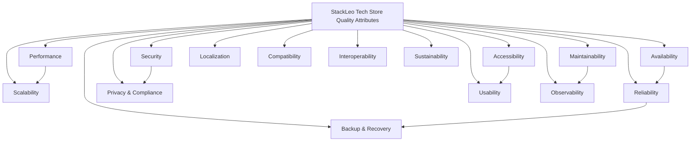
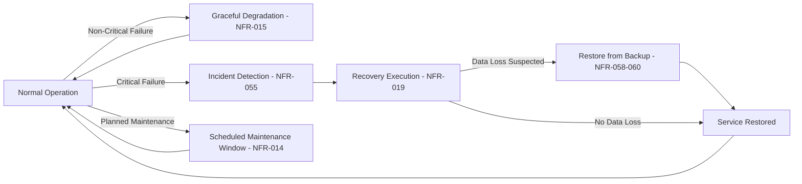
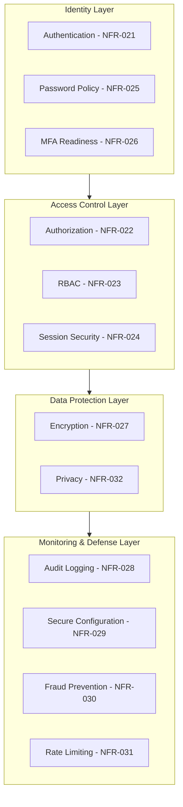
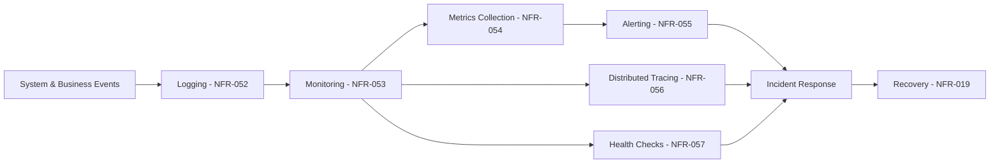

# Non-Functional Requirements Specification

## 1. Document Purpose

This document is the official Non-Functional Requirements Specification (NFRS) for **StackLeo Tech Store**. It defines the quality attributes, operational expectations, system constraints, and enterprise standards the platform must satisfy, using IEEE 29148-inspired requirements writing and aligned with the ISO/IEC 25010 quality model.

This document guides Product, Engineering, DevOps, Security, QA, Infrastructure, Operations, and Architecture teams in building a platform that is not only functionally correct but reliable, secure, performant, and trustworthy at scale. It complements `functional-requirements.md`, which defines *what* the system does; this document defines *how well* the system must do it.

This document defines quality expectations only. It does not describe implementation approach, technology choices, API design, or database structure, all of which are addressed in dedicated technical documentation elsewhere in the repository.

## 2. Scope

This specification applies to all current and planned sales channels — Web, Physical Store, and the future Mobile App and POS — and to all internal and partner-facing capability described in `product-modules.md`. It covers quality attributes required at MVP launch as well as attributes that become critical as the platform scales toward corporate sales, multi-warehouse operations, the multi-vendor marketplace, AI-assisted capability, and international expansion into South Asia and beyond.

Non-functional requirements marked "Future" define the quality bar that future capability must meet once activated; they do not represent current MVP obligations.

## 3. NFR Writing Standards

Each requirement in this document is written to be:

- **Measurable** — expressed with a quantifiable or objectively verifiable target wherever feasible.
- **Testable** — validated through observable system behavior, monitoring, or audit rather than subjective judgment.
- **Traceable** — linked to the business goal and quality attribute it supports, and to related functional requirements.
- **Realistic** — scoped to what is achievable at the platform's current and near-term operational scale.
- **Prioritized** — classified by business criticality, consistent with the MoSCoW approach used across this repository's documentation.

Requirement statements use the normative form "The system shall..." to denote mandatory quality behavior, consistent with IEEE 29148 convention.

## 4. Quality Attribute Categories

| Category | Requirement Count | ISO 25010 Characteristic |
|---|---|---|
| Performance | 6 | Performance Efficiency |
| Scalability | 6 | Performance Efficiency, Compatibility |
| Availability | 4 | Reliability |
| Reliability | 4 | Reliability |
| Security | 11 | Security |
| Privacy & Compliance | 5 | Security, Compliance |
| Accessibility | 5 | Usability |
| Usability | 5 | Usability |
| Maintainability | 5 | Maintainability |
| Observability | 6 | Maintainability, Reliability |
| Backup & Recovery | 3 | Reliability |
| Localization | 4 | Portability, Usability |
| Compatibility | 2 | Compatibility |
| Interoperability | 5 | Compatibility |
| Sustainability | 2 | Performance Efficiency |

**Total Non-Functional Requirements: 73**

---

## 5. Performance

#### NFR-001 — Page Response Time

- **Category:** Performance | **Title:** Standard Page Response Time
- **Description:** The system shall render standard customer-facing pages (catalog, product detail, cart) within a consistently fast response time under normal load.
- **Business Justification:** Slow pages directly increase bounce rate and reduce conversion.
- **Priority:** Must Have
- **Measurement Criteria:** Page response time measured at the 95th percentile under normal traffic conditions.
- **Acceptance Target:** Fast, consistent response across all standard customer-facing pages, monitored continuously.
- **Risks:** Performance degradation during high-traffic promotional events.
- **Dependencies:** NFR-002, NFR-006
- **Related Functional Requirements:** FR-005, FR-006, FR-009
- **Notes:** None.

#### NFR-002 — API Latency

- **Category:** Performance | **Title:** Internal Service Response Latency
- **Description:** The system shall maintain low latency for internal service interactions supporting customer-facing and administrative operations.
- **Business Justification:** Latency compounds across dependent operations (e.g., checkout), directly affecting customer experience.
- **Priority:** Must Have
- **Measurement Criteria:** Service response latency tracked at the 95th and 99th percentile.
- **Acceptance Target:** Consistently low latency for critical-path operations (cart, checkout, payment, order).
- **Risks:** Latency spikes during concurrent high-volume events (e.g., flash sales).
- **Dependencies:** None
- **Related Functional Requirements:** FR-013–FR-020
- **Notes:** None.

#### NFR-003 — Page Load Time

- **Category:** Performance | **Title:** First Meaningful Page Load
- **Description:** The system shall achieve a fast first meaningful page load for customer-facing pages across supported devices and connection speeds representative of the Bangladesh market.
- **Business Justification:** Slow initial load is a primary cause of visitor abandonment, particularly on mobile networks.
- **Priority:** Must Have
- **Measurement Criteria:** First meaningful paint and time-to-interactive measured across representative device and network profiles.
- **Acceptance Target:** Fast, consistent load performance on common mobile and desktop network conditions in Bangladesh.
- **Risks:** Network variability across urban and semi-urban delivery zones.
- **Dependencies:** NFR-001
- **Related Functional Requirements:** FR-005, FR-006
- **Notes:** None.

#### NFR-004 — Search Performance

- **Category:** Performance | **Title:** Search Response Speed
- **Description:** The system shall return search results within a fast, consistent response time regardless of catalog size.
- **Business Justification:** Slow search directly undermines the discovery experience central to the platform's value proposition.
- **Priority:** Must Have
- **Measurement Criteria:** Search response time measured at the 95th percentile across representative query volumes.
- **Acceptance Target:** Fast, consistent search response as catalog size grows toward and beyond MVP scale.
- **Risks:** Degraded performance as catalog breadth expands via future marketplace sellers.
- **Dependencies:** NFR-002
- **Related Functional Requirements:** FR-009, FR-010
- **Notes:** None.

#### NFR-005 — Checkout Performance

- **Category:** Performance | **Title:** Checkout Flow Responsiveness
- **Description:** The system shall process each checkout step (address confirmation, payment selection, final validation) without perceptible delay to the customer.
- **Business Justification:** Checkout is the platform's most conversion-critical flow; delay directly drives abandonment.
- **Priority:** Must Have
- **Measurement Criteria:** End-to-end checkout completion time, excluding external payment gateway processing time.
- **Acceptance Target:** Fast, consistent checkout step transitions under normal and peak load.
- **Risks:** Dependency on third-party payment gateway response time, which is outside direct control.
- **Dependencies:** NFR-002
- **Related Functional Requirements:** FR-015, FR-016, FR-017
- **Notes:** None.

#### NFR-006 — Data Query and Bulk Operation Performance

- **Category:** Performance | **Title:** Data Retrieval and Bulk Processing Efficiency
- **Description:** The system shall efficiently handle both routine data queries and bulk operations (e.g., bulk catalog updates, bulk corporate orders) without degrading concurrent customer-facing performance.
- **Business Justification:** Internal and bulk operations must not compromise the customer experience running concurrently.
- **Priority:** Should Have
- **Measurement Criteria:** Query response time under standard and bulk-load conditions; customer-facing performance impact during bulk operations.
- **Acceptance Target:** Bulk operations complete efficiently with no measurable degradation to concurrent customer-facing performance.
- **Risks:** Large future corporate or marketplace bulk operations straining shared resources.
- **Dependencies:** NFR-001, NFR-002
- **Related Functional Requirements:** FR-034, FR-041 (Future)
- **Notes:** None.

## 6. Scalability

#### NFR-007 — Horizontal Scaling Capability

- **Category:** Scalability | **Title:** Horizontal Capacity Growth
- **Description:** The system shall support horizontal growth in capacity to accommodate increasing customer and order volume without requiring architectural redesign.
- **Business Justification:** Supports sustainable growth from MVP through enterprise scale without disruptive rework.
- **Priority:** Must Have
- **Measurement Criteria:** Capacity growth achieved through additive resourcing rather than redesign.
- **Acceptance Target:** Capacity can be increased to meet growing demand without functional disruption.
- **Risks:** Architectural decisions made under MVP time pressure constraining future scaling.
- **Dependencies:** None
- **Related Functional Requirements:** All
- **Notes:** None.

#### NFR-008 — Vertical Scaling Capability

- **Category:** Scalability | **Title:** Vertical Resource Growth
- **Description:** The system shall accommodate vertical resource increases for components where horizontal scaling is not immediately practical.
- **Business Justification:** Provides a near-term scaling lever while horizontal scaling maturity develops.
- **Priority:** Should Have
- **Measurement Criteria:** Ability to absorb increased load through resource scaling without functional impact.
- **Acceptance Target:** Vertical scaling applied without service disruption where used.
- **Risks:** Over-reliance on vertical scaling delaying necessary horizontal scaling investment.
- **Dependencies:** NFR-007
- **Related Functional Requirements:** —
- **Notes:** None.

#### NFR-009 — Stateless Service Design

- **Category:** Scalability | **Title:** Stateless Service Behavior
- **Description:** Customer-facing and administrative services shall be designed to operate statelessly wherever feasible, supporting reliable horizontal scaling and failover.
- **Business Justification:** Statelessness is foundational to reliable scaling and resilience.
- **Priority:** Must Have
- **Measurement Criteria:** Absence of service-local session state that would prevent request routing to any available instance.
- **Acceptance Target:** Services can be scaled or replaced without loss of in-progress customer state.
- **Risks:** Legacy or ad hoc implementation patterns reintroducing hidden state dependencies.
- **Dependencies:** NFR-007
- **Related Functional Requirements:** FR-002, FR-013–FR-020
- **Notes:** None.

#### NFR-010 — Load Distribution

- **Category:** Scalability | **Title:** Balanced Load Distribution
- **Description:** The system shall distribute incoming traffic evenly across available capacity to avoid uneven load concentration.
- **Business Justification:** Prevents avoidable performance degradation and single-point overload.
- **Priority:** Must Have
- **Measurement Criteria:** Load distribution variance across available capacity under normal and peak conditions.
- **Acceptance Target:** No single capacity unit experiences disproportionate load under normal operating conditions.
- **Risks:** Uneven distribution during flash sales or other concentrated-demand events.
- **Dependencies:** NFR-007, NFR-009
- **Related Functional Requirements:** —
- **Notes:** None.

#### NFR-011 — Marketplace Growth Readiness (Future)

- **Category:** Scalability | **Title:** Multi-Vendor Marketplace Scalability
- **Description:** The system's catalog, order, and settlement capability shall scale to accommodate a growing number of marketplace sellers and their associated transaction volume.
- **Business Justification:** Marketplace growth, per `product-roadmap.md` (Phase 5), must not be constrained by architecture designed only for a single-seller model.
- **Priority:** Should Have
- **Measurement Criteria:** Capacity to onboard growing seller volume without degrading catalog or checkout performance.
- **Acceptance Target:** Marketplace-driven catalog and transaction growth does not degrade core B2C performance.
- **Risks:** Marketplace scale exposing catalog or settlement bottlenecks not present in the single-seller model.
- **Dependencies:** NFR-007
- **Related Functional Requirements:** FR-042, FR-043 (Future)
- **Notes:** Not yet active; targeted for Phase 5 per `product-roadmap.md`.

#### NFR-012 — Multi-Warehouse Expansion Readiness (Future)

- **Category:** Scalability | **Title:** Multi-Warehouse Operational Scalability
- **Description:** Inventory and fulfillment capability shall scale to support coordinated operations across multiple warehouse locations.
- **Business Justification:** Supports the Phase 4 Enterprise expansion defined in `product-roadmap.md` without requiring inventory architecture redesign.
- **Priority:** Should Have
- **Measurement Criteria:** Inventory accuracy and fulfillment performance maintained as warehouse count increases.
- **Acceptance Target:** Additional warehouse locations can be added without degrading stock accuracy or fulfillment speed.
- **Risks:** Cross-warehouse stock synchronization complexity increasing with scale.
- **Dependencies:** NFR-007
- **Related Functional Requirements:** FR-034, FR-035
- **Notes:** Not yet active; targeted for Phase 4 per `product-roadmap.md`.

## 7. Availability

#### NFR-013 — Platform Uptime Target

- **Category:** Availability | **Title:** Customer-Facing Platform Uptime
- **Description:** The system shall maintain a high level of availability for customer-facing functionality, consistent with a trust-focused marketplace.
- **Business Justification:** Downtime directly undermines the trust and reliability positioning central to StackLeo's brand.
- **Priority:** Must Have
- **Measurement Criteria:** Monthly uptime percentage for customer-facing functionality, excluding scheduled maintenance.
- **Acceptance Target:** High, consistently monitored uptime for all customer-facing functionality.
- **Risks:** Unplanned outages during high-visibility promotional events.
- **Dependencies:** NFR-014, NFR-016
- **Related Functional Requirements:** All customer-facing requirements
- **Notes:** Specific numeric uptime targets to be finalized through dedicated operational SLA planning.

#### NFR-014 — Scheduled Maintenance Windows

- **Category:** Availability | **Title:** Planned Maintenance Scheduling
- **Description:** The system shall support scheduled maintenance during low-traffic windows, with advance customer communication for any customer-visible impact.
- **Business Justification:** Balances necessary system maintenance with minimal customer disruption.
- **Priority:** Should Have
- **Measurement Criteria:** Maintenance scheduled during identified low-traffic periods; advance notice provided for customer-visible impact.
- **Acceptance Target:** No unannounced customer-visible downtime for planned maintenance.
- **Risks:** Maintenance windows misaligned with actual low-traffic periods as usage patterns evolve.
- **Dependencies:** NFR-013
- **Related Functional Requirements:** —
- **Notes:** None.

#### NFR-015 — Graceful Degradation

- **Category:** Availability | **Title:** Graceful Degradation Under Partial Failure
- **Description:** The system shall continue offering core purchasing functionality even when a non-critical dependent service (e.g., recommendations, reviews) is degraded or unavailable.
- **Business Justification:** Prevents a single non-critical failure from blocking the platform's core revenue-generating function.
- **Priority:** Must Have
- **Measurement Criteria:** Core purchase flow (browse, cart, checkout, payment, order) remains functional during isolated non-critical service degradation.
- **Acceptance Target:** No single non-critical service failure blocks core purchasing capability.
- **Risks:** Tightly coupled dependencies undermining graceful degradation in practice.
- **Dependencies:** NFR-009
- **Related Functional Requirements:** FR-013–FR-020
- **Notes:** None.

#### NFR-016 — Disaster Recovery Readiness

- **Category:** Availability | **Title:** Disaster Recovery Preparedness
- **Description:** The system shall maintain a documented, tested disaster recovery approach capable of restoring critical functionality following a significant outage or data loss event.
- **Business Justification:** Protects business continuity and customer trust in the event of a significant incident.
- **Priority:** Must Have
- **Measurement Criteria:** Existence of a current, tested disaster recovery plan; periodic recovery drills.
- **Acceptance Target:** Disaster recovery plan validated through periodic testing, with defined recovery targets per Section 15.
- **Risks:** Untested recovery procedures failing under real incident conditions.
- **Dependencies:** NFR-060–NFR-062 (Backup & Recovery)
- **Related Functional Requirements:** All
- **Notes:** None.

## 8. Reliability

#### NFR-017 — Fault Tolerance

- **Category:** Reliability | **Title:** Fault-Tolerant Operation
- **Description:** The system shall continue operating correctly in the presence of isolated component failures, without cascading failure across unrelated functionality.
- **Business Justification:** Isolated failures should not compromise the entire platform's reliability.
- **Priority:** Must Have
- **Measurement Criteria:** Absence of cascading failure incidents traced to a single isolated component failure.
- **Acceptance Target:** No single component failure results in platform-wide impact.
- **Risks:** Hidden dependencies creating unexpected cascading failure paths.
- **Dependencies:** NFR-015
- **Related Functional Requirements:** All
- **Notes:** None.

#### NFR-018 — Retry Strategy for Transient Failures

- **Category:** Reliability | **Title:** Transient Failure Recovery
- **Description:** The system shall retry transient failures in dependent operations (e.g., payment gateway timeout, courier service call) using a bounded, sensible retry approach before surfacing failure to the user.
- **Business Justification:** Reduces unnecessary customer-visible failures caused by momentary, recoverable issues.
- **Priority:** Must Have
- **Measurement Criteria:** Proportion of transient failures resolved automatically without customer-visible impact.
- **Acceptance Target:** Majority of transient failures resolve via retry without requiring customer action.
- **Risks:** Excessive or unbounded retries worsening downstream load during an incident.
- **Dependencies:** NFR-002
- **Related Functional Requirements:** FR-017, FR-024
- **Notes:** None.

#### NFR-019 — Recovery Time Expectations

- **Category:** Reliability | **Title:** Service Recovery Expectations
- **Description:** The system shall recover from a service-level incident within a defined, monitored timeframe appropriate to the severity of the incident.
- **Business Justification:** Minimizes cumulative business impact from incidents.
- **Priority:** Must Have
- **Measurement Criteria:** Mean Time to Recovery (MTTR), tracked per incident severity level.
- **Acceptance Target:** Consistently low MTTR for critical, customer-facing incidents.
- **Risks:** Inadequate incident response tooling or process extending recovery time.
- **Dependencies:** NFR-064–NFR-069 (Observability)
- **Related Functional Requirements:** All
- **Notes:** None.

#### NFR-020 — Data Consistency

- **Category:** Reliability | **Title:** Transactional Data Consistency
- **Description:** The system shall ensure that business-critical data (orders, payments, inventory) remains consistent across dependent operations, even under concurrent access.
- **Business Justification:** Inconsistent data (e.g., overselling, duplicate orders) directly damages customer trust and financial accuracy.
- **Priority:** Must Have
- **Measurement Criteria:** Absence of data inconsistency incidents (e.g., overselling, duplicate charges) in production.
- **Acceptance Target:** No customer-impacting data consistency incidents in normal operation.
- **Risks:** Concurrency issues during high-volume events (e.g., flash sales) increasing inconsistency risk.
- **Dependencies:** NFR-009
- **Related Functional Requirements:** FR-013, FR-016, FR-020, FR-034
- **Notes:** None.

## 9. Security

#### NFR-021 — Authentication Assurance

- **Category:** Security | **Title:** Verified Identity Authentication
- **Description:** The system shall authenticate every customer and internal user against verified credentials before granting access to any account-scoped functionality.
- **Business Justification:** Establishes the foundation for all subsequent authorization and data protection.
- **Priority:** Must Have
- **Measurement Criteria:** No account-scoped access granted without successful authentication.
- **Acceptance Target:** 100% of account-scoped access requests are gated by successful authentication.
- **Risks:** Authentication bypass through misconfiguration.
- **Dependencies:** FR-002
- **Related Functional Requirements:** FR-002
- **Notes:** Governed by BR-004, BR-110.

#### NFR-022 — Authorization Enforcement

- **Category:** Security | **Title:** Consistent Authorization Enforcement
- **Description:** The system shall verify that every business-critical action is authorized for the requesting identity's role before execution, regardless of the initiating channel.
- **Business Justification:** Prevents unauthorized access to sensitive operations across all current and future channels.
- **Priority:** Must Have
- **Measurement Criteria:** Absence of authorization bypass incidents across channels.
- **Acceptance Target:** No unauthorized action succeeds against any protected capability.
- **Risks:** Inconsistent enforcement across web, future mobile app, and future POS channels.
- **Dependencies:** NFR-021
- **Related Functional Requirements:** FR-046
- **Notes:** Governed by BR-111, UR-003.

#### NFR-023 — Role-Based Access Control (RBAC) Integrity

- **Category:** Security | **Title:** RBAC Model Enforcement
- **Description:** The system shall enforce the role and permission model defined in `user-roles.md` consistently across all internal and partner-facing functionality.
- **Business Justification:** Enforces least privilege and separation of duties across a growing internal organization.
- **Priority:** Must Have
- **Measurement Criteria:** Role assignments and permissions verified periodically against `user-roles.md`.
- **Acceptance Target:** No internal or partner role exceeds its documented permission scope.
- **Risks:** Privilege creep as roles evolve without corresponding documentation updates.
- **Dependencies:** NFR-022
- **Related Functional Requirements:** FR-046
- **Notes:** Governed by UR-001–UR-010.

#### NFR-024 — Session Security

- **Category:** Security | **Title:** Secure Session Management
- **Description:** The system shall enforce session expiration after a defined period of inactivity and protect session tokens from unauthorized reuse.
- **Business Justification:** Reduces risk from unattended or hijacked sessions.
- **Priority:** Must Have
- **Measurement Criteria:** Sessions expire consistently after the defined inactivity threshold; no session reuse incidents.
- **Acceptance Target:** Consistent session expiration enforcement across all account types.
- **Risks:** Session handling inconsistency across future mobile app and POS channels.
- **Dependencies:** NFR-021
- **Related Functional Requirements:** FR-002
- **Notes:** Governed by BR-114, UR-011.

#### NFR-025 — Password Policy Strength

- **Category:** Security | **Title:** Minimum Password Strength Enforcement
- **Description:** The system shall enforce a minimum password strength standard for all customer and internal accounts.
- **Business Justification:** Reduces risk of account compromise through weak credentials.
- **Priority:** Must Have
- **Measurement Criteria:** Password strength validated against the defined minimum standard at creation and change.
- **Acceptance Target:** No account credential accepted below the minimum strength standard.
- **Risks:** Overly complex requirements driving poor customer password habits (e.g., reuse elsewhere).
- **Dependencies:** NFR-021
- **Related Functional Requirements:** FR-001, FR-002
- **Notes:** Governed by BR-110.

#### NFR-026 — Multi-Factor Authentication Readiness

- **Category:** Security | **Title:** MFA Extensibility
- **Description:** The authentication model shall be structured to support the future introduction of multi-factor authentication for sensitive accounts (e.g., Admin, Super Admin) without requiring a redesign.
- **Business Justification:** Prepares the platform to raise its security posture as administrative and corporate account sensitivity grows.
- **Priority:** Should Have
- **Measurement Criteria:** Authentication architecture accommodates an additional verification factor without structural rework.
- **Acceptance Target:** MFA can be introduced for designated account types without disrupting existing authentication flows.
- **Risks:** Retrofitting MFA becoming costly if not considered early.
- **Dependencies:** NFR-021
- **Related Functional Requirements:** FR-002
- **Notes:** Not yet active; recommended ahead of Phase 4 enterprise scale.

#### NFR-027 — Data Encryption

- **Category:** Security | **Title:** Sensitive Data Encryption
- **Description:** The system shall protect sensitive customer and business data, including payment-related and personal information, using appropriate encryption both in transit and at rest.
- **Business Justification:** Protects customer trust and satisfies baseline data protection expectations.
- **Priority:** Must Have
- **Measurement Criteria:** Sensitive data flows and storage locations verified as encrypted through periodic security review.
- **Acceptance Target:** No sensitive data transmitted or stored without appropriate encryption.
- **Risks:** New data flows introduced without security review inheriting encryption.
- **Dependencies:** None
- **Related Functional Requirements:** FR-003, FR-017
- **Notes:** Governed by BR-128, `01_Business/constraints.md` (Section 11).

#### NFR-028 — Audit Logging Completeness

- **Category:** Security | **Title:** Comprehensive Security Audit Logging
- **Description:** The system shall log all authentication events, permission changes, and administrative actions affecting sensitive data domains, per `user-roles.md` (Section 12).
- **Business Justification:** Supports accountability, incident investigation, and compliance.
- **Priority:** Must Have
- **Measurement Criteria:** Audit log completeness verified against the list of governed events in `user-roles.md`.
- **Acceptance Target:** 100% of governed events are logged with actor identity and timestamp.
- **Risks:** New sensitive actions introduced without corresponding audit logging.
- **Dependencies:** NFR-022
- **Related Functional Requirements:** FR-047
- **Notes:** Governed by BR-104, UR-025–UR-033.

#### NFR-029 — Secure Configuration Management

- **Category:** Security | **Title:** Secure Platform Configuration
- **Description:** The system shall maintain secure default configuration across all environments, with configuration changes subject to authorization and audit.
- **Business Justification:** Misconfiguration is a common source of security incidents; secure defaults reduce this risk.
- **Priority:** Must Have
- **Measurement Criteria:** Configuration changes reviewed periodically against secure baseline expectations.
- **Acceptance Target:** No unauthorized or unreviewed configuration change affecting security posture.
- **Risks:** Configuration drift over time without periodic review.
- **Dependencies:** NFR-028
- **Related Functional Requirements:** FR-046
- **Notes:** None.

#### NFR-030 — Fraud Prevention Capability

- **Category:** Security | **Title:** Order and Account Fraud Detection
- **Description:** The system shall flag orders, returns, and warranty claims exhibiting patterns associated with fraud for manual review before resolution.
- **Business Justification:** Reduces financial loss from fraudulent transactions and claims.
- **Priority:** Must Have
- **Measurement Criteria:** Fraud detection rate and false-positive rate tracked over time.
- **Acceptance Target:** Consistent, improving fraud detection accuracy without excessive false positives affecting genuine customers.
- **Risks:** Overly aggressive fraud rules creating friction for genuine customers.
- **Dependencies:** NFR-028
- **Related Functional Requirements:** FR-026, FR-029
- **Notes:** Governed by BR-113; future AI-assisted enhancement per FR-044/FR-045.

#### NFR-031 — Rate Limiting

- **Category:** Security | **Title:** Abuse-Prevention Rate Limiting
- **Description:** The system shall rate-limit sensitive actions, including login attempts, coupon redemption attempts, and API-level requests, per account and per source.
- **Business Justification:** Reduces risk of automated abuse, credential attacks, and denial-of-service-style exhaustion.
- **Priority:** Must Have
- **Measurement Criteria:** Rate limit thresholds applied consistently across sensitive action types.
- **Acceptance Target:** No sensitive action type remains unprotected by rate limiting.
- **Risks:** Overly aggressive limits affecting legitimate high-frequency use (e.g., corporate accounts).
- **Dependencies:** NFR-021
- **Related Functional Requirements:** FR-002, FR-038
- **Notes:** Governed by BR-112.

## 10. Privacy & Compliance

#### NFR-032 — Customer Data Privacy Protection

- **Category:** Privacy & Compliance | **Title:** Personal Data Privacy Protection
- **Description:** The system shall collect, store, and use customer personal data only for purposes necessary to fulfill orders, support accounts, and comply with applicable regulation.
- **Business Justification:** Protects customer trust and satisfies baseline privacy expectations in Bangladesh.
- **Priority:** Must Have
- **Measurement Criteria:** Data collection and usage reviewed periodically against stated business necessity.
- **Acceptance Target:** No customer data collected or used beyond documented business necessity.
- **Risks:** Feature development introducing new data collection without privacy review.
- **Dependencies:** NFR-027
- **Related Functional Requirements:** FR-003
- **Notes:** Governed by BR-128.

#### NFR-033 — Data Retention Discipline

- **Category:** Privacy & Compliance | **Title:** Defined Data Retention Periods
- **Description:** The system shall retain customer and business data only for the period necessary for business, legal, or compliance purposes, consistent with `00_Project_Overview/constraints.md`.
- **Business Justification:** Reduces privacy risk exposure and aligns with responsible data stewardship.
- **Priority:** Should Have
- **Measurement Criteria:** Data retention periods defined and reviewed per data category.
- **Acceptance Target:** No data retained indefinitely without documented justification.
- **Risks:** Absence of a formal retention schedule leading to unnecessary data accumulation.
- **Dependencies:** NFR-032
- **Related Functional Requirements:** FR-073 (order history retention, per BR-073)
- **Notes:** None.

#### NFR-034 — Consent Management

- **Category:** Privacy & Compliance | **Title:** Customer Consent Handling
- **Description:** The system shall obtain and respect customer consent for optional communication (e.g., marketing notifications) and any future data use beyond core transactional necessity.
- **Business Justification:** Respects customer autonomy and reduces regulatory and reputational risk.
- **Priority:** Should Have
- **Measurement Criteria:** Consent status honored consistently across all communication channels.
- **Acceptance Target:** No marketing communication sent without active customer consent.
- **Risks:** Consent state inconsistency across future multi-channel (mobile app, SMS, email) delivery.
- **Dependencies:** NFR-032
- **Related Functional Requirements:** FR-032
- **Notes:** Governed by BR-122.

#### NFR-035 — Bangladesh Regulatory Compliance

- **Category:** Privacy & Compliance | **Title:** Bangladesh E-Commerce and Consumer Protection Compliance
- **Description:** The system shall operate in accordance with applicable Bangladesh e-commerce, consumer protection, tax, and data handling regulations.
- **Business Justification:** Legal compliance is a precondition for sustainable business operation in the primary market.
- **Priority:** Must Have
- **Measurement Criteria:** Periodic compliance review against applicable Bangladesh regulation.
- **Acceptance Target:** No material compliance findings in periodic review.
- **Risks:** Regulatory changes outpacing platform adaptation.
- **Dependencies:** None
- **Related Functional Requirements:** FR-023 (invoice compliance)
- **Notes:** Governed by BR-124–BR-127.

#### NFR-036 — Future International Compliance Readiness (Future)

- **Category:** Privacy & Compliance | **Title:** Multi-Market Compliance Extensibility
- **Description:** The system's compliance and data handling model shall be structured to accommodate additional market-specific regulatory requirements as StackLeo expands into South Asia and beyond.
- **Business Justification:** Prevents costly rework when entering new regulatory environments, per `product-roadmap.md` (Phase 7).
- **Priority:** Could Have
- **Measurement Criteria:** Compliance model can be extended per-market without redesigning the core data handling approach.
- **Acceptance Target:** New market compliance requirements can be layered onto the existing model.
- **Risks:** Underestimating the complexity of new-market compliance requirements.
- **Dependencies:** NFR-035
- **Related Functional Requirements:** —
- **Notes:** Not yet active; targeted for Phase 7 per `product-roadmap.md`.

## 11. Accessibility

Accessibility requirements follow WCAG 2.2 Level AA principles.

#### NFR-037 — Keyboard Navigation Support

- **Category:** Accessibility | **Title:** Full Keyboard Operability
- **Description:** The system shall allow all customer-facing functionality to be operated using keyboard navigation alone, without requiring a pointing device.
- **Business Justification:** Ensures the platform is usable by customers relying on assistive input methods.
- **Priority:** Should Have
- **Measurement Criteria:** Keyboard-only navigation testing across all core customer journeys.
- **Acceptance Target:** All core customer journeys (browse, cart, checkout) completable via keyboard alone.
- **Risks:** New UI components introduced without keyboard operability validation.
- **Dependencies:** None
- **Related Functional Requirements:** All customer-facing requirements
- **Notes:** Aligned with WCAG 2.2 AA (2.1.1 Keyboard).

#### NFR-038 — Screen Reader Support

- **Category:** Accessibility | **Title:** Assistive Technology Compatibility
- **Description:** The system shall present customer-facing content in a manner compatible with common screen reader technology.
- **Business Justification:** Ensures customers with visual impairments can independently use the platform.
- **Priority:** Should Have
- **Measurement Criteria:** Screen reader compatibility testing across core customer journeys.
- **Acceptance Target:** Core customer journeys are fully navigable and understandable via screen reader.
- **Risks:** Dynamic content updates not properly announced to assistive technology.
- **Dependencies:** NFR-041
- **Related Functional Requirements:** All customer-facing requirements
- **Notes:** Aligned with WCAG 2.2 AA (4.1.2 Name, Role, Value).

#### NFR-039 — Color Contrast Compliance

- **Category:** Accessibility | **Title:** Sufficient Color Contrast
- **Description:** The system shall present text and meaningful interface elements with sufficient color contrast against their background.
- **Business Justification:** Ensures readability for customers with low vision or color vision differences.
- **Priority:** Should Have
- **Measurement Criteria:** Color contrast ratios validated against WCAG 2.2 AA thresholds.
- **Acceptance Target:** All meaningful text and interface elements meet WCAG 2.2 AA contrast thresholds.
- **Risks:** Brand color choices conflicting with contrast requirements.
- **Dependencies:** None
- **Related Functional Requirements:** All customer-facing requirements
- **Notes:** Aligned with WCAG 2.2 AA (1.4.3 Contrast Minimum).

#### NFR-040 — Visible Focus Indicators

- **Category:** Accessibility | **Title:** Clear Keyboard Focus Indication
- **Description:** The system shall provide a clearly visible focus indicator for the interactive element currently in keyboard focus.
- **Business Justification:** Supports keyboard-only users in tracking their position within the interface.
- **Priority:** Should Have
- **Measurement Criteria:** Focus indicator visibility validated across all interactive elements.
- **Acceptance Target:** Every interactive element displays a clear, visible focus state.
- **Risks:** Custom-styled components suppressing default focus indication without a suitable replacement.
- **Dependencies:** NFR-037
- **Related Functional Requirements:** All customer-facing requirements
- **Notes:** Aligned with WCAG 2.2 AA (2.4.11 Focus Not Obscured).

#### NFR-041 — Semantic Content Structure

- **Category:** Accessibility | **Title:** Semantic, Structured Content
- **Description:** The system shall present customer-facing content using a semantically structured hierarchy (headings, landmarks, labels) that supports assistive technology interpretation.
- **Business Justification:** Underpins effective screen reader support and overall accessibility compliance.
- **Priority:** Should Have
- **Measurement Criteria:** Semantic structure validated through accessibility audit tooling and manual review.
- **Acceptance Target:** All customer-facing pages use a valid, meaningful semantic structure.
- **Risks:** Visual-only design changes bypassing underlying semantic structure.
- **Dependencies:** None
- **Related Functional Requirements:** All customer-facing requirements
- **Notes:** Aligned with WCAG 2.2 AA (1.3.1 Info and Relationships).

## 12. Usability

#### NFR-042 — Ease of Use

- **Category:** Usability | **Title:** Intuitive Core Journey Usability
- **Description:** The system shall allow customers to complete core journeys (search, cart, checkout) without requiring external guidance or instruction.
- **Business Justification:** Reduces support burden and conversion friction, particularly for less technical personas (e.g., Home User, Teacher).
- **Priority:** Must Have
- **Measurement Criteria:** Task completion rate and time-on-task for core journeys during usability testing.
- **Acceptance Target:** High task completion rate without external assistance across representative personas.
- **Risks:** Feature complexity accumulating over time without usability review.
- **Dependencies:** None
- **Related Functional Requirements:** FR-013–FR-020
- **Notes:** None.

#### NFR-043 — Error Prevention

- **Category:** Usability | **Title:** Input Error Prevention
- **Description:** The system shall validate customer input at the point of entry and provide clear guidance to prevent avoidable errors before submission.
- **Business Justification:** Reduces checkout and account management friction caused by preventable input errors.
- **Priority:** Should Have
- **Measurement Criteria:** Rate of submission errors caught before final submission versus after.
- **Acceptance Target:** Majority of input errors are caught and corrected before final submission.
- **Risks:** Overly aggressive validation creating false-positive error states.
- **Dependencies:** None
- **Related Functional Requirements:** FR-003, FR-015
- **Notes:** None.

#### NFR-044 — Clear System Feedback

- **Category:** Usability | **Title:** Clear, Timely User Feedback
- **Description:** The system shall provide clear, immediate feedback for every significant customer action (e.g., add to cart, order placed, payment failed).
- **Business Justification:** Reduces uncertainty and repeated actions caused by unclear system state.
- **Priority:** Must Have
- **Measurement Criteria:** Presence of clear feedback for all significant customer-facing actions, validated through usability review.
- **Acceptance Target:** Every significant customer action produces clear, immediate feedback.
- **Risks:** Asynchronous operations (e.g., payment processing) creating ambiguous intermediate states.
- **Dependencies:** None
- **Related Functional Requirements:** FR-013, FR-017, FR-020
- **Notes:** None.

#### NFR-045 — Mobile Usability

- **Category:** Usability | **Title:** Mobile-Optimized Experience
- **Description:** The system shall provide a fully usable, responsive experience on mobile web browsers, reflecting the predominance of mobile access in the Bangladesh market.
- **Business Justification:** A majority of the target market accesses e-commerce primarily via mobile devices.
- **Priority:** Must Have
- **Measurement Criteria:** Usability testing and responsive layout validation across representative mobile devices.
- **Acceptance Target:** All core journeys are fully usable on representative mobile devices without layout or interaction defects.
- **Risks:** Feature parity gaps between desktop and mobile experiences.
- **Dependencies:** NFR-042
- **Related Functional Requirements:** All customer-facing requirements
- **Notes:** Extends to the future native Mobile App per NFR-071.

#### NFR-046 — Learnability

- **Category:** Usability | **Title:** First-Time User Learnability
- **Description:** The system shall present a customer experience that is quickly learnable by first-time visitors without prior e-commerce experience.
- **Business Justification:** Supports adoption among less digitally experienced personas (e.g., Teacher, Home User).
- **Priority:** Should Have
- **Measurement Criteria:** First-time task success rate during usability testing with representative, less experienced users.
- **Acceptance Target:** High first-time task success rate without prior platform exposure.
- **Risks:** Feature richness increasing perceived complexity over time.
- **Dependencies:** NFR-042
- **Related Functional Requirements:** All customer-facing requirements
- **Notes:** None.

## 13. Maintainability

#### NFR-047 — Modular Design Boundaries

- **Category:** Maintainability | **Title:** Modular Capability Boundaries
- **Description:** The system shall be organized according to the module boundaries defined in `product-modules.md`, supporting independent evolution of each business capability.
- **Business Justification:** Reduces the cost and risk of extending or modifying individual capabilities over time.
- **Priority:** Must Have
- **Measurement Criteria:** Alignment between implemented system structure and documented module boundaries, reviewed periodically.
- **Acceptance Target:** No significant, undocumented deviation between system structure and `product-modules.md`.
- **Risks:** Organic growth blurring module boundaries over time without governance.
- **Dependencies:** None
- **Related Functional Requirements:** All
- **Notes:** None.

#### NFR-048 — Documentation Currency

- **Category:** Maintainability | **Title:** Current, Accurate Documentation
- **Description:** The system's supporting documentation (business, product, and future technical documentation) shall remain current and accurate relative to actual system behavior.
- **Business Justification:** Outdated documentation undermines every downstream team's ability to plan and execute reliably.
- **Priority:** Must Have
- **Measurement Criteria:** Documentation review cadence aligned with `product-roadmap.md` phase completions.
- **Acceptance Target:** No material discrepancy between documentation and system behavior persists beyond one review cycle.
- **Risks:** Documentation debt accumulating faster than review capacity.
- **Dependencies:** None
- **Related Functional Requirements:** All
- **Notes:** Governed by the change management processes defined across this repository's documents.

#### NFR-049 — Coding Standards Consistency

- **Category:** Maintainability | **Title:** Consistent Engineering Standards
- **Description:** Engineering work shall follow consistent, documented standards to support long-term readability and maintainability.
- **Business Justification:** Reduces onboarding time and defect rates as the engineering team grows.
- **Priority:** Should Have
- **Measurement Criteria:** Adherence to documented engineering standards, reviewed through standard code review practice.
- **Acceptance Target:** Consistent standards applied across the codebase, verified through review.
- **Risks:** Standards drifting as team size and contributor diversity grow.
- **Dependencies:** None
- **Related Functional Requirements:** —
- **Notes:** Specific engineering standards are defined in dedicated technical documentation, outside this document's scope.

#### NFR-050 — Technical Debt Management

- **Category:** Maintainability | **Title:** Managed Technical Debt
- **Description:** The system shall maintain a visible, actively managed record of known technical debt, with remediation prioritized alongside new feature work.
- **Business Justification:** Prevents unmanaged technical debt from silently eroding delivery velocity and reliability over time.
- **Priority:** Should Have
- **Measurement Criteria:** Existence and regular review of a technical debt backlog.
- **Acceptance Target:** Technical debt items are visible, tracked, and periodically addressed rather than indefinitely deferred.
- **Risks:** Technical debt deprioritized indefinitely under feature delivery pressure.
- **Dependencies:** NFR-048
- **Related Functional Requirements:** —
- **Notes:** None.

#### NFR-051 — Controlled Change Management

- **Category:** Maintainability | **Title:** Governed Change Process
- **Description:** Material changes to business rules, requirements, or platform configuration shall follow the documented change management and versioning process defined across this repository.
- **Business Justification:** Prevents uncoordinated changes from introducing inconsistency or unreviewed risk.
- **Priority:** Must Have
- **Measurement Criteria:** Material changes are traceable to a recorded changelog entry and appropriate approval.
- **Acceptance Target:** No material undocumented change to governed business rules or requirements.
- **Risks:** Urgency-driven changes bypassing the documented process.
- **Dependencies:** NFR-048
- **Related Functional Requirements:** —
- **Notes:** Governed by `00_Project_Overview/changelog.md` and `01_Business/business-rules.md` (Section 20).

## 14. Observability

#### NFR-052 — Comprehensive Logging

- **Category:** Observability | **Title:** System-Wide Event Logging
- **Description:** The system shall log significant business and operational events across all modules to support troubleshooting, audit, and analysis.
- **Business Justification:** Enables timely diagnosis of issues and supports the audit requirements defined in `user-roles.md` (Section 12).
- **Priority:** Must Have
- **Measurement Criteria:** Logging coverage validated against the list of significant events defined across module and security documentation.
- **Acceptance Target:** All significant business and operational events are logged consistently.
- **Risks:** Logging gaps in newly introduced functionality.
- **Dependencies:** NFR-028
- **Related Functional Requirements:** FR-047
- **Notes:** None.

#### NFR-053 — Continuous Monitoring

- **Category:** Observability | **Title:** Continuous System Monitoring
- **Description:** The system shall be continuously monitored for availability, performance, and error conditions across customer-facing and internal capability.
- **Business Justification:** Enables proactive issue detection ahead of significant customer impact.
- **Priority:** Must Have
- **Measurement Criteria:** Monitoring coverage across all customer-facing and business-critical internal capability.
- **Acceptance Target:** No business-critical capability operates without active monitoring.
- **Risks:** Monitoring coverage lagging behind new feature introduction.
- **Dependencies:** NFR-052
- **Related Functional Requirements:** All
- **Notes:** None.

#### NFR-054 — Business and Technical Metrics

- **Category:** Observability | **Title:** Actionable Metrics Collection
- **Description:** The system shall collect metrics supporting both technical health assessment (latency, error rate, availability) and business health assessment (conversion, order success, KPIs defined across product documentation).
- **Business Justification:** Enables data-informed operational and business decision-making.
- **Priority:** Must Have
- **Measurement Criteria:** Metrics availability validated against the KPIs defined in `product-overview.md`, `product-roadmap.md`, and related documents.
- **Acceptance Target:** All documented KPIs have a corresponding, reliable metric source.
- **Risks:** Metric definitions diverging from documented KPI definitions over time.
- **Dependencies:** NFR-053
- **Related Functional Requirements:** FR-036, FR-037
- **Notes:** None.

#### NFR-055 — Proactive Alerting

- **Category:** Observability | **Title:** Proactive Incident Alerting
- **Description:** The system shall generate timely alerts when monitored metrics breach defined thresholds indicating a potential incident.
- **Business Justification:** Reduces detection time and supports the recovery time expectations defined in NFR-019.
- **Priority:** Must Have
- **Measurement Criteria:** Alert generation validated against defined threshold breaches; alert-to-acknowledgment time tracked.
- **Acceptance Target:** All critical threshold breaches generate a timely, actionable alert.
- **Risks:** Alert fatigue from poorly tuned thresholds reducing responsiveness.
- **Dependencies:** NFR-053
- **Related Functional Requirements:** —
- **Notes:** None.

#### NFR-056 — Distributed Tracing Readiness

- **Category:** Observability | **Title:** Cross-Module Tracing Capability
- **Description:** The system shall support tracing a customer or business transaction across the modules it touches, supporting efficient root-cause analysis.
- **Business Justification:** Reduces diagnosis time for issues spanning multiple modules (e.g., checkout through order through shipping).
- **Priority:** Should Have
- **Measurement Criteria:** Ability to trace a representative transaction across its full module path.
- **Acceptance Target:** Cross-module transactions can be traced end-to-end for diagnostic purposes.
- **Risks:** Tracing gaps at module boundaries as new modules are introduced.
- **Dependencies:** NFR-052
- **Related Functional Requirements:** —
- **Notes:** None.

#### NFR-057 — Health Check Availability

- **Category:** Observability | **Title:** Service Health Checks
- **Description:** Each business-critical module shall expose a means of confirming its operational health for monitoring and recovery automation purposes.
- **Business Justification:** Supports rapid detection of degraded components ahead of customer-visible impact.
- **Priority:** Must Have
- **Measurement Criteria:** Health check coverage validated across all business-critical modules defined in `product-modules.md`.
- **Acceptance Target:** Every business-critical module has an associated health check.
- **Risks:** Health checks providing a false sense of health without validating true functional readiness.
- **Dependencies:** NFR-053
- **Related Functional Requirements:** —
- **Notes:** None.

## 15. Backup & Recovery

#### NFR-058 — Backup Strategy

- **Category:** Backup & Recovery | **Title:** Regular Data Backup
- **Description:** The system shall perform regular, verified backups of business-critical data, including orders, payments, inventory, and customer accounts.
- **Business Justification:** Protects the business against data loss from technical failure, human error, or incident.
- **Priority:** Must Have
- **Measurement Criteria:** Backup completion and verification tracked on a defined schedule.
- **Acceptance Target:** Backups complete successfully and are verified on a consistent, defined schedule.
- **Risks:** Backup failures going undetected without active verification.
- **Dependencies:** None
- **Related Functional Requirements:** All
- **Notes:** None.

#### NFR-059 — Recovery Point and Time Objectives

- **Category:** Backup & Recovery | **Title:** Defined Recovery Objectives
- **Description:** The system shall define and maintain a Recovery Point Objective (RPO) and Recovery Time Objective (RTO) for business-critical data and functionality.
- **Business Justification:** Establishes a clear, agreed tolerance for data loss and downtime in a disaster scenario.
- **Priority:** Must Have
- **Measurement Criteria:** Documented RPO/RTO targets validated through periodic disaster recovery testing.
- **Acceptance Target:** Recovery testing consistently meets or exceeds defined RPO/RTO targets.
- **Risks:** RPO/RTO targets defined but never validated through real testing.
- **Dependencies:** NFR-058
- **Related Functional Requirements:** All
- **Notes:** Specific numeric RPO/RTO targets to be finalized through dedicated operational planning.

#### NFR-060 — Data Restoration Verification

- **Category:** Backup & Recovery | **Title:** Verified Data Restoration
- **Description:** The system shall support the restoration of business-critical data from backup, with restoration procedures periodically tested for correctness.
- **Business Justification:** Ensures that backups are not merely created but genuinely usable in a real recovery scenario.
- **Priority:** Must Have
- **Measurement Criteria:** Periodic restoration drills validated against expected data completeness and accuracy.
- **Acceptance Target:** Restoration drills consistently succeed without data integrity issues.
- **Risks:** Restoration procedures untested until an actual incident occurs.
- **Dependencies:** NFR-058, NFR-059
- **Related Functional Requirements:** All
- **Notes:** None.

## 16. Localization

#### NFR-061 — Current Currency and Language Support

- **Category:** Localization | **Title:** BDT and English Localization
- **Description:** The system shall present all pricing in Bangladeshi Taka (BDT) and all customer-facing content in English as the current baseline localization.
- **Business Justification:** Reflects the platform's current primary market and customer base.
- **Priority:** Must Have
- **Measurement Criteria:** Consistent BDT pricing and English content across all customer-facing surfaces.
- **Acceptance Target:** No customer-facing pricing or content inconsistency across the current localization baseline.
- **Risks:** Inconsistent currency formatting across different display contexts.
- **Dependencies:** None
- **Related Functional Requirements:** FR-006, FR-015
- **Notes:** None.

#### NFR-062 — Time Zone and Date Format Consistency

- **Category:** Localization | **Title:** Bangladesh Time Zone and Date Formatting
- **Description:** The system shall present all dates, times, and delivery estimates using Bangladesh Standard Time and a locally understood date format.
- **Business Justification:** Prevents customer confusion around order timing and delivery expectations.
- **Priority:** Must Have
- **Measurement Criteria:** Consistent time zone and date format applied across order, delivery, and notification content.
- **Acceptance Target:** No date/time inconsistency across customer-facing surfaces.
- **Risks:** Time zone handling errors as the platform expands to future markets with different time zones.
- **Dependencies:** NFR-061
- **Related Functional Requirements:** FR-021, FR-025
- **Notes:** None.

#### NFR-063 — Regional Address Format Support

- **Category:** Localization | **Title:** Bangladesh Address Format Support
- **Description:** The system shall support address entry and validation consistent with common address formats and delivery zone structures used in Bangladesh.
- **Business Justification:** Reduces delivery errors caused by address format mismatches.
- **Priority:** Must Have
- **Measurement Criteria:** Address entry validated against representative Bangladesh address formats across delivery zones.
- **Acceptance Target:** Address entry correctly supports representative formats across Zone A–D, per `01_Business/shipping-policy.md`.
- **Risks:** Address format assumptions breaking down in future international markets.
- **Dependencies:** None
- **Related Functional Requirements:** FR-003, FR-015
- **Notes:** None.

#### NFR-064 — Future Bangla Language Support (Future)

- **Category:** Localization | **Title:** Bangla Language Interface
- **Description:** The system shall be structured to support a future Bangla-language customer interface without requiring a redesign of the underlying content structure.
- **Business Justification:** Improves accessibility and comfort for a significant portion of the Bangladesh customer base.
- **Priority:** Could Have
- **Measurement Criteria:** Content structure supports future translation without structural rework.
- **Acceptance Target:** Bangla language support can be introduced as an additive capability.
- **Risks:** Content architecture decisions made without translation in mind, increasing future rework cost.
- **Dependencies:** NFR-061
- **Related Functional Requirements:** All customer-facing requirements
- **Notes:** Not yet active; recommended consideration ahead of Phase 3.

## 17. Compatibility

#### NFR-065 — Cross-Device Web Compatibility

- **Category:** Compatibility | **Title:** Browser and Device Compatibility
- **Description:** The system shall function correctly across current major web browsers and common mobile, tablet, and desktop device form factors used in Bangladesh.
- **Business Justification:** Ensures the platform is accessible regardless of the customer's device or browser choice.
- **Priority:** Must Have
- **Measurement Criteria:** Functional and visual validation across representative browsers and device form factors.
- **Acceptance Target:** No material functional defect across representative supported browsers and devices.
- **Risks:** Fragmentation across older or less common device/browser combinations still in use in the market.
- **Dependencies:** NFR-045
- **Related Functional Requirements:** All customer-facing requirements
- **Notes:** None.

#### NFR-066 — Future Native App Compatibility (Future)

- **Category:** Compatibility | **Title:** Native Mobile App Compatibility
- **Description:** The system's core capability shall be structured to support consumption by a future native Mobile App without requiring redesign of underlying business logic.
- **Business Justification:** Prepares the platform for the Mobile App channel defined in `product-roadmap.md`.
- **Priority:** Should Have
- **Measurement Criteria:** Core business capability remains channel-agnostic and reusable by a future native app.
- **Acceptance Target:** Mobile App introduction does not require re-implementation of core business rules.
- **Risks:** Web-specific assumptions embedded in business logic, complicating future native app delivery.
- **Dependencies:** NFR-047
- **Related Functional Requirements:** All
- **Notes:** Not yet active; targeted for Phase 7 per `product-roadmap.md`.

## 18. Interoperability

#### NFR-067 — Payment Provider Interoperability

- **Category:** Interoperability | **Title:** Payment Gateway Interoperability
- **Description:** The system shall interoperate reliably with its approved payment gateway partner(s), with the ability to add or replace providers without disrupting the checkout experience.
- **Business Justification:** Reduces dependency risk on a single payment provider and supports future payment method expansion.
- **Priority:** Must Have
- **Measurement Criteria:** Successful integration validated against defined payment provider interoperability expectations.
- **Acceptance Target:** Payment provider changes can be made without customer-visible disruption to checkout.
- **Risks:** Deep, provider-specific assumptions increasing switching cost.
- **Dependencies:** NFR-005
- **Related Functional Requirements:** FR-017
- **Notes:** None.

#### NFR-068 — Courier Service Interoperability

- **Category:** Interoperability | **Title:** Multi-Courier Interoperability
- **Description:** The system shall interoperate with multiple courier partners (SteadFast, Pathao Courier, RedX, Paperfly), supporting reliable assignment and tracking across all of them.
- **Business Justification:** Preserves delivery coverage and reliability across StackLeo's multi-courier strategy, per `01_Business/shipping-policy.md`.
- **Priority:** Must Have
- **Measurement Criteria:** Successful order assignment and tracking validated across all active courier partners.
- **Acceptance Target:** No courier partner integration failure disrupts overall delivery capability.
- **Risks:** Individual courier partner service changes affecting integration reliability.
- **Dependencies:** NFR-067
- **Related Functional Requirements:** FR-024, FR-025
- **Notes:** None.

#### NFR-069 — ERP Interoperability (Future)

- **Category:** Interoperability | **Title:** Future ERP System Interoperability
- **Description:** The system shall be structured to interoperate with a future Enterprise Resource Planning (ERP) system for financial and operational data exchange.
- **Business Justification:** Supports the enterprise-scale financial and operational needs anticipated in `product-roadmap.md` (Phase 4).
- **Priority:** Could Have
- **Measurement Criteria:** Business-critical financial and operational data is structured for future ERP consumption without redesign.
- **Acceptance Target:** ERP integration can be introduced as an additive capability.
- **Risks:** Data structure assumptions incompatible with a future ERP's expectations.
- **Dependencies:** None
- **Related Functional Requirements:** FR-036
- **Notes:** Not yet active; targeted for Phase 4 per `product-roadmap.md`.

#### NFR-070 — CRM Interoperability (Future)

- **Category:** Interoperability | **Title:** Future CRM System Interoperability
- **Description:** The system shall be structured to interoperate with a future Customer Relationship Management (CRM) system for deeper customer engagement capability.
- **Business Justification:** Supports future customer relationship management needs as the customer base grows.
- **Priority:** Could Have
- **Measurement Criteria:** Customer data is structured for future CRM consumption without redesign.
- **Acceptance Target:** CRM integration can be introduced as an additive capability.
- **Risks:** Customer data model assumptions incompatible with a future CRM's expectations.
- **Dependencies:** None
- **Related Functional Requirements:** FR-033
- **Notes:** Not yet active; future capability per `product-modules.md` (Section 11).

#### NFR-071 — Marketplace Integration Interoperability (Future)

- **Category:** Interoperability | **Title:** Marketplace Seller System Interoperability
- **Description:** The system shall be structured to support future integration with third-party marketplace seller systems for listing, order, and settlement data exchange.
- **Business Justification:** Supports the multi-vendor marketplace expansion defined in `product-roadmap.md` (Phase 5).
- **Priority:** Could Have
- **Measurement Criteria:** Marketplace-relevant data (listings, orders, settlement) is structured for future seller-system interoperability without redesign.
- **Acceptance Target:** Marketplace seller integration can be introduced as an additive capability.
- **Risks:** Seller system diversity increasing integration complexity beyond initial assumptions.
- **Dependencies:** NFR-011
- **Related Functional Requirements:** FR-042, FR-043
- **Notes:** Not yet active; targeted for Phase 5 per `product-roadmap.md`.

## 19. Sustainability

#### NFR-072 — Efficient Resource Usage

- **Category:** Sustainability | **Title:** Efficient Computing Resource Usage
- **Description:** The system shall be operated in a manner that avoids unnecessary computing resource consumption relative to actual business demand.
- **Business Justification:** Reduces operating cost and environmental impact as the platform scales.
- **Priority:** Could Have
- **Measurement Criteria:** Resource utilization efficiency tracked relative to traffic and transaction volume over time.
- **Acceptance Target:** Resource usage scales proportionately with actual demand rather than growing unnecessarily.
- **Risks:** Scaling decisions prioritizing convenience over efficiency under time pressure.
- **Dependencies:** NFR-007
- **Related Functional Requirements:** —
- **Notes:** None.

#### NFR-073 — Green Computing Considerations

- **Category:** Sustainability | **Title:** Environmentally Conscious Operations
- **Description:** The system's operational choices shall consider environmental impact as a factor alongside cost and performance, where reasonably practicable.
- **Business Justification:** Reflects responsible business practice consistent with StackLeo's long-term brand values.
- **Priority:** Could Have
- **Measurement Criteria:** Environmental impact considerations documented as part of significant infrastructure decisions.
- **Acceptance Target:** Environmental impact is a documented factor in significant infrastructure decisions.
- **Risks:** Environmental considerations deprioritized under competing cost or performance pressure.
- **Dependencies:** NFR-072
- **Related Functional Requirements:** —
- **Notes:** None.

---

## 20. Traceability

### 20.1 Business Goals → Quality Attributes → NFRs → Acceptance Criteria

| Business Goal (`01_Business/objectives.md`) | Quality Attribute | Representative NFRs | Acceptance Criteria Reference |
|---|---|---|---|
| Build customer trust through reliability | Availability, Reliability | NFR-013, NFR-015, NFR-017, NFR-020 | Section 7, Section 8 |
| Protect customer data and transactions | Security, Privacy & Compliance | NFR-021–NFR-036 | Section 9, Section 10 |
| Deliver a fast, accessible customer experience | Performance, Accessibility, Usability | NFR-001–NFR-006, NFR-037–NFR-046 | Section 5, Section 11, Section 12 |
| Support sustainable business growth | Scalability | NFR-007–NFR-012 | Section 6 |
| Maintain long-term platform health | Maintainability, Observability | NFR-047–NFR-057 | Section 13, Section 14 |
| Protect business continuity | Backup & Recovery | NFR-058–NFR-060 | Section 15 |
| Serve the Bangladesh market effectively | Localization, Compatibility | NFR-061–NFR-066 | Section 16, Section 17 |
| Enable reliable partner ecosystem operations | Interoperability | NFR-067–NFR-071 | Section 18 |
| Operate responsibly at scale | Sustainability | NFR-072, NFR-073 | Section 19 |

## 21. Required Summary Tables

### 21.1 NFR Inventory

The complete inventory of 73 non-functional requirements is presented across Sections 5–19, organized by the 15 quality attribute categories summarized in Section 4.

### 21.2 Quality Attributes

See Section 4 for the complete quality attribute category breakdown, aligned to ISO/IEC 25010 characteristics.

### 21.3 Performance Targets

| Requirement | Target Area | Acceptance Approach |
|---|---|---|
| NFR-001 | Page response time | 95th percentile monitoring under normal load |
| NFR-002 | API/service latency | 95th/99th percentile monitoring on critical paths |
| NFR-003 | Page load time | First meaningful paint across representative devices/networks |
| NFR-004 | Search performance | 95th percentile response time across query volumes |
| NFR-005 | Checkout performance | End-to-end step transition time, excluding gateway processing |
| NFR-006 | Bulk/data operations | Bulk completion time with zero customer-facing degradation |

### 21.4 Security Requirements

| Requirement | Focus Area |
|---|---|
| NFR-021 | Authentication assurance |
| NFR-022 | Authorization enforcement |
| NFR-023 | RBAC integrity |
| NFR-024 | Session security |
| NFR-025 | Password policy |
| NFR-026 | MFA readiness |
| NFR-027 | Data encryption |
| NFR-028 | Audit logging |
| NFR-029 | Secure configuration |
| NFR-030 | Fraud prevention |
| NFR-031 | Rate limiting |

### 21.5 Availability Targets

| Requirement | Focus Area | Acceptance Approach |
|---|---|---|
| NFR-013 | Platform uptime | Monthly uptime percentage, customer-facing scope |
| NFR-014 | Maintenance windows | Scheduled during low-traffic periods with advance notice |
| NFR-015 | Graceful degradation | Core purchase flow unaffected by non-critical failures |
| NFR-016 | Disaster recovery | Tested recovery plan with defined RPO/RTO |

### 21.6 Compliance Mapping

| Regulatory/Policy Area | Related NFRs | Related Business Documentation |
|---|---|---|
| Bangladesh Consumer Protection | NFR-035 | `01_Business/business-rules.md` (BR-127) |
| Bangladesh VAT/Tax | NFR-035 | `01_Business/business-rules.md` (BR-124, BR-125) |
| Data Privacy | NFR-032, NFR-033, NFR-034 | `01_Business/business-rules.md` (BR-128), `constraints.md` |
| Future International Compliance | NFR-036 | `product-roadmap.md` (Phase 7) |

## 22. Quality Attribute Map

*Diagram: Quality Attribute Map.*

## 23. Availability Model

*Diagram: Availability Model.*

## 24. Security Layers

*Diagram: Security Layers.*

## 25. Observability Architecture

*Diagram: Observability Architecture.*

## 26. Governance

| Governance Aspect | Description |
|---|---|
| Ownership | The Solution Architect, in partnership with the Product Manager, owns this specification's accuracy and alignment with `functional-requirements.md`. |
| Review Process | NFRs are reviewed at the conclusion of each phase defined in `product-roadmap.md`, and whenever a new module or feature introduces a materially different quality expectation. |
| Monitoring | Observability capability defined in Section 14 is used to continuously validate adherence to the acceptance targets defined throughout this document. |
| Versioning | This document follows the Semantic Versioning approach defined in `00_Project_Overview/changelog.md`. |
| Continuous Improvement | Acceptance targets should be tightened over time as the platform matures and real operational data becomes available, with changes recorded in `changelog.md`. |

## 27. Document Information

| Property | Value |
|----------|-------|
| Document | non-functional-requirements.md |
| Version | 1.0.0 |
| Status | Active |
| Maintained By | StackLeo |
| Last Updated | 2026-07-17 |

---

© StackLeo. All Rights Reserved.
