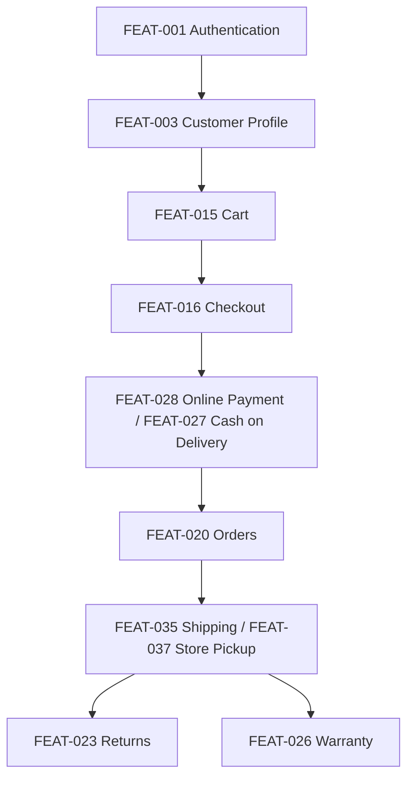

# Product Feature Catalog

## 1. Document Purpose

This document is the official Feature Catalog of **StackLeo Tech Store**. It defines every major product feature at a high level, without implementation detail, and serves as the master index for all feature-specific Product Requirements Documents (PRDs) to come.

This catalog helps Product Managers, Designers, Engineers, QA, DevOps, Operations, and Stakeholders understand the complete product capability landscape in one place. It is derived from `product-overview.md` and `product-roadmap.md`, and each feature traces back to the business context defined in `01_Business`.

This document describes features at a functional and strategic level. It does not describe implementation approach, technology choices, API design, or database structure, all of which are addressed in dedicated technical documentation elsewhere in the repository.

## 2. How to Use This Catalog

- Every feature has a unique identifier in the format `FEAT-XXX`, used consistently across product, design, engineering, and QA documentation.
- Features are grouped into 10 domains, listed in Section 3.
- Each domain section contains two tables: a **Feature Summary** table (identity, description, business value, users, priority) and a **Feature Traceability** table (dependencies, related modules, related business rules, related PRD, future enhancements, and KPIs).
- **Related PRD Document** currently points to `product-requirements.md`, the master PRD; dedicated feature-level PRDs will be linked here individually as they are authored, without requiring a restructure of this catalog.
- Priority follows MoSCoW classification, defined in Section 6.

## 3. Feature Domain Index

| Domain | Feature Count | Description |
|---|---|---|
| Customer Experience | 7 | Account, profile, and personal shopping tools. |
| Product Discovery | 7 | Catalog browsing, search, and discovery. |
| Shopping Experience | 5 | Cart, checkout, and purchase incentives. |
| Order Management | 7 | Order lifecycle, fulfillment, and post-purchase resolution. |
| Payment | 5 | Payment methods, verification, and refund processing. |
| Inventory & Fulfillment | 6 | Stock, warehousing, and delivery operations. |
| Customer Engagement | 7 | Reviews, communication, and retention programs. |
| Admin Platform | 10 | Internal tools for managing the business and platform. |
| Business | 4 | Corporate, vendor, marketplace, and ERP capability. |
| AI & Automation (Future) | 6 | Intelligent search, personalization, and automation. |

**Total Features Catalogued: 64**

---

## 4. Customer Experience

**Feature Summary**

| ID | Feature | Description | Business Value | Priority |
|---|---|---|---|---|
| FEAT-001 | Authentication | Customer registration, login, and account security. | Establishes trusted, secure access to the platform. | Must Have |
| FEAT-002 | User Management | Management of customer account status and settings. | Enables consistent account governance and support. | Must Have |
| FEAT-003 | Customer Profile | Customer-editable personal and contact information. | Supports accurate order and communication handling. | Must Have |
| FEAT-004 | Address Book | Storage and management of multiple delivery addresses. | Improves checkout speed and delivery accuracy. | Should Have |
| FEAT-005 | Wishlist | Saving products of interest for later purchase. | Increases return visits and future conversion. | Could Have |
| FEAT-006 | Compare Products | Side-by-side comparison of product specifications. | Supports informed purchase decisions. | Could Have |
| FEAT-007 | Recently Viewed | Display of recently browsed products. | Reduces friction in resuming product research. | Could Have |

**Feature Traceability**

| ID | Dependencies | Related Modules | Related Business Rules | Related PRD | Future Enhancements | KPIs |
|---|---|---|---|---|---|---|
| FEAT-001 | None | Customer | BR-001–BR-012 | `product-requirements.md` | Social/federated sign-in | Registration completion rate |
| FEAT-002 | FEAT-001 | Customer, Admin | BR-006, BR-007 | `product-requirements.md` | Self-service account recovery | Account suspension rate |
| FEAT-003 | FEAT-001 | Customer | BR-010, BR-011 | `product-requirements.md` | Profile completeness scoring | Profile completion rate |
| FEAT-004 | FEAT-003 | Customer, Checkout | BR-008, BR-009 | `product-requirements.md` | Address auto-suggestion | Checkout address error rate |
| FEAT-005 | FEAT-001, Product Catalog | Customer, Products | — | `product-requirements.md` | Wishlist-to-cart automation | Wishlist conversion rate |
| FEAT-006 | Product Catalog | Customer, Products | BR-020 | `product-requirements.md` | AI-assisted comparison highlights | Compare-to-purchase rate |
| FEAT-007 | Product Catalog | Customer, Products | — | `product-requirements.md` | Cross-device browsing history | Return visit rate |

---

## 5. Product Discovery

**Feature Summary**

| ID | Feature | Description | Business Value | Priority |
|---|---|---|---|---|
| FEAT-008 | Product Catalog | Centralized listing of all sellable products. | Core foundation for all sales activity. | Must Have |
| FEAT-009 | Categories | Hierarchical grouping of products for navigation. | Improves product discoverability. | Must Have |
| FEAT-010 | Brands | Brand association and brand-based browsing. | Supports authenticity assurance and brand loyalty. | Must Have |
| FEAT-011 | Search | Keyword-based product discovery. | Reduces time to find desired products. | Must Have |
| FEAT-012 | Filters | Refinement of results by attribute, price, and brand. | Improves discovery precision for large catalogs. | Should Have |
| FEAT-013 | Sorting | Ordering of results by relevance, price, or popularity. | Improves usability of search and category results. | Should Have |
| FEAT-014 | Recommendations (Future) | Personalized product suggestions. | Increases conversion and average order value. | Could Have |

**Feature Traceability**

| ID | Dependencies | Related Modules | Related Business Rules | Related PRD | Future Enhancements | KPIs |
|---|---|---|---|---|---|---|
| FEAT-008 | None | Products | BR-013, BR-014 | `product-requirements.md` | Rich media catalog content | Catalog completeness |
| FEAT-009 | FEAT-008 | Products | BR-016, BR-017 | `product-requirements.md` | Dynamic category merchandising | Category browse depth |
| FEAT-010 | FEAT-008 | Products | BR-015 | `product-requirements.md` | Brand storefront pages | Brand page engagement |
| FEAT-011 | FEAT-008 | Products | — | `product-requirements.md` | AI Search (FEAT-059) | Search-to-purchase rate |
| FEAT-012 | FEAT-008, FEAT-011 | Products | BR-020 | `product-requirements.md` | Saved filter preferences | Filter usage rate |
| FEAT-013 | FEAT-008, FEAT-011 | Products | — | `product-requirements.md` | Personalized default sort | Sort interaction rate |
| FEAT-014 | FEAT-008, Order History | Products, Analytics | — | `product-requirements.md` | AI Recommendations (FEAT-060) | Recommendation click-through rate |

---

## 6. Shopping Experience

**Feature Summary**

| ID | Feature | Description | Business Value | Priority |
|---|---|---|---|---|
| FEAT-015 | Cart | Temporary collection of products intended for purchase. | Core mechanism enabling multi-item purchase. | Must Have |
| FEAT-016 | Checkout | Billing, shipping, and payment confirmation flow. | Directly enables order completion and revenue. | Must Have |
| FEAT-017 | Coupons | Discount codes applied at cart or checkout. | Drives promotional conversion and campaign performance. | Should Have |
| FEAT-018 | Promotions | Time-bound campaigns, flash sales, and bundles. | Increases order volume during targeted periods. | Should Have |
| FEAT-019 | Gift Cards (Future) | Purchasable stored-value gift cards. | Introduces a new revenue and gifting use case. | Won't Have (Current Release) |

**Feature Traceability**

| ID | Dependencies | Related Modules | Related Business Rules | Related PRD | Future Enhancements | KPIs |
|---|---|---|---|---|---|---|
| FEAT-015 | FEAT-008, Inventory | Cart, Inventory | BR-040–BR-047 | `product-requirements.md` | Persistent cross-device cart | Cart abandonment rate |
| FEAT-016 | FEAT-015, Payment, Shipping | Checkout, Orders | BR-048–BR-054 | `product-requirements.md` | One-click checkout | Checkout completion rate |
| FEAT-017 | FEAT-015 | Cart, Promotions | BR-093, BR-094, BR-042 | `product-requirements.md` | Personalized coupon targeting | Coupon redemption rate |
| FEAT-018 | FEAT-008, Inventory | Promotions, Products | BR-095–BR-100 | `product-requirements.md` | AI-optimized promotion timing | Promotion-driven revenue share |
| FEAT-019 | FEAT-016 | Payments (Future) | — | `product-requirements.md` | Digital and physical gift card options | Gift card redemption rate |

---

## 7. Order Management

**Feature Summary**

| ID | Feature | Description | Business Value | Priority |
|---|---|---|---|---|
| FEAT-020 | Orders | Order placement, status, and history. | Core transactional record of the business. | Must Have |
| FEAT-021 | Order Tracking | Real-time visibility into delivery progress. | Reduces support inquiries and builds trust. | Must Have |
| FEAT-022 | Invoices | Compliant invoice generation per order. | Ensures legal compliance and customer transparency. | Must Have |
| FEAT-023 | Returns | Structured return and replacement request handling. | Protects customer trust after purchase. | Must Have |
| FEAT-024 | Refunds | Processing of approved refunds to customers. | Ensures fair, timely financial resolution. | Must Have |
| FEAT-025 | Exchanges | Product exchange for change-of-mind returns. | Provides flexible post-purchase resolution. | Should Have |
| FEAT-026 | Warranty | Warranty claim submission and resolution tracking. | Reinforces trust in product authenticity and support. | Must Have |

**Feature Traceability**

| ID | Dependencies | Related Modules | Related Business Rules | Related PRD | Future Enhancements | KPIs |
|---|---|---|---|---|---|---|
| FEAT-020 | FEAT-016 | Orders | BR-064–BR-073 | `product-requirements.md` | Order modification self-service | Order Success Rate |
| FEAT-021 | FEAT-020, Shipping | Orders, Shipping | BR-076 | `product-requirements.md` | Predictive delivery ETA | On-Time Delivery Rate |
| FEAT-022 | FEAT-020 | Orders, Compliance | BR-072, BR-126 | `product-requirements.md` | Digital invoice archive | Invoice compliance rate |
| FEAT-023 | FEAT-020 | Returns, Inventory | BR-RET-001–BR-RET-041 | `product-requirements.md` | Self-service return scheduling | Return Rate |
| FEAT-024 | FEAT-023, Payment | Payments, Finance | BR-060–BR-062 | `product-requirements.md` | Instant refund options | Refund Processing Time |
| FEAT-025 | FEAT-023 | Returns, Products | BR-RET-021–BR-RET-023 | `product-requirements.md` | Exchange recommendation assistance | Exchange completion rate |
| FEAT-026 | FEAT-020 | Warranty, Support | WR-001–WR-053 | `product-requirements.md` | QR code warranty verification | Claim Approval Rate |

---

## 8. Payment

**Feature Summary**

| ID | Feature | Description | Business Value | Priority |
|---|---|---|---|---|
| FEAT-027 | Cash on Delivery | Payment collected at the point of delivery. | Supports customers hesitant to pay digitally upfront. | Must Have |
| FEAT-028 | Online Payment | Card, mobile banking, and digital payment support. | Expands payment convenience and reduces COD risk. | Must Have |
| FEAT-029 | Payment Gateway Integration | Secure processing through an approved gateway partner. | Protects customer financial data and enables digital payment. | Must Have |
| FEAT-030 | Payment Verification | Confirmation of payment success prior to fulfillment. | Prevents fulfillment of unpaid or failed orders. | Must Have |
| FEAT-031 | Refund Processing | Execution of refunds to the original or alternate method. | Ensures fair, compliant financial resolution. | Must Have |

**Feature Traceability**

| ID | Dependencies | Related Modules | Related Business Rules | Related PRD | Future Enhancements | KPIs |
|---|---|---|---|---|---|---|
| FEAT-027 | FEAT-016 | Payments, Shipping | BR-055, BR-056 | `product-requirements.md` | COD eligibility auto-check | COD order share |
| FEAT-028 | FEAT-016, FEAT-029 | Payments | BR-057, BR-058 | `product-requirements.md` | EMI options | Online payment success rate |
| FEAT-029 | None | Payments, Security | BR-058 | `product-requirements.md` | Multi-gateway redundancy | Payment gateway uptime |
| FEAT-030 | FEAT-028, FEAT-029 | Payments, Orders | BR-059 | `product-requirements.md` | Real-time fraud scoring | Failed payment rate |
| FEAT-031 | FEAT-024 | Payments, Finance | BR-060–BR-062 | `product-requirements.md` | Wallet-based refunds | Refund accuracy rate |

---

## 9. Inventory & Fulfillment

**Feature Summary**

| ID | Feature | Description | Business Value | Priority |
|---|---|---|---|---|
| FEAT-032 | Inventory | Real-time stock tracking across sellable products. | Prevents overselling and supports accurate availability. | Must Have |
| FEAT-033 | Multi-Warehouse | Inventory management across multiple locations. | Enables geographic scaling of fulfillment. | Won't Have (Current Release) |
| FEAT-034 | Stock Reservation | Temporary stock hold during active checkout. | Prevents overselling during concurrent purchases. | Must Have |
| FEAT-035 | Shipping | Courier-based order delivery. | Core fulfillment mechanism for online orders. | Must Have |
| FEAT-036 | Delivery Tracking | Shipment status visibility for customers and operations. | Builds customer trust and reduces support load. | Must Have |
| FEAT-037 | Store Pickup | In-person order collection at a retail location. | Supports customers preferring in-person collection. | Must Have |

**Feature Traceability**

| ID | Dependencies | Related Modules | Related Business Rules | Related PRD | Future Enhancements | KPIs |
|---|---|---|---|---|---|---|
| FEAT-032 | FEAT-008 | Inventory | BR-030, BR-031 | `product-requirements.md` | Predictive stock alerts | Stock accuracy rate |
| FEAT-033 | FEAT-032 | Inventory, Warehouse | BR-032, BR-038, BR-039 | `product-requirements.md` | Automated inter-warehouse transfer | Multi-warehouse stock accuracy |
| FEAT-034 | FEAT-015, FEAT-032 | Cart, Inventory | BR-033, BR-034, BR-047 | `product-requirements.md` | Extended high-demand reservation logic | Checkout stock conflict rate |
| FEAT-035 | FEAT-020 | Shipping | BR-074–BR-081 | `product-requirements.md` | Own delivery fleet | On-Time Delivery Rate |
| FEAT-036 | FEAT-035 | Shipping, Orders | BR-076 | `product-requirements.md` | Live map tracking | Tracking engagement rate |
| FEAT-037 | FEAT-032, FEAT-020 | Shipping, Inventory | BR-079 | `product-requirements.md` | Multi-store pickup selection | Store pickup adoption rate |

---

## 10. Customer Engagement

**Feature Summary**

| ID | Feature | Description | Business Value | Priority |
|---|---|---|---|---|
| FEAT-038 | Reviews | Verified-purchase customer product reviews. | Builds trust and informs future buyers. | Should Have |
| FEAT-039 | Ratings | Numeric product rating alongside reviews. | Provides a quick trust signal for products. | Should Have |
| FEAT-040 | Notifications | Order and account status updates. | Keeps customers informed and reduces support load. | Must Have |
| FEAT-041 | Email Communication | Transactional and marketing email delivery. | Supports order communication and customer engagement. | Must Have |
| FEAT-042 | SMS | Text-based delivery and account notifications. | Reaches customers reliably without app or email access. | Should Have |
| FEAT-043 | Loyalty Program (Future) | Points-based rewards for repeat purchases. | Increases customer retention and lifetime value. | Won't Have (Current Release) |
| FEAT-044 | Referral Program (Future) | Rewards for customer-driven referrals. | Supports low-cost customer acquisition. | Won't Have (Current Release) |

**Feature Traceability**

| ID | Dependencies | Related Modules | Related Business Rules | Related PRD | Future Enhancements | KPIs |
|---|---|---|---|---|---|---|
| FEAT-038 | FEAT-020 | Reviews | BR-088–BR-092 | `product-requirements.md` | Review helpfulness voting | Review submission rate |
| FEAT-039 | FEAT-038 | Reviews | BR-089 | `product-requirements.md` | Category-specific rating criteria | Average product rating |
| FEAT-040 | FEAT-020 | Notifications | BR-120–BR-123 | `product-requirements.md` | Push notifications (Mobile App) | Notification delivery rate |
| FEAT-041 | FEAT-040 | Notifications | BR-120 | `product-requirements.md` | Behavior-triggered email flows | Email open rate |
| FEAT-042 | FEAT-040 | Notifications | BR-121 | `product-requirements.md` | Two-way SMS support | SMS delivery rate |
| FEAT-043 | FEAT-020 | Customer, Promotions | BR-100 | `product-requirements.md` | Tiered loyalty benefits | Loyalty enrollment rate |
| FEAT-044 | FEAT-001 | Customer, Promotions | BR-099 | `product-requirements.md` | Multi-tier referral rewards | Referral conversion rate |

---

## 11. Admin Platform

**Feature Summary**

| ID | Feature | Description | Business Value | Priority |
|---|---|---|---|---|
| FEAT-045 | Dashboard | Centralized administrative overview. | Provides operational visibility to internal teams. | Must Have |
| FEAT-046 | Product Management | Catalog creation, editing, and publishing tools. | Enables ongoing catalog growth and accuracy. | Must Have |
| FEAT-047 | Inventory Management | Stock level and adjustment administration. | Supports accurate, auditable inventory control. | Must Have |
| FEAT-048 | Order Management (Admin) | Internal order processing and exception handling. | Enables reliable order fulfillment operations. | Must Have |
| FEAT-049 | Customer Management | Internal view and management of customer accounts. | Supports customer service and account issue resolution. | Must Have |
| FEAT-050 | Promotion Management | Creation and approval of discounts and campaigns. | Enables controlled, strategic promotional activity. | Should Have |
| FEAT-051 | Reports | Standard operational and sales reporting. | Supports data-informed business decisions. | Must Have |
| FEAT-052 | Analytics | Deeper behavioral and performance analysis. | Supports strategic planning and optimization. | Should Have |
| FEAT-053 | Role Management | Definition and assignment of admin roles and permissions. | Protects against unauthorized or unscoped access. | Must Have |
| FEAT-054 | Audit Logs | Recorded history of administrative actions. | Supports accountability and compliance audit needs. | Must Have |

**Feature Traceability**

| ID | Dependencies | Related Modules | Related Business Rules | Related PRD | Future Enhancements | KPIs |
|---|---|---|---|---|---|---|
| FEAT-045 | FEAT-053 | Admin | BR-101–BR-105 | `product-requirements.md` | Customizable dashboard widgets | Admin active usage rate |
| FEAT-046 | FEAT-008, FEAT-053 | Products, Admin | BR-013–BR-029 | `product-requirements.md` | Bulk catalog import tools | Catalog update turnaround |
| FEAT-047 | FEAT-032, FEAT-053 | Inventory, Admin | BR-038, BR-039 | `product-requirements.md` | Automated reorder suggestions | Inventory adjustment accuracy |
| FEAT-048 | FEAT-020, FEAT-053 | Orders, Admin | BR-064–BR-073 | `product-requirements.md` | Bulk order action tools | Order exception resolution time |
| FEAT-049 | FEAT-001, FEAT-053 | Customer, Admin | BR-006, BR-007 | `product-requirements.md` | Unified customer support timeline | Support resolution time |
| FEAT-050 | FEAT-018, FEAT-053 | Promotions, Admin | BR-095, BR-103 | `product-requirements.md` | Automated promotion approval workflows | Campaign approval turnaround |
| FEAT-051 | FEAT-020, FEAT-032 | Reporting | BR-115–BR-119 | `product-requirements.md` | Scheduled report delivery | Report usage rate |
| FEAT-052 | FEAT-051 | Reporting, Analytics | BR-117 | `product-requirements.md` | Predictive analytics (AI) | Analytics adoption rate |
| FEAT-053 | FEAT-001 | Admin, Security | BR-101, BR-102 | `product-requirements.md` | Granular permission templates | Unauthorized access attempts |
| FEAT-054 | FEAT-053 | Admin, Security | BR-104 | `product-requirements.md` | Real-time audit alerting | Audit log completeness |

---

## 12. Business

**Feature Summary**

| ID | Feature | Description | Business Value | Priority |
|---|---|---|---|---|
| FEAT-055 | Corporate Sales | Dedicated purchasing for organizational and bulk buyers. | Opens a new, underserved revenue segment. | Won't Have (Current Release) |
| FEAT-056 | Vendor Management (Future) | Management of marketplace seller accounts. | Enables catalog expansion via third-party sellers. | Won't Have (Current Release) |
| FEAT-057 | Marketplace (Future) | Multi-vendor product listing and sales platform. | Expands catalog breadth and revenue diversification. | Won't Have (Current Release) |
| FEAT-058 | ERP Integration (Future) | Integration with enterprise resource planning systems. | Supports operational scale and financial accuracy. | Won't Have (Current Release) |

**Feature Traceability**

| ID | Dependencies | Related Modules | Related Business Rules | Related PRD | Future Enhancements | KPIs |
|---|---|---|---|---|---|---|
| FEAT-055 | FEAT-020, FEAT-053 | Corporate Portal | Section 22–23 of `01_Business/business-rules.md`, `01_Business/warranty-policy.md` | `product-requirements.md` | Self-service corporate account portal | Corporate revenue contribution |
| FEAT-056 | FEAT-053 | Marketplace | BR-106–BR-109 | `product-requirements.md` | Automated seller performance scoring | Verified seller count |
| FEAT-057 | FEAT-056, FEAT-046 | Marketplace | BR-129–BR-133 | `product-requirements.md` | Seller analytics dashboard | Marketplace GMV share |
| FEAT-058 | FEAT-047, FEAT-051 | Finance, Operations | BR-119 | `product-requirements.md` | Real-time financial system sync | Financial reconciliation accuracy |

---

## 13. AI & Automation (Future)

**Feature Summary**

| ID | Feature | Description | Business Value | Priority |
|---|---|---|---|---|
| FEAT-059 | AI Search | Intelligent, relevance-ranked product search. | Improves discovery accuracy and conversion. | Won't Have (Current Release) |
| FEAT-060 | AI Recommendations | Personalized product suggestions based on behavior. | Increases conversion and average order value. | Won't Have (Current Release) |
| FEAT-061 | AI Chatbot | Automated customer support with human escalation. | Reduces support load while preserving resolution quality. | Won't Have (Current Release) |
| FEAT-062 | Dynamic Pricing | Bounded, rule-governed price adjustment. | Improves margin and competitive responsiveness. | Won't Have (Current Release) |
| FEAT-063 | Demand Forecasting | Predictive modeling of customer demand. | Improves planning accuracy and stock efficiency. | Won't Have (Current Release) |
| FEAT-064 | Fraud Detection | AI-assisted detection of fraudulent activity. | Reduces financial loss from fraud. | Won't Have (Current Release) |

**Feature Traceability**

| ID | Dependencies | Related Modules | Related Business Rules | Related PRD | Future Enhancements | KPIs |
|---|---|---|---|---|---|---|
| FEAT-059 | FEAT-011 | Products, AI | BR-136 | `product-requirements.md` | Voice-based search | Search relevance score |
| FEAT-060 | FEAT-014, FEAT-020 | Products, AI, Analytics | BR-134 | `product-requirements.md` | Cross-channel personalization | Recommendation-driven revenue |
| FEAT-061 | FEAT-040, Support | Support, AI | BR-137 | `product-requirements.md` | Multilingual chatbot support | Chatbot resolution rate |
| FEAT-062 | FEAT-032, Pricing | Products, AI | Section 9 of `01_Business/pricing-strategy.md` | `product-requirements.md` | Competitor-aware pricing signals | Margin stability |
| FEAT-063 | FEAT-032, FEAT-051 | Inventory, AI | BR-135 | `product-requirements.md` | Multi-warehouse-aware forecasting | Forecast accuracy |
| FEAT-064 | FEAT-030, FEAT-023, FEAT-026 | Security, Orders, Returns, Warranty | BR-113 | `product-requirements.md` | Cross-claim pattern detection | Fraud Detection Rate |

---

## 14. Feature Relationships

The following diagram illustrates the primary dependency chain for the core B2C purchase journey, from account creation through post-purchase resolution:

*Diagram: Feature Dependency Diagram — core customer journey chain.*

## 15. Feature Lifecycle

| Stage | Description |
|---|---|
| Idea | A candidate feature is proposed, typically in response to a business need, customer feedback, or roadmap priority. |
| Analysis | The feature is evaluated for business value, feasibility, and alignment with `product-overview.md` and `01_Business` documentation. |
| Design | UX and functional design is developed based on user roles, personas, and journeys. |
| Development | The feature is built according to approved functional and non-functional requirements. |
| Testing | The feature is validated against its acceptance criteria before release. |
| Release | The feature is made available to users, following the release strategy in `product-roadmap.md`. |
| Monitoring | Feature usage and performance are tracked against its defined KPIs. |
| Improvement | Insights from monitoring inform refinement, which may return the feature to Analysis. |

## 16. Customer Feature Journey

```mermaid
flowchart LR
    subgraph Discover
        A1[FEAT-011 Search]
        A2[FEAT-009 Categories]
        A3[FEAT-014 Recommendations]
    end
    subgraph Evaluate
        B1[FEAT-006 Compare Products]
        B2[FEAT-038 Reviews]
        B3[FEAT-005 Wishlist]
    end
    subgraph Purchase
        C1[FEAT-015 Cart]
        C2[FEAT-016 Checkout]
        C3[FEAT-027 / FEAT-028 Payment]
    end
    subgraph Fulfillment
        D1[FEAT-021 Order Tracking]
        D2[FEAT-035 Shipping]
        D3[FEAT-037 Store Pickup]
    end
    subgraph Post-Purchase
        E1[FEAT-023 Returns]
        E2[FEAT-026 Warranty]
        E3[FEAT-040 Notifications]
    end
    Discover --> Evaluate --> Purchase --> Fulfillment --> Post-Purchase
```

*Diagram: Customer Feature Journey — grouping features by the stage of the customer experience they primarily support.*

## 17. Prioritization Summary

Prioritization follows MoSCoW classification, consistent with `product-roadmap.md` (Section 15).

| Priority | Definition | Approximate Feature Count |
|---|---|---|
| Must Have | Required for a viable, trustworthy MVP release. | 27 |
| Should Have | Important, but not release-blocking for MVP. | 12 |
| Could Have | Desirable enhancements if capacity allows. | 6 |
| Won't Have (Current Release) | Explicitly deferred to a future roadmap phase. | 19 |

## 18. Required Tables

### 18.1 Feature Inventory

A consolidated inventory of all catalogued features is provided across the domain tables in Sections 4–13. Each feature is uniquely identified by its `FEAT-XXX` ID and belongs to exactly one of the 10 domains listed in Section 3.

### 18.2 Feature Priorities

See Section 17 for the consolidated MoSCoW priority summary; per-feature priority is listed in each domain's Feature Summary table.

### 18.3 Feature Dependencies

Per-feature dependencies are listed in each domain's Feature Traceability table. The core cross-domain dependency chain is illustrated in Section 14.

### 18.4 Feature Ownership

| Domain | Primary Owner |
|---|---|
| Customer Experience | Product Manager, UX Design |
| Product Discovery | Product Manager, Merchandising |
| Shopping Experience | Product Manager, Marketing |
| Order Management | Product Manager, Operations |
| Payment | Product Manager, Finance |
| Inventory & Fulfillment | Operations, Warehouse Team |
| Customer Engagement | Marketing, Customer Support |
| Admin Platform | Product Manager, Operations |
| Business | Founder / Business Owner, Product Manager |
| AI & Automation (Future) | Product Manager, Data/Analytics (Future) |

### 18.5 KPIs

Per-feature KPIs are listed in each domain's Feature Traceability table. Domain-level KPI themes align with the product-wide success metrics defined in `product-overview.md` (Section 17) and `product-roadmap.md` (Section 18).

### 18.6 Future Features

| ID | Feature | Target Phase (per `product-roadmap.md`) |
|---|---|---|
| FEAT-014 | Recommendations | Phase 6 — AI & Automation |
| FEAT-019 | Gift Cards | Post Phase 3, pending business prioritization |
| FEAT-033 | Multi-Warehouse | Phase 4 — Enterprise |
| FEAT-043 | Loyalty Program | Phase 3 — Business Growth |
| FEAT-044 | Referral Program | Phase 3 — Business Growth |
| FEAT-055 | Corporate Sales | Phase 4 — Enterprise |
| FEAT-056 | Vendor Management | Phase 5 — Marketplace |
| FEAT-057 | Marketplace | Phase 5 — Marketplace |
| FEAT-058 | ERP Integration | Phase 4 — Enterprise |
| FEAT-059–FEAT-064 | AI & Automation Suite | Phase 6 — AI & Automation |

## 19. Governance

| Governance Aspect | Description |
|---|---|
| Feature Ownership | Each feature has a designated domain owner, per Section 18.4, accountable for its requirements, prioritization input, and performance monitoring. |
| Review Process | New features and material changes to existing features are reviewed against `product-overview.md` and `01_Business/business-requirements.md` before being added to this catalog. |
| Versioning | This document follows the Semantic Versioning approach defined in `00_Project_Overview/changelog.md`. |
| Change Management | Additions, removals, or reprioritization of features must be recorded in `changelog.md` with supporting rationale. |
| Feature Deprecation Policy | A feature marked for deprecation must have its customer and business impact assessed, a migration or replacement path defined where applicable, and its removal communicated in advance before being withdrawn from the catalog. |

## 20. Future Ready Considerations

| Future Capability | Consideration for This Catalog |
|---|---|
| Mobile App | Existing customer-facing features (FEAT-001–FEAT-044) must extend cleanly to a mobile app without redefinition, per `product-roadmap.md` (Phase 7 and mobile app roadmap items). |
| Marketplace | FEAT-056 and FEAT-057 are scoped to integrate with existing Product Discovery and Order Management features rather than duplicating them. |
| Multi-Vendor | Seller-specific variants of Reviews (FEAT-038), Returns (FEAT-023), and Warranty (FEAT-026) will extend existing features rather than introducing parallel ones. |
| AI | AI & Automation features (FEAT-059–FEAT-064) are designed as enhancements layered onto existing Product Discovery, Payment, and Support features. |
| Multi-Currency | Payment (FEAT-027–FEAT-031) and Pricing-related features must accommodate multi-currency display and settlement ahead of Phase 7. |
| Multi-Language | Product Discovery and Customer Engagement features must support localized content ahead of Phase 7. |
| International Shipping | Shipping (FEAT-035) and Delivery Tracking (FEAT-036) must extend to cross-border logistics ahead of Phase 7. |
| POS | Store Pickup (FEAT-037), Inventory (FEAT-032), and Order Management (FEAT-020, FEAT-048) must integrate cleanly with a future in-store POS system. |
| ERP | FEAT-058 is scoped specifically to integrate Inventory, Order Management, and Reports without duplicating their core functionality. |
| CRM | Customer Management (FEAT-049) and Customer Engagement features are designed to extend toward a fuller CRM capability as the business scales. |

## 21. Document Information

| Property | Value |
|----------|-------|
| Document | product-features.md |
| Version | 1.0.0 |
| Status | Active |
| Maintained By | StackLeo |
| Last Updated | 2026-07-17 |

---

© StackLeo. All Rights Reserved.
