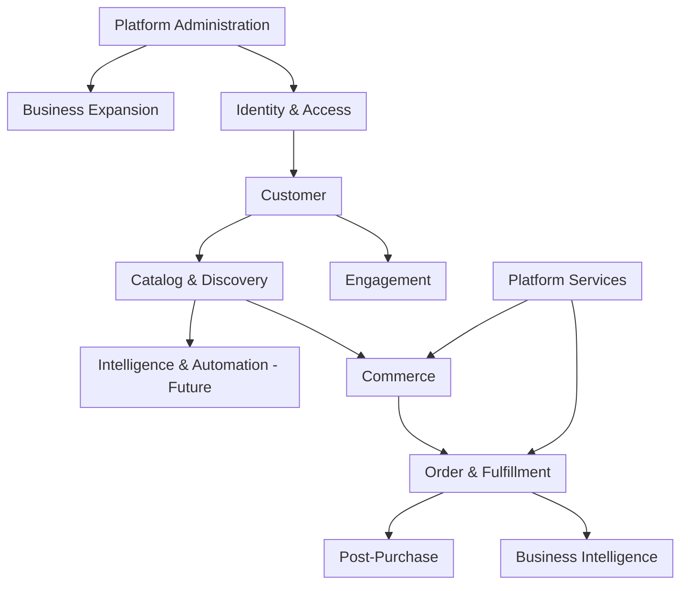
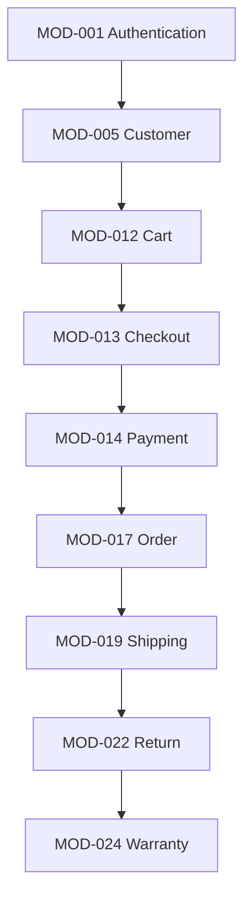

# Product Module Architecture

## 1. Document Purpose

This document defines the logical product module architecture of **StackLeo Tech Store**. It divides the product into well-defined business domains and functional modules, each representing a bounded business capability, using Domain-Driven Design (DDD) principles.

This document is the foundation for future system architecture, API design, database design, frontend architecture, backend services, testing strategy, and team ownership. It is derived from `product-overview.md`, `product-features.md`, and the business foundation established in `01_Business`.

This document defines module boundaries and business responsibility only. It does not describe implementation approach, technology choices, API design, or database structure, all of which are addressed in dedicated technical documentation elsewhere in the repository.

## 2. Product Module Philosophy

Each module in this architecture is designed to be:

- **Independent** — capable of evolving on its own timeline without forcing changes elsewhere.
- **Loosely Coupled** — interacting with other modules through clear, minimal business touchpoints rather than deep interdependency.
- **Highly Cohesive** — grouping closely related business responsibility within a single module rather than spreading it across many.
- **Scalable** — able to grow in complexity and volume without requiring a redefinition of its boundaries.
- **Future Ready** — structured so that planned future capability (marketplace, AI, corporate sales, international expansion) extends existing modules rather than requiring them to be redesigned.

Module boundaries in this document reflect business capability boundaries, not team structure or technical architecture — team and system design may organize around these modules, but the modules themselves are defined by business responsibility.

## 3. Domain Overview

StackLeo Tech Store's product is organized into 12 business domains (bounded contexts), each containing one or more modules that together own a distinct area of business capability.

| Domain | Description | Module Count |
|---|---|---|
| Identity & Access | Customer and administrative identity, access control, and accountability. | 4 |
| Customer | The customer's account and personal relationship with the platform. | 2 |
| Catalog & Discovery | Product information and how customers find products. | 5 |
| Commerce | The active shopping and purchasing transaction. | 5 |
| Order & Fulfillment | Order lifecycle and physical delivery of products. | 5 |
| Post-Purchase | Returns, refunds, warranty, and product feedback after a sale. | 4 |
| Engagement | Communication with customers across channels. | 1 |
| Business Intelligence | Measurement and reporting of business and product performance. | 2 |
| Platform Administration | Centralized internal administrative capability. | 1 |
| Business Expansion | Corporate and marketplace business models. | 2 |
| Intelligence & Automation (Future) | AI-assisted product and operational capability. | 1 |
| Platform Services | Cross-cutting technical and configuration capability. | 2 |

**Total Modules: 34**

*Diagram: High-Level Domain Architecture.*

---

## 4. Core Product Modules

Each module below is documented with its Module ID, Business Purpose, Scope, Responsibilities, Primary Users, Inputs, Outputs, Dependencies, Related Features, Related PRD Documents, Related Business Rules, KPIs, Risks, and Future Enhancements, organized by domain and presented across three tables per domain: **Identity & Purpose**, **Behavior**, and **Traceability**.

### 4.1 Identity & Access Domain

**Identity & Purpose**

| ID | Module | Business Purpose | Scope | Primary Users |
|---|---|---|---|---|
| MOD-001 | Authentication Module | Establish secure, verifiable identity for customers and staff. | Registration, login, verification, session security. | Customers, Admin Users |
| MOD-002 | User Management Module | Maintain customer account status and lifecycle. | Account state, suspension, closure, account-level settings. | Customers, Admin Users |
| MOD-003 | Role & Permission Module | Control what internal users are authorized to do. | Definition and assignment of admin roles and permissions. | Admin Users, Management |
| MOD-004 | Audit Log Module | Preserve an accountable record of administrative actions. | Logging of business-critical administrative activity. | Admin Users, Management, Compliance |

**Behavior**

| ID | Responsibilities | Inputs | Outputs |
|---|---|---|---|
| MOD-001 | Verify identity; issue and expire sessions; enforce login security. | Registration/login credentials, verification codes. | Verified identity, active session state. |
| MOD-002 | Track account state transitions; apply account-level restrictions. | Account status change requests. | Current account status, status history. |
| MOD-003 | Define roles; assign permissions; enforce least-privilege access. | Role definitions, assignment requests. | Authorized action scope per user. |
| MOD-004 | Record actor, action, and timestamp for governed actions. | Administrative action events from other modules. | Immutable audit trail. |

**Traceability**

| ID | Dependencies | Related Features | Related PRD | Related Business Rules | KPIs | Risks | Future Enhancements |
|---|---|---|---|---|---|---|---|
| MOD-001 | None | FEAT-001 | `product-requirements.md` | BR-001–BR-005, BR-110–BR-114 | Registration completion rate, login failure rate | Credential compromise | Federated / social sign-in |
| MOD-002 | MOD-001 | FEAT-002 | `product-requirements.md` | BR-006, BR-007 | Account suspension rate | Inconsistent status enforcement | Self-service reactivation |
| MOD-003 | MOD-001 | FEAT-053 | `product-requirements.md` | BR-101, BR-102 | Unauthorized access attempts | Over-permissioned roles | Granular permission templates |
| MOD-004 | MOD-003 | FEAT-054 | `product-requirements.md` | BR-104 | Audit log completeness | Incomplete logging coverage | Real-time audit alerting |

### 4.2 Customer Domain

**Identity & Purpose**

| ID | Module | Business Purpose | Scope | Primary Users |
|---|---|---|---|---|
| MOD-005 | Customer Module | Represent the customer's profile and personal shopping context. | Profile, addresses, wishlist, comparison, browsing history. | Customers |
| MOD-006 | Customer Dashboard Module | Give customers a unified view of their relationship with StackLeo. | Order, return, and warranty visibility in one place. | Customers |

**Behavior**

| ID | Responsibilities | Inputs | Outputs |
|---|---|---|---|
| MOD-005 | Maintain profile and address data; manage wishlist and comparison lists. | Customer-submitted profile and preference data. | Customer profile, saved addresses, wishlist. |
| MOD-006 | Aggregate order, return, and warranty status for customer visibility. | Data from Order, Return, and Warranty modules. | Consolidated customer account view. |

**Traceability**

| ID | Dependencies | Related Features | Related PRD | Related Business Rules | KPIs | Risks | Future Enhancements |
|---|---|---|---|---|---|---|---|
| MOD-005 | MOD-001 | FEAT-003–FEAT-007 | `product-requirements.md` | BR-008–BR-012, BR-020 | Profile completion rate | Incomplete or inaccurate address data | Address auto-suggestion |
| MOD-006 | MOD-005, MOD-017, MOD-022, MOD-024 | FEAT-021, FEAT-023, FEAT-026 | `product-requirements.md` | BR-073 | Dashboard engagement rate | Data latency across source modules | Unified notification center |

### 4.3 Catalog & Discovery Domain

**Identity & Purpose**

| ID | Module | Business Purpose | Scope | Primary Users |
|---|---|---|---|---|
| MOD-007 | Product Catalog Module | Own the authoritative record of sellable products. | Product listings, variants, attributes, SKUs, pricing state. | Customers, Admin Users |
| MOD-008 | Category Module | Organize products into a navigable structure. | Category hierarchy and product-category association. | Customers, Admin Users |
| MOD-009 | Brand Module | Associate products with verified brand identity. | Brand records and product-brand association. | Customers, Admin Users |
| MOD-010 | Search Module | Enable customers to find products by keyword and refinement. | Search indexing, filtering, and sorting. | Customers |
| MOD-011 | Recommendation Module (Future) | Surface personalized product suggestions. | Behavior-based and catalog-relevance-based recommendations. | Customers |

**Behavior**

| ID | Responsibilities | Inputs | Outputs |
|---|---|---|---|
| MOD-007 | Maintain product data completeness and pricing state validity. | Product data from Admin Module. | Published product listings. |
| MOD-008 | Maintain category hierarchy integrity. | Category structure changes. | Category-organized catalog view. |
| MOD-009 | Verify and maintain approved brand associations. | Brand records, product-brand assignments. | Brand-filtered catalog view. |
| MOD-010 | Index catalog content; process search and filter queries. | Customer search queries, catalog data. | Ranked, filtered product results. |
| MOD-011 | Generate suggestions from behavior and catalog signals. | Customer browsing and order history. | Personalized product suggestions. |

**Traceability**

| ID | Dependencies | Related Features | Related PRD | Related Business Rules | KPIs | Risks | Future Enhancements |
|---|---|---|---|---|---|---|---|
| MOD-007 | MOD-009 | FEAT-008 | `product-requirements.md` | BR-013–BR-029 | Catalog completeness | Inaccurate or incomplete listings | Rich media catalog content |
| MOD-008 | MOD-007 | FEAT-009 | `product-requirements.md` | BR-016, BR-017 | Category browse depth | Broken category-product linkage | Dynamic merchandising |
| MOD-009 | None | FEAT-010 | `product-requirements.md` | BR-015 | Brand page engagement | Unauthorized brand association | Brand storefront pages |
| MOD-010 | MOD-007 | FEAT-011, FEAT-012, FEAT-013 | `product-requirements.md` | — | Search-to-purchase rate | Poor relevance ranking | AI Search (MOD-032) |
| MOD-011 | MOD-007, MOD-017 | FEAT-014 | `product-requirements.md` | — | Recommendation click-through rate | Irrelevant or biased suggestions | AI Recommendations (MOD-032) |

### 4.4 Commerce Domain

**Identity & Purpose**

| ID | Module | Business Purpose | Scope | Primary Users |
|---|---|---|---|---|
| MOD-012 | Cart Module | Hold a customer's intended purchase prior to checkout. | Cart line items, quantities, and validity. | Customers |
| MOD-013 | Checkout Module | Convert a validated cart into a confirmed order. | Billing, shipping, and payment confirmation flow. | Customers |
| MOD-014 | Payment Module | Process and verify payment for orders. | Payment method selection, processing, and verification. | Customers, Finance |
| MOD-015 | Coupon Module | Apply discount codes to eligible orders. | Coupon validation, application, and usage tracking. | Customers, Marketing |
| MOD-016 | Promotion Module | Manage time-bound discount campaigns. | Campaigns, flash sales, and bundles. | Customers, Marketing |

**Behavior**

| ID | Responsibilities | Inputs | Outputs |
|---|---|---|---|
| MOD-012 | Validate cart contents against stock and pricing. | Product selections, quantities. | Validated cart ready for checkout. |
| MOD-013 | Collect and validate billing, shipping, and payment inputs. | Cart contents, address, payment selection. | Confirmed order request. |
| MOD-014 | Route payment to appropriate method; confirm success or failure. | Payment method, amount, order reference. | Payment confirmation or failure status. |
| MOD-015 | Validate coupon eligibility and apply discount. | Coupon code, cart contents. | Adjusted order total. |
| MOD-016 | Define and enforce promotional pricing windows and stock allocation. | Campaign configuration. | Active promotional pricing. |

**Traceability**

| ID | Dependencies | Related Features | Related PRD | Related Business Rules | KPIs | Risks | Future Enhancements |
|---|---|---|---|---|---|---|---|
| MOD-012 | MOD-007, MOD-021 | FEAT-015 | `product-requirements.md` | BR-040–BR-047 | Cart abandonment rate | Stock conflict at checkout | Persistent cross-device cart |
| MOD-013 | MOD-012, MOD-005, MOD-014, MOD-019 | FEAT-016 | `product-requirements.md` | BR-048–BR-054 | Checkout completion rate | Checkout drop-off | One-click checkout |
| MOD-014 | MOD-013, MOD-033 | FEAT-027–FEAT-031 | `product-requirements.md` | BR-055–BR-063 | Payment success rate | Payment gateway downtime | EMI, wallet support |
| MOD-015 | MOD-012, MOD-016 | FEAT-017 | `product-requirements.md` | BR-042, BR-093, BR-094 | Coupon redemption rate | Coupon abuse | Personalized coupon targeting |
| MOD-016 | MOD-007, MOD-021 | FEAT-018 | `product-requirements.md` | BR-095–BR-100 | Promotion-driven revenue share | Over-discounting | AI-optimized promotion timing |

### 4.5 Order & Fulfillment Domain

**Identity & Purpose**

| ID | Module | Business Purpose | Scope | Primary Users |
|---|---|---|---|---|
| MOD-017 | Order Module | Represent the authoritative record of a customer transaction. | Order lifecycle, status, and history. | Customers, Operations, Admin Users |
| MOD-018 | Invoice Module | Produce compliant financial documentation for orders. | Invoice generation and retrieval. | Customers, Finance |
| MOD-019 | Shipping Module | Coordinate courier delivery of orders. | Courier assignment, delivery zones, tracking. | Customers, Operations |
| MOD-020 | Warehouse Module | Manage physical fulfillment operations. | Picking, packing, and stock transfer between locations. | Operations, Warehouse Team |
| MOD-021 | Inventory Module | Maintain accurate, real-time stock levels. | Stock quantity, reservation, and availability. | Operations, Warehouse Team |

**Behavior**

| ID | Responsibilities | Inputs | Outputs |
|---|---|---|---|
| MOD-017 | Track order status through its defined lifecycle. | Confirmed checkout data. | Current and historical order state. |
| MOD-018 | Generate and store compliant invoices. | Confirmed order and pricing data. | Customer-accessible invoice. |
| MOD-019 | Assign courier partners; track delivery status. | Order and address data, courier network status. | Delivery status and tracking data. |
| MOD-020 | Pick, pack, and prepare orders; process stock transfers. | Order data, stock location data. | Fulfillment-ready shipments. |
| MOD-021 | Deduct, reserve, and replenish stock. | Order events, restocking data. | Real-time stock availability. |

**Traceability**

| ID | Dependencies | Related Features | Related PRD | Related Business Rules | KPIs | Risks | Future Enhancements |
|---|---|---|---|---|---|---|---|
| MOD-017 | MOD-013 | FEAT-020 | `product-requirements.md` | BR-064–BR-073 | Order Success Rate | Order state inconsistency | Order modification self-service |
| MOD-018 | MOD-017 | FEAT-022 | `product-requirements.md` | BR-072, BR-124–BR-126 | Invoice compliance rate | Non-compliant invoice content | Digital invoice archive |
| MOD-019 | MOD-017, MOD-021, MOD-033 | FEAT-021, FEAT-035, FEAT-036, FEAT-037 | `product-requirements.md` | BR-074–BR-081 | On-Time Delivery Rate | Courier service disruption | Own delivery fleet |
| MOD-020 | MOD-021 | (supports FEAT-035, FEAT-037) | `product-requirements.md` | BR-038, BR-039 | Fulfillment processing time | Picking or packing errors | Multi-warehouse routing |
| MOD-021 | MOD-007 | FEAT-032, FEAT-034 | `product-requirements.md` | BR-030–BR-039 | Stock accuracy rate | Overselling | Predictive stock alerts |

### 4.6 Post-Purchase Domain

**Identity & Purpose**

| ID | Module | Business Purpose | Scope | Primary Users |
|---|---|---|---|---|
| MOD-022 | Return Module | Manage customer-initiated return and exchange requests. | Return eligibility, inspection, and resolution. | Customers, Operations |
| MOD-023 | Refund Module | Execute financial resolution for returns and cancellations. | Refund calculation and processing. | Customers, Finance |
| MOD-024 | Warranty Module | Manage product warranty claims and resolution. | Claim validation, inspection, repair, and replacement. | Customers, Service Team |
| MOD-025 | Review Module | Capture verified customer product feedback. | Review and rating submission and moderation. | Customers |

**Behavior**

| ID | Responsibilities | Inputs | Outputs |
|---|---|---|---|
| MOD-022 | Validate return eligibility; route to inspection and resolution. | Return request, order data. | Return decision (refund/replacement/rejection). |
| MOD-023 | Calculate and issue refunds. | Approved return or cancellation event. | Completed refund transaction. |
| MOD-024 | Validate warranty coverage; route to repair or replacement. | Warranty claim, product serial/IMEI data. | Warranty resolution outcome. |
| MOD-025 | Verify purchase; moderate and publish reviews. | Customer review submission. | Published product review and rating. |

**Traceability**

| ID | Dependencies | Related Features | Related PRD | Related Business Rules | KPIs | Risks | Future Enhancements |
|---|---|---|---|---|---|---|---|
| MOD-022 | MOD-017, MOD-021 | FEAT-023, FEAT-025 | `product-requirements.md` | BR-RET-001–BR-RET-041 | Return Rate | Fraudulent return claims | Self-service return scheduling |
| MOD-023 | MOD-022, MOD-014 | FEAT-024, FEAT-031 | `product-requirements.md` | BR-060–BR-062 | Refund Processing Time | Refund reconciliation errors | Instant refund options |
| MOD-024 | MOD-017 | FEAT-026 | `product-requirements.md` | WR-001–WR-053 | Claim Approval Rate | Fraudulent warranty claims | QR code warranty verification |
| MOD-025 | MOD-017, MOD-007 | FEAT-038, FEAT-039 | `product-requirements.md` | BR-088–BR-092 | Review submission rate | Fake or abusive reviews | Review helpfulness voting |

### 4.7 Engagement Domain

**Identity & Purpose**

| ID | Module | Business Purpose | Scope | Primary Users |
|---|---|---|---|---|
| MOD-026 | Notification Module | Keep customers informed across communication channels. | Email, SMS, and future push/in-app notifications. | Customers |

**Behavior**

| ID | Responsibilities | Inputs | Outputs |
|---|---|---|---|
| MOD-026 | Trigger and deliver notifications based on business events. | Order, account, and promotional events from other modules. | Delivered customer notifications. |

**Traceability**

| ID | Dependencies | Related Features | Related PRD | Related Business Rules | KPIs | Risks | Future Enhancements |
|---|---|---|---|---|---|---|---|
| MOD-026 | MOD-017, MOD-005, MOD-033 | FEAT-040, FEAT-041, FEAT-042 | `product-requirements.md` | BR-120–BR-123 | Notification delivery rate | Delivery failure or delay | Push notifications (Mobile App) |

### 4.8 Business Intelligence Domain

**Identity & Purpose**

| ID | Module | Business Purpose | Scope | Primary Users |
|---|---|---|---|---|
| MOD-027 | Analytics Module | Analyze behavioral and performance data for decision-making. | Customer behavior, sales, and operational trend analysis. | Management, Product Team |
| MOD-028 | Reporting Module | Produce standard operational and financial reports. | Sales, inventory, customer, and finance reporting. | Management, Finance, Operations |

**Behavior**

| ID | Responsibilities | Inputs | Outputs |
|---|---|---|---|
| MOD-027 | Aggregate and analyze cross-module data for insight. | Data from Commerce, Order, and Customer domains. | Behavioral and performance insights. |
| MOD-028 | Compile structured, role-scoped business reports. | Data from Order, Inventory, and Finance-relevant modules. | Standard business reports. |

**Traceability**

| ID | Dependencies | Related Features | Related PRD | Related Business Rules | KPIs | Risks | Future Enhancements |
|---|---|---|---|---|---|---|---|
| MOD-027 | MOD-017, MOD-012, MOD-005 | FEAT-052 | `product-requirements.md` | BR-117 | Analytics adoption rate | Data quality inconsistency | Predictive analytics (AI) |
| MOD-028 | MOD-017, MOD-021, MOD-028 | FEAT-051 | `product-requirements.md` | BR-115–BR-119 | Report usage rate | Report inaccuracy | Scheduled report delivery |

### 4.9 Platform Administration Domain

**Identity & Purpose**

| ID | Module | Business Purpose | Scope | Primary Users |
|---|---|---|---|---|
| MOD-029 | Admin Module | Provide the centralized internal control surface for the platform. | Catalog, order, customer, and promotion administration. | Admin Users, Operations, Management |

**Behavior**

| ID | Responsibilities | Inputs | Outputs |
|---|---|---|---|
| MOD-029 | Provide unified administrative access to other modules, scoped by role. | Administrative actions from authorized users. | Administered business state across modules. |

**Traceability**

| ID | Dependencies | Related Features | Related PRD | Related Business Rules | KPIs | Risks | Future Enhancements |
|---|---|---|---|---|---|---|---|
| MOD-029 | MOD-003, MOD-004 | FEAT-045–FEAT-050 | `product-requirements.md` | BR-101–BR-105 | Admin active usage rate | Administrative error at scale | Customizable dashboard widgets |

### 4.10 Business Expansion Domain

**Identity & Purpose**

| ID | Module | Business Purpose | Scope | Primary Users |
|---|---|---|---|---|
| MOD-030 | Corporate Sales Module | Serve organizational and bulk buyers. | Corporate accounts, pricing, and bulk order handling. | Corporate Buyers, Sales Team |
| MOD-031 | Marketplace Module (Future) | Enable third-party sellers to list and sell products. | Seller onboarding, listings, commission, and settlement. | Marketplace Sellers, Customers |

**Behavior**

| ID | Responsibilities | Inputs | Outputs |
|---|---|---|---|
| MOD-030 | Manage corporate accounts and negotiated pricing terms. | Corporate account agreements, bulk order requests. | Fulfilled corporate orders. |
| MOD-031 | Onboard and govern sellers; calculate commission and settlement. | Seller applications, listings, marketplace order data. | Approved seller listings, seller payouts. |

**Traceability**

| ID | Dependencies | Related Features | Related PRD | Related Business Rules | KPIs | Risks | Future Enhancements |
|---|---|---|---|---|---|---|---|
| MOD-030 | MOD-017, MOD-003 | FEAT-055 | `product-requirements.md` | `01_Business/business-rules.md` (Sections 22–23) | Corporate revenue contribution | Non-standard pricing risk | Self-service corporate portal |
| MOD-031 | MOD-007, MOD-029, MOD-023 | FEAT-056, FEAT-057 | `product-requirements.md` | BR-106–BR-109, BR-129–BR-133 | Marketplace GMV share | Seller quality or authenticity risk | Seller analytics dashboard |

### 4.11 Intelligence & Automation Domain (Future)

**Identity & Purpose**

| ID | Module | Business Purpose | Scope | Primary Users |
|---|---|---|---|---|
| MOD-032 | AI Services Module (Future) | Provide AI-assisted capability across the product. | Search relevance, recommendations, chatbot, forecasting, fraud detection, dynamic pricing. | Customers, Operations, Management |

**Behavior**

| ID | Responsibilities | Inputs | Outputs |
|---|---|---|---|
| MOD-032 | Generate model-driven insights and automated actions across dependent modules. | Historical order, catalog, and behavior data. | Recommendations, forecasts, fraud flags, pricing signals. |

**Traceability**

| ID | Dependencies | Related Features | Related PRD | Related Business Rules | KPIs | Risks | Future Enhancements |
|---|---|---|---|---|---|---|---|
| MOD-032 | MOD-010, MOD-011, MOD-017, MOD-021, MOD-026 | FEAT-059–FEAT-064 | `product-requirements.md` | BR-134–BR-137 | Fraud Detection Rate, Recommendation-driven revenue | Reduced transparency or fairness perception | Multilingual, cross-market AI capability |

### 4.12 Platform Services Domain

**Identity & Purpose**

| ID | Module | Business Purpose | Scope | Primary Users |
|---|---|---|---|---|
| MOD-033 | Integration Module | Coordinate business interaction with external partners. | Courier, payment gateway, and communication provider coordination. | Operations, Finance |
| MOD-034 | Settings Module | Maintain platform-wide business configuration. | Business rule parameters, channel configuration, feature toggles. | Admin Users, Management |

**Behavior**

| ID | Responsibilities | Inputs | Outputs |
|---|---|---|---|
| MOD-033 | Coordinate data exchange with courier, payment, and communication partners at a business level. | Partner service status and responses. | Reliable partner-dependent business outcomes. |
| MOD-034 | Store and apply platform-wide business configuration. | Configuration changes from authorized Admin Users. | Consistent, current business configuration across modules. |

**Traceability**

| ID | Dependencies | Related Features | Related PRD | Related Business Rules | KPIs | Risks | Future Enhancements |
|---|---|---|---|---|---|---|---|
| MOD-033 | MOD-029 | (supports FEAT-028, FEAT-029, FEAT-035, FEAT-041, FEAT-042) | `product-requirements.md` | BR-058, BR-074 | Partner uptime | Partner service disruption | Multi-provider redundancy |
| MOD-034 | MOD-003 | (supports all modules) | `product-requirements.md` | Section 20, `01_Business/business-rules.md` | Configuration change accuracy | Misconfiguration impact | Configuration versioning and rollback |

---

## 5. Module Relationships

*Diagram: Module Dependency Diagram — core customer transaction chain.*

```mermaid
flowchart LR
    subgraph Foundation
        MOD001[Identity & Access]
        MOD029[Platform Administration]
        MOD033[Platform Services]
    end
    subgraph Customer_Facing[Customer-Facing]
        MOD005[Customer]
        MOD007[Catalog & Discovery]
        MOD012[Commerce]
    end
    subgraph Fulfillment
        MOD017[Order & Fulfillment]
        MOD022[Post-Purchase]
    end
    subgraph Growth[Business Growth]
        MOD027[Business Intelligence]
        MOD030[Business Expansion]
        MOD032[Intelligence & Automation]
    end
    Foundation --> Customer_Facing --> Fulfillment --> Growth
```

*Diagram: Product Module Map — grouping domains by their role in the overall architecture.*

## 6. Module Dependency Matrix

Given the number of modules, dependencies are presented as an upstream/downstream reference table rather than a full matrix, providing the same information in a more readable form.

| Module | Depends On (Upstream) | Depended On By (Downstream) |
|---|---|---|
| MOD-001 Authentication | None | MOD-002, MOD-005, MOD-026, MOD-029 |
| MOD-005 Customer | MOD-001 | MOD-006, MOD-012, MOD-025, MOD-026, MOD-027 |
| MOD-007 Product Catalog | MOD-009 | MOD-008, MOD-010, MOD-011, MOD-012, MOD-016, MOD-021, MOD-025, MOD-031 |
| MOD-012 Cart | MOD-007, MOD-021 | MOD-013, MOD-015 |
| MOD-013 Checkout | MOD-012, MOD-005, MOD-014, MOD-019 | MOD-017 |
| MOD-014 Payment | MOD-013, MOD-033 | MOD-023 |
| MOD-017 Order | MOD-013 | MOD-006, MOD-018, MOD-019, MOD-022, MOD-024, MOD-025, MOD-027, MOD-028, MOD-030 |
| MOD-019 Shipping | MOD-017, MOD-021, MOD-033 | MOD-006 |
| MOD-021 Inventory | MOD-007 | MOD-012, MOD-016, MOD-019, MOD-020, MOD-022 |
| MOD-022 Return | MOD-017, MOD-021 | MOD-023 |
| MOD-024 Warranty | MOD-017 | MOD-006 |
| MOD-029 Admin | MOD-003, MOD-004 | MOD-007, MOD-008, MOD-009, MOD-016, MOD-017, MOD-021, MOD-030, MOD-031 |
| MOD-032 AI Services (Future) | MOD-010, MOD-011, MOD-017, MOD-021, MOD-026 | MOD-010, MOD-011, MOD-014 (dynamic pricing) |
| MOD-033 Integration | MOD-029 | MOD-014, MOD-019, MOD-026 |
| MOD-034 Settings | MOD-003 | All modules (configuration consumer) |

## 7. Module Ownership

| Domain | Modules | Primary Owner |
|---|---|---|
| Identity & Access | MOD-001–MOD-004 | Engineering, Product Team |
| Customer | MOD-005, MOD-006 | Product Team |
| Catalog & Discovery | MOD-007–MOD-011 | Product Team, Marketing |
| Commerce | MOD-012–MOD-016 | Product Team, Marketing, Finance |
| Order & Fulfillment | MOD-017–MOD-021 | Operations, Warehouse |
| Post-Purchase | MOD-022–MOD-025 | Customer Support, Operations |
| Engagement | MOD-026 | Marketing, Customer Support |
| Business Intelligence | MOD-027, MOD-028 | Management, Finance |
| Platform Administration | MOD-029 | Product Team, Operations |
| Business Expansion | MOD-030, MOD-031 | Management, Product Team |
| Intelligence & Automation (Future) | MOD-032 | Product Team, Engineering |
| Platform Services | MOD-033, MOD-034 | Engineering, Operations |

## 8. Module Lifecycle

| Stage | Description |
|---|---|
| Planning | Module scope and business purpose are defined and validated against `01_Business` and `product-overview.md`. |
| Analysis | Detailed responsibilities, dependencies, and traceability are documented, as reflected in Section 4. |
| Design | Functional and non-functional expectations are elaborated ahead of technical design. |
| Development | The module's capability is built according to approved requirements. |
| Testing | The module is validated against acceptance criteria and cross-module integration expectations. |
| Deployment | The module is released, following the release strategy defined in `product-roadmap.md`. |
| Operations | The module operates in production, monitored against its defined KPIs. |
| Optimization | Performance and usage insights inform refinement, returning the module to Analysis. |

## 9. Module Prioritization

Module priority follows MoSCoW classification, aligned with the roadmap phases defined in `product-roadmap.md`.

| Priority | Modules |
|---|---|
| Must Have | MOD-001, MOD-002, MOD-005, MOD-007, MOD-008, MOD-009, MOD-010, MOD-012, MOD-013, MOD-014, MOD-017, MOD-018, MOD-019, MOD-021, MOD-022, MOD-023, MOD-024, MOD-026, MOD-029, MOD-033, MOD-034 |
| Should Have | MOD-003, MOD-004, MOD-006, MOD-015, MOD-016, MOD-025, MOD-028 |
| Could Have | MOD-011, MOD-020, MOD-027 |
| Won't Have (Current Release) | MOD-030, MOD-031, MOD-032 |

## 10. Cross-Module Communication

Modules interact through defined business events and shared business outcomes, not through direct technical coupling. This section describes these interactions at a business level only.

- **Events** — modules publish business-significant events (e.g., "Order Confirmed," "Return Approved," "Payment Failed") that other modules react to. For example, an "Order Confirmed" event from the Order Module triggers stock deduction in the Inventory Module and a confirmation notification from the Notification Module.
- **Business Interactions** — modules interact through well-defined business handoffs: Checkout hands off a confirmed order to the Order Module; the Order Module hands off fulfillment responsibility to Shipping or Warehouse; Return hands off approved resolutions to Refund.
- **Data Ownership (High-Level)** — each module owns the authoritative record for its business concern: the Product Catalog Module owns product data, the Order Module owns order state, the Inventory Module owns stock levels, and the Customer Module owns profile and address data. Other modules reference, but do not own, this data.
- **Integration Boundaries** — modules interacting with external parties (couriers, payment gateways, communication providers) do so exclusively through the Integration Module, ensuring other modules remain insulated from partner-specific business variability.

This section intentionally excludes any description of specific API contracts, message formats, or technical integration mechanisms, which are addressed in dedicated technical documentation.

## 11. Future Module Expansion

| Future Module | Description | Related Existing Module(s) |
|---|---|---|
| Seller Portal | Dedicated interface for marketplace seller operations. | Extends MOD-031 Marketplace Module |
| Affiliate | Affiliate/referral-based customer acquisition tracking. | Extends MOD-005 Customer, MOD-016 Promotion |
| Loyalty | Points-based customer retention program. | Extends MOD-005 Customer, MOD-016 Promotion |
| Gift Cards | Stored-value gift card issuance and redemption. | Extends MOD-014 Payment |
| Subscription | Recurring, subscription-based product or service offerings. | Extends MOD-013 Checkout, MOD-014 Payment |
| AI Assistant | Conversational customer support and shopping assistant. | Extends MOD-032 AI Services |
| ERP | Enterprise resource planning integration for financial and operational scale. | Extends MOD-028 Reporting, MOD-020 Warehouse |
| CRM | Deeper customer relationship management capability. | Extends MOD-005 Customer, MOD-026 Notification |
| POS | In-store point-of-sale system integration. | Extends MOD-017 Order, MOD-021 Inventory |
| Mobile Services | Mobile-specific capability, such as push notifications. | Extends MOD-026 Notification, MOD-001 Authentication |

## 12. Governance

| Governance Aspect | Description |
|---|---|
| Module Ownership | Each module has a designated domain owner, per Section 7, accountable for its scope, requirements, and performance monitoring. |
| Versioning | This document follows the Semantic Versioning approach defined in `00_Project_Overview/changelog.md`. |
| Change Management | Additions, removals, or boundary changes to modules must be recorded in `changelog.md` with supporting rationale, and reviewed for downstream impact using the dependency matrix in Section 6. |
| Review Process | Module boundaries and responsibilities are reviewed at the conclusion of each phase defined in `product-roadmap.md`, and whenever a new feature in `product-features.md` does not cleanly map to an existing module. |
| Deprecation Policy | A module marked for deprecation must have its dependent modules identified via the dependency matrix, a migration path defined for any dependent capability, and its removal communicated to all module owners before being withdrawn from this architecture. |

## 13. Document Information

| Property | Value |
|----------|-------|
| Document | product-modules.md |
| Version | 1.0.0 |
| Status | Active |
| Maintained By | StackLeo |
| Last Updated | 2026-07-17 |

---

© StackLeo. All Rights Reserved.
