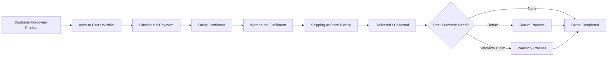

# Product Overview

## 1. Document Purpose

This document provides a complete overview of **StackLeo Tech Store** as a digital product. It explains what the product is, why it exists, who it serves, how it creates value, what problems it solves, how it differs from competitors, and the long-term product vision.

This document serves as the foundation for all Product Requirements Documents (PRDs), UX design, system architecture, development, testing, and future product planning. It translates the business direction established in `00_Project_Overview` and `01_Business` into a product-level frame of reference for every team that builds, designs, tests, or operates the platform.

This document describes the product at a strategic and functional level. It does not describe implementation approach, technology choices, API design, or database structure, all of which are addressed in dedicated technical documentation elsewhere in the repository.

| Property | Value |
|---|---|
| Company | StackLeo |
| Website | https://stackleo.com |
| Product | StackLeo Tech Store |
| Tagline | Everything Tech, One Marketplace. |
| Industry | Technology & Electronics Retail |
| Primary Market | Bangladesh |
| Future Expansion | South Asia → Global |

## 2. Product Introduction

StackLeo Tech Store is the flagship digital product of StackLeo, a technology and electronics retail company serving customers in Bangladesh. It is a marketplace platform designed to bring together a broad range of technology products — from smartphones and laptops to accessories and networking devices — under one trusted, consistently operated brand.

The product is delivered across the web and a physical retail store today, with a mobile app and point-of-sale (POS) capability planned for the future, all sharing a single, consistent product experience.

## 3. Product Summary

StackLeo Tech Store is a Business-to-Consumer (B2C) technology marketplace, future-ready for B2B sales, corporate sales, wholesale distribution, and multi-vendor marketplace operations. It supports Bangladeshi Taka (BDT) as its current currency, with multi-currency support planned to support future regional expansion.

The product combines online convenience with physical retail assurance, giving customers a single destination to discover, evaluate, and purchase genuine technology products, backed by dependable order fulfillment, warranty support, and customer service.

## 4. Product Vision

To become the most trusted and preferred technology marketplace in Bangladesh, and a recognized name in the region's technology e-commerce industry — extending, over time, from a single-market B2C platform into a diversified technology commerce ecosystem spanning South Asia and, eventually, a broader global presence.

This product vision is directly derived from `01_Business/vision.md` and gives the product a long-term direction independent of any single release or feature.

## 5. Product Mission

To provide customers with reliable access to genuine technology products through a simple, trustworthy, and customer-focused marketplace — bringing everything tech together, in one place they can depend on, consistent with `01_Business/mission.md`.

## 6. Product Philosophy

StackLeo Tech Store is built on the belief that a great technology marketplace must earn trust before it earns scale. Every product decision — from catalog breadth to checkout simplicity to warranty transparency — is evaluated against whether it strengthens customer confidence in the platform.

The product favors clarity over cleverness, consistency across channels over channel-specific shortcuts, and validated, incremental capability over premature complexity.

## 7. Problem Statement

Customers purchasing technology products in Bangladesh face a range of persistent challenges that StackLeo Tech Store is designed to address:

| Challenge | Description |
|---|---|
| Fake or Counterfeit Products | Customers frequently cannot be certain whether a product is genuine or grey-market. |
| Poor Warranty Support | Warranty terms are often unclear, inconsistently honored, or difficult to claim. |
| Inconsistent Pricing | Prices vary unpredictably across sellers, undermining customer confidence in fair value. |
| Poor After-Sales Service | Customer support and issue resolution are often slow or unreliable after a purchase is made. |
| Lack of a Trusted Marketplace | No single retailer currently combines broad catalog coverage with consistently trustworthy service. |
| Limited Inventory Visibility | Customers often cannot reliably tell whether a product is genuinely in stock before attempting to purchase. |

These challenges are documented in greater market depth in `01_Business/competitor-analysis.md` and `01_Business/target-market.md`.

## 8. Solution Overview

StackLeo Tech Store addresses these challenges through a combination of product design and business commitment:

- **Product Authenticity Assurance** — sourcing exclusively from approved brands and authorized distributors, with clear authenticity guarantees communicated at every product listing.
- **Transparent, Consistent Pricing** — a single, consistent price for each product across the online store and physical retail store, without hidden terms.
- **Reliable Warranty & After-Sales Support** — clearly defined warranty coverage and a structured claim process, detailed in `01_Business/warranty-policy.md`.
- **Accurate, Real-Time Inventory Visibility** — stock availability that reflects true, shared inventory across all sales channels.
- **A Single, Unified Marketplace Experience** — one brand, one catalog, and one standard of service across every channel a customer chooses to use.

## 9. Value Proposition

| Audience | Value Proposition |
|---|---|
| Customers | A single, trustworthy marketplace offering genuine technology products, fair pricing, and dependable after-sales support across online and physical channels. |
| Businesses (Future B2B) | A reliable technology procurement partner offering consistent product availability and business-appropriate purchasing terms. |
| Corporate Buyers (Future) | Streamlined bulk and organizational purchasing, backed by dedicated pricing, support, and warranty terms suited to business operations. |
| Future Marketplace Sellers | Access to a trusted, growing customer base through a platform that protects seller and customer confidence alike via curated onboarding and consistent standards. |

## 10. Product Goals

| Horizon | Goal |
|---|---|
| Short-Term | Deliver a reliable, trustworthy MVP marketplace across the online store and physical retail store, validating the core B2C model. |
| Mid-Term | Expand catalog depth, strengthen operational reliability, and introduce corporate sales and wholesale capabilities. |
| Long-Term | Establish a multi-vendor marketplace ecosystem and extend the product's reach across South Asia and, eventually, a broader global market. |

## 11. Product Scope

| Scope Category | Description |
|---|---|
| In Scope | A centralized B2C technology marketplace across web and physical retail; core catalog, cart, checkout, payments, orders, returns, warranty, and customer support capabilities. |
| Out of Scope | Manufacturing or in-house production of technology products; physical operations outside Bangladesh; multi-vendor marketplace and B2B operations at the current stage. |
| Future Scope | Mobile app, POS, corporate portal, wholesale portal, multi-vendor marketplace, and international expansion, introduced progressively per `product-roadmap.md`. |

Detailed scope boundaries are governed by `01_Business/business-requirements.md` and `00_Project_Overview/project-scope.md`.

## 12. Target Users

| User Group | Relevance to StackLeo Tech Store |
|---|---|
| Students | Purchase laptops, tablets, and accessories to support academic needs. |
| Gamers | Purchase gaming accessories, peripherals, and performance-oriented components. |
| Professionals | Purchase laptops, office electronics, and devices to support work needs. |
| Developers | Purchase computers, components, and peripherals suited to development and technical work. |
| Businesses (Future) | Purchase devices and electronics to support internal business operations. |
| Corporate Buyers (Future) | Procure technology at scale for organizational or institutional use. |
| Government Organizations (Future) | Represent a potential institutional buyer segment for future corporate sales capability. |
| Educational Institutions (Future) | Represent a potential institutional buyer segment for bulk technology procurement. |
| Content Creators | Purchase audio, video, and computing equipment suited to content production. |
| General Consumers | Purchase everyday technology and electronics products for personal use. |

Detailed personas for the currently prioritized segments are documented in `01_Business/target-market.md`.

## 13. Core Features Overview

| Feature | Description |
|---|---|
| Authentication | Customer registration, login, and account security. |
| Product Catalog | Centralized listing of all available products across categories. |
| Product Search | Keyword-based product discovery across the catalog. |
| Filtering | Refinement of search and catalog results by category, brand, price, and other attributes. |
| Wishlist | Saving products of interest for future consideration. |
| Compare Products | Side-by-side comparison of product specifications. |
| Cart | Temporary collection of products intended for purchase. |
| Checkout | Confirmation of billing, shipping, and payment details to complete a purchase. |
| Payments | Support for Cash on Delivery, digital payments, and future EMI options. |
| Orders | Order placement, status tracking, and history. |
| Invoices | Formal, compliant documentation of completed purchases. |
| Returns | Structured return and replacement request handling. |
| Warranty | Warranty registration, claims, and service coordination. |
| Reviews | Verified customer product ratings and feedback. |
| Notifications | Email, SMS, and future push/in-app updates on order and account activity. |
| Customer Dashboard | Centralized customer view of orders, returns, warranty, and account settings. |
| Admin Dashboard | Internal tools for managing catalog, orders, and operations. |
| Reports | Business and operational reporting across sales, inventory, and customers. |
| Inventory | Stock tracking across warehouses and store locations. |
| Coupons | Discount codes applied at cart or checkout. |
| Promotions | Time-bound campaigns, flash sales, and bundles. |
| Store Pickup | In-person order collection at a physical retail location. |
| Multi-Warehouse (Future) | Inventory management across multiple warehouse locations. |
| Corporate Sales (Future) | Dedicated purchasing capability for organizational and bulk buyers. |
| Marketplace (Future) | Third-party seller listings alongside StackLeo's own catalog. |

## 14. Product Modules Overview

| Module | Description |
|---|---|
| Customer | Customer-facing catalog, cart, checkout, orders, and account experience. |
| Admin | Internal administration of catalog, orders, users, and configuration. |
| Warehouse | Inventory management, stock movement, and fulfillment preparation. |
| Operations | Order fulfillment coordination across online and physical retail channels. |
| Finance | Revenue, refund, and financial reconciliation processes. |
| Support | Customer service, returns, and warranty claim handling. |
| Marketing | Promotions, campaigns, and customer engagement tools. |
| Analytics | Business and product performance measurement and reporting. |
| Corporate Portal (Future) | Dedicated purchasing and account management for corporate and bulk buyers. |
| Marketplace (Future) | Seller onboarding, product listing approval, and commission management. |

## 15. High-Level Business Workflow

## 16. Product Lifecycle

| Stage | Description |
|---|---|
| Planning | Defining requirements, scope, and design direction, as reflected in this documentation folder. |
| Development | Building the product's functional capabilities. |
| Testing | Validating functionality, quality, and reliability before release. |
| Launch | Releasing the product to customers, beginning with the MVP. |
| Growth | Expanding adoption, catalog, and channel reach. |
| Optimization | Refining the product based on real usage data and customer feedback. |
| Expansion | Introducing new business models, channels, and markets. |

## 17. Success Metrics

| KPI | Description |
|---|---|
| Monthly Active Users | Number of distinct customers actively engaging with the platform each month. |
| Conversion Rate | Proportion of visits or sessions resulting in a completed purchase. |
| Average Order Value | Average revenue generated per completed order. |
| Customer Satisfaction | Customer-reported satisfaction across the purchasing and support experience. |
| Order Success Rate | Proportion of orders completed without fulfillment failure. |
| Repeat Purchase Rate | Proportion of customers who complete more than one purchase. |
| Revenue Growth | Growth in total revenue across all active revenue streams. |
| Return Rate | Proportion of orders resulting in a return request. |
| Net Promoter Score (NPS) | Customer willingness to recommend StackLeo Tech Store to others. |

## 18. Risks

| Risk Category | Example Risk |
|---|---|
| Business Risks | Slower-than-expected customer adoption or revenue growth relative to business investment. |
| Operational Risks | Inconsistent fulfillment or service quality across online and physical retail channels. |
| Technical Risks | Platform reliability or scalability issues as usage and catalog complexity grow. |
| Market Risks | Increased competitive pressure from established retailers and general marketplaces. |
| Legal Risks | Non-compliance with evolving consumer protection, tax, or data privacy regulations in Bangladesh. |

A complete business risk assessment is documented in `01_Business/swot-analysis.md` and `01_Business/business-requirements.md`.

## 19. Assumptions

- Customers in Bangladesh are willing to purchase technology products through both online and physical retail channels.
- Sufficient supplier and distributor relationships exist, or can be established, to support the intended catalog breadth.
- Core infrastructure and courier partnerships, as defined in `01_Business/shipping-policy.md`, can reliably support product delivery.

A complete list of project-wide assumptions is maintained in `00_Project_Overview/assumptions.md`.

## 20. Constraints

- The product's current scope is limited to Bangladesh as the primary market, with South Asia and global expansion deferred to future phases.
- The current business model is limited to single-seller B2C operations, with B2B, corporate, wholesale, and marketplace capabilities deferred to future phases.
- Product scope and resourcing are bound by the constraints defined in `00_Project_Overview/constraints.md`.

## 21. Dependencies

- Business direction and requirements defined in `01_Business/business-requirements.md`, `01_Business/business-model.md`, and related business documents.
- Reliable courier and logistics partnerships, as described in `01_Business/shipping-policy.md`.
- Payment gateway and financial partnerships supporting the payment methods described in `01_Business/business-rules.md`.
- Ongoing brand and distributor relationships supporting product authenticity and warranty commitments.

## 22. Future Roadmap

The following capabilities represent StackLeo Tech Store's long-term product direction, to be sequenced and prioritized in `product-roadmap.md`:

- **AI** — AI-assisted product recommendations, search, demand forecasting, and customer support chatbot capabilities.
- **Marketplace** — Multi-vendor marketplace enabling curated third-party sellers.
- **ERP** — Deeper enterprise resource planning integration to support operational scale.
- **POS** — In-store point-of-sale capability unifying physical retail with the core platform.
- **Mobile App** — A dedicated mobile application extending the online store experience.
- **International Expansion** — Product and operational readiness for markets across South Asia and beyond.
- **Subscriptions** — Recurring, subscription-based product or service offerings.
- **Gift Cards** — Stored-value gift card purchasing and redemption.
- **Loyalty** — A loyalty points program rewarding repeat customer engagement.
- **Affiliate** — An affiliate or referral-based customer acquisition program.

## 23. Glossary

Product-specific terminology used throughout this folder is defined in `glossary.md`, which extends the foundational terminology established in `01_Business/glossary.md`. Where a term is used consistently across both business and product documentation, `01_Business/glossary.md` remains the authoritative definition.

## 24. References

| Reference | Location |
|---|---|
| Business Requirements | `01_Business/business-requirements.md` |
| Business Model | `01_Business/business-model.md` |
| Target Market | `01_Business/target-market.md` |
| Competitor Analysis | `01_Business/competitor-analysis.md` |
| SWOT Analysis | `01_Business/swot-analysis.md` |
| Business Rules | `01_Business/business-rules.md` |
| Pricing Strategy | `01_Business/pricing-strategy.md` |
| Shipping Policy | `01_Business/shipping-policy.md` |
| Return Policy | `01_Business/return-policy.md` |
| Warranty Policy | `01_Business/warranty-policy.md` |
| Project Roadmap | `00_Project_Overview/project-roadmap.md` |

## 25. Document Information

| Property | Value |
|----------|-------|
| Document | product-overview.md |
| Version | 1.0.0 |
| Status | Active |
| Maintained By | StackLeo |
| Last Updated | 2026-07-17 |

---

© StackLeo. All Rights Reserved.
