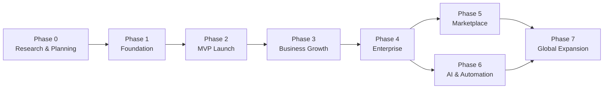
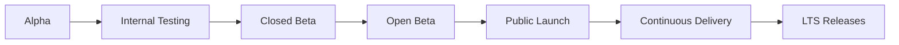
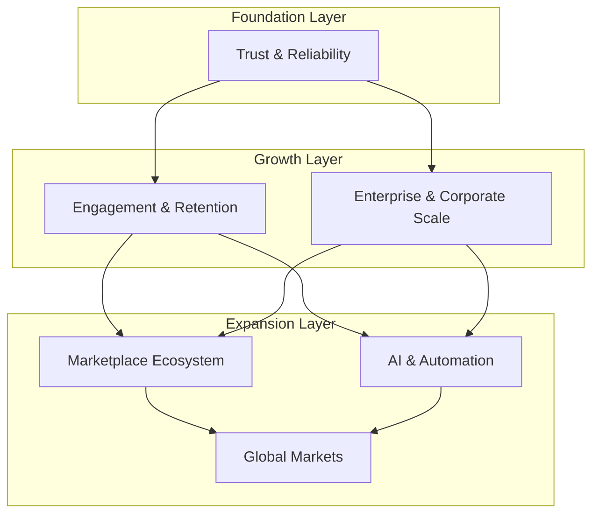
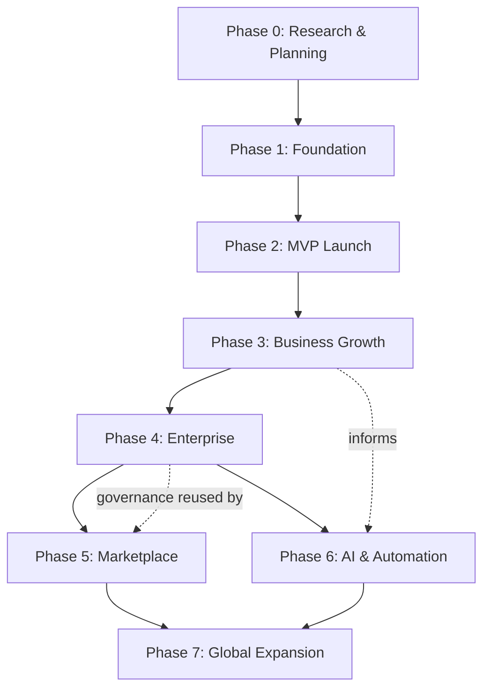

# Product Roadmap

## 1. Document Purpose

This document defines the official product roadmap for **StackLeo Tech Store**. It communicates the long-term evolution of the product from MVP to an enterprise-grade omnichannel commerce platform, aligning business strategy, product strategy, engineering priorities, operations, customer experience, and future expansion.

This roadmap is intended for executives, product managers, engineering teams, designers, QA, DevOps, operations, investors, and stakeholders. It is structured using phase-based planning rather than calendar dates: each phase represents a validated stage of maturity that must be substantially achieved before the next phase is prioritized, consistent with the phased growth philosophy defined in `01_Business/business-model.md`.

This document defines product direction and sequencing only. It does not describe implementation approach, technology choices, API design, or database structure, all of which are addressed in dedicated technical documentation elsewhere in the repository.

## 2. Product Vision Alignment

This roadmap operationalizes the product vision defined in `product-overview.md`: to become the most trusted and preferred technology marketplace in Bangladesh, expanding into a diversified commerce ecosystem across South Asia and, eventually, a broader global market.

Each phase in this roadmap is designed to move the product measurably closer to that vision — first by earning trust as a single-market B2C platform, then by scaling operational and commercial capability, and finally by extending reach through marketplace, intelligence, and international expansion.

## 3. Roadmap Principles

- **Phase-Based, Not Date-Based** — progression is governed by validated exit criteria, not fixed calendar commitments.
- **Trust Before Scale** — foundational reliability and customer trust must be demonstrated before pursuing broader growth.
- **Sequential Dependency Awareness** — later phases build directly on capabilities validated in earlier phases; phases should not be parallelized without deliberate justification.
- **Business-Product-Engineering Alignment** — every phase ties business objectives to product objectives to engineering deliverables.
- **Reversible Before Irreversible** — capabilities with high organizational or customer impact (e.g., marketplace, international expansion) are sequenced after lower-risk capabilities are proven.

## 4. Product Strategy Alignment

This roadmap is directly derived from and must remain consistent with:

| Source Document | Alignment Purpose |
|---|---|
| `01_Business/business-model.md` | Defines the phased business growth strategy this roadmap operationalizes at the product level. |
| `01_Business/objectives.md` | Defines the measurable business and product objectives each phase should advance. |
| `00_Project_Overview/project-roadmap.md` | Defines the project-wide delivery phases this product roadmap elaborates in product terms. |
| `product-overview.md` | Defines the product vision, mission, and scope this roadmap is sequenced to achieve. |

## 5. Roadmap Overview

| Phase | Name | Primary Focus |
|---|---|---|
| Phase 0 | Research & Planning | Market validation, requirements, and foundational documentation. |
| Phase 1 | Foundation | Core platform foundations: authentication, catalog, search, admin. |
| Phase 2 | MVP Launch | Complete B2C purchase journey: cart, checkout, payments, fulfillment. |
| Phase 3 | Business Growth | Customer engagement, promotions, and operational maturity. |
| Phase 4 | Enterprise | Corporate sales, multi-warehouse, governance, and advanced operations. |
| Phase 5 | Marketplace | Multi-vendor seller ecosystem. |
| Phase 6 | AI & Automation | Intelligent search, recommendations, forecasting, and support. |
| Phase 7 | Global Expansion | Multi-currency, multi-language, and international operations. |

*Diagram: Product Evolution Timeline.*

## 6. Phase 0 — Research & Planning

**Business Objectives:** Validate market opportunity and establish a credible business foundation before committing engineering investment.

**Product Objectives:** Establish a clear, evidence-based product direction grounded in real market and customer understanding.

**Major Deliverables:**

| Deliverable | Description |
|---|---|
| Market Research | Analysis of Bangladesh's technology retail market, referencing `01_Business/target-market.md`. |
| Competitor Analysis | Structured competitive assessment, per `01_Business/competitor-analysis.md`. |
| Business Requirements | Formal business requirements, per `01_Business/business-requirements.md`. |
| Product Discovery | Early validation of product concept against target user needs. |
| Documentation | Foundational business and product documentation across `00_Project_Overview`, `01_Business`, and `02_Product`. |
| Branding | Establishment of StackLeo's brand identity and positioning. |
| Initial Architecture | High-level technical direction sufficient to guide Phase 1 planning, without committing to detailed implementation. |

**Dependencies:** None; this is the originating phase.

**Exit Criteria:** Business requirements, product overview, and foundational documentation are complete and approved; brand identity is established; high-level architecture direction is agreed.

**Success Metrics:** Completion and stakeholder approval of foundational documentation; validated product concept.

**Risks:** Incomplete market understanding leading to misaligned product direction.

**Future Considerations:** Findings from this phase should be revisited periodically as the product matures, particularly before Phase 4 and Phase 7.

## 7. Phase 1 — Foundation

**Business Objectives:** Establish the core platform capable of representing StackLeo's catalog and brand credibly to early users.

**Product Objectives:** Deliver the foundational capabilities every later phase depends on.

**Major Deliverables:**

| Deliverable | Description |
|---|---|
| Authentication | Customer registration, login, and account security. |
| User Management | Customer account and profile management. |
| Product Catalog | Core catalog structure for all product categories. |
| Categories | Category hierarchy supporting catalog navigation. |
| Brands | Brand association and management for catalog products. |
| Search | Keyword-based product discovery. |
| Filtering | Catalog refinement by category, brand, price, and attributes. |
| Responsive UI | A consistent, usable interface across device types. |
| Admin Foundation | Core administrative capability for managing catalog and users. |
| Initial Security | Baseline authentication, authorization, and data protection controls. |
| Logging | Foundational system and audit logging. |
| Documentation | Functional and non-functional requirements supporting this phase. |

**Dependencies:** Completion of Phase 0 business requirements and product overview.

**Exit Criteria:** Customers can register, log in, and browse a representative catalog with working search and filtering; administrators can manage catalog content.

**Success Metrics:** Catalog completeness relative to planned launch categories; successful internal validation of core browsing and account flows.

**Risks:** Underestimating the foundational work required, leading to unstable later-phase development.

**Future Considerations:** Foundation capabilities must remain extensible to support corporate, marketplace, and international needs introduced in later phases.

## 8. Phase 2 — MVP Launch

**Business Objectives:** Launch a complete, trustworthy B2C purchasing experience and validate the core business model defined in `01_Business/business-model.md`.

**Product Objectives:** Deliver a fully functional purchase journey from product discovery to post-purchase support.

**Major Deliverables:**

| Deliverable | Description |
|---|---|
| Cart | Product collection prior to checkout. |
| Checkout | Billing, shipping, and payment confirmation flow. |
| Orders | Order placement, status tracking, and history. |
| Payments | Cash on Delivery and digital payment support. |
| Invoices | Compliant invoice generation for completed orders. |
| Shipping | Courier delivery and store pickup, per `01_Business/shipping-policy.md`. |
| Returns | Return and replacement request handling, per `01_Business/return-policy.md`. |
| Warranty | Warranty claim handling, per `01_Business/warranty-policy.md`. |
| Reviews | Verified-purchase product ratings and reviews. |
| Notifications | Email and SMS order and account notifications. |
| Customer Dashboard | Centralized customer view of orders, returns, and warranty. |
| Inventory | Real-time stock tracking supporting accurate availability. |
| Basic Analytics | Foundational sales and traffic reporting. |
| SEO | Search engine visibility for the online store. |
| Performance | Baseline performance standards for a public-facing launch. |

**Dependencies:** Completion of Phase 1 foundation; active courier and payment partnerships.

**Exit Criteria:** A customer can complete an end-to-end purchase, receive their order, and successfully request a return or warranty claim if needed, across both online and physical retail channels.

**Success Metrics:** Order Success Rate, Conversion Rate, Customer Satisfaction, Return Rate, as defined in Section 18.

**Risks:** Fulfillment or payment reliability issues undermining early customer trust at the most visible stage of the product.

**Future Considerations:** MVP capabilities must be built with sufficient extensibility to support promotions (Phase 3) and multi-warehouse operations (Phase 4) without significant rework.

## 9. Phase 3 — Business Growth

**Business Objectives:** Deepen customer engagement and operational maturity to support sustainable growth beyond initial launch.

**Product Objectives:** Introduce capabilities that increase customer retention, order value, and marketing effectiveness.

**Major Deliverables:**

| Deliverable | Description |
|---|---|
| Coupons | Discount codes applied at cart or checkout. |
| Promotions | Time-bound campaigns and seasonal offers. |
| Flash Sales | Short-duration, limited-stock promotional events. |
| Wishlist | Saving products of interest for future consideration. |
| Compare Products | Side-by-side product specification comparison. |
| Loyalty | Foundational loyalty points capability. |
| Referral | Customer referral rewards program. |
| Email Marketing | Customer engagement through targeted email campaigns. |
| Advanced Reports | Deeper sales, customer, and inventory reporting. |
| Customer Insights | Behavioral and purchasing pattern analysis. |
| Warehouse Improvements | Enhanced warehouse fulfillment efficiency and accuracy. |
| Store Pickup | Full store pickup capability across supported locations. |

**Dependencies:** Stable, validated MVP from Phase 2; sufficient order volume to generate meaningful customer insight data.

**Exit Criteria:** Demonstrated growth in repeat purchase rate and customer engagement metrics following the introduction of promotions and retention features.

**Success Metrics:** Repeat Purchase Rate, Average Order Value, NPS, as defined in Section 18.

**Risks:** Over-discounting eroding margins, per the pricing risks defined in `01_Business/pricing-strategy.md`.

**Future Considerations:** Loyalty and referral foundations should anticipate future integration with a formal membership program, per `01_Business/pricing-strategy.md` (Section 12).

## 10. Phase 4 — Enterprise

**Business Objectives:** Expand into corporate and bulk sales while strengthening the operational, governance, and security maturity needed to support enterprise-scale operations.

**Product Objectives:** Introduce business-facing capabilities and internal controls appropriate to a larger, more complex operation.

**Major Deliverables:**

| Deliverable | Description |
|---|---|
| Corporate Sales | Dedicated purchasing capability for organizational and bulk buyers. |
| Multi-Warehouse | Inventory management across multiple warehouse locations. |
| Role-Based Access Control | Fine-grained internal permission management, per `01_Business/business-rules.md` (Section 12). |
| Audit Logs | Comprehensive logging of administrative and business-critical actions. |
| Advanced Reporting | Enterprise-grade business intelligence reporting. |
| Finance Dashboard | Centralized financial reconciliation and reporting tools. |
| Vendor Management | Structured management of supplier and distributor relationships. |
| Operations Dashboard | Centralized operational visibility across channels and warehouses. |
| Support Dashboard | Centralized customer support case management. |
| Advanced Security | Expanded security controls appropriate to increased operational scale. |
| Compliance | Formalized compliance controls, per `01_Business/business-rules.md` (Section 17). |
| Backup & Disaster Recovery | Business continuity planning for critical systems and data. |

**Dependencies:** Proven Phase 2 and Phase 3 operational stability; validated corporate sales demand from market research.

**Exit Criteria:** Corporate customers can complete bulk purchases under negotiated terms; multi-warehouse inventory is accurately tracked; governance and compliance controls are operating as intended.

**Success Metrics:** Corporate revenue contribution, System Availability, MTTR, as defined in Section 18.

**Risks:** Underestimating the governance and compliance investment required to operate reliably at enterprise scale.

**Future Considerations:** Enterprise-grade governance established in this phase becomes the foundation for marketplace seller governance in Phase 5.

## 11. Phase 5 — Marketplace

**Business Objectives:** Expand catalog breadth and revenue through curated third-party sellers, consistent with the marketplace expansion strategy defined in `01_Business/business-model.md` (Section 15).

**Product Objectives:** Introduce a seller ecosystem without compromising the trust and consistency established in earlier phases.

**Major Deliverables:**

| Deliverable | Description |
|---|---|
| Seller Portal | Interface for marketplace sellers to manage their storefront presence. |
| Seller Dashboard | Seller-facing order, inventory, and performance visibility. |
| Commission Engine | Automated commission calculation and application. |
| Settlement | Structured seller payout processing. |
| Product Approval | Content and authenticity review workflow for seller listings. |
| Dispute Management | Structured resolution process for customer-seller disputes. |
| Marketplace Analytics | Performance reporting across sellers and marketplace-wide catalog. |

**Dependencies:** Enterprise-grade governance, RBAC, and audit capability from Phase 4; validated brand trust from Phases 2–3.

**Exit Criteria:** Verified sellers can list, sell, and be paid for products through the platform, with disputes resolved through a structured process and no measurable degradation in customer trust metrics.

**Success Metrics:** Number and quality of active sellers, Marketplace Revenue Contribution, Customer Satisfaction, as defined in Section 18.

**Risks:** Seller-driven quality or authenticity issues undermining the brand trust built in earlier phases.

**Future Considerations:** Marketplace seller data becomes a key input to AI-driven recommendations and fraud detection in Phase 6.

## 12. Phase 6 — AI & Automation

**Business Objectives:** Improve customer experience, operational efficiency, and decision-making through intelligent automation.

**Product Objectives:** Introduce AI-assisted capabilities that enhance, rather than replace, the trust-based product experience.

**Major Deliverables:**

| Deliverable | Description |
|---|---|
| AI Search | Intelligent, relevance-ranked product search. |
| AI Recommendations | Personalized product recommendations based on genuine behavior and catalog relevance. |
| AI Chatbot | Automated customer support assistant with escalation to human support. |
| Demand Forecasting | Predictive modeling of customer demand. |
| Inventory Forecasting | Predictive modeling of stock replenishment needs. |
| Dynamic Pricing | Bounded, rule-governed price adjustment, per `01_Business/pricing-strategy.md` (Section 9). |
| Fraud Detection | AI-assisted detection of fraudulent orders, returns, and warranty claims. |
| Smart Support | Intelligent triage and prioritization of support requests. |
| Business Intelligence | Advanced, model-driven business performance insight. |
| Automation | Workflow automation across operational and administrative processes. |

**Dependencies:** Sufficient historical order, catalog, and customer data from Phases 2–5 to train and validate models responsibly.

**Exit Criteria:** AI-assisted features demonstrably improve targeted metrics (e.g., conversion, fraud detection rate) without degrading customer trust or transparency.

**Success Metrics:** Fraud Detection Rate, Conversion Rate, Customer Satisfaction, as defined in Section 18.

**Risks:** Over-reliance on automation reducing perceived transparency or fairness, contrary to the trust-first philosophy defined in `01_Business/mission.md`.

**Future Considerations:** AI capabilities should be extensible to support multi-language and multi-market operation ahead of Phase 7.

## 13. Phase 7 — Global Expansion

**Business Objectives:** Extend StackLeo's trusted marketplace model into South Asia and, eventually, a broader global market, consistent with `01_Business/vision.md`.

**Product Objectives:** Adapt the product to operate reliably and appropriately across multiple markets, currencies, and languages.

**Major Deliverables:**

| Deliverable | Description |
|---|---|
| International Shipping | Cross-border delivery capability and partnerships. |
| Multi-Currency | Support for transacting in currencies beyond BDT. |
| Multi-Language | Localized product and interface content for target markets. |
| Tax Engine | Configurable tax handling across differing regional requirements. |
| Regional Warehouses | Localized inventory positioning to support new markets. |
| Global Payments | Support for regionally relevant payment methods. |
| International Compliance | Adherence to legal and regulatory requirements in each new market. |

**Dependencies:** Proven, stable enterprise, marketplace, and AI-driven operations from Phases 4–6.

**Exit Criteria:** The product operates reliably in at least one additional market outside Bangladesh, with compliant tax, payment, and shipping operations.

**Success Metrics:** Revenue Growth from new markets, System Availability across regions, Customer Satisfaction, as defined in Section 18.

**Risks:** Regulatory or logistical complexity in new markets exceeding the organization's operational readiness.

**Future Considerations:** Establishes the foundation for StackLeo's long-term evolution into a regional or global commerce platform.

## 14. Release Strategy

*Diagram: Release Lifecycle.*

| Stage | Description |
|---|---|
| Alpha | Early, internally validated build used to confirm core functionality is directionally correct. |
| Internal Testing | Structured QA validation against acceptance criteria before any external exposure. |
| Closed Beta | Limited release to a defined group of trusted early users for real-world feedback. |
| Open Beta | Broader public access with clear expectations that issues may still be present. |
| Public Launch | Full public release of the validated capability. |
| Continuous Delivery | Ongoing, incremental delivery of improvements and new capabilities post-launch. |
| LTS Releases | Designated stable milestones intended for extended reliability, particularly relevant for enterprise and corporate customers. |

## 15. MVP Definition

The MVP scope is defined using MoSCoW prioritization, aligned with the MVP scope defined in `00_Project_Overview/project-scope.md`.

| Priority | Capabilities |
|---|---|
| Must Have | Authentication, product catalog, search and filtering, cart, checkout, payments (COD and digital), order management, shipping and store pickup, returns, warranty, basic notifications, customer dashboard, admin foundation. |
| Should Have | Product reviews, basic analytics, SEO optimization, coupons, and foundational inventory reporting. |
| Could Have | Wishlist, compare products, email marketing, and advanced reporting. |
| Won't Have (at MVP) | Corporate sales, multi-warehouse, marketplace, AI-driven capabilities, and international expansion. |

## 16. Dependencies

| Dependency Type | Description |
|---|---|
| Business | Continued business funding and organizational commitment across each phase, per `00_Project_Overview/constraints.md`. |
| Technical | Stable, extensible platform foundations established in Phase 1, upon which all later phases build. |
| Operational | Reliable courier, warehouse, and customer support capacity to match each phase's scale. |
| Legal | Ongoing compliance with Bangladesh e-commerce and consumer protection regulation, and future market-specific regulation for Phase 7. |
| Infrastructure | Adequate infrastructure capacity and reliability to support increasing transaction and data volume across phases. |

## 17. Risks

| Risk Category | Example Risk |
|---|---|
| Business Risks | Overextending into new phases before prior phases are validated, straining resources and diluting focus. |
| Technical Risks | Foundational architecture decisions in early phases constraining later-phase scalability. |
| Operational Risks | Fulfillment, support, or warehouse capacity failing to keep pace with growth across phases. |
| Financial Risks | Margin erosion from promotions, corporate discounting, or marketplace commission structures introduced prematurely. |
| Compliance Risks | Failure to meet evolving regulatory requirements as the product scales into enterprise, marketplace, and international operations. |

## 18. Success Metrics

| KPI | Relevant Phase(s) |
|---|---|
| Revenue | All phases, with increasing diversification from Phase 4 onward. |
| Orders | Phase 2 onward. |
| Conversion Rate | Phase 2 onward. |
| Customer Satisfaction | All phases. |
| Retention | Phase 3 onward. |
| Net Promoter Score (NPS) | Phase 3 onward. |
| System Availability | Phase 2 onward, with increasing criticality from Phase 4. |
| Deployment Frequency | Phase 2 onward, reflecting engineering delivery health. |
| Mean Time to Recovery (MTTR) | Phase 2 onward, reflecting operational and technical resilience. |

## 19. Roadmap Governance

| Governance Aspect | Description |
|---|---|
| Ownership | The Product Manager / Project Lead owns this roadmap, with input from business, engineering, and operations leadership. |
| Review Frequency | Reviewed at the conclusion of each phase, and upon any material change in business direction or market conditions. |
| Approval Process | Phase entry and exit require sign-off from the Product Manager / Project Lead and Founder / Business Owner, consistent with `01_Business/business-rules.md` (Section 20.5). |
| Versioning | This document follows the Semantic Versioning approach defined in `00_Project_Overview/changelog.md`. |
| Change Management | Material changes to phase scope, sequencing, or exit criteria must be recorded in `changelog.md` with supporting rationale. |

## 20. Future Vision

Beyond Phase 7, StackLeo Tech Store's long-term evolution is expected to continue along four converging dimensions:

- **Omnichannel Commerce** — a seamless experience across web, mobile app, physical store, and POS, unified by consistent catalog, pricing, and service.
- **AI Commerce** — deepening use of AI across search, personalization, forecasting, and support, always in service of customer trust rather than in place of it.
- **Marketplace** — a mature, trusted multi-vendor ecosystem extending catalog breadth well beyond StackLeo's own sourcing capacity.
- **Enterprise Retail Platform** — a robust operational and governance foundation capable of supporting corporate, wholesale, and institutional commerce at scale.
- **International Expansion** — sustained, trust-led growth across South Asia and, ultimately, a broader global market.

*Diagram: Product Growth Roadmap — illustrating how trust and reliability compound into engagement and enterprise scale, which in turn enable marketplace, AI, and global expansion.*

*Diagram: Phase Dependency Diagram — solid arrows indicate hard sequencing dependencies; dotted arrows indicate informational or structural reuse between phases.*

## 21. Document Information

| Property | Value |
|----------|-------|
| Document | product-roadmap.md |
| Version | 1.0.0 |
| Status | Active |
| Maintained By | StackLeo |
| Last Updated | 2026-07-17 |

---

© StackLeo. All Rights Reserved.
