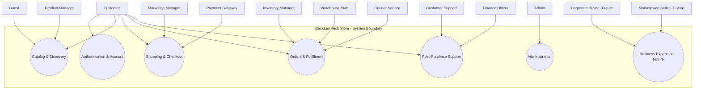
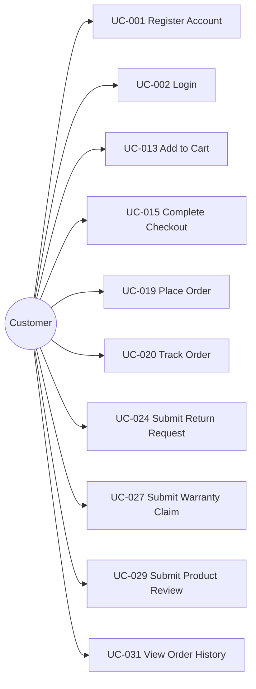
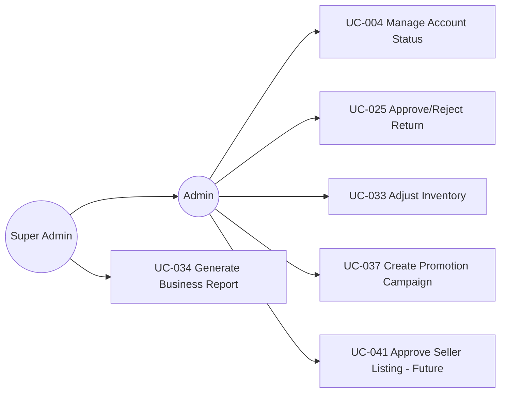
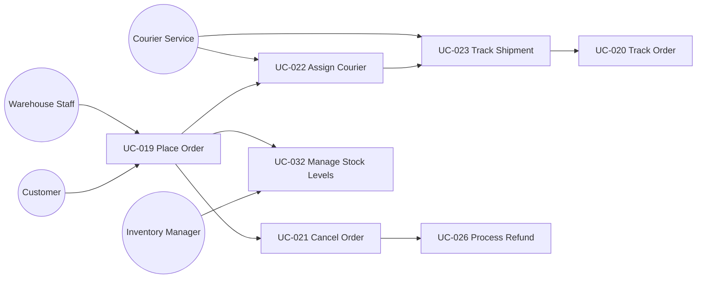
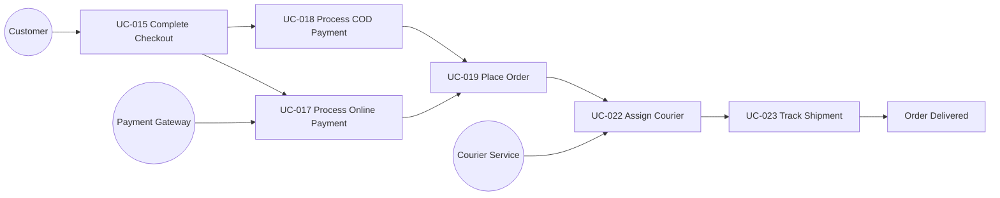

# Use Case Specification

## 1. Document Purpose

This document is the official Use Case Specification for **StackLeo Tech Store**. It defines all major interactions between users (and external systems) and the platform, using UML-inspired best practices.

This document serves as the bridge between `01_Business/business-requirements.md`, `product-requirements.md`, UX design (`user-journeys.md`, `user-personas.md`), and future API design, backend development, frontend development, QA testing, and system design. Every use case here traces to the actors defined in `user-roles.md`, the features defined in `product-features.md`, and the modules defined in `product-modules.md`.

This document defines functional interaction scope only. It does not describe implementation approach, technology choices, API design, or database structure, all of which are addressed in dedicated technical documentation elsewhere in the repository.

## 2. Use Case Methodology

Each use case in this document is structured using the following UML-inspired concepts:

- **Actors** — the user, role, or external system initiating or participating in the use case.
- **System Boundary** — the use case describes interaction with StackLeo Tech Store as a whole system; it does not decompose into internal technical components.
- **Preconditions** — the state that must be true before the use case can begin.
- **Triggers** — the specific event that initiates the use case.
- **Main Flow** — the primary, expected sequence of interaction steps.
- **Alternative Flow** — valid variations that still lead to a successful outcome.
- **Exception Flow** — failure or edge-case paths and how the system responds.
- **Postconditions** — the state of the system once the use case concludes.
- **Business Rules** — the governing rules from `01_Business/business-rules.md` and related policy documents that constrain the use case.
- **Success Criteria** — how successful completion is measured.

## 3. Actor Definitions

| Category | Actor | Description |
|---|---|---|
| External Actor | Guest | An unauthenticated visitor browsing the platform. |
| External Actor | Customer | An authenticated Registered Customer, per `user-roles.md` (ROLE-002). |
| External Actor | Corporate Buyer (Future) | An authenticated Corporate Customer, per `user-roles.md` (ROLE-003). |
| External Actor | Marketplace Seller (Future) | A verified third-party seller, per `user-roles.md` (ROLE-004). |
| Internal Actor | Super Admin | Highest-level internal authority, per `user-roles.md` (ROLE-005). |
| Internal Actor | Admin | Day-to-day administrative authority, per `user-roles.md` (ROLE-006). |
| Internal Actor | Product Manager | Owns catalog and product strategy, per `user-roles.md` (ROLE-008). |
| Internal Actor | Inventory Manager | Oversees stock accuracy, per `user-roles.md` (ROLE-009). |
| Internal Actor | Warehouse Staff | Executes physical fulfillment, per `user-roles.md` (ROLE-010). |
| Internal Actor | Customer Support | Resolves customer inquiries and cases, per `user-roles.md` (ROLE-011). |
| Internal Actor | Finance Officer | Oversees payments and refunds, per `user-roles.md` (ROLE-012). |
| Internal Actor | Marketing Manager | Oversees promotions and campaigns, per `user-roles.md` (ROLE-013). |
| External System | Payment Gateway | Processes and verifies digital payments. |
| External System | Courier Service | Executes physical delivery of orders. |
| External System | Email Service | Delivers transactional and marketing email. |
| External System | SMS Service | Delivers time-sensitive SMS notifications. |
| External System | ERP (Future) | Future enterprise resource planning integration. |
| External System | CRM (Future) | Future customer relationship management integration. |

## 4. Use Case Categories

| Category | Use Case Count |
|---|---|
| Authentication | 2 |
| User Management | 2 |
| Product Catalog | 2 |
| Categories | 1 |
| Brands | 1 |
| Search | 1 |
| Filters | 1 |
| Wishlist | 1 |
| Compare Products | 1 |
| Cart | 2 |
| Checkout | 2 |
| Payments | 2 |
| Orders | 3 |
| Shipping | 2 |
| Returns | 2 |
| Refunds | 1 |
| Warranty | 2 |
| Reviews | 1 |
| Notifications | 1 |
| Customer Dashboard | 1 |
| Inventory | 2 |
| Reports | 1 |
| Analytics | 1 |
| Coupons | 1 |
| Promotions | 2 |
| Corporate Sales (Future) | 1 |
| Marketplace (Future) | 2 |
| AI Features (Future) | 2 |

**Total Use Cases: 43**

*Diagram: System Use Case Diagram.*

---

## 5. Use Case Specifications

### 5.1 Authentication

#### UC-001 — Register Account

- **Goal:** Create a verified customer account.
- **Primary Actor:** Guest
- **Supporting Actors:** Email Service, SMS Service
- **Preconditions:** Guest has not yet registered with the provided contact detail.
- **Trigger:** Guest submits registration form.
- **Main Success Flow:** 1) Guest submits name, contact detail, and password. 2) System sends verification code via Email/SMS Service. 3) Guest confirms code. 4) Account is activated.
- **Alternative Flow:** Registration is initiated mid-checkout.
- **Exception Flow:** Contact detail already registered; verification code expires.
- **Postconditions:** A verified, active Customer account exists.
- **Business Rules:** BR-001, BR-002, BR-003, BR-011.
- **Related Features:** FEAT-001
- **Related Modules:** MOD-001
- **Related PRDs:** `product-requirements.md`
- **Success Metrics:** Registration completion rate.

#### UC-002 — Login

- **Goal:** Authenticate an existing account holder.
- **Primary Actor:** Customer (also applies to internal Actors with their own credentials)
- **Supporting Actors:** None
- **Preconditions:** Actor holds a verified account.
- **Trigger:** Actor submits login credentials.
- **Main Success Flow:** 1) Actor submits credentials. 2) System verifies identity. 3) Session is established.
- **Alternative Flow:** Actor initiates "Forgot Password" instead.
- **Exception Flow:** Repeated failed attempts trigger temporary lockout.
- **Postconditions:** Actor holds an active, authenticated session.
- **Business Rules:** BR-004, BR-005, BR-110, BR-114.
- **Related Features:** FEAT-001
- **Related Modules:** MOD-001
- **Related PRDs:** `product-requirements.md`
- **Success Metrics:** Login success rate.

### 5.2 User Management

#### UC-003 — Update Profile

- **Goal:** Keep account and address information current.
- **Primary Actor:** Customer
- **Supporting Actors:** None
- **Preconditions:** Customer is authenticated.
- **Trigger:** Customer opens account settings and edits a field.
- **Main Success Flow:** 1) Customer edits profile/address fields. 2) System validates input. 3) Changes are saved.
- **Alternative Flow:** Editing a verified contact field triggers re-verification.
- **Exception Flow:** Submitted address is incomplete.
- **Postconditions:** Profile reflects updated information.
- **Business Rules:** BR-008, BR-009, BR-010, BR-012.
- **Related Features:** FEAT-003, FEAT-004
- **Related Modules:** MOD-005
- **Related PRDs:** `product-requirements.md`
- **Success Metrics:** Profile completion rate.

#### UC-004 — Manage Account Status

- **Goal:** Suspend, reactivate, or close a customer account for policy or support reasons.
- **Primary Actor:** Admin
- **Supporting Actors:** Customer Support
- **Preconditions:** A qualifying condition exists (e.g., policy violation, customer request).
- **Trigger:** Admin or Customer Support initiates a status change.
- **Main Success Flow:** 1) Actor reviews account history. 2) Actor applies new status with a recorded reason. 3) Customer is notified where applicable.
- **Alternative Flow:** Customer self-initiates account closure request.
- **Exception Flow:** Status change attempted on an account under active dispute review.
- **Postconditions:** Account status is updated and logged.
- **Business Rules:** BR-006, BR-007, BR-104.
- **Related Features:** FEAT-002
- **Related Modules:** MOD-002, MOD-004
- **Related PRDs:** `product-requirements.md`
- **Success Metrics:** Account suspension rate.

### 5.3 Product Catalog

#### UC-005 — Browse Catalog

- **Goal:** View available products across the catalog.
- **Primary Actor:** Guest / Customer
- **Supporting Actors:** None
- **Preconditions:** None.
- **Trigger:** Actor navigates to the catalog or a category page.
- **Main Success Flow:** 1) Actor opens catalog view. 2) System displays available products with current pricing and availability.
- **Alternative Flow:** Actor arrives via a direct product link.
- **Exception Flow:** Category is temporarily empty.
- **Postconditions:** Actor has viewed current catalog content.
- **Business Rules:** BR-026, BR-027, BR-028.
- **Related Features:** FEAT-008
- **Related Modules:** MOD-007
- **Related PRDs:** `product-requirements.md`
- **Success Metrics:** Catalog completeness, browse depth.

#### UC-006 — View Product Details

- **Goal:** Review complete information about a specific product before deciding to purchase.
- **Primary Actor:** Guest / Customer
- **Supporting Actors:** None
- **Preconditions:** Product exists and is published.
- **Trigger:** Actor selects a product from search, category, or a direct link.
- **Main Success Flow:** 1) Actor opens product page. 2) System displays specifications, pricing, availability, and reviews.
- **Alternative Flow:** Actor views a specific product variant.
- **Exception Flow:** Product has been discontinued; page redirects to a notice or similar products.
- **Postconditions:** Actor has reviewed complete, accurate product information.
- **Business Rules:** BR-013, BR-014, BR-018, BR-029.
- **Related Features:** FEAT-008
- **Related Modules:** MOD-007
- **Related PRDs:** `product-requirements.md`
- **Success Metrics:** Product page engagement, view-to-cart rate.

### 5.4 Categories

#### UC-007 — Browse by Category

- **Goal:** Discover products within a specific category.
- **Primary Actor:** Guest / Customer
- **Supporting Actors:** None
- **Preconditions:** Category exists and contains published products.
- **Trigger:** Actor selects a category from navigation.
- **Main Success Flow:** 1) Actor selects category. 2) System displays associated products.
- **Alternative Flow:** Actor navigates to a subcategory.
- **Exception Flow:** Category-product linkage is broken; category appears empty despite active products.
- **Postconditions:** Actor views the correct product set for the category.
- **Business Rules:** BR-016, BR-017.
- **Related Features:** FEAT-009
- **Related Modules:** MOD-008
- **Related PRDs:** `product-requirements.md`
- **Success Metrics:** Category browse depth.

### 5.5 Brands

#### UC-008 — Browse by Brand

- **Goal:** Discover products from a specific, trusted brand.
- **Primary Actor:** Guest / Customer
- **Supporting Actors:** None
- **Preconditions:** Brand record exists with associated products.
- **Trigger:** Actor selects a brand from navigation or a product page.
- **Main Success Flow:** 1) Actor selects brand. 2) System displays products associated with the verified brand.
- **Alternative Flow:** None.
- **Exception Flow:** Brand association is unverified or pending approval.
- **Postconditions:** Actor views the correct, verified brand catalog.
- **Business Rules:** BR-015.
- **Related Features:** FEAT-010
- **Related Modules:** MOD-009
- **Related PRDs:** `product-requirements.md`
- **Success Metrics:** Brand page engagement.

### 5.6 Search

#### UC-009 — Search Products

- **Goal:** Quickly find specific products by keyword.
- **Primary Actor:** Guest / Customer
- **Supporting Actors:** None
- **Preconditions:** None.
- **Trigger:** Actor enters a search term.
- **Main Success Flow:** 1) Actor submits keyword. 2) System returns ranked, relevant results.
- **Alternative Flow:** Actor searches by SKU or model number.
- **Exception Flow:** No matching results found.
- **Postconditions:** Actor receives relevant search results or a clear no-results state.
- **Business Rules:** None specific; governed by catalog rules BR-013–BR-029.
- **Related Features:** FEAT-011
- **Related Modules:** MOD-010
- **Related PRDs:** `product-requirements.md`
- **Success Metrics:** Search-to-purchase rate, zero-result rate.

### 5.7 Filters

#### UC-010 — Filter Search Results

- **Goal:** Narrow down catalog or search results to relevant options.
- **Primary Actor:** Guest / Customer
- **Supporting Actors:** None
- **Preconditions:** A catalog, category, or search result set is displayed.
- **Trigger:** Actor applies one or more filters (price, brand, category, attribute).
- **Main Success Flow:** 1) Actor selects filter criteria. 2) System returns the refined result set.
- **Alternative Flow:** Actor combines multiple filters.
- **Exception Flow:** Filter combination returns zero results.
- **Postconditions:** Actor views a refined, relevant result set.
- **Business Rules:** BR-020.
- **Related Features:** FEAT-012
- **Related Modules:** MOD-010
- **Related PRDs:** `product-requirements.md`
- **Success Metrics:** Filter usage rate.

### 5.8 Wishlist

#### UC-011 — Manage Wishlist

- **Goal:** Save and later revisit products of interest.
- **Primary Actor:** Customer
- **Supporting Actors:** None
- **Preconditions:** Customer is authenticated.
- **Trigger:** Customer selects "Add to Wishlist" or opens their wishlist.
- **Main Success Flow:** 1) Customer adds/removes products from wishlist. 2) Customer revisits wishlist and optionally moves an item to cart.
- **Alternative Flow:** None.
- **Exception Flow:** Wishlisted product becomes discontinued or out of stock.
- **Postconditions:** Wishlist accurately reflects the customer's saved products.
- **Business Rules:** None specific.
- **Related Features:** FEAT-005
- **Related Modules:** MOD-005
- **Related PRDs:** `product-requirements.md`
- **Success Metrics:** Wishlist conversion rate.

### 5.9 Compare Products

#### UC-012 — Compare Products

- **Goal:** Evaluate multiple candidate products side by side.
- **Primary Actor:** Customer
- **Supporting Actors:** None
- **Preconditions:** At least two comparable products are selected.
- **Trigger:** Customer selects "Compare" on multiple products.
- **Main Success Flow:** 1) Customer adds products to comparison. 2) System displays side-by-side specifications.
- **Alternative Flow:** None.
- **Exception Flow:** Selected products belong to incompatible categories.
- **Postconditions:** Customer has a clear side-by-side view to inform their decision.
- **Business Rules:** BR-020.
- **Related Features:** FEAT-006
- **Related Modules:** MOD-007
- **Related PRDs:** `product-requirements.md`
- **Success Metrics:** Compare-to-purchase rate.

### 5.10 Cart

#### UC-013 — Add to Cart

- **Goal:** Collect a product for intended purchase.
- **Primary Actor:** Customer
- **Supporting Actors:** None
- **Preconditions:** Product/variant is in stock.
- **Trigger:** Customer selects "Add to Cart."
- **Main Success Flow:** 1) Customer selects quantity/variant. 2) System validates stock. 3) Item is added to cart.
- **Alternative Flow:** None.
- **Exception Flow:** Requested quantity exceeds available stock.
- **Postconditions:** Cart reflects the added item and validated quantity.
- **Business Rules:** BR-040, BR-041.
- **Related Features:** FEAT-015
- **Related Modules:** MOD-012
- **Related PRDs:** `product-requirements.md`
- **Success Metrics:** Cart abandonment rate.

#### UC-014 — Update Cart

- **Goal:** Adjust cart contents before checkout.
- **Primary Actor:** Customer
- **Supporting Actors:** None
- **Preconditions:** Cart contains at least one item.
- **Trigger:** Customer changes quantity or removes an item.
- **Main Success Flow:** 1) Customer adjusts quantity/removes item. 2) System revalidates stock and pricing. 3) Cart total updates.
- **Alternative Flow:** Customer applies a coupon code, per UC-016.
- **Exception Flow:** Adjusted quantity exceeds available stock.
- **Postconditions:** Cart accurately reflects current, valid contents.
- **Business Rules:** BR-040, BR-045, BR-046.
- **Related Features:** FEAT-015
- **Related Modules:** MOD-012
- **Related PRDs:** `product-requirements.md`
- **Success Metrics:** Cart-to-checkout rate.

### 5.11 Checkout

#### UC-015 — Complete Checkout

- **Goal:** Confirm billing, shipping, and payment details to place an order.
- **Primary Actor:** Customer
- **Supporting Actors:** Payment Gateway
- **Preconditions:** Cart contains at least one valid item.
- **Trigger:** Customer selects "Checkout."
- **Main Success Flow:** 1) Customer confirms address and delivery method. 2) Customer selects payment method. 3) Customer confirms order.
- **Alternative Flow:** Customer selects Store Pickup instead of delivery.
- **Exception Flow:** Delivery address is outside serviceable areas.
- **Postconditions:** A confirmed order request is passed to payment processing.
- **Business Rules:** BR-048–BR-054.
- **Related Features:** FEAT-016
- **Related Modules:** MOD-013
- **Related PRDs:** `product-requirements.md`
- **Success Metrics:** Checkout completion rate.

#### UC-016 — Apply Coupon at Checkout

- **Goal:** Apply a discount code to reduce the order total.
- **Primary Actor:** Customer
- **Supporting Actors:** None
- **Preconditions:** A valid, active coupon code exists.
- **Trigger:** Customer enters a coupon code at cart or checkout.
- **Main Success Flow:** 1) Customer enters code. 2) System validates eligibility. 3) Discount is applied to the order total.
- **Alternative Flow:** None (unless coupon is explicitly stackable).
- **Exception Flow:** Coupon is expired, invalid, or not applicable to cart contents.
- **Postconditions:** Order total accurately reflects the applied discount, if valid.
- **Business Rules:** BR-042, BR-093, BR-094.
- **Related Features:** FEAT-017
- **Related Modules:** MOD-015
- **Related PRDs:** `product-requirements.md`
- **Success Metrics:** Coupon redemption rate.

### 5.12 Payments

#### UC-017 — Process Online Payment

- **Goal:** Complete payment for an order via digital payment method.
- **Primary Actor:** Customer
- **Supporting Actors:** Payment Gateway
- **Preconditions:** Checkout details are confirmed.
- **Trigger:** Customer selects a digital payment method and confirms.
- **Main Success Flow:** 1) Customer selects payment method. 2) Payment Gateway processes transaction. 3) System receives and records confirmation.
- **Alternative Flow:** None.
- **Exception Flow:** Payment Gateway returns a failure or timeout.
- **Postconditions:** Payment status is confirmed or marked failed, and stock is reserved or released accordingly.
- **Business Rules:** BR-057, BR-058, BR-059.
- **Related Features:** FEAT-028, FEAT-029, FEAT-030
- **Related Modules:** MOD-014
- **Related PRDs:** `product-requirements.md`
- **Success Metrics:** Payment success rate.

#### UC-018 — Process COD Payment

- **Goal:** Confirm an order to be paid for at the point of delivery.
- **Primary Actor:** Customer
- **Supporting Actors:** Courier Service
- **Preconditions:** COD is eligible for the delivery area and order value, per `01_Business/business-rules.md` (BR-055).
- **Trigger:** Customer selects Cash on Delivery at checkout.
- **Main Success Flow:** 1) Customer selects COD. 2) Order is confirmed as "Placed." 3) Payment is collected by Courier Service at delivery.
- **Alternative Flow:** None.
- **Exception Flow:** COD is not eligible for the customer's delivery area or order value.
- **Postconditions:** Order proceeds to fulfillment with COD payment pending collection.
- **Business Rules:** BR-055, BR-056.
- **Related Features:** FEAT-027
- **Related Modules:** MOD-014
- **Related PRDs:** `product-requirements.md`
- **Success Metrics:** COD order share.

### 5.13 Orders

#### UC-019 — Place Order

- **Goal:** Convert a confirmed, paid checkout into a formal order.
- **Primary Actor:** Customer
- **Supporting Actors:** Email Service, SMS Service
- **Preconditions:** Checkout and payment are successfully confirmed.
- **Trigger:** Payment confirmation is received.
- **Main Success Flow:** 1) Order record is created. 2) Confirmation is displayed. 3) Confirmation notification is sent.
- **Alternative Flow:** None.
- **Exception Flow:** Notification delivery fails.
- **Postconditions:** A confirmed order exists and enters the fulfillment pipeline.
- **Business Rules:** BR-053, BR-054, BR-064.
- **Related Features:** FEAT-020
- **Related Modules:** MOD-017
- **Related PRDs:** `product-requirements.md`
- **Success Metrics:** Order Success Rate.

#### UC-020 — Track Order

- **Goal:** Monitor the current status of a placed order.
- **Primary Actor:** Customer
- **Supporting Actors:** Courier Service
- **Preconditions:** Order has been confirmed.
- **Trigger:** Customer opens order details or a tracking link.
- **Main Success Flow:** 1) Customer opens tracking view. 2) System displays current delivery status lifecycle stage.
- **Alternative Flow:** None.
- **Exception Flow:** Tracking data has not updated for an extended period.
- **Postconditions:** Customer has current, accurate visibility into order status.
- **Business Rules:** BR-076.
- **Related Features:** FEAT-021
- **Related Modules:** MOD-019
- **Related PRDs:** `product-requirements.md`
- **Success Metrics:** Tracking engagement rate.

#### UC-021 — Cancel Order

- **Goal:** Stop an order from proceeding to fulfillment.
- **Primary Actor:** Customer
- **Supporting Actors:** Customer Support
- **Preconditions:** Order has not yet entered Shipped status.
- **Trigger:** Customer selects "Cancel Order."
- **Main Success Flow:** 1) Customer requests cancellation. 2) System validates order status eligibility. 3) Order is cancelled; stock and payment are released/refunded.
- **Alternative Flow:** Customer Support cancels on the customer's behalf.
- **Exception Flow:** Order has already shipped, requiring a return instead.
- **Postconditions:** Order is cancelled, with stock and financials reconciled.
- **Business Rules:** BR-066, BR-067, BR-068.
- **Related Features:** FEAT-020
- **Related Modules:** MOD-017, MOD-021, MOD-023
- **Related PRDs:** `product-requirements.md`
- **Success Metrics:** Order cancellation rate.

### 5.14 Shipping

#### UC-022 — Assign Courier

- **Goal:** Assign a confirmed order to an appropriate courier partner.
- **Primary Actor:** System (Operations Manager oversight)
- **Supporting Actors:** Courier Service
- **Preconditions:** Order has been packed and is ready for dispatch.
- **Trigger:** Order reaches "Packed" status.
- **Main Success Flow:** 1) System evaluates delivery zone and courier availability. 2) Courier is assigned. 3) Order is handed off.
- **Alternative Flow:** Manual courier assignment by an authorized Admin role for exceptional cases.
- **Exception Flow:** Preferred courier cannot service the order; fallback courier is assigned.
- **Postconditions:** Order is assigned to a courier and status updates to "Handed to Courier."
- **Business Rules:** BR-074.
- **Related Features:** FEAT-035
- **Related Modules:** MOD-019
- **Related PRDs:** `product-requirements.md`
- **Success Metrics:** Courier SLA Compliance.

#### UC-023 — Track Shipment (Courier Update)

- **Goal:** Reflect real-world delivery progress within the platform.
- **Primary Actor:** Courier Service
- **Supporting Actors:** None
- **Preconditions:** Order has been handed to courier.
- **Trigger:** Courier updates delivery status.
- **Main Success Flow:** 1) Courier reports status change. 2) System updates order's delivery status lifecycle stage. 3) Customer is notified of significant changes.
- **Alternative Flow:** None.
- **Exception Flow:** Courier reports a failed delivery attempt, per `01_Business/shipping-policy.md` (Section 14).
- **Postconditions:** Order status accurately reflects real-world delivery progress.
- **Business Rules:** BR-076, BR-080, BR-081.
- **Related Features:** FEAT-036
- **Related Modules:** MOD-019
- **Related PRDs:** `product-requirements.md`
- **Success Metrics:** On-Time Delivery Rate.

### 5.15 Returns

#### UC-024 — Submit Return Request

- **Goal:** Request a return, replacement, or exchange for an eligible product.
- **Primary Actor:** Customer
- **Supporting Actors:** None
- **Preconditions:** Order is within the applicable return window.
- **Trigger:** Customer selects "Request Return."
- **Main Success Flow:** 1) Customer selects reason and item(s). 2) Customer submits evidence if required. 3) Request enters verification.
- **Alternative Flow:** Customer requests an exchange instead of a refund.
- **Exception Flow:** Return window has expired or item is non-returnable.
- **Postconditions:** A return request exists, pending verification and inspection.
- **Business Rules:** BR-RET-001–BR-RET-007.
- **Related Features:** FEAT-023
- **Related Modules:** MOD-022
- **Related PRDs:** `product-requirements.md`
- **Success Metrics:** Return Rate.

#### UC-025 — Approve/Reject Return

- **Goal:** Determine the outcome of a submitted return request based on inspection.
- **Primary Actor:** Customer Support
- **Supporting Actors:** Warehouse Staff
- **Preconditions:** Returned product has been received and inspected.
- **Trigger:** Warehouse inspection is completed.
- **Main Success Flow:** 1) Customer Support reviews inspection findings. 2) Return is approved (refund/replacement) or rejected with reason. 3) Customer is notified.
- **Alternative Flow:** Admin escalation for high-value or ambiguous cases.
- **Exception Flow:** Serial number mismatch triggers fraud review, per `01_Business/return-policy.md` (Section 16).
- **Postconditions:** Return request reaches a final decision, triggering refund/replacement or closure.
- **Business Rules:** BR-RET-008–BR-RET-016.
- **Related Features:** FEAT-023, FEAT-025
- **Related Modules:** MOD-022
- **Related PRDs:** `product-requirements.md`
- **Success Metrics:** Return approval rate.

### 5.16 Refunds

#### UC-026 — Process Refund

- **Goal:** Issue financial resolution for an approved return, cancellation, or warranty claim.
- **Primary Actor:** Finance Officer
- **Supporting Actors:** Payment Gateway
- **Preconditions:** A return, cancellation, or warranty claim has been approved for refund.
- **Trigger:** Approval event is received from Returns, Orders, or Warranty modules.
- **Main Success Flow:** 1) Finance Officer reviews refund eligibility and amount. 2) Refund is approved and processed. 3) Customer is notified of completion.
- **Alternative Flow:** Refund routed to bank transfer/mobile banking for a COD order.
- **Exception Flow:** Original payment method cannot be credited.
- **Postconditions:** Refund is completed and reconciled against financial records.
- **Business Rules:** BR-060, BR-061, BR-062.
- **Related Features:** FEAT-024, FEAT-031
- **Related Modules:** MOD-023, MOD-014
- **Related PRDs:** `product-requirements.md`
- **Success Metrics:** Refund Processing Time.

### 5.17 Warranty

#### UC-027 — Submit Warranty Claim

- **Goal:** Request repair or replacement for a defective product under warranty.
- **Primary Actor:** Customer
- **Supporting Actors:** None
- **Preconditions:** Product is within its applicable warranty period.
- **Trigger:** Customer submits a warranty claim.
- **Main Success Flow:** 1) Customer describes the issue and submits required documents. 2) Claim enters verification and inspection.
- **Alternative Flow:** Claim is identified as Dead on Arrival and expedited.
- **Exception Flow:** Claim is rejected due to an excluded cause (e.g., physical damage).
- **Postconditions:** A warranty claim exists, pending resolution.
- **Business Rules:** WR-012–WR-021.
- **Related Features:** FEAT-026
- **Related Modules:** MOD-024
- **Related PRDs:** `product-requirements.md`
- **Success Metrics:** Claim Approval Rate.

#### UC-028 — Resolve Warranty Claim

- **Goal:** Determine and execute repair or replacement for an approved warranty claim.
- **Primary Actor:** Customer Support
- **Supporting Actors:** Service Center (per `user-roles.md` ROLE-020)
- **Preconditions:** Claim has passed inspection and diagnosis.
- **Trigger:** Diagnosis is completed.
- **Main Success Flow:** 1) Resolution type (repair/replacement) is determined. 2) Resolution is executed. 3) Customer is notified upon completion.
- **Alternative Flow:** Replacement is substituted when repair is not feasible.
- **Exception Flow:** Replacement stock is unavailable, requiring a refund alternative.
- **Postconditions:** Claim reaches Completed status with resolution delivered.
- **Business Rules:** WR-022–WR-029.
- **Related Features:** FEAT-026
- **Related Modules:** MOD-024
- **Related PRDs:** `product-requirements.md`
- **Success Metrics:** Repair Time.

### 5.18 Reviews

#### UC-029 — Submit Product Review

- **Goal:** Share verified feedback about a purchased product.
- **Primary Actor:** Customer
- **Supporting Actors:** Admin (moderation)
- **Preconditions:** Customer has a completed order for the product.
- **Trigger:** Customer selects "Write a Review."
- **Main Success Flow:** 1) Customer submits rating and feedback. 2) Review passes moderation. 3) Review is published.
- **Alternative Flow:** Customer attaches photo/video evidence.
- **Exception Flow:** Review is rejected during moderation for policy violation.
- **Postconditions:** A published, verified-purchase review exists on the product page.
- **Business Rules:** BR-088–BR-092.
- **Related Features:** FEAT-038, FEAT-039
- **Related Modules:** MOD-025
- **Related PRDs:** `product-requirements.md`
- **Success Metrics:** Review submission rate.

### 5.19 Notifications

#### UC-030 — Send Order Notification

- **Goal:** Keep the customer informed of order status changes.
- **Primary Actor:** System
- **Supporting Actors:** Email Service, SMS Service
- **Preconditions:** A notifiable order event has occurred.
- **Trigger:** Order status changes (confirmed, shipped, delivered, etc.).
- **Main Success Flow:** 1) System detects status change. 2) Notification is generated and delivered via Email/SMS Service.
- **Alternative Flow:** Push notification delivery (future, mobile app).
- **Exception Flow:** Notification delivery fails.
- **Postconditions:** Customer is informed of the current order status.
- **Business Rules:** BR-120–BR-123.
- **Related Features:** FEAT-040, FEAT-041, FEAT-042
- **Related Modules:** MOD-026
- **Related PRDs:** `product-requirements.md`
- **Success Metrics:** Notification delivery rate.

### 5.20 Customer Dashboard

#### UC-031 — View Order History & Account Overview

- **Goal:** Give the customer a unified view of their orders, returns, and warranty status.
- **Primary Actor:** Customer
- **Supporting Actors:** None
- **Preconditions:** Customer is authenticated.
- **Trigger:** Customer navigates to their dashboard.
- **Main Success Flow:** 1) Customer opens dashboard. 2) System aggregates and displays order, return, and warranty status.
- **Alternative Flow:** None.
- **Exception Flow:** Data from a source module (e.g., Warranty) is temporarily unavailable.
- **Postconditions:** Customer views a current, consolidated account overview.
- **Business Rules:** BR-073.
- **Related Features:** FEAT-021, FEAT-023, FEAT-026
- **Related Modules:** MOD-006
- **Related PRDs:** `product-requirements.md`
- **Success Metrics:** Dashboard engagement rate.

### 5.21 Inventory

#### UC-032 — Manage Stock Levels

- **Goal:** Maintain accurate, real-time stock visibility.
- **Primary Actor:** Inventory Manager
- **Supporting Actors:** Warehouse Staff
- **Preconditions:** None; ongoing responsibility.
- **Trigger:** Order confirmation, restock delivery, or scheduled review.
- **Main Success Flow:** 1) System deducts/replenishes stock based on order and restocking events. 2) Inventory Manager reviews low-stock alerts.
- **Alternative Flow:** Manual stock correction following a physical count.
- **Exception Flow:** Stock discrepancy identified between system and physical count.
- **Postconditions:** Stock levels accurately reflect availability across channels.
- **Business Rules:** BR-030–BR-037.
- **Related Features:** FEAT-032
- **Related Modules:** MOD-021
- **Related PRDs:** `product-requirements.md`
- **Success Metrics:** Stock accuracy rate.

#### UC-033 — Adjust Inventory

- **Goal:** Correct stock records following discrepancy, damage, or transfer.
- **Primary Actor:** Inventory Manager
- **Supporting Actors:** Admin (authorization for high-value adjustments)
- **Preconditions:** A discrepancy or transfer requirement has been identified.
- **Trigger:** Inventory Manager initiates a stock adjustment.
- **Main Success Flow:** 1) Inventory Manager records adjustment and reason. 2) Adjustment beyond threshold is authorized by Admin. 3) Stock record is updated.
- **Alternative Flow:** Adjustment resulting from an approved warehouse transfer.
- **Exception Flow:** Adjustment lacks sufficient justification and is rejected.
- **Postconditions:** Stock record is corrected and the adjustment is logged.
- **Business Rules:** BR-038, BR-039.
- **Related Features:** FEAT-032, FEAT-034
- **Related Modules:** MOD-021, MOD-020
- **Related PRDs:** `product-requirements.md`
- **Success Metrics:** Inventory adjustment accuracy.

### 5.22 Reports

#### UC-034 — Generate Business Report

- **Goal:** Produce structured reporting on sales, inventory, or customer activity.
- **Primary Actor:** Finance Officer / Business Analyst
- **Supporting Actors:** None
- **Preconditions:** Underlying data (orders, inventory, customers) exists for the reporting period.
- **Trigger:** Actor requests or a scheduled report is due.
- **Main Success Flow:** 1) Actor selects report type and parameters. 2) System compiles and presents the report.
- **Alternative Flow:** Scheduled report delivery (future).
- **Exception Flow:** Underlying data is incomplete for the requested period.
- **Postconditions:** An accurate, role-scoped report is available.
- **Business Rules:** BR-115–BR-119.
- **Related Features:** FEAT-051
- **Related Modules:** MOD-028
- **Related PRDs:** `product-requirements.md`
- **Success Metrics:** Report usage rate.

### 5.23 Analytics

#### UC-035 — View Analytics Dashboard

- **Goal:** Analyze behavioral and performance trends to inform decisions.
- **Primary Actor:** Marketing Manager / Business Analyst
- **Supporting Actors:** None
- **Preconditions:** Sufficient behavioral and transactional data exists.
- **Trigger:** Actor opens the analytics dashboard.
- **Main Success Flow:** 1) Actor selects analytics view. 2) System presents behavioral and performance insights.
- **Alternative Flow:** Actor filters analytics by channel, category, or time period.
- **Exception Flow:** Data quality issue undermines insight reliability.
- **Postconditions:** Actor gains actionable insight into product or customer performance.
- **Business Rules:** BR-117.
- **Related Features:** FEAT-052
- **Related Modules:** MOD-027
- **Related PRDs:** `product-requirements.md`
- **Success Metrics:** Analytics adoption rate.

### 5.24 Coupons

#### UC-036 — Apply Coupon Code

*(See UC-016 for the checkout-context flow; this use case covers the broader coupon lifecycle.)*

- **Goal:** Create and validate a coupon for customer use.
- **Primary Actor:** Marketing Manager
- **Supporting Actors:** Admin (approval)
- **Preconditions:** A promotional objective has been defined.
- **Trigger:** Marketing Manager creates a new coupon.
- **Main Success Flow:** 1) Marketing Manager defines coupon parameters. 2) Admin approves activation. 3) Coupon becomes available for customer use.
- **Alternative Flow:** Coupon is deactivated early due to underperformance or error.
- **Exception Flow:** Coupon configuration conflicts with an existing active promotion.
- **Postconditions:** A valid, approved coupon is available for redemption within its defined window.
- **Business Rules:** BR-093, BR-094.
- **Related Features:** FEAT-017
- **Related Modules:** MOD-015
- **Related PRDs:** `product-requirements.md`
- **Success Metrics:** Coupon redemption rate.

### 5.25 Promotions

#### UC-037 — Create Promotion Campaign

- **Goal:** Launch a time-bound promotional campaign.
- **Primary Actor:** Marketing Manager
- **Supporting Actors:** Admin (approval)
- **Preconditions:** A campaign concept and target products/categories are defined.
- **Trigger:** Marketing Manager initiates campaign creation.
- **Main Success Flow:** 1) Marketing Manager configures campaign parameters. 2) Admin reviews and approves. 3) Campaign activates at its defined start time.
- **Alternative Flow:** Campaign is scheduled for a future activation date.
- **Exception Flow:** Campaign parameters would result in a pricing conflict.
- **Postconditions:** An approved campaign is active within its defined window.
- **Business Rules:** BR-095.
- **Related Features:** FEAT-018
- **Related Modules:** MOD-016
- **Related PRDs:** `product-requirements.md`
- **Success Metrics:** Campaign-driven revenue.

#### UC-038 — Manage Flash Sale

- **Goal:** Execute a short-duration, limited-stock promotional event.
- **Primary Actor:** Marketing Manager
- **Supporting Actors:** Inventory Manager
- **Preconditions:** Dedicated stock allocation for the flash sale is confirmed.
- **Trigger:** Flash sale reaches its scheduled start time.
- **Main Success Flow:** 1) Flash sale activates automatically at start time. 2) Customers purchase from the allocated stock. 3) Sale ends automatically at its defined end time.
- **Alternative Flow:** Flash sale stock sells out before the scheduled end time.
- **Exception Flow:** Flash sale stock allocation was insufficient, leading to early sellout.
- **Postconditions:** Flash sale concludes within its defined time and stock boundaries.
- **Business Rules:** BR-096, BR-097.
- **Related Features:** FEAT-018
- **Related Modules:** MOD-016, MOD-021
- **Related PRDs:** `product-requirements.md`
- **Success Metrics:** Flash sale sell-through rate.

### 5.26 Corporate Sales (Future)

#### UC-039 — Place Corporate Bulk Order (Future)

- **Goal:** Complete a bulk purchase under negotiated corporate terms.
- **Primary Actor:** Corporate Buyer
- **Supporting Actors:** Finance Officer
- **Preconditions:** A corporate account with agreed terms exists.
- **Trigger:** Corporate Buyer submits a bulk order request.
- **Main Success Flow:** 1) Buyer submits bulk order. 2) Order is validated against negotiated pricing and terms. 3) Formal invoice is issued.
- **Alternative Flow:** Buyer requests a formal quotation before committing.
- **Exception Flow:** Requested quantity exceeds available stock or agreed terms.
- **Postconditions:** A corporate order is confirmed and invoiced.
- **Business Rules:** `01_Business/business-rules.md` (Sections 22–23).
- **Related Features:** FEAT-055
- **Related Modules:** MOD-030
- **Related PRDs:** `product-requirements.md`
- **Success Metrics:** Corporate revenue contribution.
- **Status:** Not yet active; targeted for Phase 4 per `product-roadmap.md`.

### 5.27 Marketplace (Future)

#### UC-040 — Seller Onboarding (Future)

- **Goal:** Verify and approve a new marketplace seller.
- **Primary Actor:** Marketplace Seller
- **Supporting Actors:** Admin
- **Preconditions:** Marketplace capability is active.
- **Trigger:** Prospective seller submits an application.
- **Main Success Flow:** 1) Seller submits identity/business verification. 2) Admin reviews and approves. 3) Seller account is activated.
- **Alternative Flow:** Application is returned for additional documentation.
- **Exception Flow:** Application is rejected due to failed verification.
- **Postconditions:** A verified seller account exists, ready to list products.
- **Business Rules:** BR-106–BR-109.
- **Related Features:** FEAT-056
- **Related Modules:** MOD-031
- **Related PRDs:** `product-requirements.md`
- **Success Metrics:** Verified seller count.
- **Status:** Not yet active; targeted for Phase 5 per `product-roadmap.md`.

#### UC-041 — Approve Seller Listing (Future)

- **Goal:** Ensure marketplace product listings meet authenticity and content standards.
- **Primary Actor:** Admin
- **Supporting Actors:** Marketplace Seller
- **Preconditions:** Seller has submitted a product listing.
- **Trigger:** Seller submits or edits a listing.
- **Main Success Flow:** 1) Admin reviews listing content and authenticity claims. 2) Listing is approved and published, or returned with feedback.
- **Alternative Flow:** Listing is auto-flagged for closer review based on category risk.
- **Exception Flow:** Listing is rejected for authenticity or policy violation.
- **Postconditions:** Listing is published or remains unpublished pending correction.
- **Business Rules:** BR-109, BR-129.
- **Related Features:** FEAT-057
- **Related Modules:** MOD-031, MOD-029
- **Related PRDs:** `product-requirements.md`
- **Success Metrics:** Listing approval turnaround time.
- **Status:** Not yet active; targeted for Phase 5 per `product-roadmap.md`.

### 5.28 AI Features (Future)

#### UC-042 — AI Product Recommendation (Future)

- **Goal:** Surface personalized product suggestions to increase relevance and conversion.
- **Primary Actor:** Customer
- **Supporting Actors:** None (system-driven)
- **Preconditions:** AI Services module is active and sufficient behavioral data exists.
- **Trigger:** Customer views the catalog, a product page, or checkout confirmation.
- **Main Success Flow:** 1) System analyzes behavior and catalog relevance. 2) Personalized recommendations are displayed.
- **Alternative Flow:** Recommendations are based on category-level popularity when personal data is insufficient.
- **Exception Flow:** Recommendation confidence is too low to display meaningfully.
- **Postconditions:** Customer is presented with relevant, transparent recommendations.
- **Business Rules:** BR-134.
- **Related Features:** FEAT-014, FEAT-060
- **Related Modules:** MOD-011, MOD-032
- **Related PRDs:** `product-requirements.md`
- **Success Metrics:** Recommendation-driven revenue.
- **Status:** Not yet active; targeted for Phase 6 per `product-roadmap.md`.

#### UC-043 — AI Chatbot Support (Future)

- **Goal:** Resolve common customer questions instantly, escalating when necessary.
- **Primary Actor:** Customer
- **Supporting Actors:** Customer Support (escalation)
- **Preconditions:** AI Chatbot capability is active.
- **Trigger:** Customer initiates a chat session.
- **Main Success Flow:** 1) Customer describes their question. 2) Chatbot provides a policy-backed answer. 3) Session concludes with resolution.
- **Alternative Flow:** Chatbot references relevant FAQ or policy content directly.
- **Exception Flow:** Question is unresolved or sensitive, triggering escalation to human support.
- **Postconditions:** Customer question is resolved or handed off with full context.
- **Business Rules:** BR-137.
- **Related Features:** FEAT-061
- **Related Modules:** MOD-032, MOD-026
- **Related PRDs:** `product-requirements.md`
- **Success Metrics:** Chatbot resolution rate.
- **Status:** Not yet active; targeted for Phase 6 per `product-roadmap.md`.

### 5.29 Additional Use Case Diagrams

*Diagram: Customer Use Case Diagram.*

*Diagram: Admin Use Case Diagram.*

*Diagram: Order Management Use Case Diagram.*

*Diagram: Payment & Shipping Interaction Diagram.*

---

## 6. Actor × Use Case Matrix

Given the number of use cases, this matrix summarizes each actor's involvement by use case ID rather than a full cell-by-cell grid, providing the same information in a more readable form.

| Actor | Primary Use Cases | Supporting Use Cases |
|---|---|---|
| Guest | UC-005, UC-006, UC-007, UC-008, UC-009, UC-010 | — |
| Customer | UC-001–UC-021, UC-024, UC-026 (as requester), UC-027, UC-029, UC-031, UC-036 (redemption), UC-039 (as Corporate Buyer), UC-042, UC-043 | — |
| Corporate Buyer (Future) | UC-039 | — |
| Marketplace Seller (Future) | UC-040 | UC-041 |
| Super Admin | All administrative use cases (final authority) | UC-004, UC-025, UC-037, UC-041 |
| Admin | UC-004, UC-037, UC-041 | UC-025, UC-033, UC-036 |
| Product Manager | — | UC-005, UC-006, UC-007, UC-008 (catalog quality) |
| Inventory Manager | UC-032, UC-033 | UC-013, UC-019, UC-038 |
| Warehouse Staff | — | UC-025, UC-033 |
| Customer Support | UC-025, UC-028 | UC-004, UC-021, UC-024, UC-043 |
| Finance Officer | UC-026, UC-034 | UC-039 |
| Marketing Manager | UC-036, UC-037, UC-038 | UC-035 |
| Payment Gateway | — | UC-015, UC-017, UC-026 |
| Courier Service | UC-023 | UC-018, UC-020, UC-022 |
| Email Service | — | UC-001, UC-019, UC-030 |
| SMS Service | — | UC-001, UC-019, UC-030 |
| ERP (Future) | — | UC-034 (future integration) |
| CRM (Future) | — | UC-031, UC-035 (future integration) |

## 7. Business Rules Mapping

| Use Case | Related Business Rules |
|---|---|
| UC-001 Register Account | BR-001, BR-002, BR-003, BR-011 |
| UC-002 Login | BR-004, BR-005, BR-110, BR-114 |
| UC-013 Add to Cart | BR-040, BR-041 |
| UC-015 Complete Checkout | BR-048–BR-054 |
| UC-017 Process Online Payment | BR-057, BR-058, BR-059 |
| UC-018 Process COD Payment | BR-055, BR-056 |
| UC-019 Place Order | BR-053, BR-054, BR-064 |
| UC-021 Cancel Order | BR-066, BR-067, BR-068 |
| UC-022 Assign Courier | BR-074 |
| UC-024 Submit Return Request | BR-RET-001–BR-RET-007 |
| UC-025 Approve/Reject Return | BR-RET-008–BR-RET-016 |
| UC-026 Process Refund | BR-060, BR-061, BR-062 |
| UC-027 Submit Warranty Claim | WR-012–WR-021 |
| UC-028 Resolve Warranty Claim | WR-022–WR-029 |
| UC-029 Submit Product Review | BR-088–BR-092 |
| UC-032 Manage Stock Levels | BR-030–BR-037 |
| UC-037 Create Promotion Campaign | BR-095 |
| UC-038 Manage Flash Sale | BR-096, BR-097 |
| UC-040 Seller Onboarding (Future) | BR-106–BR-109 |

*A complete, exhaustive rule mapping for every use case is included within each use case's "Business Rules" field in Section 5.*

## 8. Exception Handling

| Use Case | Exception Scenario | System Response |
|---|---|---|
| UC-001 Register Account | Contact detail already registered. | Registration is blocked with a clear message directing the user to log in or recover their password. |
| UC-002 Login | Repeated failed login attempts. | Account is temporarily locked, per BR-005, with recovery guidance provided. |
| UC-013 Add to Cart | Requested quantity exceeds available stock. | Cart quantity is capped at available stock, with a clear message to the customer. |
| UC-015 Complete Checkout | Delivery address outside serviceable area. | Checkout is blocked for delivery, with store pickup suggested as an alternative where available. |
| UC-017 Process Online Payment | Payment Gateway returns failure or timeout. | Order is not confirmed; reserved stock is released; customer is offered a retry within the active checkout session. |
| UC-021 Cancel Order | Order has already shipped. | Cancellation is redirected to the return process, per `01_Business/return-policy.md`. |
| UC-023 Track Shipment | Courier reports a failed delivery attempt. | Failed delivery is logged; customer is notified with re-delivery guidance, per `01_Business/shipping-policy.md` (Section 14). |
| UC-025 Approve/Reject Return | Serial number mismatch detected. | Case is escalated to fraud review before any resolution is issued. |
| UC-026 Process Refund | Original payment method cannot be credited. | Refund is rerouted to bank transfer or mobile banking. |
| UC-027 Submit Warranty Claim | Claim is outside the warranty period or excluded cause. | Claim is rejected with a documented reason and reference to applicable policy. |
| UC-038 Manage Flash Sale | Allocated stock sells out before scheduled end time. | Sale concludes early for the affected product; remaining catalog is unaffected. |
| UC-041 Approve Seller Listing (Future) | Listing fails authenticity or policy review. | Listing remains unpublished; seller receives specific rejection feedback. |

## 9. Cross-Module Interactions

The following high-level interactions occur between modules, consistent with the boundaries defined in `product-modules.md` (Section 10):

- **Checkout → Payment → Order** — Checkout hands off a validated request to Payment for processing; a successful payment event triggers Order creation.
- **Order → Inventory** — Order confirmation triggers stock deduction; order cancellation triggers stock release.
- **Order → Shipping/Warehouse** — Confirmed orders enter the fulfillment queue, coordinated between Warehouse (picking/packing) and Shipping (courier assignment and tracking).
- **Return → Inventory → Refund** — An approved return triggers inspection-gated stock reinstatement and initiates the Refund process.
- **Warranty → Order** — Warranty claims reference the original Order for proof-of-purchase validation.
- **Promotion/Coupon → Cart/Checkout** — Active promotions and valid coupons adjust pricing at the Cart and Checkout stages without altering the underlying Product Catalog price.
- **Admin → Multiple Modules** — The Admin module provides the governed access point through which Product Catalog, Inventory, Orders, and Promotions are managed, subject to Role & Permission boundaries.
- **AI Services (Future) → Discovery, Support, Fraud Detection** — Future AI capability layers onto Search, Recommendation, Notification, and Return/Warranty modules without owning their core data.

This section intentionally excludes specific technical integration mechanisms, which are addressed in dedicated technical documentation.

## 10. Future Use Cases

| Future Capability | Description | Related Use Case(s) |
|---|---|---|
| Marketplace | Multi-vendor seller onboarding, listing approval, and commission/settlement. | UC-040, UC-041 |
| AI Assistant | AI-driven recommendations and chatbot support. | UC-042, UC-043 |
| International Shipping | Cross-border delivery and compliance for expansion markets. | Extends UC-022, UC-023 |
| Subscriptions | Recurring, subscription-based product or service purchasing. | Extends UC-015, UC-017 |
| Gift Cards | Stored-value gift card purchase and redemption. | Extends UC-017 |
| Affiliate | Referral-based customer acquisition and commission tracking. | Extends UC-001 (referral attribution) |
| POS | In-store point-of-sale purchasing integrated with online inventory and orders. | Extends UC-019, UC-032 |

## 11. Governance

| Governance Aspect | Description |
|---|---|
| Ownership | The Business Analyst owns this use case specification, in partnership with the Product Manager. |
| Review Process | Use cases are reviewed at the conclusion of each phase defined in `product-roadmap.md`, and whenever related features (`product-features.md`) or modules (`product-modules.md`) change materially. |
| Versioning | This document follows the Semantic Versioning approach defined in `00_Project_Overview/changelog.md`. |
| Change Management | Additions, removals, or material changes to a use case must be recorded in `changelog.md` with supporting rationale, and cross-checked against the Actor × Use Case Matrix in Section 6 for downstream impact. |

## 12. Document Information

| Property | Value |
|----------|-------|
| Document | use-cases.md |
| Version | 1.0.0 |
| Status | Active |
| Maintained By | StackLeo |
| Last Updated | 2026-07-17 |

---

© StackLeo. All Rights Reserved.
