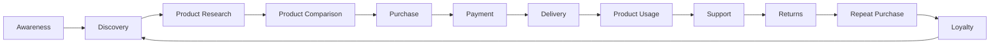
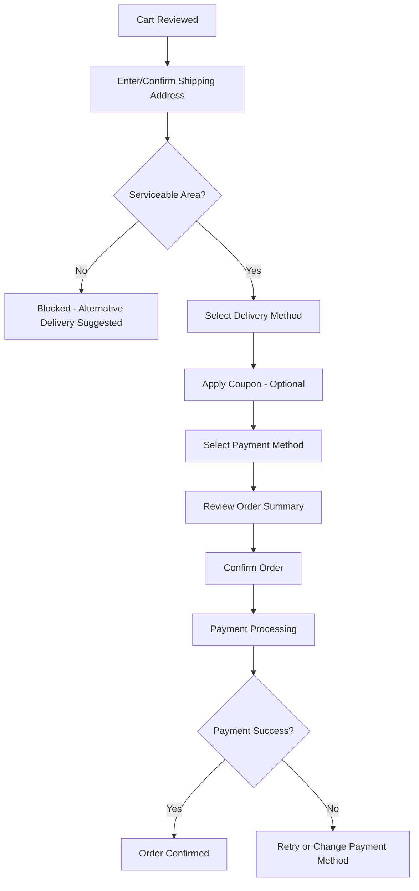
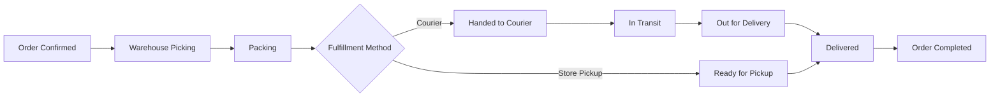
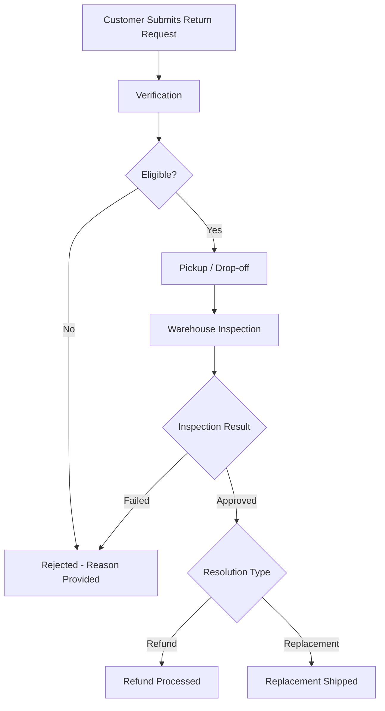
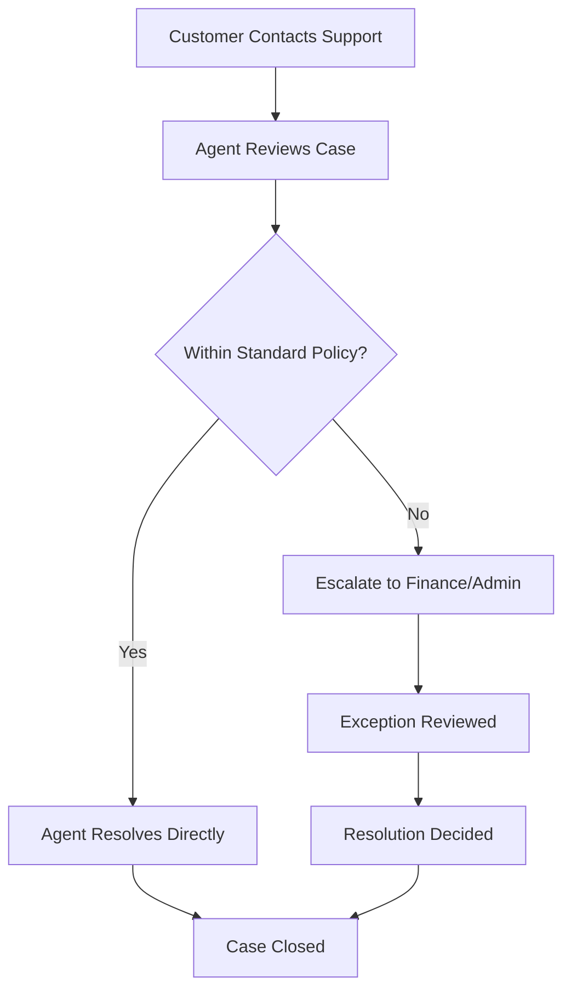

# User Journeys

## 1. Document Purpose

This document is the official User Journey documentation for **StackLeo Tech Store**. It maps every major end-to-end journey across the platform, helping Product, UX, Engineering, QA, Marketing, Customer Support, Operations, and Business teams understand how users interact with the product throughout their lifecycle.

This document builds on `user-personas.md` (who the users are), `user-roles.md` (what internal and partner users are authorized to do), `product-features.md` (what capabilities exist), and `product-modules.md` (how those capabilities are organized). Every journey in this document traces to specific features and modules defined in those documents.

This document describes user experience and business process flow only. It does not describe implementation approach, technology choices, API design, or database structure, all of which are addressed in dedicated technical documentation elsewhere in the repository.

## 2. Journey Mapping Methodology

Journeys are mapped using a combination of Human-Centered Design, Customer Experience (CX) practice, Service Design, and omnichannel thinking:

- **Human-Centered Design** — each journey begins from a real user goal (per `user-personas.md`), not a system capability.
- **Customer Experience (CX)** — journeys capture not only successful paths but also friction, pain points, and emotional stakes at each stage.
- **Service Design** — journeys include both the customer-visible front-stage experience and the business processes that support it behind the scenes (e.g., Order Tracking depends on Warehouse Staff and Courier activity).
- **Omnichannel Thinking** — journeys account for the customer's ability to move between web, physical store, and future mobile app/POS channels without losing continuity.

Every journey documented in Sections 4–6 follows the consistent template defined in Section 7, ensuring comparability across customer, business, and future journeys.

## 3. Customer Lifecycle Overview

*Diagram: Customer Lifecycle Journey.*

| Stage | Description |
|---|---|
| Awareness | The customer becomes aware of StackLeo Tech Store through marketing, word of mouth, or search. |
| Discovery | The customer begins browsing the catalog to understand what is available. |
| Product Research | The customer investigates specific products in depth. |
| Product Comparison | The customer compares candidate products against one another. |
| Purchase | The customer commits to a specific product and initiates the transaction. |
| Payment | The customer completes payment for the order. |
| Delivery | The order is fulfilled and reaches the customer via courier or store pickup. |
| Product Usage | The customer uses the product, forming their real-world experience of its value. |
| Support | The customer seeks assistance for a question, issue, return, or warranty need. |
| Returns | The customer, where applicable, returns or exchanges a product. |
| Repeat Purchase | The customer returns to make another purchase. |
| Loyalty | The customer becomes a recurring, trusting advocate of the brand. |

---

## 4. Primary User Journeys

### JR-001 — Guest Browsing

- **Actor:** Guest (unauthenticated visitor)
- **Goal:** Explore the catalog to evaluate whether StackLeo Tech Store has relevant products.
- **Preconditions:** None.
- **Trigger:** Visitor arrives at the site via search, advertisement, or direct navigation.
- **Main Flow:** 1) Visitor lands on homepage or category page. 2) Visitor browses categories or searches. 3) Visitor views product listings and details.
- **Alternative Flows:** Visitor arrives directly on a shared product link.
- **Exception Flows:** No matching products found for a search term.
- **Exit Conditions:** Visitor leaves the site, or proceeds to registration/login to purchase.
- **Success Criteria:** Visitor finds relevant products and forms a positive first impression.
- **Failure Scenarios:** Visitor cannot find relevant products and leaves without further engagement.
- **Pain Points:** Uncertainty about product authenticity without an account; limited personalization.
- **Opportunities:** Highlight trust signals (genuine product guarantees, reviews) prominently for unauthenticated visitors.
- **Related Features:** FEAT-008, FEAT-011, FEAT-012
- **Related Modules:** MOD-007, MOD-010
- **Related PRD:** `product-requirements.md`
- **KPIs:** Guest-to-registration conversion rate, bounce rate.

### JR-002 — User Registration

- **Actor:** Guest becoming Registered Customer
- **Goal:** Create an account to enable purchasing and order tracking.
- **Preconditions:** Visitor has decided to proceed with a purchase or save preferences.
- **Trigger:** Visitor selects "Register" or is prompted at checkout.
- **Main Flow:** 1) Visitor provides name, contact detail, and password. 2) System sends verification code. 3) Visitor verifies contact detail. 4) Account is activated.
- **Alternative Flows:** Registration initiated mid-checkout without leaving the purchase flow.
- **Exception Flows:** Verification code not received; contact detail already registered.
- **Exit Conditions:** Account successfully verified and activated.
- **Success Criteria:** Customer completes registration and verification without abandoning.
- **Failure Scenarios:** Customer abandons registration due to friction or verification failure.
- **Pain Points:** Verification delays; unclear password requirements.
- **Opportunities:** Streamline verification speed; allow registration to complete without interrupting an in-progress purchase.
- **Related Features:** FEAT-001
- **Related Modules:** MOD-001
- **Related PRD:** `product-requirements.md`
- **KPIs:** Registration completion rate, verification success rate.

### JR-003 — Login

- **Actor:** Registered Customer
- **Goal:** Access their account to shop or manage orders.
- **Preconditions:** Customer holds a verified account.
- **Trigger:** Customer selects "Login."
- **Main Flow:** 1) Customer enters credentials. 2) System verifies identity. 3) Session is established.
- **Alternative Flows:** "Forgot Password" flow initiated instead.
- **Exception Flows:** Repeated failed login attempts trigger temporary lockout, per `01_Business/business-rules.md` (BR-005).
- **Exit Conditions:** Customer is successfully authenticated.
- **Success Criteria:** Fast, successful authentication.
- **Failure Scenarios:** Customer is locked out or cannot recall credentials, abandoning the session.
- **Pain Points:** Forgotten passwords; lockout frustration.
- **Opportunities:** Simplify password recovery; consider future federated sign-in.
- **Related Features:** FEAT-001
- **Related Modules:** MOD-001
- **Related PRD:** `product-requirements.md`
- **KPIs:** Login success rate, password recovery completion rate.

### JR-004 — Product Search

- **Actor:** Guest or Registered Customer
- **Goal:** Quickly find a specific product or product type.
- **Preconditions:** None.
- **Trigger:** Customer enters a keyword into the search bar.
- **Main Flow:** 1) Customer enters keyword. 2) System returns ranked results. 3) Customer refines with filters/sorting.
- **Alternative Flows:** Customer searches by brand or category name directly.
- **Exception Flows:** No results found; customer redirected to related categories.
- **Exit Conditions:** Customer selects a product or abandons the search.
- **Success Criteria:** Relevant results returned quickly.
- **Failure Scenarios:** Irrelevant results lead to search abandonment.
- **Pain Points:** Poor relevance ranking; overwhelming unfiltered results.
- **Opportunities:** Introduce AI Search (FEAT-059) for improved relevance.
- **Related Features:** FEAT-011, FEAT-012, FEAT-013
- **Related Modules:** MOD-010
- **Related PRD:** `product-requirements.md`
- **KPIs:** Search-to-purchase rate, zero-result search rate.

### JR-005 — Product Discovery

- **Actor:** Guest or Registered Customer
- **Goal:** Explore the catalog broadly to find products of interest without a specific search term in mind.
- **Preconditions:** None.
- **Trigger:** Customer browses categories, brand pages, or homepage merchandising.
- **Main Flow:** 1) Customer browses category or brand pages. 2) Customer views featured or recommended products. 3) Customer selects products of interest.
- **Alternative Flows:** Customer follows a "Recently Viewed" or "Recommended" pathway.
- **Exception Flows:** Category appears empty or under-stocked.
- **Exit Conditions:** Customer selects a product to research further.
- **Success Criteria:** Customer discovers relevant products aligned with their interests.
- **Failure Scenarios:** Customer finds browsing unfocused and disengages.
- **Pain Points:** Poorly organized categories; lack of personalization.
- **Opportunities:** Introduce Recommendations (FEAT-014) to guide discovery.
- **Related Features:** FEAT-008, FEAT-009, FEAT-010, FEAT-014
- **Related Modules:** MOD-007, MOD-008, MOD-009, MOD-011
- **Related PRD:** `product-requirements.md`
- **KPIs:** Category browse depth, discovery-to-cart rate.

### JR-006 — Product Comparison

- **Actor:** Registered Customer (typically research-driven personas, e.g., Gamer, Software Engineer)
- **Goal:** Compare candidate products before deciding.
- **Preconditions:** Customer has identified two or more candidate products.
- **Trigger:** Customer selects "Compare" on multiple products.
- **Main Flow:** 1) Customer adds products to comparison. 2) System displays side-by-side specifications. 3) Customer selects a product to purchase.
- **Alternative Flows:** Customer compares products across multiple browsing sessions.
- **Exception Flows:** Products selected for comparison are not directly comparable (different categories).
- **Exit Conditions:** Customer selects a product or exits comparison without deciding.
- **Success Criteria:** Customer makes a confident, informed decision.
- **Failure Scenarios:** Incomplete specification data undermines comparison confidence.
- **Pain Points:** Missing or inconsistent specification data across products.
- **Opportunities:** AI-assisted comparison highlights for key decision factors.
- **Related Features:** FEAT-006
- **Related Modules:** MOD-007
- **Related PRD:** `product-requirements.md`
- **KPIs:** Compare-to-purchase rate.

### JR-007 — Wishlist

- **Actor:** Registered Customer
- **Goal:** Save products of interest for future consideration or purchase.
- **Preconditions:** Customer is logged in.
- **Trigger:** Customer selects "Add to Wishlist" on a product.
- **Main Flow:** 1) Customer adds product to wishlist. 2) Customer revisits wishlist later. 3) Customer moves item to cart when ready to purchase.
- **Alternative Flows:** Customer removes an item from the wishlist.
- **Exception Flows:** Wishlisted item becomes out of stock or discontinued.
- **Exit Conditions:** Item is purchased or remains saved indefinitely.
- **Success Criteria:** Customer returns to convert a wishlist item into a purchase.
- **Failure Scenarios:** Wishlist items go stale without any re-engagement.
- **Pain Points:** No proactive notification when a wishlist item goes on sale or back in stock.
- **Opportunities:** Wishlist-to-cart automation, price/stock alerts.
- **Related Features:** FEAT-005
- **Related Modules:** MOD-005
- **Related PRD:** `product-requirements.md`
- **KPIs:** Wishlist conversion rate.

### JR-008 — Add to Cart

- **Actor:** Registered Customer
- **Goal:** Collect intended purchase items before checkout.
- **Preconditions:** Customer has selected a product and quantity.
- **Trigger:** Customer selects "Add to Cart."
- **Main Flow:** 1) Customer selects quantity/variant. 2) System validates stock. 3) Item is added to cart.
- **Alternative Flows:** Customer adjusts quantity directly within the cart.
- **Exception Flows:** Requested quantity exceeds available stock, per `01_Business/business-rules.md` (BR-040).
- **Exit Conditions:** Customer proceeds to checkout or continues shopping.
- **Success Criteria:** Cart accurately reflects intended purchase and available stock.
- **Failure Scenarios:** Stock conflict discovered later at checkout, causing frustration.
- **Pain Points:** Cart items becoming unavailable before checkout completion.
- **Opportunities:** Persistent, cross-device cart continuity.
- **Related Features:** FEAT-015
- **Related Modules:** MOD-012
- **Related PRD:** `product-requirements.md`
- **KPIs:** Cart abandonment rate.

### JR-009 — Checkout

- **Actor:** Registered Customer
- **Goal:** Confirm billing, shipping, and payment details to complete a purchase.
- **Preconditions:** Cart contains at least one valid item.
- **Trigger:** Customer selects "Checkout."
- **Main Flow:** 1) Customer confirms/enters shipping address. 2) Customer selects delivery method. 3) Customer selects payment method. 4) Customer reviews and confirms order.
- **Alternative Flows:** Customer applies a coupon before confirming.
- **Exception Flows:** Address outside serviceable delivery area, per `01_Business/shipping-policy.md` (Section 4).
- **Exit Conditions:** Order is confirmed and passed to payment, or customer abandons checkout.
- **Success Criteria:** Customer completes checkout with accurate, validated information.
- **Failure Scenarios:** Customer abandons checkout due to friction, unexpected charges, or unclear delivery estimates.
- **Pain Points:** Complex forms; unclear delivery charge until late in the flow.
- **Opportunities:** One-click checkout for returning customers; earlier delivery charge visibility.
- **Related Features:** FEAT-016
- **Related Modules:** MOD-013
- **Related PRD:** `product-requirements.md`
- **KPIs:** Checkout completion rate, checkout drop-off rate.

### JR-010 — Payment

- **Actor:** Registered Customer
- **Goal:** Successfully complete payment for a confirmed order.
- **Preconditions:** Checkout details confirmed.
- **Trigger:** Customer selects "Place Order" / "Pay Now."
- **Main Flow:** 1) Customer selects payment method (COD or digital). 2) System processes/verifies payment. 3) Payment confirmation is issued.
- **Alternative Flows:** Customer selects Cash on Delivery, bypassing online payment processing.
- **Exception Flows:** Online payment fails or times out, per `01_Business/business-rules.md` (BR-059).
- **Exit Conditions:** Payment is confirmed, or the order is not placed.
- **Success Criteria:** Payment completes without error, and the order proceeds to fulfillment.
- **Failure Scenarios:** Payment failure without clear retry guidance, leading to abandonment.
- **Pain Points:** Unclear failure messaging; no visible retry path.
- **Opportunities:** Clearer failure recovery flow; future EMI and wallet options.
- **Related Features:** FEAT-027, FEAT-028, FEAT-029, FEAT-030, FEAT-031
- **Related Modules:** MOD-014
- **Related PRD:** `product-requirements.md`
- **KPIs:** Payment success rate, failed payment rate.

### JR-011 — Order Placement

- **Actor:** Registered Customer
- **Goal:** Receive confirmation that the order has been successfully placed.
- **Preconditions:** Payment confirmed or COD selected.
- **Trigger:** Checkout and payment steps complete successfully.
- **Main Flow:** 1) Order record is created. 2) Confirmation is displayed. 3) Confirmation notification is sent.
- **Alternative Flows:** None.
- **Exception Flows:** Notification delivery failure.
- **Exit Conditions:** Order enters fulfillment.
- **Success Criteria:** Customer receives clear, prompt confirmation.
- **Failure Scenarios:** Customer does not receive confirmation and is uncertain whether the order succeeded.
- **Pain Points:** Delayed or missing confirmation notifications.
- **Opportunities:** Real-time in-app confirmation in addition to email/SMS.
- **Related Features:** FEAT-020
- **Related Modules:** MOD-017
- **Related PRD:** `product-requirements.md`
- **KPIs:** Order Success Rate.

### JR-012 — Order Tracking

- **Actor:** Registered Customer
- **Goal:** Monitor the progress of a placed order.
- **Preconditions:** Order has been confirmed.
- **Trigger:** Customer visits order history or tracking link.
- **Main Flow:** 1) Customer opens order details. 2) System displays current delivery status lifecycle stage, per `01_Business/shipping-policy.md` (Section 13).
- **Alternative Flows:** Customer tracks via a link from a notification.
- **Exception Flows:** Tracking status has not updated for an extended period.
- **Exit Conditions:** Order reaches Delivered/Completed status.
- **Success Criteria:** Customer has clear, accurate visibility at all times.
- **Failure Scenarios:** Stale tracking data causes customer anxiety and support inquiries.
- **Pain Points:** Infrequent status updates; unclear delivery ETA.
- **Opportunities:** Predictive delivery ETA, live tracking map (future).
- **Related Features:** FEAT-021
- **Related Modules:** MOD-019
- **Related PRD:** `product-requirements.md`
- **KPIs:** Tracking engagement rate, support inquiries per order.

### JR-013 — Delivery

- **Actor:** Registered Customer
- **Goal:** Receive the ordered product via courier or collect it in-store.
- **Preconditions:** Order has shipped or is ready for pickup.
- **Trigger:** Courier attempts delivery, or customer visits store for pickup.
- **Main Flow:** 1) Courier delivers to address / customer collects at store. 2) Customer confirms receipt. 3) Order status updates to Delivered.
- **Alternative Flows:** Customer requests delivery to an alternate address prior to dispatch.
- **Exception Flows:** Failed delivery attempt, per `01_Business/shipping-policy.md` (Section 14).
- **Exit Conditions:** Product successfully reaches the customer.
- **Success Criteria:** On-time, complete, undamaged delivery.
- **Failure Scenarios:** Repeated failed delivery attempts leading to return to warehouse.
- **Pain Points:** Missed delivery windows; unclear re-delivery process.
- **Opportunities:** Scheduled delivery windows, proactive delivery-attempt notifications.
- **Related Features:** FEAT-035, FEAT-037
- **Related Modules:** MOD-019, MOD-020
- **Related PRD:** `product-requirements.md`
- **KPIs:** On-Time Delivery Rate, Failed Delivery Rate.

### JR-014 — Invoice Download

- **Actor:** Registered Customer
- **Goal:** Retrieve a compliant invoice for a completed order.
- **Preconditions:** Order has been confirmed.
- **Trigger:** Customer selects "Download Invoice" from order history.
- **Main Flow:** 1) Customer opens order details. 2) Customer requests invoice. 3) Invoice is generated/retrieved.
- **Alternative Flows:** Invoice is automatically attached to the order confirmation email.
- **Exception Flows:** Invoice generation delay for a recently placed order.
- **Exit Conditions:** Customer obtains a usable invoice document.
- **Success Criteria:** Invoice is accurate, compliant, and easily accessible.
- **Failure Scenarios:** Invoice details are inaccurate or inaccessible when needed (e.g., for warranty claims).
- **Pain Points:** Invoice not easily locatable within order history.
- **Opportunities:** Persistent digital invoice archive.
- **Related Features:** FEAT-022
- **Related Modules:** MOD-018
- **Related PRD:** `product-requirements.md`
- **KPIs:** Invoice compliance rate, invoice retrieval rate.

### JR-015 — Return Request

- **Actor:** Registered Customer
- **Goal:** Request a return for an eligible product.
- **Preconditions:** Order is within the applicable return window, per `01_Business/return-policy.md` (Section 6).
- **Trigger:** Customer selects "Request Return" from order history.
- **Main Flow:** 1) Customer selects return reason and item(s). 2) Customer submits supporting evidence if required. 3) Request enters verification.
- **Alternative Flows:** Customer requests an exchange instead of a refund.
- **Exception Flows:** Return window has expired, or item is non-returnable, per `01_Business/return-policy.md` (Section 4).
- **Exit Conditions:** Return request is approved or rejected.
- **Success Criteria:** Customer receives a clear, timely decision.
- **Failure Scenarios:** Ambiguous rejection reasoning frustrates the customer.
- **Pain Points:** Unclear eligibility rules; cumbersome evidence submission.
- **Opportunities:** Self-service eligibility checker before submission.
- **Related Features:** FEAT-023, FEAT-025
- **Related Modules:** MOD-022
- **Related PRD:** `product-requirements.md`
- **KPIs:** Return Rate, return request approval rate.

### JR-016 — Refund Request

- **Actor:** Registered Customer
- **Goal:** Receive financial resolution following an approved return or cancellation.
- **Preconditions:** Return or cancellation has been approved.
- **Trigger:** Return/cancellation approval triggers refund eligibility.
- **Main Flow:** 1) Refund is calculated. 2) Refund is processed to original or alternate method. 3) Customer is notified of completion.
- **Alternative Flows:** Partial refund calculated for partial order return.
- **Exception Flows:** Original payment method cannot be credited, requiring bank transfer or mobile banking.
- **Exit Conditions:** Refund is completed and confirmed.
- **Success Criteria:** Refund is accurate and timely.
- **Failure Scenarios:** Refund delay or amount discrepancy erodes trust.
- **Pain Points:** Uncertainty about refund timing; unclear communication during processing.
- **Opportunities:** Instant refund options, real-time refund status tracking.
- **Related Features:** FEAT-024, FEAT-031
- **Related Modules:** MOD-023
- **Related PRD:** `product-requirements.md`
- **KPIs:** Refund Processing Time.

### JR-017 — Warranty Claim

- **Actor:** Registered Customer
- **Goal:** Resolve a product defect through repair or replacement under warranty.
- **Preconditions:** Product is within its applicable warranty period, per `01_Business/warranty-policy.md` (Section 7).
- **Trigger:** Customer submits a warranty claim from order history.
- **Main Flow:** 1) Customer describes issue and submits required documents. 2) Claim undergoes verification and inspection. 3) Resolution (repair/replacement) is determined and executed.
- **Alternative Flows:** Claim is identified as Dead on Arrival and expedited, per `01_Business/warranty-policy.md` (Section 14).
- **Exception Flows:** Claim is rejected due to exclusion (e.g., physical damage), per `01_Business/warranty-policy.md` (Section 6).
- **Exit Conditions:** Claim reaches Completed status.
- **Success Criteria:** Timely, fair resolution consistent with warranty terms.
- **Failure Scenarios:** Slow resolution or unclear rejection reasoning damages trust.
- **Pain Points:** Long repair turnaround; unclear claim status visibility.
- **Opportunities:** QR code warranty verification, self-service claim tracking.
- **Related Features:** FEAT-026
- **Related Modules:** MOD-024
- **Related PRD:** `product-requirements.md`
- **KPIs:** Claim Approval Rate, Repair Time.

### JR-018 — Review Submission

- **Actor:** Registered Customer
- **Goal:** Share feedback on a purchased product.
- **Preconditions:** Customer has a completed order for the product.
- **Trigger:** Customer selects "Write a Review" from order history or product page.
- **Main Flow:** 1) Customer submits rating and written feedback. 2) Optional photo/video is attached. 3) Review is moderated and published.
- **Alternative Flows:** Customer edits a previously submitted review.
- **Exception Flows:** Review is rejected during moderation for policy violation, per `01_Business/business-rules.md` (BR-091).
- **Exit Conditions:** Review is published or rejected.
- **Success Criteria:** Genuine, helpful review is published promptly.
- **Failure Scenarios:** Moderation delay discourages future review submissions.
- **Pain Points:** Unclear moderation timelines; no incentive to write detailed reviews.
- **Opportunities:** Review helpfulness voting, lightweight review prompts post-delivery.
- **Related Features:** FEAT-038, FEAT-039
- **Related Modules:** MOD-025
- **Related PRD:** `product-requirements.md`
- **KPIs:** Review submission rate.

### JR-019 — Customer Support (Customer-Initiated)

- **Actor:** Registered Customer (or Guest, for general inquiries)
- **Goal:** Get help resolving a question or issue.
- **Preconditions:** None.
- **Trigger:** Customer contacts support via phone, email, live chat, or in-store desk, per `01_Business/faq.md` (Section 37).
- **Main Flow:** 1) Customer describes their issue. 2) Support agent investigates and responds. 3) Issue is resolved or escalated.
- **Alternative Flows:** Customer self-serves via FAQ before contacting support.
- **Exception Flows:** Issue requires escalation beyond standard support, per `01_Business/faq.md` (Section 36).
- **Exit Conditions:** Issue is resolved, or customer disengages unresolved.
- **Success Criteria:** Fast, accurate, empathetic resolution.
- **Failure Scenarios:** Long wait times or repeated hand-offs frustrate the customer.
- **Pain Points:** Long response times; having to repeat information across channels.
- **Opportunities:** Future AI chatbot for common questions, per `01_Business/faq.md` (Section 40).
- **Related Features:** FEAT-040
- **Related Modules:** MOD-026, MOD-005
- **Related PRD:** `product-requirements.md`
- **KPIs:** Support resolution time, Customer Satisfaction.

### JR-020 — Profile Management

- **Actor:** Registered Customer
- **Goal:** Keep account and address information accurate and current.
- **Preconditions:** Customer is logged in.
- **Trigger:** Customer navigates to account settings.
- **Main Flow:** 1) Customer views current profile/address data. 2) Customer edits and saves changes. 3) System confirms update.
- **Alternative Flows:** Customer updates registered contact detail, triggering re-verification, per `01_Business/business-rules.md` (BR-012).
- **Exception Flows:** Update fails validation (e.g., incomplete address).
- **Exit Conditions:** Profile is successfully updated.
- **Success Criteria:** Changes save accurately and take effect immediately.
- **Failure Scenarios:** Update silently fails, leading to outdated delivery information.
- **Pain Points:** Unclear confirmation of successful updates.
- **Opportunities:** Address auto-suggestion, profile completeness prompts.
- **Related Features:** FEAT-003, FEAT-004
- **Related Modules:** MOD-005
- **Related PRD:** `product-requirements.md`
- **KPIs:** Profile completion rate.

### JR-021 — Notification Management

- **Actor:** Registered Customer
- **Goal:** Control what updates they receive and through which channel.
- **Preconditions:** Customer is logged in.
- **Trigger:** Customer visits notification preferences.
- **Main Flow:** 1) Customer views current notification settings. 2) Customer adjusts channel preferences. 3) System applies updated preferences.
- **Alternative Flows:** Customer opts out of marketing notifications while retaining transactional ones.
- **Exception Flows:** Customer misses a critical order update due to overly restrictive preferences.
- **Exit Conditions:** Preferences are saved and applied.
- **Success Criteria:** Customer receives exactly the communication they expect.
- **Failure Scenarios:** Over-notification leads to opt-out of all channels, including critical updates.
- **Pain Points:** No granular control between transactional and marketing messages.
- **Opportunities:** Push notifications and unified in-app notification center (future, mobile app).
- **Related Features:** FEAT-040, FEAT-041, FEAT-042
- **Related Modules:** MOD-026
- **Related PRD:** `product-requirements.md`
- **KPIs:** Notification delivery rate, opt-out rate.

### JR-022 — Repeat Purchase

- **Actor:** Registered Customer
- **Goal:** Return to purchase again based on a positive prior experience.
- **Preconditions:** Customer has completed at least one prior order.
- **Trigger:** New need arises, or customer receives a relevant promotion/reminder.
- **Main Flow:** 1) Customer returns to the platform. 2) Customer repeats discovery, cart, and checkout journeys. 3) Order is placed.
- **Alternative Flows:** Customer reorders directly from past order history.
- **Exception Flows:** Previously purchased product/variant is no longer available.
- **Exit Conditions:** New order is successfully placed.
- **Success Criteria:** Low-friction repeat purchase, reinforcing loyalty.
- **Failure Scenarios:** Customer does not return due to an unresolved past issue.
- **Pain Points:** No easy "buy again" shortcut; lack of loyalty recognition.
- **Opportunities:** One-click reorder, future loyalty points (FEAT-043) and membership benefits.
- **Related Features:** FEAT-020
- **Related Modules:** MOD-017, MOD-005
- **Related PRD:** `product-requirements.md`
- **KPIs:** Repeat Purchase Rate, Customer Lifetime Value.

---

## 5. Business User Journeys

### JR-023 — Corporate Buyer Purchasing Journey (Future)

- **Actor:** Corporate Customer / Corporate Procurement Officer (see `user-personas.md` PERSONA-003, PERSONA-013–017)
- **Goal:** Complete a bulk, organizationally approved purchase under negotiated terms.
- **Preconditions:** Corporate account is established and approved.
- **Trigger:** Organizational procurement need arises.
- **Main Flow:** 1) Buyer submits bulk order request. 2) Order is validated against negotiated pricing. 3) Formal invoice is issued. 4) Order is fulfilled per corporate delivery terms.
- **Alternative Flows:** Buyer requests a formal quotation before committing.
- **Exception Flows:** Requested quantity exceeds available stock or negotiated terms.
- **Exit Conditions:** Order is fulfilled and invoiced.
- **Success Criteria:** Reliable, compliant, well-documented bulk fulfillment.
- **Failure Scenarios:** Delays or documentation gaps jeopardize the organizational relationship.
- **Pain Points:** Lack of a dedicated corporate self-service portal at current stage.
- **Opportunities:** Full corporate portal with quotation and account management.
- **Related Features:** FEAT-055
- **Related Modules:** MOD-030
- **Related PRD:** `product-requirements.md`
- **KPIs:** Corporate revenue contribution.
- **Status:** Not yet active; full journey to be validated ahead of Phase 4.

### JR-024 — Warehouse Staff Fulfillment Journey

- **Actor:** Warehouse Staff (`user-roles.md` ROLE-010)
- **Goal:** Accurately pick, pack, and dispatch confirmed orders.
- **Preconditions:** Order has entered Processing status.
- **Trigger:** Order is assigned to the warehouse queue.
- **Main Flow:** 1) Staff picks items per order manifest. 2) Staff verifies stock and condition. 3) Staff packs and hands off to courier or store pickup holding.
- **Alternative Flows:** Item found damaged or missing during picking, triggering a stock discrepancy report.
- **Exception Flows:** Insufficient stock discovered despite system availability.
- **Exit Conditions:** Order reaches Packed/Handed to Courier status.
- **Success Criteria:** Accurate, timely fulfillment with no picking errors.
- **Failure Scenarios:** Picking errors lead to wrong-item or missing-item customer complaints.
- **Pain Points:** Manual discrepancy reporting overhead.
- **Opportunities:** Multi-warehouse routing optimization (future).
- **Related Features:** (supports FEAT-035, FEAT-037)
- **Related Modules:** MOD-020, MOD-021
- **Related PRD:** `product-requirements.md`
- **KPIs:** Fulfillment processing time, picking accuracy.

### JR-025 — Customer Support Agent Resolution Journey

- **Actor:** Customer Support (`user-roles.md` ROLE-011)
- **Goal:** Resolve customer inquiries, returns, and warranty cases accurately and empathetically.
- **Preconditions:** Customer has raised an inquiry or request.
- **Trigger:** Case is received via phone, email, chat, or in-store desk.
- **Main Flow:** 1) Agent reviews customer and order data. 2) Agent investigates and applies policy (return/warranty/general). 3) Agent resolves or escalates the case.
- **Alternative Flows:** Case requires Finance Officer approval (refund) or Admin approval (exception).
- **Exception Flows:** Case falls outside standard policy and requires escalation, per `user-roles.md` (Section 10).
- **Exit Conditions:** Case is closed with a resolution recorded.
- **Success Criteria:** Fast, policy-consistent, satisfying resolution.
- **Failure Scenarios:** Inconsistent policy application erodes customer trust.
- **Pain Points:** Fragmented visibility across order, return, and warranty systems.
- **Opportunities:** Unified support case timeline (per `product-features.md` FEAT-049 aspirations).
- **Related Features:** FEAT-023, FEAT-024, FEAT-026, FEAT-040
- **Related Modules:** MOD-022, MOD-023, MOD-024, MOD-026
- **Related PRD:** `product-requirements.md`
- **KPIs:** Support resolution time, Customer Satisfaction.

### JR-026 — Product Manager Catalog Journey

- **Actor:** Product Manager (`user-roles.md` ROLE-008)
- **Goal:** Maintain an accurate, well-organized, competitive catalog.
- **Preconditions:** New product or catalog change identified.
- **Trigger:** New product sourcing, pricing update, or catalog restructuring need.
- **Main Flow:** 1) Product Manager defines/updates product listing. 2) Listing is submitted for content and publish approval. 3) Listing goes live.
- **Alternative Flows:** Bulk catalog update via import tooling (future).
- **Exception Flows:** Listing rejected during approval for incomplete information.
- **Exit Conditions:** Listing is published or returned for revision.
- **Success Criteria:** Accurate, complete, competitively positioned listings.
- **Failure Scenarios:** Incomplete or inaccurate listings damage customer trust.
- **Pain Points:** Manual catalog maintenance at scale.
- **Opportunities:** Bulk import tools, AI-assisted content generation (future).
- **Related Features:** FEAT-008, FEAT-046
- **Related Modules:** MOD-007, MOD-029
- **Related PRD:** `product-requirements.md`
- **KPIs:** Catalog completeness, time-to-publish.

### JR-027 — Admin Platform Oversight Journey

- **Actor:** Admin (`user-roles.md` ROLE-006)
- **Goal:** Maintain smooth day-to-day platform operations across departments.
- **Preconditions:** None; ongoing responsibility.
- **Trigger:** Routine oversight, or an escalated exception requiring approval.
- **Main Flow:** 1) Admin reviews dashboard for pending approvals/exceptions. 2) Admin approves or rejects (pricing, publish, refund, return exceptions). 3) Admin monitors overall platform health.
- **Alternative Flows:** Admin delegates a specific approval type during high volume periods.
- **Exception Flows:** Critical incident requires Super Admin escalation.
- **Exit Conditions:** Pending items are resolved.
- **Success Criteria:** Timely approvals with no operational bottlenecks.
- **Failure Scenarios:** Approval backlog delays fulfillment, publishing, or refunds.
- **Pain Points:** High volume of routine approvals without prioritization tooling.
- **Opportunities:** Customizable dashboard widgets, automated low-risk approval rules.
- **Related Features:** FEAT-045–FEAT-050
- **Related Modules:** MOD-029
- **Related PRD:** `product-requirements.md`
- **KPIs:** Admin active usage rate, approval turnaround time.

### JR-028 — Finance Officer Reconciliation Journey

- **Actor:** Finance Officer (`user-roles.md` ROLE-012)
- **Goal:** Ensure accurate payment reconciliation and timely refund processing.
- **Preconditions:** Orders, refunds, and payment transactions exist to reconcile.
- **Trigger:** Scheduled reconciliation cycle, or a submitted refund request.
- **Main Flow:** 1) Officer reviews refund request from Customer Support. 2) Officer approves and processes refund. 3) Officer reconciles transactions against payment gateway records.
- **Alternative Flows:** Refund routed to bank transfer for a COD order.
- **Exception Flows:** Reconciliation discrepancy identified between order and gateway records.
- **Exit Conditions:** Refunds are processed and books are reconciled.
- **Success Criteria:** Accurate, timely refunds and clean reconciliation.
- **Failure Scenarios:** Reconciliation errors lead to financial discrepancies or delayed refunds.
- **Pain Points:** Manual cross-referencing between order and payment records.
- **Opportunities:** Automated reconciliation reporting.
- **Related Features:** FEAT-024, FEAT-031
- **Related Modules:** MOD-023, MOD-014, MOD-028
- **Related PRD:** `product-requirements.md`
- **KPIs:** Refund Processing Time, reconciliation accuracy.

### JR-029 — Marketing Manager Campaign Journey

- **Actor:** Marketing Manager (`user-roles.md` ROLE-013)
- **Goal:** Plan and execute promotions that drive engagement without eroding margin.
- **Preconditions:** Business objective or seasonal opportunity identified.
- **Trigger:** Campaign planning cycle or market opportunity (e.g., festival season).
- **Main Flow:** 1) Manager defines coupon/promotion parameters. 2) Manager submits for Admin approval. 3) Campaign is activated and monitored.
- **Alternative Flows:** Flash sale requires dedicated stock allocation, per `01_Business/business-rules.md` (BR-096).
- **Exception Flows:** Campaign underperforms or over-discounts, triggering early review.
- **Exit Conditions:** Campaign concludes and results are reviewed.
- **Success Criteria:** Campaign meets engagement and revenue goals within margin tolerance.
- **Failure Scenarios:** Over-discounting erodes margin without proportional revenue gain.
- **Pain Points:** Manual campaign performance tracking.
- **Opportunities:** AI-optimized promotion timing (future).
- **Related Features:** FEAT-017, FEAT-018
- **Related Modules:** MOD-015, MOD-016, MOD-027
- **Related PRD:** `product-requirements.md`
- **KPIs:** Campaign-driven revenue, promotion ROI.

---

## 6. Future Journeys

### JR-030 — Marketplace Seller Onboarding & Selling Journey (Future)

- **Actor:** Marketplace Seller (`user-personas.md` PERSONA-018)
- **Goal:** Onboard as a verified seller and successfully sell products through StackLeo's marketplace.
- **Preconditions:** Marketplace capability is active.
- **Trigger:** Seller submits application to join the marketplace.
- **Main Flow:** 1) Seller submits identity/business verification. 2) Seller lists products for approval. 3) Seller fulfills orders and receives settlement.
- **Alternative Flows:** Seller escalates a customer dispute for StackLeo mediation.
- **Exception Flows:** Listing rejected for authenticity or content concerns.
- **Exit Conditions:** Seller is actively transacting on the marketplace.
- **Success Criteria:** Smooth onboarding and reliable, transparent settlement.
- **Failure Scenarios:** Onboarding friction or payout delays discourage seller participation.
- **Pain Points (Anticipated):** Complex onboarding; unclear commission and settlement timing.
- **Opportunities:** Transparent seller dashboard and analytics.
- **Related Features:** FEAT-056, FEAT-057
- **Related Modules:** MOD-031
- **Related PRD:** `product-requirements.md`
- **KPIs:** Verified seller count, Marketplace GMV share.
- **Status:** Not yet active; targeted for Phase 5 per `product-roadmap.md`.

### JR-031 — Affiliate Partner Referral Journey (Future)

- **Actor:** Affiliate Partner (`user-personas.md` PERSONA-020)
- **Goal:** Earn transparent, reliable commission by referring customers.
- **Preconditions:** Affiliate program is active.
- **Trigger:** Partner joins the affiliate program and shares referral links.
- **Main Flow:** 1) Partner shares tracked referral link/content. 2) Referred customer completes a qualifying purchase. 3) Commission is calculated and paid out.
- **Alternative Flows:** Partner reviews referral performance dashboard.
- **Exception Flows:** Referral tracking fails to attribute a valid purchase.
- **Exit Conditions:** Commission is paid.
- **Success Criteria:** Accurate tracking and timely payout.
- **Failure Scenarios:** Attribution errors erode partner trust.
- **Pain Points (Anticipated):** Opaque tracking; delayed payout.
- **Opportunities:** Real-time referral dashboard.
- **Related Features:** FEAT-044
- **Related Modules:** Extends MOD-005, MOD-016 (per `product-modules.md` Section 11)
- **Related PRD:** `product-requirements.md`
- **KPIs:** Referral conversion rate.
- **Status:** Not yet active; targeted for Phase 3 per `product-roadmap.md`.

### JR-032 — AI Shopping Assistant-Guided Journey (Future)

- **Actor:** Registered Customer / AI-Assisted Shopper (`user-personas.md` Section 12)
- **Goal:** Receive intelligent, conversational assistance to find and purchase the right product.
- **Preconditions:** AI Services module is active.
- **Trigger:** Customer engages the AI chatbot or accepts an AI recommendation.
- **Main Flow:** 1) Customer describes their need conversationally. 2) AI assistant surfaces relevant products. 3) Customer proceeds to standard cart/checkout journeys.
- **Alternative Flows:** AI assistant escalates to human support for unresolved questions, per `01_Business/business-rules.md` (BR-137).
- **Exception Flows:** AI assistant provides an irrelevant or low-confidence recommendation.
- **Exit Conditions:** Customer completes a purchase or disengages.
- **Success Criteria:** Fast, relevant, trustworthy assistance that improves conversion.
- **Failure Scenarios:** Irrelevant AI responses undermine customer trust in the assistant.
- **Pain Points (Anticipated):** Perceived lack of transparency in AI-driven suggestions.
- **Opportunities:** Clear disclosure of AI involvement; easy human hand-off.
- **Related Features:** FEAT-059, FEAT-060, FEAT-061
- **Related Modules:** MOD-032
- **Related PRD:** `product-requirements.md`
- **KPIs:** Recommendation-driven revenue, chatbot resolution rate.
- **Status:** Not yet active; targeted for Phase 6 per `product-roadmap.md`.

### JR-033 — International Customer Purchasing Journey (Future)

- **Actor:** International Customer (`user-personas.md` PERSONA-019)
- **Goal:** Purchase from StackLeo Tech Store from outside Bangladesh with a locally relevant experience.
- **Preconditions:** International shipping and multi-currency capability are active.
- **Trigger:** International customer discovers StackLeo Tech Store and initiates a purchase.
- **Main Flow:** 1) Customer views pricing in local currency. 2) Customer completes checkout with region-relevant payment method. 3) Order is fulfilled via international shipping.
- **Alternative Flows:** Customer engages localized language support.
- **Exception Flows:** Destination country requires customs documentation or restricted product handling.
- **Exit Conditions:** Order is delivered internationally.
- **Success Criteria:** Transparent pricing and reliable cross-border delivery.
- **Failure Scenarios:** Currency confusion or unreliable international delivery undermines trust in a new market.
- **Pain Points (Anticipated):** Currency and language barriers; uncertain delivery timelines.
- **Opportunities:** Full localization and dedicated international support.
- **Related Features:** (extends FEAT-035, Payment features for multi-currency)
- **Related Modules:** MOD-019, MOD-014 (extended)
- **Related PRD:** `product-requirements.md`
- **KPIs:** Revenue Growth from new markets.
- **Status:** Not yet active; targeted for Phase 7 per `product-roadmap.md`.

### JR-034 — POS Customer In-Store Journey (Future)

- **Actor:** Registered Customer or Guest, in physical store
- **Goal:** Complete a purchase in-store using an integrated point-of-sale system.
- **Preconditions:** POS capability is active at the store location.
- **Trigger:** Customer selects products in-store and proceeds to the POS counter.
- **Main Flow:** 1) Staff scans/selects items at POS. 2) Customer completes payment in-store. 3) Order and inventory records update in real time, consistent with the online platform.
- **Alternative Flows:** Customer links their online account for unified order history.
- **Exception Flows:** POS system cannot confirm real-time stock synchronization with online inventory.
- **Exit Conditions:** Purchase is completed and recorded.
- **Success Criteria:** Seamless in-store experience consistent with online pricing and catalog.
- **Failure Scenarios:** Inventory desynchronization between POS and online store causes overselling.
- **Pain Points (Anticipated):** Disconnected in-store and online purchase history.
- **Opportunities:** Unified omnichannel order history and loyalty tracking.
- **Related Features:** FEAT-037 (extended)
- **Related Modules:** MOD-017, MOD-021 (extended)
- **Related PRD:** `product-requirements.md`
- **KPIs:** Store pickup/POS adoption rate.
- **Status:** Not yet active; targeted alongside Phase 4–5 per `product-roadmap.md`.

---

## 6.1 Key Journey Flow Diagrams

The following diagrams illustrate four of the platform's most business-critical journeys in greater flow detail, complementing the narrative journey entries in Sections 4 and 5.

*Diagram: Checkout Journey (JR-009, JR-010).*

*Diagram: Order Fulfillment Journey (JR-011–JR-013, JR-024).*

*Diagram: Return & Refund Journey (JR-015, JR-016).*

*Diagram: Customer Support Journey (JR-019, JR-025).*

## 7. Journey Template

Every journey documented in Sections 4–6 follows this consistent template:

| Field | Description |
|---|---|
| Journey ID | Unique identifier in the format `JR-XXX`. |
| Journey Name | Descriptive name of the journey. |
| Actor | The user or role undertaking the journey. |
| Goal | What the actor is trying to accomplish. |
| Preconditions | What must be true before the journey can begin. |
| Trigger | The event that initiates the journey. |
| Main Flow | The primary, expected sequence of steps. |
| Alternative Flows | Valid variations on the main flow. |
| Exception Flows | Error or edge-case paths. |
| Exit Conditions | How the journey concludes, successfully or not. |
| Success Criteria | What defines a successful outcome. |
| Failure Scenarios | What defines an unsuccessful outcome. |
| Pain Points | Known or anticipated sources of friction. |
| Opportunities | Ideas for improving the journey. |
| Related Features | Related entries in `product-features.md`. |
| Related Modules | Related entries in `product-modules.md`. |
| Related PRDs | Related requirements documentation. |
| KPIs | Metrics used to evaluate the journey's health. |

---

## 8. Touchpoint Analysis

| Touchpoint | Relevant Journeys | Notes |
|---|---|---|
| Website | JR-001–JR-022, JR-026–JR-029 | Primary channel for all current customer and most internal journeys. |
| Mobile App (Future) | JR-021, JR-032 | Planned to extend web journeys with push notifications and app-native experience. |
| Email | JR-002, JR-011, JR-016, JR-021 | Used for verification, confirmations, and notification delivery. |
| SMS | JR-011, JR-013, JR-021 | Used for time-sensitive delivery and order updates. |
| Customer Support | JR-015, JR-016, JR-017, JR-019, JR-025 | Central touchpoint for post-purchase resolution. |
| Courier | JR-013, JR-024 | Physical delivery touchpoint, coordinated via `01_Business/shipping-policy.md`. |
| Physical Store | JR-013, JR-034 | Current store pickup touchpoint; future full POS touchpoint. |

## 9. Journey Metrics

| Journey Category | Example Metrics |
|---|---|
| Discovery Journeys (JR-001, JR-004–JR-006) | Search-to-purchase rate, discovery-to-cart rate, zero-result search rate. |
| Commerce Journeys (JR-008–JR-011) | Cart abandonment rate, checkout completion rate, payment success rate, Order Success Rate. |
| Fulfillment Journeys (JR-012, JR-013) | On-Time Delivery Rate, Failed Delivery Rate, average journey time. |
| Post-Purchase Journeys (JR-015–JR-018) | Return Rate, Refund Processing Time, Claim Approval Rate, review submission rate. |
| Support Journeys (JR-019, JR-025) | Support resolution time, Customer Satisfaction. |
| Retention Journeys (JR-022) | Repeat Purchase Rate, Customer Lifetime Value. |

## 10. Pain Point Analysis

| Area | Pain Point | Affected Journeys |
|---|---|---|
| Search | Poor relevance ranking, zero-result frustration. | JR-004 |
| Product Information | Incomplete specifications hindering comparison. | JR-005, JR-006 |
| Pricing | Unclear delivery charges until late in checkout. | JR-009 |
| Checkout | Complex forms and friction leading to abandonment. | JR-009 |
| Payment | Unclear failure messaging and lack of retry guidance. | JR-010 |
| Delivery | Missed windows and unclear re-delivery process. | JR-013 |
| Returns | Unclear eligibility rules and rejection reasoning. | JR-015 |
| Warranty | Long repair turnaround and limited status visibility. | JR-017 |
| Support | Long wait times and repeated information across channels. | JR-019, JR-025 |

## 11. Journey Optimization Opportunities

| Journey Stage | Optimization Opportunity |
|---|---|
| Discovery | Introduce AI Search and Recommendations to improve relevance (JR-004, JR-005). |
| Cart & Checkout | Introduce persistent cross-device cart and one-click checkout (JR-008, JR-009). |
| Payment | Improve failure messaging and introduce EMI/wallet options (JR-010). |
| Delivery | Introduce predictive ETA and proactive failed-delivery notifications (JR-013). |
| Returns & Warranty | Introduce self-service eligibility checks and real-time status tracking (JR-015, JR-017). |
| Support | Introduce AI chatbot for common questions with clear human escalation (JR-019). |
| Retention | Introduce one-click reorder and loyalty recognition (JR-022). |
| Internal Operations | Introduce automated low-risk approvals and unified support case views (JR-025, JR-027). |

## 12. Governance

| Governance Aspect | Description |
|---|---|
| Ownership | The Product Manager, in partnership with UX Design, owns this journey documentation. |
| Review Process | Journeys are reviewed at the conclusion of each phase defined in `product-roadmap.md`, and whenever related features or modules change materially. |
| Versioning | This document follows the Semantic Versioning approach defined in `00_Project_Overview/changelog.md`. |
| Continuous Improvement | Journey pain points and optimization opportunities should be revisited using real usage data once available post-launch, and updates recorded in `changelog.md`. |

## 13. Document Information

| Property | Value |
|----------|-------|
| Document | user-journeys.md |
| Version | 1.0.0 |
| Status | Active |
| Maintained By | StackLeo |
| Last Updated | 2026-07-17 |

---

© StackLeo. All Rights Reserved.
