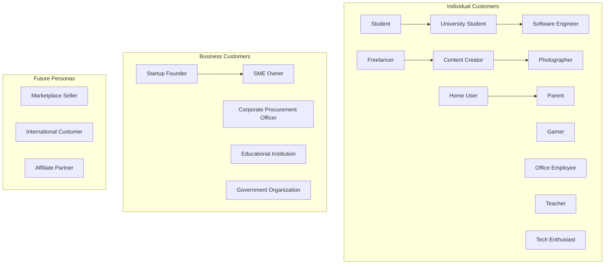
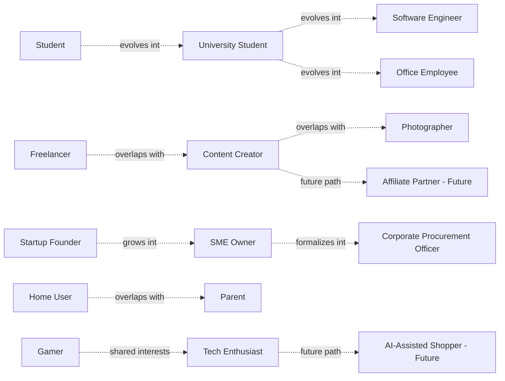
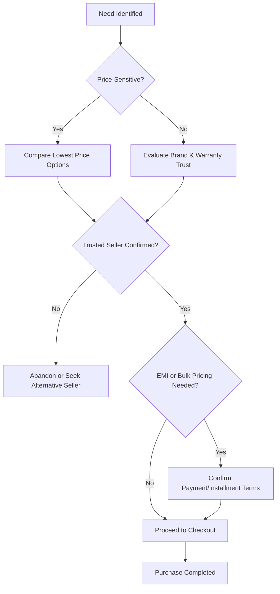

# User Persona Library

## 1. Document Purpose

This document is the official User Persona Library for **StackLeo Tech Store**. It represents realistic customer and business personas that guide product decisions, UX design, feature prioritization, marketing strategy, customer support, analytics, and future AI personalization.

Personas in this library are grounded in real buying behavior patterns observed in Bangladesh's technology retail market, as described in `01_Business/target-market.md`, while remaining structured to scale toward future international expansion. This document extends the target market segments and personas introduced in `01_Business/target-market.md` with deeper, product-actionable detail.

This document describes user research and behavioral modeling only. It does not describe implementation approach, technology choices, or system design, all of which are addressed in dedicated technical documentation elsewhere in the repository.

## 2. Persona Creation Methodology

Personas in this library are constructed using a combination of segmentation approaches, consistent with human-centered design practice:

- **Research Assumptions** — personas are built from the market research and customer assumptions documented in `01_Business/target-market.md` and `00_Project_Overview/assumptions.md`, refined through ongoing customer feedback once real usage data becomes available.
- **Behavioral Segmentation** — grouping by how customers shop: research depth, price sensitivity, brand loyalty, and channel preference.
- **Demographic Segmentation** — grouping by age, occupation, income range, and life stage.
- **Psychographic Segmentation** — grouping by values, motivations, and trust orientation, consistent with `01_Business/target-market.md` (Section 9).
- **Purchase Intent Segmentation** — grouping by what customers are trying to accomplish: a specific device need, ongoing hobby support, professional equipment, or institutional procurement.

Personas are treated as living artifacts: as real customer data becomes available post-launch, personas should be validated and refined rather than treated as fixed assumptions indefinitely.

## 3. Persona Categories

| Category | Personas |
|---|---|
| Individual Customers | Student, University Student, Gamer, Software Engineer, Freelancer, Content Creator, Photographer, Office Employee, Teacher, Home User, Parent, Tech Enthusiast |
| Business Customers | Startup Founder, SME Owner, Corporate Procurement Officer, Educational Institution, Government Organization |
| Future Personas | Marketplace Seller, International Customer, Affiliate Partner |

*Diagram: Customer Segmentation — grouping personas by category and illustrating natural progression paths (e.g., Student to University Student to Software Engineer).*

*Diagram: Persona Relationship Map — dotted arrows represent natural life-stage progression, behavioral overlap, or future evolution between related personas, not a strict linear dependency.*

---

## 4. Persona Profiles

Each persona below includes a short biography followed by a complete attribute profile.

### 4.1 Individual Customers

#### PERSONA-001 — Student

Rahim is a secondary school student in Dhaka who saves allowance and small earnings to buy his first smartphone or budget accessories. He is highly price-sensitive and relies heavily on friends' opinions and online reviews before spending.

| Attribute | Detail |
|---|---|
| Age Range | 14–18 |
| Occupation | Secondary school student |
| Income Range | No independent income; relies on family allowance |
| Technical Skill Level | Moderate; comfortable with smartphones and social apps |
| Shopping Frequency | Infrequent; occasion-driven (e.g., festival, exam result gift) |
| Preferred Devices | Mobile phone |
| Preferred Payment Method | Cash on Delivery |
| Preferred Delivery Method | Home delivery |
| Purchase Motivation | Lowest price, peer recommendation |
| Goals | Own an affordable, reliable smartphone or accessory. |
| Frustrations | Limited budget; fear of being sold a fake or refurbished product. |
| Pain Points | Trust, pricing, counterfeit concerns. |
| Trust Factors | Peer reviews, visible price transparency, brand recognition. |
| Decision Criteria | Price, perceived value, peer approval. |
| Favorite Features | Coupons, budget filters, wishlist. |
| Accessibility Needs | None identified. |
| Communication Preferences | SMS, social media. |
| Marketing Preferences | Social media promotions, student-focused discounts. |
| Customer Lifetime Value Potential | Low-to-moderate initially; grows as the student transitions to University Student and beyond. |
| Risks | High price sensitivity may drive migration to cheaper, less trustworthy sellers. |
| Future Needs | Student discount program, price alerts. |

#### PERSONA-002 — University Student

Nusrat is a university student in Dhaka who needs a reliable laptop for coursework and a smartphone for daily life. She researches thoroughly, compares specifications, and often waits for sales or EMI options due to a tight budget.

| Attribute | Detail |
|---|---|
| Age Range | 18–24 |
| Occupation | University student |
| Income Range | Limited; family-supported or part-time income |
| Technical Skill Level | High; comfortable researching specifications and comparing products |
| Shopping Frequency | A few times per year, around semester needs |
| Preferred Devices | Laptop, mobile phone |
| Preferred Payment Method | EMI, mobile banking |
| Preferred Delivery Method | Home delivery, store pickup for high-value items |
| Purchase Motivation | EMI availability, warranty assurance, value for money |
| Goals | Acquire a dependable laptop that supports academic work without overspending. |
| Frustrations | High upfront cost of laptops; unclear warranty terms from informal sellers. |
| Pain Points | Pricing, warranty, availability of preferred models. |
| Trust Factors | Official warranty, transparent return policy, verified reviews. |
| Decision Criteria | Specifications-to-price ratio, warranty terms, EMI availability. |
| Favorite Features | Compare products, EMI, reviews, wishlist. |
| Accessibility Needs | None identified. |
| Communication Preferences | Email, app notifications (future). |
| Marketing Preferences | Semester-timed promotions, student bundles. |
| Customer Lifetime Value Potential | Moderate-to-high as she progresses into professional life (Software Engineer, Office Employee). |
| Risks | Budget constraints may delay purchase decisions or shift to competitors offering deeper EMI discounts. |
| Future Needs | Extended EMI partnerships, student verification discounts. |

#### PERSONA-003 — Gamer

Fahim is a passionate PC and console gamer who invests significant budget into peripherals, components, and accessories. He follows tech reviewers closely and is willing to pay a premium for performance and authenticity.

| Attribute | Detail |
|---|---|
| Age Range | 16–30 |
| Occupation | Student or early-career professional |
| Income Range | Variable; moderate discretionary spending on hobby |
| Technical Skill Level | Very high; deeply familiar with specifications and performance benchmarks |
| Shopping Frequency | Frequent; ongoing upgrades and accessory purchases |
| Preferred Devices | Desktop PC, gaming laptop, mobile phone |
| Preferred Payment Method | Online payment, EMI for high-value components |
| Preferred Delivery Method | Home delivery |
| Purchase Motivation | Performance, authenticity, availability of latest releases |
| Goals | Build and continuously upgrade a high-performance gaming setup. |
| Frustrations | Limited local availability of niche gaming accessories; counterfeit peripherals in the market. |
| Pain Points | Availability, counterfeit concerns, delivery speed. |
| Trust Factors | Authenticity guarantees, detailed specifications, community reviews. |
| Decision Criteria | Performance specifications, authenticity, price relative to global markets. |
| Favorite Features | Compare products, detailed catalog filters, reviews, flash sales. |
| Accessibility Needs | None identified. |
| Communication Preferences | Email, social media, future push notifications. |
| Marketing Preferences | Flash sales, new-release alerts, gaming community engagement. |
| Customer Lifetime Value Potential | High; frequent repeat purchases and strong community influence. |
| Risks | May defect to import-based grey-market sellers if catalog breadth is insufficient. |
| Future Needs | Dedicated gaming category curation, restock notifications. |

#### PERSONA-004 — Software Engineer

Tanvir is a working software engineer who values performance, reliability, and efficiency in his purchases. He researches extensively but decides quickly once satisfied, prioritizing genuine products and dependable after-sales support.

| Attribute | Detail |
|---|---|
| Age Range | 24–38 |
| Occupation | Software engineer / IT professional |
| Income Range | Moderate-to-high, stable income |
| Technical Skill Level | Very high |
| Shopping Frequency | A few times per year; higher average spend per purchase |
| Preferred Devices | Laptop, mobile phone, peripherals |
| Preferred Payment Method | Online payment, card payment |
| Preferred Delivery Method | Home delivery |
| Purchase Motivation | Reliability, official warranty, efficient purchasing experience |
| Goals | Purchase dependable, high-performance equipment with minimal friction. |
| Frustrations | Slow checkout processes; inconsistent stock availability for specific models. |
| Pain Points | Availability, warranty clarity, after-sales support speed. |
| Trust Factors | Verified authenticity, clear warranty terms, professional-grade reviews. |
| Decision Criteria | Performance specifications, brand reputation, warranty terms. |
| Favorite Features | Search, filters, warranty tracking, order history. |
| Accessibility Needs | None identified. |
| Communication Preferences | Email. |
| Marketing Preferences | Minimal; prefers targeted, relevant communication over frequent promotions. |
| Customer Lifetime Value Potential | High; stable income supports recurring higher-value purchases. |
| Risks | Low tolerance for poor service; may not provide feedback before silently switching to a competitor. |
| Future Needs | Faster checkout, corporate/professional purchasing options. |

#### PERSONA-005 — Freelancer

Mim is a freelance professional working remotely who depends on her laptop and internet-connected devices for her livelihood. Downtime is costly, so she prioritizes reliability and fast support over the lowest price.

| Attribute | Detail |
|---|---|
| Age Range | 22–40 |
| Occupation | Freelance professional (design, writing, development) |
| Income Range | Variable, project-based income |
| Technical Skill Level | High |
| Shopping Frequency | Occasional, tied to equipment failure or upgrade needs |
| Preferred Devices | Laptop, mobile phone, networking devices |
| Preferred Payment Method | Mobile banking, online payment |
| Preferred Delivery Method | Home delivery |
| Purchase Motivation | Reliability, fast delivery, dependable warranty |
| Goals | Minimize work disruption by acquiring dependable equipment quickly. |
| Frustrations | Delivery delays; unclear return process for urgent equipment needs. |
| Pain Points | Delivery speed, warranty clarity, support responsiveness. |
| Trust Factors | Fast, transparent delivery tracking; responsive customer support. |
| Decision Criteria | Delivery speed, reliability, warranty coverage. |
| Favorite Features | Order tracking, warranty, customer support access. |
| Accessibility Needs | None identified. |
| Communication Preferences | Email, SMS. |
| Marketing Preferences | Practical, need-based offers rather than broad promotions. |
| Customer Lifetime Value Potential | Moderate-to-high; values consistency and may become a loyal repeat customer if reliability is proven. |
| Risks | Any fulfillment failure directly impacts her income, creating outsized dissatisfaction risk. |
| Future Needs | Expedited delivery options, priority support tier. |

#### PERSONA-006 — Content Creator

Arif produces video and social content and requires reliable cameras, audio equipment, and editing hardware. He values quality and authenticity and often shares his purchases and experiences publicly.

| Attribute | Detail |
|---|---|
| Age Range | 18–32 |
| Occupation | Content creator / social media professional |
| Income Range | Variable, often supplemented by other income |
| Technical Skill Level | High, particularly in audio/video equipment |
| Shopping Frequency | Moderate; driven by content production needs |
| Preferred Devices | Laptop, mobile phone, audio/video equipment |
| Preferred Payment Method | Online payment, EMI for high-value equipment |
| Preferred Delivery Method | Home delivery |
| Purchase Motivation | Quality, authenticity, brand reputation |
| Goals | Acquire reliable content production equipment that supports growing audience expectations. |
| Frustrations | Limited availability of specialized content-creation equipment locally. |
| Pain Points | Availability, counterfeit concerns, pricing relative to specialized needs. |
| Trust Factors | Authenticity guarantees, detailed specifications, peer creator recommendations. |
| Decision Criteria | Quality, authenticity, suitability for content production. |
| Favorite Features | Detailed product specifications, reviews, wishlist. |
| Accessibility Needs | None identified. |
| Communication Preferences | Social media, email. |
| Marketing Preferences | Influencer collaboration, social media-driven promotions. |
| Customer Lifetime Value Potential | Moderate-to-high, with potential brand advocacy value beyond direct spend. |
| Risks | Public visibility means a poor experience could be shared widely. |
| Future Needs | Creator-focused product bundles, affiliate partnership potential (see PERSONA-020). |

#### PERSONA-007 — Photographer

Shirin is a professional or semi-professional photographer who invests in cameras, lenses, and storage devices. She is detail-oriented and highly sensitive to authenticity and warranty assurance given the high value of her equipment.

| Attribute | Detail |
|---|---|
| Age Range | 25–45 |
| Occupation | Professional or semi-professional photographer |
| Income Range | Moderate-to-high, project-based |
| Technical Skill Level | High, specialized in imaging equipment |
| Shopping Frequency | Infrequent but high-value purchases |
| Preferred Devices | Cameras and related electronics, storage devices, laptop |
| Preferred Payment Method | Bank transfer, online payment, EMI |
| Preferred Delivery Method | Store pickup for high-value items, insured home delivery |
| Purchase Motivation | Authenticity, official warranty, trusted seller reputation |
| Goals | Acquire professional-grade equipment with confidence in authenticity and support. |
| Frustrations | Difficulty verifying authenticity for high-value imaging equipment. |
| Pain Points | Counterfeit concerns, warranty clarity, trust. |
| Trust Factors | Verified authenticity, official brand warranty, in-person inspection option. |
| Decision Criteria | Authenticity assurance, warranty terms, seller reputation. |
| Favorite Features | Store pickup, warranty tracking, detailed product content. |
| Accessibility Needs | None identified. |
| Communication Preferences | Email, phone. |
| Marketing Preferences | Minimal; values relevant, high-quality communication. |
| Customer Lifetime Value Potential | High, given equipment value, but low frequency. |
| Risks | High-value purchases mean any trust failure results in significant reputational and financial damage. |
| Future Needs | Extended equipment insurance options, high-value item concierge support. |

#### PERSONA-008 — Office Employee

Kamal is a mid-level office professional purchasing devices and accessories for both work and personal use. He values reliability and straightforward purchasing over deep technical specification research.

| Attribute | Detail |
|---|---|
| Age Range | 28–50 |
| Occupation | Office professional |
| Income Range | Moderate, stable income |
| Technical Skill Level | Moderate |
| Shopping Frequency | Occasional |
| Preferred Devices | Laptop, mobile phone, office electronics |
| Preferred Payment Method | Cash on Delivery, mobile banking |
| Preferred Delivery Method | Home delivery |
| Purchase Motivation | Reliability, simplicity, dependable after-sales support |
| Goals | Purchase reliable devices without extensive research effort. |
| Frustrations | Overly complex product comparisons; unclear warranty processes. |
| Pain Points | Trust, warranty clarity, support responsiveness. |
| Trust Factors | Clear warranty terms, straightforward return policy, brand recognition. |
| Decision Criteria | Simplicity, reliability, fair pricing. |
| Favorite Features | Straightforward checkout, warranty, customer support. |
| Accessibility Needs | None identified. |
| Communication Preferences | Email, SMS. |
| Marketing Preferences | Occasional, relevant promotions rather than frequent messaging. |
| Customer Lifetime Value Potential | Moderate; steady, dependable repeat purchasing over time. |
| Risks | Low engagement with marketing may result in being overlooked without service-driven differentiation. |
| Future Needs | Simplified reorder experience, office electronics bundles. |

#### PERSONA-009 — Teacher

Farida is a school or college teacher purchasing devices to support both teaching responsibilities and personal use. She is budget-conscious and highly values dependable warranty and support, given limited technical troubleshooting time.

| Attribute | Detail |
|---|---|
| Age Range | 28–55 |
| Occupation | Teacher / educator |
| Income Range | Moderate, stable but limited discretionary budget |
| Technical Skill Level | Low-to-moderate |
| Shopping Frequency | Infrequent |
| Preferred Devices | Laptop, mobile phone |
| Preferred Payment Method | Cash on Delivery, EMI |
| Preferred Delivery Method | Home delivery |
| Purchase Motivation | Affordability, dependable warranty, simple support process |
| Goals | Acquire a reliable device without needing deep technical knowledge. |
| Frustrations | Difficulty evaluating technical specifications; concern over being sold unnecessary upsells. |
| Pain Points | Trust, pricing, support accessibility. |
| Trust Factors | Clear, jargon-free product information; straightforward warranty terms. |
| Decision Criteria | Price, simplicity, warranty assurance. |
| Favorite Features | Simple search and filters, warranty, customer support. |
| Accessibility Needs | Clear, simple interface language; may benefit from larger text options. |
| Communication Preferences | Phone, SMS. |
| Marketing Preferences | Educator-focused discounts, simple and infrequent promotions. |
| Customer Lifetime Value Potential | Moderate; loyal once trust is established. |
| Risks | May be deterred by an overly complex purchasing or support process. |
| Future Needs | Educator discount programs, simplified support flows. |

#### PERSONA-010 — Home User

Salma is a general household user purchasing everyday electronics for family and home use. She prioritizes practicality, value for money, and straightforward product information.

| Attribute | Detail |
|---|---|
| Age Range | 30–55 |
| Occupation | Varies; household purchasing decision-maker |
| Income Range | Moderate |
| Technical Skill Level | Low-to-moderate |
| Shopping Frequency | Occasional, need-driven |
| Preferred Devices | Mobile phone, general electronics |
| Preferred Payment Method | Cash on Delivery |
| Preferred Delivery Method | Home delivery |
| Purchase Motivation | Practical value, availability, trusted seller |
| Goals | Purchase reliable household electronics without hassle. |
| Frustrations | Overwhelming product choice; unclear which product suits her needs. |
| Pain Points | Trust, availability, simplicity of choice. |
| Trust Factors | Clear guidance, straightforward return policy, brand familiarity. |
| Decision Criteria | Practicality, price, ease of purchase. |
| Favorite Features | Simple categories, customer support, straightforward checkout. |
| Accessibility Needs | May benefit from simplified navigation. |
| Communication Preferences | SMS, phone. |
| Marketing Preferences | Seasonal and household-focused promotions. |
| Customer Lifetime Value Potential | Moderate; recurring household electronics needs over time. |
| Risks | May default to a physical store visit if online experience feels confusing. |
| Future Needs | Guided shopping assistance, simplified product recommendations. |

#### PERSONA-011 — Parent

Nasreen is a parent purchasing devices for her children's education and family use, balancing budget concerns with a strong emphasis on product safety, durability, and dependable warranty support.

| Attribute | Detail |
|---|---|
| Age Range | 32–50 |
| Occupation | Varies; household and family purchasing decision-maker |
| Income Range | Moderate |
| Technical Skill Level | Low-to-moderate |
| Shopping Frequency | Occasional, tied to children's academic calendar |
| Preferred Devices | Tablet, laptop, mobile phone |
| Preferred Payment Method | EMI, Cash on Delivery |
| Preferred Delivery Method | Home delivery |
| Purchase Motivation | Durability, safety, dependable warranty |
| Goals | Provide children with reliable devices to support their education. |
| Frustrations | Difficulty assessing product durability for children's use; concern over warranty claims process. |
| Pain Points | Warranty, trust, pricing. |
| Trust Factors | Clear warranty terms, dependable return policy, genuine product assurance. |
| Decision Criteria | Durability, warranty coverage, price. |
| Favorite Features | Warranty tracking, EMI, straightforward returns. |
| Accessibility Needs | None identified. |
| Communication Preferences | SMS, email. |
| Marketing Preferences | Academic-calendar-timed promotions, family bundles. |
| Customer Lifetime Value Potential | Moderate-to-high; recurring purchases as children's needs evolve. |
| Risks | A negative warranty experience could permanently affect trust for family-related purchases. |
| Future Needs | Family/education bundles, extended warranty options for children's devices. |

#### PERSONA-012 — Tech Enthusiast

Rezwan closely follows technology news and trends, often purchasing the newest devices shortly after release. He is highly knowledgeable, price-aware, but willing to pay for genuine, cutting-edge products.

| Attribute | Detail |
|---|---|
| Age Range | 20–40 |
| Occupation | Varies; strong personal interest in technology |
| Income Range | Moderate-to-high |
| Technical Skill Level | Very high |
| Shopping Frequency | Frequent |
| Preferred Devices | Smartphones, laptops, wearables, smart home devices |
| Preferred Payment Method | Online payment, card payment |
| Preferred Delivery Method | Home delivery |
| Purchase Motivation | Latest technology, authenticity, broad catalog availability |
| Goals | Stay current with the latest genuine technology releases. |
| Frustrations | Delayed local availability of newly released products. |
| Pain Points | Availability, counterfeit concerns. |
| Trust Factors | Authenticity guarantees, detailed specifications, early access reliability. |
| Decision Criteria | Novelty, authenticity, catalog breadth. |
| Favorite Features | New arrivals browsing, wishlist, notifications, reviews. |
| Accessibility Needs | None identified. |
| Communication Preferences | Email, social media, future push notifications. |
| Marketing Preferences | Early access announcements, new arrival alerts. |
| Customer Lifetime Value Potential | High; frequent purchasing and strong influence on peer purchasing decisions. |
| Risks | May switch to competitors or import channels if new releases are consistently delayed. |
| Future Needs | Early access programs, new-arrival notifications (Future). |

### 4.2 Business Customers

#### PERSONA-013 — Startup Founder

Imran runs an early-stage startup and purchases a small number of laptops and office electronics for his growing team. He is budget-conscious but values reliability and fast turnaround, since delays directly affect a small team's productivity.

| Attribute | Detail |
|---|---|
| Age Range | 25–40 |
| Occupation | Startup founder / small team leader |
| Income Range | Variable, budget-constrained |
| Technical Skill Level | High |
| Shopping Frequency | Occasional, small-batch purchases |
| Preferred Devices | Laptops, networking devices, office electronics |
| Preferred Payment Method | Bank transfer, online payment |
| Preferred Delivery Method | Home/office delivery |
| Purchase Motivation | Reliability, speed, reasonable bulk pricing |
| Goals | Equip a small team quickly and affordably without sacrificing reliability. |
| Frustrations | Lack of small-scale bulk pricing options; slow procurement processes designed for larger businesses. |
| Pain Points | Pricing, availability, absence of a lightweight corporate purchasing option. |
| Trust Factors | Fast fulfillment, transparent small-bulk pricing, dependable warranty. |
| Decision Criteria | Speed, price for small quantities, reliability. |
| Favorite Features | Bulk-friendly checkout (future), invoicing, order tracking. |
| Accessibility Needs | None identified. |
| Communication Preferences | Email. |
| Marketing Preferences | Startup and small-business-focused offers. |
| Customer Lifetime Value Potential | Moderate-to-high, with growth potential as the startup scales toward SME status. |
| Risks | May outgrow ad hoc purchasing needs and require formal corporate sales support sooner than anticipated. |
| Future Needs | Lightweight corporate account features, small-batch bulk pricing, per `01_Business/business-model.md` (Section 10). |

#### PERSONA-014 — SME Owner

Rashida owns a small-to-medium enterprise and periodically purchases larger quantities of devices and electronics for business operations. She values dependable bulk pricing, invoicing, and after-sales support suited to business continuity.

| Attribute | Detail |
|---|---|
| Age Range | 30–55 |
| Occupation | Small-to-medium enterprise owner |
| Income Range | Moderate-to-high business budget |
| Technical Skill Level | Moderate |
| Shopping Frequency | Periodic, moderate-volume purchases |
| Preferred Devices | Laptops, office electronics, networking devices |
| Preferred Payment Method | Bank transfer, corporate invoicing (future) |
| Preferred Delivery Method | Business address delivery |
| Purchase Motivation | Bulk pricing, dependable supply, business continuity support |
| Goals | Reliably equip and maintain business operations technology. |
| Frustrations | Inconsistent bulk pricing; unclear business-focused warranty terms. |
| Pain Points | Pricing, warranty for business use, support responsiveness. |
| Trust Factors | Transparent bulk pricing, dependable delivery, responsive business support. |
| Decision Criteria | Bulk pricing, reliability, invoicing convenience. |
| Favorite Features | Corporate sales (future), invoicing, warranty support. |
| Accessibility Needs | None identified. |
| Communication Preferences | Email, phone. |
| Marketing Preferences | Business-focused offers, loyalty incentives for repeat bulk purchases. |
| Customer Lifetime Value Potential | High, given recurring, higher-volume business needs. |
| Risks | May shift to a dedicated B2B supplier if StackLeo's corporate capability is not competitive. |
| Future Needs | Full corporate sales portal, negotiated pricing tiers, per `01_Business/pricing-strategy.md` (Section 10). |

#### PERSONA-015 — Corporate Procurement Officer

Faruk manages technology procurement for a mid-sized organization, requiring formal quotations, consistent bulk pricing, and reliable, auditable order and invoicing processes.

| Attribute | Detail |
|---|---|
| Age Range | 30–50 |
| Occupation | Corporate procurement officer |
| Income Range | Organizational budget, not personal income-driven |
| Technical Skill Level | Moderate |
| Shopping Frequency | Periodic, formal procurement cycles |
| Preferred Devices | Laptops, office electronics, networking devices, in bulk |
| Preferred Payment Method | Bank transfer, formal invoicing |
| Preferred Delivery Method | Business address delivery, scheduled bulk delivery |
| Purchase Motivation | Reliable supply, formal documentation, negotiated pricing |
| Goals | Fulfill organizational technology procurement needs reliably and compliantly. |
| Frustrations | Lack of formal quotation and invoicing processes suited to procurement standards. |
| Pain Points | Pricing transparency, invoicing formality, delivery scheduling. |
| Trust Factors | Auditable invoicing, dependable bulk delivery, formal account management. |
| Decision Criteria | Compliance with procurement standards, negotiated pricing, reliability. |
| Favorite Features | Corporate portal (future), formal invoicing, dedicated account support. |
| Accessibility Needs | None identified. |
| Communication Preferences | Email, formal account management contact. |
| Marketing Preferences | Minimal; values direct account relationship over broad marketing. |
| Customer Lifetime Value Potential | High; large, recurring organizational spend. |
| Risks | Requires dedicated account support; poor experience could result in loss of a high-value account. |
| Future Needs | Formal corporate portal, negotiated account-level pricing, per `01_Business/business-requirements.md` (Section 17). |

#### PERSONA-016 — Educational Institution

A university or school procurement representative purchases computers, tablets, and networking devices in bulk to support classrooms and administrative operations, prioritizing durability, warranty, and budget-conscious bulk pricing.

| Attribute | Detail |
|---|---|
| Age Range | Institutional (represented by administrative staff, typically 30–55) |
| Occupation | Educational institution administration/procurement |
| Income Range | Institutional budget, often constrained by academic year cycles |
| Technical Skill Level | Moderate |
| Shopping Frequency | Periodic, tied to academic year planning |
| Preferred Devices | Laptops, tablets, networking devices, in bulk |
| Preferred Payment Method | Bank transfer, formal invoicing |
| Preferred Delivery Method | Scheduled institutional delivery |
| Purchase Motivation | Durability, budget-conscious bulk pricing, dependable warranty |
| Goals | Equip classrooms and administrative functions reliably within budget cycles. |
| Frustrations | Rigid academic budget cycles misaligned with vendor pricing timing. |
| Pain Points | Pricing, warranty duration for shared-use devices, bulk availability. |
| Trust Factors | Institutional-friendly invoicing, dependable warranty, bulk availability assurance. |
| Decision Criteria | Budget alignment, durability, bulk pricing. |
| Favorite Features | Corporate/institutional sales (future), extended warranty options. |
| Accessibility Needs | None identified. |
| Communication Preferences | Email, formal account contact. |
| Marketing Preferences | Academic-year-timed offers. |
| Customer Lifetime Value Potential | High; large, cyclical institutional spend. |
| Risks | Long procurement cycles mean lost opportunities are costly and infrequent to recover. |
| Future Needs | Academic-year-aligned bulk pricing programs, per `01_Business/business-model.md` (Section 10). |

#### PERSONA-017 — Government Organization

A government office procurement representative requires strict compliance, formal documentation, and vendor accountability when purchasing technology equipment, with less price sensitivity than durability and compliance assurance.

| Attribute | Detail |
|---|---|
| Age Range | Institutional (represented by administrative staff) |
| Occupation | Government office administration/procurement |
| Income Range | Public sector budget, subject to formal procurement rules |
| Technical Skill Level | Moderate |
| Shopping Frequency | Infrequent, formal tender or procurement-cycle driven |
| Preferred Devices | Office electronics, networking devices, computers, in bulk |
| Preferred Payment Method | Bank transfer, formal invoicing |
| Preferred Delivery Method | Scheduled institutional delivery |
| Purchase Motivation | Compliance, vendor accountability, dependable documentation |
| Goals | Fulfill procurement requirements in full compliance with public sector rules. |
| Frustrations | Vendors unable to meet formal compliance and documentation standards. |
| Pain Points | Compliance documentation, vendor accountability, formal invoicing. |
| Trust Factors | Regulatory compliance, transparent documentation, accountable vendor relationship. |
| Decision Criteria | Compliance, documentation completeness, vendor reliability. |
| Favorite Features | Corporate/institutional sales (future), compliant invoicing. |
| Accessibility Needs | None identified. |
| Communication Preferences | Formal written communication, email. |
| Marketing Preferences | Minimal; relationship and compliance-driven rather than promotional. |
| Customer Lifetime Value Potential | High, but requires significant compliance investment to serve well. |
| Risks | Non-compliance with public procurement standards could disqualify StackLeo entirely from consideration. |
| Future Needs | Formal compliance documentation processes, per `01_Business/business-rules.md` (Section 17). |

### 4.3 Future Personas

#### PERSONA-018 — Marketplace Seller

A future third-party seller who will list products on StackLeo's marketplace once multi-vendor capabilities are introduced, seeking access to StackLeo's customer base and trusted brand reputation.

| Attribute | Detail |
|---|---|
| Age Range | Business entity (represented by owner/staff) |
| Occupation | Independent seller or small retail business |
| Income Range | Business revenue-dependent |
| Technical Skill Level | Moderate |
| Shopping Frequency | Not applicable (seller, not buyer) |
| Preferred Devices | Laptop, mobile phone (for seller portal access) |
| Preferred Payment Method | Settlement via marketplace commission structure |
| Preferred Delivery Method | Not applicable (may self-fulfill or use StackLeo logistics) |
| Purchase Motivation | Not applicable; motivated by access to customer reach and platform trust |
| Goals | Reach StackLeo's customer base while benefiting from its trusted brand. |
| Frustrations | Complex or opaque onboarding and commission structures on other platforms. |
| Pain Points | Onboarding complexity, commission transparency, dispute resolution fairness. |
| Trust Factors | Transparent commission structure, fair dispute resolution, reliable settlement timing. |
| Decision Criteria | Commission rate, customer reach, platform reputation. |
| Favorite Features | Seller dashboard (future), settlement reporting (future). |
| Accessibility Needs | None identified. |
| Communication Preferences | Email, seller portal notifications (future). |
| Marketing Preferences | Not applicable; seller-facing onboarding communication instead. |
| Customer Lifetime Value Potential | Not applicable in the traditional sense; value measured via marketplace commission contribution. |
| Risks | Poor seller experience could reduce seller quality and hurt the customer trust position, per `01_Business/swot-analysis.md`. |
| Future Needs | Full seller onboarding, dashboard, and settlement capability, per `product-modules.md` (MOD-031). |

#### PERSONA-019 — International Customer

A future customer located outside Bangladesh, engaging with StackLeo Tech Store once international shipping and multi-currency capability are introduced, expecting localized pricing, language, and delivery expectations.

| Attribute | Detail |
|---|---|
| Age Range | Varies by target market |
| Occupation | Varies |
| Income Range | Varies by target market |
| Technical Skill Level | Moderate-to-high |
| Shopping Frequency | Not yet applicable |
| Preferred Devices | Mobile phone, laptop |
| Preferred Payment Method | Local/regional digital payment methods, multi-currency support (future) |
| Preferred Delivery Method | International shipping (future) |
| Purchase Motivation | Access to StackLeo's trusted catalog beyond Bangladesh |
| Goals | Purchase from StackLeo with a locally relevant experience despite being outside the primary market. |
| Frustrations | Currency conversion confusion; uncertain international delivery timelines. |
| Pain Points | Currency transparency, international shipping reliability, language localization. |
| Trust Factors | Transparent multi-currency pricing, reliable international delivery estimates. |
| Decision Criteria | Price transparency in local currency, delivery reliability, localized support. |
| Favorite Features | Multi-currency display (future), multi-language support (future). |
| Accessibility Needs | Localized language support. |
| Communication Preferences | Email, localized channels per market. |
| Marketing Preferences | Regionally tailored campaigns. |
| Customer Lifetime Value Potential | To be assessed per target market as expansion is validated. |
| Risks | Poor localization could undermine trust before it is established in a new market. |
| Future Needs | Full international shipping, multi-currency, and multi-language capability, per `product-roadmap.md` (Phase 7). |

#### PERSONA-020 — Affiliate Partner

A future content creator or influencer who earns commission by referring customers to StackLeo Tech Store, motivated by transparent tracking and reliable, timely commission payout.

| Attribute | Detail |
|---|---|
| Age Range | 18–35 |
| Occupation | Content creator, blogger, or influencer |
| Income Range | Variable, partly commission-dependent |
| Technical Skill Level | Moderate-to-high |
| Shopping Frequency | Not applicable (referral partner, not primary buyer role) |
| Preferred Devices | Mobile phone, laptop |
| Preferred Payment Method | Commission payout via bank transfer or mobile banking |
| Preferred Delivery Method | Not applicable |
| Purchase Motivation | Not applicable; motivated by referral commission and audience trust alignment |
| Goals | Earn reliable commission while recommending products they trust to their audience. |
| Frustrations | Opaque referral tracking or delayed commission payment on other platforms. |
| Pain Points | Tracking transparency, payout reliability. |
| Trust Factors | Transparent referral tracking, timely and accurate commission payout. |
| Decision Criteria | Commission rate, tracking transparency, brand alignment with their audience. |
| Favorite Features | Affiliate dashboard (future), referral tracking (future). |
| Accessibility Needs | None identified. |
| Communication Preferences | Email, social media. |
| Marketing Preferences | Not applicable; partner-facing program communication instead. |
| Customer Lifetime Value Potential | Measured via referred customer value rather than direct spend. |
| Risks | Untrustworthy tracking or payout could damage StackLeo's reputation within creator communities. |
| Future Needs | Full affiliate program capability, per `product-modules.md` (Section 11, Future Module Expansion). |

---

## 5. Persona Journey Summary

*Diagram: Persona Journey — the general stage flow every persona moves through, though emphasis on each stage varies by persona (e.g., the Tech Enthusiast spends longer in Research/Comparison; the Home User moves quickly from Awareness to Purchase).*

| Stage | High-Emphasis Personas |
|---|---|
| Awareness | Tech Enthusiast, Student, Content Creator |
| Research | Software Engineer, University Student, Gamer |
| Comparison | Gamer, Freelancer, SME Owner |
| Purchase | Home User, Office Employee |
| Delivery | Freelancer, Parent |
| Usage | Photographer, Software Engineer |
| Support | Teacher, Parent, Corporate Procurement Officer |
| Repeat Purchase | Tech Enthusiast, SME Owner, Corporate Procurement Officer |

## 6. Feature Mapping

| Persona | Key Related Features |
|---|---|
| Student | Budget filters (FEAT-012), Coupons (FEAT-017), Wishlist (FEAT-005) |
| University Student | Compare Products (FEAT-006), EMI (pricing-strategy.md), Reviews (FEAT-038) |
| Gamer | Compare Products (FEAT-006), Filters (FEAT-012), Flash Sales (promotion) |
| Software Engineer | Search (FEAT-011), Warranty (FEAT-026), Order History (FEAT-021) |
| Freelancer | Order Tracking (FEAT-021), Warranty (FEAT-026), Customer Support |
| Content Creator | Reviews (FEAT-038), Wishlist (FEAT-005), Affiliate (Future, FEAT extension) |
| Photographer | Store Pickup (FEAT-037), Warranty (FEAT-026), Product Content Detail |
| Office Employee | Checkout (FEAT-016), Warranty (FEAT-026), Customer Support |
| Teacher | Search & Filters (FEAT-011/012), Warranty (FEAT-026), Customer Support |
| Home User | Categories (FEAT-009), Customer Support, Store Pickup (FEAT-037) |
| Parent | EMI, Warranty (FEAT-026), Returns (FEAT-023) |
| Tech Enthusiast | Recommendations (FEAT-014), Notifications (FEAT-040), Wishlist (FEAT-005) |
| Startup Founder | Invoices (FEAT-022), Order Tracking (FEAT-021), Corporate Sales (FEAT-055, Future) |
| SME Owner | Corporate Sales (FEAT-055, Future), Invoices (FEAT-022) |
| Corporate Procurement Officer | Corporate Sales (FEAT-055, Future), Reports |
| Educational Institution | Corporate Sales (FEAT-055, Future), Extended Warranty |
| Government Organization | Corporate Sales (FEAT-055, Future), Compliant Invoicing (FEAT-022) |
| Marketplace Seller | Seller Dashboard (FEAT-056/057, Future) |
| International Customer | Multi-Currency, Multi-Language (Future) |
| Affiliate Partner | Referral Program (FEAT-044, Future) |

## 7. Persona Priority

| Priority | Personas |
|---|---|
| Primary | Student, University Student, Gamer, Software Engineer, Office Employee, Home User, Tech Enthusiast |
| Secondary | Freelancer, Content Creator, Photographer, Teacher, Parent, Startup Founder, SME Owner |
| Future | Corporate Procurement Officer, Educational Institution, Government Organization, Marketplace Seller, International Customer, Affiliate Partner |

## 8. Customer Behavior Analysis

| Persona | Buying Frequency | AOV Tendency | Preferred Brands | Seasonal Behavior | Loyalty Potential | Discount Sensitivity |
|---|---|---|---|---|---|---|
| Student | Low | Low | Value/budget brands | Festival and exam-result driven | Moderate | Very High |
| University Student | Moderate | Moderate | Value-to-mid brands | Semester-start driven | Moderate-High | High |
| Gamer | High | Moderate-High | Performance brands | New-release driven | High | Moderate |
| Software Engineer | Low-Moderate | High | Established, reliable brands | Minimal seasonality | High | Low |
| Freelancer | Low | Moderate-High | Reliable, mid-to-premium brands | Equipment-failure driven | Moderate-High | Moderate |
| Content Creator | Moderate | Moderate | Quality-focused brands | Content-cycle driven | Moderate | Moderate |
| Photographer | Low | High | Premium, established brands | Minimal seasonality | High | Low |
| Office Employee | Low | Moderate | Recognized, dependable brands | Minimal seasonality | Moderate | Moderate |
| Teacher | Low | Low-Moderate | Value/dependable brands | Academic-year driven | Moderate-High | High |
| Home User | Low | Low-Moderate | Familiar, recognized brands | Festival driven | Moderate | High |
| Parent | Low-Moderate | Moderate | Durable, safety-assured brands | Academic-year driven | Moderate-High | High |
| Tech Enthusiast | High | Moderate-High | Latest/premium brands | New-release driven | High | Low-Moderate |
| Startup Founder | Low | Moderate | Value-to-mid brands | Team-growth driven | Moderate | Moderate-High |
| SME Owner | Periodic | High (bulk) | Reliable business-grade brands | Business-cycle driven | High | Moderate |
| Corporate Procurement Officer | Periodic | Very High (bulk) | Established, compliant brands | Procurement-cycle driven | High | Low |
| Educational Institution | Periodic | Very High (bulk) | Durable, budget-conscious brands | Academic-year driven | High | High |
| Government Organization | Infrequent | Very High (bulk) | Compliant, established brands | Fiscal/tender cycle driven | High | Low |

## 9. Customer Pain Point Analysis

| Pain Point | Description | Most Affected Personas |
|---|---|---|
| Trust | Uncertainty about seller reliability and genuine business conduct. | Student, Home User, Teacher |
| Pricing | Concern over fair, transparent, and competitive pricing. | Student, University Student, Teacher, Parent |
| Warranty | Uncertainty about coverage terms and claim reliability. | Parent, Office Employee, Software Engineer |
| Delivery | Concern over delivery speed and reliability. | Freelancer, Gamer |
| Returns | Concern over the ease and fairness of the return process. | Parent, University Student |
| Support | Concern over responsiveness and helpfulness of customer service. | Teacher, Home User, Corporate Procurement Officer |
| Availability | Concern over stock availability, particularly for niche products. | Gamer, Content Creator, Tech Enthusiast |
| Counterfeit Concerns | Fear of receiving fake or grey-market products. | Gamer, Photographer, Tech Enthusiast |

## 10. Customer Motivation Analysis

| Motivation | Description | Most Driven Personas |
|---|---|---|
| Lowest Price | Prioritizing the cheapest available option. | Student, Home User, Teacher |
| Fast Delivery | Prioritizing minimal time between order and receipt. | Freelancer, Gamer |
| Official Warranty | Prioritizing verified, dependable warranty coverage. | Parent, Photographer, Software Engineer |
| Trusted Seller | Prioritizing seller reputation and business legitimacy. | Home User, Teacher, SME Owner |
| Availability | Prioritizing confirmed stock of desired products. | Gamer, Tech Enthusiast, Content Creator |
| EMI | Prioritizing installment-based affordability. | University Student, Parent |
| After-Sales Support | Prioritizing responsive post-purchase assistance. | Office Employee, Corporate Procurement Officer |

## 10.1 Buying Decision Flow

*Diagram: Buying Decision Flow — the general decision path most personas follow, branching primarily on price sensitivity, trust confirmation, and payment flexibility needs (e.g., Student and Home User lean heavily on the price-sensitive branch; Photographer and Corporate Procurement Officer lean on the brand/warranty trust branch).*

## 11. Persona KPIs

| KPI | Description |
|---|---|
| Conversion Rate | Proportion of persona-representative visits resulting in purchase. |
| Retention | Proportion of persona-representative customers who remain active over time. |
| Repeat Purchase Rate | Proportion of persona-representative customers completing more than one purchase. |
| Average Order Value (AOV) | Average order value observed within each persona segment. |
| Customer Satisfaction | Persona-segment-level satisfaction, gathered through reviews and support feedback. |
| Net Promoter Score (NPS) | Persona-segment-level willingness to recommend StackLeo Tech Store. |

## 12. Future Personas

| Persona | Description | Enabling Capability |
|---|---|---|
| Marketplace Seller | Third-party seller listing products on StackLeo's future marketplace. | `product-modules.md` MOD-031 |
| Corporate Buyer | Organizational buyer purchasing under formal corporate sales terms (Startup Founder, SME Owner, Corporate Procurement Officer, Educational Institution, Government Organization represent early forms of this persona group). | `product-modules.md` MOD-030 |
| International Customer | Customer located outside Bangladesh once international shipping and multi-currency capability launch. | `product-roadmap.md` Phase 7 |
| AI-Assisted Shopper | A future evolution of existing personas, engaging with AI-driven search, recommendations, and chatbot support. | `product-modules.md` MOD-032 |

## 13. Governance

| Governance Aspect | Description |
|---|---|
| Persona Ownership | The Product Manager owns this persona library, with input from UX Design and Marketing. |
| Review Process | Personas are reviewed at the conclusion of each phase defined in `product-roadmap.md`, and whenever significant new customer research becomes available. |
| Research Updates | Persona attributes should be validated against real customer behavior data once available post-launch, replacing assumption-based detail with observed data over time. |
| Versioning | This document follows the Semantic Versioning approach defined in `00_Project_Overview/changelog.md`. |
| Validation | Material changes to a persona's goals, pain points, or priority classification must be reviewed by Product Management and Marketing before being adopted, and recorded in `changelog.md`. |

## 14. Document Information

| Property | Value |
|----------|-------|
| Document | user-personas.md |
| Version | 1.0.0 |
| Status | Active |
| Maintained By | StackLeo |
| Last Updated | 2026-07-17 |

---

© StackLeo. All Rights Reserved.
