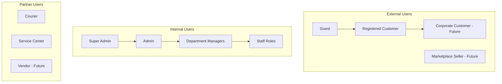
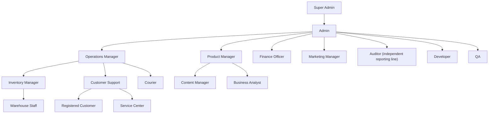
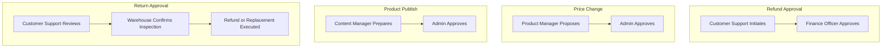

# User Roles & Access Control

## 1. Document Purpose

This document defines every user role within **StackLeo Tech Store**. It establishes responsibilities, permissions, access boundaries, ownership, workflows, and governance for every user category that interacts with the platform — external customers, internal staff, and partner organizations.

This document is the foundation for authentication, authorization, Role-Based Access Control (RBAC), the admin panel, backend permissions, API security, audit logging, operations, customer support, the future corporate portal, and the future marketplace. It is derived from `product-modules.md` (module boundaries) and `01_Business/business-rules.md` (Sections 12 and 14: Admin Rules and Security Rules).

This document defines access control policy and business responsibility only. It does not describe implementation approach, technology choices, API design, or database structure, all of which are addressed in dedicated technical documentation elsewhere in the repository.

## 2. Role Management Philosophy

Access at StackLeo Tech Store is granted based on business need, not convenience. Every role is scoped to the minimum set of actions required to perform its function, and every permission granted must be traceable to a legitimate business responsibility.

Roles are designed to scale from a small internal team at MVP stage to a much larger organization spanning corporate sales, multi-warehouse operations, and a multi-vendor marketplace — without requiring the access model itself to be redesigned. Security and auditability are treated as first-class design goals, not afterthoughts layered on once the system is in production.

## 3. Access Control Principles

- **Authentication vs. Authorization** — Authentication establishes *who* a user is (verified identity, per `product-modules.md` MOD-001); authorization determines *what* that verified identity is permitted to do. A user may be successfully authenticated and still be authorized for nothing beyond their assigned role's permissions.
- **Least Privilege** — Every role is granted the minimum access necessary to perform its defined responsibilities, and no more. Broader access must be justified by an explicit business need, not general convenience.
- **Separation of Duties** — No single role should be able to both perform and approve the same high-impact action (e.g., issuing a refund and approving it). This is elaborated in Section 11.
- **Role Hierarchy** — Roles are organized in a layered structure, where broader administrative roles can oversee, but do not routinely perform, the day-to-day actions of narrower operational roles.
- **Permission Inheritance** — Where a role hierarchy exists, a higher-level role may inherit the ability to view (but not necessarily act upon) the scope of roles beneath it, without automatically inheriting their operational permissions.
- **Auditability** — Every action affecting customer data, pricing, inventory, orders, or access control must be attributable to a specific identity and recorded, consistent with `business-rules.md` (BR-104).

This model currently implements Role-Based Access Control (RBAC) and is designed to extend to Attribute-Based Access Control (ABAC) in the future — for example, scoping a Warehouse Staff role's access to a specific warehouse location, or a Regional Manager's access to a specific geographic territory — without requiring a redefinition of the roles themselves.

## 4. User Categories

| Category | Roles |
|---|---|
| External Users | Guest, Registered Customer, Corporate Customer (Future), Marketplace Seller (Future) |
| Internal Users | Super Admin, Admin, Operations Manager, Product Manager, Inventory Manager, Warehouse Staff, Customer Support, Finance Officer, Marketing Manager, Content Manager, QA, Developer, Auditor, Business Analyst |
| Partner Users | Courier, Service Center, Vendor (Future) |

*Diagram: Organization Role Structure.*

---

## 5. Detailed Role Specifications

Each role is documented across four tables: **Identity & Purpose**, **Scope of Action**, **Access & Approval**, and **Traceability**.

### 5.1 External Users

**Identity & Purpose**

| Role ID | Role Name | Description | Business Purpose |
|---|---|---|---|
| ROLE-001 | Guest | An unauthenticated visitor browsing the platform. | Enables product discovery without requiring commitment to registration. |
| ROLE-002 | Registered Customer | An authenticated individual consumer account. | Enables the core B2C purchasing relationship. |
| ROLE-003 | Corporate Customer (Future) | An authenticated organizational buyer account. | Enables bulk and organizational purchasing per `01_Business/business-model.md` (Section 10). |
| ROLE-004 | Marketplace Seller (Future) | An authenticated third-party seller account. | Enables catalog expansion via curated marketplace sellers. |

**Scope of Action**

| Role ID | Responsibilities | Allowed Actions | Restricted Actions |
|---|---|---|---|
| ROLE-001 | Browse and evaluate products. | Search, filter, view products, view public reviews. | Purchase, save wishlist, submit reviews, view order history. |
| ROLE-002 | Purchase and manage their own orders. | Browse, purchase, track orders, request returns/warranty, submit reviews. | Access to any other customer's data; administrative functions. |
| ROLE-003 | Manage bulk/organizational purchasing under a negotiated agreement. | All Registered Customer actions, plus bulk order placement under agreed corporate pricing. | Access to other corporate accounts; internal pricing configuration. |
| ROLE-004 | Manage their own product listings and orders on the marketplace. | List approved products, view own orders, respond to disputes. | Access to StackLeo's own catalog administration; other sellers' data. |

**Access & Approval**

| Role ID | Accessible Modules | Data Visibility | Approval Authority | Escalation Path |
|---|---|---|---|---|
| ROLE-001 | MOD-007, MOD-008, MOD-009, MOD-010 (public view only) | Public catalog data only. | None | Customer Support |
| ROLE-002 | MOD-005, MOD-006, MOD-012–MOD-017, MOD-022, MOD-024, MOD-025 (own data only) | Own account, order, return, and warranty data only. | None | Customer Support |
| ROLE-003 | Registered Customer scope, plus MOD-030 (Corporate Sales, own account) | Own corporate account data only. | None (subject to pre-agreed terms) | Sales Team, Customer Support |
| ROLE-004 | MOD-031 (Marketplace, own storefront only) | Own listings, orders, and settlement data only. | Own listing submission (subject to MOD-029 approval) | Marketplace Operations |

**Traceability**

| Role ID | KPIs | Related Business Rules | Future Notes |
|---|---|---|---|
| ROLE-001 | Guest-to-registration conversion rate | BR-011 | — |
| ROLE-002 | Account activity rate, Order Success Rate | BR-001–BR-012, BR-064–BR-073 | — |
| ROLE-003 | Corporate order volume | `01_Business/business-rules.md` (Sections 22–23) | Not yet active; full permission scope to be finalized prior to Phase 4 launch. |
| ROLE-004 | Verified seller count, listing approval rate | BR-106–BR-109 | Not yet active; full permission scope to be finalized prior to Phase 5 launch. |

### 5.2 Internal Users

**Identity & Purpose**

| Role ID | Role Name | Description | Business Purpose |
|---|---|---|---|
| ROLE-005 | Super Admin | Highest-level internal role with full platform authority. | Ensures a single accountable authority exists for critical, organization-wide decisions. |
| ROLE-006 | Admin | Senior internal role administering day-to-day platform operations. | Executes cross-functional administrative oversight beneath Super Admin. |
| ROLE-007 | Operations Manager | Oversees order fulfillment and cross-channel operations. | Ensures consistent, reliable fulfillment across online and physical retail. |
| ROLE-008 | Product Manager | Owns catalog strategy and product-related requirements. | Maintains alignment between catalog and business/product strategy. |
| ROLE-009 | Inventory Manager | Oversees stock accuracy and warehouse coordination. | Prevents overselling and maintains reliable stock visibility. |
| ROLE-010 | Warehouse Staff | Executes physical picking, packing, and stock handling. | Performs the physical fulfillment work directed by Inventory Manager and Operations Manager. |
| ROLE-011 | Customer Support | Resolves customer inquiries, returns, and warranty cases. | Preserves customer trust through timely, accurate issue resolution. |
| ROLE-012 | Finance Officer | Oversees payment reconciliation, refunds, and financial reporting. | Ensures financial accuracy and compliance. |
| ROLE-013 | Marketing Manager | Oversees promotions, campaigns, and customer engagement. | Drives customer acquisition and retention within approved budgets. |
| ROLE-014 | Content Manager | Maintains product content quality and presentation. | Ensures catalog content is accurate, complete, and on-brand. |
| ROLE-015 | QA | Validates platform functionality and quality prior to release. | Protects customers and operations from defective releases. |
| ROLE-016 | Developer | Builds and maintains platform capability. | Implements approved requirements into working functionality. |
| ROLE-017 | Auditor | Independently reviews administrative and financial activity. | Provides independent assurance of policy and control compliance. |
| ROLE-018 | Business Analyst | Maintains business and product requirements documentation. | Ensures platform behavior remains traceable to approved business requirements. |

**Scope of Action**

| Role ID | Responsibilities | Allowed Actions | Restricted Actions |
|---|---|---|---|
| ROLE-005 | Ultimate accountability for platform governance and critical decisions. | All actions across all modules, including role and permission configuration. | None by default; emergency access use is itself logged and reviewed, per Section 12. |
| ROLE-006 | Day-to-day administrative oversight across departments. | Manage catalog, orders, customers, and promotions; assign roles below Admin. | Modify Super Admin accounts; alter core system-wide security configuration. |
| ROLE-007 | Coordinate fulfillment across warehouse, shipping, and store pickup. | View and manage orders, shipping assignments, and fulfillment exceptions. | Modify pricing, financial records, or role assignments. |
| ROLE-008 | Define catalog structure, category, and brand strategy. | Create/edit product listings, categories, and brand records (subject to publish approval). | Publish final pricing changes without Admin approval, per Section 10. |
| ROLE-009 | Maintain stock accuracy across channels and locations. | Adjust stock records, manage warehouse transfers, set low-stock thresholds. | Approve their own high-value stock write-offs without Finance Officer review. |
| ROLE-010 | Pick, pack, and prepare orders for dispatch or pickup. | Update fulfillment-stage order status, report stock discrepancies. | Modify order pricing, customer data, or approve returns. |
| ROLE-011 | Handle customer inquiries, returns, and warranty requests. | View customer and order data, process eligible returns and warranty claims within policy. | Modify pricing, inventory levels, or approve high-value exceptions without escalation. |
| ROLE-012 | Reconcile payments, process refunds, and produce financial reports. | Approve refunds, reconcile transactions, generate financial reports. | Initiate the underlying return or warranty request they are approving the refund for. |
| ROLE-013 | Plan and execute promotions and marketing campaigns. | Create coupon and promotion configurations (subject to approval), manage email campaigns. | Approve their own high-impact promotional campaigns without Admin sign-off. |
| ROLE-014 | Maintain product descriptions, images, and category content. | Edit product content fields; submit content for publish approval. | Publish content changes without required approval, per Section 10. |
| ROLE-015 | Test and validate platform functionality. | Access test environments and reporting; flag defects. | Modify production customer, order, or financial data. |
| ROLE-016 | Build and maintain platform functionality. | Access development and staging environments per assigned scope. | Access production customer financial data without a specific, logged business need. |
| ROLE-017 | Independently review administrative, financial, and access-control activity. | Read-only access to audit logs, financial records, and role assignments. | Modify any record under review; approve or reverse any transaction. |
| ROLE-018 | Maintain and validate business and product requirement documentation. | Access requirements, reporting, and analytics needed to validate documentation accuracy. | Directly modify production configuration, pricing, or customer data. |

**Access & Approval**

| Role ID | Accessible Modules | Data Visibility | Approval Authority | Escalation Path |
|---|---|---|---|---|
| ROLE-005 | All modules | All platform data | Final authority on all approvals | None (top of hierarchy) |
| ROLE-006 | All modules except core Super Admin configuration | All platform data, scoped to operational need | Role assignment (below Admin), price changes, content publishing, return/refund exceptions | Super Admin |
| ROLE-007 | MOD-017, MOD-019, MOD-020, MOD-021, MOD-006 | Order, shipping, and warehouse data | Fulfillment exception resolution | Admin |
| ROLE-008 | MOD-007, MOD-008, MOD-009, MOD-011 | Catalog and category data | Catalog structure changes (pricing requires Admin co-approval) | Admin |
| ROLE-009 | MOD-021, MOD-020 | Inventory and warehouse data | Stock adjustments within defined thresholds | Operations Manager, Admin |
| ROLE-010 | MOD-020, MOD-021 (execution scope only) | Assigned order and stock task data | None | Inventory Manager, Operations Manager |
| ROLE-011 | MOD-005, MOD-006, MOD-017, MOD-022, MOD-024, MOD-026 | Customer, order, return, and warranty data | Standard-scope return/warranty approval within policy | Finance Officer (refunds), Admin (exceptions) |
| ROLE-012 | MOD-014, MOD-018, MOD-023, MOD-028 | Payment, invoice, and refund data | Refund approval | Admin |
| ROLE-013 | MOD-015, MOD-016, MOD-026 | Promotion and campaign data | Standard-scope promotion creation (activation requires Admin approval) | Admin |
| ROLE-014 | MOD-007, MOD-009 (content fields only) | Product content data | None (publish requires Admin approval) | Product Manager, Admin |
| ROLE-015 | Test/staging instances of all modules | Non-production test data | None | Developer lead, Admin |
| ROLE-016 | Development/staging instances of assigned modules | Non-production data by default | None | Product Manager, Admin |
| ROLE-017 | Read-only: MOD-004, MOD-014, MOD-023, MOD-028, MOD-003 | Audit, financial, and access-control records | None (advisory findings only) | Super Admin |
| ROLE-018 | Read access across modules relevant to requirements validation | Aggregated and reporting-level data | None | Product Manager |

**Traceability**

| Role ID | KPIs | Related Business Rules | Future Notes |
|---|---|---|---|
| ROLE-005 | Governance incident rate | BR-101–BR-105, BR-110–BR-114 | — |
| ROLE-006 | Administrative task turnaround time | BR-101–BR-105 | — |
| ROLE-007 | Order Success Rate, On-Time Delivery Rate | BR-064–BR-081 | Regional Manager role (Section 13) will report into this role. |
| ROLE-008 | Catalog completeness, time-to-publish | BR-013–BR-029 | — |
| ROLE-009 | Stock accuracy rate | BR-030–BR-039 | Multi-warehouse scope expansion at Phase 4. |
| ROLE-010 | Fulfillment processing time | BR-038, BR-039 | — |
| ROLE-011 | Support resolution time, Customer Satisfaction | BR-RET-001–BR-RET-041, WR-001–WR-053 | — |
| ROLE-012 | Refund Processing Time, reconciliation accuracy | BR-060–BR-062, BR-115–BR-119 | — |
| ROLE-013 | Campaign-driven revenue, promotion ROI | BR-093–BR-100 | — |
| ROLE-014 | Content accuracy rate | BR-013–BR-029 | — |
| ROLE-015 | Defect escape rate | — | — |
| ROLE-016 | Deployment frequency, defect rate | BR-110–BR-114 | — |
| ROLE-017 | Audit finding closure rate | BR-104 | — |
| ROLE-018 | Requirements traceability accuracy | — | — |

### 5.3 Partner Users

**Identity & Purpose**

| Role ID | Role Name | Description | Business Purpose |
|---|---|---|---|
| ROLE-019 | Courier | External delivery partner personnel or system account. | Executes last-mile delivery, per `01_Business/shipping-policy.md`. |
| ROLE-020 | Service Center | External or authorized internal warranty repair partner account. | Executes warranty repair services, per `01_Business/warranty-policy.md`. |
| ROLE-021 | Vendor (Future) | External product supplier or distributor account. | Supports sourcing and supply coordination for the Product Catalog. |

**Scope of Action**

| Role ID | Responsibilities | Allowed Actions | Restricted Actions |
|---|---|---|---|
| ROLE-019 | Update delivery status for assigned shipments. | Update shipment status, report failed delivery attempts. | Access customer payment data, order pricing, or unrelated shipments. |
| ROLE-020 | Perform and report on warranty repairs. | Update claim/repair status, record diagnosis and outcome. | Access customer payment data or unrelated orders. |
| ROLE-021 | Coordinate product supply and fulfillment readiness. | View purchase orders and supply requirements relevant to their contracts. | Access customer data, pricing strategy, or competitor-facing information. |

**Access & Approval**

| Role ID | Accessible Modules | Data Visibility | Approval Authority | Escalation Path |
|---|---|---|---|---|
| ROLE-019 | MOD-019 (assigned shipments only) | Assigned shipment and delivery address data only. | None | Operations Manager |
| ROLE-020 | MOD-024 (assigned claims only) | Assigned warranty claim and product data only. | Repair outcome recommendation (final decision by Customer Support/Admin) | Customer Support, Admin |
| ROLE-021 | MOD-007 (supply-relevant fields only) | Purchase order and supply requirement data only. | None | Product Manager, Inventory Manager |

**Traceability**

| Role ID | KPIs | Related Business Rules | Future Notes |
|---|---|---|---|
| ROLE-019 | On-Time Delivery Rate, Courier SLA Compliance | BR-074–BR-081 | — |
| ROLE-020 | Repair turnaround time | WR-023, WR-033–WR-035 | — |
| ROLE-021 | Supply reliability rate | — | Not yet active; formalized with future Vendor Management module. |

---

## 6. Permission Categories

| Category | Description |
|---|---|
| Customer Management | Viewing and managing customer accounts and profile data. |
| Product Management | Creating, editing, and publishing catalog content. |
| Inventory | Managing stock levels, reservations, and warehouse transfers. |
| Orders | Viewing and managing order lifecycle and fulfillment. |
| Payments | Viewing and managing payment processing and verification. |
| Refunds | Approving and processing customer refunds. |
| Returns | Reviewing and resolving return requests. |
| Warranty | Reviewing and resolving warranty claims. |
| Reports | Generating and viewing standard business reports. |
| Analytics | Accessing deeper behavioral and performance analysis. |
| Marketing | Managing promotions, campaigns, and customer communication. |
| Settings | Managing platform-wide business configuration. |
| Audit Logs | Viewing recorded administrative and security activity. |
| Role Management | Assigning and modifying user roles and permissions. |
| System Configuration | Managing core platform-wide operational configuration. |

## 7. Permission Matrix

✔ Full Access · ◐ Limited Access · ✖ No Access

| Role | Customer Mgmt | Product Mgmt | Inventory | Orders | Payments | Refunds | Returns | Warranty | Reports | Analytics | Marketing | Settings | Audit Logs | Role Mgmt | System Config |
|---|---|---|---|---|---|---|---|---|---|---|---|---|---|---|---|
| Guest | ✖ | ◐ | ✖ | ✖ | ✖ | ✖ | ✖ | ✖ | ✖ | ✖ | ✖ | ✖ | ✖ | ✖ | ✖ |
| Registered Customer | ◐ | ◐ | ✖ | ◐ | ◐ | ✖ | ◐ | ◐ | ✖ | ✖ | ✖ | ✖ | ✖ | ✖ | ✖ |
| Corporate Customer (Future) | ◐ | ◐ | ✖ | ◐ | ◐ | ✖ | ◐ | ◐ | ◐ | ✖ | ✖ | ✖ | ✖ | ✖ | ✖ |
| Marketplace Seller (Future) | ✖ | ◐ | ◐ | ◐ | ✖ | ✖ | ◐ | ◐ | ◐ | ◐ | ✖ | ✖ | ✖ | ✖ | ✖ |
| Super Admin | ✔ | ✔ | ✔ | ✔ | ✔ | ✔ | ✔ | ✔ | ✔ | ✔ | ✔ | ✔ | ✔ | ✔ | ✔ |
| Admin | ✔ | ✔ | ✔ | ✔ | ◐ | ✔ | ✔ | ✔ | ✔ | ✔ | ✔ | ◐ | ◐ | ◐ | ✖ |
| Operations Manager | ◐ | ✖ | ✔ | ✔ | ✖ | ✖ | ◐ | ◐ | ◐ | ◐ | ✖ | ✖ | ✖ | ✖ | ✖ |
| Product Manager | ✖ | ✔ | ◐ | ✖ | ✖ | ✖ | ✖ | ✖ | ◐ | ◐ | ✖ | ✖ | ✖ | ✖ | ✖ |
| Inventory Manager | ✖ | ◐ | ✔ | ◐ | ✖ | ✖ | ◐ | ✖ | ◐ | ◐ | ✖ | ✖ | ✖ | ✖ | ✖ |
| Warehouse Staff | ✖ | ✖ | ◐ | ◐ | ✖ | ✖ | ✖ | ✖ | ✖ | ✖ | ✖ | ✖ | ✖ | ✖ | ✖ |
| Customer Support | ◐ | ✖ | ✖ | ◐ | ✖ | ◐ | ◐ | ◐ | ✖ | ✖ | ✖ | ✖ | ✖ | ✖ | ✖ |
| Finance Officer | ✖ | ✖ | ✖ | ◐ | ✔ | ✔ | ✖ | ✖ | ✔ | ◐ | ✖ | ✖ | ✖ | ✖ | ✖ |
| Marketing Manager | ◐ | ◐ | ✖ | ✖ | ✖ | ✖ | ✖ | ✖ | ◐ | ✔ | ✔ | ✖ | ✖ | ✖ | ✖ |
| Content Manager | ✖ | ◐ | ✖ | ✖ | ✖ | ✖ | ✖ | ✖ | ✖ | ✖ | ◐ | ✖ | ✖ | ✖ | ✖ |
| QA | ✖ | ◐ | ◐ | ◐ | ◐ | ✖ | ◐ | ◐ | ✖ | ✖ | ✖ | ✖ | ✖ | ✖ | ✖ |
| Developer | ✖ | ◐ | ◐ | ◐ | ◐ | ✖ | ◐ | ◐ | ✖ | ✖ | ✖ | ◐ | ✖ | ✖ | ◐ |
| Auditor | ◐ | ✖ | ✖ | ◐ | ◐ | ◐ | ◐ | ◐ | ✔ | ◐ | ✖ | ✖ | ✔ | ◐ | ✖ |
| Business Analyst | ◐ | ◐ | ◐ | ◐ | ✖ | ✖ | ◐ | ◐ | ✔ | ✔ | ◐ | ✖ | ✖ | ✖ | ✖ |
| Courier | ✖ | ✖ | ✖ | ◐ | ✖ | ✖ | ✖ | ✖ | ✖ | ✖ | ✖ | ✖ | ✖ | ✖ | ✖ |
| Service Center | ✖ | ✖ | ✖ | ✖ | ✖ | ✖ | ✖ | ◐ | ✖ | ✖ | ✖ | ✖ | ✖ | ✖ | ✖ |
| Vendor (Future) | ✖ | ◐ | ◐ | ✖ | ✖ | ✖ | ✖ | ✖ | ✖ | ✖ | ✖ | ✖ | ✖ | ✖ | ✖ |

## 8. Role Hierarchy

*Diagram: Role Hierarchy. The Auditor maintains an independent reporting line to Super Admin to preserve separation of duties, rather than reporting through Admin.*

## 9. Module Access Mapping

| Module | Authorized Roles |
|---|---|
| MOD-001 Authentication | All roles (self-service scope only) |
| MOD-002 User Management | Super Admin, Admin, Customer Support (view only) |
| MOD-003 Role & Permission | Super Admin, Admin (below-Admin roles only) |
| MOD-004 Audit Log | Super Admin, Auditor (read-only) |
| MOD-005 Customer | Registered Customer (own), Customer Support, Admin, Super Admin |
| MOD-006 Customer Dashboard | Registered Customer (own), Customer Support, Admin |
| MOD-007 Product Catalog | Product Manager, Content Manager, Admin, Super Admin, Vendor (Future, limited) |
| MOD-008 Category | Product Manager, Admin, Super Admin |
| MOD-009 Brand | Product Manager, Admin, Super Admin |
| MOD-010 Search | All customer-facing roles (consumption only) |
| MOD-011 Recommendation (Future) | Product Manager, Marketing Manager, Super Admin |
| MOD-012 Cart | Registered Customer, Corporate Customer (Future) |
| MOD-013 Checkout | Registered Customer, Corporate Customer (Future) |
| MOD-014 Payment | Finance Officer, Admin, Super Admin |
| MOD-015 Coupon | Marketing Manager, Admin, Super Admin |
| MOD-016 Promotion | Marketing Manager, Admin, Super Admin |
| MOD-017 Order | Operations Manager, Customer Support, Finance Officer, Admin, Super Admin |
| MOD-018 Invoice | Finance Officer, Customer Support (view), Admin |
| MOD-019 Shipping | Operations Manager, Courier, Admin, Super Admin |
| MOD-020 Warehouse | Inventory Manager, Warehouse Staff, Operations Manager |
| MOD-021 Inventory | Inventory Manager, Warehouse Staff (limited), Operations Manager |
| MOD-022 Return | Customer Support, Operations Manager, Admin |
| MOD-023 Refund | Finance Officer, Admin, Super Admin |
| MOD-024 Warranty | Customer Support, Service Center, Admin |
| MOD-025 Review | Registered Customer, Content Manager (moderation), Admin |
| MOD-026 Notification | Marketing Manager, Customer Support, Admin, Super Admin |
| MOD-027 Analytics | Business Analyst, Marketing Manager, Admin, Super Admin |
| MOD-028 Reporting | Finance Officer, Business Analyst, Auditor, Admin, Super Admin |
| MOD-029 Admin | Admin, Super Admin |
| MOD-030 Corporate Sales (Future) | Operations Manager, Finance Officer, Admin, Super Admin |
| MOD-031 Marketplace (Future) | Marketplace Seller (Future), Admin, Super Admin |
| MOD-032 AI Services (Future) | Product Manager, Business Analyst, Super Admin |
| MOD-033 Integration | Developer, Operations Manager, Super Admin |
| MOD-034 Settings | Admin, Super Admin |

## 10. Approval Workflows

*Diagram: Approval Workflow.*

| Action | Initiator | Approver | Notes |
|---|---|---|---|
| Refund Approval | Customer Support | Finance Officer | Consistent with segregation of duties, per Section 11. |
| Price Change | Product Manager | Admin | High-impact pricing changes may require dual approval, per `01_Business/business-rules.md` (BR-103). |
| Product Publish | Content Manager | Admin (or Product Manager for minor updates) | Draft products remain hidden until publish approval, per BR-028. |
| Return Approval | Customer Support | Warehouse (inspection), Admin (exceptions) | Standard approvals do not require Admin unless outside policy. |
| Warranty Claim Resolution | Customer Support / Service Center | Admin (for replacement stock exceptions) | Standard repair/replacement decisions do not require Admin. |
| Role Assignment | Admin | Super Admin (for Admin-level roles) | Self-assignment of elevated roles is prohibited. |
| Emergency Access Grant | Any Internal Role | Super Admin | See Section 14.5. |

## 11. Segregation of Duties

| Conflict Prevented | Rule |
|---|---|
| Self-Approval of Own Changes | A user who creates or edits a record may not also be the approver of that same change (e.g., a Product Manager cannot publish their own price change). |
| Refund Self-Approval | The Customer Support user who initiates a refund request may not also be the Finance Officer who approves it. |
| Pricing Publish Without Approval | A Product Manager or Content Manager may edit pricing or content, but publishing requires independent Admin approval. |
| Unauthorized Inventory Adjustment | Inventory adjustments beyond a defined threshold require authorization from a role other than the one initiating the adjustment. |
| Auditor Independence | The Auditor role may not hold any operational role simultaneously, and reports through an independent line to Super Admin rather than through Admin. |
| Role Self-Elevation | No role may assign itself a higher-privilege role; all role elevation requires approval from a role at least one level higher. |

## 12. Audit Requirements

| Audited Event | Description |
|---|---|
| Login | All successful and failed login attempts, across all internal and partner roles. |
| Permission Changes | Any change to a role's permissions or a user's assigned role. |
| Price Updates | All product price changes, including the identity of the requester and approver. |
| Refunds | All refund requests, approvals, and processed transactions. |
| Returns | All return decisions, including approvals, rejections, and the responsible reviewer. |
| Inventory Changes | All manual stock adjustments, transfers, and their recorded justification. |
| Role Changes | All role assignments, reassignments, and removals. |
| Critical Settings | All changes to platform-wide business configuration, per `product-modules.md` (MOD-034). |

Audit records must be immutable, attributable to a specific identity, and retained consistent with `01_Business/business-rules.md` (BR-104) and `constraints.md`.

## 13. Future Roles

| Role | Description | Related Existing Role |
|---|---|---|
| Marketplace Seller | Already introduced as ROLE-004; full permission model finalized ahead of Phase 5. | Extends External Users |
| Seller Staff | Sub-accounts operating under a Marketplace Seller's storefront with scoped permissions. | Extends ROLE-004 |
| Regional Manager | Oversees operations across a defined geographic region as the business expands. | Extends ROLE-007 Operations Manager |
| Franchise Manager | Oversees a franchised physical retail location, per `01_Business/business-model.md` (Section 16). | Extends ROLE-007 Operations Manager |
| Affiliate Partner | External partner earning referral-based commission. | Extends Partner Users |
| AI Operator | Internal role responsible for monitoring and tuning AI-assisted capability, per `product-modules.md` (MOD-032). | Extends ROLE-016 Developer, ROLE-008 Product Manager |

These roles are not yet active and will be formally specified with full permission models, per the structure in Section 5, ahead of their respective roadmap phases in `product-roadmap.md`.

## 14. Governance

### 14.1 Ownership

The Super Admin role holds ultimate accountability for the role and permission model. Day-to-day role administration is delegated to Admin, with the Business Analyst maintaining this document's accuracy against actual business practice.

### 14.2 Role Review Process

Roles are reviewed at the conclusion of each phase defined in `product-roadmap.md`, and whenever a new module is introduced in `product-modules.md` without a clear mapping to existing roles.

### 14.3 Permission Review

Permissions assigned to each role are reviewed periodically to confirm continued alignment with least-privilege principles, and immediately upon any security incident involving access misuse.

### 14.4 Approval Process

Changes to this document, including new roles, removed roles, or permission changes, require review by the Business Analyst and approval by Admin; changes affecting Super Admin or Admin-level access require Super Admin approval.

### 14.5 Emergency Access

Emergency access beyond a role's standard permissions may be granted temporarily by Super Admin in exceptional circumstances (e.g., resolving a critical incident). All emergency access grants must be time-bound, logged, and reviewed by the Auditor after the fact.

### 14.6 Periodic Audits

The Auditor role conducts periodic independent reviews of role assignments, permission grants, and audit log completeness, reporting findings directly to Super Admin.

---

## 15. Business Rules — Role & Access Governance

| Rule ID | Rule Name | Description | Business Reason | Priority | Exceptions | Future Notes |
|---|---|---|---|---|---|---|
| UR-001 | Least Privilege Default | Every role is granted the minimum permissions necessary for its defined responsibilities. | Reduces risk of accidental or malicious misuse of excess access. | Critical | None | — |
| UR-002 | Explicit Access Justification | Any permission broader than a role's default scope must be explicitly justified and approved. | Prevents privilege creep over time. | High | None | — |
| UR-003 | Authentication Precedes Authorization | No authorization check may be evaluated without first confirming a verified, authenticated identity. | Establishes a sound basis for all access decisions. | Critical | None | — |
| UR-004 | No Standing Super Admin Sharing | The Super Admin role must not be shared across multiple individuals under a single credential. | Preserves individual accountability. | Critical | None | — |
| UR-005 | Role Assignment Requires Approval | No user may be assigned a role without approval from an authorized approver at least one level higher. | Prevents unauthorized privilege escalation. | Critical | None | — |
| UR-006 | No Self-Elevation | No user may assign themselves a higher-privilege role. | Prevents insider privilege abuse. | Critical | None | — |
| UR-007 | Auditor Independence | The Auditor role may not simultaneously hold any operational role. | Preserves independent oversight. | Critical | None | — |
| UR-008 | Separation of Initiator and Approver | For any high-impact action requiring approval, the initiator and approver must be different individuals. | Prevents unchecked unilateral action. | Critical | None | — |
| UR-009 | Role Hierarchy Consistency | Every internal role must have a clearly defined position within the role hierarchy in Section 8. | Ensures clear escalation and accountability paths. | High | None | — |
| UR-010 | Inherited Visibility, Not Inherited Action | A higher-level role may inherit visibility into a subordinate role's data, but not automatically inherit its operational permissions. | Preserves clear action-level accountability. | High | None | — |
| UR-011 | Mandatory Session Expiration | All internal and external sessions must expire after a defined period of inactivity. | Reduces risk from unattended sessions. | High | None | — |
| UR-012 | Partner Access Scoping | Partner Users (Courier, Service Center, Vendor) may only access data directly relevant to their assigned tasks. | Limits third-party exposure to sensitive data. | Critical | None | — |
| UR-013 | Guest Access Boundary | Guest users may access only public catalog and content data. | Protects customer and business data from unauthenticated access. | Critical | None | — |
| UR-014 | Customer Data Self-Scope | A Registered Customer may only access their own account, order, return, and warranty data. | Protects customer privacy. | Critical | None | — |
| UR-015 | Refund Approval Segregation | The individual who initiates a refund request may not also approve it. | Prevents fraudulent or erroneous refund issuance. | Critical | None | — |
| UR-016 | Price Change Approval | Product price changes require Admin approval before taking effect. | Prevents unauthorized or erroneous pricing changes. | Critical | Minor content-only corrections may bypass full price approval, subject to internal policy. | — |
| UR-017 | Product Publish Approval | New or edited product listings require approval before becoming publicly visible. | Ensures catalog quality and accuracy. | High | None | — |
| UR-018 | Return Approval Segregation | Return approval decisions must be independently confirmed through warehouse inspection before resolution. | Prevents fraudulent or premature return approval. | Critical | None | — |
| UR-019 | Inventory Adjustment Authorization | Stock adjustments beyond a defined threshold require authorization from a role other than the initiator. | Prevents unauthorized inventory manipulation. | Critical | None | — |
| UR-020 | Warranty Resolution Escalation | Warranty resolutions involving replacement stock exceptions require Admin approval. | Controls cost exposure from warranty resolution decisions. | High | None | — |
| UR-021 | Marketing Campaign Approval | High-impact marketing campaigns require Admin approval before activation. | Protects margin and brand consistency. | High | None | — |
| UR-022 | Role Removal on Offboarding | A user's role and access must be revoked promptly upon their departure or reassignment. | Prevents lingering unauthorized access. | Critical | None | — |
| UR-023 | Emergency Access Time-Boxing | Emergency access grants must have a defined expiration and may not be indefinite. | Limits exposure from exceptional access grants. | Critical | None | — |
| UR-024 | Emergency Access Logging | All emergency access grants and their usage must be logged and reviewed by the Auditor. | Ensures exceptional access remains accountable. | Critical | None | — |
| UR-025 | Login Audit Logging | All login attempts, successful and failed, must be logged. | Supports security monitoring and incident investigation. | Critical | None | — |
| UR-026 | Permission Change Audit Logging | All changes to role permissions must be logged with actor identity and timestamp. | Supports accountability for access changes. | Critical | None | — |
| UR-027 | Price Update Audit Logging | All price changes must be logged with requester and approver identity. | Supports financial accountability and dispute resolution. | Critical | None | — |
| UR-028 | Refund Audit Logging | All refund actions must be logged with initiator and approver identity. | Supports financial accuracy and fraud prevention. | Critical | None | — |
| UR-029 | Return Decision Audit Logging | All return approvals and rejections must be logged with the responsible reviewer. | Supports consistency and dispute resolution. | High | None | — |
| UR-030 | Inventory Change Audit Logging | All manual inventory adjustments must be logged with justification. | Supports inventory accuracy and fraud prevention. | Critical | None | — |
| UR-031 | Role Change Audit Logging | All role assignments and removals must be logged. | Supports access accountability over time. | Critical | None | — |
| UR-032 | Critical Settings Audit Logging | All changes to platform-wide configuration must be logged. | Prevents untraceable operational disruption. | Critical | None | — |
| UR-033 | Audit Log Immutability | Audit logs may not be altered or deleted by any role, including Super Admin. | Preserves the integrity of the audit trail. | Critical | None | — |
| UR-034 | Periodic Access Review | Role assignments and permissions must be reviewed periodically for continued business justification. | Prevents privilege creep and stale access. | High | None | — |
| UR-035 | New Module Role Mapping | Every new module introduced in `product-modules.md` must be mapped to authorized roles before activation. | Prevents ungoverned access to new capability. | High | None | — |
| UR-036 | Corporate Customer Scope Boundary | A Corporate Customer account may access only its own organization's data, not other corporate accounts. | Protects business confidentiality across corporate customers. | Critical | Not yet active. | — |
| UR-037 | Marketplace Seller Scope Boundary | A Marketplace Seller may access only their own storefront, listings, and orders. | Protects seller confidentiality and platform trust. | Critical | Not yet active. | — |
| UR-038 | Seller Listing Approval Authority | Marketplace seller product listings require StackLeo approval before publication. | Preserves catalog authenticity standards. | Critical | Not yet active. | — |
| UR-039 | Franchise Manager Scope Boundary | A future Franchise Manager may access only their own location's operational data. | Preserves data boundaries across franchise locations. | High | Not yet active. | — |
| UR-040 | Regional Manager Scope Boundary | A future Regional Manager may access only data within their assigned region. | Supports ABAC-style scoping as the business expands geographically. | High | Not yet active. | — |
| UR-041 | Developer Production Data Restriction | Developers may not access production customer or financial data without a specific, logged business need. | Limits exposure of sensitive data during development activity. | Critical | Logged, time-boxed exceptions may be granted for incident investigation. | — |
| UR-042 | QA Environment Isolation | QA roles operate against test or staging environments, not production customer data, by default. | Prevents accidental impact to live customer data. | High | None | — |
| UR-043 | Business Analyst Read-Only Scope | The Business Analyst role holds read access for validation purposes and does not directly modify production configuration. | Preserves separation between documentation and operational execution. | Medium | None | — |
| UR-044 | Courier Data Minimization | Couriers receive only the delivery address and contact details necessary to complete delivery, not full order or payment details. | Limits third-party exposure to customer data. | Critical | None | — |
| UR-045 | Service Center Data Minimization | Service Centers receive only the product and claim details necessary to perform repair, not customer payment data. | Limits third-party exposure to sensitive data. | Critical | None | — |
| UR-046 | Vendor Data Minimization | Future Vendor accounts receive only supply-relevant data, not customer or competitor-facing information. | Protects business confidentiality with external suppliers. | High | Not yet active. | — |
| UR-047 | Role Definition Change Control | Any change to a role's defined responsibilities or default permissions must be reflected in this document before being applied in practice. | Keeps documented policy and actual practice aligned. | High | None | — |
| UR-048 | Access Control Model Evolution | The access control model may evolve from RBAC toward ABAC (e.g., location- or region-scoped access) without requiring existing role definitions to be discarded. | Supports scalable growth without disruptive redesign. | Medium | None | Full ABAC attributes to be defined ahead of Phase 4 multi-warehouse and future regional expansion. |
| UR-049 | Governance Document Versioning | Any change to this document must increment its version number and be recorded in `changelog.md`. | Maintains an auditable history of access policy changes. | High | None | — |
| UR-050 | Annual Governance Review | This document and its role definitions must be formally reviewed at least once per year, in addition to phase-based reviews. | Ensures the access model does not silently drift out of date. | Medium | None | — |
| UR-051 | Incident-Triggered Review | Any security incident involving access misuse must trigger an out-of-cycle review of the relevant role's permissions. | Ensures timely correction following a demonstrated control weakness. | Critical | None | — |
| UR-052 | Future Role Pre-Definition | Future roles listed in Section 13 must have a fully specified permission model, per Section 5, before activation. | Prevents ad hoc, under-governed role creation during rapid growth phases. | High | None | — |

## 16. Document Information

| Property | Value |
|----------|-------|
| Document | user-roles.md |
| Version | 1.0.0 |
| Status | Active |
| Maintained By | StackLeo |
| Last Updated | 2026-07-17 |

---

© StackLeo. All Rights Reserved.
