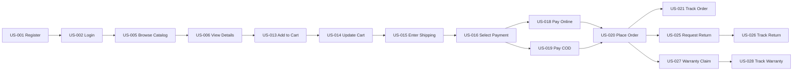
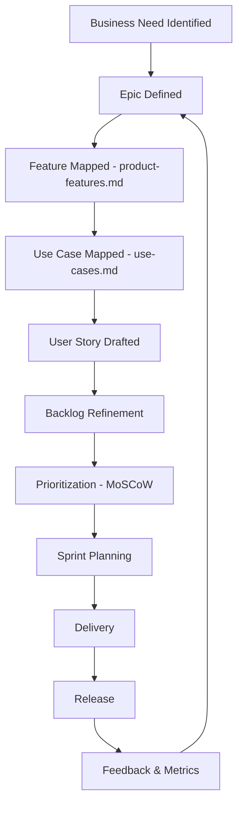

# User Stories

## 1. Document Purpose

This document is the official Agile User Stories backlog for **StackLeo Tech Store**. It defines the major user stories required to build the product, organized by Epic, and serves as the foundation for sprint planning, backlog management, UI/UX design, frontend development, backend development, QA testing, and release planning.

Every story in this document traces back to a feature in `product-features.md`, a use case in `use-cases.md`, and a persona in `user-personas.md`, ensuring the backlog remains grounded in validated business and user needs rather than speculative scope.

This document defines backlog content and Agile process only. It does not describe implementation approach, technology choices, API design, or database structure, all of which are addressed in dedicated technical documentation elsewhere in the repository.

## 2. Agile Methodology & Story Standards

### 2.1 INVEST Principles

Every story in this backlog is written to be:

- **Independent** — deliverable with minimal dependency on unrelated stories.
- **Negotiable** — a statement of need, not a rigid specification, allowing design and engineering to determine the best approach.
- **Valuable** — tied to a clear business or user value statement.
- **Estimable** — scoped clearly enough to assign a story point estimate.
- **Small** — sized to fit within a single sprint.
- **Testable** — expressed with clear, verifiable acceptance criteria.

### 2.2 Story Point Scale

Story points use a Fibonacci-inspired scale: **1, 2, 3, 5, 8, 13**. Points reflect relative effort and complexity, not calendar time, and are suggested estimates subject to team refinement.

### 2.3 Definition of Ready (DoR) — Standard Checklist

Unless a story specifies an addition, every story must meet this standard Definition of Ready before entering sprint planning:

1. The user story statement and business value are clearly articulated.
2. Acceptance criteria are written and reviewed.
3. Dependencies on other stories or modules are identified.
4. The story has been estimated by the team.
5. Design or UX input (where applicable) is available or explicitly not required.

### 2.4 Definition of Done (DoD) — Standard Checklist

Unless a story specifies an addition, every story must meet this standard Definition of Done before being considered complete:

1. All acceptance criteria pass verification.
2. The story has been reviewed against its related use case in `use-cases.md`.
3. Edge cases identified in the story have been addressed or explicitly deferred with rationale.
4. The story has been demonstrated to the Product Owner.
5. Any related documentation impacted by the story has been updated.

### 2.5 Story Classification

| Classification | Description |
|---|---|
| MVP | Required for the initial trustworthy B2C launch, per `00_Project_Overview/project-scope.md` and `product-roadmap.md` Phase 2. |
| Phase 2 | Business growth capability, per `product-roadmap.md` Phase 3. |
| Phase 3 | Enterprise and marketplace capability, per `product-roadmap.md` Phases 4–5. |
| Future | AI, international, and other long-horizon capability, per `product-roadmap.md` Phases 6–7. |

## 3. Epic Summary

| Epic | Story Count | Classification |
|---|---|---|
| Authentication | 2 | MVP |
| User Management | 2 | MVP |
| Product Catalog | 2 | MVP |
| Categories | 1 | MVP |
| Brands | 1 | MVP |
| Search | 1 | MVP |
| Filters | 1 | MVP |
| Wishlist | 1 | Phase 2 |
| Compare | 1 | Phase 2 |
| Cart | 2 | MVP |
| Checkout | 3 | MVP |
| Payments | 2 | MVP |
| Orders | 3 | MVP |
| Shipping | 2 | MVP |
| Returns | 2 | MVP |
| Warranty | 2 | MVP |
| Reviews | 1 | Phase 2 |
| Notifications | 1 | MVP |
| Customer Dashboard | 1 | MVP |
| Inventory | 2 | MVP |
| Reports | 1 | Phase 2 |
| Analytics | 1 | Phase 2 |
| Coupons | 1 | Phase 2 |
| Promotions | 2 | Phase 2 |
| Corporate Sales | 1 | Phase 3 |
| Marketplace (Future) | 2 | Phase 3 |
| AI Features (Future) | 2 | Future |

**Total Stories: 44**

---

## 4. User Stories by Epic

### 4.1 Epic: Authentication

#### US-001 — Register Account

- **Epic:** Authentication | **Feature:** FEAT-001 | **Persona:** PERSONA-001–012 (all individual customers)
- **User Story:** As a Guest, I want to register an account with my email or mobile number, so that I can place orders and track my purchase history.
- **Business Value:** Enables the core customer relationship and repeat purchasing.
- **Priority:** Must Have | **Story Points:** 5
- **Dependencies:** None
- **Preconditions:** Guest has not previously registered with the provided contact detail.
- **Acceptance Criteria:**
  - Given a Guest provides a valid, unregistered email or mobile number, When they submit the registration form, Then a verification code is sent.
  - Given a Guest enters a valid verification code, When they submit it, Then the account is activated.
  - Given a Guest enters an already-registered contact detail, When they submit the form, Then a clear error directs them to log in instead.
- **Edge Cases:** Verification code expires before entry; duplicate submission during network delay.
- **Related Use Cases:** UC-001
- **Related PRDs:** `product-requirements.md`
- **Definition of Ready:** Standard (Section 2.3)
- **Definition of Done:** Standard (Section 2.4)
- **Notes:** Must comply with `01_Business/business-rules.md` (BR-001–BR-003, BR-011).

#### US-002 — Login to Account

- **Epic:** Authentication | **Feature:** FEAT-001 | **Persona:** All Registered Customer personas
- **User Story:** As a Registered Customer, I want to log in with my credentials, so that I can access my account and shop.
- **Business Value:** Enables secure, repeatable access to the platform.
- **Priority:** Must Have | **Story Points:** 3
- **Dependencies:** US-001
- **Preconditions:** Customer holds a verified account.
- **Acceptance Criteria:**
  - Given valid credentials, When submitted, Then a session is established and the customer is redirected to their intended destination.
  - Given repeated invalid credential attempts, When the threshold is reached, Then the account is temporarily locked, per BR-005.
- **Edge Cases:** Password reset requested mid-login; simultaneous login from multiple devices.
- **Related Use Cases:** UC-002
- **Related PRDs:** `product-requirements.md`
- **Definition of Ready:** Standard (Section 2.3)
- **Definition of Done:** Standard (Section 2.4)
- **Notes:** None.

### 4.2 Epic: User Management

#### US-003 — Update Profile Information

- **Epic:** User Management | **Feature:** FEAT-003 | **Persona:** All Registered Customer personas
- **User Story:** As a Registered Customer, I want to update my profile information, so that my account stays accurate.
- **Business Value:** Improves order accuracy and customer communication reliability.
- **Priority:** Must Have | **Story Points:** 2
- **Dependencies:** US-002
- **Preconditions:** Customer is authenticated.
- **Acceptance Criteria:**
  - Given a customer edits their name or preferences, When they save, Then the profile updates immediately.
  - Given a customer edits their verified contact detail, When they save, Then re-verification is required before the change takes effect, per BR-012.
- **Edge Cases:** Attempted update to a contact detail already used by another account.
- **Related Use Cases:** UC-003
- **Related PRDs:** `product-requirements.md`
- **Definition of Ready:** Standard (Section 2.3)
- **Definition of Done:** Standard (Section 2.4)
- **Notes:** None.

#### US-004 — Manage Saved Addresses

- **Epic:** User Management | **Feature:** FEAT-004 | **Persona:** PERSONA-002, PERSONA-011 (University Student, Parent)
- **User Story:** As a Registered Customer, I want to save and manage multiple delivery addresses, so that checkout is faster for future orders.
- **Business Value:** Reduces checkout friction and supports repeat purchase behavior.
- **Priority:** Should Have | **Story Points:** 3
- **Dependencies:** US-003
- **Preconditions:** Customer is authenticated.
- **Acceptance Criteria:**
  - Given a customer adds a new address, When all required fields are complete, Then the address is saved and selectable at checkout.
  - Given a customer has multiple addresses, When they designate one as default, Then it is pre-selected at future checkouts.
- **Edge Cases:** Incomplete address submission; deletion of an address currently in use by a pending order.
- **Related Use Cases:** UC-003
- **Related PRDs:** `product-requirements.md`
- **Definition of Ready:** Standard (Section 2.3)
- **Definition of Done:** Standard (Section 2.4)
- **Notes:** Governed by BR-008, BR-009.

### 4.3 Epic: Product Catalog

#### US-005 — Browse Product Catalog

- **Epic:** Product Catalog | **Feature:** FEAT-008 | **Persona:** All personas
- **User Story:** As a Guest or Customer, I want to browse the product catalog, so that I can discover items I might want to purchase.
- **Business Value:** Core enabler of all product discovery and sales activity.
- **Priority:** Must Have | **Story Points:** 5
- **Dependencies:** None
- **Preconditions:** None.
- **Acceptance Criteria:**
  - Given the catalog contains published products, When a user opens the catalog view, Then products display with current price and availability.
  - Given a product is in Draft status, When a user browses the catalog, Then it does not appear, per BR-028.
- **Edge Cases:** Category with zero published products.
- **Related Use Cases:** UC-005
- **Related PRDs:** `product-requirements.md`
- **Definition of Ready:** Standard (Section 2.3)
- **Definition of Done:** Standard (Section 2.4)
- **Notes:** None.

#### US-006 — View Product Details

- **Epic:** Product Catalog | **Feature:** FEAT-008 | **Persona:** PERSONA-004, PERSONA-012 (Software Engineer, Tech Enthusiast)
- **User Story:** As a Customer, I want to view complete product details, so that I can make an informed purchase decision.
- **Business Value:** Reduces purchase hesitation and post-purchase dissatisfaction.
- **Priority:** Must Have | **Story Points:** 3
- **Dependencies:** US-005
- **Preconditions:** Product exists and is published.
- **Acceptance Criteria:**
  - Given a published product, When a user opens its detail page, Then specifications, price, availability, and reviews are displayed.
  - Given a product has variants, When a user selects a variant, Then price and availability update to reflect that variant.
- **Edge Cases:** Product is discontinued mid-session; variant becomes out of stock while page is open.
- **Related Use Cases:** UC-006
- **Related PRDs:** `product-requirements.md`
- **Definition of Ready:** Standard (Section 2.3)
- **Definition of Done:** Standard (Section 2.4)
- **Notes:** Governed by BR-013, BR-014, BR-018, BR-029.

### 4.4 Epic: Categories

#### US-007 — Browse Products by Category

- **Epic:** Categories | **Feature:** FEAT-009 | **Persona:** PERSONA-010 (Home User)
- **User Story:** As a Customer, I want to browse products by category, so that I can quickly narrow down to what I need.
- **Business Value:** Improves discoverability for customers without a specific search term.
- **Priority:** Must Have | **Story Points:** 3
- **Dependencies:** US-005
- **Preconditions:** Category exists with published products.
- **Acceptance Criteria:**
  - Given a customer selects a category, When the page loads, Then only correctly associated products display.
- **Edge Cases:** Category-product linkage broken due to a data update.
- **Related Use Cases:** UC-007
- **Related PRDs:** `product-requirements.md`
- **Definition of Ready:** Standard (Section 2.3)
- **Definition of Done:** Standard (Section 2.4)
- **Notes:** Governed by BR-016, BR-017.

### 4.5 Epic: Brands

#### US-008 — Browse Products by Brand

- **Epic:** Brands | **Feature:** FEAT-010 | **Persona:** PERSONA-007 (Photographer)
- **User Story:** As a Customer, I want to browse products by brand, so that I can find products from brands I trust.
- **Business Value:** Reinforces authenticity assurance and brand-driven purchase decisions.
- **Priority:** Should Have | **Story Points:** 2
- **Dependencies:** US-005
- **Preconditions:** Brand record exists with associated products.
- **Acceptance Criteria:**
  - Given a customer selects a brand, When the page loads, Then only verified products from that brand display.
- **Edge Cases:** Brand association pending approval.
- **Related Use Cases:** UC-008
- **Related PRDs:** `product-requirements.md`
- **Definition of Ready:** Standard (Section 2.3)
- **Definition of Done:** Standard (Section 2.4)
- **Notes:** Governed by BR-015.

### 4.6 Epic: Search

#### US-009 — Search for Products by Keyword

- **Epic:** Search | **Feature:** FEAT-011 | **Persona:** All personas
- **User Story:** As a Customer, I want to search for products by keyword, so that I can quickly find what I'm looking for.
- **Business Value:** Reduces time-to-purchase and search abandonment.
- **Priority:** Must Have | **Story Points:** 5
- **Dependencies:** US-005
- **Preconditions:** None.
- **Acceptance Criteria:**
  - Given a customer enters a matching keyword, When they submit the search, Then relevant, ranked results are displayed.
  - Given a customer enters a keyword with no matches, When they submit the search, Then a clear no-results state is shown with suggested categories.
- **Edge Cases:** Misspelled search terms; searches with special characters.
- **Related Use Cases:** UC-009
- **Related PRDs:** `product-requirements.md`
- **Definition of Ready:** Standard (Section 2.3)
- **Definition of Done:** Standard (Section 2.4)
- **Notes:** Future enhancement path toward AI Search (US-043).

### 4.7 Epic: Filters

#### US-010 — Filter Search and Catalog Results

- **Epic:** Filters | **Feature:** FEAT-012 | **Persona:** PERSONA-003, PERSONA-004 (Gamer, Software Engineer)
- **User Story:** As a Customer, I want to filter results by price, brand, and attributes, so that I can narrow down to relevant products faster.
- **Business Value:** Improves discovery precision, particularly for large catalogs.
- **Priority:** Should Have | **Story Points:** 5
- **Dependencies:** US-009
- **Preconditions:** A result set (search or category) is displayed.
- **Acceptance Criteria:**
  - Given a customer applies a price filter, When applied, Then only products within that range display.
  - Given a customer applies multiple filters, When combined, Then results reflect all applied criteria.
- **Edge Cases:** Filter combination returns zero results.
- **Related Use Cases:** UC-010
- **Related PRDs:** `product-requirements.md`
- **Definition of Ready:** Standard (Section 2.3)
- **Definition of Done:** Standard (Section 2.4)
- **Notes:** Governed by BR-020.

### 4.8 Epic: Wishlist

#### US-011 — Save Products to Wishlist

- **Epic:** Wishlist | **Feature:** FEAT-005 | **Persona:** PERSONA-001, PERSONA-012 (Student, Tech Enthusiast)
- **User Story:** As a Registered Customer, I want to save products to a wishlist, so that I can consider them for a future purchase.
- **Business Value:** Increases return visits and future conversion.
- **Priority:** Could Have | **Story Points:** 3
- **Dependencies:** US-002, US-006
- **Preconditions:** Customer is authenticated.
- **Acceptance Criteria:**
  - Given a customer selects "Add to Wishlist," When confirmed, Then the product appears in their wishlist.
  - Given a wishlist item becomes out of stock, When the customer views their wishlist, Then its status is clearly indicated.
- **Edge Cases:** Wishlisted product is discontinued.
- **Related Use Cases:** UC-011
- **Related PRDs:** `product-requirements.md`
- **Definition of Ready:** Standard (Section 2.3)
- **Definition of Done:** Standard (Section 2.4)
- **Notes:** Classified Phase 2 per `product-roadmap.md`.

### 4.9 Epic: Compare

#### US-012 — Compare Products Side by Side

- **Epic:** Compare | **Feature:** FEAT-006 | **Persona:** PERSONA-003, PERSONA-004 (Gamer, Software Engineer)
- **User Story:** As a Customer, I want to compare multiple products side by side, so that I can choose the best option confidently.
- **Business Value:** Improves purchase confidence and reduces post-purchase regret.
- **Priority:** Could Have | **Story Points:** 5
- **Dependencies:** US-006
- **Preconditions:** At least two comparable products are selected.
- **Acceptance Criteria:**
  - Given two comparable products are selected, When the customer opens comparison, Then specifications display side by side.
- **Edge Cases:** Products from incompatible categories selected for comparison.
- **Related Use Cases:** UC-012
- **Related PRDs:** `product-requirements.md`
- **Definition of Ready:** Standard (Section 2.3)
- **Definition of Done:** Standard (Section 2.4)
- **Notes:** Classified Phase 2 per `product-roadmap.md`.

### 4.10 Epic: Cart

#### US-013 — Add Product to Cart

- **Epic:** Cart | **Feature:** FEAT-015 | **Persona:** All personas
- **User Story:** As a Customer, I want to add a product to my cart, so that I can purchase it along with other items.
- **Business Value:** Core enabler of multi-item purchasing and order value.
- **Priority:** Must Have | **Story Points:** 3
- **Dependencies:** US-006
- **Preconditions:** Product/variant is in stock.
- **Acceptance Criteria:**
  - Given sufficient stock, When a customer adds a product to cart, Then it appears with the correct quantity and price.
  - Given insufficient stock, When a customer attempts to add more than available, Then the quantity is capped with a clear message.
- **Edge Cases:** Stock changes between page load and add-to-cart action.
- **Related Use Cases:** UC-013
- **Related PRDs:** `product-requirements.md`
- **Definition of Ready:** Standard (Section 2.3)
- **Definition of Done:** Standard (Section 2.4)
- **Notes:** Governed by BR-040, BR-041.

#### US-014 — Update Cart Contents

- **Epic:** Cart | **Feature:** FEAT-015 | **Persona:** All personas
- **User Story:** As a Customer, I want to update quantities or remove items in my cart, so that my order reflects exactly what I want to buy.
- **Business Value:** Reduces checkout errors and cart abandonment.
- **Priority:** Must Have | **Story Points:** 2
- **Dependencies:** US-013
- **Preconditions:** Cart contains at least one item.
- **Acceptance Criteria:**
  - Given a customer changes an item's quantity, When updated, Then the cart total recalculates immediately.
  - Given a customer removes an item, When confirmed, Then it no longer appears in the cart.
- **Edge Cases:** Quantity updated to exceed newly reduced stock.
- **Related Use Cases:** UC-014
- **Related PRDs:** `product-requirements.md`
- **Definition of Ready:** Standard (Section 2.3)
- **Definition of Done:** Standard (Section 2.4)
- **Notes:** Governed by BR-045, BR-046.

### 4.11 Epic: Checkout

#### US-015 — Enter Shipping Details at Checkout

- **Epic:** Checkout | **Feature:** FEAT-016 | **Persona:** All personas
- **User Story:** As a Customer, I want to confirm or enter my shipping address during checkout, so that my order is delivered correctly.
- **Business Value:** Reduces failed deliveries and support inquiries.
- **Priority:** Must Have | **Story Points:** 3
- **Dependencies:** US-004, US-014
- **Preconditions:** Cart contains at least one valid item.
- **Acceptance Criteria:**
  - Given a saved address exists, When checkout loads, Then the default address is pre-selected.
  - Given an address is outside the serviceable delivery area, When selected, Then the customer is notified and offered store pickup where available.
- **Edge Cases:** Address is valid but courier coverage is temporarily disrupted.
- **Related Use Cases:** UC-015
- **Related PRDs:** `product-requirements.md`
- **Definition of Ready:** Standard (Section 2.3)
- **Definition of Done:** Standard (Section 2.4)
- **Notes:** Governed by BR-049, BR-075.

#### US-016 — Select Payment Method at Checkout

- **Epic:** Checkout | **Feature:** FEAT-016 | **Persona:** All personas
- **User Story:** As a Customer, I want to select my preferred payment method, so that I can pay in the way that suits me best.
- **Business Value:** Reduces checkout abandonment due to payment inflexibility.
- **Priority:** Must Have | **Story Points:** 3
- **Dependencies:** US-015
- **Preconditions:** Shipping details are confirmed.
- **Acceptance Criteria:**
  - Given COD is eligible for the order, When the customer selects it, Then it is confirmed without requiring online payment.
  - Given a digital payment method is selected, When chosen, Then the customer proceeds to payment processing, per US-017.
- **Edge Cases:** COD ineligible due to order value or delivery zone.
- **Related Use Cases:** UC-015
- **Related PRDs:** `product-requirements.md`
- **Definition of Ready:** Standard (Section 2.3)
- **Definition of Done:** Standard (Section 2.4)
- **Notes:** Governed by BR-050, BR-055.

#### US-017 — Confirm and Place Order

- **Epic:** Checkout | **Feature:** FEAT-016 | **Persona:** All personas
- **User Story:** As a Customer, I want to review and confirm my order before it is placed, so that I can catch any mistakes beforehand.
- **Business Value:** Reduces order errors and cancellations.
- **Priority:** Must Have | **Story Points:** 3
- **Dependencies:** US-016
- **Preconditions:** Shipping and payment details are confirmed.
- **Acceptance Criteria:**
  - Given all checkout details are valid, When the customer confirms, Then final stock and price are re-validated before order creation.
  - Given stock has changed since cart review, When re-validated, Then the customer is notified before the order is finalized.
- **Edge Cases:** Price changes between cart review and final confirmation.
- **Related Use Cases:** UC-015
- **Related PRDs:** `product-requirements.md`
- **Definition of Ready:** Standard (Section 2.3)
- **Definition of Done:** Standard (Section 2.4)
- **Notes:** Governed by BR-051, BR-052, BR-053.

### 4.12 Epic: Payments

#### US-018 — Pay Online for an Order

- **Epic:** Payments | **Feature:** FEAT-028 | **Persona:** PERSONA-004, PERSONA-005 (Software Engineer, Freelancer)
- **User Story:** As a Customer, I want to pay for my order online, so that I can complete my purchase without needing cash on delivery.
- **Business Value:** Reduces COD-related fulfillment risk and expands payment convenience.
- **Priority:** Must Have | **Story Points:** 5
- **Dependencies:** US-017
- **Preconditions:** Checkout details are confirmed and a digital payment method is selected.
- **Acceptance Criteria:**
  - Given valid payment details, When submitted, Then the Payment Gateway confirms success and the order proceeds.
  - Given payment fails or times out, When this occurs, Then the order is not confirmed and reserved stock is released.
- **Edge Cases:** Payment succeeds at the gateway but confirmation is delayed in reaching StackLeo.
- **Related Use Cases:** UC-017
- **Related PRDs:** `product-requirements.md`
- **Definition of Ready:** Standard (Section 2.3)
- **Definition of Done:** Standard (Section 2.4)
- **Notes:** Governed by BR-057–BR-059.

#### US-019 — Pay via Cash on Delivery

- **Epic:** Payments | **Feature:** FEAT-027 | **Persona:** PERSONA-001, PERSONA-010 (Student, Home User)
- **User Story:** As a Customer, I want to pay in cash when my order is delivered, so that I don't need to pay online in advance.
- **Business Value:** Accommodates customers hesitant to pay digitally upfront, expanding addressable market.
- **Priority:** Must Have | **Story Points:** 2
- **Dependencies:** US-016
- **Preconditions:** COD is eligible for the delivery area and order value.
- **Acceptance Criteria:**
  - Given COD eligibility, When selected, Then the order is confirmed as "Placed" pending delivery-time payment.
- **Edge Cases:** Order value exceeds the COD eligibility threshold.
- **Related Use Cases:** UC-018
- **Related PRDs:** `product-requirements.md`
- **Definition of Ready:** Standard (Section 2.3)
- **Definition of Done:** Standard (Section 2.4)
- **Notes:** Governed by BR-055, BR-056.

### 4.13 Epic: Orders

#### US-020 — Place an Order

- **Epic:** Orders | **Feature:** FEAT-020 | **Persona:** All personas
- **User Story:** As a Customer, I want my order to be confirmed after checkout, so that I know my purchase was successful.
- **Business Value:** Core transactional confirmation underpinning customer trust.
- **Priority:** Must Have | **Story Points:** 3
- **Dependencies:** US-018, US-019
- **Preconditions:** Payment is confirmed or COD is selected.
- **Acceptance Criteria:**
  - Given a successful checkout, When payment/COD is confirmed, Then an order record is created with a unique reference.
  - Given an order is created, When completed, Then a confirmation notification is sent to the customer.
- **Edge Cases:** Notification delivery failure despite successful order creation.
- **Related Use Cases:** UC-019
- **Related PRDs:** `product-requirements.md`
- **Definition of Ready:** Standard (Section 2.3)
- **Definition of Done:** Standard (Section 2.4)
- **Notes:** Governed by BR-053, BR-054, BR-064.

#### US-021 — Track Order Status

- **Epic:** Orders | **Feature:** FEAT-021 | **Persona:** All personas
- **User Story:** As a Customer, I want to track my order's status, so that I know when to expect delivery.
- **Business Value:** Reduces support inquiries and builds delivery trust.
- **Priority:** Must Have | **Story Points:** 3
- **Dependencies:** US-020
- **Preconditions:** Order has been confirmed.
- **Acceptance Criteria:**
  - Given a confirmed order, When the customer opens order details, Then the current delivery status lifecycle stage is shown.
- **Edge Cases:** Status has not updated for an unusually long period.
- **Related Use Cases:** UC-020
- **Related PRDs:** `product-requirements.md`
- **Definition of Ready:** Standard (Section 2.3)
- **Definition of Done:** Standard (Section 2.4)
- **Notes:** Governed by BR-076.

#### US-022 — Cancel an Order

- **Epic:** Orders | **Feature:** FEAT-020 | **Persona:** All personas
- **User Story:** As a Customer, I want to cancel my order before it ships, so that I'm not charged for something I no longer want.
- **Business Value:** Improves customer flexibility and reduces disputed charges.
- **Priority:** Must Have | **Story Points:** 3
- **Dependencies:** US-020
- **Preconditions:** Order has not yet entered Shipped status.
- **Acceptance Criteria:**
  - Given an order in Processing status, When the customer requests cancellation, Then the order is cancelled and stock/payment are released or refunded.
  - Given an order has already shipped, When cancellation is requested, Then the customer is redirected to the return process instead.
- **Edge Cases:** Cancellation requested at the exact moment the order transitions to Shipped.
- **Related Use Cases:** UC-021
- **Related PRDs:** `product-requirements.md`
- **Definition of Ready:** Standard (Section 2.3)
- **Definition of Done:** Standard (Section 2.4)
- **Notes:** Governed by BR-066–BR-068.

### 4.14 Epic: Shipping

#### US-023 — Automatic Courier Assignment

- **Epic:** Shipping | **Feature:** FEAT-035 | **Persona:** Operations Manager (internal)
- **User Story:** As the platform, I want to automatically assign a confirmed order to the best available courier, so that delivery is reliable and efficient.
- **Business Value:** Reduces manual operational overhead and improves delivery reliability.
- **Priority:** Must Have | **Story Points:** 5
- **Dependencies:** US-020
- **Preconditions:** Order has been packed and is ready for dispatch.
- **Acceptance Criteria:**
  - Given a packed order, When courier assignment runs, Then the best-available courier for the delivery zone is assigned.
  - Given the preferred courier cannot service the order, When this is detected, Then a fallback courier is assigned automatically.
- **Edge Cases:** All courier partners report unavailability for a given zone simultaneously.
- **Related Use Cases:** UC-022
- **Related PRDs:** `product-requirements.md`
- **Definition of Ready:** Standard (Section 2.3)
- **Definition of Done:** Standard (Section 2.4)
- **Notes:** Governed by BR-074.

#### US-024 — Receive Delivery Status Notifications

- **Epic:** Shipping | **Feature:** FEAT-036, FEAT-040 | **Persona:** PERSONA-005 (Freelancer)
- **User Story:** As a Customer, I want to receive notifications about my delivery progress, so that I can plan to receive it.
- **Business Value:** Reduces failed deliveries and support inquiries.
- **Priority:** Must Have | **Story Points:** 3
- **Dependencies:** US-023
- **Preconditions:** Order has been handed to a courier.
- **Acceptance Criteria:**
  - Given a significant status change (e.g., Out for Delivery), When it occurs, Then the customer receives an SMS/email notification.
- **Edge Cases:** Notification service outage during a critical delivery window.
- **Related Use Cases:** UC-023
- **Related PRDs:** `product-requirements.md`
- **Definition of Ready:** Standard (Section 2.3)
- **Definition of Done:** Standard (Section 2.4)
- **Notes:** Governed by BR-076, BR-121.

### 4.15 Epic: Returns

#### US-025 — Request a Product Return

- **Epic:** Returns | **Feature:** FEAT-023 | **Persona:** PERSONA-011 (Parent)
- **User Story:** As a Customer, I want to request a return for an eligible product, so that I can get a refund or replacement if something is wrong.
- **Business Value:** Preserves customer trust after purchase and reduces disputes.
- **Priority:** Must Have | **Story Points:** 5
- **Dependencies:** US-020
- **Preconditions:** Order is within the applicable return window.
- **Acceptance Criteria:**
  - Given an order within the return window, When a customer submits a return request with a valid reason, Then the request enters verification.
  - Given a return window has expired, When a customer attempts to submit a request, Then it is blocked with a clear explanation.
- **Edge Cases:** Item is marked non-returnable but the actual issue is a manufacturer defect.
- **Related Use Cases:** UC-024
- **Related PRDs:** `product-requirements.md`
- **Definition of Ready:** Standard (Section 2.3)
- **Definition of Done:** Standard (Section 2.4)
- **Notes:** Governed by BR-RET-001–BR-RET-007.

#### US-026 — Track Return and Refund Status

- **Epic:** Returns | **Feature:** FEAT-023, FEAT-024 | **Persona:** PERSONA-011 (Parent)
- **User Story:** As a Customer, I want to track the status of my return and refund, so that I know when to expect resolution.
- **Business Value:** Reduces support inquiries and builds trust in the resolution process.
- **Priority:** Must Have | **Story Points:** 3
- **Dependencies:** US-025
- **Preconditions:** A return request has been submitted.
- **Acceptance Criteria:**
  - Given a submitted return, When the customer views their dashboard, Then the current return status is displayed.
  - Given a return is approved for refund, When processed, Then the customer sees updated refund status.
- **Edge Cases:** Refund status inconsistent with return status due to processing delay.
- **Related Use Cases:** UC-025
- **Related PRDs:** `product-requirements.md`
- **Definition of Ready:** Standard (Section 2.3)
- **Definition of Done:** Standard (Section 2.4)
- **Notes:** Governed by BR-RET-024–BR-RET-027.

### 4.16 Epic: Warranty

#### US-027 — Submit a Warranty Claim

- **Epic:** Warranty | **Feature:** FEAT-026 | **Persona:** PERSONA-007 (Photographer)
- **User Story:** As a Customer, I want to submit a warranty claim for a defective product, so that I can get it repaired or replaced.
- **Business Value:** Reinforces trust in product authenticity and after-sales support.
- **Priority:** Must Have | **Story Points:** 5
- **Dependencies:** US-020
- **Preconditions:** Product is within its applicable warranty period.
- **Acceptance Criteria:**
  - Given a product within warranty, When a customer submits a claim with required documentation, Then the claim enters verification and inspection.
  - Given a claim reason is explicitly excluded (e.g., physical damage), When submitted, Then the customer is informed of likely rejection with policy reference.
- **Edge Cases:** Serial number on the product does not match the original sale record.
- **Related Use Cases:** UC-027
- **Related PRDs:** `product-requirements.md`
- **Definition of Ready:** Standard (Section 2.3)
- **Definition of Done:** Standard (Section 2.4)
- **Notes:** Governed by WR-012–WR-021.

#### US-028 — Track Warranty Claim Status

- **Epic:** Warranty | **Feature:** FEAT-026 | **Persona:** PERSONA-007 (Photographer)
- **User Story:** As a Customer, I want to track my warranty claim status, so that I know when my product will be repaired or replaced.
- **Business Value:** Reduces support inquiries and improves perceived service quality.
- **Priority:** Must Have | **Story Points:** 3
- **Dependencies:** US-027
- **Preconditions:** A warranty claim has been submitted.
- **Acceptance Criteria:**
  - Given a submitted claim, When the customer checks status, Then the current warranty status lifecycle stage is shown.
- **Edge Cases:** Claim status stalls at "Inspection" beyond expected SLA.
- **Related Use Cases:** UC-028
- **Related PRDs:** `product-requirements.md`
- **Definition of Ready:** Standard (Section 2.3)
- **Definition of Done:** Standard (Section 2.4)
- **Notes:** Governed by WR-039, WR-040.

### 4.17 Epic: Reviews

#### US-029 — Submit a Product Review

- **Epic:** Reviews | **Feature:** FEAT-038 | **Persona:** PERSONA-006 (Content Creator)
- **User Story:** As a Customer, I want to submit a review for a product I purchased, so that I can share my experience with other shoppers.
- **Business Value:** Builds catalog-wide trust signals and informs future buyers.
- **Priority:** Should Have | **Story Points:** 3
- **Dependencies:** US-020
- **Preconditions:** Customer has a completed order for the product.
- **Acceptance Criteria:**
  - Given a completed order, When the customer submits a rating and review, Then it enters moderation before publishing.
  - Given a review violates content guidelines, When moderated, Then it is rejected with a reason.
- **Edge Cases:** Customer attempts to submit multiple reviews for the same purchase.
- **Related Use Cases:** UC-029
- **Related PRDs:** `product-requirements.md`
- **Definition of Ready:** Standard (Section 2.3)
- **Definition of Done:** Standard (Section 2.4)
- **Notes:** Governed by BR-088–BR-092. Classified Phase 2.

### 4.18 Epic: Notifications

#### US-030 — Manage Notification Preferences

- **Epic:** Notifications | **Feature:** FEAT-040 | **Persona:** All personas
- **User Story:** As a Customer, I want to control which notifications I receive and through which channel, so that I only get communication that's relevant to me.
- **Business Value:** Improves customer satisfaction while maintaining critical communication delivery.
- **Priority:** Should Have | **Story Points:** 3
- **Dependencies:** US-002
- **Preconditions:** Customer is authenticated.
- **Acceptance Criteria:**
  - Given a customer opts out of marketing notifications, When saved, Then only transactional notifications continue.
- **Edge Cases:** Customer attempts to opt out of critical transactional notifications (e.g., order confirmation).
- **Related Use Cases:** UC-030
- **Related PRDs:** `product-requirements.md`
- **Definition of Ready:** Standard (Section 2.3)
- **Definition of Done:** Standard (Section 2.4)
- **Notes:** Governed by BR-120–BR-123.

### 4.19 Epic: Customer Dashboard

#### US-031 — View Consolidated Account Overview

- **Epic:** Customer Dashboard | **Feature:** FEAT-021, FEAT-023, FEAT-026 | **Persona:** All personas
- **User Story:** As a Customer, I want a single dashboard showing my orders, returns, and warranty status, so that I don't have to search across multiple pages.
- **Business Value:** Improves post-purchase experience and reduces support burden.
- **Priority:** Must Have | **Story Points:** 5
- **Dependencies:** US-020, US-025, US-027
- **Preconditions:** Customer is authenticated.
- **Acceptance Criteria:**
  - Given a customer with order history, When they open their dashboard, Then orders, returns, and warranty statuses are aggregated in one place.
- **Edge Cases:** One underlying data source (e.g., Warranty) is temporarily unavailable.
- **Related Use Cases:** UC-031
- **Related PRDs:** `product-requirements.md`
- **Definition of Ready:** Standard (Section 2.3)
- **Definition of Done:** Standard (Section 2.4)
- **Notes:** Governed by BR-073.

### 4.20 Epic: Inventory

#### US-032 — View Real-Time Stock Levels (Internal)

- **Epic:** Inventory | **Feature:** FEAT-032 | **Persona:** Inventory Manager (internal)
- **User Story:** As an Inventory Manager, I want to view real-time stock levels, so that I can prevent overselling and plan replenishment.
- **Business Value:** Reduces overselling incidents and improves fulfillment reliability.
- **Priority:** Must Have | **Story Points:** 5
- **Dependencies:** None
- **Preconditions:** None; ongoing operational need.
- **Acceptance Criteria:**
  - Given a confirmed order, When stock is deducted, Then the inventory view reflects the change in near real time.
  - Given stock falls below a defined threshold, When this occurs, Then a low-stock alert is generated.
- **Edge Cases:** Stock discrepancy between system record and physical count.
- **Related Use Cases:** UC-032
- **Related PRDs:** `product-requirements.md`
- **Definition of Ready:** Standard (Section 2.3)
- **Definition of Done:** Standard (Section 2.4)
- **Notes:** Governed by BR-030–BR-037.

#### US-033 — Adjust Inventory Records (Internal)

- **Epic:** Inventory | **Feature:** FEAT-032, FEAT-034 | **Persona:** Inventory Manager (internal)
- **User Story:** As an Inventory Manager, I want to make authorized stock adjustments, so that inventory records remain accurate after discrepancies or transfers.
- **Business Value:** Maintains inventory accuracy and audit accountability.
- **Priority:** Must Have | **Story Points:** 3
- **Dependencies:** US-032
- **Preconditions:** A discrepancy or transfer requirement has been identified.
- **Acceptance Criteria:**
  - Given an adjustment with a recorded reason, When submitted below the authorization threshold, Then it is applied directly.
  - Given an adjustment exceeds the authorization threshold, When submitted, Then Admin approval is required before it is applied.
- **Edge Cases:** Adjustment submitted without a justification reason.
- **Related Use Cases:** UC-033
- **Related PRDs:** `product-requirements.md`
- **Definition of Ready:** Standard (Section 2.3)
- **Definition of Done:** Standard (Section 2.4)
- **Notes:** Governed by BR-038, BR-039.

### 4.21 Epic: Reports

#### US-034 — Generate Standard Business Reports (Internal)

- **Epic:** Reports | **Feature:** FEAT-051 | **Persona:** Finance Officer, Business Analyst (internal)
- **User Story:** As a Finance Officer, I want to generate standard sales and inventory reports, so that I can support business decision-making.
- **Business Value:** Enables data-informed operational and financial decisions.
- **Priority:** Should Have | **Story Points:** 5
- **Dependencies:** US-020, US-032
- **Preconditions:** Underlying data exists for the reporting period.
- **Acceptance Criteria:**
  - Given a selected report type and period, When generated, Then the report reflects accurate, complete data for that period.
- **Edge Cases:** Underlying data is incomplete for part of the requested period.
- **Related Use Cases:** UC-034
- **Related PRDs:** `product-requirements.md`
- **Definition of Ready:** Standard (Section 2.3)
- **Definition of Done:** Standard (Section 2.4)
- **Notes:** Governed by BR-115–BR-119. Classified Phase 2.

### 4.22 Epic: Analytics

#### US-035 — View Customer & Sales Analytics (Internal)

- **Epic:** Analytics | **Feature:** FEAT-052 | **Persona:** Marketing Manager, Business Analyst (internal)
- **User Story:** As a Marketing Manager, I want to view behavioral and sales analytics, so that I can plan effective campaigns.
- **Business Value:** Improves marketing ROI and strategic planning accuracy.
- **Priority:** Should Have | **Story Points:** 8
- **Dependencies:** US-034
- **Preconditions:** Sufficient behavioral and transactional data exists.
- **Acceptance Criteria:**
  - Given available data, When the analytics dashboard is opened, Then behavioral and performance insights are displayed.
- **Edge Cases:** Data quality issues undermine insight reliability.
- **Related Use Cases:** UC-035
- **Related PRDs:** `product-requirements.md`
- **Definition of Ready:** Standard (Section 2.3)
- **Definition of Done:** Standard (Section 2.4)
- **Notes:** Governed by BR-117. Classified Phase 2.

### 4.23 Epic: Coupons

#### US-036 — Apply a Coupon Code

- **Epic:** Coupons | **Feature:** FEAT-017 | **Persona:** PERSONA-001, PERSONA-002 (Student, University Student)
- **User Story:** As a Customer, I want to apply a coupon code to my order, so that I can receive a discount.
- **Business Value:** Drives promotional conversion and campaign performance.
- **Priority:** Should Have | **Story Points:** 3
- **Dependencies:** US-014
- **Preconditions:** A valid, active coupon code exists.
- **Acceptance Criteria:**
  - Given a valid, eligible coupon, When applied, Then the order total reflects the discount.
  - Given an expired or ineligible coupon, When applied, Then a clear error message is shown.
- **Edge Cases:** Attempting to stack a non-stackable coupon with an active promotion.
- **Related Use Cases:** UC-016, UC-036
- **Related PRDs:** `product-requirements.md`
- **Definition of Ready:** Standard (Section 2.3)
- **Definition of Done:** Standard (Section 2.4)
- **Notes:** Governed by BR-042, BR-093, BR-094. Classified Phase 2.

### 4.24 Epic: Promotions

#### US-037 — Create a Promotional Campaign (Internal)

- **Epic:** Promotions | **Feature:** FEAT-018 | **Persona:** Marketing Manager (internal)
- **User Story:** As a Marketing Manager, I want to create a time-bound promotional campaign, so that I can drive sales during key periods.
- **Business Value:** Increases order volume during targeted periods.
- **Priority:** Should Have | **Story Points:** 5
- **Dependencies:** None
- **Preconditions:** A campaign concept and target products are defined.
- **Acceptance Criteria:**
  - Given campaign parameters are configured, When submitted, Then Admin approval is required before activation.
  - Given a campaign is approved, When its start time arrives, Then it activates automatically.
- **Edge Cases:** Campaign parameters conflict with an existing active promotion on the same products.
- **Related Use Cases:** UC-037
- **Related PRDs:** `product-requirements.md`
- **Definition of Ready:** Standard (Section 2.3)
- **Definition of Done:** Standard (Section 2.4)
- **Notes:** Governed by BR-095. Classified Phase 2.

#### US-038 — Shop a Flash Sale

- **Epic:** Promotions | **Feature:** FEAT-018 | **Persona:** PERSONA-003, PERSONA-012 (Gamer, Tech Enthusiast)
- **User Story:** As a Customer, I want to purchase products during a flash sale, so that I can get a limited-time deal.
- **Business Value:** Drives urgency-based conversion and inventory clearance.
- **Priority:** Should Have | **Story Points:** 5
- **Dependencies:** US-037
- **Preconditions:** A flash sale is active with dedicated stock allocation.
- **Acceptance Criteria:**
  - Given an active flash sale, When a customer purchases within the sale window, Then the flash sale price is honored.
  - Given the flash sale's allocated stock is exhausted, When this occurs, Then the sale ends early for that product without affecting standard inventory.
- **Edge Cases:** Customer's checkout session spans the flash sale's end time.
- **Related Use Cases:** UC-038
- **Related PRDs:** `product-requirements.md`
- **Definition of Ready:** Standard (Section 2.3)
- **Definition of Done:** Standard (Section 2.4)
- **Notes:** Governed by BR-096, BR-097. Classified Phase 2.

### 4.25 Epic: Corporate Sales (Future)

#### US-039 — Place a Corporate Bulk Order (Future)

- **Epic:** Corporate Sales | **Feature:** FEAT-055 | **Persona:** PERSONA-013–017 (Startup Founder through Government Organization)
- **User Story:** As a Corporate Buyer, I want to place a bulk order under negotiated pricing, so that I can equip my organization efficiently.
- **Business Value:** Opens a new, underserved revenue segment.
- **Priority:** Won't Have (Current Release) | **Story Points:** 8
- **Dependencies:** A corporate account with agreed terms exists.
- **Preconditions:** Corporate sales capability is active.
- **Acceptance Criteria:**
  - Given an approved corporate account, When a bulk order is submitted, Then it is validated against negotiated pricing and a formal invoice is issued.
- **Edge Cases:** Requested quantity exceeds both available stock and agreed terms.
- **Related Use Cases:** UC-039
- **Related PRDs:** `product-requirements.md`
- **Definition of Ready:** Standard (Section 2.3), plus confirmed corporate account terms.
- **Definition of Done:** Standard (Section 2.4)
- **Notes:** Not yet active; targeted for Phase 4 per `product-roadmap.md`.

### 4.26 Epic: Marketplace (Future)

#### US-040 — Seller Onboarding (Future)

- **Epic:** Marketplace | **Feature:** FEAT-056 | **Persona:** PERSONA-018 (Marketplace Seller)
- **User Story:** As a prospective Marketplace Seller, I want to apply and get verified to sell on StackLeo, so that I can reach StackLeo's customer base.
- **Business Value:** Expands catalog breadth and introduces marketplace commission revenue.
- **Priority:** Won't Have (Current Release) | **Story Points:** 8
- **Dependencies:** Marketplace capability is active.
- **Preconditions:** None.
- **Acceptance Criteria:**
  - Given a submitted application with valid documentation, When reviewed, Then the seller account is approved and activated.
  - Given incomplete or failed verification, When reviewed, Then the application is rejected or returned for correction.
- **Edge Cases:** Seller resubmits after an initial rejection.
- **Related Use Cases:** UC-040
- **Related PRDs:** `product-requirements.md`
- **Definition of Ready:** Standard (Section 2.3)
- **Definition of Done:** Standard (Section 2.4)
- **Notes:** Not yet active; targeted for Phase 5 per `product-roadmap.md`.

#### US-041 — List a Product for Sale (Future)

- **Epic:** Marketplace | **Feature:** FEAT-057 | **Persona:** PERSONA-018 (Marketplace Seller)
- **User Story:** As a Marketplace Seller, I want to list a product for sale, so that customers can discover and purchase it.
- **Business Value:** Grows marketplace catalog breadth while preserving authenticity standards.
- **Priority:** Won't Have (Current Release) | **Story Points:** 8
- **Dependencies:** US-040
- **Preconditions:** Seller account is approved and active.
- **Acceptance Criteria:**
  - Given a submitted listing, When reviewed by Admin, Then it is approved and published, or returned with specific feedback.
- **Edge Cases:** Listing uses a brand the seller is not authorized to sell.
- **Related Use Cases:** UC-041
- **Related PRDs:** `product-requirements.md`
- **Definition of Ready:** Standard (Section 2.3)
- **Definition of Done:** Standard (Section 2.4)
- **Notes:** Not yet active; targeted for Phase 5 per `product-roadmap.md`.

### 4.27 Epic: AI Features (Future)

#### US-042 — Receive AI-Powered Product Recommendations (Future)

- **Epic:** AI Features | **Feature:** FEAT-060 | **Persona:** PERSONA-012 (Tech Enthusiast)
- **User Story:** As a Customer, I want to receive personalized product recommendations, so that I can discover relevant products more easily.
- **Business Value:** Increases conversion and average order value.
- **Priority:** Won't Have (Current Release) | **Story Points:** 13
- **Dependencies:** Sufficient historical behavior and catalog data exists.
- **Preconditions:** AI Services module is active.
- **Acceptance Criteria:**
  - Given sufficient behavioral data, When a customer browses the catalog, Then relevant recommendations are displayed.
  - Given insufficient personal data, When this occurs, Then category-level popularity is used instead.
- **Edge Cases:** Recommendation confidence is too low to display meaningfully.
- **Related Use Cases:** UC-042
- **Related PRDs:** `product-requirements.md`
- **Definition of Ready:** Standard (Section 2.3)
- **Definition of Done:** Standard (Section 2.4)
- **Notes:** Not yet active; targeted for Phase 6 per `product-roadmap.md`.

#### US-043 — Get Help from an AI Chatbot (Future)

- **Epic:** AI Features | **Feature:** FEAT-061 | **Persona:** All personas
- **User Story:** As a Customer, I want to ask an AI chatbot common questions, so that I can get instant help without waiting for a human agent.
- **Business Value:** Reduces support load while maintaining resolution quality.
- **Priority:** Won't Have (Current Release) | **Story Points:** 13
- **Dependencies:** US-030
- **Preconditions:** AI Chatbot capability is active.
- **Acceptance Criteria:**
  - Given a common question, When asked, Then the chatbot provides a policy-backed answer.
  - Given an unresolved or sensitive question, When detected, Then the chatbot escalates to human support with context.
- **Edge Cases:** Chatbot provides an answer inconsistent with current policy.
- **Related Use Cases:** UC-043
- **Related PRDs:** `product-requirements.md`
- **Definition of Ready:** Standard (Section 2.3)
- **Definition of Done:** Standard (Section 2.4)
- **Notes:** Not yet active; targeted for Phase 6 per `product-roadmap.md`.

#### US-044 — AI Search Relevance (Future)

- **Epic:** AI Features | **Feature:** FEAT-059 | **Persona:** All personas
- **User Story:** As a Customer, I want search results ranked by intelligent relevance, so that I find what I need faster, even with imprecise queries.
- **Business Value:** Improves search-to-purchase conversion and reduces zero-result frustration.
- **Priority:** Won't Have (Current Release) | **Story Points:** 13
- **Dependencies:** US-009
- **Preconditions:** AI Services module is active.
- **Acceptance Criteria:**
  - Given a misspelled or imprecise query, When submitted, Then relevant results are still returned.
- **Edge Cases:** Query is ambiguous across multiple unrelated categories.
- **Related Use Cases:** UC-042
- **Related PRDs:** `product-requirements.md`
- **Definition of Ready:** Standard (Section 2.3)
- **Definition of Done:** Standard (Section 2.4)
- **Notes:** Not yet active; targeted for Phase 6 per `product-roadmap.md`.

---

## 5. Story Classification Summary

| Classification | Story IDs |
|---|---|
| MVP | US-001–US-028, US-030–US-035 |
| Phase 2 | US-029, US-036, US-037, US-038 |
| Phase 3 | US-039, US-040, US-041 |
| Future | US-042, US-043, US-044 |

## 6. Story Prioritization

| Priority | Story IDs |
|---|---|
| Must Have | US-001, US-002, US-003, US-005, US-006, US-007, US-009, US-013, US-014, US-015, US-016, US-017, US-018, US-019, US-020, US-021, US-022, US-023, US-024, US-025, US-026, US-027, US-028, US-031, US-032, US-033 |
| Should Have | US-004, US-008, US-010, US-029, US-030, US-034, US-035, US-036, US-037, US-038 |
| Could Have | US-011, US-012 |
| Won't Have (Current Release) | US-039, US-040, US-041, US-042, US-043, US-044 |

## 7. Story Traceability Matrix

| Epic | Feature | User Story | Use Case | Related PRD |
|---|---|---|---|---|
| Authentication | FEAT-001 | US-001, US-002 | UC-001, UC-002 | `product-requirements.md` |
| User Management | FEAT-003, FEAT-004 | US-003, US-004 | UC-003 | `product-requirements.md` |
| Product Catalog | FEAT-008 | US-005, US-006 | UC-005, UC-006 | `product-requirements.md` |
| Categories | FEAT-009 | US-007 | UC-007 | `product-requirements.md` |
| Brands | FEAT-010 | US-008 | UC-008 | `product-requirements.md` |
| Search | FEAT-011 | US-009 | UC-009 | `product-requirements.md` |
| Filters | FEAT-012 | US-010 | UC-010 | `product-requirements.md` |
| Wishlist | FEAT-005 | US-011 | UC-011 | `product-requirements.md` |
| Compare | FEAT-006 | US-012 | UC-012 | `product-requirements.md` |
| Cart | FEAT-015 | US-013, US-014 | UC-013, UC-014 | `product-requirements.md` |
| Checkout | FEAT-016 | US-015, US-016, US-017 | UC-015 | `product-requirements.md` |
| Payments | FEAT-027, FEAT-028 | US-018, US-019 | UC-017, UC-018 | `product-requirements.md` |
| Orders | FEAT-020 | US-020, US-021, US-022 | UC-019, UC-020, UC-021 | `product-requirements.md` |
| Shipping | FEAT-035, FEAT-036 | US-023, US-024 | UC-022, UC-023 | `product-requirements.md` |
| Returns | FEAT-023, FEAT-024 | US-025, US-026 | UC-024, UC-025 | `product-requirements.md` |
| Warranty | FEAT-026 | US-027, US-028 | UC-027, UC-028 | `product-requirements.md` |
| Reviews | FEAT-038 | US-029 | UC-029 | `product-requirements.md` |
| Notifications | FEAT-040 | US-030 | UC-030 | `product-requirements.md` |
| Customer Dashboard | FEAT-021, FEAT-023, FEAT-026 | US-031 | UC-031 | `product-requirements.md` |
| Inventory | FEAT-032, FEAT-034 | US-032, US-033 | UC-032, UC-033 | `product-requirements.md` |
| Reports | FEAT-051 | US-034 | UC-034 | `product-requirements.md` |
| Analytics | FEAT-052 | US-035 | UC-035 | `product-requirements.md` |
| Coupons | FEAT-017 | US-036 | UC-016, UC-036 | `product-requirements.md` |
| Promotions | FEAT-018 | US-037, US-038 | UC-037, UC-038 | `product-requirements.md` |
| Corporate Sales (Future) | FEAT-055 | US-039 | UC-039 | `product-requirements.md` |
| Marketplace (Future) | FEAT-056, FEAT-057 | US-040, US-041 | UC-040, UC-041 | `product-requirements.md` |
| AI Features (Future) | FEAT-059, FEAT-060, FEAT-061 | US-042, US-043, US-044 | UC-042, UC-043 | `product-requirements.md` |

## 8. Epic Hierarchy

```mermaid
flowchart TD
    Root[StackLeo Tech Store Backlog]
    Root --> Discovery[Discovery Epics]
    Root --> Commerce[Commerce Epics]
    Root --> PostPurchase[Post-Purchase Epics]
    Root --> Internal[Internal Operations Epics]
    Root --> FutureEpics[Future Epics]

    Discovery --> Catalog[Product Catalog]
    Discovery --> Categories
    Discovery --> Brands
    Discovery --> Search
    Discovery --> Filters
    Discovery --> Wishlist
    Discovery --> Compare

    Commerce --> Cart
    Commerce --> Checkout
    Commerce --> Payments
    Commerce --> Orders
    Commerce --> Shipping
    Commerce --> Coupons
    Commerce --> Promotions

    PostPurchase --> Returns
    PostPurchase --> Warranty
    PostPurchase --> Reviews
    PostPurchase --> Notifications
    PostPurchase --> CustomerDashboard[Customer Dashboard]

    Internal --> Inventory
    Internal --> Reports
    Internal --> Analytics
    Internal --> Authentication
    Internal --> UserManagement[User Management]

    FutureEpics --> CorporateSales[Corporate Sales]
    FutureEpics --> Marketplace
    FutureEpics --> AIFeatures[AI Features]
```

*Diagram: Epic Hierarchy.*

## 9. Story Relationship Map

*Diagram: Story Relationship Map — the core dependency chain through the primary customer journey.*

## 10. Story Lifecycle

*Diagram: Story Lifecycle.*

| Stage | Description |
|---|---|
| Backlog | Story is captured but not yet refined. |
| Refinement | Story is elaborated with acceptance criteria, dependencies, and estimation, per Section 2.3. |
| Ready | Story meets the Definition of Ready. |
| Sprint Planning | Story is pulled into a sprint by the team. |
| In Progress | Story is being actively worked on. |
| In Review / QA | Story is validated against acceptance criteria. |
| Done | Story meets the Definition of Done, per Section 2.4. |

## 11. Product Backlog Flow

*Diagram: Product Backlog Flow.*

## 12. Governance

| Governance Aspect | Description |
|---|---|
| Product Owner Responsibilities | The Product Owner (Product Manager, per `user-roles.md` ROLE-008) owns backlog prioritization, story acceptance, and alignment with `product-roadmap.md`. |
| Story Review Process | New and updated stories are reviewed against `product-features.md`, `use-cases.md`, and `user-personas.md` before entering the backlog. |
| Backlog Refinement | Refinement sessions validate story clarity, acceptance criteria, and estimates ahead of sprint planning, per the Definition of Ready in Section 2.3. |
| Sprint Planning Readiness | Only stories meeting the Definition of Ready (Section 2.3) may be pulled into a sprint. |
| Story Versioning | This document follows the Semantic Versioning approach defined in `00_Project_Overview/changelog.md`; material story changes are recorded in `changelog.md`. |

## 13. Document Information

| Property | Value |
|----------|-------|
| Document | user-stories.md |
| Version | 1.0.0 |
| Status | Active |
| Maintained By | StackLeo |
| Last Updated | 2026-07-17 |

---

© StackLeo. All Rights Reserved.
