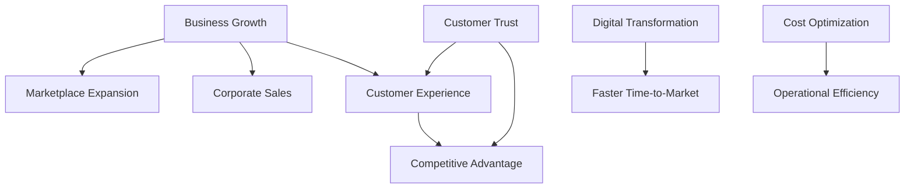
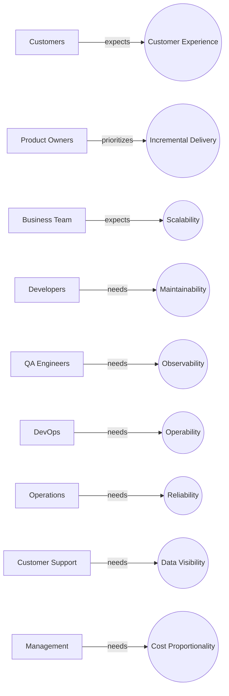
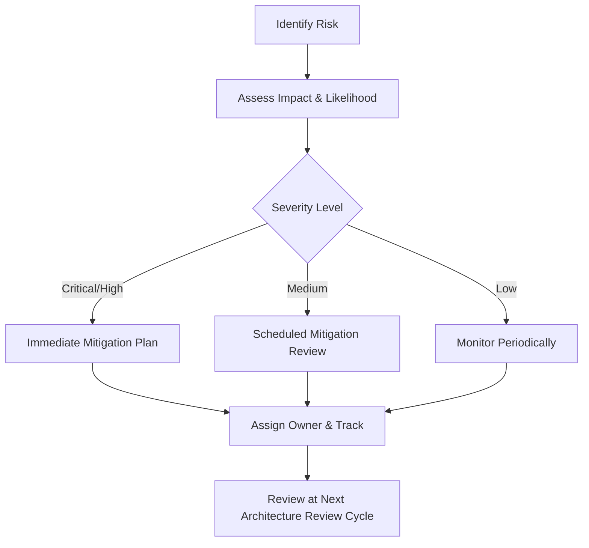
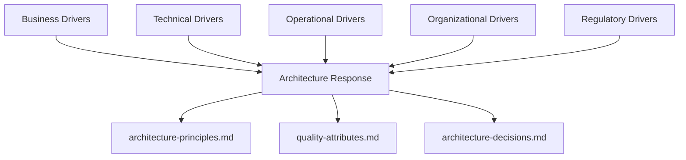

# Architectural Drivers

## 1. Document Purpose

This document explains the major forces influencing the architecture of **StackLeo Tech Store** — the business, technical, operational, organizational, and regulatory drivers that shape *why* architectural decisions exist, before `03_System_Design` describes *how* the system is designed.

This document is intended to give architects and engineering teams the context needed to make sound, independent decisions consistent with the platform's real priorities, rather than treating architecture as an isolated technical exercise. It works alongside `architecture-principles.md`, which defines *how* the platform responds to these drivers.

This document is implementation-independent. It describes the forces shaping architecture, not the architecture's technical realization, which is addressed in dedicated documents elsewhere in `03_System_Design`.

## 2. What Are Architectural Drivers?

Architectural drivers are the forces that meaningfully shape architectural decisions. They are distinct from architecture itself: drivers explain *why* a decision matters; architecture is the *response*.

| Driver Type | Description |
|---|---|
| Business Drivers | Forces arising from business strategy, growth, and competitive positioning, per `01_Business`. |
| Technical Drivers | Forces arising from the need for a sound, extensible, future-ready technical foundation. |
| Operational Drivers | Forces arising from the need to run the business reliably day to day (fulfillment, support, finance). |
| Organizational Drivers | Forces arising from the structure, size, and capability of the teams building and operating the platform. |
| Regulatory Drivers | Forces arising from legal and compliance obligations in Bangladesh, and future markets. |

## 3. Business Drivers

| Driver | Description | Source |
|---|---|---|
| Business Growth | Architecture must support growth from MVP to enterprise, marketplace, and international scale without redesign. | `01_Business/business-model.md`, `02_Product/product-roadmap.md` |
| Customer Experience | Architecture must enable a fast, consistent, trustworthy customer experience across channels. | `01_Business/mission.md`, `02_Product/non-functional-requirements.md` |
| Digital Transformation | Architecture must support StackLeo's evolution from a traditional retailer into a digitally native commerce platform. | `01_Business/overview.md` |
| Faster Time-to-Market | Architecture must allow new capability to be delivered incrementally without excessive rework. | `02_Product/product-roadmap.md` (phase-based delivery) |
| Marketplace Expansion | Architecture must accommodate a future multi-vendor marketplace without disrupting the core B2C model. | `01_Business/business-model.md` (Section 15) |
| Corporate Sales | Architecture must accommodate future bulk, negotiated-term purchasing. | `01_Business/business-model.md` (Section 10) |
| Competitive Advantage | Architecture must enable differentiation through reliability and trust, not merely feature parity. | `01_Business/competitor-analysis.md` |
| Cost Optimization | Architecture must scale cost proportionately to the business's current stage, per `01_Business/constraints.md`. | `01_Business/constraints.md` |
| Customer Trust | Architecture must protect the authenticity, security, and reliability guarantees central to the brand. | `01_Business/vision.md`, `01_Business/mission.md` |
| Operational Efficiency | Architecture must reduce manual operational burden as transaction volume grows. | `02_Product/business-workflows.md` |

*Diagram: Business Driver Relationship.*

## 4. Stakeholder Drivers

| Stakeholder | Primary Driver |
|---|---|
| Customers | A fast, trustworthy, consistent shopping experience across channels. |
| Product Owners | Ability to prioritize and deliver validated business value incrementally. |
| Business Team | Confidence that the platform can scale with business ambitions without repeated rebuilds. |
| Developers | A clear, well-bounded, testable codebase that supports confident change. |
| QA Engineers | A system that is observable and testable at each meaningful boundary. |
| DevOps | A deployable, scalable, and operable system with minimal manual intervention. |
| Operations | Reliable fulfillment, accurate inventory, and dependable partner integrations. |
| Customer Support | Timely, accurate visibility into customer, order, and case data. |
| Management | Confidence that architectural investment is proportionate and business-aligned. |

*Diagram: Stakeholder Influence Diagram.*

## 5. Quality Attribute Drivers

| Quality Attribute | Why It Is Prioritized |
|---|---|
| Scalability | The business plan explicitly anticipates growth through multiple phases (MVP → Enterprise → Marketplace → International), per `product-roadmap.md`. |
| Performance | Directly affects conversion and customer trust; slow experiences drive abandonment, per `non-functional-requirements.md` (Section 5). |
| Security | Trust is the platform's core differentiator; a security failure is a business failure. |
| Reliability | Isolated failures must not compromise the platform's core purchasing capability. |
| Availability | Downtime directly undermines the trust-focused brand positioning. |
| Maintainability | The platform must evolve confidently over years, not just through initial launch. |
| Extensibility | Significant future capability (corporate, marketplace, AI) is deferred, not absent, and must be accommodated without rework. |
| Observability | Operational reliability cannot be assured without visibility into real system behavior. |
| Accessibility | The platform must serve the full breadth of its target market, per `02_Product/user-personas.md`. |
| Usability | A significant portion of the target market is less digitally experienced, per `02_Product/user-personas.md` (Teacher, Home User personas). |

## 6. Technical Drivers

| Driver | Description |
|---|---|
| API-First Approach | Capability must be consumable identically by Web today and future Mobile App and POS channels. |
| Cloud-Native Readiness | The platform must operate reliably and scale elastically in a modern cloud environment. |
| Modular Architecture | The system must be organized into clearly bounded, independently evolvable capabilities. |
| Domain Separation | Business domains (per `bounded-contexts.md`) must remain cleanly separated to support independent evolution and future extraction. |
| Event-Driven Readiness | Cross-domain interactions should be event-based to support loose coupling and future event-streaming adoption. |
| Future Microservices Migration | Domain boundaries must remain clean enough to support extraction into independently deployable services if scale warrants it. |
| Integration Readiness | The system must integrate reliably with external payment, courier, and communication providers, with room for future ERP, CRM, and marketplace partner integration. |

## 7. Business Constraints

| Constraint | Description |
|---|---|
| Budget | Architectural investment must remain proportionate to the business's current single-seller B2C stage, per `01_Business/constraints.md` (Section 4). |
| Team Size | The current engineering organization is sized for MVP delivery, not enterprise-scale parallel workstreams. |
| Delivery Timelines | The business requires the MVP to reach market within a reasonable, competitive timeframe, per `01_Business/constraints.md` (Section 5). |
| Regulatory Considerations | The system must comply with Bangladesh e-commerce, consumer protection, tax, and data handling regulation, per `01_Business/business-rules.md` (Section 17). |
| Technology Constraints | Technology choices must be operable within the infrastructure and connectivity conditions available in Bangladesh, per `01_Business/constraints.md` (Section 9). |
| Third-Party Dependencies | The system depends on external payment gateway and courier partners whose service characteristics are outside direct control. |

## 8. Assumptions

| Assumption | Description |
|---|---|
| Partner Reliability | Payment gateway and courier partnerships remain available and reasonably reliable, per `01_Business/assumptions.md`. |
| Phased Validation | Each business phase (per `product-roadmap.md`) will be substantially validated before the next is architecturally prioritized. |
| Infrastructure Availability | Sufficient cloud infrastructure and connectivity exist to support the availability and performance targets defined in `non-functional-requirements.md`. |
| Organizational Growth | Engineering and operational team capacity will grow roughly in proportion to platform complexity and scale. |
| Data Volume Growth | Order, catalog, and customer data volume will grow steadily rather than discontinuously, absent an unplanned viral event. |

## 9. Risks

| Risk ID | Description | Impact | Likelihood | Mitigation Strategy | Owner |
|---|---|---|---|---|---|
| RISK-001 | Premature architectural complexity for unvalidated future scale (marketplace, AI, international). | High | Medium | Apply simplicity-before-complexity principle (ARCH-023); defer speculative capability until validated. | Solution Architect |
| RISK-002 | Payment gateway outage disrupting checkout capability. | High | Low | Graceful degradation to COD; monitor gateway health (NFR-055). | Engineering Lead |
| RISK-003 | Courier partner service disruption affecting delivery reliability. | Medium | Medium | Multi-courier redundancy per `01_Business/shipping-policy.md`. | Operations Manager |
| RISK-004 | Domain boundary erosion as the codebase grows organically. | Medium | Medium | Enforce `bounded-contexts.md` boundaries through architecture review (Section 12). | Solution Architect |
| RISK-005 | Security incident undermining the trust-first brand positioning. | Critical | Low | Defense-in-depth security principles (ARCH-033–ARCH-037); regular security review. | Security Lead |
| RISK-006 | Insufficient engineering capacity for planned roadmap phases. | Medium | Medium | Phase-gate delivery per `product-roadmap.md`; avoid parallelizing unvalidated phases. | Product Manager |
| RISK-007 | Concentrated demand (flash sales) exceeding current scaling capacity. | Medium | Medium | Horizontal scaling and load distribution principles (ARCH-038, ARCH-039). | DevOps Lead |
| RISK-008 | Regulatory change in Bangladesh e-commerce or data protection law. | Medium | Low | Periodic compliance review (NFR-035); legal monitoring. | Business Analyst |
| RISK-009 | Vendor lock-in with a critical third-party provider limiting future flexibility. | Medium | Medium | Deliberate dependency management (ARCH-032); isolate integrations behind boundaries. | Solution Architect |
| RISK-010 | Data inconsistency (e.g., overselling) under concurrent load. | High | Medium | Data consistency principles (ARCH-017); stock validation at multiple checkpoints. | Engineering Lead |
| RISK-011 | Marketplace seller quality issues damaging platform trust (Future). | High | Low | Curated seller onboarding and listing approval, per `01_Business/business-rules.md` (Section 13). | Product Manager |
| RISK-012 | AI-assisted features perceived as reducing transparency or fairness (Future). | Medium | Low | Governed AI bounds and disclosure, per `01_Business/business-rules.md` (Section 19). | Product Manager |
| RISK-013 | Team turnover leading to loss of architectural context. | Medium | Medium | Documentation-first principle (ARCH-021); comprehensive `03_System_Design` documentation. | Solution Architect |
| RISK-014 | Underestimating operational cost as scale increases. | Medium | Medium | Periodic cost-to-scale review against `01_Business/pricing-strategy.md` margin expectations. | Finance Officer |

*Diagram: Risk Assessment Flow.*

## 10. Trade-offs

| Trade-off | Discussion | Current Direction |
|---|---|---|
| Simplicity vs. Flexibility | Greater flexibility (e.g., early microservices, pluggable everything) adds complexity that may not be justified at current scale. | Favor simplicity now; preserve extraction readiness (ARCH-041) for later flexibility. |
| Performance vs. Cost | Maximum performance often requires additional infrastructure investment. | Meet defined performance targets (NFR-001–NFR-006) without over-provisioning beyond validated need. |
| Monolith vs. Microservices | Microservices offer independent scaling and deployment but add operational complexity. | Favor a well-modularized, domain-bounded architecture now, with clean boundaries enabling future microservice extraction if justified. |
| Build vs. Buy | Building custom capability offers control; buying (e.g., payment gateway, courier integration) offers speed and reduced risk. | Buy for undifferentiated capability (payments, courier, communication); build for differentiated business logic. |
| Consistency vs. Availability | Strong consistency can reduce availability under partition; eventual consistency improves availability but adds complexity. | Favor strong consistency for financially critical data (orders, payments, inventory); eventual consistency is acceptable for non-critical, read-heavy data (e.g., analytics). |
| Security vs. Usability | Stronger security controls (e.g., MFA) can add friction to the customer experience. | Apply strict security to sensitive/administrative actions; keep customer-facing friction proportionate to risk (per NFR-026 MFA readiness, not mandatory at MVP). |

## 11. Future Drivers

| Future Driver | Description | Related Roadmap Phase |
|---|---|---|
| AI-Powered Commerce | Intelligent search, recommendations, fraud detection, and support automation. | Phase 6 |
| Marketplace | Multi-vendor seller ecosystem extending catalog breadth. | Phase 5 |
| Internationalization | Multi-currency, multi-language, and cross-border operation. | Phase 7 |
| Mobile Apps | A dedicated native Mobile App channel. | Phase 7 (with earlier API-first groundwork) |
| Multi-Region Deployment | Operating infrastructure across multiple geographic regions to serve new markets reliably. | Phase 7 |
| Real-Time Analytics | Faster, more granular business intelligence supporting operational and strategic decisions. | Phase 3–4 |

## 12. Governance

- **Architecture Ownership** — the Solution Architect owns this document and is accountable for keeping it aligned with actual business and technical direction.
- **Review Process** — architectural drivers are reviewed at the conclusion of each phase defined in `02_Product/product-roadmap.md`, and whenever a material shift occurs in business strategy, competitive landscape, or regulatory environment.
- **Change Management** — changes to recognized drivers must be reflected in this document, with material changes recorded in `00_Project_Overview/changelog.md` and evaluated for downstream impact on `architecture-principles.md` and other `03_System_Design` documents.
- **Continuous Evaluation** — the risk register (Section 9) and trade-off analysis (Section 10) are living artifacts, revisited whenever new information (incidents, market shifts, scale milestones) meaningfully changes the underlying forces.

*Diagram: Architecture Driver Map.*

## 13. Document Information

| Property | Value |
|----------|-------|
| Document | architectural-drivers.md |
| Version | 1.0.0 |
| Status | Active |
| Maintained By | StackLeo |
| Last Updated | 2026-07-17 |

---

© StackLeo. All Rights Reserved.
