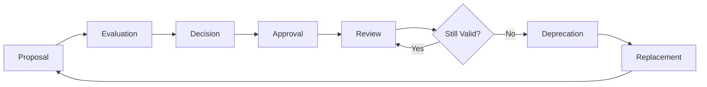
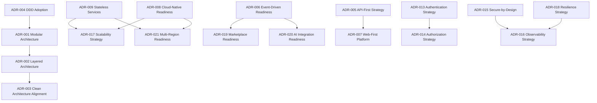
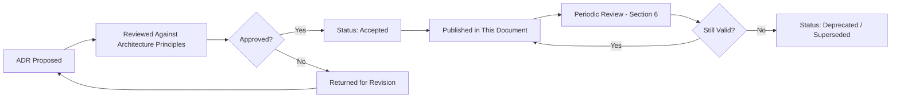
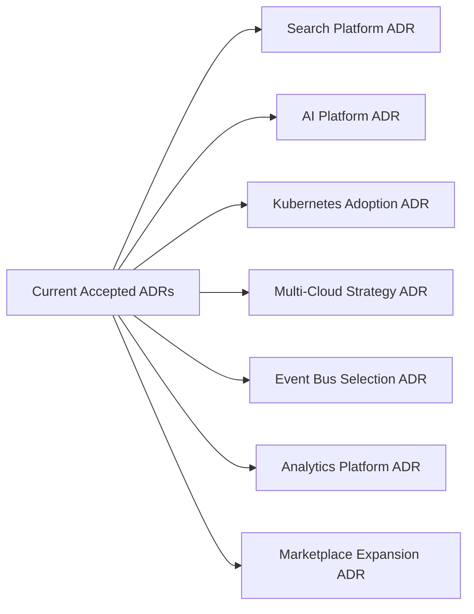

# Architecture Decision Records

## 1. Document Purpose

This document is the official Architecture Decision Record (ADR) log for **StackLeo Tech Store**.

- **What Is an ADR** — a short, structured record capturing a single significant architectural decision: the context that prompted it, the decision made, the alternatives considered, and the consequences accepted.
- **Why ADRs Are Important** — architecture is shaped as much by *why* a choice was made as by the choice itself; without a recorded rationale, future architects and engineers are left to guess whether a constraint is still valid or was simply never revisited.
- **Relationship with Architecture Governance** — this document is the practical record referenced throughout `03_System_Design`'s governance sections; every document that states "per `architecture-decisions.md`" points back to an entry here.
- **Long-Term Value of Documented Decisions** — as StackLeo scales through the growth stages defined in `scalability-strategy.md`, ADRs let the organization revisit a decision's original context deliberately, rather than accidentally re-litigating settled questions or blindly preserving decisions that no longer fit.

This document is implementation-independent. It records architectural reasoning, not code, vendor recommendations, or configuration detail.

## 2. ADR Process

*Diagram: ADR Lifecycle.*

| Stage | Description |
|---|---|
| Proposal | A candidate decision is drafted using the template in Section 3, describing the context and problem it addresses. |
| Evaluation | The proposal is assessed against `architecture-principles.md` and `quality-attributes.md`, alongside its alternatives and trade-offs. |
| Decision | A specific direction is chosen and recorded, with status `Proposed` until approved. |
| Approval | The Solution Architect (and, for significant decisions, the conceptual Architecture Review function per `architecture-principles.md`, Section 11) approves the decision, moving its status to `Accepted`. |
| Review | Accepted decisions are periodically revisited (Section 6) to confirm continued validity. |
| Deprecation | A decision no longer fit for purpose is marked `Deprecated`, with its reasoning recorded. |
| Replacement | A new ADR is created to supersede the deprecated one, and the original's status is updated to `Superseded`, with a cross-reference to its replacement. |

## 3. Decision Template

Every ADR in Section 4 follows this structure:

| Field | Description |
|---|---|
| ADR ID | Unique identifier in the format `ADR-XXX`. |
| Decision Title | A short, descriptive name for the decision. |
| Status | Proposed, Accepted, Superseded, or Deprecated. |
| Decision Date | The date the decision was accepted. |
| Context | The circumstances and forces that prompted the decision. |
| Problem Statement | The specific question the decision resolves. |
| Decision | The direction chosen. |
| Rationale | Why this direction was chosen over its alternatives. |
| Alternatives Considered | Other options evaluated and why they were not chosen. |
| Trade-offs | What is gained and given up by this decision. |
| Consequences | The resulting implications for the architecture going forward. |
| Risks | Known risks accepted by making this decision. |
| Future Review Criteria | The conditions under which this decision should be revisited. |
| Related Documents | Cross-references to related `03_System_Design` documents. |

---

## 4. Initial Architecture Decisions

### 4.1 Architecture Decisions

#### ADR-001 — Modular Architecture

- **Status:** Accepted | **Decision Date:** 2026-07-17
- **Context:** StackLeo's business capability spans many distinct domains (catalog, orders, warranty, and eventually marketplace) that will evolve at different rates and under different ownership.
- **Problem Statement:** How should the platform be structured so each business capability can evolve independently without destabilizing unrelated capability?
- **Decision:** Organize the platform as a modular architecture, decomposed along the bounded contexts defined in `bounded-contexts.md`, with components (`component-architecture.md`) and services (`service-architecture.md`) scoped to a single business capability each.
- **Rationale:** Modularity keeps the blast radius of any single change contained and allows StackLeo to prioritize investment in the domains that matter most at each growth stage, consistent with ARCH-001 and ARCH-004.
- **Alternatives Considered:** A single, undifferentiated application structure organized by technical layer only, without explicit business-domain boundaries.
- **Trade-offs:** Requires more upfront discipline in defining boundaries versus the short-term simplicity of an undifferentiated structure.
- **Consequences:** All subsequent structural decisions (Sections 4.2–4.6) build on this modular foundation.
- **Risks:** Domain boundaries may erode over time without active governance (per `architecture-principles.md`, Section 12, Anti-Patterns).
- **Future Review Criteria:** Revisit if a bounded context's scope proves consistently ambiguous in practice, or if module boundaries repeatedly require rework.
- **Related Documents:** `architecture-principles.md`, `component-architecture.md`, `bounded-contexts.md`

#### ADR-002 — Layered Architecture

- **Status:** Accepted | **Decision Date:** 2026-07-17
- **Context:** Within each module, presentation, business logic, and data access concerns need clear separation to remain independently testable and changeable.
- **Problem Statement:** How should responsibility be organized within a single module to avoid concerns becoming entangled?
- **Decision:** Adopt a layered architecture — Presentation, Application, Domain, and Infrastructure layers, per `component-architecture.md` (Section 6) — with dependencies flowing inward toward the Domain layer.
- **Rationale:** Layering enforces separation of concerns (ARCH-003) and keeps business rules independent of delivery mechanism or storage technology.
- **Alternatives Considered:** An unlayered structure where presentation, logic, and data access are freely intermixed within a single module.
- **Trade-offs:** Adds structural ceremony compared to an unlayered approach, in exchange for long-term maintainability.
- **Consequences:** Establishes the dependency direction validated by the Dependency Direction diagram in `architecture-principles.md`.
- **Risks:** Over-layering trivial capability could add unnecessary ceremony; mitigated by applying simplicity-before-complexity (ARCH-023) judgment.
- **Future Review Criteria:** Revisit if layering is found to meaningfully slow delivery of low-risk, low-complexity capability.
- **Related Documents:** `architecture-principles.md`, `component-architecture.md`

#### ADR-003 — Clean Architecture Alignment

- **Status:** Accepted | **Decision Date:** 2026-07-17
- **Context:** Technology choices (frameworks, storage engines) are more likely to change over the platform's lifetime than its core business rules.
- **Problem Statement:** How should the architecture prevent business logic from becoming tightly bound to a specific technology choice?
- **Decision:** Align with Clean Architecture: the Domain layer defines interfaces that Infrastructure implements, never the reverse, per `architecture-principles.md` (Layered Architecture Concept diagram).
- **Rationale:** This inversion of dependency protects business rules from churn in technology choices, consistent with ARCH-008 (Encapsulation) and long-term maintainability.
- **Alternatives Considered:** A conventional layered approach where the Domain layer directly depends on specific Infrastructure implementations.
- **Trade-offs:** Requires defining and maintaining interface boundaries, adding modest upfront design cost.
- **Consequences:** Technology stack decisions (`technology-stack.md`) can evolve without requiring business logic rewrites.
- **Risks:** Interfaces defined too speculatively, ahead of genuine need, could themselves become a maintenance burden.
- **Future Review Criteria:** Revisit if interface boundaries are found to be consistently unused or overly abstract in practice.
- **Related Documents:** `architecture-principles.md`

#### ADR-004 — Domain-Driven Design Adoption

- **Status:** Accepted | **Decision Date:** 2026-07-17
- **Context:** StackLeo's business is genuinely complex and multi-domain (catalog, commerce, fulfillment, post-purchase, and eventually marketplace), and this complexity is expected to grow.
- **Problem Statement:** How should the platform's structure remain aligned with real business meaning as complexity grows, rather than accumulating incidental technical structure?
- **Decision:** Adopt Domain-Driven Design as the platform's primary modeling approach, formalized in `domain-model.md` and `bounded-contexts.md`.
- **Rationale:** DDD keeps engineering structure traceable to genuine business concepts, reducing the risk of structure drifting away from what the business actually needs, consistent with ARCH-002.
- **Alternatives Considered:** A purely data-centric or purely technical (e.g., MVC-only) modeling approach without explicit domain boundaries.
- **Trade-offs:** Requires closer, ongoing collaboration between Business Analysts and Engineering to keep the domain model accurate.
- **Consequences:** All bounded contexts, aggregates, and domain events documented in `domain-model.md` and `bounded-contexts.md` flow from this decision.
- **Risks:** Aggregate or bounded context boundaries drawn incorrectly early on can be costly to correct later.
- **Future Review Criteria:** Revisit bounded context boundaries whenever a new module in `02_Product/product-modules.md` does not map cleanly to an existing context.
- **Related Documents:** `domain-model.md`, `bounded-contexts.md`

#### ADR-005 — API-First Strategy

- **Status:** Accepted | **Decision Date:** 2026-07-17
- **Context:** StackLeo's roadmap includes a future Mobile App and POS channel that must consume the same business capability as the current Web channel.
- **Problem Statement:** How should capability be exposed so that future channels do not require duplicated business logic?
- **Decision:** Design every service contract API-first — as a channel-independent capability — per `service-architecture.md` (Section 2) and `architecture-principles.md` (ARCH-011).
- **Rationale:** API-first design avoids Web-specific assumptions leaking into business logic, preserving a single source of truth for behavior across channels.
- **Alternatives Considered:** Building the Web experience with tightly coupled backend logic, to be re-implemented separately when Mobile App and POS are introduced.
- **Trade-offs:** Requires more upfront contract design discipline than tightly coupling UI and logic.
- **Consequences:** Mobile App and POS Integration (`service-architecture.md`, SVC-032) can be introduced without redesigning core services.
- **Risks:** Contract design that is too generic could under-serve the specific needs of any one channel.
- **Future Review Criteria:** Revisit when the Mobile App is actively designed, to confirm existing contracts genuinely meet its needs.
- **Related Documents:** `service-architecture.md`, `integration-architecture.md`

#### ADR-006 — Event-Driven Readiness

- **Status:** Accepted | **Decision Date:** 2026-07-17
- **Context:** Many business processes (order fulfillment, notifications, analytics) depend on reacting to facts produced elsewhere in the system, and this cross-domain interaction is expected to grow substantially with Marketplace and AI capability.
- **Problem Statement:** How should services collaborate across domain boundaries without becoming tightly, synchronously coupled?
- **Decision:** Adopt event-driven collaboration as the default pattern for cross-service business notification, cataloged in `event-flows.md`, while deferring adoption of a formal event bus until justified by scale (`service-architecture.md`, Section 11).
- **Rationale:** Events allow producers and consumers to evolve independently (ARCH-013), and position the platform for a natural transition to a formal event backbone without redesigning collaboration patterns later.
- **Alternatives Considered:** Exclusively synchronous, direct service-to-service calls for all cross-domain notification.
- **Trade-offs:** Introduces eventual-consistency considerations for event-driven interactions, versus the immediate consistency of synchronous calls.
- **Consequences:** The 33 events cataloged in `event-flows.md` and the migration strategy in `service-architecture.md` (Section 11) both build on this decision.
- **Risks:** Without disciplined idempotency and reliability practice (`integration-architecture.md`, Section 7), event-driven flows can silently fail or duplicate effects.
- **Future Review Criteria:** Revisit adoption of a formal event bus once cross-service event volume genuinely strains direct/ad hoc event handling.
- **Related Documents:** `event-flows.md`, `service-architecture.md`

### 4.2 Technology Decisions

#### ADR-007 — Web-First Platform Strategy

- **Status:** Accepted | **Decision Date:** 2026-07-17
- **Context:** StackLeo's MVP scope, per `00_Project_Overview/project-scope.md`, prioritizes the Web channel, with Mobile App and POS explicitly deferred.
- **Problem Statement:** Which channel should the platform prioritize first, and how should that choice affect the architecture's shape?
- **Decision:** Build Web as the first, fully realized channel, using the API-first strategy (ADR-005) to ensure the underlying services are not Web-specific.
- **Rationale:** Focuses initial delivery effort on validating the core B2C business model (per `01_Business/business-model.md`) before investing in additional channels.
- **Alternatives Considered:** Building Web and Mobile App concurrently from MVP launch.
- **Trade-offs:** Delays Mobile App availability in exchange for faster, more focused initial delivery.
- **Consequences:** Mobile App (`product-roadmap.md`, Phase 7 and earlier groundwork) can be introduced later without disrupting Web.
- **Risks:** Web-specific assumptions could still inadvertently creep into service design without disciplined API-first review.
- **Future Review Criteria:** Revisit prioritization if market conditions show mobile-native demand significantly outpacing Web adoption earlier than planned.
- **Related Documents:** `system-overview.md`, `02_Product/product-roadmap.md`

#### ADR-008 — Cloud-Native Readiness

- **Status:** Accepted | **Decision Date:** 2026-07-17
- **Context:** StackLeo's growth plan spans multiple stages of scale (`scalability-strategy.md`, Section 3), from a small MVP to enterprise and eventual multi-region operation.
- **Problem Statement:** What operating model should the platform assume for its infrastructure?
- **Decision:** Design the platform for cloud-native, elastic operation, remaining cloud-provider neutral, per `deployment-architecture.md`.
- **Rationale:** Elastic infrastructure directly supports the scaling strategy needed across StackLeo's growth stages without requiring a change in operating model at each stage.
- **Alternatives Considered:** Fixed-capacity, self-hosted physical infrastructure.
- **Trade-offs:** Recurring operational cost model versus upfront capital investment; requires cost discipline as usage scales.
- **Consequences:** All infrastructure, scaling, and deployment decisions (`deployment-architecture.md`, `scalability-strategy.md`) build on this foundation.
- **Risks:** Cost management complexity if elastic scaling is not paired with disciplined capacity planning (`scalability-strategy.md`, Section 8).
- **Future Review Criteria:** Revisit if actual infrastructure cost-to-revenue ratio diverges materially from plan.
- **Related Documents:** `deployment-architecture.md`, `technology-stack.md`

#### ADR-009 — Stateless Services

- **Status:** Accepted | **Decision Date:** 2026-07-17
- **Context:** Reliable horizontal scaling and failover require that any service instance can serve any request.
- **Problem Statement:** How should services be designed to support reliable scaling and failover?
- **Decision:** Design all services to be stateless, holding no client-specific state locally, per ARCH-012 and ARCH-039.
- **Rationale:** Statelessness is the foundational precondition for horizontal scaling (`scalability-strategy.md`, Section 2) and resilient failover (`deployment-architecture.md`, Section 7).
- **Alternatives Considered:** Sticky-session-based services that bind a customer's session to a specific instance.
- **Trade-offs:** Requires externalizing session-relevant state (e.g., via the token-based authentication approach in `technology-stack.md`, Section 4.5) rather than holding it locally.
- **Consequences:** Enables the Horizontal Scaling Architecture described in `scalability-strategy.md` (Section 4).
- **Risks:** Legacy or ad hoc implementation patterns could reintroduce hidden local state if not actively reviewed.
- **Future Review Criteria:** Revisit if a specific service is found to require local state for legitimate performance reasons, evaluating whether an alternative externalization approach is viable.
- **Related Documents:** `service-architecture.md`, `scalability-strategy.md`

#### ADR-010 — Relational Database Strategy

- **Status:** Accepted | **Decision Date:** 2026-07-17
- **Context:** Orders, Payments, and Inventory require strong consistency to prevent overselling, duplicate charges, and financial inaccuracy.
- **Problem Statement:** What category of data store should serve as the primary transactional store for business-critical data?
- **Decision:** Adopt a relational database management system as the primary transactional store, per `technology-stack.md` (Section 4.3), with polyglot persistence considered later for non-critical, read-heavy domains.
- **Rationale:** Strong consistency and ACID guarantees directly serve the consistency-over-availability trade-off identified for critical data in `architectural-drivers.md` (Section 10).
- **Alternatives Considered:** A NoSQL document store as the sole primary data store for all domains.
- **Trade-offs:** Less flexible schema evolution than a schema-less alternative, in exchange for stronger consistency guarantees.
- **Consequences:** Establishes the Data Ownership model in `data-flow.md` (Section 6) and informs future database scaling strategy (`scalability-strategy.md`, Section 4).
- **Risks:** Write-scaling limitations at very high transaction volume, requiring deliberate scaling strategy at enterprise scale.
- **Future Review Criteria:** Revisit read/write scaling approach as Enterprise-stage transaction volume (`scalability-strategy.md`, Section 3) is approached.
- **Related Documents:** `technology-stack.md`, `data-flow.md`

#### ADR-011 — Caching Strategy

- **Status:** Accepted | **Decision Date:** 2026-07-17
- **Context:** Catalog browsing is a high-read, low-volatility workload that risks placing unnecessary load on the primary database.
- **Problem Statement:** How should the platform reduce latency and database load for frequently accessed, non-critical data?
- **Decision:** Introduce an in-memory key-value caching layer for high-read, low-volatility data, per `technology-stack.md` (Section 4.4).
- **Rationale:** Directly supports the performance targets in `non-functional-requirements.md` (NFR-001, NFR-002) without adding load to the primary transactional store.
- **Alternatives Considered:** Relying solely on database and CDN caching without an application-level cache layer.
- **Trade-offs:** Introduces cache invalidation complexity that must be actively managed to avoid staleness.
- **Consequences:** Cache invalidation is tied to domain events (`event-flows.md`), ensuring cached data reflects genuine business state changes.
- **Risks:** Stale data exposure if invalidation logic is incomplete.
- **Future Review Criteria:** Revisit for distributed caching needs as multi-region deployment (`scalability-strategy.md`, Section 7) approaches.
- **Related Documents:** `technology-stack.md`, `scalability-strategy.md`

#### ADR-012 — Object Storage Strategy

- **Status:** Accepted | **Decision Date:** 2026-07-17
- **Context:** Product images and business documents require durable, scalable storage decoupled from application server capacity.
- **Problem Statement:** How should unstructured business assets be stored and delivered efficiently?
- **Decision:** Use a dedicated object storage service, fronted by a CDN, per `technology-stack.md` (Section 4.8) and `deployment-architecture.md` (Section 4).
- **Rationale:** Purpose-built object storage avoids coupling media capacity to application compute capacity, and supports efficient, low-latency delivery via CDN.
- **Alternatives Considered:** Storing files directly on application server instances.
- **Trade-offs:** Introduces a dependency on external storage service availability.
- **Consequences:** Product media flows (`data-flow.md`, Section 4) are decoupled from application-layer scaling decisions.
- **Risks:** Potential vendor lock-in if provider-specific storage capability is used without an abstraction boundary (ARCH-032).
- **Future Review Criteria:** Revisit for multi-region replication needs as international expansion approaches.
- **Related Documents:** `technology-stack.md`, `integration-architecture.md`

### 4.3 Security Decisions

#### ADR-013 — Authentication Strategy

- **Status:** Accepted | **Decision Date:** 2026-07-17
- **Context:** Every customer and internal action must be traceable to a verified identity before authorization can be meaningfully evaluated.
- **Problem Statement:** How should the platform establish and verify identity consistently across all channels and services?
- **Decision:** Adopt a token-based, stateless authentication approach, per `technology-stack.md` (Section 4.5), consistent with the Authentication Service defined in `service-architecture.md` (SVC-001).
- **Rationale:** Statelessness supports scalability (ADR-009) while providing a consistent identity verification mechanism usable across Web, future Mobile App, and future POS.
- **Alternatives Considered:** Traditional server-stored session state without token-based verification.
- **Trade-offs:** Requires deliberate design for token revocation, which is simpler in a server-stored session model.
- **Consequences:** All account-scoped services depend on Authentication Service as their foundational dependency (`service-architecture.md`, Section 4.1).
- **Risks:** Token leakage or mishandling if not paired with strict secure communication practice.
- **Future Review Criteria:** Revisit ahead of introducing Multi-Factor Authentication (NFR-026) for sensitive account types.
- **Related Documents:** `architecture-principles.md`, `02_Product/user-roles.md`

#### ADR-014 — Authorization Strategy (RBAC)

- **Status:** Accepted | **Decision Date:** 2026-07-17
- **Context:** StackLeo has a growing number of distinct internal and partner roles (per `02_Product/user-roles.md`), each requiring different, precisely scoped access.
- **Problem Statement:** How should the platform enforce that each identity can only perform actions appropriate to its role?
- **Decision:** Adopt Role-Based Access Control (RBAC) as the platform's authorization model, formalized in `02_Product/user-roles.md`, with future extensibility toward Attribute-Based Access Control (ABAC) for scenarios like regional or warehouse-scoped access.
- **Rationale:** RBAC provides clear, auditable access boundaries aligned to real organizational roles, directly supporting least privilege (ARCH-033) and separation of duties.
- **Alternatives Considered:** Ad hoc, per-feature permission flags without a unifying role model.
- **Trade-offs:** Requires disciplined role definition and maintenance as the organization grows (`user-roles.md`, Section 14).
- **Consequences:** Every service enforces authorization checks against this model, per `service-architecture.md` (Section 9).
- **Risks:** Privilege creep over time if role assignments are not periodically reviewed (`user-roles.md`, UR-034).
- **Future Review Criteria:** Revisit ahead of multi-warehouse (Phase 4) and regional (Phase 7) expansion, when ABAC-style scoping becomes genuinely necessary.
- **Related Documents:** `02_Product/user-roles.md`, `quality-attributes.md`

#### ADR-015 — Secure-by-Design Principles

- **Status:** Accepted | **Decision Date:** 2026-07-17
- **Context:** Trust is StackLeo's core brand differentiator (`01_Business/vision.md`); a security failure is a direct business failure, not merely a technical incident.
- **Problem Statement:** At what point in the design process should security be addressed?
- **Decision:** Embed security requirements at design time for every component and service, rather than adding security review only before release, per ARCH-014 and `architecture-principles.md` (Section 7).
- **Rationale:** Security added late is costlier and structurally less effective than security considered from the outset; secure-by-design directly protects the trust central to StackLeo's competitive positioning.
- **Alternatives Considered:** A conventional post-hoc security review process applied shortly before each release.
- **Trade-offs:** Requires security consideration to be part of every design discussion, adding modest upfront design overhead.
- **Consequences:** Defense-in-depth (ARCH-035), least privilege (ARCH-033), and secure defaults (ARCH-036) are treated as default design inputs across all `03_System_Design` documents.
- **Risks:** Security requirements could be under-prioritized under delivery pressure without active governance.
- **Future Review Criteria:** Revisit following any significant security incident or as compliance requirements evolve (`non-functional-requirements.md`, NFR-035, NFR-036).
- **Related Documents:** `architecture-principles.md`, `quality-attributes.md`

### 4.4 Operations Decisions

#### ADR-016 — Observability Strategy

- **Status:** Accepted | **Decision Date:** 2026-07-17
- **Context:** Operational reliability cannot be assured without visibility into real system behavior, particularly as the platform scales beyond what any individual can manually track.
- **Problem Statement:** How should the platform be designed to reveal its own behavior for diagnosis and operation?
- **Decision:** Treat observability as an inherent architectural property — comprehensive metrics, structured logging, and distributed tracing readiness — per `observability.md`, rather than an operational afterthought.
- **Rationale:** Observability by design (ARCH-018) is a precondition for the reliability and recovery expectations defined in `non-functional-requirements.md` (Section 8).
- **Alternatives Considered:** Reactive, ad hoc monitoring added only after specific incidents reveal a visibility gap.
- **Trade-offs:** Requires every new service to meet a baseline observability standard (`observability.md`, Section 12) before reaching Production.
- **Consequences:** All services expose health checks, metrics, and structured logs by default, per `service-architecture.md` (Section 9).
- **Risks:** Observability tooling and process could lag behind rapid feature delivery without disciplined governance.
- **Future Review Criteria:** Revisit ahead of adopting AI-assisted anomaly detection (`observability.md`, Section 11).
- **Related Documents:** `observability.md`

#### ADR-017 — Scalability Strategy Adoption

- **Status:** Accepted | **Decision Date:** 2026-07-17
- **Context:** StackLeo's business plan anticipates growth through five distinct stages (`scalability-strategy.md`, Section 3), from MVP to global operation.
- **Problem Statement:** How should the architecture scale across these stages without requiring a disruptive rebuild at each transition?
- **Decision:** Adopt horizontal scaling as the primary strategy, built on stateless services (ADR-009) and cloud-native infrastructure (ADR-008), with scaling investment proportionate to each growth stage.
- **Rationale:** Matches scaling investment to validated need (ARCH-023), avoiding both premature over-engineering and reactive under-provisioning.
- **Alternatives Considered:** Provisioning for enterprise-scale capacity from MVP launch.
- **Trade-offs:** Requires periodic, deliberate reinvestment in scaling as each growth stage is reached, rather than a one-time upfront investment.
- **Consequences:** Establishes the capacity planning discipline defined in `scalability-strategy.md` (Section 8).
- **Risks:** Under-provisioning ahead of a concentrated-demand event (e.g., flash sale) if capacity planning is not proactive.
- **Future Review Criteria:** Revisit at each growth stage transition defined in `scalability-strategy.md` (Section 3).
- **Related Documents:** `scalability-strategy.md`

#### ADR-018 — Resilience Strategy

- **Status:** Accepted | **Decision Date:** 2026-07-17
- **Context:** Isolated component or integration failures (e.g., a courier outage) should not be able to compromise the platform's core purchasing capability.
- **Problem Statement:** How should the architecture behave when a dependency or component fails?
- **Decision:** Design every component and integration with explicit failure handling — bounded retry, graceful degradation, and fault isolation — per `architecture-principles.md` (Section 9) and `integration-architecture.md` (Section 7).
- **Rationale:** Reliability by design (ARCH-017) protects the core purchase flow from being compromised by non-critical or external failures, preserving customer trust.
- **Alternatives Considered:** Assuming dependency reliability and handling failures reactively only after they occur in Production.
- **Trade-offs:** Requires explicit design effort for failure paths in addition to the success path for every component.
- **Consequences:** Every service in `service-architecture.md` documents its risks and reliability expectations (Section 8) as a first-class design concern.
- **Risks:** Incomplete failure-path coverage for less-obvious dependency interactions.
- **Future Review Criteria:** Revisit following any incident that reveals an unhandled failure mode.
- **Related Documents:** `quality-attributes.md`, `service-architecture.md`

### 4.5 Future Decisions

#### ADR-019 — Marketplace Readiness

- **Status:** Accepted | **Decision Date:** 2026-07-17
- **Context:** StackLeo's business model explicitly anticipates a future multi-vendor marketplace (`01_Business/business-model.md`, Section 15), though not at MVP launch.
- **Problem Statement:** Should the current architecture make any accommodation for marketplace capability before it is actively built?
- **Decision:** Ensure existing Catalog and Order domains (`domain-model.md`) are structured so Marketplace capability can extend them later, without redesigning either domain when Marketplace is introduced, per `bounded-contexts.md` and `service-architecture.md` (SVC-029).
- **Rationale:** Preparing clean extension points now avoids costly rework later, without requiring StackLeo to build unused Marketplace capability prematurely (ARCH-023).
- **Alternatives Considered:** Deferring all Marketplace-related structural consideration until Phase 5 planning begins.
- **Trade-offs:** Requires slightly more deliberate boundary design in Catalog and Order domains today, for a benefit not realized until Phase 5.
- **Consequences:** The Seller and Marketplace Store entities are already defined conceptually in `domain-model.md` (Section 4.10), ready for elaboration when Phase 5 begins.
- **Risks:** Speculative design for a capability that may evolve differently than currently anticipated once genuinely scoped.
- **Future Review Criteria:** Revisit and elaborate fully when Phase 5 (Marketplace) planning formally begins, per `product-roadmap.md`.
- **Related Documents:** `bounded-contexts.md`, `domain-model.md`, `02_Product/product-roadmap.md`

#### ADR-020 — AI Integration Readiness

- **Status:** Accepted | **Decision Date:** 2026-07-17
- **Context:** StackLeo's roadmap anticipates AI-assisted search, recommendations, and fraud detection in Phase 6, layered over existing customer-facing capability.
- **Problem Statement:** Should current architecture make any accommodation for future AI capability?
- **Decision:** Design event-driven readiness (ADR-006) and the Search and Analytics service boundaries (`service-architecture.md`) so that a future AI Recommendation Service (SVC-031) can consume existing events and data without altering their producers.
- **Rationale:** Ensures AI capability can be introduced as a genuinely additive layer, consistent with graceful degradation (ARCH-043) if AI capability is ever unavailable.
- **Alternatives Considered:** Making no structural accommodation and addressing AI integration entirely at the point Phase 6 begins.
- **Trade-offs:** Requires maintaining slightly broader event coverage (`event-flows.md`) than strictly needed for current capability alone.
- **Consequences:** AI Recommendation Service is already scoped conceptually in `service-architecture.md` (SVC-031) and `component-architecture.md` (COMP-035).
- **Risks:** Actual AI platform requirements, once evaluated, may require event or data adjustments beyond what is currently anticipated.
- **Future Review Criteria:** Revisit and elaborate fully when Phase 6 (AI & Automation) planning formally begins.
- **Related Documents:** `service-architecture.md`, `02_Product/product-roadmap.md`

#### ADR-021 — Multi-Region Readiness

- **Status:** Accepted | **Decision Date:** 2026-07-17
- **Context:** StackLeo's vision explicitly includes expansion across South Asia and beyond (`01_Business/vision.md`), following the Bangladesh market's validation.
- **Problem Statement:** Should the current architecture make any accommodation for future multi-region operation?
- **Decision:** Ensure statelessness (ADR-009) and cloud-native infrastructure (ADR-008) are treated as non-negotiable foundational properties now, since they are the structural precondition for multi-region deployment later, per `scalability-strategy.md` (Section 7) and `deployment-architecture.md` (Section 13).
- **Rationale:** Retrofitting statelessness after regional expansion begins would be far more disruptive than maintaining it as a default property from the outset.
- **Alternatives Considered:** Allowing convenient, short-term stateful shortcuts now, with the intention of addressing them before international expansion.
- **Trade-offs:** Requires continued design discipline today for a benefit not realized until Phase 7.
- **Consequences:** No current architectural decision assumes single-region operation as a permanent constraint.
- **Risks:** Data residency and regulatory requirements for future markets are not yet fully known and may require adjustments beyond current assumptions.
- **Future Review Criteria:** Revisit and elaborate fully when Phase 7 (Global Expansion) planning formally begins.
- **Related Documents:** `deployment-architecture.md`, `scalability-strategy.md`

---

## 5. Decision Relationships

- **DDD supports Modular Architecture** — ADR-004 (Domain-Driven Design Adoption) provides the domain boundaries that ADR-001 (Modular Architecture) organizes the platform around.
- **Modular Architecture supports Layered Architecture** — ADR-001 establishes the module boundaries within which ADR-002 (Layered Architecture) applies consistently.
- **Stateless Services support Scalability** — ADR-009 (Stateless Services) is the structural precondition for ADR-017 (Scalability Strategy Adoption) and ADR-021 (Multi-Region Readiness).
- **Cloud-Native Readiness supports Scalability and Multi-Region Readiness** — ADR-008 underpins both ADR-017 and ADR-021.
- **Event-Driven Readiness supports Marketplace and AI Readiness** — ADR-006 is the collaboration pattern that ADR-019 (Marketplace Readiness) and ADR-020 (AI Integration Readiness) both depend on.
- **API-First Strategy supports Web-First Platform Strategy** — ADR-005 ensures ADR-007's Web-first prioritization does not compromise future Mobile App and POS delivery.
- **Authentication Strategy supports Authorization Strategy** — ADR-013 establishes the verified identity that ADR-014 (RBAC) authorizes against.
- **Secure-by-Design supports Observability Strategy** — ADR-015's security logging expectations feed directly into ADR-016's audit and security metrics.
- **Resilience Strategy supports Observability Strategy** — ADR-018's failure handling depends on ADR-016's visibility into when and how failures occur.

*Diagram: Architecture Decision Dependency Graph.*

## 6. Decision Governance

- **Who Can Propose ADRs** — any Engineering Lead, the Solution Architect, or the Product Manager may propose a new ADR; proposals from other roles are welcomed through the Solution Architect.
- **Review Process** — proposed ADRs are evaluated against `architecture-principles.md` and `quality-attributes.md` (Section 2), following the ADR Process defined in Section 2.
- **Approval Authority** — the Solution Architect holds final approval authority for most ADRs; decisions with significant business or cost implications additionally require Founder / Business Owner sign-off, consistent with `architecture-principles.md` (Section 11, Governance Responsibilities).
- **Documentation Standards** — every accepted ADR must use the full template in Section 3; no field may be omitted.
- **Versioning** — this document follows the Semantic Versioning approach defined in `00_Project_Overview/changelog.md`; each individual ADR's status changes are also recorded there.
- **Retirement of ADRs** — a superseded or deprecated ADR is never deleted; its status is updated, and it remains in this document as a historical record, cross-referenced to whatever replaced it.

*Diagram: ADR Review Workflow.*

## 7. Future ADR Candidates

| Future ADR Topic | Anticipated Trigger |
|---|---|
| Search Platform | Adoption of a dedicated search platform (`technology-stack.md`, Section 4.7) as catalog scale exceeds database-native search capability. |
| AI Platform | Selection of an AI platform approach ahead of Phase 6 (AI & Automation). |
| Kubernetes Adoption | Formal adoption of container orchestration (`technology-stack.md`, Section 7) once service count and scaling needs justify it. |
| Multi-Cloud Strategy | A decision to operate across more than one cloud provider, should redundancy or regional needs warrant it. |
| Event Bus Selection | Formal adoption of a event-streaming backbone (`service-architecture.md`, Section 11) once cross-service event volume justifies it. |
| Analytics Platform | Evolution toward a dedicated data warehouse and Business Intelligence platform (`data-flow.md`, Section 10). |
| Marketplace Expansion | Detailed architectural decisions once Phase 5 (Marketplace) planning formally begins, building on ADR-019. |

*Diagram: Future Decision Roadmap.*

### ADR Catalog

| ADR ID | Title | Status | Category |
|---|---|---|---|
| ADR-001 | Modular Architecture | Accepted | Architecture |
| ADR-002 | Layered Architecture | Accepted | Architecture |
| ADR-003 | Clean Architecture Alignment | Accepted | Architecture |
| ADR-004 | Domain-Driven Design Adoption | Accepted | Architecture |
| ADR-005 | API-First Strategy | Accepted | Architecture |
| ADR-006 | Event-Driven Readiness | Accepted | Architecture |
| ADR-007 | Web-First Platform Strategy | Accepted | Technology |
| ADR-008 | Cloud-Native Readiness | Accepted | Technology |
| ADR-009 | Stateless Services | Accepted | Technology |
| ADR-010 | Relational Database Strategy | Accepted | Technology |
| ADR-011 | Caching Strategy | Accepted | Technology |
| ADR-012 | Object Storage Strategy | Accepted | Technology |
| ADR-013 | Authentication Strategy | Accepted | Security |
| ADR-014 | Authorization Strategy (RBAC) | Accepted | Security |
| ADR-015 | Secure-by-Design Principles | Accepted | Security |
| ADR-016 | Observability Strategy | Accepted | Operations |
| ADR-017 | Scalability Strategy Adoption | Accepted | Operations |
| ADR-018 | Resilience Strategy | Accepted | Operations |
| ADR-019 | Marketplace Readiness | Accepted | Future |
| ADR-020 | AI Integration Readiness | Accepted | Future |
| ADR-021 | Multi-Region Readiness | Accepted | Future |

### Decision Status Matrix

| Status | Count | ADRs |
|---|---|---|
| Proposed | 0 | — |
| Accepted | 21 | ADR-001 through ADR-021 |
| Superseded | 0 | — |
| Deprecated | 0 | — |

### Decision Dependencies

| ADR | Depends On | Enables |
|---|---|---|
| ADR-001 Modular Architecture | ADR-004 | ADR-002, ADR-003 |
| ADR-009 Stateless Services | — | ADR-017, ADR-021 |
| ADR-008 Cloud-Native Readiness | — | ADR-017, ADR-021 |
| ADR-006 Event-Driven Readiness | — | ADR-019, ADR-020 |
| ADR-013 Authentication Strategy | — | ADR-014 |
| ADR-015 Secure-by-Design | — | ADR-016 |

### Review Schedule

| ADR Category | Review Cadence |
|---|---|
| Architecture (ADR-001–006) | At the conclusion of each `product-roadmap.md` phase |
| Technology (ADR-007–012) | At the conclusion of each `product-roadmap.md` phase, or upon sustained fitness concerns |
| Security (ADR-013–015) | Following any security incident, and at each phase conclusion |
| Operations (ADR-016–018) | Following any significant operational incident, and at each phase conclusion |
| Future (ADR-019–021) | At the formal start of the corresponding roadmap phase |

## 8. Document Information

| Property | Value |
|----------|-------|
| Document | architecture-decisions.md |
| Version | 1.0.0 |
| Status | Active |
| Maintained By | StackLeo |
| Last Updated | 2026-07-17 |

---

© StackLeo. All Rights Reserved.
