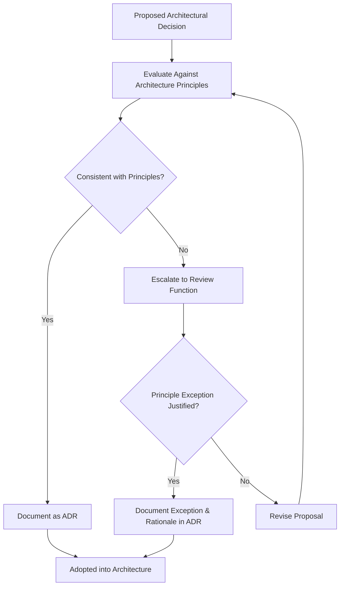
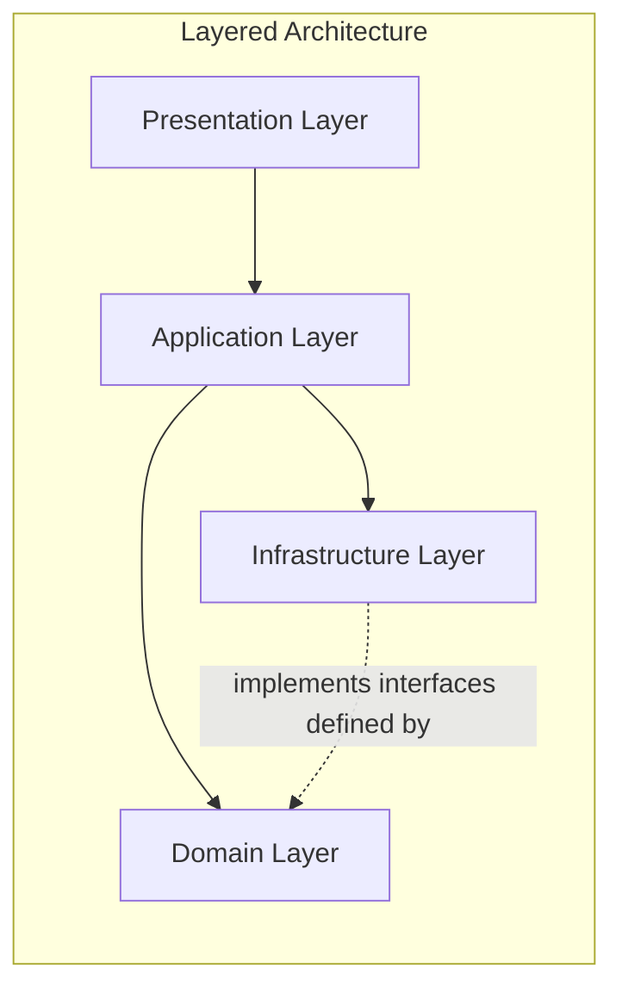
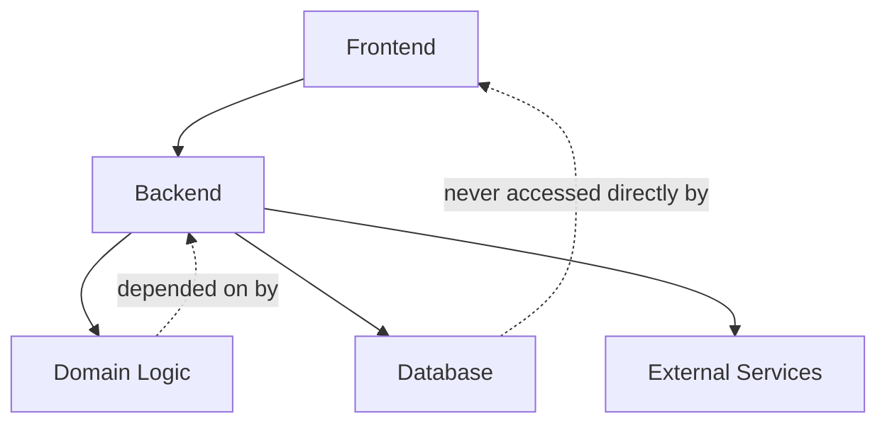
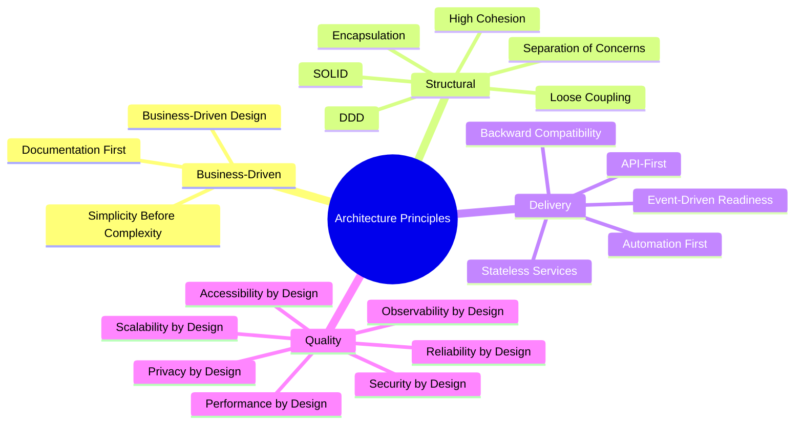

# Architecture Principles

## 1. Document Purpose

This document defines the architectural rules, engineering philosophy, design standards, and decision-making principles that guide the evolution of **StackLeo Tech Store**. These principles apply across Product, Frontend, Backend, API, Database, Infrastructure, DevOps, Security, QA, and the future Mobile channel — every team building or extending the platform is expected to reason from these principles.

This document is the normative reference against which architectural decisions in `03_System_Design` and beyond are evaluated. Where a decision cannot be justified against these principles, it should be revisited rather than adopted.

This document is implementation-independent. It describes architectural philosophy, rules, and rationale — not technology choices, API design, database structure, or code, all of which are addressed in dedicated technical documentation elsewhere in the repository.

## 2. Architectural Philosophy

StackLeo Tech Store's architecture exists to serve the business's trust-first strategy defined in `01_Business/mission.md`, not the other way around. Every architectural quality pursued here is justified by a concrete business need:

- **Modular** — because the business itself is organized into distinct, evolving capabilities (catalog, orders, warranty, and eventually marketplace); the architecture must mirror this so that changing one capability does not destabilize another.
- **Maintainable** — because StackLeo's growth depends on sustained, confident delivery over years, not a single release.
- **Scalable** — because the business plan explicitly anticipates growth from a single-seller MVP to enterprise, marketplace, and international scale, per `02_Product/product-roadmap.md`.
- **Secure** — because trust is the platform's core differentiator, per `01_Business/vision.md`; a security failure is a business failure.
- **Observable** — because operational reliability cannot be assured without the ability to see what the system is actually doing.
- **Testable** — because confidence in correctness must be verifiable, not assumed, especially as the system grows in complexity.
- **Extensible** — because most of the platform's most significant future capability (corporate sales, marketplace, AI) is explicitly deferred, not absent; the architecture must not foreclose it.
- **Cloud-Ready** — because elastic, reliable operation is a precondition for serving a growing customer base without disproportionate operational overhead.

## 3. Core Architecture Principles

Each principle below is elaborated with its intent, followed by a consolidated rule set (ARCH-001–ARCH-023) formalizing it as an enforceable architectural rule.

- **Business-Driven Design** — architecture exists to serve validated business need; every structural decision must trace to `01_Business` or `02_Product` documentation.
- **Domain-Driven Design (DDD)** — the system is organized around business domains and bounded contexts, per `bounded-contexts.md`, not around technical convenience.
- **Separation of Concerns** — distinct responsibilities (presentation, business logic, data access, integration) are kept structurally separate.
- **Single Responsibility** — every component has one clear reason to change.
- **SOLID Principles** — component and service design follows Single Responsibility, Open/Closed, Liskov Substitution, Interface Segregation, and Dependency Inversion.
- **High Cohesion** — related behavior and data are grouped together within a single, well-scoped component.
- **Loose Coupling** — components interact through minimal, well-defined interfaces rather than deep mutual knowledge.
- **Encapsulation** — internal implementation detail is hidden behind stable, intentional boundaries.
- **Composition over Inheritance** — behavior is assembled from smaller, focused parts rather than deep inheritance hierarchies.
- **Convention over Configuration** — sensible defaults reduce unnecessary decision-making and configuration burden.
- **API-First Thinking** — capability is designed as a contract to be consumed, independent of any single consuming channel (Web, future Mobile App, future POS).
- **Stateless Services** — services avoid holding client-specific state locally, supporting reliable scaling and failover.
- **Event-Driven Readiness** — components communicate significant business occurrences as events, consistent with `02_Product/product-modules.md` (Section 10).
- **Security by Design** — security is a first-class design input, not a later addition.
- **Privacy by Design** — customer data handling defaults to the minimum necessary collection and use, per `01_Business/business-rules.md` (BR-128).
- **Scalability by Design** — capacity growth is achievable through addition, not redesign.
- **Reliability by Design** — the system tolerates and recovers from failure gracefully.
- **Observability by Design** — the system inherently exposes the information needed to understand its own behavior.
- **Performance by Design** — responsiveness is treated as a functional requirement, not an afterthought.
- **Accessibility by Design** — customer-facing experience is built to WCAG 2.2 AA expectations from the outset, per `02_Product/non-functional-requirements.md` (Section 11).
- **Documentation First** — significant capability is documented before or alongside its build, not retrospectively.
- **Automation First** — repeatable processes (testing, deployment, verification) are automated rather than manually repeated.
- **Backward Compatibility** — changes preserve existing consumer expectations wherever reasonably possible, with deprecation handled deliberately.
- **Simplicity Before Complexity** — the simplest solution that satisfies validated requirements is preferred over speculative sophistication.

### Rule Set: Core Architecture Principles

| Rule ID | Title | Description | Rationale | Scope | Priority |
|---|---|---|---|---|---|
| ARCH-001 | Business-Driven Design | Every architectural element must trace to a documented business or product need. | Prevents speculative, unjustified complexity. | All | Critical |
| ARCH-002 | Domain-Driven Design | System structure must reflect the bounded contexts defined in `bounded-contexts.md`. | Keeps structure aligned with real business boundaries. | Backend, Database | Critical |
| ARCH-003 | Separation of Concerns | Presentation, business logic, and data access must remain structurally distinct. | Enables independent evolution of each layer. | Frontend, Backend | High |
| ARCH-004 | Single Responsibility | Each component must have exactly one reason to change. | Reduces the blast radius of any single change. | All | High |
| ARCH-005 | SOLID Compliance | Component design must follow SOLID principles. | Produces extensible, testable, low-coupling design. | Backend | High |
| ARCH-006 | High Cohesion | Related behavior and data must be grouped within a single component. | Improves comprehensibility and maintainability. | All | High |
| ARCH-007 | Loose Coupling | Components must interact through minimal, well-defined interfaces. | Limits the impact of change propagating across the system. | All | Critical |
| ARCH-008 | Encapsulation | Internal implementation detail must remain hidden behind stable boundaries. | Allows internal change without breaking consumers. | Backend, API | High |
| ARCH-009 | Composition over Inheritance | Behavior should be composed from smaller parts rather than deep inheritance. | Reduces fragile, hard-to-change hierarchies. | Backend, Frontend | Medium |
| ARCH-010 | Convention over Configuration | Sensible defaults must be preferred over mandatory explicit configuration. | Reduces unnecessary complexity and error surface. | All | Medium |
| ARCH-011 | API-First Thinking | Capability must be designed as a channel-independent contract. | Supports Web, future Mobile App, and future POS without duplication. | API, Backend | Critical |
| ARCH-012 | Stateless Services | Services must avoid holding client-specific state locally. | Enables reliable horizontal scaling and failover. | Backend, Infrastructure | Critical |
| ARCH-013 | Event-Driven Readiness | Significant business occurrences must be expressed as events. | Supports loose coupling and future event-streaming evolution. | Backend | High |
| ARCH-014 | Security by Design | Security requirements must be addressed at design time, not retrofitted. | Security added late is costlier and less effective. | All | Critical |
| ARCH-015 | Privacy by Design | Data collection must default to minimum necessary scope. | Protects customer trust and regulatory standing. | Backend, Database | Critical |
| ARCH-016 | Scalability by Design | Capacity must be extensible through addition, not redesign. | Supports growth from MVP to enterprise scale. | Backend, Infrastructure | High |
| ARCH-017 | Reliability by Design | Components must tolerate and recover from failure gracefully. | Preserves customer trust during partial failure. | All | Critical |
| ARCH-018 | Observability by Design | Components must expose sufficient information to diagnose their own behavior. | Enables timely detection and resolution of issues. | All | Critical |
| ARCH-019 | Performance by Design | Responsiveness targets must be treated as functional requirements. | Directly affects conversion and customer trust. | Frontend, Backend | High |
| ARCH-020 | Accessibility by Design | Customer-facing components must meet WCAG 2.2 AA from initial design. | Ensures the platform serves all customers, per NFR-037–NFR-041. | Frontend | High |
| ARCH-021 | Documentation First | Significant capability must be documented before or alongside implementation. | Preserves shared understanding as the system grows. | All | High |
| ARCH-022 | Automation First | Repeatable processes must be automated rather than manually repeated. | Reduces human error and delivery friction. | DevOps, QA | High |
| ARCH-023 | Backward Compatibility | Changes must preserve existing consumer expectations wherever feasible. | Prevents unnecessary disruption to dependent components and channels. | API, Backend | High |

## 4. Engineering Principles

- **Code Organization** — code is organized by business capability (per bounded context), not by technical layer alone, so a domain's logic remains discoverable in one place.
- **Layer Separation** — presentation, application logic, domain logic, and infrastructure concerns remain distinctly separated, consistent with Clean Architecture.
- **Reusability** — genuinely shared behavior is extracted deliberately; reuse is never pursued at the cost of unrelated domains becoming coupled.
- **Naming Conventions** — naming reflects business terminology from `01_Business/glossary.md` and `02_Product/glossary.md`, not incidental technical jargon.
- **Error Handling Philosophy** — errors are handled explicitly and meaningfully at the layer best positioned to act on them, never silently discarded.
- **Logging Philosophy** — logging captures significant business and operational events with enough context to support diagnosis, consistent with `02_Product/non-functional-requirements.md` (Section 14).
- **Configuration Management** — environment-specific configuration is externalized from code, following Twelve-Factor App principles.
- **Feature Isolation** — new or experimental capability is isolated so it can be introduced, evaluated, and removed without destabilizing existing functionality.
- **Dependency Management** — dependencies are chosen deliberately, kept current, and evaluated for the risk of vendor lock-in.

### Rule Set: Engineering Principles

| Rule ID | Title | Description | Rationale | Scope | Priority |
|---|---|---|---|---|---|
| ARCH-024 | Domain-Aligned Code Organization | Code must be organized around business capability, not technical layer alone. | Keeps a domain's logic discoverable and cohesive. | Backend | High |
| ARCH-025 | Strict Layer Separation | Presentation, application, domain, and infrastructure concerns must remain distinctly separated. | Preserves independent evolution of each layer. | Backend, Frontend | Critical |
| ARCH-026 | Deliberate Reusability | Shared behavior must be extracted only when genuinely shared, not preemptively. | Avoids coupling unrelated domains through premature abstraction. | Backend | Medium |
| ARCH-027 | Business-Aligned Naming | Naming must reflect terminology from `01_Business/glossary.md` and `02_Product/glossary.md`. | Reduces miscommunication between business and engineering. | All | Medium |
| ARCH-028 | Explicit Error Handling | Errors must be handled explicitly at the layer best positioned to act on them. | Prevents silent failure and unclear system behavior. | Backend | Critical |
| ARCH-029 | Meaningful Logging | Logging must capture significant business and operational events with sufficient context. | Supports timely diagnosis and audit. | All | High |
| ARCH-030 | Externalized Configuration | Environment-specific configuration must be externalized from code. | Supports safe, consistent deployment across environments. | Backend, Infrastructure | High |
| ARCH-031 | Feature Isolation | New or experimental capability must be isolated from stable functionality. | Limits blast radius of incomplete or evolving features. | Backend, Frontend | Medium |
| ARCH-032 | Deliberate Dependency Management | External dependencies must be evaluated for necessity, currency, and lock-in risk. | Protects long-term flexibility and maintainability. | All | High |

## 5. System Boundaries

The architecture maintains explicit boundaries between the following layers, each with a distinct responsibility and a controlled interface to its neighbors:

| Boundary | Responsibility | Interacts With |
|---|---|---|
| Frontend | Presents capability to customers and internal users across channels (Web, future Mobile App, future POS). | Backend (via defined contracts only) |
| Backend | Executes business logic and enforces business rules, per `01_Business/business-rules.md`. | Frontend, Database, External Services |
| Database | Persists the authoritative state of each bounded context. | Backend only; never accessed directly by Frontend |
| External Services | Third-party capability (payment, courier, communication) consumed through controlled integration points. | Backend, via `integration-architecture.md` |
| Infrastructure | Provides the runtime environment, scaling, and operational capability underpinning all layers. | All layers, via defined deployment boundaries |

No layer bypasses another to reach a layer beyond its immediate neighbor (e.g., Frontend must never access the Database directly); this boundary discipline is foundational to maintaining loose coupling and independent evolvability.

## 6. Integration Principles

Systems and services integrate through explicit, minimal, and well-documented contracts, never through shared internal state or direct data access:

- Integration points are owned by the bounded context that owns the underlying business data (per `bounded-contexts.md`), preventing ambiguous data ownership.
- External integrations (Section 7 of `system-overview.md`) are isolated behind an integration boundary so that a partner change (e.g., switching a courier or payment provider) does not ripple into unrelated domains.
- Integration failure is treated as an expected condition to be handled gracefully (per Reliability Principles, Section 9), not an exceptional case that can be ignored.
- Synchronous integration is used only where an immediate response is genuinely required; asynchronous, event-based integration is preferred for cross-domain business notifications, per ARCH-013.

## 7. Security Principles

- **Least Privilege** — every actor, human or system, is granted only the access necessary for its defined responsibility, per `02_Product/user-roles.md`.
- **Zero Trust Mindset** — no request is trusted by default based solely on network location or prior authentication elsewhere; authorization is verified at each meaningful boundary.
- **Defense in Depth** — security relies on multiple independent layers of protection, so that a single control failure does not result in a complete compromise.
- **Secure Defaults** — default configuration is the most secure reasonable option, requiring deliberate action to relax rather than deliberate action to secure.
- **Auditability** — security-relevant and business-critical actions are logged immutably, per `02_Product/user-roles.md` (Section 12) and `non-functional-requirements.md` (NFR-028).

### Rule Set: Security Principles

| Rule ID | Title | Description | Rationale | Scope | Priority |
|---|---|---|---|---|---|
| ARCH-033 | Least Privilege Enforcement | Every actor must be granted only the access necessary for its defined responsibility. | Limits the impact of compromised or misused credentials. | Security, Backend | Critical |
| ARCH-034 | Zero Trust Verification | Authorization must be verified at each meaningful boundary, not assumed from prior context. | Prevents lateral movement from a single point of compromise. | Security, Backend | Critical |
| ARCH-035 | Defense in Depth | Security must rely on multiple independent, layered controls. | Ensures no single control failure results in full compromise. | Security, Infrastructure | Critical |
| ARCH-036 | Secure Defaults | Default configuration must be the most secure reasonable option. | Reduces risk from unreviewed or overlooked configuration. | Security, Infrastructure | High |
| ARCH-037 | Immutable Auditability | Security-relevant and business-critical actions must be logged immutably. | Supports accountability, investigation, and compliance. | Security, Backend | Critical |

## 8. Scalability Principles

- **Horizontal Scaling** — capacity is added by increasing the number of running instances, the primary scaling strategy for growth.
- **Stateless Architecture** — services avoid local, instance-bound state, allowing any instance to serve any request.
- **Independent Services** — bounded contexts can scale independently of one another based on their own demand profile.
- **Future Microservice Readiness** — the domain boundaries defined in `bounded-contexts.md` are structured so that a bounded context could, if warranted by future scale, be extracted into an independently deployable service without a fundamental redesign.

### Rule Set: Scalability Principles

| Rule ID | Title | Description | Rationale | Scope | Priority |
|---|---|---|---|---|---|
| ARCH-038 | Horizontal Scaling as Primary Strategy | Capacity growth must be achieved primarily by adding instances, not solely by increasing individual instance size. | Supports sustainable, elastic growth. | Infrastructure, Backend | High |
| ARCH-039 | Statelessness for Scalability | Services must remain stateless to support reliable horizontal scaling. | Enables any instance to serve any request interchangeably. | Backend | Critical |
| ARCH-040 | Independent Domain Scaling | Bounded contexts must be capable of scaling independently based on their own demand. | Prevents low-demand domains from being over-provisioned to match high-demand ones. | Backend, Infrastructure | Medium |
| ARCH-041 | Microservice Extraction Readiness | Bounded context boundaries must remain clean enough to support future extraction into independently deployable services. | Preserves the option to decompose further without a ground-up redesign. | Backend | Medium |

## 9. Reliability Principles

- **Fault Tolerance** — the system continues operating correctly despite isolated component failure, per `non-functional-requirements.md` (NFR-017).
- **Graceful Degradation** — non-critical failures reduce functionality gracefully rather than blocking core capability, per NFR-015.
- **Retry Philosophy** — transient failures are retried in a bounded, sensible manner before being surfaced as failures, per NFR-018.
- **Recovery Thinking** — every component is designed with an explicit answer to "how does this recover from failure," not merely "how does this work when everything succeeds."

### Rule Set: Reliability Principles

| Rule ID | Title | Description | Rationale | Scope | Priority |
|---|---|---|---|---|---|
| ARCH-042 | Fault Isolation | A failure in one component must not cascade into unrelated components. | Preserves overall platform reliability during partial failure. | Backend, Infrastructure | Critical |
| ARCH-043 | Graceful Degradation | Non-critical service failures must degrade functionality gracefully rather than blocking core capability. | Preserves core purchasing capability under partial failure. | Backend, Frontend | Critical |
| ARCH-044 | Bounded Retry Strategy | Transient failures must be retried in a bounded, sensible manner before surfacing failure. | Reduces unnecessary customer-visible failure from momentary issues. | Backend | High |
| ARCH-045 | Explicit Recovery Design | Every component must have an explicit, documented recovery approach for its failure modes. | Ensures failure is planned for, not merely tolerated by accident. | All | High |

## 10. Documentation Principles

- **Ownership** — every architectural document has a designated owner accountable for its accuracy, per `03_System_Design/README.md` (Section 9).
- **Traceability** — every architectural document must trace its content to a business or product source, consistent with ARCH-001.
- **Versioning** — documentation follows the Semantic Versioning approach defined in `00_Project_Overview/changelog.md`.
- **Currency** — documentation is updated alongside the architectural change it describes, not retrospectively batched, consistent with ARCH-021.
- **Accessibility of Documentation** — architecture documentation is written for its intended audience (Section 1), avoiding unnecessary jargon and defining new terms in `glossary.md`.

## 11. Architecture Governance

- **Ownership** — the Solution Architect owns this document and the overall coherence of the principles it defines.
- **Architecture Review Board (Conceptual)** — significant architectural decisions are reviewed by a conceptual review function comprising the Solution Architect, Engineering leads, and Product Manager, ensuring decisions are evaluated from business, technical, and product perspectives together.
- **Decision Process** — proposed architectural decisions are evaluated against this document's principles before adoption; conflicts with existing principles must be explicitly resolved, not silently overridden.
- **ADR Usage** — architecturally significant decisions are recorded in `architecture-decisions.md`, including the principles considered and the rationale for the chosen approach.
- **Review Cadence** — this document is reviewed at the conclusion of each phase defined in `02_Product/product-roadmap.md`, and whenever a proposed decision reveals a gap or ambiguity in existing principles.
- **Change Management** — changes to this document follow the versioning and change management approach defined in `00_Project_Overview/changelog.md`.

*Diagram: Governance Workflow.*

### Governance Responsibilities

| Role | Responsibility |
|---|---|
| Solution Architect | Owns architectural coherence; final authority on principle interpretation. |
| Engineering Leads | Apply principles within their domain; raise conflicts or gaps for review. |
| Product Manager | Ensures principles remain aligned with product direction and roadmap. |
| DevOps Lead | Ensures infrastructure and deployment decisions align with scalability and reliability principles. |
| Security Lead | Ensures security and privacy principles are consistently applied. |
| QA Lead | Validates that testability and observability principles are reflected in practice. |

## 12. Architecture Anti-Patterns

The following practices are explicitly discouraged, as they directly undermine the principles defined in this document:

| Anti-Pattern | Why It's Avoided |
|---|---|
| Tight Coupling | Undermines loose coupling (ARCH-007); makes independent change unsafe. |
| Business Logic in UI | Violates separation of concerns (ARCH-003); duplicates or fragments business rules. |
| Shared Mutable State | Undermines statelessness (ARCH-012, ARCH-039) and reliable scaling. |
| Circular Dependencies | Violates loose coupling and dependency direction (Section on Dependency Direction diagram); makes isolated change or testing impossible. |
| God Objects | Violates single responsibility (ARCH-004) and high cohesion (ARCH-006). |
| Hard-Coded Configuration | Violates externalized configuration (ARCH-030); risks unsafe cross-environment behavior. |
| Duplicate Business Rules | Risks inconsistent enforcement of rules defined in `01_Business/business-rules.md`; a rule must have one authoritative home. |
| Vendor Lock-In Without Justification | Undermines deliberate dependency management (ARCH-032) and long-term flexibility. |
| Undocumented Architectural Decisions | Violates documentation-first (ARCH-021) and ADR governance (Section 11). |
| Premature Optimization | Violates simplicity before complexity; invests effort against unvalidated need. |

## 13. Future Architecture Vision

The principles in this document are deliberately structured to remain valid as the platform evolves toward:

- **Marketplace** — bounded contexts remain extensible to accommodate seller-owned data and processes without redesigning existing domains, per ARCH-002, ARCH-041.
- **AI** — AI-assisted capability is introduced as an additive layer over existing domains (search, recommendations, fraud detection), consistent with event-driven readiness (ARCH-013) and `02_Product/product-modules.md` (MOD-032).
- **Mobile** — API-first thinking (ARCH-011) ensures Mobile App delivery consumes the same channel-independent contracts as the Web experience.
- **Internationalization** — statelessness, externalized configuration, and clean domain boundaries support multi-currency and multi-language extension without core rework.
- **Multi-Region Deployment** — stateless, horizontally scalable services (ARCH-012, ARCH-038, ARCH-039) provide the foundation for future multi-region operation as international expansion matures.
- **Microservices** — bounded context boundaries (ARCH-002, ARCH-041) are maintained clean enough to support future decomposition into independently deployable services, should scale justify it.
- **Event Streaming** — event-driven readiness (ARCH-013) positions the platform to adopt a formal event-streaming backbone as cross-domain interaction volume grows.

*Diagram: Layered Architecture Concept — dependencies point inward toward the Domain layer, consistent with Clean Architecture; Infrastructure implements interfaces the Domain defines, rather than the Domain depending on Infrastructure directly.*

*Diagram: Dependency Direction — dependencies flow from outer layers toward the Domain; outer layers (Database, External Services, Frontend) never become dependencies of the Domain itself.*

*Diagram: Architecture Principles Map.*

## 14. Document Information

| Property | Value |
|----------|-------|
| Document | architecture-principles.md |
| Version | 1.0.0 |
| Status | Active |
| Maintained By | StackLeo |
| Last Updated | 2026-07-17 |

---

© StackLeo. All Rights Reserved.
