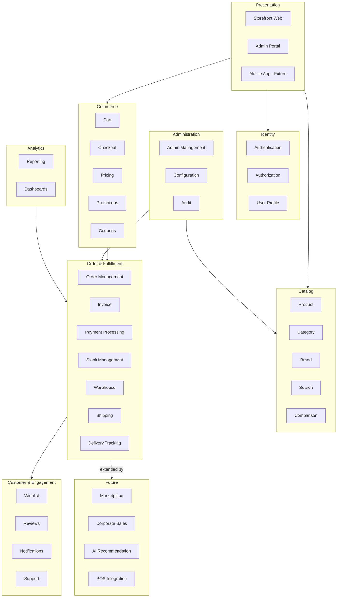
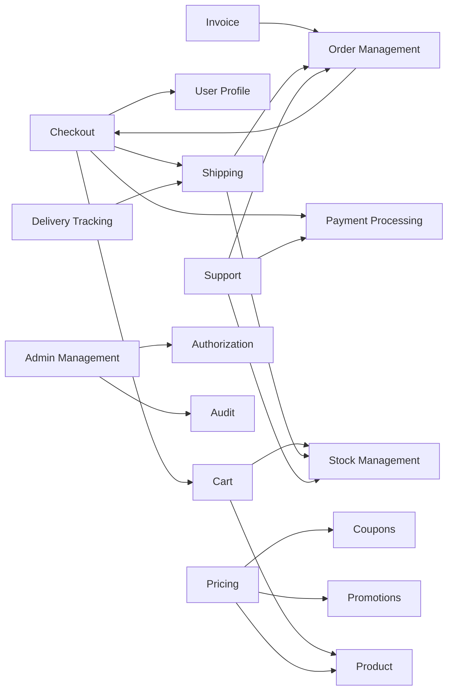
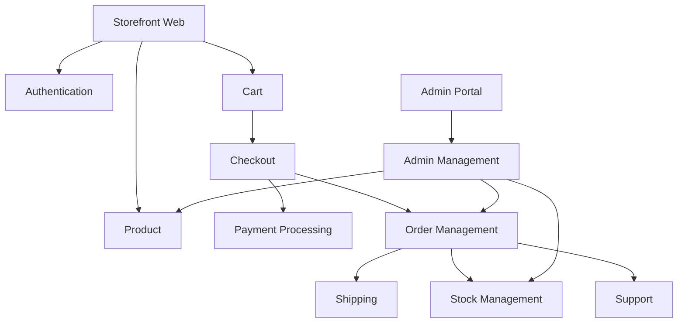
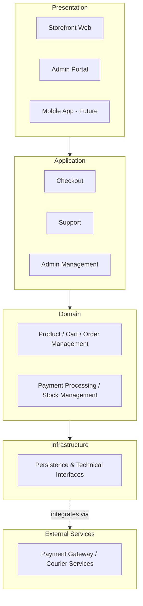
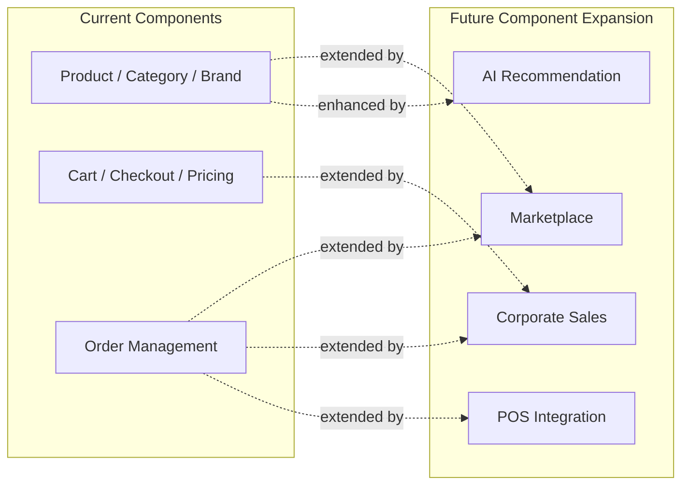

# Component Architecture

## 1. Document Purpose

This document is the official Component Architecture for **StackLeo Tech Store**, presented at a C4 Model Level 3 (Component) view. It defines the logical software components that make up the platform: their responsibilities, relationships, boundaries, and dependencies.

- **What a Software Component Is** — a cohesive, independently reasoned-about unit of software responsibility that implements a specific slice of business capability. A component is more granular than a bounded context but does not itself describe deployable services or infrastructure.
- **Why Component Architecture Exists** — it bridges the conceptual domain model and bounded contexts with a concrete (but still technology-agnostic) internal structure that engineering can use to plan implementation, without yet committing to specific services, deployment topology, or technology.
- **Relationship with the Domain Model** — every component in this document exists to implement one or more entities, aggregates, or domain services defined in `domain-model.md`.
- **Relationship with Bounded Contexts** — components are grouped and scoped strictly within the bounded contexts defined in `bounded-contexts.md`; no component spans multiple bounded contexts.
- **Relationship with Services** — this document describes logical components only. How components are grouped into deployable services is addressed separately in `service-architecture.md`.

This document is implementation-independent. It is not a deployment diagram and not a microservice design — it describes logical software structure, not runtime topology or service boundaries, both of which are addressed in `deployment-architecture.md` and `service-architecture.md` respectively.

## 2. Architectural Philosophy

- **Modular Architecture** — the platform is decomposed into components with clearly scoped, singular responsibility, consistent with `architecture-principles.md` (ARCH-004).
- **Separation of Concerns** — presentation, application coordination, domain logic, and infrastructure access are handled by distinct component categories (Section 6), never blended within a single component.
- **High Cohesion** — each component groups tightly related responsibility (e.g., all Pricing logic resides in one component), consistent with ARCH-006.
- **Loose Coupling** — components depend on one another through minimal, intentional interfaces, consistent with ARCH-007.
- **Layered Architecture** — components are organized into Presentation, Application, Domain, and Infrastructure layers (Section 6), with dependencies flowing inward.
- **Clean Architecture Influence** — Domain-layer components have no dependency on Infrastructure-layer components; Infrastructure implements interfaces the Domain defines, per `architecture-principles.md` (Layered Architecture Concept diagram).
- **DDD Alignment** — component boundaries are drawn along the bounded contexts defined in `bounded-contexts.md`, ensuring structure mirrors real business domain boundaries rather than incidental technical grouping.

## 3. Component Catalog

| Category | Components | Component ID Range |
|---|---|---|
| Presentation | Storefront Web, Admin Portal, Mobile App (Future) | COMP-001–COMP-003 |
| Identity | Authentication, Authorization, User Profile | COMP-004–COMP-006 |
| Catalog | Product, Category, Brand, Search, Product Comparison | COMP-007–COMP-011 |
| Commerce | Cart, Checkout, Pricing, Promotions, Coupons | COMP-012–COMP-016 |
| Order | Order Management, Invoice | COMP-017–COMP-018 |
| Payment | Payment Processing | COMP-019 |
| Inventory | Stock Management, Warehouse | COMP-020–COMP-021 |
| Logistics | Shipping, Delivery Tracking | COMP-022–COMP-023 |
| Customer | Wishlist, Reviews, Notifications, Support | COMP-024–COMP-027 |
| Analytics | Reporting, Dashboards | COMP-028–COMP-029 |
| Administration | Admin Management, Configuration, Audit | COMP-030–COMP-032 |
| Future | Marketplace, Corporate Sales, AI Recommendation, POS Integration | COMP-033–COMP-036 |

**Total Components: 36**

Each component below follows the template defined in Section 4, presented across three tables per category: **Identity & Purpose**, **Behavior**, and **Traceability**.

---

## 4. Component Specifications

### 4.1 Presentation Components

**Identity & Purpose**

| ID | Name | Purpose | Business Capabilities |
|---|---|---|---|
| COMP-001 | Storefront Web | Presents the customer-facing shopping experience on the Web channel. | Catalog browsing, cart, checkout, account, post-purchase self-service |
| COMP-002 | Admin Portal | Presents the internal administrative experience for staff. | Catalog, order, customer, inventory, and promotion administration |
| COMP-003 | Mobile App (Future) | Presents the customer-facing shopping experience on a native mobile channel. | Same customer capabilities as Storefront Web, mobile-native |

**Behavior**

| ID | Responsibilities | Inputs | Outputs |
|---|---|---|---|
| COMP-001 | Render customer-facing views; capture customer interaction; present business responses. | Customer interaction events, application-layer responses | Rendered customer experience, submitted customer requests |
| COMP-002 | Render internal administrative views; capture staff interaction; present business responses. | Staff interaction events, application-layer responses | Rendered admin experience, submitted administrative requests |
| COMP-003 | Render customer-facing views natively on mobile; capture customer interaction. | Customer interaction events, application-layer responses | Rendered mobile experience, submitted customer requests |

**Traceability**

| ID | Dependencies | Related Domains / Contexts | Related Components | Future Enhancements | Risks | Notes |
|---|---|---|---|---|---|---|
| COMP-001 | Application-layer components (Sections 4.2–4.10) | Customer, Catalog & Discovery, Commerce contexts | COMP-004, COMP-007, COMP-012 | Enhanced personalization surfaces | Divergence from Mobile App experience if not API-first | Primary current customer channel |
| COMP-002 | Application-layer components; COMP-030–COMP-032 | Platform Administration context | COMP-030, COMP-032 | Customizable dashboard widgets | Administrative error at scale without strong RBAC enforcement | Consumed only by internal staff |
| COMP-003 | Same application-layer components as COMP-001 | Customer, Catalog & Discovery, Commerce contexts | COMP-001 (shares contracts) | Push notification integration | Feature parity gap vs. Web if contracts diverge | Not yet active; targeted per `product-roadmap.md` |

### 4.2 Identity Components

**Identity & Purpose**

| ID | Name | Purpose | Business Capabilities |
|---|---|---|---|
| COMP-004 | Authentication | Verifies the identity of customers and internal users. | Registration, login, credential verification, session issuance |
| COMP-005 | Authorization | Determines what an authenticated actor is permitted to do. | Role and permission enforcement, per `02_Product/user-roles.md` |
| COMP-006 | User Profile | Maintains customer and internal user profile data. | Profile and preference management |

**Behavior**

| ID | Responsibilities | Inputs | Outputs |
|---|---|---|---|
| COMP-004 | Verify credentials; issue and expire sessions; enforce login security. | Registration/login requests, credentials | Verified identity, session token/state |
| COMP-005 | Evaluate role/permission scope for a requested action. | Actor identity, requested action | Authorization decision (allow/deny) |
| COMP-006 | Store and update profile and preference data. | Profile update requests | Current profile state |

**Traceability**

| ID | Dependencies | Related Domains / Contexts | Related Components | Future Enhancements | Risks | Notes |
|---|---|---|---|---|---|---|
| COMP-004 | None (foundational) | Identity domain / Identity & Access context | COMP-005, COMP-006 | MFA readiness, per NFR-026 | Credential compromise | Foundational to all account-scoped components |
| COMP-005 | COMP-004 | Identity domain / Identity & Access, Platform Administration contexts | COMP-030 | Granular ABAC-style scoping | Over-permissioned roles | Enforces `02_Product/user-roles.md` model |
| COMP-006 | COMP-004 | Customer domain / Customer context | COMP-024, COMP-027 | Profile completeness scoring | Inconsistent profile data across channels | Distinct from Authorization's role data |

### 4.3 Catalog Components

**Identity & Purpose**

| ID | Name | Purpose | Business Capabilities |
|---|---|---|---|
| COMP-007 | Product | Maintains the authoritative product record. | Product listing, variant, and pricing state management |
| COMP-008 | Category | Maintains the category hierarchy. | Catalog navigation structure |
| COMP-009 | Brand | Maintains verified brand associations. | Brand-based discovery, authenticity assurance |
| COMP-010 | Search | Enables keyword-based product discovery. | Search indexing and query resolution |
| COMP-011 | Product Comparison | Enables side-by-side product comparison. | Comparative specification presentation |

**Behavior**

| ID | Responsibilities | Inputs | Outputs |
|---|---|---|---|
| COMP-007 | Maintain product data completeness and publish state. | Product data from Admin Portal | Published product records |
| COMP-008 | Maintain category structure and product associations. | Category change requests | Category-organized catalog view |
| COMP-009 | Maintain and verify brand records. | Brand documentation, association requests | Verified brand records |
| COMP-010 | Index catalog content; resolve search queries. | Search queries, catalog data | Ranked, relevant results |
| COMP-011 | Retrieve and present specifications for selected products. | Selected product identifiers | Side-by-side comparison view |

**Traceability**

| ID | Dependencies | Related Domains / Contexts | Related Components | Future Enhancements | Risks | Notes |
|---|---|---|---|---|---|---|
| COMP-007 | COMP-009 | Catalog, Product domains / Catalog & Discovery context | COMP-008, COMP-010, COMP-012, COMP-020 | Rich media catalog content | Inaccurate or incomplete listings | Aggregate root per `domain-model.md` (Product Aggregate) |
| COMP-008 | COMP-007 | Catalog domain / Catalog & Discovery context | COMP-007 | Dynamic merchandising | Broken category-product linkage | — |
| COMP-009 | None | Catalog domain / Catalog & Discovery context | COMP-007 | Brand storefront pages | Unauthorized brand association | — |
| COMP-010 | COMP-007 | Catalog domain / Catalog & Discovery context | COMP-007 | AI Search (COMP-035) | Poor relevance ranking | — |
| COMP-011 | COMP-007 | Catalog, Product domains / Catalog & Discovery context | COMP-007 | AI-assisted comparison highlights | Missing specification data | — |

### 4.4 Commerce Components

**Identity & Purpose**

| ID | Name | Purpose | Business Capabilities |
|---|---|---|---|
| COMP-012 | Cart | Holds a customer's intended purchase prior to checkout. | Cart line item and validity management |
| COMP-013 | Checkout | Converts a validated cart into a confirmed order request. | Billing, shipping, and payment confirmation flow |
| COMP-014 | Pricing | Determines the applicable price for a product given active promotions. | Price calculation and promotional pricing application |
| COMP-015 | Promotions | Manages time-bound campaigns and flash sales. | Campaign and flash sale governance |
| COMP-016 | Coupons | Manages discount code creation and validation. | Coupon eligibility and redemption |

**Behavior**

| ID | Responsibilities | Inputs | Outputs |
|---|---|---|---|
| COMP-012 | Validate cart contents against stock and pricing. | Product selections, quantities | Validated cart |
| COMP-013 | Collect and validate billing, shipping, and payment inputs. | Cart contents, address, payment selection | Confirmed checkout request |
| COMP-014 | Calculate final price incorporating base price and active promotions. | Product, active campaigns/coupons | Final applicable price |
| COMP-015 | Define and enforce promotional pricing windows and stock allocation. | Campaign configuration | Active promotional pricing |
| COMP-016 | Validate coupon eligibility and apply discount. | Coupon code, cart contents | Adjusted order total |

**Traceability**

| ID | Dependencies | Related Domains / Contexts | Related Components | Future Enhancements | Risks | Notes |
|---|---|---|---|---|---|---|
| COMP-012 | COMP-007, COMP-020 | Cart domain / Commerce context | COMP-013 | Persistent cross-device cart | Stock conflict at checkout | Cart Aggregate per `domain-model.md` |
| COMP-013 | COMP-012, COMP-006, COMP-019, COMP-022 | Checkout domain / Commerce context | COMP-017 | One-click checkout | Checkout drop-off | Coordinates Cart → Order transition |
| COMP-014 | COMP-007, COMP-015, COMP-016 | Catalog, Promotions domains / Commerce context | COMP-012, COMP-013 | Dynamic pricing (Future) | Pricing conflicts under concurrent promotions | Domain Service per `domain-model.md` (Section 7) |
| COMP-015 | COMP-007, COMP-020 | Promotions domain / Commerce context | COMP-014 | AI-optimized promotion timing | Over-discounting | — |
| COMP-016 | COMP-012 | Promotions domain / Commerce context | COMP-014 | Personalized coupon targeting | Coupon abuse | — |

### 4.5 Order Components

**Identity & Purpose**

| ID | Name | Purpose | Business Capabilities |
|---|---|---|---|
| COMP-017 | Order Management | Owns the authoritative order lifecycle record. | Order status tracking and history |
| COMP-018 | Invoice | Produces compliant financial documentation for orders. | Invoice generation and retrieval |

**Behavior**

| ID | Responsibilities | Inputs | Outputs |
|---|---|---|---|
| COMP-017 | Track order status through its defined lifecycle. | Confirmed checkout data | Current and historical order state |
| COMP-018 | Generate and store compliant invoices. | Confirmed order and pricing data | Customer-accessible invoice |

**Traceability**

| ID | Dependencies | Related Domains / Contexts | Related Components | Future Enhancements | Risks | Notes |
|---|---|---|---|---|---|---|
| COMP-017 | COMP-013 | Order domain / Order & Fulfillment context | COMP-018, COMP-019, COMP-022, COMP-024, COMP-025, COMP-026 | Order modification self-service | Order state inconsistency | Order Aggregate root per `domain-model.md` |
| COMP-018 | COMP-017 | Order domain / Order & Fulfillment context | COMP-017 | Digital invoice archive | Non-compliant invoice content | — |

### 4.6 Payment Component

**Identity & Purpose**

| ID | Name | Purpose | Business Capabilities |
|---|---|---|---|
| COMP-019 | Payment Processing | Processes and verifies payment for orders. | COD and digital payment handling, verification, refund coordination |

**Behavior**

| ID | Responsibilities | Inputs | Outputs |
|---|---|---|---|
| COMP-019 | Route payment to appropriate method; confirm success or failure; coordinate refunds. | Payment method, amount, order reference | Payment confirmation, failure, or refund status |

**Traceability**

| ID | Dependencies | Related Domains / Contexts | Related Components | Future Enhancements | Risks | Notes |
|---|---|---|---|---|---|---|
| COMP-019 | COMP-013, External Payment Gateway (see `integration-architecture.md`) | Payment domain / Commerce context | COMP-013, COMP-017 | EMI, wallet support | Payment gateway downtime | Payment Aggregate per `domain-model.md` |

### 4.7 Inventory Components

**Identity & Purpose**

| ID | Name | Purpose | Business Capabilities |
|---|---|---|---|
| COMP-020 | Stock Management | Maintains accurate, real-time stock levels. | Stock deduction, reservation, replenishment |
| COMP-021 | Warehouse | Manages physical fulfillment operations. | Picking, packing, stock transfer |

**Behavior**

| ID | Responsibilities | Inputs | Outputs |
|---|---|---|---|
| COMP-020 | Deduct, reserve, and replenish stock. | Order events, restocking data | Real-time stock availability |
| COMP-021 | Pick, pack, and prepare orders; process stock transfers. | Order data, stock location data | Fulfillment-ready shipments |

**Traceability**

| ID | Dependencies | Related Domains / Contexts | Related Components | Future Enhancements | Risks | Notes |
|---|---|---|---|---|---|---|
| COMP-020 | COMP-007 | Inventory domain / Order & Fulfillment context | COMP-012, COMP-015, COMP-021, COMP-022 | Predictive stock alerts | Overselling | Inventory Aggregate per `domain-model.md` |
| COMP-021 | COMP-020 | Inventory domain / Order & Fulfillment context | COMP-020, COMP-022 | Multi-warehouse routing | Picking or packing errors | — |

### 4.8 Logistics Components

**Identity & Purpose**

| ID | Name | Purpose | Business Capabilities |
|---|---|---|---|
| COMP-022 | Shipping | Coordinates courier delivery of orders. | Courier assignment, delivery zone management |
| COMP-023 | Delivery Tracking | Tracks and exposes delivery status. | Delivery status lifecycle tracking |

**Behavior**

| ID | Responsibilities | Inputs | Outputs |
|---|---|---|---|
| COMP-022 | Assign courier partners based on delivery zone. | Order and address data, courier network status | Assigned courier, shipment record |
| COMP-023 | Track and expose delivery status updates. | Courier-reported status updates | Current delivery status |

**Traceability**

| ID | Dependencies | Related Domains / Contexts | Related Components | Future Enhancements | Risks | Notes |
|---|---|---|---|---|---|---|
| COMP-022 | COMP-017, COMP-020, External Courier Services | Shipping domain / Order & Fulfillment context | COMP-023 | Own delivery fleet | Courier service disruption | Shipment entity per `domain-model.md` |
| COMP-023 | COMP-022 | Shipping domain / Order & Fulfillment context | COMP-017, COMP-026 | Live map tracking | Stale tracking data | — |

### 4.9 Customer Components

**Identity & Purpose**

| ID | Name | Purpose | Business Capabilities |
|---|---|---|---|
| COMP-024 | Wishlist | Maintains customer-saved products of interest. | Wishlist management |
| COMP-025 | Reviews | Captures verified-purchase customer feedback. | Review submission and moderation |
| COMP-026 | Notifications | Delivers business-event-driven customer communication. | Multi-channel notification dispatch |
| COMP-027 | Support | Supports customer inquiry, return, and warranty case handling. | Case management for returns, warranty, general support |

**Behavior**

| ID | Responsibilities | Inputs | Outputs |
|---|---|---|---|
| COMP-024 | Add, remove, and expose wishlist items. | Customer wishlist actions | Current wishlist state |
| COMP-025 | Verify purchase; moderate and publish reviews. | Customer review submission | Published product review |
| COMP-026 | Trigger and deliver notifications based on business events. | Order, account, promotional events | Delivered customer notifications |
| COMP-027 | Manage return, warranty, and general support case lifecycle. | Customer inquiry, return, or claim submission | Case resolution outcome |

**Traceability**

| ID | Dependencies | Related Domains / Contexts | Related Components | Future Enhancements | Risks | Notes |
|---|---|---|---|---|---|---|
| COMP-024 | COMP-006, COMP-007 | Customer domain / Customer context | COMP-007 | Price/stock alerts | No proactive re-engagement | — |
| COMP-025 | COMP-006, COMP-017 | Reviews domain / Post-Purchase context | COMP-007 | Review helpfulness voting | Fake or abusive reviews | — |
| COMP-026 | COMP-006, COMP-017, External Email/SMS Services | Notifications domain / Engagement context | COMP-017, COMP-022, COMP-023, COMP-027 | Push notifications (Mobile App) | Delivery failure or delay | — |
| COMP-027 | COMP-006, COMP-017, COMP-026 | Returns, Warranty domains / Post-Purchase context | COMP-017, COMP-019, COMP-020 | Self-service case tracking | Fragmented case visibility | Return Aggregate, Warranty Aggregate per `domain-model.md` |

### 4.10 Analytics Components

**Identity & Purpose**

| ID | Name | Purpose | Business Capabilities |
|---|---|---|---|
| COMP-028 | Reporting | Produces standard operational and financial reports. | Sales, inventory, and customer reporting |
| COMP-029 | Dashboards | Presents aggregated behavioral and performance insight. | Analytics visualization |

**Behavior**

| ID | Responsibilities | Inputs | Outputs |
|---|---|---|---|
| COMP-028 | Compile structured, role-scoped business reports. | Data from Order, Inventory, Finance-relevant components | Standard business reports |
| COMP-029 | Aggregate and visualize cross-component data for insight. | Data from Commerce, Order, Customer components | Behavioral and performance dashboards |

**Traceability**

| ID | Dependencies | Related Domains / Contexts | Related Components | Future Enhancements | Risks | Notes |
|---|---|---|---|---|---|---|
| COMP-028 | COMP-017, COMP-020, COMP-019 | Analytics domain / Business Intelligence context | COMP-002 | Scheduled report delivery | Report inaccuracy | — |
| COMP-029 | COMP-017, COMP-012, COMP-006 | Analytics domain / Business Intelligence context | COMP-002 | Predictive analytics (AI) | Data quality inconsistency | — |

### 4.11 Administration Components

**Identity & Purpose**

| ID | Name | Purpose | Business Capabilities |
|---|---|---|---|
| COMP-030 | Admin Management | Provides centralized internal control over platform operations. | Role, permission, and cross-component administration |
| COMP-031 | Configuration | Maintains platform-wide business configuration. | Business rule parameters, channel configuration |
| COMP-032 | Audit | Preserves an accountable record of administrative actions. | Immutable audit logging |

**Behavior**

| ID | Responsibilities | Inputs | Outputs |
|---|---|---|---|
| COMP-030 | Provide unified administrative access to other components, scoped by role. | Administrative actions from authorized users | Administered business state across components |
| COMP-031 | Store and apply platform-wide business configuration. | Configuration changes from authorized Admin Users | Consistent, current business configuration |
| COMP-032 | Record actor, action, and timestamp for governed actions. | Administrative action events from other components | Immutable audit trail |

**Traceability**

| ID | Dependencies | Related Domains / Contexts | Related Components | Future Enhancements | Risks | Notes |
|---|---|---|---|---|---|---|
| COMP-030 | COMP-005, COMP-032 | Administration domain / Platform Administration context | COMP-002, COMP-007, COMP-017, COMP-020 | Customizable dashboard widgets | Administrative error at scale | — |
| COMP-031 | COMP-005 | Administration domain / Platform Services context | All components (configuration consumer) | Configuration versioning and rollback | Misconfiguration impact | — |
| COMP-032 | COMP-005 | Administration domain / Identity & Access context | COMP-030 | Real-time audit alerting | Incomplete logging coverage | — |

### 4.12 Future Components

**Identity & Purpose**

| ID | Name | Purpose | Business Capabilities |
|---|---|---|---|
| COMP-033 | Marketplace | Enables third-party sellers to list and sell products. | Seller onboarding, listing approval, commission, settlement |
| COMP-034 | Corporate Sales | Serves organizational and bulk buyers. | Corporate accounts, negotiated pricing, bulk order handling |
| COMP-035 | AI Recommendation | Provides AI-assisted search relevance and product recommendations. | Personalized discovery |
| COMP-036 | POS Integration | Integrates in-store point-of-sale with online inventory and orders. | Unified in-store and online transaction handling |

**Behavior**

| ID | Responsibilities | Inputs | Outputs |
|---|---|---|---|
| COMP-033 | Onboard and govern sellers; calculate commission and settlement. | Seller applications, listings, marketplace order data | Approved seller listings, seller payouts |
| COMP-034 | Manage corporate accounts and negotiated pricing terms. | Corporate account agreements, bulk order requests | Fulfilled corporate orders |
| COMP-035 | Generate suggestions and improved search ranking from behavior and catalog signals. | Customer browsing and order history, search queries | Personalized suggestions, ranked search results |
| COMP-036 | Synchronize in-store transactions with online inventory and order records. | In-store transaction data | Unified order and inventory state |

**Traceability**

| ID | Dependencies | Related Domains / Contexts | Related Components | Future Enhancements | Risks | Notes |
|---|---|---|---|---|---|---|
| COMP-033 | COMP-007, COMP-030, COMP-019 | Marketplace domain / Business Expansion context | COMP-007, COMP-017 | Seller analytics dashboard | Seller quality or authenticity risk | Not yet active; Phase 5 |
| COMP-034 | COMP-017, COMP-005 | Corporate Sales domain / Business Expansion context | COMP-017, COMP-014 | Self-service corporate portal | Non-standard pricing risk | Not yet active; Phase 4 |
| COMP-035 | COMP-010, COMP-011, COMP-017 | Analytics domain / Intelligence & Automation context | COMP-007, COMP-010 | Multilingual, cross-market capability | Reduced transparency perception | Not yet active; Phase 6 |
| COMP-036 | COMP-017, COMP-020 | Order, Inventory domains / Business Expansion context | COMP-017, COMP-020 | Unified omnichannel loyalty tracking | Inventory desynchronization | Not yet active; Phase 4–5 |

---

## 4.13 Overall Component Architecture

*Diagram: Overall Component Architecture.*

## 4.14 Component Dependency Diagram

*Diagram: Component Dependency Diagram — direction of arrows indicates "depends on."*

### Dependency Matrix

| Component | Depends On (Upstream) | Depended On By (Downstream) |
|---|---|---|
| COMP-004 Authentication | None | COMP-005, COMP-006, COMP-001, COMP-002 |
| COMP-007 Product | COMP-009 | COMP-008, COMP-010, COMP-011, COMP-012, COMP-014, COMP-015, COMP-020, COMP-024, COMP-033 |
| COMP-012 Cart | COMP-007, COMP-020 | COMP-013, COMP-016 |
| COMP-013 Checkout | COMP-012, COMP-006, COMP-019, COMP-022 | COMP-017 |
| COMP-017 Order Management | COMP-013 | COMP-018, COMP-019, COMP-022, COMP-024–027, COMP-028, COMP-034, COMP-036 |
| COMP-019 Payment Processing | COMP-013, External Payment Gateway | COMP-013, COMP-017 |
| COMP-020 Stock Management | COMP-007 | COMP-012, COMP-015, COMP-021, COMP-022, COMP-036 |
| COMP-022 Shipping | COMP-017, COMP-020, External Courier Services | COMP-023 |
| COMP-030 Admin Management | COMP-005, COMP-032 | COMP-002, COMP-007, COMP-017, COMP-020 |
| COMP-033 Marketplace (Future) | COMP-007, COMP-030, COMP-019 | COMP-007, COMP-017 |

### Ownership Matrix

| Component Category | Owning Bounded Context (per `bounded-contexts.md`) | Primary Owner |
|---|---|---|
| Presentation | Cross-cutting (consumes all contexts) | Product Team, UX Design |
| Identity | Identity & Access | Engineering, Security Lead |
| Catalog | Catalog & Discovery | Product Team, Merchandising |
| Commerce | Commerce | Product Team, Marketing |
| Order | Order & Fulfillment | Operations |
| Payment | Commerce | Finance |
| Inventory | Order & Fulfillment | Operations, Warehouse Team |
| Logistics | Order & Fulfillment | Operations |
| Customer | Customer, Post-Purchase, Engagement | Customer Support, Marketing |
| Analytics | Business Intelligence | Management, Finance |
| Administration | Platform Administration | Product Team, Operations |
| Future | Business Expansion, Intelligence & Automation | Founder / Business Owner, Product Team |

---

## 5. Component Relationships

- **Dependency Direction** — dependencies flow from Presentation components toward Application/Domain components, and from Application/Domain components toward Infrastructure interfaces (Section 6); no Domain component depends on a Presentation component.
- **Collaboration** — components collaborate through explicit calls or business events (e.g., Order Management emits an event Shipping and Notifications react to), never through shared internal state.
- **Ownership** — each component has exactly one owning bounded context (per `bounded-contexts.md`); no two components from different contexts jointly own the same business data.
- **Data Flow (Conceptual)** — customer intent flows from Presentation through Commerce components into Order Management, which then coordinates Payment, Inventory, and Logistics; post-purchase flows (Returns, Warranty) reference Order Management as their source of truth.
- **Responsibility Boundaries** — a component may read data it depends on but must never directly modify data owned by another component; changes must occur through the owning component's own interface.

*Diagram: Component Interaction Map — the core customer-to-fulfillment interaction path.*

## 6. Layered View

| Layer | Responsibility | Example Components |
|---|---|---|
| Presentation Layer | Presents capability to customers and internal users. | Storefront Web, Admin Portal, Mobile App (Future) |
| Application Layer | Coordinates use-case-level workflows across domain components. | Checkout, Support, Admin Management |
| Domain Layer | Encapsulates business rules and state for a specific business concept. | Product, Cart, Order Management, Payment Processing, Stock Management |
| Infrastructure Layer | Implements technical concerns (persistence, external communication) behind interfaces the Domain layer defines. | Not enumerated in this document; addressed in `deployment-architecture.md` |
| External Services | Third-party capability consumed through controlled integration points. | Payment Gateway, Courier Services (see `integration-architecture.md`) |

*Diagram: Layered Architecture Diagram.*

## 7. Component Interaction Principles

- **Loose Coupling** — components interact through stable, minimal interfaces; internal implementation changes within one component must not require changes to its dependents, consistent with ARCH-007.
- **High Cohesion** — each component's responsibility, as documented in Section 4, remains singular and well-scoped, consistent with ARCH-006.
- **Interface-Based Interaction** — components expose their capability through defined interfaces rather than exposing internal state, consistent with encapsulation (ARCH-008).
- **Event Readiness** — significant state changes (Order Created, Payment Completed, Return Approved) are exposed as events other components can react to, consistent with `domain-model.md` (Section 8) and ARCH-013.
- **API Readiness** — every component's interface is designed to be equally consumable by the Storefront Web today and the future Mobile App and POS Integration components, consistent with API-first thinking (ARCH-011).

## 8. Quality Considerations

| Quality Attribute | How Component Architecture Supports It |
|---|---|
| Scalability | Components with independent scaling needs (e.g., Search vs. Admin Management) can be scaled independently once mapped to services in `service-architecture.md`. |
| Security | Authentication and Authorization components provide a single, consistent enforcement point consumed by every other component. |
| Reliability | Component boundaries double as fault isolation boundaries, consistent with `quality-attributes.md` (Section 6). |
| Performance | Cohesive, narrowly scoped components avoid unnecessary cross-component chatter on the customer-facing critical path (e.g., Checkout). |
| Maintainability | Clear component boundaries and documented dependencies (Section 4) keep the impact of change predictable. |
| Testability | Components with well-defined interfaces can be tested in isolation from their dependents. |
| Observability | Component boundaries provide natural scoping for logging, metrics, and health checks, per `observability.md`. |

## 9. Future Evolution

- **Marketplace** — COMP-033 extends COMP-007 (Product) and COMP-017 (Order Management) rather than duplicating their responsibility, consistent with `domain-model.md` (Section 11).
- **AI Services** — COMP-035 layers over COMP-010 (Search) and COMP-011 (Product Comparison) as an enhancement, not a replacement.
- **Microservices Migration** — component boundaries in this document are drawn to align with the bounded contexts in `bounded-contexts.md`, preserving the option to extract any component category into an independently deployable service, per ARCH-041.
- **Event-Driven Architecture** — the event readiness principle (Section 7) positions components to adopt a formal event-streaming backbone as cross-component interaction volume grows.
- **Mobile Applications** — COMP-003 is designed to consume the same Application-layer components as COMP-001, avoiding duplicated business logic.
- **International Expansion** — Pricing (COMP-014) and Shipping (COMP-022) are structured to accommodate multi-currency and cross-border logistics extensions without requiring new components.

*Diagram: Future Component Expansion.*

## 10. Governance

- **Component Ownership** — each component has a designated owner aligned to its bounded context owner, per `bounded-contexts.md`.
- **Versioning** — this document follows the Semantic Versioning approach defined in `00_Project_Overview/changelog.md`.
- **Review Process** — component boundaries are reviewed whenever a new feature (`02_Product/product-features.md`) or module (`02_Product/product-modules.md`) does not map cleanly to an existing component.
- **Architectural Compliance** — new or modified components are reviewed against `architecture-principles.md` before adoption, ensuring continued alignment with loose coupling, high cohesion, and layered architecture expectations.

## 11. Document Information

| Property | Value |
|----------|-------|
| Document | component-architecture.md |
| Version | 1.0.0 |
| Status | Active |
| Maintained By | StackLeo |
| Last Updated | 2026-07-17 |

---

© StackLeo. All Rights Reserved.
