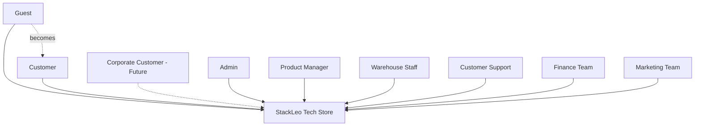
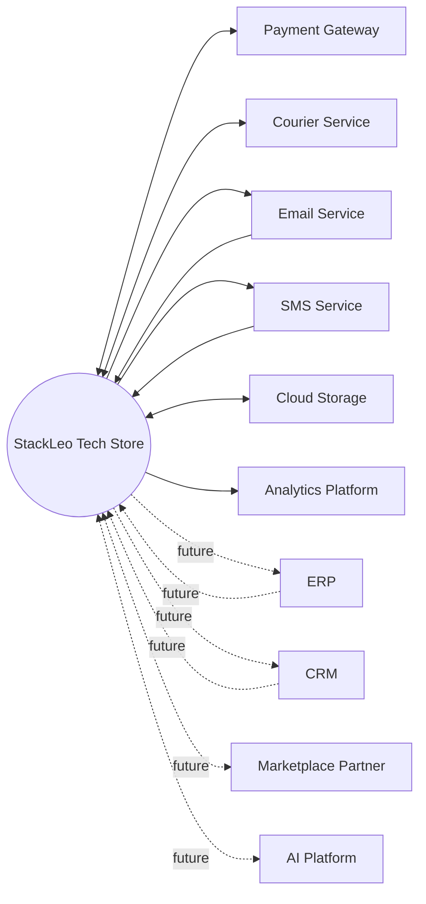
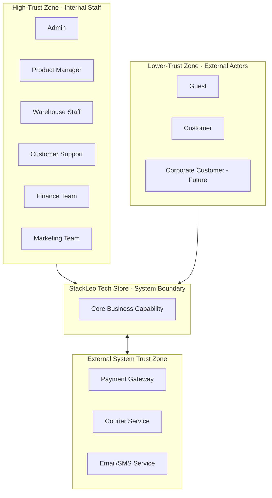
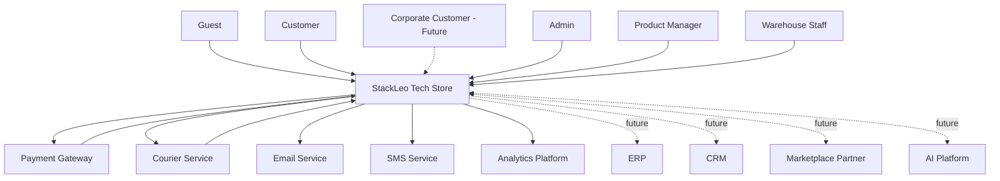

# System Context

## 1. Document Purpose

This document is the official System Context documentation for **StackLeo Tech Store**, describing the platform as a single system within its surrounding ecosystem, following C4 Model Level 1 (System Context) philosophy.

This document focuses exclusively on who uses the system, what external systems it depends on, the high-level nature of those interactions, and where the system's boundary lies. It does not describe the system's internal structure, which is addressed in `component-architecture.md` (C4 Level 2) and beyond.

This document is implementation-independent. It describes the system's external relationships and boundary, not technology choices, API design, or internal component structure.

## 2. What is a System Context Diagram?

A System Context Diagram is the highest, most abstract level of the C4 Model. It shows a system as a single box, surrounded by the people and other systems it interacts with, without revealing any internal structure.

- **Purpose** — to give any reader, technical or non-technical, an immediate, accurate understanding of what the system is, who uses it, and what it depends on.
- **Audience** — Architects, Product Managers, Business Analysts, Developers, QA Engineers, DevOps Engineers, and Stakeholders, per `03_System_Design/README.md` (Section 6).
- **Scope** — the system's external boundary and relationships only; internal components, services, and data structures are explicitly out of scope.
- **Why It Exists** — it establishes the shared mental model every subsequent, more detailed architecture document builds upon, per the reading order defined in `03_System_Design/README.md` (Section 7).

## 3. System Overview

StackLeo Tech Store is a single logical system — the digital and physical commerce platform of StackLeo — that enables customers in Bangladesh to discover, purchase, and receive support for genuine technology and electronics products. From a system context perspective, it is a single, coherent system boundary that serves multiple actor types (customers, corporate buyers, internal staff) and depends on multiple external systems (payment, courier, communication providers) to fulfill its business capability.

This system currently operates across the Web and Physical Store channels, with a future Mobile App and POS channel planned as additional access points into the same underlying system, not as separate systems.

## 4. System Boundary

| Boundary Category | Included |
|---|---|
| Inside the System | Customer-facing commerce capability (catalog, cart, checkout, orders); internal administrative capability (catalog management, inventory, order fulfillment oversight, customer support tooling, reporting); the business logic and rules governing all of the above, per `01_Business/business-rules.md`. |
| Outside the System | Payment processing infrastructure (owned by the Payment Gateway); physical transportation infrastructure (owned by Courier Services); email/SMS delivery infrastructure (owned by respective providers); any future ERP, CRM, or marketplace partner systems. |
| Future Expansion Boundary | Marketplace seller-owned systems (Future); AI Platform capability (Future); ERP and CRM systems (Future); these are treated as external to the system boundary even once integrated, consistent with the integration principles in `architecture-principles.md` (Section 6). |

## 5. Primary Actors

| Actor | Responsibilities | Goals | Interactions |
|---|---|---|---|
| Guest | Browses the platform without an account. | Evaluate products and the platform before committing. | Views catalog, search, and public content. |
| Customer | Maintains an account; purchases and manages orders. | Discover, purchase, and receive support for genuine products. | Full customer journey: browse, cart, checkout, order, return, warranty, review. |
| Corporate Customer (Future) | Manages bulk, organizationally negotiated purchasing. | Efficiently procure technology at scale under agreed terms. | Bulk ordering, corporate account management. |
| Admin | Administers platform-wide operations and governance. | Ensure the platform operates correctly, securely, and profitably. | Catalog, order, customer, and promotion administration; approvals. |
| Product Manager | Owns catalog strategy and product data quality. | Maintain an accurate, competitive, well-organized catalog. | Product, category, and brand management. |
| Warehouse Staff | Executes physical picking, packing, and stock handling. | Fulfill orders accurately and on time. | Order fulfillment tasks, inventory updates. |
| Customer Support | Resolves customer inquiries, returns, and warranty cases. | Preserve customer trust through timely, fair resolution. | Return, refund, and warranty case handling; customer communication. |
| Finance Team | Oversees payment reconciliation and financial reporting. | Ensure financial accuracy and compliance. | Refund approval, reconciliation, reporting. |
| Marketing Team | Plans and executes promotions and campaigns. | Drive customer acquisition and engagement within margin constraints. | Coupon and promotion management, campaign execution. |

*Diagram: Actor Relationship Diagram.*

## 6. External Systems

| External System | Purpose | Relationship | Data Exchanged | Direction |
|---|---|---|---|---|
| Payment Gateway | Processes and verifies digital customer payments. | Trusted processing partner | Payment authorization requests, transaction confirmations | Bidirectional |
| Courier Service | Executes physical delivery of customer orders. | Trusted fulfillment partner | Delivery address, order details, tracking status updates | Bidirectional |
| Email Service | Delivers transactional and marketing email. | Trusted communication partner | Notification content, delivery status | Outbound (with delivery status returned) |
| SMS Service | Delivers time-sensitive SMS notifications. | Trusted communication partner | Notification content, delivery status | Outbound (with delivery status returned) |
| Cloud Storage | Stores product media and business documents. | Infrastructure dependency | Product images, documents, backups | Bidirectional |
| Analytics Platform | Supports behavioral and performance analysis. | Reporting dependency | Aggregated behavioral and transactional data | Outbound |
| ERP (Future) | Future enterprise resource planning integration. | Planned operational dependency | Financial and operational data | Bidirectional (Future) |
| CRM (Future) | Future customer relationship management integration. | Planned engagement dependency | Customer relationship and engagement data | Bidirectional (Future) |
| Marketplace Partner (Future) | Future third-party seller systems. | Planned ecosystem dependency | Listings, orders, settlement data | Bidirectional (Future) |
| AI Platform (Future) | Future AI-assisted search, recommendation, and support capability. | Planned intelligence dependency | Behavioral data, catalog data, model-driven outputs | Bidirectional (Future) |

*Diagram: External Integration Map.*

## 7. High-Level Interactions

| Interaction | Description |
|---|---|
| Customer → StackLeo | Browses, purchases, tracks orders, and requests post-purchase support. |
| Admin → StackLeo | Administers catalog, orders, customers, promotions, and platform configuration. |
| StackLeo → Payment Gateway | Submits payment requests and receives confirmation or failure responses. |
| StackLeo → Courier | Submits delivery requests and receives tracking and delivery status updates. |
| StackLeo → Email Service | Sends transactional and marketing email notifications. |
| StackLeo → SMS Service | Sends time-sensitive delivery and account notifications. |
| StackLeo → Analytics Platform | Sends behavioral and transactional data for aggregated analysis. |
| StackLeo ↔ ERP (Future) | Exchanges financial and operational data for enterprise-scale reporting. |
| StackLeo ↔ CRM (Future) | Exchanges customer engagement data for deeper relationship management. |
| StackLeo ↔ Marketplace Partner (Future) | Exchanges listing, order, and settlement data with third-party sellers. |
| StackLeo ↔ AI Platform (Future) | Exchanges behavioral and catalog data for intelligent search, recommendations, and support automation. |

## 8. Business Capabilities

| Capability | Description |
|---|---|
| Authentication | Verifies the identity of customers and internal users. |
| Catalog | Maintains and presents the product, category, and brand record. |
| Orders | Manages the transactional record of customer purchases. |
| Payments | Processes and verifies customer payment. |
| Shipping | Coordinates courier delivery and tracking. |
| Inventory | Maintains accurate, real-time stock levels. |
| Returns | Manages structured return and exchange requests. |
| Warranty | Manages warranty claim intake and resolution. |
| Reports | Produces standard operational and financial reporting. |
| Corporate Sales (Future) | Manages bulk purchasing under negotiated organizational terms. |
| Marketplace (Future) | Manages third-party seller onboarding, listings, and settlement. |

These capabilities correspond directly to the business domains defined in `system-overview.md` (Section 6) and the modules defined in `02_Product/product-modules.md`.

## 9. Architectural Considerations

- **Security Boundaries** — the system boundary defined in Section 4 is also the primary security boundary; all external interactions cross this boundary through controlled, authenticated integration points, consistent with `architecture-principles.md` (Section 7).
- **Trust Boundaries** — internal actors (Admin, Product Manager, Warehouse Staff, Customer Support, Finance Team, Marketing Team) operate within a higher-trust zone governed by the role and permission model in `02_Product/user-roles.md`; external actors (Guest, Customer, Corporate Customer) and external systems operate within lower-trust zones subject to stricter verification.
- **Integration Boundaries** — every external system interaction is isolated behind a dedicated integration boundary (per `integration-architecture.md`), so that a partner-specific change does not ripple into unrelated business capability.
- **Scalability Considerations** — the system context is designed so that external system dependencies (particularly Payment Gateway and Courier Service) do not become a scaling bottleneck for capability that does not require them (e.g., catalog browsing).
- **Future Growth** — the system boundary is deliberately drawn to accommodate ERP, CRM, Marketplace Partner, and AI Platform integration as additive external relationships, without requiring the core system boundary itself to be redrawn.

*Diagram: Trust Boundary Diagram.*

### Trust Boundaries Summary

| Zone | Members | Trust Level | Verification Approach |
|---|---|---|---|
| High-Trust Zone | Admin, Product Manager, Warehouse Staff, Customer Support, Finance Team, Marketing Team | High, role-scoped | Authenticated identity plus RBAC per `02_Product/user-roles.md` |
| Lower-Trust Zone | Guest, Customer, Corporate Customer (Future) | Variable, account-scoped | Authentication for account-scoped actions; public access for browsing |
| System Boundary | StackLeo Tech Store core capability | Internally trusted | Enforced via internal authorization at each domain boundary |
| External System Trust Zone | Payment Gateway, Courier, Email/SMS, future ERP/CRM/Marketplace/AI | Controlled, contractual trust | Isolated integration boundaries; no direct internal access granted |

## 10. Assumptions

- External systems (Payment Gateway, Courier Service, Email/SMS providers) remain available and contractually reliable, per `01_Business/assumptions.md`.
- Future external systems (ERP, CRM, Marketplace Partner, AI Platform) will integrate through the same controlled integration boundary model already established for current external systems.
- Internal actor roles will evolve (e.g., Regional Manager, Franchise Manager) without requiring a redefinition of the system's overall context boundary, per `02_Product/user-roles.md` (Section 13).

## 11. Constraints

- The system's current context boundary reflects a single-market (Bangladesh), single-seller B2C operation; Corporate Customer and Marketplace Partner actors are recognized in this document as future context but are not yet active, per `00_Project_Overview/project-scope.md`.
- External system relationships are limited to those with an active or planned business justification; speculative integrations are excluded from this document's scope.
- This document does not describe internal structure; any question about how the system fulfills these external relationships internally is addressed in `component-architecture.md` and `service-architecture.md`.

## 12. Governance

- **Ownership** — the Solution Architect owns this document and is accountable for keeping the system context accurate as actors and external relationships evolve.
- **Review Process** — this document is reviewed at the conclusion of each phase defined in `02_Product/product-roadmap.md`, and whenever a new actor type or external system integration is introduced or planned.
- **Versioning** — this document follows the Semantic Versioning approach defined in `00_Project_Overview/changelog.md`; material changes are recorded there and, where they stem from a specific architectural decision, cross-referenced in `architecture-decisions.md`.

*Diagram: C4 Level 1 System Context Diagram.*

## 13. Document Information

| Property | Value |
|----------|-------|
| Document | context-diagram.md |
| Version | 1.0.0 |
| Status | Active |
| Maintained By | StackLeo |
| Last Updated | 2026-07-17 |

---

© StackLeo. All Rights Reserved.
