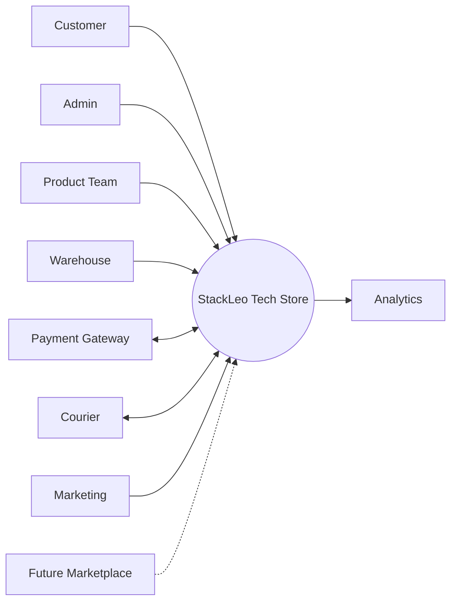
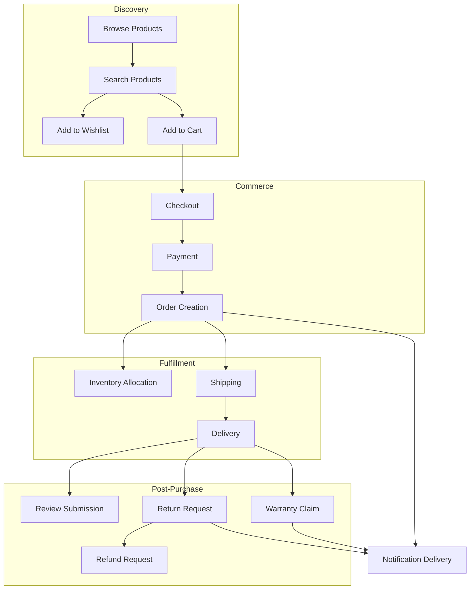
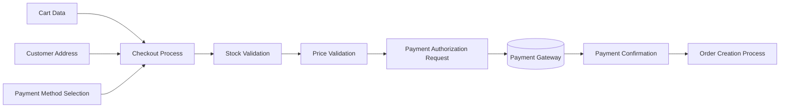
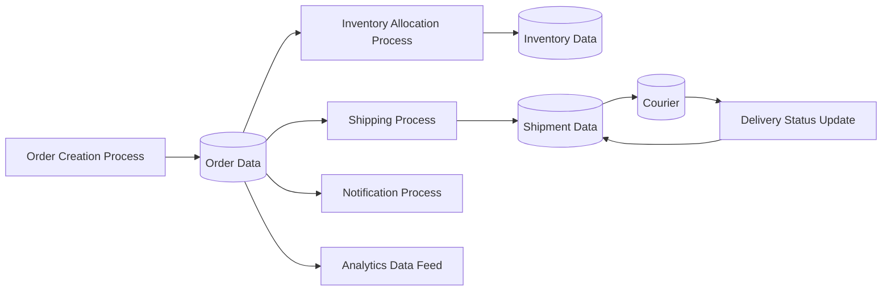
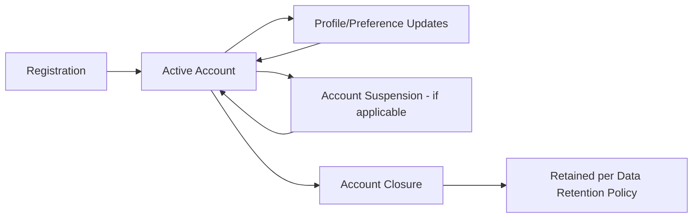
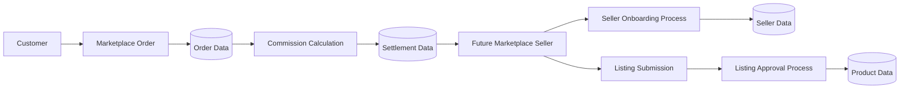

# Data Flow Architecture

## 1. Document Purpose

This document is the official Data Flow Architecture for **StackLeo Tech Store**. It explains how business information conceptually moves across the platform — from its origin, through processing, to its consumers — without describing how that information is technically persisted or exposed.

- **What Is Data Flow** — the conceptual movement of business information between actors, processes, and stores, independent of any specific storage or transport technology.
- **Why Data Flow Matters** — understanding how information moves reveals where accuracy, timeliness, and security genuinely matter, and exposes hidden dependencies that a purely structural (component/service) view can miss.
- **Relationship with the Domain Model** — the data described here corresponds directly to the entities, aggregates, and domain events defined in `domain-model.md`; this document describes their *movement*, not their structure.
- **Relationship with Components** — data flows between the components defined in `component-architecture.md`, respecting the same boundaries and dependency directions.
- **Relationship with Services** — data flows are realized through the service interactions and events defined in `service-architecture.md` (Sections 4–5); this document provides the information-centric view of those same interactions.

This document is implementation-independent. It does not design databases, APIs, or any specific technical mechanism — those belong to dedicated technical documentation outside `03_System_Design`.

## 2. Data Flow Philosophy

- **Single Source of Truth** — every piece of business data has exactly one authoritative origin (Section 6); all other consumers reference or copy from that source, never establishing a competing authoritative copy.
- **Data Ownership** — each bounded context owns the data corresponding to its domain, consistent with `bounded-contexts.md` and ARCH-002.
- **Information Lifecycle** — data is treated as having a deliberate lifecycle (Section 7) — created, used, and eventually archived or removed — not as permanent by default.
- **Data Consistency** — financially and operationally critical data (orders, payments, inventory) flows with strong consistency guarantees; less critical, read-heavy data (analytics) tolerates eventual consistency, consistent with `architectural-drivers.md` (Section 10).
- **Event-Driven Readiness** — significant data changes are expressed as domain events (per `domain-model.md`, Section 8) that other parts of the system can react to, rather than requiring direct, tightly coupled data access.
- **Security** — data flows are protected in transit and scoped to only their legitimate consumers, consistent with `integration-architecture.md` (Section 8).
- **Privacy** — customer data flows are minimized to what is genuinely necessary for the receiving process, consistent with ARCH-015 and `01_Business/business-rules.md` (BR-128).

## 3. Primary Data Sources

| Data Source | Description | Representative Data Produced |
|---|---|---|
| Customer | Individuals interacting with the platform to browse and purchase. | Profile data, cart activity, orders, reviews, support requests |
| Admin | Internal staff administering platform operations. | Catalog changes, order exceptions, configuration changes |
| Product Team | Internal staff maintaining catalog strategy and content. | Product, category, and brand data |
| Warehouse | Internal staff executing physical fulfillment. | Stock movements, picking/packing confirmations |
| Payment Gateway | External payment processing partner. | Payment authorization and confirmation data |
| Courier | External delivery partners. | Shipment status and delivery confirmation data |
| Marketing | Internal staff planning promotions and campaigns. | Coupon, campaign, and promotional configuration |
| Analytics | Internal and platform-generated behavioral analysis. | Aggregated behavioral and performance insight |
| Future Marketplace | Future third-party sellers. | Listing, order, and settlement data |

*Diagram: Level 0 Data Flow Diagram — the system as a single process with its primary external data sources and sinks.*

## 4. Major Business Data

| Data Type | Description | Primary Source | Consumers |
|---|---|---|---|
| User Data | Identity, credentials, and session information. | Customer (registration), Admin (internal accounts) | Identity, Customer, all account-scoped processes |
| Product Data | Catalog listings, variants, pricing, and content. | Product Team | Catalog, Search, Cart, Order, Analytics |
| Inventory Data | Real-time stock levels by SKU and location. | Warehouse, Order processing | Cart, Checkout, Order, Shipping, POS (Future) |
| Cart Data | In-progress purchase intent. | Customer | Checkout, Analytics |
| Order Data | Confirmed transactional records. | Checkout process | Payment, Shipping, Notifications, Analytics, Support |
| Payment Data | Transaction authorization and confirmation records. | Payment Gateway, Checkout process | Order, Refunds, Finance Reporting |
| Shipment Data | Delivery assignment and tracking status. | Shipping process, Courier | Order, Notifications, Customer Dashboard |
| Review Data | Verified-purchase product feedback. | Customer | Catalog (product pages), Analytics |
| Notification Data | Record of customer communications and delivery status. | Order, Return, Warranty, Marketing processes | Customer, Support, Analytics |
| Corporate Sales Data (Future) | Corporate account terms and bulk order records. | Corporate Buyer, Finance | Order, Finance Reporting |
| Marketplace Data (Future) | Seller, listing, and settlement records. | Future Marketplace Sellers | Catalog, Order, Finance Reporting |

### Data Classification

| Data Type | Classification | Sensitivity Rationale |
|---|---|---|
| User Data | Confidential / Personal | Contains personally identifiable information requiring privacy protection. |
| Product Data | Public / Internal | Catalog content is largely public; pricing strategy and cost data are internal. |
| Inventory Data | Internal | Operationally sensitive; not directly exposed beyond derived availability status. |
| Cart Data | Confidential / Personal | Tied to an individual customer's in-progress intent. |
| Order Data | Confidential / Personal | Contains customer and transaction detail. |
| Payment Data | Highly Confidential | Directly tied to financial transactions; highest sensitivity classification. |
| Shipment Data | Confidential / Personal | Contains delivery address and customer contact detail. |
| Review Data | Public (post-moderation) | Intended for public display once approved. |
| Notification Data | Confidential / Personal | Contains customer contact and communication history. |
| Corporate Sales Data (Future) | Highly Confidential | Contains negotiated commercial terms. |
| Marketplace Data (Future) | Confidential / Business | Contains third-party business and settlement information. |

## 5. Core Business Flows

| Flow | Data Source | Data Movement | Data Destination |
|---|---|---|---|
| Guest → Browse Products | Product Data (Catalog) | Catalog data retrieved and presented | Guest's browsing session |
| Customer Registration | Customer-submitted registration data | Validated, verified, and persisted as User Data | Identity/Customer data store |
| Customer Login | Customer-submitted credentials | Verified against User Data; session established | Authenticated session context |
| Search Products | Customer query, indexed Product Data | Query resolved against search index | Ranked results to Customer |
| Add to Wishlist | Customer selection, Product Data reference | Wishlist entry created | Customer's Wishlist data |
| Add to Cart | Customer selection, Product/Inventory Data | Stock validated; Cart Data updated | Customer's Cart |
| Checkout | Cart Data, Address, Payment selection | Validated and assembled into a checkout request | Order creation process |
| Payment | Checkout request, Payment method | Routed to Payment Gateway; confirmation returned | Payment Data, Order process |
| Order Creation | Confirmed Checkout and Payment Data | Order record assembled and persisted | Order Data store; downstream processes notified |
| Inventory Allocation | Order Data | Stock deducted/reserved against Inventory Data | Inventory Data store |
| Shipping | Order Data, Address | Courier assignment request generated | Shipment Data; Courier |
| Delivery | Courier status updates | Delivery status data received and applied | Shipment Data; Customer notification |
| Review Submission | Customer feedback, Order Data (verification) | Verified, moderated, and persisted | Review Data store; Product pages |
| Return Request | Customer request, Order Data reference | Validated and routed to inspection | Return case data |
| Refund Request | Approved Return/Cancellation | Refund calculated and routed to Payment Gateway | Payment Data (refund record) |
| Warranty Claim | Customer request, Order Data reference | Validated and routed to inspection | Warranty case data |
| Notification Delivery | Business event (Order, Return, Warranty, Marketing) | Notification content generated and dispatched | Email/SMS Provider; Notification Data |
| Corporate Sales (Future) | Corporate Buyer bulk order request, Account terms | Validated against terms; order and invoice generated | Corporate Sales Data; Order Data |
| Marketplace (Future) | Seller listing/order data | Validated, approved, and routed for fulfillment/settlement | Marketplace Data; Catalog; Order Data |

*Diagram: Level 1 Data Flow Diagram — major internal data flow processes and their sequencing.*

*Diagram: Checkout Data Flow.*

*Diagram: Order Data Flow.*

## 6. Data Ownership

| Business Entity | Owning Domain (per `domain-model.md`) | Owning Service (per `service-architecture.md`) |
|---|---|---|
| Customer, User | Identity, Customer | Authentication Service, User Profile Service |
| Product, Category, Brand, Product Variant | Catalog, Product | Product Service, Category Service, Brand Service |
| Inventory Item | Inventory | Inventory Service |
| Cart, Cart Item | Cart | Cart Service |
| Order, Order Item | Order | Order Service |
| Payment | Payment | Payment Service |
| Shipment, Address | Shipping | Shipping Service, Delivery Tracking Service |
| Coupon | Promotions | Coupon Service |
| Review | Reviews | Review Service |
| Wishlist | Customer | Wishlist Service |
| Notification | Notifications | Notification Service |
| Warranty Claim | Warranty | Customer Support Service |
| Return Request | Returns | Customer Support Service |
| Corporate Account (Future) | Corporate Sales | Corporate Sales Service |
| Seller, Marketplace Store (Future) | Marketplace | Marketplace Service |

Each row reflects the single source of truth principle (Section 2): exactly one service is authoritative for creating and modifying its corresponding data; all other services and components reference or subscribe to it rather than maintaining a competing copy.

## 7. Data Lifecycle

| Entity | Creation | Active Use | Update Triggers | Archival / Retention |
|---|---|---|---|---|
| Customer | Registration (Section 5) | Ongoing account activity | Profile edits, status changes | Retained for the account's lifetime, per `01_Business/business-rules.md` (BR-073); subject to applicable data retention policy on closure. |
| Product | Created by Product Team | Published and browsable | Content, pricing, and stock updates | Discontinued products remain referenced in historical Order data but removed from active catalog browsing (per BR-029). |
| Cart | Created on first item addition | Active while customer is shopping | Item additions, removals, quantity changes | Expires after a defined inactivity period (BR-046); not retained long-term. |
| Order | Created at checkout completion | Progresses through fulfillment status | Status changes (Processing, Shipped, Delivered, Cancelled) | Retained permanently as the authoritative transactional and compliance record. |
| Payment | Created at checkout/payment attempt | Active until finalized | Status changes (Confirmed, Failed, Refunded) | Retained permanently, tied to its Order, for financial and audit purposes. |
| Shipment | Created at order packing/dispatch | Active until delivery | Status changes through delivery lifecycle | Retained as part of the Order's permanent fulfillment record. |
| Review | Created on customer submission | Active once published | Edits by the customer; moderation actions | Retained indefinitely as part of the product's public trust record, subject to removal for policy violations. |

*Diagram: Customer Lifecycle Data Flow.*

## 8. Data Security

- **Confidentiality** — data flows are scoped so that only legitimate, authorized consumers receive a given piece of information, consistent with least privilege (ARCH-033) and the data classification defined in Section 4.
- **Integrity** — data is validated at each point it enters or changes within the system (e.g., stock and price revalidation at checkout, per `functional-requirements.md` FR-016), preventing corrupted or manipulated data from propagating downstream.
- **Availability** — critical data flows (Order, Payment, Inventory) are designed for high availability, consistent with `quality-attributes.md` (Section 5).
- **Privacy** — personal data flows are minimized to what each receiving process genuinely requires, consistent with ARCH-015; for example, Courier receives delivery address and contact detail only, not full order or payment detail (per `02_Product/user-roles.md`, UR-044).
- **Auditability** — flows affecting governed data domains (pricing, inventory, orders, customer accounts, roles) are logged immutably at their point of change, consistent with ARCH-037 and `service-architecture.md` (Section 9).

## 9. Data Quality

Data quality is treated as a first-class architectural concern, since flawed data undermines trust regardless of how well the surrounding system is structured.

- **Accuracy** — data must correctly represent the real-world business fact it describes (e.g., Inventory Data must reflect true physical stock).
- **Consistency** — the same business fact must not be represented differently across the services that reference it; each service defers to the data's single owning source (Section 6).
- **Completeness** — data required for a process to execute correctly (e.g., mandatory Product fields before publishing, per BR-013) must be present before that process proceeds.
- **Freshness** — data that changes frequently (e.g., Inventory, Order status) must propagate to dependent processes with minimal delay, consistent with `non-functional-requirements.md` (NFR-006, near-real-time stock updates).
- **Reliability** — data flows must behave predictably and consistently under both normal and failure conditions, consistent with `integration-architecture.md` (Section 7).

### Data Quality Matrix

| Data Type | Accuracy Priority | Consistency Priority | Freshness Requirement |
|---|---|---|---|
| Inventory Data | Critical | Critical | Near real-time |
| Order Data | Critical | Critical | Real-time at creation; stable thereafter |
| Payment Data | Critical | Critical | Real-time |
| Product Data | High | High | Timely (publish-cycle driven) |
| Cart Data | High | Medium | Real-time within session |
| Shipment Data | High | High | Near real-time (courier-dependent) |
| Review Data | Medium | Medium | Moderation-cycle driven |
| Analytics Data | Medium | Low (eventual consistency acceptable) | Periodic |

## 10. Future Evolution

| Future Capability | Data Flow Impact |
|---|---|
| AI | Introduces new consumers (AI Recommendation Service) of existing Product, Order, and behavioral data flows, without altering their ownership, per `service-architecture.md` (Section 10). |
| Marketplace | Introduces new data sources (Sellers) feeding into the existing Product and Order data flows under governed approval, per `domain-model.md` (Section 11). |
| Analytics | Data flows increasingly feed a dedicated analytics consumption layer, separated from transactional flows to protect their consistency and performance. |
| Multi-Region | Data flows extend across regional deployments (per `deployment-architecture.md`, Section 8), requiring explicit handling of cross-region data residency and latency. |
| Data Warehouse | A future dedicated data warehouse may consume from all major business data flows (Section 4) as a read-only aggregation point, without becoming an alternate source of truth. |
| Business Intelligence | Builds on the Data Warehouse and Analytics flows to support deeper, cross-domain business insight beyond current Reporting and Dashboard capability. |

*Diagram: Future Marketplace Data Flow.*

## 11. Governance

- **Ownership** — the Solution Architect, in partnership with the Data Steward function (Business Analyst), owns this document's accuracy against actual data flow behavior.
- **Stewardship** — each data domain's owning service (Section 6) is responsible for the quality, accuracy, and appropriate access control of the data it originates.
- **Versioning** — this document follows the Semantic Versioning approach defined in `00_Project_Overview/changelog.md`.
- **Change Management** — material changes to data ownership, flow direction, or classification must be recorded in `changelog.md` and evaluated for downstream impact against Section 6 (Data Ownership) and `integration-architecture.md` (Internal Integration Matrix).

## 12. Document Information

| Property | Value |
|----------|-------|
| Document | data-flow.md |
| Version | 1.0.0 |
| Status | Active |
| Maintained By | StackLeo |
| Last Updated | 2026-07-17 |

---

© StackLeo. All Rights Reserved.
