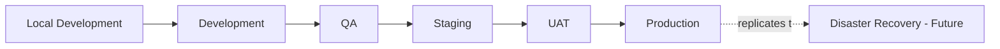
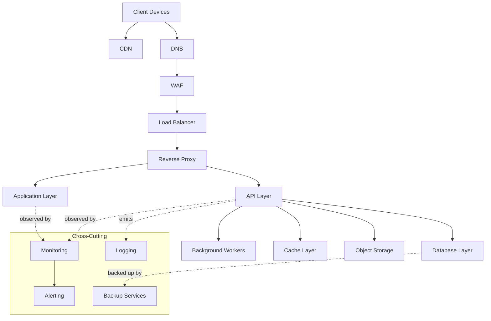
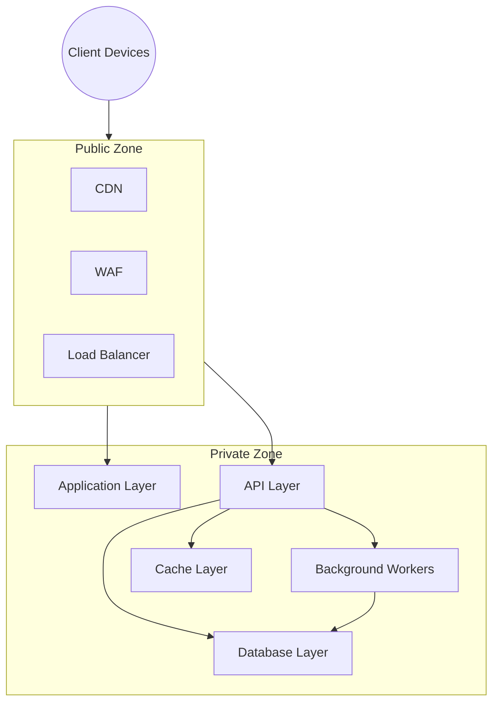
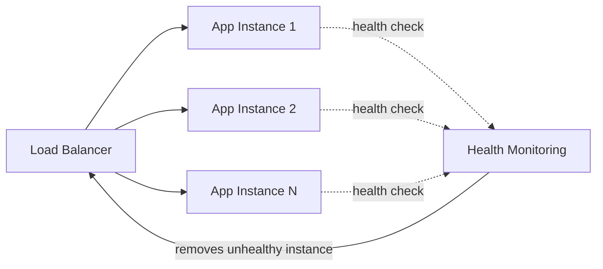
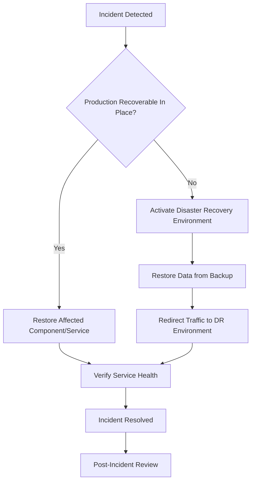
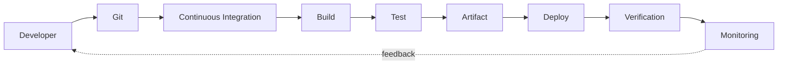

# Deployment Architecture

## 1. Document Purpose

This document is the official Deployment Architecture for **StackLeo Tech Store**. It describes the logical deployment topology of the platform — the layers, environments, and infrastructure responsibilities through which the architecture defined in `component-architecture.md` and `service-architecture.md` is operated.

- **Deployment Architecture** — the structural view of how software runs, scales, and is operated, as distinct from the logical component and service views that describe what the software does.
- **Deployment Topology** — the arrangement of logical infrastructure layers (Section 4) that requests pass through and applications run within, from client to data.
- **Environment Strategy** — the set of distinct, purpose-built environments (Section 3) that support safe, staged progression from development through production.

This document remains cloud-provider neutral throughout — it does not assume AWS, Azure, GCP, or any specific provider, and describes logical infrastructure roles rather than named products. It is implementation-independent: no Kubernetes manifests, Terraform, Docker Compose, or code are included, consistent with the technology-agnostic posture of `03_System_Design` as a whole.

## 2. Deployment Philosophy

- **Cloud-Native Readiness** — the deployment model assumes elastic, on-demand infrastructure rather than fixed, manually provisioned capacity, consistent with `architecture-principles.md` (cloud-native architecture).
- **High Availability** — customer-facing capability is deployed redundantly by default, not as an exceptional configuration.
- **Scalability** — deployment topology supports adding capacity horizontally in response to demand, consistent with ARCH-038.
- **Reliability** — deployment layers are structured so that failure in one layer does not necessarily compromise others, consistent with ARCH-042.
- **Fault Isolation** — environments and infrastructure layers are deployed with clear boundaries, limiting the blast radius of any single failure.
- **Security** — deployment topology enforces network segmentation and least-privilege access between layers by default (Section 9).
- **Automation** — deployment processes are automated (Section 12) rather than manually repeated, consistent with ARCH-022.
- **Disaster Recovery** — the deployment model is designed with an explicit, testable recovery approach (Section 10), not an assumed one.

## 3. Environment Strategy

| Environment | Purpose | Users | Data Policy | Deployment Frequency | Access Level |
|---|---|---|---|---|---|
| Local Development | Individual developer iteration and testing. | Developers | Synthetic or anonymized sample data only | Continuous, developer-controlled | Full access, developer's own machine |
| Development | Shared integration point for in-progress work. | Developers, QA | Synthetic data only | Frequent (multiple times daily) | Broad engineering access |
| QA | Structured functional and regression testing. | QA Engineers, Developers | Synthetic, test-scenario data | Per test cycle | QA and Engineering access |
| Staging | Production-like validation prior to release. | QA, Product Owner, Engineering Leads | Anonymized production-like data | Per release candidate | Restricted to release-validation roles |
| UAT | Business stakeholder validation against acceptance criteria. | Product Owner, Business Stakeholders, QA | Anonymized production-like data | Per release candidate, aligned to UAT cycles (per `acceptance-criteria.md`, Section 7) | Restricted to UAT participants |
| Production | Live environment serving real customers and business operations. | Customers, internal staff (role-scoped) | Real customer and business data, fully governed | Controlled, per release management (Section 14) | Strictly role-scoped, per `02_Product/user-roles.md` |
| Disaster Recovery (Future) | Standby environment for business continuity in the event of a significant Production incident. | Operations, Engineering (during incident) | Synchronized, governed copy of Production data | Activated only during declared incidents | Highly restricted, incident-scoped access |

*Diagram: Environment Topology.*

## 4. Logical Deployment Topology

| Layer | Role |
|---|---|
| Client Devices | Customer and staff devices (desktop, mobile browser, future native app) initiating requests. |
| CDN | Distributes static and cacheable content closer to customers, reducing latency. |
| DNS | Resolves the platform's domain to the appropriate entry point. |
| WAF | Filters malicious traffic before it reaches the application layer. |
| Load Balancer | Distributes incoming traffic evenly across available application instances. |
| Reverse Proxy | Routes requests to the appropriate internal service and terminates secure connections. |
| Application Layer | Hosts the Presentation-layer components (Storefront Web, Admin Portal), per `component-architecture.md`. |
| API Layer | Hosts the service contracts (per `service-architecture.md`) consumed by Presentation components and future channels. |
| Background Workers | Execute asynchronous, event-driven processing (e.g., notification dispatch, report generation). |
| Cache Layer | Holds frequently accessed, non-critical data to reduce load on the Database Layer. |
| Database Layer | Persists the authoritative state of each bounded context. |
| Object Storage | Stores product media and business documents. |
| Monitoring | Observes infrastructure and application health across all layers. |
| Logging | Aggregates business and operational events across all layers. |
| Alerting | Notifies responsible teams when monitored conditions breach defined thresholds. |
| Backup Services | Performs and verifies regular backups of business-critical data. |

*Diagram: Logical Deployment Architecture.*

## 5. Infrastructure Components

| Component | Responsibility |
|---|---|
| Web Application | Serves the Storefront Web presentation layer to customers. |
| Admin Application | Serves the Admin Portal presentation layer to internal staff. |
| Backend API | Hosts the logical services defined in `service-architecture.md`, exposed to Presentation components and future channels. |
| Database | Persists authoritative business state per bounded context, with appropriate isolation between contexts. |
| Cache | Reduces latency and database load for frequently accessed, non-critical data (e.g., catalog browsing). |
| Queue | Enables asynchronous, event-driven communication between services, consistent with `service-architecture.md` (Section 5). |
| Object Storage | Stores product images, documents, and other unstructured business assets. |
| Monitoring | Continuously observes system health, performance, and business metrics. |
| Logging | Aggregates structured logs from all infrastructure and application layers. |
| Secrets Management | Securely stores and controls access to sensitive configuration (credentials, keys), never embedded in code, consistent with ARCH-030. |

## 6. Network Architecture

- **Public Zone** — the outermost layer (CDN, DNS, WAF, Load Balancer) exposed to the public internet; no business logic or data resides here.
- **Private Zone** — the Application Layer, API Layer, Background Workers, Cache Layer, and Database Layer, accessible only through the controlled entry points in the Public Zone.
- **Trust Boundaries** — the boundary between Public and Private Zones is the platform's primary network trust boundary, complementing the identity-based trust boundaries defined in `context-diagram.md` (Section 9).
- **Secure Communication** — all communication crossing a network boundary (Public to Private, or between Private Zone layers) is encrypted in transit by default, consistent with ARCH-036.
- **Internal Services** — services within the Private Zone communicate directly with one another and are never directly reachable from the Public Zone; all external access is mediated through the Reverse Proxy and API Layer.

*Diagram: High Availability Architecture context — trust boundary view (see Section 7 for redundancy detail).*

### Network Zones

| Zone | Contents | Exposure |
|---|---|---|
| Public Zone | CDN, DNS, WAF, Load Balancer | Internet-facing |
| Private Zone | Application Layer, API Layer, Background Workers, Cache, Database, Object Storage | Not directly internet-facing; reachable only via Public Zone entry points |
| Management Zone | Monitoring, Logging, Alerting, Secrets Management | Restricted to authorized operational and engineering roles |

## 7. High Availability Strategy

- **Redundancy** — customer-facing Application and API layers run multiple instances by default, so no single instance failure causes an outage.
- **Load Balancing** — the Load Balancer distributes traffic across healthy instances, consistent with load distribution principles (ARCH-039).
- **Failover** — traffic is automatically redirected away from unhealthy instances or, where applicable, an unhealthy region, toward healthy capacity.
- **Health Checks** — each service exposes a health check (per `service-architecture.md`, Section 9 observability alignment), allowing the deployment layer to detect and route around degraded instances.
- **Rolling Updates** — new versions are deployed incrementally across instances, maintaining availability throughout the deployment.
- **Zero-Downtime Deployment** — deployments are designed so that customers experience no service interruption during a release, consistent with the availability expectations in `quality-attributes.md` (Section 5).

*Diagram: High Availability Architecture.*

## 8. Scalability Strategy

- **Horizontal Scaling** — the primary scaling strategy: additional instances of the Application, API, and Worker layers are added as demand grows, consistent with ARCH-038.
- **Vertical Scaling** — used selectively for components not yet horizontally scalable (e.g., certain Database Layer configurations), as a near-term lever.
- **Auto Scaling Readiness** — the deployment topology is designed so that instance count can be adjusted automatically in response to observed load, without manual intervention, once such automation is adopted.
- **Stateless Services** — Application and API layer instances hold no client-specific state locally (ARCH-012, ARCH-039), making them safely interchangeable for scaling purposes.
- **Future Multi-Region Deployment** — the topology defined in this document is structured so that the same logical layers (Section 4) could be replicated in an additional geographic region to serve future South Asia and global expansion, without redesigning the topology itself.

## 9. Security Architecture

| Security Control | Description |
|---|---|
| TLS Everywhere | All communication, external and internal, is encrypted in transit by default. |
| WAF | Filters known malicious traffic patterns before reaching the Application or API layers. |
| Firewall | Restricts network traffic between zones to only explicitly permitted paths. |
| IAM Concepts | Access to infrastructure and deployment tooling is governed by role-based, least-privilege identity and access management, consistent with `02_Product/user-roles.md`. |
| Secrets Management | Credentials, keys, and other sensitive configuration are stored securely and never embedded in code or configuration files. |
| Encryption | Sensitive data is encrypted both in transit and at rest, consistent with `non-functional-requirements.md` (NFR-027). |
| Network Segmentation | Public, Private, and Management Zones (Section 6) are segmented so that compromise of one zone does not automatically expose the others. |

## 10. Disaster Recovery

- **Backup Strategy** — business-critical data (orders, payments, inventory, customer accounts) is backed up regularly and verified, per `non-functional-requirements.md` (NFR-058).
- **Recovery Objectives** — Recovery Point Objective (RPO) and Recovery Time Objective (RTO) targets are defined and periodically validated through disaster recovery testing, per NFR-059.
- **Data Restoration** — restoration procedures are tested periodically to confirm backups are genuinely usable in a real recovery scenario, per NFR-060.
- **Service Recovery** — critical services are prioritized for recovery based on their role in the core purchase flow (browse, cart, checkout, payment, order), consistent with `quality-attributes.md` (Section 5).
- **Business Continuity** — the Disaster Recovery environment (Section 3) provides a standby capability for continuing critical business operations during a significant Production incident.

*Diagram: Disaster Recovery Flow.*

### Recovery Objectives

| Data/Service Category | Recovery Priority | Target Approach |
|---|---|---|
| Orders, Payments | Critical | Lowest RPO/RTO targets; prioritized first in recovery |
| Inventory | Critical | Restored alongside Orders to prevent overselling on recovery |
| Customer Accounts | High | Restored early to enable customer-facing recovery |
| Catalog | High | Restored to enable browsing and purchasing resumption |
| Returns, Warranty | Medium | Restored after core purchase capability is confirmed healthy |
| Analytics, Reporting | Low | Restored last; not required for core purchase capability |

Specific numeric RPO/RTO figures are defined and maintained through dedicated operational planning, consistent with `non-functional-requirements.md` (NFR-059).

## 11. Observability

- **Metrics** — technical (latency, error rate, availability) and business (conversion, order success) metrics are collected across all deployment layers, consistent with `non-functional-requirements.md` (NFR-054).
- **Logs** — structured logs are aggregated centrally from every layer, supporting diagnosis and audit, per NFR-052.
- **Traces** — cross-layer and cross-service transactions are traceable end-to-end, per NFR-056.
- **Health Checks** — every service and infrastructure layer exposes a means of confirming operational health, per NFR-057.
- **Alerts** — monitored conditions breaching defined thresholds trigger timely, actionable alerts, per NFR-055.
- **Dashboards** — aggregated technical and business metrics are presented for operational and management visibility, consistent with `02_Product/product-modules.md` (MOD-027, MOD-028).

Detailed observability strategy is addressed further in `observability.md`.

## 12. Deployment Lifecycle

*Diagram: Deployment Pipeline.*

- **Developer** — initiates a change, developed and validated locally.
- **Git** — the change is committed to version control, triggering the pipeline.
- **CI (Continuous Integration)** — the change is automatically integrated and validated against the broader codebase.
- **Build** — a deployable artifact is produced from the validated change.
- **Test** — automated tests validate the build against functional and non-functional expectations, per `functional-requirements.md` and `non-functional-requirements.md`.
- **Artifact** — a versioned, deployable artifact is produced and stored.
- **Deploy** — the artifact is deployed to the appropriate environment (Section 3), following the environment progression.
- **Verification** — post-deployment checks confirm the deployment succeeded and the system is healthy.
- **Monitoring** — the deployed change is continuously observed (Section 11), with findings feeding back into future development.

This lifecycle remains conceptual in this document; specific tooling and technical implementation are addressed in dedicated engineering documentation outside `03_System_Design`.

## 13. Future Evolution

| Future Direction | Deployment Architecture Readiness |
|---|---|
| Kubernetes (or equivalent orchestration) | The logical layer separation (Section 4) and stateless service design (Section 8) are structured to map cleanly onto a container orchestration model, should it be adopted. |
| Multi-Cloud | Cloud-provider neutrality (Section 1) ensures this document's topology does not presuppose a single provider, preserving future multi-cloud optionality. |
| Multi-Region | The topology is designed to be replicable across regions (Section 8) to support future South Asia and global expansion. |
| Edge Computing | The CDN layer (Section 4) already positions cacheable content close to customers; further edge capability could extend this model for latency-sensitive future features. |
| Marketplace | Marketplace Service (per `service-architecture.md`, SVC-029) deploys within the same topology, requiring no new deployment layers. |
| AI Workloads | AI Recommendation Service (SVC-031) may require specialized compute; the topology accommodates this as an additional, isolated capability within the existing Private Zone, without disrupting other layers. |

## 14. Governance

- **Deployment Ownership** — the DevOps Lead owns this document and the deployment topology's accuracy, in partnership with the Solution Architect.
- **Release Management** — releases progress through the environment strategy (Section 3) in order, with promotion to Production gated by the Definition of Done and UAT sign-off defined in `02_Product/acceptance-criteria.md`.
- **Environment Management** — each environment's configuration and access are reviewed periodically to ensure continued alignment with its defined purpose and access level (Section 3).
- **Change Control** — material changes to deployment topology must be recorded as a decision in `architecture-decisions.md` and reflected in this document, following the versioning approach in `00_Project_Overview/changelog.md`.

### Deployment Responsibilities

| Role | Responsibility |
|---|---|
| DevOps Lead | Owns deployment topology, environment strategy, and pipeline health. |
| Solution Architect | Ensures deployment architecture remains consistent with `component-architecture.md` and `service-architecture.md`. |
| Engineering Leads | Ensure their services are deployable, observable, and healthy within this topology. |
| Security Lead | Ensures network segmentation and security controls (Section 9) remain effective. |
| QA Lead | Validates release candidates through the QA, Staging, and UAT environments. |
| Product Owner | Approves promotion of a release candidate to Production, per UAT sign-off. |

## 15. Document Information

| Property | Value |
|----------|-------|
| Document | deployment-architecture.md |
| Version | 1.0.0 |
| Status | Active |
| Maintained By | StackLeo |
| Last Updated | 2026-07-17 |

---

© StackLeo. All Rights Reserved.
