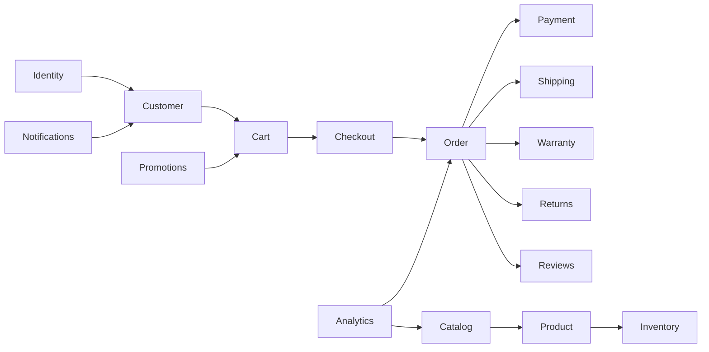
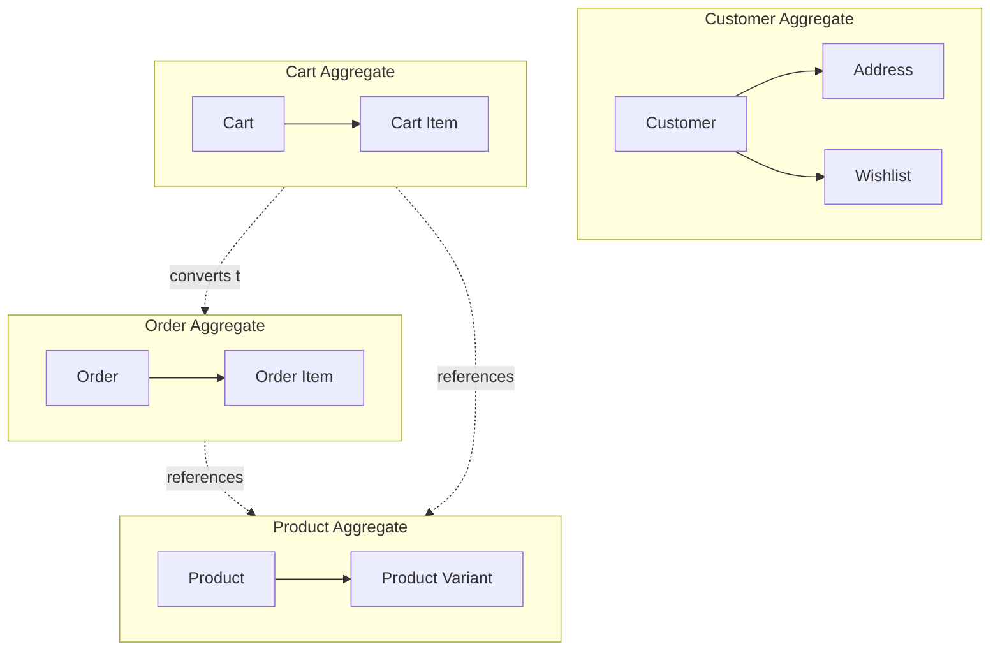
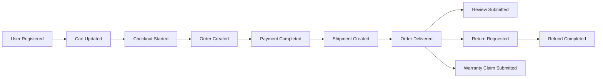
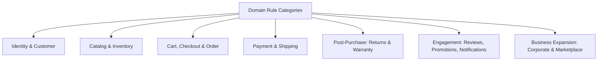

# Business Domain Model

## 1. Document Purpose

This document is the official Business Domain Model for **StackLeo Tech Store**. It models the business concepts, entities, relationships, aggregates, and domain responsibilities that underpin the platform, using Domain-Driven Design (DDD) principles.

This document is not a database design, not an API design, and not an entity-relationship diagram. It describes the business domain as it exists conceptually — the language, concepts, and rules the business itself uses — independent of how that domain is eventually persisted or exposed technically. Technical realization of this model belongs to dedicated technical documentation elsewhere in the repository.

This document builds directly on `01_Business/glossary.md`, `02_Product/product-modules.md`, and `bounded-contexts.md`, ensuring the domain model reflects real, validated business concepts rather than incidental technical structure.

## 2. What is a Domain Model?

| Concept | Definition |
|---|---|
| Domain | A distinct area of business activity and knowledge (e.g., Order, Catalog, Warranty), with its own concepts, rules, and language. |
| Entity | A business concept with a distinct, continuous identity that persists through change (e.g., a specific Order, tracked from placement through completion). |
| Value Object | A business concept defined entirely by its attributes, with no independent identity; two value objects with identical attributes are interchangeable (e.g., an amount of Money). |
| Aggregate | A cluster of related entities and value objects treated as a single consistency unit, changed together through its root. |
| Aggregate Root | The single entity within an aggregate through which all changes to that aggregate must occur, guaranteeing its business rules remain consistently enforced. |
| Domain Service | A business operation that does not naturally belong to a single entity, typically because it coordinates across multiple entities or aggregates (e.g., Pricing, Checkout). |
| Domain Event | A record that something business-significant has happened (e.g., "Order Created"), which other parts of the domain may react to. |
| Repository (Concept Only) | The conceptual notion that an aggregate can be retrieved and persisted as a whole, without exposing how that persistence is technically achieved. |

## 3. Business Domains

| Domain | Responsibilities | Core Concepts | Business Goals |
|---|---|---|---|
| Identity | Establish and verify who a person is, whether customer or internal user. | Customer, User, Credentials, Session | Trustworthy, secure access to the platform. |
| Customer | Represent the customer's profile, preferences, and personal shopping context. | Customer, Address, Wishlist | Accurate, current customer relationship data. |
| Catalog | Represent the authoritative record of sellable products. | Product, Category, Brand, Product Variant | A trustworthy, well-organized, accurate catalog. |
| Product | Represent an individual sellable item and its specifications. | Product, Product Variant, SKU | Genuine, accurately represented products. |
| Inventory | Maintain accurate, real-time stock availability. | Inventory Item, Stock Level, Reservation | Prevent overselling; support reliable fulfillment. |
| Cart | Represent a customer's in-progress purchase intent. | Cart, Cart Item | Accurate, current purchase intent prior to commitment. |
| Checkout | Coordinate the conversion of cart intent into a confirmed order. | Checkout Session, Validation | A smooth, accurate transition from intent to commitment. |
| Order | Represent the authoritative record of a completed transaction. | Order, Order Item | An accurate, auditable transactional record. |
| Payment | Represent and process the financial exchange for an order. | Payment, Transaction | Accurate, secure, timely financial exchange. |
| Shipping | Coordinate physical delivery of ordered products. | Shipment, Tracking, Address | Reliable, transparent delivery. |
| Warranty | Manage product defect resolution under warranty coverage. | Warranty Claim, Coverage Period | Fair, timely resolution of genuine defects. |
| Returns | Manage customer-initiated return and exchange requests. | Return Request, Eligibility | Fair, policy-consistent post-purchase resolution. |
| Reviews | Capture verified customer feedback on products. | Review, Rating | Trustworthy feedback informing future buyers. |
| Promotions | Manage discount codes and time-bound campaigns. | Coupon, Campaign | Controlled, effective promotional activity. |
| Notifications | Communicate business events to customers across channels. | Notification, Channel Preference | Timely, relevant customer communication. |
| Corporate Sales (Future) | Manage bulk purchasing under negotiated organizational terms. | Corporate Account, Negotiated Terms | Reliable, efficient organizational commerce. |
| Marketplace (Future) | Manage third-party sellers and their listings. | Seller, Marketplace Store, Listing | A trustworthy, curated multi-vendor ecosystem. |
| Analytics | Measure business and customer behavior. | Metric, Behavioral Signal | Data-informed business and product decisions. |



*Diagram: Business Domain Map.*

## 4. Core Business Entities

### 4.1 Identity & Customer Domain

**Description, Responsibility & Lifecycle**

| Entity | Description | Business Responsibility | Lifecycle |
|---|---|---|---|
| Customer | An individual who has registered to purchase from StackLeo Tech Store. | Represents the customer relationship: profile, preferences, order history. | Registered → Active → (Suspended) → Closed |
| User | The identity and credential record used to authenticate an actor, whether Customer or internal staff. | Establishes verified identity underlying all account-scoped action. | Created → Verified → Active → (Locked) → Deactivated |

**Relationships, Rules & Behaviors**

| Entity | Relationships | Business Rules | Important Behaviors |
|---|---|---|---|
| Customer | Has one User identity; owns Addresses, Wishlist, Orders | Must have a unique verified contact detail (per `01_Business/business-rules.md`, BR-001) | Can update profile; can request account closure |
| User | Belongs to exactly one Customer or internal staff member | Credentials must meet minimum strength; sessions expire on inactivity | Authenticates; changes password; triggers re-verification on contact change |

### 4.2 Catalog & Product Domain

**Description, Responsibility & Lifecycle**

| Entity | Description | Business Responsibility | Lifecycle |
|---|---|---|---|
| Product | A distinct sellable item offered through the catalog. | Represents what a customer can browse and purchase. | Draft → Published → (Discontinued) |
| Category | A grouping used to organize products for navigation. | Provides structured, navigable catalog organization. | Created → Active → (Archived) |
| Brand | A verified manufacturer or brand identity associated with products. | Provides authenticity assurance and brand-based discovery. | Submitted → Verified → Active |
| Product Variant | A specific configuration of a product (e.g., color, storage capacity). | Represents purchasable distinctions within a single product. | Created alongside Product → Active → (Discontinued) |

**Relationships, Rules & Behaviors**

| Entity | Relationships | Business Rules | Important Behaviors |
|---|---|---|---|
| Product | Belongs to one primary Category; associated with one Brand; has one or more Variants | Must have complete mandatory data before publishing (BR-013) | Published; discontinued; price and content updated |
| Category | May contain many Products; may have subcategories | Cannot be deleted while active Products remain assigned (BR-017) | Created; restructured; archived |
| Brand | Associated with many Products | Must be verified before product association is permitted (BR-015) | Approved; associated with new Products |
| Product Variant | Belongs to exactly one Product | Must maintain independent stock tracking (BR-019) | Priced and stocked independently of sibling variants |

### 4.3 Inventory Domain

**Description, Responsibility & Lifecycle**

| Entity | Description | Business Responsibility | Lifecycle |
|---|---|---|---|
| Inventory Item | The stock record for a specific Product Variant (SKU) at a given location. | Represents true, current stock availability. | Received → Available → Reserved/Allocated → Depleted/Replenished |

**Relationships, Rules & Behaviors**

| Entity | Relationships | Business Rules | Important Behaviors |
|---|---|---|---|
| Inventory Item | Corresponds to exactly one Product Variant; may exist across multiple warehouse/store locations | Stock must never fall below zero (BR-030); real-time deduction on order confirmation (BR-031) | Reserved during checkout; released on cancellation; replenished on restock |

### 4.4 Cart Domain

**Description, Responsibility & Lifecycle**

| Entity | Description | Business Responsibility | Lifecycle |
|---|---|---|---|
| Cart | A customer's in-progress, pre-commitment collection of intended purchases. | Represents current purchase intent prior to checkout. | Created → Active → (Abandoned) → Converted to Order |
| Cart Item | A single product/variant and quantity within a Cart. | Represents one intended purchase line. | Added → Updated → Removed or Converted |

**Relationships, Rules & Behaviors**

| Entity | Relationships | Business Rules | Important Behaviors |
|---|---|---|---|
| Cart | Belongs to one Customer; contains many Cart Items | Expires after a defined period of inactivity (BR-046) | Reflects current stock/price validity; converts into an Order at checkout |
| Cart Item | Belongs to one Cart; references one Product Variant | Quantity bounded by available stock (BR-040) | Quantity adjusted; removed independently of other items |

### 4.5 Order Domain

**Description, Responsibility & Lifecycle**

| Entity | Description | Business Responsibility | Lifecycle |
|---|---|---|---|
| Order | The authoritative record of a confirmed customer transaction. | Represents what was purchased, for how much, and its fulfillment state. | Placed → Confirmed → Processing → Shipped → Delivered → Completed (or Cancelled) |
| Order Item | A single product/variant, quantity, and price within an Order. | Represents one committed purchase line, frozen at the price of purchase. | Created with Order → Immutable record of the transaction |

**Relationships, Rules & Behaviors**

| Entity | Relationships | Business Rules | Important Behaviors |
|---|---|---|---|
| Order | Belongs to one Customer; contains many Order Items; associated with one Payment and one or more Shipments | Created only after validated checkout (BR-053); assigned a unique reference (BR-054) | Progresses through defined status lifecycle; can be cancelled before shipment |
| Order Item | Belongs to one Order; references the Product Variant purchased | Price is fixed at time of order, independent of later catalog price changes (BR-024) | Immutable once the Order is confirmed |

### 4.6 Payment Domain

**Description, Responsibility & Lifecycle**

| Entity | Description | Business Responsibility | Lifecycle |
|---|---|---|---|
| Payment | The financial transaction record associated with an Order. | Represents how and whether an Order has been paid for. | Initiated → Processing → Confirmed/Failed → (Refunded/Partially Refunded) |

**Relationships, Rules & Behaviors**

| Entity | Relationships | Business Rules | Important Behaviors |
|---|---|---|---|
| Payment | Belongs to one Order | Order fulfillment requires payment confirmation or eligible COD selection (BR-057, BR-055) | Confirmed; failed with stock release; refunded fully or partially |

### 4.7 Shipping Domain

**Description, Responsibility & Lifecycle**

| Entity | Description | Business Responsibility | Lifecycle |
|---|---|---|---|
| Shipment | The physical fulfillment record for an Order, coordinated with a courier or store pickup. | Represents the physical journey of an Order to the customer. | Preparing → Handed to Courier → In Transit → Delivered (or Failed → Returned) |
| Address | A customer-maintained, reusable delivery location. | Represents where a customer's orders can be delivered. | Added → Active → (Removed) |

**Relationships, Rules & Behaviors**

| Entity | Relationships | Business Rules | Important Behaviors |
|---|---|---|---|
| Shipment | Belongs to one Order; references a delivery Address or store location | Assigned to a courier capable of servicing the delivery zone (BR-074) | Tracked through delivery status lifecycle; may trigger a failed-delivery process |
| Address | Belongs to one Customer; may be referenced by many Orders (as a snapshot, per Section 5) | Must include complete recipient, contact, and location detail (BR-008) | Added, edited, set as default, removed |

### 4.8 Engagement Domain (Coupon, Review, Wishlist, Notification)

**Description, Responsibility & Lifecycle**

| Entity | Description | Business Responsibility | Lifecycle |
|---|---|---|---|
| Coupon | A discount code redeemable under defined eligibility conditions. | Represents a controlled promotional incentive. | Created → Approved → Active → Expired/Exhausted |
| Review | A customer's verified-purchase rating and feedback on a product. | Represents trustworthy, purchase-verified product feedback. | Submitted → Moderated → Published (or Rejected) |
| Wishlist | A customer's saved collection of products of interest. | Represents future purchase intent. | Created → Maintained (items added/removed) |
| Notification | A record of a business event communicated to a customer. | Represents a delivered (or attempted) customer communication. | Triggered → Sent → Delivered (or Failed) |

**Relationships, Rules & Behaviors**

| Entity | Relationships | Business Rules | Important Behaviors |
|---|---|---|---|
| Coupon | Applied to a Cart/Order | Must be within its validity window and usage limits (BR-093, BR-094) | Applied; redeemed; expired |
| Review | Belongs to one Customer; references one Product; linked to a completed Order | Requires a completed, verified purchase (BR-088) | Published after moderation; may be edited |
| Wishlist | Belongs to one Customer; references many Products | Scoped strictly to the owning Customer | Items added, removed, or moved to Cart |
| Notification | Belongs to one Customer; triggered by a Domain Event | Must respect customer channel/consent preferences (BR-122) | Sent via permitted channel; delivery status tracked |

### 4.9 Post-Purchase Domain (Warranty, Returns)

**Description, Responsibility & Lifecycle**

| Entity | Description | Business Responsibility | Lifecycle |
|---|---|---|---|
| Warranty Claim | A customer's request to resolve a product defect under warranty. | Represents a genuine, evaluated defect resolution request. | Submitted → Verified → Inspected → Resolved (Repair/Replacement/Rejected) |
| Return Request | A customer's request to return or exchange a delivered product. | Represents a genuine, evaluated post-purchase resolution request. | Submitted → Verified → Inspected → Resolved (Refund/Replacement/Rejected) |

**Relationships, Rules & Behaviors**

| Entity | Relationships | Business Rules | Important Behaviors |
|---|---|---|---|
| Warranty Claim | References one Order Item/Product; belongs to one Customer | Must fall within the applicable warranty period (`01_Business/warranty-policy.md`, Section 7) | Inspected; resolved via repair or replacement |
| Return Request | References one Order (and one or more Order Items); belongs to one Customer | Must fall within the applicable return window (`01_Business/return-policy.md`, Section 6) | Inspected; resolved via refund, replacement, or rejection |

### 4.10 Business Expansion Domain (Future)

**Description, Responsibility & Lifecycle**

| Entity | Description | Business Responsibility | Lifecycle |
|---|---|---|---|
| Corporate Account | A future organizational buyer account operating under negotiated terms. | Represents an organization's commercial relationship with StackLeo. | Applied → Approved → Active → (Suspended) |
| Seller (Future) | A future verified third-party marketplace participant. | Represents an independent seller's business relationship with the platform. | Applied → Verified → Active → (Suspended) |
| Marketplace Store (Future) | A future seller's public-facing storefront within the marketplace. | Represents a seller's curated presence and listings. | Created → Active → (Deactivated) |

**Relationships, Rules & Behaviors**

| Entity | Relationships | Business Rules | Important Behaviors |
|---|---|---|---|
| Corporate Account | Associated with one organization; places many Orders under agreed terms | Terms must be formally approved before activation (`01_Business/business-rules.md`, Section 22) | Bulk ordering under negotiated pricing |
| Seller | Owns one Marketplace Store; lists many Products | Must be verified before selling access is granted (BR-106) | Lists products; fulfills or coordinates fulfillment; receives settlement |
| Marketplace Store | Belongs to one Seller; contains many Listings | Listings require approval before publication (BR-109) | Published; browsed by Customers; managed by Seller |

## 5. Value Objects

| Value Object | Description | Why It Is a Value Object |
|---|---|---|
| Money | An amount and its currency (e.g., BDT 1,200). | Defined entirely by its amount and currency; two identical amounts are interchangeable; has no identity of its own. |
| Address (Order Snapshot) | The delivery address captured at the moment an Order is placed. | Immutable once captured; exists only to describe where that specific Order ships, with no independent identity beyond its values. Note: this is distinct from the *Address* entity (Section 4.7), which is a customer's reusable, editable Address Book entry with its own identity and lifecycle. |
| Phone Number | A validated contact number. | Fully defined by its digits and format; identical numbers are interchangeable. |
| Email | A validated email address. | Fully defined by its value; identical addresses are interchangeable. |
| Product SKU | A unique code identifying a specific product or variant. | Defined entirely by its code value; used to reference, not to independently manage lifecycle. |
| Order Number | A unique, human-readable reference assigned to an Order. | Defined entirely by its value; immutable once assigned; used for reference and communication. |
| Tracking Number | A courier-issued reference for a specific Shipment. | Defined entirely by its value, issued by an external system, and immutable once assigned. |

## 6. Aggregates

Aggregates define the consistency boundary within which business rules are enforced atomically. Each aggregate has exactly one aggregate root, through which all changes to the aggregate must occur.

| Aggregate | Aggregate Root | Contains | Consistency Boundary |
|---|---|---|---|
| Customer Aggregate | Customer | Addresses, Wishlist | Customer identity, contact detail, and personal shopping context change together consistently. |
| Product Aggregate | Product | Product Variants | A product and its variants share pricing/content consistency and publish state. |
| Cart Aggregate | Cart | Cart Items | Cart contents and totals must remain consistent as items are added, changed, or removed. |
| Order Aggregate | Order | Order Items | An order's items, status, and totals must remain consistent and immutable once confirmed. |
| Inventory Aggregate | Inventory Item | — | Stock level changes (deduction, reservation, replenishment) must be atomic to prevent overselling. |
| Warranty Aggregate | Warranty Claim | — | Claim status, inspection findings, and resolution must remain consistent throughout the claim lifecycle. |
| Return Aggregate | Return Request | — | Return status, inspection findings, and resolution must remain consistent throughout the return lifecycle. |
| Review Aggregate | Review | — | Rating, content, and moderation status change together consistently. |
| Coupon Aggregate | Coupon | — | Validity window, usage count, and eligibility rules must remain consistent across concurrent redemption attempts. |
| Corporate Account Aggregate (Future) | Corporate Account | — | Negotiated terms and account status must remain consistent. |
| Seller Aggregate (Future) | Seller | Marketplace Store | Seller verification status and their storefront must remain consistent. |



*Diagram: Aggregate Boundary Diagram — dotted arrows indicate reference by identity across aggregate boundaries, not shared mutable state.*

## 7. Domain Services

Domain services represent business operations that coordinate across entities or aggregates, rather than belonging naturally to a single entity.

| Domain Service | Description |
|---|---|
| Pricing | Determines the applicable price for a product or variant, incorporating base price, active promotions, and coupon eligibility, without belonging to any single Order or Product. |
| Checkout | Coordinates the Cart, Inventory, Payment, and Order domains to convert validated purchase intent into a confirmed transaction. |
| Inventory Allocation | Coordinates stock reservation and deduction across concurrent Cart and Order activity to prevent overselling. |
| Warranty Validation | Coordinates verification of purchase record, warranty coverage period, and exclusion conditions to determine claim eligibility. |
| Promotion Engine | Evaluates active Coupons and Campaigns against Cart contents to determine applicable discounts. |
| Recommendation (Future) | Coordinates Catalog and Customer behavioral data to surface personalized product suggestions. |

## 8. Domain Events

Domain events represent business-significant occurrences that other parts of the domain may react to, supporting loose coupling between domains.

| Domain Event | When It Occurs | Why It Matters |
|---|---|---|
| User Registered | A new Customer completes registration and verification. | Triggers welcome communication; establishes the Customer Aggregate. |
| Product Published | A Product listing is approved and becomes publicly visible. | Makes the product discoverable and purchasable. |
| Cart Updated | A Cart's contents change (item added, removed, quantity changed). | Supports abandoned cart handling and price/stock revalidation. |
| Checkout Started | A Customer begins the checkout process. | Triggers temporary stock hold, per the Cart-to-Order transition. |
| Order Created | A Checkout successfully completes and an Order is confirmed. | Triggers inventory deduction, notification, and downstream fulfillment. |
| Payment Completed | A Payment is confirmed successful. | Enables the Order to proceed to fulfillment. |
| Payment Failed | A Payment attempt fails or times out. | Triggers stock release and customer retry guidance. |
| Shipment Created | An Order is handed to a courier or prepared for pickup. | Triggers tracking availability and customer notification. |
| Order Delivered | A Shipment is confirmed delivered or collected. | Marks the Order as fulfilled; starts return/warranty eligibility windows. |
| Review Submitted | A Customer submits a product review. | Triggers moderation and, upon approval, updates product-level trust signals. |
| Return Requested | A Customer submits a Return Request. | Triggers verification and inspection workflow. |
| Warranty Claim Submitted | A Customer submits a Warranty Claim. | Triggers verification and inspection workflow. |
| Refund Completed | An approved refund is successfully processed. | Closes the financial loop on a Return, Cancellation, or Warranty resolution. |
| Coupon Redeemed | A valid Coupon is successfully applied to a confirmed Order. | Updates usage count and informs promotional performance tracking. |



*Diagram: Domain Event Flow.*

## 9. Business Rules

The following domain-level business rules govern the entities and aggregates defined in this document. They express the same governing intent as `01_Business/business-rules.md`, at the level of the conceptual domain model.

| Rule ID | Rule Statement | Related Domain |
|---|---|---|
| DM-001 | A Customer must have a unique, verified contact detail. | Identity/Customer |
| DM-002 | A User's session must expire after a defined period of inactivity. | Identity |
| DM-003 | A Customer may maintain multiple Addresses but must designate exactly one default. | Customer |
| DM-004 | A Product must have complete mandatory data before it may be published. | Catalog/Product |
| DM-005 | A Product must be associated with exactly one verified Brand. | Catalog/Product |
| DM-006 | A Product must belong to exactly one primary Category. | Catalog |
| DM-007 | A Category cannot be removed while active Products remain assigned to it. | Catalog |
| DM-008 | Each Product Variant must track stock independently of its sibling variants. | Product/Inventory |
| DM-009 | A SKU, once assigned, must never be reused for a different Product or Variant. | Catalog |
| DM-010 | A Product's price must always be a positive value. | Catalog |
| DM-011 | Inventory stock must never fall below zero. | Inventory |
| DM-012 | Stock must be deducted at Order confirmation, not at Shipment. | Inventory/Order |
| DM-013 | Adding a Product to a Cart does not reserve stock; reservation occurs at checkout. | Cart/Inventory |
| DM-014 | Cart quantity for an item must not exceed currently available stock. | Cart |
| DM-015 | An inactive Cart must expire after a defined period. | Cart |
| DM-016 | An Order may be created only after checkout validation succeeds in full. | Checkout/Order |
| DM-017 | Every Order must be assigned a unique, immutable Order Number. | Order |
| DM-018 | Order Item prices are fixed at the time of Order confirmation. | Order |
| DM-019 | An Order must progress through its defined status lifecycle in sequence. | Order |
| DM-020 | A Customer may cancel an Order only before it enters Shipped status. | Order |
| DM-021 | Cancelling an Order must release reserved stock and any applicable payment. | Order/Inventory/Payment |
| DM-022 | Cash on Delivery eligibility depends on delivery zone and order value. | Payment |
| DM-023 | An Order must not proceed to fulfillment without confirmed payment or eligible COD selection. | Payment/Order |
| DM-024 | A failed Payment must not result in a confirmed Order. | Payment |
| DM-025 | A Refund may only be issued against a valid cancellation, return, or approved warranty claim. | Payment |
| DM-026 | A Refund must be issued to the original payment method wherever technically possible. | Payment |
| DM-027 | A Shipment must be assigned to a courier capable of servicing its delivery zone. | Shipping |
| DM-028 | A Shipment's delivery status must accurately reflect real-world courier-reported progress. | Shipping |
| DM-029 | A failed delivery attempt must trigger a defined re-delivery or return-to-warehouse process. | Shipping |
| DM-030 | Store Pickup is available only when stock is confirmed at the selected location. | Shipping/Inventory |
| DM-031 | A Return Request must fall within its applicable return window to be eligible. | Returns |
| DM-032 | A Return Request's resolution must be based on physical inspection findings. | Returns |
| DM-033 | A serial number mismatch during return inspection must trigger fraud review. | Returns |
| DM-034 | A Warranty Claim must fall within its applicable coverage period to be eligible. | Warranty |
| DM-035 | A Warranty Claim requires valid proof of purchase. | Warranty |
| DM-036 | Warranty repairs must be performed only through authorized channels. | Warranty |
| DM-037 | A Warranty replacement is offered only when repair is not feasible and stock is available. | Warranty |
| DM-038 | A Review may be submitted only by a Customer with a completed, verified purchase of the reviewed Product. | Reviews |
| DM-039 | A Customer may submit only one Review per distinct purchase. | Reviews |
| DM-040 | A Review must pass moderation before becoming publicly visible. | Reviews |
| DM-041 | A Coupon must have a defined validity window and usage limit. | Promotions |
| DM-042 | A Coupon may not be applied outside its validity window. | Promotions |
| DM-043 | Only one Coupon may apply to an Order unless explicitly configured as stackable. | Promotions/Cart |
| DM-044 | A Flash Sale must draw from a dedicated, pre-allocated stock pool, separate from standard inventory. | Promotions/Inventory |
| DM-045 | A Notification must respect the Customer's channel and consent preferences. | Notifications |
| DM-046 | Transactional Notifications must be delivered regardless of marketing consent status. | Notifications |
| DM-047 | A Wishlist is scoped strictly to its owning Customer. | Engagement |
| DM-048 | A Corporate Account must have formally approved terms before activation. | Corporate Sales (Future) |
| DM-049 | Corporate bulk Orders must be validated against the Corporate Account's negotiated terms. | Corporate Sales (Future) |
| DM-050 | A Seller must be verified before being granted selling access. | Marketplace (Future) |
| DM-051 | A Marketplace Store's Listings require approval before becoming publicly visible. | Marketplace (Future) |
| DM-052 | A Seller may list only Products under Brands they are authorized to sell. | Marketplace (Future) |
| DM-053 | Marketplace commission must be calculated and deducted at seller settlement. | Marketplace (Future) |
| DM-054 | Every governed change to a Customer, Order, or Inventory Aggregate must be attributable to an identified actor. | Cross-Domain |
| DM-055 | An Aggregate's internal consistency rules must be enforced only through its Aggregate Root. | Cross-Domain (DDD Discipline) |



*Diagram: Entity Lifecycle Overview — grouping the business rule categories in Section 9 by the entity lifecycles they govern; each category corresponds to the entity lifecycles defined in Section 4.*

## 10. Relationships

```mermaid
flowchart LR
    Customer -->|owns| Address
    Customer -->|owns| Wishlist
    Customer -->|creates| Cart
    Customer -->|places| Order
    Customer -->|writes| Review
    Cart -->|contains| CartItem[Cart Item]
    CartItem -->|references| ProductVariant[Product Variant]
    Cart -->|converts to| Order
    Order -->|contains| OrderItem[Order Item]
    OrderItem -->|references| ProductVariant
    Order -->|has| Payment
    Order -->|fulfilled via| Shipment
    Shipment -->|delivers to| Address
    Order -->|may lead to| ReturnRequest[Return Request]
    Order -->|may lead to| WarrantyClaim[Warranty Claim]
    ReturnRequest -->|may trigger| Refund
    Review -->|describes| Product
    ProductVariant -->|variant of| Product
    Product -->|belongs to| Category
    Product -->|associated with| Brand
    Coupon -->|applied to| Cart
    Seller -.future.->|owns| MarketplaceStore[Marketplace Store]
    MarketplaceStore -.future.->|lists| Product
```

*Diagram: Domain Entity Relationship Diagram (Business-Level Only) — relationships are expressed conceptually; this is not an entity-relationship or database schema diagram.*

The major business entities relate to one another as follows, expressed purely in business terms:

- A **Customer** owns their **Addresses** and **Wishlist**, and is the originator of every **Cart** and **Order** they create.
- A **Cart** temporarily references **Products** (via **Product Variants**) through its **Cart Items**, without yet committing to a transaction.
- A **Cart** converts into an **Order** at the point of successful checkout; the **Order**'s **Order Items** capture a frozen record of what was purchased, distinct from the live, changeable **Cart Items**.
- An **Order** is associated with exactly one **Payment** record and one or more **Shipments** (in the case of split fulfillment).
- A **Shipment** references a delivery **Address** (captured as a Value Object snapshot) and, once dispatched, an external courier tracking reference.
- A **Return Request** and a **Warranty Claim** each reference a specific **Order** (and its relevant **Order Items**), representing distinct, purpose-specific post-purchase relationships to that transaction.
- A **Review** references both the **Customer** who wrote it and the **Product** it describes, and is only valid if it can be traced back to a completed **Order**.
- A **Coupon** is applied to a **Cart** and, upon successful checkout, its usage is recorded against the resulting **Order**.
- A future **Seller** owns a **Marketplace Store**, which in turn contains the **Product** listings that seller offers, following the same **Product** and **Order** relationships as StackLeo's own catalog.

## 11. Future Domain Expansion

| Future Capability | Domain Model Impact |
|---|---|
| Marketplace | Introduces the Seller and Marketplace Store entities (Section 4.10), extending the existing Product and Order domains rather than replacing them. |
| AI | Introduces no new core entities; AI-assisted capability (recommendations, fraud detection) operates as a domain service layered over existing Catalog, Order, and Customer data. |
| Multi-Region | Extends the Address value object and Shipping domain to accommodate region-specific formats and delivery models, without altering their conceptual role. |
| Corporate Sales | Introduces the Corporate Account entity (Section 4.10), extending the Order domain with negotiated-term validation rather than a parallel order model. |
| Subscription Services | Would introduce a new Subscription entity coordinating recurring Order creation; conceptually an extension of the Order and Payment domains. |
| POS | Introduces no new core entities; POS is a new interaction channel producing the same Order, Payment, and Inventory domain events as Web and Store Pickup. |

## 12. Governance

- **Ownership** — the Solution Architect, in partnership with the Business Analyst, owns this domain model's accuracy and its alignment with `01_Business/glossary.md` and `02_Product/product-modules.md`.
- **Versioning** — this document follows the Semantic Versioning approach defined in `00_Project_Overview/changelog.md`.
- **Review Process** — this document is reviewed whenever a new business capability or module is introduced in `02_Product/product-modules.md`, and at the conclusion of each phase defined in `02_Product/product-roadmap.md`. Material changes must be reflected in `bounded-contexts.md` and recorded in `changelog.md`.

## 13. Document Information

| Property | Value |
|----------|-------|
| Document | domain-model.md |
| Version | 1.0.0 |
| Status | Active |
| Maintained By | StackLeo |
| Last Updated | 2026-07-17 |

---

© StackLeo. All Rights Reserved.
