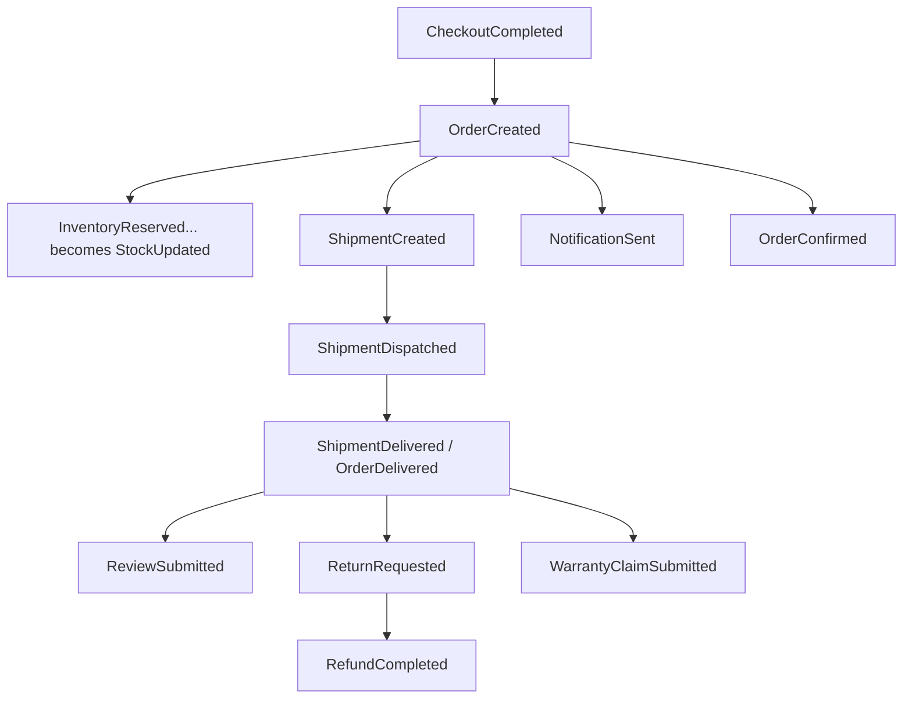
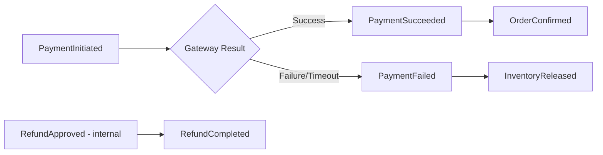
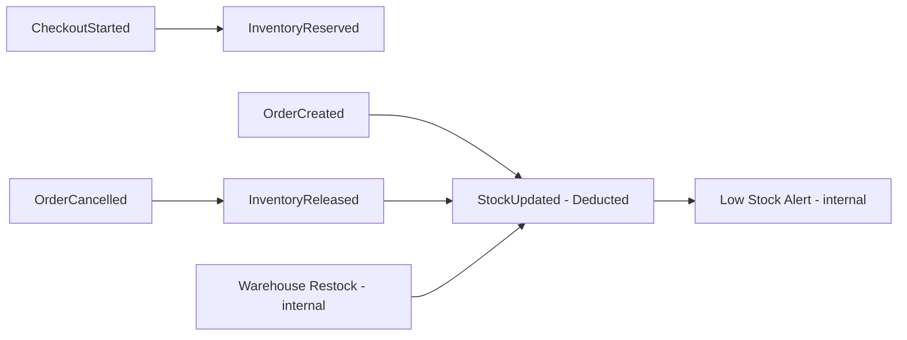
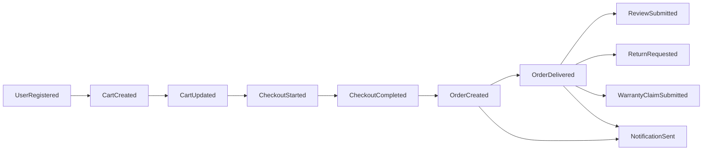
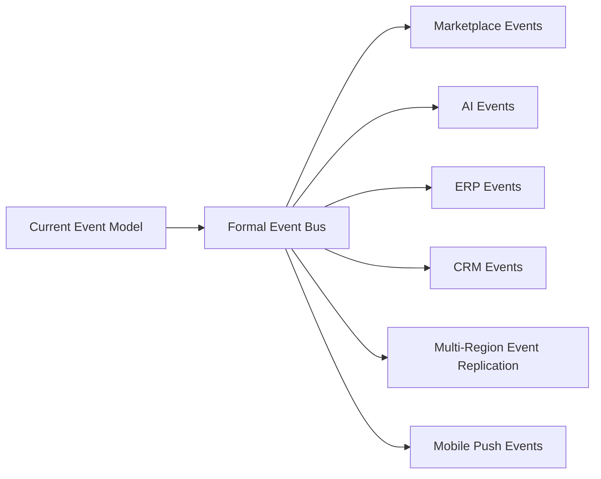

# Event Flow Architecture

## 1. Document Purpose

This document is the official Event Flow Architecture for **StackLeo Tech Store**. It explains how business events are produced, consumed, propagated, and governed across the platform.

- **What Is an Event** — a record that something business-significant has already happened (e.g., "Order Created"), stated as a fact, not a request or command.
- **Business Event vs. Technical Event** — a business event represents a fact meaningful to the business domain (e.g., "Payment Succeeded"); a technical event (e.g., a cache invalidation signal) is an implementation concern outside this document's scope. This document catalogs business events only.
- **Event-Driven Architecture** — an architectural style where services communicate significant occurrences as events rather than only through direct calls, supporting the loose coupling defined in `architecture-principles.md` (ARCH-013).
- **Relationship with Domain Events** — every event cataloged here is one of the domain events introduced conceptually in `domain-model.md` (Section 8), elaborated here with full production, consumption, and governance detail.
- **Relationship with Services** — events are produced and consumed by the logical services defined in `service-architecture.md` (Section 4), realizing the event-driven collaboration described there (Section 5).

This document is implementation-independent. It does not assume any specific event broker or messaging technology (e.g., Kafka, RabbitMQ, Redis Streams), and does not define REST endpoints, database structure, or code — it describes business events and their architectural governance only.

## 2. Event Philosophy

- **Loose Coupling** — a producing service publishes an event without needing to know which services, if any, consume it, consistent with ARCH-007 and ARCH-013.
- **Asynchronous Processing** — event consumption generally does not block the producing service's own completion, preserving responsiveness on the customer-facing critical path, consistent with `service-architecture.md` (Section 5).
- **Business Event Ownership** — each event has exactly one producing service, which is authoritative for when and why it is emitted, consistent with the single source of truth principle in `data-flow.md` (Section 2).
- **Event Immutability** — once published, an event represents a fact about something that has already happened and is never altered; a correction is represented by a new, subsequent event, not a retroactive edit.
- **Event Versioning** — an event's structure and meaning may evolve over time; changes are versioned deliberately (Section 8) so existing consumers are not silently broken.
- **Event Traceability** — every event is traceable to the business action that caused it and to every service that consumed it, supporting audit and diagnosis, consistent with ARCH-018 and ARCH-037.

## 3. Event Catalog

| Category | Events | Event ID Range |
|---|---|---|
| Identity Events | UserRegistered, UserLoggedIn, PasswordResetRequested | EVT-001–EVT-003 |
| Catalog Events | ProductCreated, ProductUpdated, ProductPublished, ProductArchived | EVT-004–EVT-007 |
| Commerce Events | CartCreated, CartUpdated, CouponApplied | EVT-008–EVT-010 |
| Checkout Events | CheckoutStarted, CheckoutCompleted | EVT-011–EVT-012 |
| Order Events | OrderCreated, OrderConfirmed, OrderCancelled, OrderDelivered | EVT-013–EVT-016 |
| Payment Events | PaymentInitiated, PaymentSucceeded, PaymentFailed, RefundCompleted | EVT-017–EVT-020 |
| Inventory Events | InventoryReserved, InventoryReleased, StockUpdated | EVT-021–EVT-023 |
| Shipping Events | ShipmentCreated, ShipmentDispatched, ShipmentDelivered | EVT-024–EVT-026 |
| Customer Events | ReviewSubmitted, ReturnRequested, WarrantyClaimSubmitted, NotificationSent | EVT-027–EVT-030 |
| Future Events | MarketplaceOrderCreated, CorporateOrderCreated, AIRecommendationGenerated | EVT-031–EVT-033 |

**Total Events: 33**

Each event below follows the template defined in Section 4, presented across three tables per category: **Identity & Purpose**, **Behavior**, and **Traceability**.

---

## 4. Event Specifications

### 4.1 Identity Events

**Identity & Purpose**

| ID | Event Name | Business Purpose | Producer | Consumers |
|---|---|---|---|---|
| EVT-001 | UserRegistered | Signal that a new verified account has been created. | Authentication Service | User Profile Service, Notification Service |
| EVT-002 | UserLoggedIn | Signal a successful authentication. | Authentication Service | Audit Service, Fraud Detection (Future) |
| EVT-003 | PasswordResetRequested | Signal that a customer has requested credential recovery. | Authentication Service | Notification Service, Audit Service |

**Behavior**

| ID | Trigger | Business Outcome | Event Category | Business Priority |
|---|---|---|---|---|
| EVT-001 | Registration and verification succeed | A usable customer account exists | Identity | Critical |
| EVT-002 | Valid credentials submitted | An authenticated session begins | Identity | High |
| EVT-003 | Customer initiates password reset | A reset communication is dispatched | Identity | High |

**Traceability**

| ID | Related Domains | Related Services | Versioning Considerations | Future Evolution |
|---|---|---|---|---|
| EVT-001 | Identity, Customer | Authentication Service, User Profile Service | Stable; low change frequency expected | None anticipated |
| EVT-002 | Identity | Authentication Service | Stable | Feeds future Fraud Detection Service (BR-113) |
| EVT-003 | Identity | Authentication Service | Stable | None anticipated |

### 4.2 Catalog Events

**Identity & Purpose**

| ID | Event Name | Business Purpose | Producer | Consumers |
|---|---|---|---|---|
| EVT-004 | ProductCreated | Signal a new product record has been created (Draft). | Product Service | Analytics Services |
| EVT-005 | ProductUpdated | Signal a change to product content, pricing, or attributes. | Product Service | Search Service, Cart Service, Pricing Service |
| EVT-006 | ProductPublished | Signal a product has become publicly visible. | Product Service | Category Service, Search Service, Analytics Services, AI Recommendation Service (Future) |
| EVT-007 | ProductArchived | Signal a product has been discontinued. | Product Service | Search Service, Wishlist Service |

**Behavior**

| ID | Trigger | Business Outcome | Event Category | Business Priority |
|---|---|---|---|---|
| EVT-004 | Product Manager creates a listing | A draft product record exists | Catalog | Medium |
| EVT-005 | Product content or price is edited | Dependent services reflect current data | Catalog | High |
| EVT-006 | Admin approves publish | Product becomes discoverable and purchasable | Catalog | Critical |
| EVT-007 | Product is discontinued | Product is removed from active discovery | Catalog | Medium |

**Traceability**

| ID | Related Domains | Related Services | Versioning Considerations | Future Evolution |
|---|---|---|---|---|
| EVT-004 | Catalog, Product | Product Service | Stable | — |
| EVT-005 | Catalog, Product | Product Service | Must remain backward compatible for Search/Cart/Pricing consumers | Extended for Marketplace seller listings (Future) |
| EVT-006 | Catalog, Product | Product Service | Stable; foundational event for discovery | Feeds AI Recommendation Service (Future) |
| EVT-007 | Catalog, Product | Product Service | Stable | — |

### 4.3 Commerce Events

**Identity & Purpose**

| ID | Event Name | Business Purpose | Producer | Consumers |
|---|---|---|---|---|
| EVT-008 | CartCreated | Signal a new cart has been initiated for a customer. | Cart Service | Analytics Services |
| EVT-009 | CartUpdated | Signal a change to cart contents. | Cart Service | Checkout Service, Dashboard Service |
| EVT-010 | CouponApplied | Signal a coupon has been successfully applied to a cart. | Coupon Service | Pricing Service, Reporting Service |

**Behavior**

| ID | Trigger | Business Outcome | Event Category | Business Priority |
|---|---|---|---|---|
| EVT-008 | Customer adds first item to a new cart | A cart exists and is tracked | Commerce | Low |
| EVT-009 | Item added, removed, or quantity changed | Cart state is current and accurate | Commerce | High |
| EVT-010 | Valid coupon redeemed against a cart | Discount reflected in cart total | Commerce | Medium |

**Traceability**

| ID | Related Domains | Related Services | Versioning Considerations | Future Evolution |
|---|---|---|---|---|
| EVT-008 | Cart | Cart Service | Stable | Supports future abandoned-cart analysis |
| EVT-009 | Cart | Cart Service, Checkout Service | Stable | — |
| EVT-010 | Promotions, Cart | Coupon Service, Pricing Service | Stable | Extended for future loyalty point redemption |

### 4.4 Checkout Events

**Identity & Purpose**

| ID | Event Name | Business Purpose | Producer | Consumers |
|---|---|---|---|---|
| EVT-011 | CheckoutStarted | Signal a customer has begun the checkout process. | Checkout Service | Inventory Service (temporary hold), Analytics Services |
| EVT-012 | CheckoutCompleted | Signal checkout validation has succeeded and an order request is ready. | Checkout Service | Order Service |

**Behavior**

| ID | Trigger | Business Outcome | Event Category | Business Priority |
|---|---|---|---|---|
| EVT-011 | Customer selects "Checkout" | Temporary stock hold begins | Checkout | High |
| EVT-012 | Address, delivery, and payment are validated | Order creation is authorized to proceed | Checkout | Critical |

**Traceability**

| ID | Related Domains | Related Services | Versioning Considerations | Future Evolution |
|---|---|---|---|---|
| EVT-011 | Checkout, Cart | Checkout Service, Inventory Service | Stable | — |
| EVT-012 | Checkout, Order | Checkout Service, Order Service | Critical event; changes require coordinated review | Extended for Corporate Sales checkout variant (Future) |

### 4.5 Order Events

**Identity & Purpose**

| ID | Event Name | Business Purpose | Producer | Consumers |
|---|---|---|---|---|
| EVT-013 | OrderCreated | Signal a confirmed order record now exists. | Order Service | Inventory Service, Shipping Service, Notification Service, Reporting Service, Invoice Service |
| EVT-014 | OrderConfirmed | Signal payment/COD confirmation has finalized the order. | Order Service | Notification Service, Analytics Services |
| EVT-015 | OrderCancelled | Signal an order has been cancelled prior to shipment. | Order Service | Inventory Service, Payment Service, Notification Service |
| EVT-016 | OrderDelivered | Signal an order has reached the customer or been collected. | Delivery Tracking Service | Order Service, Review Service, Customer Support Service, Notification Service |

**Behavior**

| ID | Trigger | Business Outcome | Event Category | Business Priority |
|---|---|---|---|---|
| EVT-013 | CheckoutCompleted and payment/COD confirmed | Order enters fulfillment pipeline | Order | Critical |
| EVT-014 | Payment succeeds or COD is confirmed eligible | Order is finalized for fulfillment | Order | Critical |
| EVT-015 | Customer or Admin cancels a pre-shipment order | Stock and payment are released | Order | High |
| EVT-016 | Courier confirms delivery or pickup collection | Order fulfillment is complete | Order | Critical |

**Traceability**

| ID | Related Domains | Related Services | Versioning Considerations | Future Evolution |
|---|---|---|---|---|
| EVT-013 | Order | Order Service | Foundational event; highest change scrutiny | Extended for Marketplace and Corporate order variants (Future) |
| EVT-014 | Order, Payment | Order Service, Payment Service | Stable | — |
| EVT-015 | Order, Inventory, Payment | Order Service, Inventory Service, Payment Service | Stable | — |
| EVT-016 | Order, Shipping | Delivery Tracking Service, Order Service | Stable; triggers multiple downstream eligibility windows | Starts Return/Warranty window calculations |

### 4.6 Payment Events

**Identity & Purpose**

| ID | Event Name | Business Purpose | Producer | Consumers |
|---|---|---|---|---|
| EVT-017 | PaymentInitiated | Signal a payment attempt has begun. | Payment Service | Analytics Services |
| EVT-018 | PaymentSucceeded | Signal a payment has been confirmed successful. | Payment Service | Order Service, Notification Service |
| EVT-019 | PaymentFailed | Signal a payment attempt has failed or timed out. | Payment Service | Order Service, Inventory Service, Notification Service |
| EVT-020 | RefundCompleted | Signal an approved refund has been successfully processed. | Payment Service | Order Service, Notification Service, Reporting Service |

**Behavior**

| ID | Trigger | Business Outcome | Event Category | Business Priority |
|---|---|---|---|---|
| EVT-017 | Customer submits payment | Payment processing begins | Payment | Medium |
| EVT-018 | Payment Gateway confirms success | Order proceeds to confirmation | Payment | Critical |
| EVT-019 | Payment Gateway reports failure/timeout | Stock is released; retry is offered | Payment | Critical |
| EVT-020 | Refund is successfully processed | Financial resolution is closed | Payment | Critical |

**Traceability**

| ID | Related Domains | Related Services | Versioning Considerations | Future Evolution |
|---|---|---|---|---|
| EVT-017 | Payment | Payment Service | Stable | — |
| EVT-018 | Payment, Order | Payment Service, Order Service | Critical; changes require coordinated review | Extended for future EMI/wallet payment methods |
| EVT-019 | Payment, Order, Inventory | Payment Service, Order Service, Inventory Service | Critical | Feeds future Fraud Detection Service |
| EVT-020 | Payment, Returns, Warranty | Payment Service | Stable | — |

### 4.7 Inventory Events

**Identity & Purpose**

| ID | Event Name | Business Purpose | Producer | Consumers |
|---|---|---|---|---|
| EVT-021 | InventoryReserved | Signal stock has been held for an in-progress checkout. | Inventory Service | Cart Service, Checkout Service |
| EVT-022 | InventoryReleased | Signal previously reserved stock has been returned to availability. | Inventory Service | Cart Service |
| EVT-023 | StockUpdated | Signal a change in available stock level for a SKU. | Inventory Service | Product Service, Search Service, Wishlist Service |

**Behavior**

| ID | Trigger | Business Outcome | Event Category | Business Priority |
|---|---|---|---|---|
| EVT-021 | Checkout session begins | Stock is temporarily unavailable to other customers | Inventory | High |
| EVT-022 | Checkout abandoned, cancelled, or payment fails | Stock returns to available pool | Inventory | High |
| EVT-023 | Order confirmed, cancellation, or replenishment | Displayed availability reflects current stock | Inventory | Critical |

**Traceability**

| ID | Related Domains | Related Services | Versioning Considerations | Future Evolution |
|---|---|---|---|---|
| EVT-021 | Inventory, Cart | Inventory Service | Stable | Extended for multi-warehouse reservation logic (Phase 4) |
| EVT-022 | Inventory, Cart | Inventory Service | Stable | — |
| EVT-023 | Inventory, Product | Inventory Service | Foundational; high consumer count | Feeds future Inventory Forecasting (AI) |

### 4.8 Shipping Events

**Identity & Purpose**

| ID | Event Name | Business Purpose | Producer | Consumers |
|---|---|---|---|---|
| EVT-024 | ShipmentCreated | Signal an order has been packed and a shipment record created. | Shipping Service | Notification Service |
| EVT-025 | ShipmentDispatched | Signal a shipment has been handed to a courier or is ready for pickup. | Shipping Service | Delivery Tracking Service, Notification Service |
| EVT-026 | ShipmentDelivered | Signal a shipment has reached the customer or been collected. | Delivery Tracking Service | Order Service, Notification Service |

**Behavior**

| ID | Trigger | Business Outcome | Event Category | Business Priority |
|---|---|---|---|---|
| EVT-024 | Warehouse completes packing | Shipment record is established | Shipping | High |
| EVT-025 | Courier assignment confirmed / pickup readiness confirmed | Delivery process begins | Shipping | High |
| EVT-026 | Courier confirms delivery or customer collects | Delivery is complete | Shipping | Critical |

**Traceability**

| ID | Related Domains | Related Services | Versioning Considerations | Future Evolution |
|---|---|---|---|---|
| EVT-024 | Shipping, Order | Shipping Service | Stable | — |
| EVT-025 | Shipping | Shipping Service, Delivery Tracking Service | Stable | Extended for own delivery fleet (Future) |
| EVT-026 | Shipping, Order | Delivery Tracking Service | Same underlying fact as OrderDelivered (EVT-016); kept synchronized | — |

### 4.9 Customer Events

**Identity & Purpose**

| ID | Event Name | Business Purpose | Producer | Consumers |
|---|---|---|---|---|
| EVT-027 | ReviewSubmitted | Signal a customer has submitted a product review. | Review Service | Analytics Services |
| EVT-028 | ReturnRequested | Signal a customer has requested a return. | Customer Support Service | Notification Service, Inventory Service (anticipatory) |
| EVT-029 | WarrantyClaimSubmitted | Signal a customer has submitted a warranty claim. | Customer Support Service | Notification Service |
| EVT-030 | NotificationSent | Signal a customer notification has been dispatched. | Notification Service | Analytics Services, Audit Service |

**Behavior**

| ID | Trigger | Business Outcome | Event Category | Business Priority |
|---|---|---|---|---|
| EVT-027 | Customer submits rating/feedback | Review enters moderation | Customer | Medium |
| EVT-028 | Customer submits return request | Request enters verification | Customer | High |
| EVT-029 | Customer submits warranty claim | Claim enters verification | Customer | High |
| EVT-030 | Any notification dispatch completes | Delivery outcome is recorded | Customer | Medium |

**Traceability**

| ID | Related Domains | Related Services | Versioning Considerations | Future Evolution |
|---|---|---|---|---|
| EVT-027 | Reviews | Review Service | Stable | — |
| EVT-028 | Returns | Customer Support Service | Stable | — |
| EVT-029 | Warranty | Customer Support Service | Stable | — |
| EVT-030 | Notifications | Notification Service | Stable | Extended for Push Notification (Future) |

### 4.10 Future Events

**Identity & Purpose**

| ID | Event Name | Business Purpose | Producer | Consumers |
|---|---|---|---|---|
| EVT-031 | MarketplaceOrderCreated (Future) | Signal an order placed against a marketplace seller's listing. | Marketplace Service | Order Service, Notification Service |
| EVT-032 | CorporateOrderCreated (Future) | Signal a bulk order placed under corporate account terms. | Corporate Sales Service | Order Service, Reporting Service |
| EVT-033 | AIRecommendationGenerated (Future) | Signal a personalized recommendation set has been produced for a customer. | AI Recommendation Service | Analytics Services |

**Behavior**

| ID | Trigger | Business Outcome | Event Category | Business Priority |
|---|---|---|---|---|
| EVT-031 | Customer completes a marketplace purchase | Order routed to fulfilling seller | Future | Not yet active |
| EVT-032 | Corporate buyer's bulk order is validated | Corporate order enters fulfillment | Future | Not yet active |
| EVT-033 | AI Recommendation Service completes analysis | Personalized suggestions are ready to display | Future | Not yet active |

**Traceability**

| ID | Related Domains | Related Services | Versioning Considerations | Future Evolution |
|---|---|---|---|---|
| EVT-031 | Marketplace, Order | Marketplace Service, Order Service | To be defined ahead of Phase 5 | Commission and settlement event chain (EVT extensions) |
| EVT-032 | Corporate Sales, Order | Corporate Sales Service, Order Service | To be defined ahead of Phase 4 | — |
| EVT-033 | Analytics | AI Recommendation Service | To be defined ahead of Phase 6 | Extended for AI Chatbot and Fraud Detection events |

---

## 5. Event Lifecycle

*Diagram: Event Flow Overview — the generic lifecycle every cataloged event passes through.*

| Stage | Description |
|---|---|
| Creation | The producing service determines a business-significant fact has occurred and constructs the event. |
| Publication | The event is made available to any interested consumer, without the producer needing to know who they are. |
| Consumption | One or more services receive and act upon the event, each independently and without blocking the producer. |
| Completion | Each consumer's reaction to the event concludes, whether successfully or via a defined failure path (Section 7). |
| Archival | The event's record is retained per its category's retention expectations, primarily for audit and historical analysis, consistent with `data-flow.md` (Section 7). |

## 6. Event Relationships

- **Event Chains** — one event's consumption often triggers the publication of a subsequent event (e.g., `PaymentSucceeded` → `OrderCreated` → `InventoryReserved`/`ShipmentCreated`), forming a chain that realizes a complete business process without any single service orchestrating the entire chain directly.
- **Event Dependencies** — some events are logically dependent on a prior event having occurred (e.g., `ShipmentDelivered` cannot meaningfully occur without a prior `ShipmentDispatched`); these dependencies are documented per-event in Section 4 but are not technically enforced by this document.
- **Cascading Events** — a single originating event can fan out to multiple independent consumers simultaneously (e.g., `OrderCreated` is consumed by Inventory, Shipping, Notification, Reporting, and Invoice Services at once), each reacting independently without coordinating with the others.
- **Long-Running Business Processes** — processes like Return or Warranty resolution span multiple events over an extended period (`ReturnRequested` → inspection → `RefundCompleted`), during which the business process's state is tracked by its owning service (Customer Support Service), not inferred solely from the event stream.

*Diagram: Order Event Lifecycle.*

*Diagram: Payment Event Flow.*

*Diagram: Inventory Event Flow.*

*Diagram: Customer Journey Event Flow.*

## 7. Reliability

- **Delivery Guarantees (Conceptual)** — every business-significant event is expected to be delivered to its interested consumers at least once; consumers are designed to tolerate receiving the same event more than once (see Idempotency below), consistent with `integration-architecture.md` (Section 7).
- **Retry Strategy** — a consumer that fails to process an event retries in a bounded, sensible manner before the failure is escalated, consistent with ARCH-044.
- **Duplicate Event Handling** — consumers are designed to recognize and safely ignore an event they have already processed, rather than assuming exactly-once delivery.
- **Idempotency** — consuming the same event twice must not produce a duplicate business effect (e.g., processing `PaymentSucceeded` twice must not create two orders), consistent with `integration-architecture.md` (Section 7).
- **Failure Recovery** — an event a consumer repeatedly fails to process is conceptually set aside for investigation (the Dead Letter Queue concept in `integration-architecture.md`, Section 7) rather than silently discarded or endlessly retried.

## 8. Governance

- **Ownership** — each event's producing service (Section 4, "Producer") is the sole authority for that event's meaning and structure; no other service may publish an event it does not own.
- **Naming Standards** — events are named in the past tense, reflecting a fact that has already occurred (e.g., "OrderCreated," not "CreateOrder"), consistent with event immutability (Section 2).
- **Versioning** — changes to an event's meaning or structure are versioned deliberately; existing consumers must continue to function against the prior version until they migrate, consistent with `service-architecture.md` (Section 7).
- **Event Reviews** — new events or material changes to existing events are reviewed against this catalog before adoption, to prevent duplicate or overlapping events being introduced for the same business fact.
- **Change Management** — additions, removals, or material changes to events must be recorded in `00_Project_Overview/changelog.md`, with downstream consumer impact assessed against the Producer/Consumer Matrix (Section 9).

### Event Ownership

| Event Category | Owning Service Group |
|---|---|
| Identity Events | Authentication Service |
| Catalog Events | Product Service |
| Commerce Events | Cart Service, Coupon Service |
| Checkout Events | Checkout Service |
| Order Events | Order Service, Delivery Tracking Service |
| Payment Events | Payment Service |
| Inventory Events | Inventory Service |
| Shipping Events | Shipping Service, Delivery Tracking Service |
| Customer Events | Review Service, Customer Support Service, Notification Service |
| Future Events | Marketplace Service, Corporate Sales Service, AI Recommendation Service |

### Producer / Consumer Matrix

| Event | Producer | Consumers |
|---|---|---|
| OrderCreated | Order Service | Inventory, Shipping, Notification, Reporting, Invoice Services |
| PaymentSucceeded | Payment Service | Order Service, Notification Service |
| PaymentFailed | Payment Service | Order Service, Inventory Service, Notification Service |
| StockUpdated | Inventory Service | Product Service, Search Service, Wishlist Service |
| ShipmentDelivered | Delivery Tracking Service | Order Service, Notification Service |
| ReturnRequested | Customer Support Service | Notification Service, Inventory Service |
| ProductPublished | Product Service | Category, Search, Analytics Services, AI Recommendation Service (Future) |

*A complete producer/consumer mapping for every event is provided within each event's Section 4 specification.*

### Event Categories

| Category | Count | Business Domain Alignment |
|---|---|---|
| Identity | 3 | Identity domain (`domain-model.md`) |
| Catalog | 4 | Catalog, Product domains |
| Commerce | 3 | Cart, Promotions domains |
| Checkout | 2 | Checkout domain |
| Order | 4 | Order domain |
| Payment | 4 | Payment domain |
| Inventory | 3 | Inventory domain |
| Shipping | 3 | Shipping domain |
| Customer | 4 | Reviews, Returns, Warranty, Notifications domains |
| Future | 3 | Corporate Sales, Marketplace, Analytics domains (Future) |

## 9. Future Evolution

*Diagram: Future Marketplace Event Flow — shown here as part of the broader future event ecosystem.*

| Future Direction | Event Flow Readiness |
|---|---|
| Event Bus | The current catalog and Producer/Consumer Matrix are designed to map directly onto a formal event bus once cross-service event volume justifies the operational investment, consistent with `service-architecture.md` (Section 11). |
| Marketplace | EVT-031 (MarketplaceOrderCreated) and related future commission/settlement events extend the existing Order event chain without altering it. |
| AI | EVT-033 (AIRecommendationGenerated) and future Fraud Detection events consume existing events (ProductPublished, OrderCreated, PaymentFailed) without requiring changes to their producers. |
| ERP | Future ERP integration consumes Order and Payment events for financial synchronization, following the same non-blocking pattern as current consumers. |
| CRM | Future CRM integration consumes Customer and Order events for engagement purposes, without becoming an alternate source of truth for customer data. |
| Multi-Region | Event replication across regions is a natural extension of the existing publish/consume model, once multi-region deployment (per `deployment-architecture.md`, Section 8) is adopted. |
| Mobile | Push Notification events (extending EVT-030) follow the same Notification Service pattern already established for Email and SMS. |

## 10. Document Information

| Property | Value |
|----------|-------|
| Document | event-flows.md |
| Version | 1.0.0 |
| Status | Active |
| Maintained By | StackLeo |
| Last Updated | 2026-07-17 |

---

© StackLeo. All Rights Reserved.
