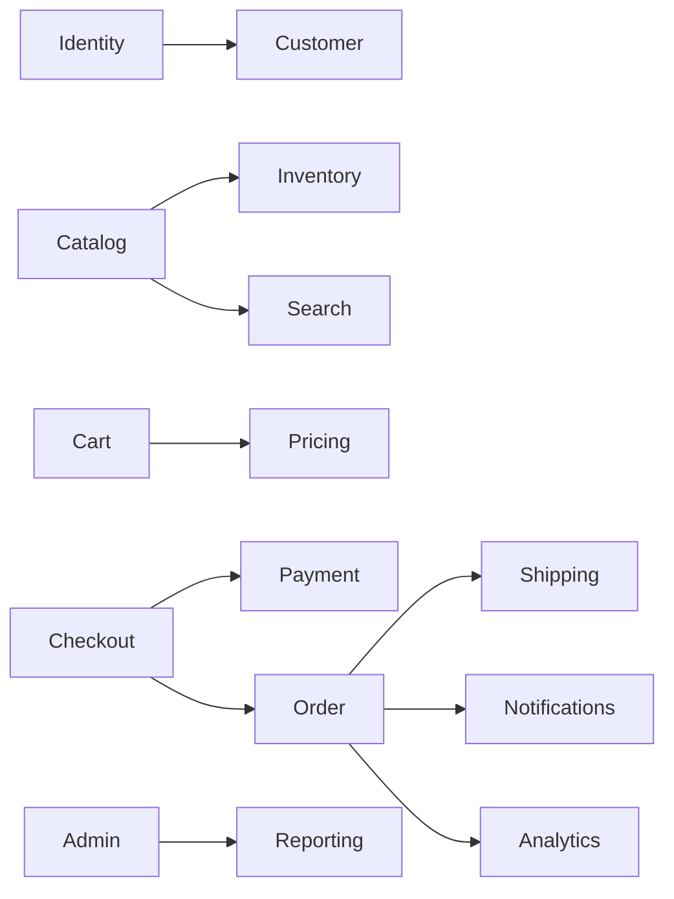
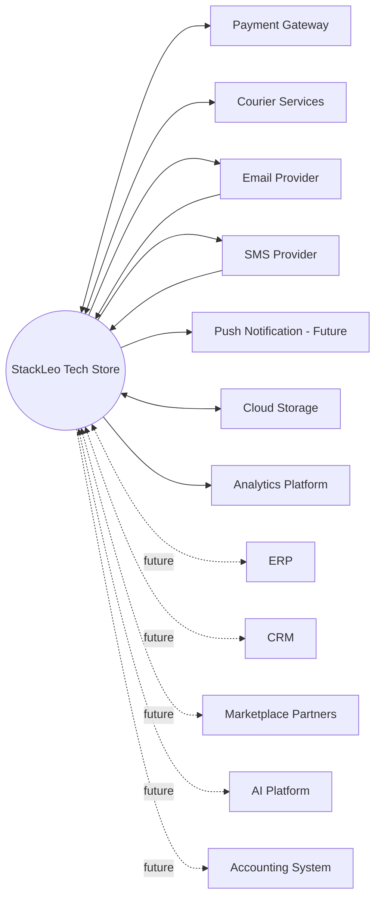
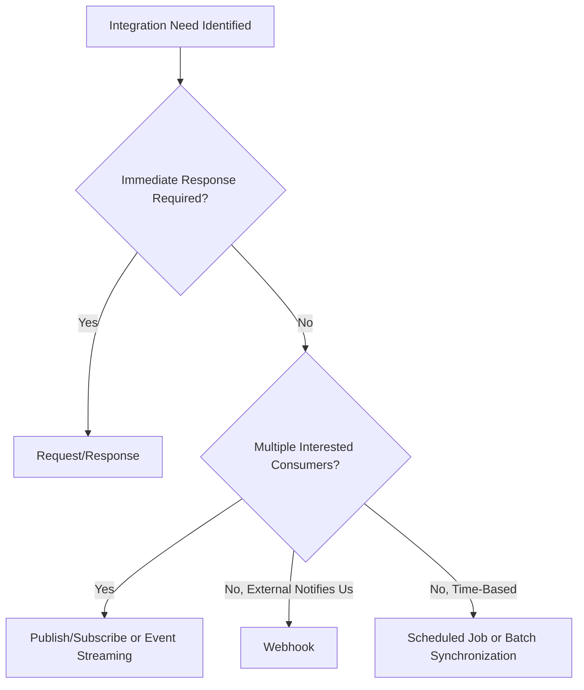
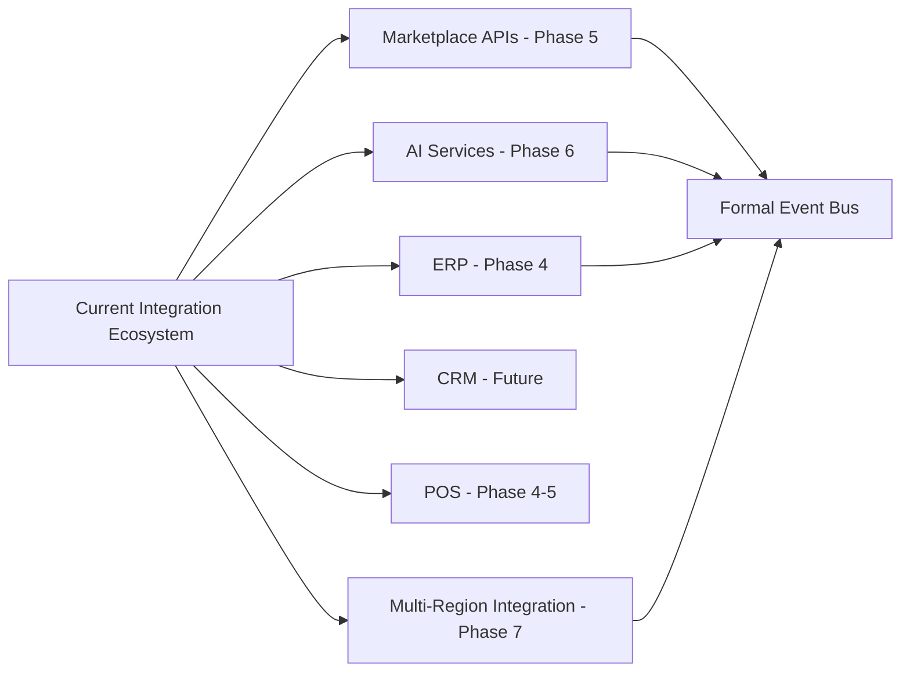
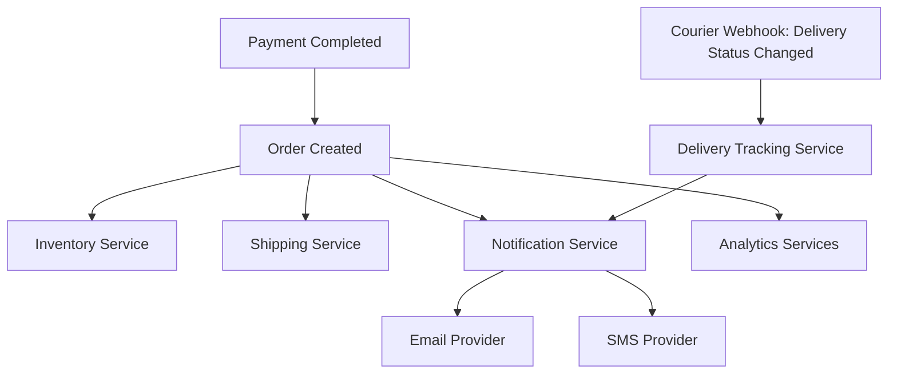

# Integration Architecture

## 1. Document Purpose

This document is the official Integration Architecture for **StackLeo Tech Store**. It defines how the platform exchanges information — between its own internal services (per `service-architecture.md`) and with external systems (per `system-overview.md`, Section 7) — at a purely architectural level.

- **Integration Architecture** — the discipline of defining how distinct systems and services exchange information reliably, securely, and consistently, without prescribing the specific technical mechanism used.
- **Business Value** — sound integration architecture allows StackLeo to depend on best-of-breed external partners (payment, courier, communication) and to compose its own services into coherent business capability, without those dependencies becoming sources of fragility or unnecessary coupling.
- **Enterprise Integration** — as StackLeo scales toward corporate sales, marketplace operations, and international expansion, integration architecture is what allows new systems (ERP, CRM, marketplace partners, AI platforms) to be incorporated as additive relationships rather than disruptive rework.

This document is implementation-independent. It does not define REST endpoints, GraphQL schemas, or message payloads — those belong to dedicated technical documentation outside `03_System_Design`. This document describes integration architecture: what integrates with what, why, in which direction, and under what reliability and security expectations.

## 2. Integration Philosophy

- **Loose Coupling** — integrations depend on stable, minimal contracts rather than deep mutual knowledge of internal implementation, consistent with ARCH-007.
- **API-First** — every integration point, internal or external, is designed as a contract to be consumed, independent of the specific consuming channel, consistent with ARCH-011.
- **Event-Driven Readiness** — integrations favor event-based notification for cross-boundary business facts wherever an immediate response is not required, consistent with ARCH-013.
- **Contract-First** — an integration's inputs, outputs, and expectations are agreed and documented before internal behavior on either side is finalized, consistent with `service-architecture.md` (Section 7).
- **Secure by Design** — every integration point authenticates and authorizes its counterpart by default, consistent with ARCH-014 and Zero Trust thinking (ARCH-034).
- **Reliability** — integrations are designed with explicit failure handling (Section 7), not an assumption of constant success.
- **Scalability** — integration points are designed to scale independently of the internal services they connect, avoiding external dependencies becoming a scaling bottleneck for unrelated capability.

## 3. Internal Integrations

Internal integrations connect the logical services defined in `service-architecture.md`. Each is described conceptually — the business relationship and information exchanged — without specifying technical mechanism.

| Integration | Description |
|---|---|
| Identity ↔ Customer | Authentication establishes verified identity; User Profile Service consumes that identity to associate and maintain the correct customer record. |
| Catalog ↔ Inventory | Product Service provides the catalog of sellable items; Inventory Service tracks their real-time stock, keeping customer-facing availability accurate. |
| Catalog ↔ Search | Product Service is the source of truth for catalog content; Search Service consumes and indexes it to support fast, relevant discovery. |
| Cart ↔ Pricing | Cart Service holds selected items; Pricing Service determines the applicable price for each, incorporating active promotions. |
| Checkout ↔ Payment | Checkout Service coordinates the customer's confirmed purchase intent; Payment Service processes and confirms the financial transaction that authorizes the order. |
| Checkout ↔ Order | Checkout Service validates and finalizes a purchase; Order Service creates the authoritative transactional record once checkout succeeds. |
| Order ↔ Shipping | Order Service represents what was purchased; Shipping Service coordinates its physical delivery once fulfillment begins. |
| Order ↔ Notifications | Order Service's status changes are business-significant events; Notification Service consumes them to keep the customer informed. |
| Order ↔ Analytics | Order Service's transactional history feeds Reporting and Dashboard Services with the data needed for business insight. |
| Admin ↔ Reporting | Admin Service provides the governed access point through which internal roles request and view reports produced by Reporting Service. |

*Diagram: Internal Integration Map.*

### Internal Integration Matrix

| Source Service | Target Service | Relationship Type | Business Purpose |
|---|---|---|---|
| Authentication | User Profile | Identity provisioning | Establishes the identity underlying every customer record. |
| Product | Inventory | Reference | Ties catalog listings to accurate stock status. |
| Product | Search | Indexing consumer | Enables discoverability of catalog content. |
| Cart | Pricing | Calculation request | Ensures cart totals reflect current, promotion-aware pricing. |
| Checkout | Payment | Transaction coordination | Confirms financial authorization before order creation. |
| Checkout | Order | Transaction finalization | Converts validated intent into an authoritative record. |
| Order | Shipping | Fulfillment handoff | Initiates physical delivery of a confirmed order. |
| Order | Notifications | Event notification | Keeps the customer informed of status changes. |
| Order | Analytics (Reporting/Dashboard) | Data feed | Supplies transactional data for business insight. |
| Admin | Reporting | Access mediation | Provides governed, role-scoped report access. |

## 4. External Integrations

| Integration | Purpose | Direction | Business Value | Data Exchanged (Conceptual) | Failure Considerations |
|---|---|---|---|---|---|
| Payment Gateway | Process and verify customer payments. | Bidirectional | Enables secure, trusted digital payment collection. | Payment authorization requests, transaction confirmations | Gateway downtime blocks online payment; COD provides a fallback path (per NFR-015). |
| Courier Services | Execute physical delivery of orders. | Bidirectional | Enables reliable, multi-partner delivery coverage. | Delivery address, order details, tracking status updates | Individual courier disruption is mitigated by StackLeo's multi-courier strategy (`01_Business/shipping-policy.md`). |
| Email Provider | Deliver transactional and marketing email. | Outbound (with delivery status returned) | Supports order communication and customer engagement. | Notification content, delivery status | Delivery failure does not block order fulfillment; order state remains authoritative regardless. |
| SMS Provider | Deliver time-sensitive SMS notifications. | Outbound (with delivery status returned) | Reaches customers reliably for delivery-critical updates. | Notification content, delivery status | Delivery failure handled the same as Email Provider; non-blocking to core fulfillment. |
| Push Notification Service (Future) | Deliver real-time notifications to the future Mobile App. | Outbound | Extends timely communication to the mobile channel. | Notification content, delivery status | Not yet active; will follow the same non-blocking failure pattern as Email/SMS. |
| Cloud Storage | Store product media and business documents. | Bidirectional | Provides durable, scalable storage for catalog and business assets. | Product images, documents, backups | Temporary unavailability degrades media display gracefully rather than blocking core transactions. |
| Analytics Platform | Support behavioral and performance analysis. | Outbound | Enables data-informed business and product decisions. | Aggregated behavioral and transactional data | Non-critical; delayed or failed analytics delivery does not affect customer-facing capability. |
| ERP (Future) | Financial and operational data exchange at enterprise scale. | Bidirectional | Supports Phase 4 enterprise-scale financial and operational management. | Financial and operational data | Not yet active; to be designed with the same non-blocking principles as current integrations. |
| CRM (Future) | Deeper customer relationship management. | Bidirectional | Supports enhanced customer engagement and retention strategy. | Customer relationship and engagement data | Not yet active; customer-facing capability must not depend on CRM availability. |
| Marketplace Partners (Future) | Third-party seller listing, order, and settlement exchange. | Bidirectional | Enables the Phase 5 multi-vendor marketplace. | Listings, orders, settlement data | Not yet active; seller-side failures must be isolated from core B2C capability. |
| AI Platform (Future) | Intelligent search, recommendations, and support automation. | Bidirectional | Supports Phase 6 AI-assisted customer experience. | Behavioral data, catalog data, model-driven outputs | Not yet active; must degrade gracefully to non-AI experience on failure, per ARCH-043. |
| Accounting System (Future) | Financial record-keeping and reconciliation. | Outbound | Supports accurate, compliant financial reporting at scale. | Reconciled transaction and revenue data | Not yet active; reconciliation delay must not block order or payment processing. |

*Diagram: External Integration Map.*

### External Integration Matrix

| External System | Criticality | Failure Mode Handling |
|---|---|---|
| Payment Gateway | Critical | Graceful fallback to COD; retry within bounds (per `service-architecture.md`, Section 8). |
| Courier Services | Critical | Multi-courier redundancy; automatic fallback assignment. |
| Email/SMS Providers | High | Non-blocking; order/account state remains authoritative regardless of notification delivery. |
| Cloud Storage | High | Graceful degradation of media display; does not block transactional flows. |
| Analytics Platform | Low | Fully non-blocking; delayed delivery acceptable. |
| ERP, CRM, Marketplace, AI Platform, Accounting (Future) | To Be Determined | Designed from the outset for non-blocking, gracefully degrading integration, consistent with current-system precedent. |

## 5. Integration Patterns

| Pattern | Description | Representative Use |
|---|---|---|
| Request/Response | A synchronous exchange where the requester needs an immediate answer to proceed. | Checkout Service requesting payment authorization from the Payment Gateway. |
| Publish/Subscribe | A service publishes a business event without knowledge of its consumers; interested services subscribe independently. | Order Created event consumed by Inventory, Shipping, and Notification Services. |
| Event Streaming | A continuous, ordered flow of business events available for multiple consumers over time. | A future formal event backbone supporting Analytics and AI Platform consumption at scale (per `service-architecture.md`, Section 11). |
| Webhooks | An external system notifies StackLeo of a state change relevant to a prior request. | Courier Service notifying StackLeo of a delivery status change. |
| Scheduled Jobs | Time-triggered, recurring integration activity. | Periodic reconciliation between Payment records and the Payment Gateway's settlement reports. |
| Batch Synchronization | Bulk, periodic exchange of larger data sets. | Future ERP financial data synchronization at defined intervals. |
| File Exchange (Future) | Structured file-based data exchange with a partner system. | Future bulk catalog or settlement file exchange with Marketplace Partners. |

*Diagram: Integration Pattern Comparison — decision guide for selecting an appropriate pattern.*

## 6. Communication Styles

| Style | When Appropriate |
|---|---|
| Synchronous | When the requester cannot proceed without an immediate, direct answer (e.g., Checkout Service confirming payment authorization before finalizing an order). Used sparingly, on the critical path only where truly necessary. |
| Asynchronous | When the requester can continue without waiting for the outcome (e.g., Order Service triggering Notification Service without blocking order confirmation on notification delivery). Preferred wherever the business logic allows it. |
| Event-Driven | When a business fact is significant to potentially multiple, decoupled consumers, and the publisher should not need to know who they are (e.g., Order Delivered triggering both Review Service eligibility and Customer Support Service context). The default style for cross-service business notification, per `service-architecture.md` (Section 5). |

## 7. Reliability Strategies

| Strategy | Description |
|---|---|
| Retry | Transient integration failures (e.g., a momentary Payment Gateway timeout) are retried in a bounded, sensible manner before being surfaced as a failure, consistent with ARCH-044. |
| Timeout | Every synchronous integration call has a defined maximum wait time, preventing an unresponsive external system from indefinitely blocking StackLeo's own services. |
| Idempotency | Operations that may be safely retried (e.g., "confirm payment") are conceptually designed so that repeating the same request does not produce a duplicate business effect. |
| Dead Letter Queue (Concept) | Events or messages that repeatedly fail to be processed are conceptually set aside for investigation, rather than being silently dropped or endlessly retried. |
| Circuit Breaker (Concept) | Repeated failures calling a specific external system conceptually trigger a temporary halt to further calls, preventing cascading failure and giving the external system room to recover. |
| Graceful Degradation | Non-critical integration failure (e.g., Analytics Platform unavailability) degrades the surrounding experience gracefully rather than blocking core capability, consistent with ARCH-043. |

### Reliability Strategies by Integration

| Integration | Retry | Timeout | Idempotency | Circuit Breaker Readiness | Graceful Degradation |
|---|---|---|---|---|---|
| Payment Gateway | Yes | Yes | Critical (prevents duplicate charges) | Yes | Falls back to COD availability |
| Courier Services | Yes | Yes | Yes (prevents duplicate shipment creation) | Yes | Falls back to alternate courier partner |
| Email/SMS Providers | Yes | Yes | Not critical | Optional | Fully non-blocking |
| Cloud Storage | Yes | Yes | Yes | Optional | Degrades media display |
| Analytics Platform | Optional | Yes | Not critical | Optional | Fully non-blocking |

## 8. Security

- **Authentication** — every integration point verifies the identity of its counterpart before exchanging data, consistent with ARCH-014.
- **Authorization** — every integration point verifies that the counterpart is authorized for the specific data or action requested, consistent with least privilege (ARCH-033).
- **Encryption in Transit** — all data exchanged across an integration boundary, internal or external, is encrypted in transit by default, consistent with `deployment-architecture.md` (Section 9).
- **Secrets Management** — credentials and keys used to authenticate with external systems are stored securely and never embedded directly in code or configuration, consistent with ARCH-030.
- **API Trust** — internal services trust one another only within the bounds of their defined contracts (per `service-architecture.md`, Section 7); external systems are never granted implicit trust regardless of their business relationship.
- **Auditability** — significant integration events (e.g., payment authorization, courier assignment) are logged immutably, consistent with ARCH-037 and `service-architecture.md` (Section 9).

## 9. Integration Governance

| Governance Aspect | Description |
|---|---|
| Ownership | The Solution Architect owns overall integration architecture coherence; each integration's day-to-day operational ownership follows the Service Ownership Matrix in `service-architecture.md` (Section 12). |
| Versioning | Integration contracts are versioned deliberately, consistent with `service-architecture.md` (Section 7); breaking changes require explicit, coordinated migration. |
| Backward Compatibility | Changes to an integration must preserve existing counterpart expectations wherever reasonably possible, consistent with ARCH-023. |
| Change Management | Material changes to an integration must be recorded in `00_Project_Overview/changelog.md`, with impact assessed against the Internal and External Integration Matrices (Sections 3–4). |
| Monitoring | Every integration's health and failure rate are observed continuously, consistent with `observability.md` and `deployment-architecture.md` (Section 11). |

### Integration Ownership

| Integration Category | Primary Owner |
|---|---|
| Identity ↔ Customer | Engineering, Security Lead |
| Catalog ↔ Inventory ↔ Search | Product Team, Engineering |
| Cart ↔ Pricing ↔ Checkout ↔ Payment | Product Team, Finance |
| Order ↔ Shipping ↔ Notifications | Operations |
| Order ↔ Analytics, Admin ↔ Reporting | Management, Finance |
| Payment Gateway, Courier Services | Operations, Finance |
| Email/SMS/Push Providers | Marketing, Customer Support |
| Cloud Storage, Analytics Platform | Engineering, DevOps |
| ERP, CRM, Marketplace, AI Platform, Accounting (Future) | Founder / Business Owner, Solution Architect |

## 10. Future Integration Roadmap

*Diagram: Future Integration Ecosystem.*

| Future Integration | Readiness Approach |
|---|---|
| Marketplace APIs | Extends the existing Product and Order integration model to accommodate seller-owned data, consistent with `bounded-contexts.md` and `domain-model.md` (Section 11). |
| AI Services | Layers over existing Search, Product, and Order integrations as an additive, non-blocking capability. |
| ERP | Introduced using the same non-blocking, bidirectional integration principles established for current external systems. |
| CRM | Introduced as an additive customer data consumer, without altering the authoritative Customer domain ownership. |
| POS | Extends the Order and Inventory integration model to a new physical channel, producing the same domain events as Web and Store Pickup. |
| Multi-Region | Extends existing integration patterns across regional deployments (per `deployment-architecture.md`, Section 8), without redesigning the integration model itself. |
| Formal Event Bus | Introduced once cross-service and cross-integration event volume genuinely justifies the operational investment, consistent with `service-architecture.md` (Section 11) migration strategy. |

*Diagram: Event Flow Overview.*

## 11. Document Information

| Property | Value |
|----------|-------|
| Document | integration-architecture.md |
| Version | 1.0.0 |
| Status | Active |
| Maintained By | StackLeo |
| Last Updated | 2026-07-17 |

---

© StackLeo. All Rights Reserved.
