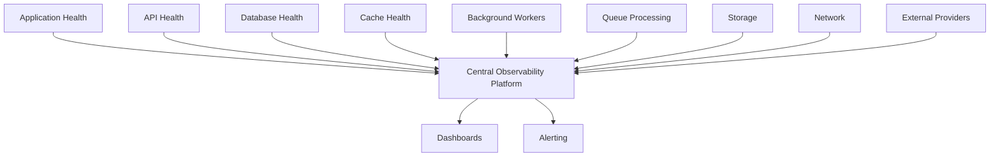
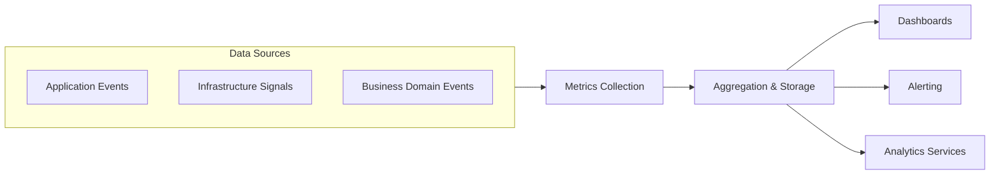
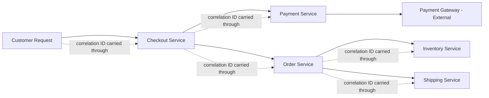
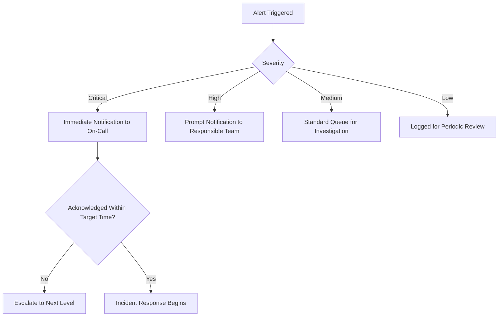
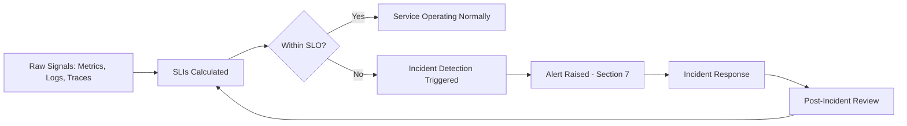

# Observability Architecture

## 1. Document Purpose

This document is the official Observability Architecture for **StackLeo Tech Store**. It defines how the platform is monitored, measured, diagnosed, and operated — the architectural foundation that lets Engineering, DevOps, and Operations understand what the system is actually doing at any moment.

- **What Is Observability** — the property of a system that allows its internal state to be inferred from its external outputs (metrics, logs, traces), enabling diagnosis of conditions that were never explicitly anticipated in advance.
- **Monitoring vs. Observability** — monitoring answers pre-defined questions ("Is the checkout service up?"); observability provides the raw, structured signal needed to answer questions no one thought to ask in advance ("Why did checkout latency spike for customers in Zone C last Tuesday?"). StackLeo's architecture is designed for observability, of which monitoring is one applied outcome.
- **Operational Visibility** — the practical result of observability: Operations and Engineering can see, at any time, whether the platform is healthy, and diagnose quickly when it is not.
- **Relationship with Reliability** — observability is a precondition for reliability (per `quality-attributes.md`, Section 6): a system cannot be reliably operated, recovered, or improved if its behavior cannot be seen.

This document is implementation-independent. It does not recommend specific monitoring tools or vendors, and does not include implementation scripts — it describes observability architecture and operational visibility strategy, consistent with the rest of `03_System_Design`.

## 2. Observability Principles

- **Metrics First** — every business-critical and technical capability defines its key metrics (Section 4) before monitoring tooling is applied, ensuring monitoring answers real questions rather than whatever happens to be easy to collect.
- **Structured Logging** — logs are captured in a consistent, structured, machine-parseable form (Section 5), not free-text messages that resist systematic analysis.
- **Distributed Tracing Readiness** — the architecture is designed so that a single customer transaction can be traced across the multiple services it touches (Section 6), consistent with `service-architecture.md`.
- **Health Monitoring** — every business-critical component exposes a means of confirming its own operational health (Section 9), consistent with NFR-057.
- **Actionable Alerts** — alerts are designed to prompt a specific, meaningful response (Section 7), not to generate noise that erodes responsiveness over time.
- **Continuous Improvement** — observability data directly informs ongoing architectural and operational refinement (Section 12), closing the loop between what is observed and what is improved.

## 3. Monitoring Strategy

| Monitoring Target | Conceptual Approach |
|---|---|
| Application Health | Continuous observation of the Presentation and Application-layer components (per `component-architecture.md`) for availability, error rate, and responsiveness. |
| API Health | Continuous observation of each logical service's contract (per `service-architecture.md`) for latency, error rate, and successful completion. |
| Database Health | Continuous observation of the primary data store for query latency, connection health, and replication status (where applicable). |
| Cache Health | Continuous observation of cache hit/miss ratio and availability, ensuring the cache is genuinely reducing load rather than silently failing open. |
| Background Workers | Continuous observation of asynchronous processing queues and worker throughput, ensuring deferred work (e.g., notification dispatch) is not silently accumulating. |
| Queue Processing | Continuous observation of message/event backlog depth and processing latency, once the future messaging capability (per `technology-stack.md`, Section 4.6) is adopted. |
| Storage | Continuous observation of object storage availability and latency for product media and document retrieval. |
| Network | Continuous observation of network-layer health across the trust boundaries defined in `deployment-architecture.md` (Section 6). |
| External Providers | Continuous observation of Payment Gateway, Courier Services, and Email/SMS Provider responsiveness and error rate, per `integration-architecture.md` (Section 4). |

*Diagram: Observability Architecture Overview.*

### Monitoring Matrix

| Monitoring Target | Primary Signal | Business Impact if Degraded |
|---|---|---|
| Application Health | Availability, error rate | Customer-facing experience directly impaired |
| API Health | Latency, error rate | Downstream service failures cascade |
| Database Health | Query latency, connection saturation | Order, payment, and inventory accuracy at risk |
| Cache Health | Hit/miss ratio | Increased latency and database load |
| Background Workers | Queue depth, processing latency | Delayed notifications, reports |
| Queue Processing | Backlog depth | Cross-service event delays (Future) |
| Storage | Availability, latency | Degraded product media display |
| Network | Connectivity, latency | Broad, potentially platform-wide impact |
| External Providers | Responsiveness, error rate | Payment or delivery capability degraded |

## 4. Metrics Strategy

| Metric Category | Description | Representative Examples |
|---|---|---|
| Business Metrics | Measures of business outcomes and health. | Conversion rate, Order Success Rate, Average Order Value |
| System Metrics | Measures of application-level technical behavior. | Request rate, error rate, response time |
| Infrastructure Metrics | Measures of underlying compute, storage, and network resource utilization. | CPU/memory utilization, storage capacity, network throughput |
| Performance Metrics | Measures of responsiveness against defined targets. | Page load time, API latency, checkout completion time |
| Security Metrics | Measures of security-relevant activity. | Failed login rate, unauthorized access attempts, rate-limit triggers |
| Availability Metrics | Measures of system uptime and reliability. | Uptime percentage, Mean Time to Recovery (MTTR) |

### Metrics Catalog

| Metric | Category | Related NFR |
|---|---|---|
| Conversion Rate | Business | — |
| Order Success Rate | Business | Related to NFR-010 |
| Checkout Completion Rate | Business | Related to NFR-005 |
| Page Response Time | Performance | NFR-001 |
| API/Service Latency | Performance | NFR-002 |
| Search Response Time | Performance | NFR-004 |
| Platform Uptime | Availability | NFR-013 |
| Mean Time to Recovery | Availability | NFR-019 |
| Failed Login Rate | Security | NFR-025, NFR-031 |
| Fraud Detection Rate | Security | NFR-030 |
| Resource Utilization | Infrastructure | NFR-072 |
| Error Rate | System | — |

*Diagram: Metrics Collection Pipeline.*

## 5. Logging Strategy

- **Structured Logging** — every log entry is captured in a consistent, structured format, enabling systematic search and analysis rather than manual text scanning, consistent with ARCH-029.
- **Log Levels** — log entries are classified by severity (e.g., informational, warning, error, critical), allowing consumers to filter for relevance without losing lower-priority context when needed.
- **Correlation IDs** — every customer or business transaction is tagged with a consistent identifier as it moves across services, enabling the distributed tracing described in Section 6.
- **Log Retention** — logs are retained according to their business and compliance relevance, consistent with `data-flow.md` (Section 7) and `01_Business/constraints.md` (Section 7).
- **Sensitive Data Handling** — logs exclude sensitive data (payment credentials, full personal identifiers) by design, consistent with ARCH-015 and NFR-032.
- **Audit Logging** — governed, business-critical actions are logged immutably as a distinct category, consistent with `02_Product/user-roles.md` (Section 12) and NFR-028.

### Logging Categories

| Log Category | Purpose | Retention Consideration |
|---|---|---|
| Application Logs | General application behavior and error diagnosis. | Retained per operational need, per NFR-052 |
| Access Logs | Record of requests reaching the platform. | Retained for security and traffic analysis |
| Security Logs | Authentication, authorization, and security-relevant events. | Retained per security policy, consistent with NFR-028 |
| Audit Logs | Immutable record of governed administrative and business-critical actions. | Retained permanently, consistent with `user-roles.md` (Section 12) |
| Integration Logs | Record of external system interactions. | Retained per operational and compliance need |
| Performance Logs | Latency and resource usage detail supporting diagnosis. | Retained per operational need |

## 6. Tracing Strategy

Tracing strategy remains conceptual, describing intent rather than a specific technical mechanism:

- **Request Tracing** — a single customer request (e.g., "Place Order") is traceable from its entry point through every internal component it touches, using a consistent correlation identifier (Section 5).
- **Service Tracing** — the sequence of service-to-service calls involved in fulfilling a request (per `service-architecture.md`, Section 4) is visible as a coherent chain, not disconnected fragments.
- **Dependency Tracing** — calls to external systems (Payment Gateway, Courier Services) are traced with the same rigor as internal calls, surfacing external latency or failure as clearly as internal issues.
- **Failure Tracing** — when a transaction fails, the trace reveals exactly where in the chain the failure occurred, supporting fast root-cause diagnosis consistent with the recovery time expectations in NFR-019.

*Diagram: Monitoring Flow — illustrating correlated request tracing across services.*

## 7. Alerting Strategy

- **Alert Priorities** — alerts are classified by severity, aligned to the incident detection flow in Section 11, ensuring the most critical conditions receive immediate attention.
- **Escalation Levels** — unacknowledged or unresolved alerts escalate progressively to broader responsibility, consistent with the recovery expectations in `deployment-architecture.md` (Section 10).
- **Alert Fatigue Reduction** — alert thresholds are tuned to genuinely actionable conditions, avoiding the erosion of responsiveness that comes from excessive, low-value alerting, consistent with NFR-055.
- **Incident Notifications** — significant incidents trigger notification to the responsible team through a defined, reliable channel, ensuring no critical incident goes unnoticed.
- **Operational Runbooks (Concept)** — each significant alert category is conceptually paired with a documented response approach, ensuring a consistent, informed reaction rather than ad hoc improvisation during an incident.

### Alert Severity Matrix

| Severity | Description | Example Trigger | Response Expectation |
|---|---|---|---|
| Critical | Core purchasing capability is impaired or unavailable. | Checkout or Payment service outage | Immediate response, per Section 11 |
| High | Significant capability is degraded but core purchasing continues. | Elevated error rate in Shipping integration | Prompt investigation |
| Medium | Non-critical capability is degraded. | Recommendation service latency increase | Investigated within standard operational hours |
| Low | Informational or early-warning signal. | Gradual resource utilization trend | Reviewed during regular capacity planning (per `scalability-strategy.md`, Section 8) |

*Diagram: Alert Escalation Workflow.*

## 8. Dashboards

| Dashboard | Audience | Primary Content |
|---|---|---|
| Operations Dashboard | Operations, DevOps | System health, fulfillment throughput, delivery performance |
| Engineering Dashboard | Engineering, QA | Service latency, error rates, deployment health |
| Business Dashboard | Product Manager, Marketing | Conversion, order volume, campaign performance |
| Executive Dashboard | Founder / Business Owner, Management | High-level business and platform health summary |
| Security Dashboard | Security Lead, Auditor | Authentication anomalies, access patterns, audit trail summary |

### Dashboard Catalog

| Dashboard | Update Frequency | Related KPIs (per `product-overview.md`, `product-roadmap.md`) |
|---|---|---|
| Operations Dashboard | Near real-time | On-Time Delivery Rate, Order Success Rate |
| Engineering Dashboard | Near real-time | Deployment Frequency, MTTR, Error Rate |
| Business Dashboard | Daily/periodic | Conversion Rate, Average Order Value, Repeat Purchase Rate |
| Executive Dashboard | Periodic | Revenue Growth, Customer Satisfaction, NPS |
| Security Dashboard | Near real-time | Failed Login Rate, Fraud Detection Rate |

## 9. Health Checks

| Component | Conceptual Health Check |
|---|---|
| Application | Confirms the Presentation and Application layers are responsive and able to serve requests. |
| Database | Confirms connectivity, query responsiveness, and (where applicable) replication currency. |
| Cache | Confirms availability and acceptable hit ratio, distinguishing a healthy cache from one silently bypassed. |
| External Services | Confirms Payment Gateway, Courier Services, and Email/SMS Providers are reachable and responsive within expected bounds. |
| Background Workers | Confirms asynchronous processing is actively progressing rather than stalled or backlogged. |

Health checks provide the signal that drives failover and load-balancing decisions described in `deployment-architecture.md` (Section 7).

## 10. Reliability Metrics

| Concept | Definition | StackLeo Application |
|---|---|---|
| Availability | The proportion of time a service is capable of serving requests correctly. | Tracked for all customer-facing services, prioritized per `quality-attributes.md` (Section 5). |
| Latency | The time taken to respond to a request. | Tracked per service, aligned to targets in `non-functional-requirements.md` (Section 5). |
| Error Rate | The proportion of requests resulting in an error. | Tracked per service and per integration (per `integration-architecture.md`). |
| Throughput | The volume of requests or transactions processed per unit time. | Tracked to inform capacity planning (per `scalability-strategy.md`, Section 8). |
| Service Level Indicator (SLI) | A specific, measured value representing an aspect of service quality (e.g., "95th percentile checkout latency"). | Defined per critical service, forming the basis for SLOs. |
| Service Level Objective (SLO) | An internal target for an SLI (e.g., "checkout latency under X for 99% of requests"). | Set per critical business capability, reviewed per Section 12. |
| Service Level Agreement (SLA) | A formal commitment, internal or external, built upon one or more SLOs. | Applied where a formal commitment is warranted (e.g., future corporate account terms). |

*Diagram: Incident Detection Flow.*

## 11. Future Evolution

| Future Direction | Observability Readiness |
|---|---|
| AI Operations | Observability data collected today (Sections 3–4) forms the training and validation basis for future AI-assisted anomaly detection. |
| Predictive Monitoring | Historical metrics and trace data provide the foundation for predictive capacity and failure-risk modeling as data volume grows. |
| Multi-Region | Observability architecture extends to per-region visibility, alongside aggregated cross-region views, consistent with `scalability-strategy.md` (Section 7). |
| Marketplace | Marketplace Service (per `service-architecture.md`, SVC-029) is observed using the same monitoring, metrics, and alerting model as core services, with seller-specific dashboards added as an extension. |
| Edge Computing | Observability extends to edge-deployed capability as it is introduced, maintaining the same correlation and tracing model established for the core platform. |

## 12. Governance

- **Ownership** — the DevOps Lead owns observability architecture and tooling strategy, in partnership with the Solution Architect and Security Lead for their respective domains.
- **Monitoring Standards** — every new service or component is expected to meet the health check (Section 9), metrics (Section 4), and logging (Section 5) baseline before reaching Production, consistent with `deployment-architecture.md` (Section 14).
- **Review Process** — observability coverage is reviewed whenever a new service is introduced (per `service-architecture.md`) or whenever an incident reveals a gap in visibility.
- **Operational Reviews** — reliability metrics (Section 10) are reviewed periodically against defined SLOs, informing both operational and architectural improvement priorities.
- **Continuous Improvement** — findings from incidents and operational reviews feed back into observability strategy, closing the loop described in Section 2.

## 13. Document Information

| Property | Value |
|----------|-------|
| Document | observability.md |
| Version | 1.0.0 |
| Status | Active |
| Maintained By | StackLeo |
| Last Updated | 2026-07-17 |

---

© StackLeo. All Rights Reserved.
