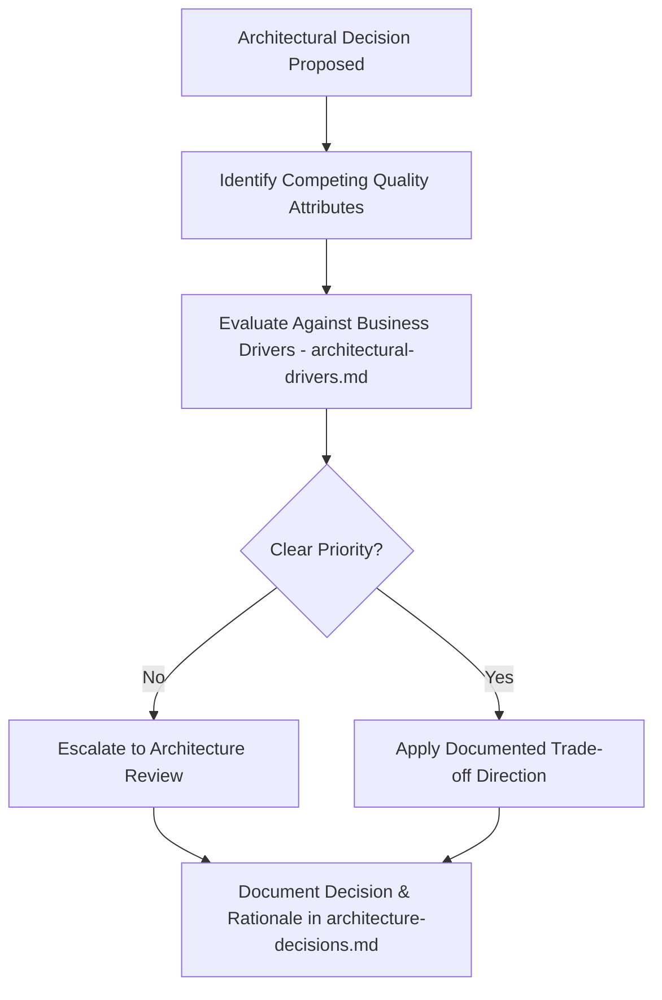
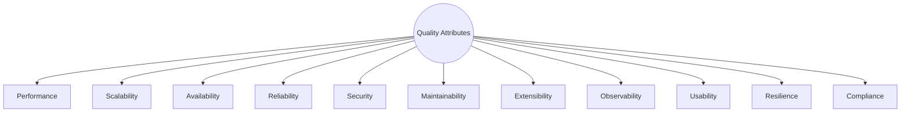
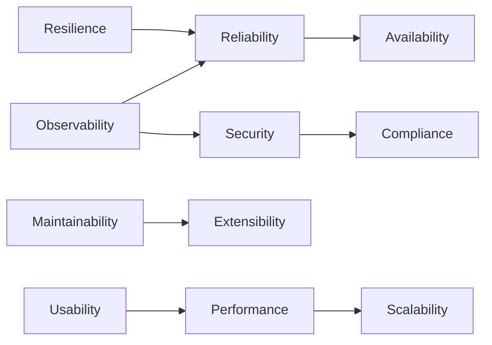
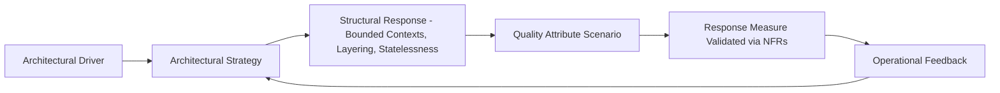

# Architecture Quality Attributes

## 1. Document Purpose

This document is the official Architecture Quality Attributes reference for **StackLeo Tech Store**. It explains *how* the architecture supports the quality attributes required by the business — bridging `01_Business` and `02_Product/non-functional-requirements.md` on one side, and the structural architecture documented across `03_System_Design` on the other.

This document deliberately does not restate the specific measurable targets defined in `02_Product/non-functional-requirements.md` (page load times, uptime percentages, and so on). Instead, it explains the architectural strategies — the structural choices, patterns, and design commitments — that make achieving those targets possible. Where a specific NFR target is relevant, it is referenced rather than duplicated.

This document is aligned with the ISO/IEC 25010 quality model and is implementation-independent. It describes architectural strategy and intent, not technology choices, API design, or code, all of which are addressed in dedicated technical documentation elsewhere in the repository.

## 2. Quality Attribute Philosophy

Quality attributes matter because they determine whether a functionally correct system is actually *fit for business purpose*. A checkout flow that works correctly but times out under load, or a catalog that displays accurate data but cannot be trusted with customer information, fails the business regardless of functional correctness.

- **Relationship with Business Goals** — every quality attribute prioritized here traces to a business driver in `architectural-drivers.md`; StackLeo does not pursue quality attributes as abstract engineering virtues, but as direct enablers of trust, growth, and operational reliability.
- **Relationship with Architectural Decisions** — quality attributes are achieved through deliberate structural choices (Sections 3–13), not through effort or care alone; the architecture must make the desired quality the *default* outcome, not a hoped-for one.
- **Trade-offs** — quality attributes frequently compete (Section 15); the architecture makes these trade-offs explicit and deliberate rather than accidental.

### 2.1 Quality Attribute Summary

| Attribute | ISO/IEC 25010 Characteristic | Primary Architectural Strategy | Business Alignment |
|---|---|---|---|
| Performance | Performance Efficiency | Critical-path isolation; asynchronous deferral of non-essential work | Conversion, customer trust (`architectural-drivers.md`, Section 5) |
| Scalability | Performance Efficiency, Compatibility | Statelessness; horizontal scaling; domain isolation | Business growth, marketplace expansion |
| Availability | Reliability | Failure domain isolation via bounded contexts | Trust-focused brand positioning |
| Reliability | Reliability | Explicit failure/recovery design per component | Operational stability |
| Security | Security | Security by design; defense in depth; least privilege | Customer trust (core differentiator) |
| Maintainability | Maintainability | Domain-aligned modularity; loose coupling; high cohesion | Sustainable long-term delivery |
| Extensibility | Maintainability, Compatibility | Additive domain extension over redesign | Future business models (corporate, marketplace, AI) |
| Observability | Maintainability, Reliability | Domain-scoped logging, metrics, tracing, health checks | Operational efficiency, incident response |
| Usability | Usability | Layered architecture decoupling experience from logic | Accessibility across target personas |
| Resilience | Reliability | Bounded retry; predictable failure handling; isolation | Continuity of core purchasing capability |
| Compliance | Security, Compliance | Data minimization; immutable audit trail | Bangladesh regulatory compliance, future markets |

## 3. Performance

Performance is achieved architecturally through separation of concerns that keeps expensive operations off the customer-facing critical path, and through design decisions that favor predictable, bounded response times over unbounded, best-effort ones.

- **Fast Page Response** — customer-facing presentation is architecturally separated from backend business logic (per `architecture-principles.md`, ARCH-003), allowing each to be optimized independently without coupling page rendering speed to backend processing complexity.
- **Search Responsiveness** — search is treated as its own bounded capability (per `bounded-contexts.md`) rather than a byproduct of catalog queries, allowing it to be optimized and scaled independently of catalog management operations.
- **Checkout Responsiveness** — the checkout flow's critical path is architecturally isolated from non-essential operations (e.g., analytics capture, notification dispatch), which are deferred to asynchronous, event-driven processing (per ARCH-013) so they cannot block the customer's transaction.
- **API Responsiveness** — API-first design (ARCH-011) ensures each capability exposes a well-scoped contract, avoiding overly broad operations that force clients to request more than they need.
- **Efficient Resource Utilization** — stateless service design (ARCH-012) allows resource allocation to track actual demand rather than being permanently reserved per customer session.
- **Future Growth** — performance strategy is designed to hold steady as catalog size, order volume, and marketplace seller count grow, through the scalability strategies described in Section 4.

## 4. Scalability

Scalability is addressed architecturally by ensuring the system's capacity model is additive rather than structural — growth is accommodated by adding resources and extending boundaries, not by redesigning them.

- **Horizontal Scaling** — statelessness (ARCH-012, ARCH-039) is the foundational architectural enabler, allowing additional instances to absorb increased load without special-casing.
- **Vertical Scaling** — reserved as a secondary, near-term lever (ARCH-008 in `architecture-principles.md`... see ARCH-008/ARCH-039 context) for components where horizontal scaling maturity is still developing.
- **Marketplace Growth** — the Marketplace bounded context (per `bounded-contexts.md`) is architecturally isolated from the core Catalog context, so seller-driven growth in listing volume does not degrade core B2C catalog performance.
- **Multi-Region Expansion** — stateless, horizontally scalable services provide the structural precondition for future multi-region deployment, addressed further in `deployment-architecture.md`.
- **Multi-Warehouse Support** — the Inventory domain's architecture accommodates multiple stock locations as a natural extension of its existing model, rather than requiring a new domain.
- **Increased Traffic** — load distribution principles (ARCH-039... see Section 8 of `architecture-principles.md`) ensure traffic is spread evenly, avoiding concentration that would otherwise require disproportionate over-provisioning.

## 5. Availability

Availability is architecturally supported by isolating failure domains so that a problem in one area of the system does not propagate into an outage of the whole platform.

- **High Availability Goals** — customer-facing capability is architected as the platform's highest-priority availability domain, consistent with its centrality to the trust-focused brand.
- **Failure Isolation** — bounded contexts (per `bounded-contexts.md`) provide natural failure isolation boundaries; a degraded Recommendation capability, for example, is architecturally incapable of taking down Checkout.
- **Graceful Degradation** — non-critical capability is architected as an enhancement layer over the core purchase flow (browse → cart → checkout → payment → order), so its failure degrades experience rather than blocking it, per ARCH-043.
- **Service Continuity** — critical-path services are designed for redundancy and failover as a default expectation, not an exceptional capability reserved for later.

## 6. Reliability

Reliability is achieved by designing every component with an explicit answer to "how does this behave when something goes wrong," per ARCH-045.

- **Fault Tolerance** — component boundaries are designed so an isolated failure remains isolated (ARCH-042), consistent with the bounded context model.
- **Recovery** — components are designed around bounded, sensible retry behavior for transient failures (ARCH-044), rather than either failing immediately or retrying indefinitely.
- **Data Consistency** — financially and operationally critical data (orders, payments, inventory) is architected for strong consistency, while less critical, read-heavy data (e.g., analytics) tolerates eventual consistency, consistent with the trade-off documented in `architectural-drivers.md` (Section 10).
- **Operational Stability** — the architecture favors well-understood, conventional patterns (ARCH-010, Convention over Configuration) over novel mechanisms whose failure modes are less well understood.

## 7. Security

Security is addressed as a structural property of the architecture, not a layer added after functional design, per ARCH-014.

- **Identity** — identity is modeled as a distinct, foundational bounded context (per `bounded-contexts.md`) that all other contexts depend on, rather than being duplicated or reimplemented per domain.
- **Authentication** — every capability boundary requires verified identity before context-specific authorization is even evaluated, consistent with Zero Trust thinking (ARCH-034).
- **Authorization** — the role and permission model defined in `02_Product/user-roles.md` is architecturally enforced at each meaningful component boundary, not only at the outermost entry point.
- **Least Privilege** — component-to-component interaction is scoped to the minimum access necessary for the interaction's purpose (ARCH-033).
- **Defense in Depth** — security relies on multiple independent architectural layers (identity, authorization, network boundary, data protection) so that no single control failure results in full compromise (ARCH-035).
- **Secure Communications** — all data in transit between architectural boundaries is protected by default, consistent with secure-by-default principles (ARCH-036).
- **Secure Storage** — sensitive data is architecturally isolated within the domain that legitimately owns it, minimizing unnecessary exposure across boundaries.
- **Auditability** — governed actions are architected to emit an immutable audit event as an inherent part of their execution, not as an optional afterthought (ARCH-037).

## 8. Maintainability

Maintainability is a direct consequence of the structural discipline enforced throughout `architecture-principles.md`.

- **Modular Architecture** — the system is decomposed along business-domain boundaries (per `bounded-contexts.md`), keeping each module's scope of change contained and comprehensible.
- **Loose Coupling** — components interact through minimal, intentional interfaces (ARCH-007), so a change within one component rarely forces change in another.
- **High Cohesion** — related behavior is grouped together (ARCH-006), reducing the cognitive load required to understand or modify a given capability.
- **Clear Boundaries** — the layered boundaries defined in `architecture-principles.md` (Section 5) prevent responsibility from leaking across Frontend, Backend, Database, and External Services.
- **Documentation** — architecture is documented before or alongside implementation (ARCH-021), keeping the system's structure comprehensible as it grows.
- **Testability** — clear boundaries and loose coupling directly enable isolated testing of each component without requiring the entire system to be instantiated.

## 9. Extensibility

Extensibility is designed in deliberately, since much of StackLeo's most significant future capability is deferred rather than absent.

- **Marketplace** — the Marketplace bounded context is designed from the outset to extend the existing Catalog and Order domains rather than duplicating them, per `bounded-contexts.md`.
- **AI** — AI-assisted capability (search relevance, recommendations, fraud detection) is architected as an additive layer over existing domains, consistent with event-driven readiness (ARCH-013).
- **Mobile** — API-first design (ARCH-011) ensures a future Mobile App consumes the same channel-independent contracts as Web, without requiring parallel business logic.
- **New Payment Providers** — payment capability is isolated behind an integration boundary (per `integration-architecture.md`), allowing providers to be added or replaced without affecting Checkout or Order domains.
- **New Couriers** — shipping capability is similarly isolated, consistent with StackLeo's existing multi-courier strategy, per `01_Business/shipping-policy.md`.
- **Corporate Sales** — the Corporate Sales domain extends existing Order and Pricing capability with additional business rules, rather than requiring a parallel purchasing system.

## 10. Observability

Observability is treated as an inherent architectural property: components are designed to reveal their own behavior, not merely to perform their function.

- **Logging** — significant business and operational events are emitted consistently across all bounded contexts, per ARCH-029.
- **Monitoring** — architectural boundaries double as natural monitoring boundaries, allowing health to be assessed per domain rather than only at the system's outer edge.
- **Metrics** — both technical (latency, error rate) and business (conversion, order success) metrics are treated as first-class architectural outputs, not incidental byproducts.
- **Tracing** — cross-domain transactions (e.g., checkout through order through shipping) are architected to be traceable end-to-end, supporting efficient root-cause analysis.
- **Health Checks** — each business-critical bounded context exposes a means of confirming its own operational health, independent of the health of unrelated contexts.
- **Alerting** — architectural boundaries inform alert scoping, so an issue can be attributed to the responsible domain rather than triggering ambiguous, system-wide alerts.

## 11. Usability

Usability is supported architecturally by ensuring the underlying structure does not constrain the experience layer's ability to be fast, accessible, and localized.

- **Accessibility** — presentation-layer separation (ARCH-003) ensures accessibility improvements can be made without requiring backend changes, keeping WCAG 2.2 AA compliance (per `non-functional-requirements.md`, Section 11) an achievable, ongoing commitment rather than a one-time retrofit.
- **Responsive Experience** — stateless, API-first backend design (ARCH-011, ARCH-012) ensures the same capability can be presented responsively across device types without duplicating business logic per form factor.
- **Localization** — content and configuration are architecturally externalized (ARCH-030) rather than embedded, supporting the future introduction of Bangla language and multi-currency support without structural rework.
- **User-Friendly Workflows** — the architecture's alignment with real business workflows (per `02_Product/business-workflows.md`) ensures the system's structure does not force customers through artificial, technically convenient but confusing steps.

## 12. Resilience

Resilience extends reliability (Section 6) by focusing specifically on how the architecture behaves under and recovers from adverse conditions.

- **Failure Handling** — every architectural boundary is designed to fail predictably and communicate failure clearly to its caller, rather than failing silently or ambiguously.
- **Retry Philosophy** — bounded, sensible retry behavior (ARCH-044) is applied at integration boundaries most prone to transient failure (payment gateway, courier services), per `integration-architecture.md`.
- **Isolation** — bounded contexts double as resilience boundaries: a failure within one domain is architecturally prevented from directly propagating into another (ARCH-042).
- **Recovery** — recovery expectations (per `non-functional-requirements.md`, NFR-019) are supported by architecture that separates transient, recoverable failure from failure requiring escalation or manual intervention.

## 13. Compliance

Compliance readiness is built into the architecture's data and audit model, rather than treated as a separate, bolt-on concern.

- **Data Privacy** — the architecture scopes data collection and access to the minimum necessary per domain (ARCH-015), directly supporting the privacy expectations defined in `01_Business/business-rules.md` (BR-128).
- **Auditability** — the immutable audit logging architecture (ARCH-037) provides the evidentiary foundation required for compliance review, dispute resolution, and regulatory inquiry.
- **Future Regulatory Changes** — clean domain boundaries and externalized configuration (ARCH-030) allow new market-specific compliance requirements (per `non-functional-requirements.md`, NFR-036) to be layered onto the existing architecture as StackLeo expands internationally.

## 14. Quality Attribute Scenarios

Each quality attribute is expressed as a structured scenario, following the classic Source–Stimulus–Environment–Artifact–Response–Response Measure format.

| Attribute | Source | Stimulus | Environment | Artifact | Response | Response Measure |
|---|---|---|---|---|---|---|
| Performance | Customer | Requests a product detail page | Normal production traffic | Catalog & Discovery bounded context | Page renders with current price and availability | Fast, consistent response per NFR-001, NFR-003 |
| Scalability | Marketing | Launches a flash sale driving a traffic surge | Peak promotional load | Commerce bounded context (Cart, Checkout) | Additional capacity absorbs load without degradation | No measurable increase in checkout latency, per NFR-010 |
| Availability | Courier Service | Experiences a temporary outage | Normal operation | Shipping capability, isolated via integration boundary | Core purchasing (browse, cart, checkout) remains available | Core purchase flow unaffected, per NFR-015 |
| Reliability | System | An isolated component fails mid-transaction | Normal or peak load | Order & Fulfillment bounded context | Failure is contained; no cascading impact on unrelated domains | No cross-domain incident traced to the isolated failure, per NFR-017 |
| Security | Malicious actor | Attempts unauthorized access to an administrative function | Any time | Identity & Access bounded context | Access is denied and the attempt is logged | Zero successful unauthorized access; event logged, per NFR-022, NFR-028 |
| Maintainability | Developer | Needs to modify Return policy logic | Development | Post-Purchase bounded context | Change is made within the Return module without affecting unrelated modules | Change isolated to Returns; no regression in Orders or Catalog |
| Extensibility | Product Team | Introduces the Marketplace capability | Phase 5 rollout | Marketplace bounded context | New capability extends existing Catalog/Order domains | No redesign required of existing B2C domains, per ARCH-002 |
| Observability | Operations | Investigates a reported checkout failure | Production incident | Commerce bounded context | Relevant logs, metrics, and traces are available end-to-end | Root cause identified within the recovery time expectations, per NFR-019, NFR-056 |
| Usability | Customer (Home User persona) | Attempts to complete a purchase with limited technical experience | Normal use, mobile device | Full customer-facing experience | Customer completes purchase without external guidance | High task completion rate, per NFR-042, NFR-045 |
| Resilience | Payment Gateway | Times out during a payment attempt | Peak or normal load | Payment integration boundary | System retries within bounds, then fails gracefully with clear customer messaging | Stock released, customer informed, no duplicate charge, per NFR-018 |
| Compliance | Auditor | Requests evidence of a specific administrative action | Any time | Administration bounded context (audit log) | Immutable, attributable log entry is retrievable | Complete, accurate audit trail produced, per NFR-028 |

## 15. Trade-offs

| Trade-off | Architectural Discussion | Current Direction |
|---|---|---|
| Performance vs. Cost | Maximum responsiveness under all conditions requires infrastructure investment beyond current validated need. | Architect to meet defined targets (`non-functional-requirements.md`, Section 5) without over-provisioning ahead of demand. |
| Security vs. Usability | Stricter controls (e.g., mandatory MFA for all customers) reduce risk but add friction to the core purchase flow. | Apply strict controls to administrative/sensitive actions; keep customer-facing friction proportionate to actual risk. |
| Availability vs. Consistency | Prioritizing availability during a partition can permit temporarily stale data; prioritizing consistency can reduce availability. | Favor consistency for orders, payments, and inventory; favor availability for lower-stakes, read-heavy capability (e.g., recommendations). |
| Flexibility vs. Simplicity | Building maximum flexibility (e.g., fully pluggable domains) ahead of need adds complexity without validated benefit. | Favor simplicity now (ARCH-023), preserving clean boundaries (ARCH-002, ARCH-041) so flexibility can be added later if justified. |

*Diagram: Trade-off Decision Flow.*

## 16. Governance

- **Ownership** — the Solution Architect owns this document and is accountable for ensuring architectural strategy remains aligned with the quality expectations defined in `02_Product/non-functional-requirements.md`.
- **Architecture Review** — quality attribute strategy is reviewed whenever a new bounded context, integration, or significant capability is introduced, confirming it does not compromise an existing quality commitment.
- **Continuous Evaluation** — quality attribute scenarios (Section 14) are revisited using real operational data once available post-launch, refining response measures based on observed system behavior rather than assumption alone.
- **Versioning** — this document follows the Semantic Versioning approach defined in `00_Project_Overview/changelog.md`; material changes are recorded there and cross-referenced in `architecture-decisions.md` where they stem from a specific decision.

*Diagram: Quality Attribute Map.*

*Diagram: Quality Attribute Relationships — arrows indicate a supporting or reinforcing relationship (e.g., strong Observability directly supports both Reliability and Security).*

*Diagram: Architecture Response Model.*

## 17. Document Information

| Property | Value |
|----------|-------|
| Document | quality-attributes.md |
| Version | 1.0.0 |
| Status | Active |
| Maintained By | StackLeo |
| Last Updated | 2026-07-17 |

---

© StackLeo. All Rights Reserved.
