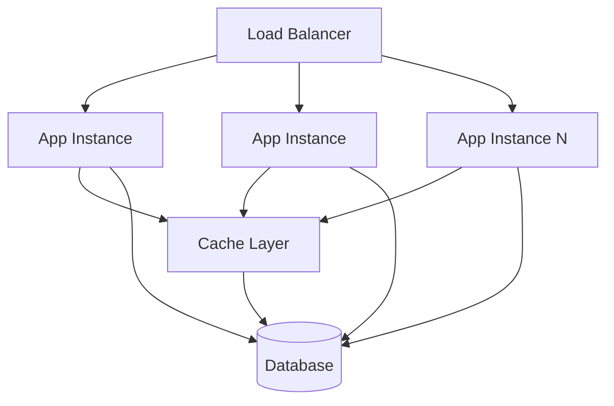
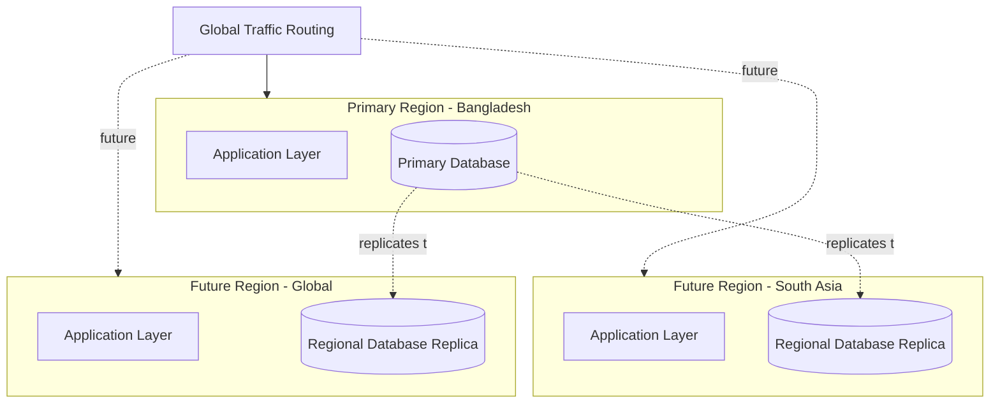
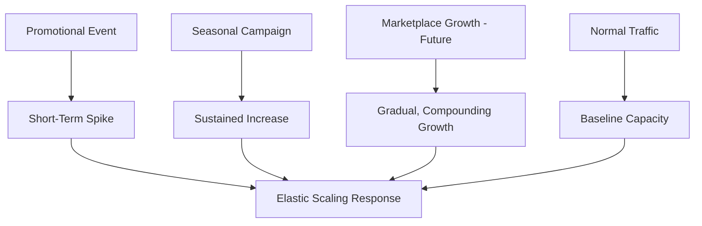

# Scalability Strategy

## 1. Document Purpose

This document is the official Scalability Strategy for **StackLeo Tech Store**. It explains how the platform can grow from a small, single-market deployment into an enterprise-scale, multi-channel commerce ecosystem, without requiring its foundational architecture to be redesigned.

- **What Scalability Means** — the architecture's ability to handle growing demand — more customers, more orders, more catalog breadth, more sellers — by adding capacity, not by fundamentally restructuring the system each time demand grows.
- **Vertical vs. Horizontal Scaling** — vertical scaling increases the capacity of a single instance (more resources per unit); horizontal scaling increases the number of instances sharing the load. StackLeo's architecture favors horizontal scaling as its primary strategy (Section 2), using vertical scaling only as a near-term, secondary lever.
- **Why Scalability Matters** — StackLeo's business plan explicitly anticipates growth through multiple distinct stages (Section 3), from MVP validation through enterprise and eventual regional expansion; scalability is what allows the architecture to serve each stage without a disruptive rebuild.

This document is implementation-independent. It does not define infrastructure configurations, cloud-vendor-specific services, or scripts — it describes the architectural strategy for scaling conceptually, consistent with the rest of `03_System_Design`.

## 2. Scalability Principles

- **Stateless Design** — services avoid holding client-specific state locally (ARCH-012, ARCH-039), allowing any instance to serve any request and enabling reliable horizontal scaling.
- **Loose Coupling** — components and services interact through minimal, well-defined interfaces (ARCH-007), allowing one part of the system to scale without forcing unrelated parts to scale in lockstep.
- **High Cohesion** — related capability is grouped together (ARCH-006), so scaling decisions can be made at a meaningful, business-aligned granularity rather than arbitrarily.
- **Elastic Capacity** — infrastructure capacity is added and removed in response to actual demand, consistent with `deployment-architecture.md` (Section 8).
- **Cloud-Native Readiness** — the architecture assumes elastic, on-demand infrastructure as the default operating model, not fixed, manually provisioned capacity.
- **Event-Driven Readiness** — asynchronous, event-based collaboration (ARCH-013) allows services to absorb load independently rather than propagating backpressure synchronously across the whole system.
- **Performance Efficiency** — scaling is paired with efficient resource use (NFR-072), avoiding the assumption that scaling problems can always be solved simply by adding more capacity.

## 3. Growth Stages

| Stage | Estimated User Volume | Business Characteristics | Scaling Priorities | Architectural Evolution | Key Risks |
|---|---|---|---|---|---|
| Startup Stage | Low, validating initial demand | Single-seller B2C MVP; Bangladesh only | Reliability and correctness over raw scale | Modular monolith (per `service-architecture.md`, Section 11) | Over-investing in scale before product-market fit is validated |
| Growth Stage | Moderate, steadily increasing | Validated B2C model; growing repeat purchase base | Consistent performance under normal and moderate peak load | Modular services extracted for highest-demand capability (Cart, Checkout, Payment) | Underinvesting in scaling readiness as growth accelerates |
| Expansion Stage | Higher, with distinct peak events | Corporate sales and multi-warehouse operations begin | Handling concentrated demand (flash sales) and operational complexity | Event-driven services for cross-domain coordination | Concentrated-demand events overwhelming under-scaled components |
| Enterprise Stage | High, sustained | Multi-vendor marketplace active; broader catalog and seller base | Independent scaling of high-growth domains (Catalog, Marketplace, Order) | Selective microservice extraction where justified (ARCH-041) | Marketplace-driven load unevenly affecting shared core capability |
| Global Stage | Very high, multi-market | Regional and international operation across South Asia and beyond | Geographic distribution and regional performance consistency | Multi-region deployment (Section 7) | Data residency, latency, and regional operational complexity |

*Diagram: Scalability Evolution Roadmap.*

## 4. Scaling Strategies

| Strategy | Description |
|---|---|
| Compute Scaling | Application and API layer capacity grows primarily through horizontal scaling (additional stateless instances), consistent with `deployment-architecture.md` (Section 8). |
| Storage Scaling | Object storage capacity scales elastically and independently of compute, since media and document growth is largely decoupled from transactional load. |
| Database Scaling | The primary relational store scales vertically in the near term, with read replication and selective polyglot persistence (per `technology-stack.md`, Section 4.3) considered as demand grows. |
| Cache Scaling | The caching layer scales horizontally to absorb growing read volume for catalog and other high-read, low-volatility data. |
| Search Scaling | The dedicated search platform (per `technology-stack.md`, Section 4.7) scales independently of the transactional database, avoiding search demand impacting checkout performance. |
| Queue Scaling | The future messaging/event capability (per `technology-stack.md`, Section 4.6) scales consumer capacity independently of producer volume, absorbing bursty event load. |
| CDN Strategy | Static and cacheable content is distributed via CDN, reducing origin load and latency for customers regardless of traffic volume. |
| Object Storage Strategy | Product media and documents are stored durably and elastically, with CDN-fronted delivery to avoid storage becoming a performance bottleneck. |

*Diagram: Horizontal Scaling Architecture.*

## 5. Performance Optimization

Performance optimization strategies remain conceptual, describing intent rather than specific technical mechanisms:

- **Caching** — frequently accessed, low-volatility data (e.g., published catalog content) is cached to avoid repeated expensive computation or database access.
- **Lazy Loading** — content and data not immediately required for the current view are deferred until genuinely needed, reducing unnecessary upfront load.
- **Pagination** — large result sets (e.g., catalog browsing, order history) are delivered incrementally rather than in full, bounding response size and time.
- **Compression** — content delivered to customers is compressed where beneficial, reducing transfer time, particularly relevant for the mobile-network conditions common in Bangladesh.
- **CDN** — cacheable content is served from locations close to the customer, reducing latency independent of origin server load.
- **Image Optimization** — product images are sized and formatted appropriately for their display context, avoiding unnecessary bandwidth and load time cost.
- **Read Optimization** — read-heavy paths (catalog browsing, search) are optimized independently of write-heavy paths (checkout, order creation), consistent with the differing consistency needs identified in `architectural-drivers.md` (Section 10).
- **Write Optimization** — write-heavy, critical paths (checkout, payment, inventory deduction) are kept lean and focused, deferring non-essential work to asynchronous processing (per `integration-architecture.md`, Section 6).

### Performance Optimization Matrix

| Optimization | Primary Benefit | Applies Most To |
|---|---|---|
| Caching | Reduced latency, reduced database load | Catalog browsing, product detail |
| Lazy Loading | Faster initial page load | Product detail pages, image-heavy views |
| Pagination | Bounded response size and time | Catalog listing, order history |
| Compression | Reduced transfer time | All customer-facing content, especially mobile |
| CDN | Reduced latency independent of origin load | Static assets, product images |
| Image Optimization | Reduced bandwidth and load time | Product catalog imagery |
| Read Optimization | Consistent browsing/search performance | Catalog, Search |
| Write Optimization | Fast, reliable checkout | Cart, Checkout, Order, Payment |

## 6. High Traffic Scenarios

| Scenario | Strategy |
|---|---|
| Flash Sales | Dedicated, pre-allocated stock pools (BR-096) prevent overselling; horizontal scaling absorbs concentrated demand; caching reduces repeated load on catalog data for the featured products. |
| Seasonal Campaigns | Capacity is planned ahead of known high-demand periods (per Section 8), informed by prior seasonal patterns once available. |
| Product Launches | Anticipated high-interest products are proactively cached and monitored more closely during launch windows. |
| Marketplace Growth (Future) | Marketplace-driven catalog and transaction growth is isolated from core B2C performance through the Marketplace Service boundary (`service-architecture.md`, SVC-029), consistent with NFR-011. |
| Corporate Orders (Future) | Bulk order processing is designed to avoid disproportionate impact on standard B2C checkout capacity, consistent with `non-functional-requirements.md` (NFR-006). |

## 7. Multi-Region Readiness

- **Geo Distribution** — the stateless, horizontally scalable service design (Section 2) is structured to be replicable across regions without redesign, per `deployment-architecture.md` (Section 8).
- **Regional Services** — services may be deployed closer to a given region's customer base to reduce latency, while remaining logically consistent with the single service architecture defined in `service-architecture.md`.
- **Regional Content** — localized content (language, currency, regional catalog variations) is supported through the externalized configuration approach defined in `architecture-principles.md` (ARCH-030), avoiding hard-coded, market-specific assumptions.
- **Disaster Recovery** — the multi-region readiness described here shares its architectural foundation with the disaster recovery capability defined in `deployment-architecture.md` (Section 10); a standby region can serve both purposes.
- **Global Expansion** — this readiness directly supports the South Asia → Global expansion described in `01_Business/vision.md` and `product-roadmap.md` (Phase 7), without requiring the core architecture to be redesigned when that expansion begins.

*Diagram: Multi-Region Expansion Strategy.*

## 8. Capacity Planning

- **Capacity Forecasting** — expected demand is estimated ahead of known growth drivers (seasonal campaigns, marketing pushes, roadmap phase transitions), informed over time by observed historical patterns.
- **Growth Monitoring** — actual usage and resource consumption are continuously monitored (per `observability.md`) and compared against forecasts to validate planning assumptions.
- **Resource Planning** — infrastructure capacity is planned proportionately to the current growth stage (Section 3), avoiding both under-provisioning (risking availability) and over-provisioning (wasting cost, per NFR-072).
- **Scaling Triggers** — defined thresholds (e.g., sustained CPU/memory utilization, request latency) trigger additional capacity, consistent with the auto-scaling readiness defined in `deployment-architecture.md` (Section 8).
- **Bottleneck Identification** — observability data (per `observability.md`) is used to identify which layer or service is genuinely constraining performance before capacity is added elsewhere, avoiding wasted scaling effort.

### Capacity Planning Matrix

| Growth Stage | Forecasting Approach | Primary Scaling Trigger | Bottleneck Focus |
|---|---|---|---|
| Startup Stage | Directional estimate based on business projections | Manual review, low automation | Application layer correctness over raw capacity |
| Growth Stage | Trend-based forecasting from early usage data | Sustained latency/error rate increase | Database read load, checkout responsiveness |
| Expansion Stage | Event-aware forecasting (campaigns, corporate demand) | Defined utilization thresholds | Concentrated-demand events, warehouse throughput |
| Enterprise Stage | Data-informed forecasting across domains | Automated scaling triggers | Marketplace-driven catalog and order growth |
| Global Stage | Region-specific forecasting | Regional utilization and latency thresholds | Cross-region latency and data replication |

*Diagram: Capacity Growth Timeline.*

*Diagram: Traffic Growth Model.*

### Scaling Risks

| Risk | Description | Mitigation Direction |
|---|---|---|
| Premature Over-Scaling | Investing in enterprise-scale capacity before demand justifies it. | Scale proportionately to the current growth stage (Section 3), per ARCH-023. |
| Under-Provisioned Flash Sales | Concentrated demand exceeding available capacity during a promotional event. | Pre-plan capacity ahead of known high-demand events (Section 6). |
| Database Bottleneck | The primary relational store becoming a scaling constraint before other layers. | Monitor database-specific metrics closely; plan read scaling and polyglot persistence ahead of need. |
| Marketplace Load Bleed (Future) | Marketplace-driven demand degrading core B2C performance. | Maintain the Marketplace Service boundary isolation defined in `service-architecture.md`. |
| Cross-Region Latency (Future) | Multi-region operation introducing unacceptable latency or consistency trade-offs. | Apply the consistency-vs-availability trade-off guidance in `architectural-drivers.md` (Section 10) deliberately per data type. |
| Cost Overrun | Elastic scaling growing operational cost faster than revenue. | Apply capacity planning discipline (Section 8) and periodic cost-to-scale review. |

## 9. Governance

- **Performance Reviews** — performance against the targets in `non-functional-requirements.md` (Section 5) is reviewed regularly, particularly following any significant traffic event.
- **Capacity Reviews** — capacity planning assumptions (Section 8) are reviewed against actual observed growth at the conclusion of each phase defined in `02_Product/product-roadmap.md`.
- **Architecture Reviews** — scaling-related architectural decisions are reviewed against `architecture-principles.md` and `quality-attributes.md` before adoption, consistent with the governance process defined in `03_System_Design/README.md`.
- **Scaling Roadmap** — this document's growth stage model (Section 3) is maintained as a living roadmap, updated as the business's actual growth trajectory becomes clearer.

## 10. Future Evolution

| Future Direction | Scalability Strategy Readiness |
|---|---|
| AI Workloads | AI Recommendation and Fraud Detection capability (per `service-architecture.md`, SVC-031) scale independently of core transactional capacity, consistent with domain isolation (ARCH-040). |
| Marketplace | Marketplace-driven growth is isolated from core B2C scaling concerns through service boundary isolation (Section 6), consistent with `product-modules.md` (Section 11). |
| Real-Time Analytics | Analytics scaling is decoupled from transactional scaling, consistent with the eventual-consistency tolerance defined in `architectural-drivers.md` (Section 10). |
| Multi-Cloud | Cloud-provider neutrality (per `deployment-architecture.md`, Section 1) preserves the option to distribute capacity across more than one provider if warranted. |
| Edge Computing | The existing CDN-based strategy (Section 4) provides a foundation for extending toward edge compute for latency-sensitive future capability. |

## 11. Document Information

| Property | Value |
|----------|-------|
| Document | scalability-strategy.md |
| Version | 1.0.0 |
| Status | Active |
| Maintained By | StackLeo |
| Last Updated | 2026-07-17 |

---

© StackLeo. All Rights Reserved.
