# Sequence Diagrams

## 1. Document Purpose

This document is the official UML Sequence Diagram catalog for **StackLeo Tech Store**. It explains how actors, UI surfaces, services, and external systems interact over time to accomplish business processes, using Mermaid `sequenceDiagram` syntax.

- **What Sequence Diagrams Are** — a UML view showing the time-ordered exchange of messages between participants for a specific scenario, complementing the static structural views in `component-architecture.md` and `service-architecture.md`.
- **Why They Are Useful** — they make the concrete, step-by-step collaboration behind a business process explicit, including where decisions branch and where failure paths diverge, in a way structural diagrams cannot.
- **Relationship with Components** — participants in these diagrams are drawn from the Presentation and Application-layer components defined in `component-architecture.md`.
- **Relationship with Services** — the service-level participants and their interactions are drawn directly from `service-architecture.md` (Section 4), including the events each service consumes and publishes.
- **Relationship with Data Flow** — each diagram represents the sequenced, time-ordered realization of a data flow documented conceptually in `data-flow.md` (Section 5).

This document is implementation-independent. It does not define APIs, database structure, or code — diagrams describe conceptual message exchange, not technical protocol or payload detail.

## 2. Sequence Diagram Guidelines

- **Participants** — represent an Actor (Guest, Customer, Admin), a UI surface (Storefront Web, Admin Portal), a Service (per `service-architecture.md`), or an External System (per `integration-architecture.md`).
- **Lifelines** — the vertical line representing a participant's presence throughout the scenario's timeline.
- **Messages** — solid arrows represent requests; dashed arrows represent responses, consistent with standard UML sequence diagram convention.
- **Activations** — implied by message exchange; not explicitly rendered as separate bars in this document's diagrams, for readability at this business-focused level of detail.
- **Decisions** — represented using Mermaid `alt`/`else` blocks where a scenario meaningfully branches.
- **Alternate Flows** — represented using `alt`/`opt` blocks, consistent with the Alternative Flow concept defined in `use-cases.md` (Section 2).
- **Error Handling** — represented as an `else` branch or a dedicated diagram (Section 13), consistent with the Exception Flow concept defined in `use-cases.md`.

## 3. Authentication Flows

### 3.1 User Registration

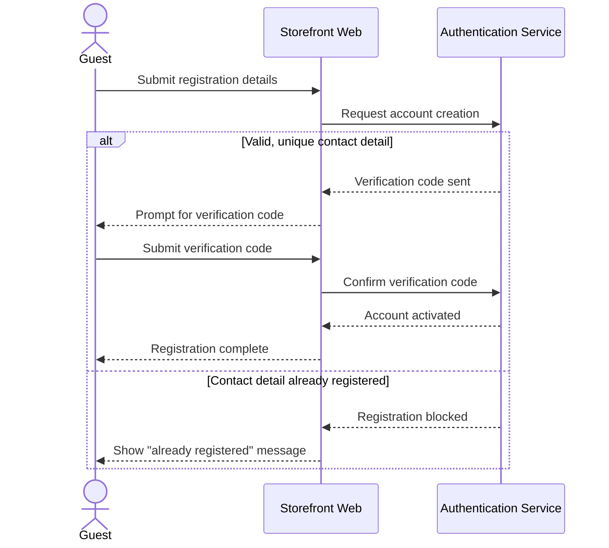

### 3.2 User Login

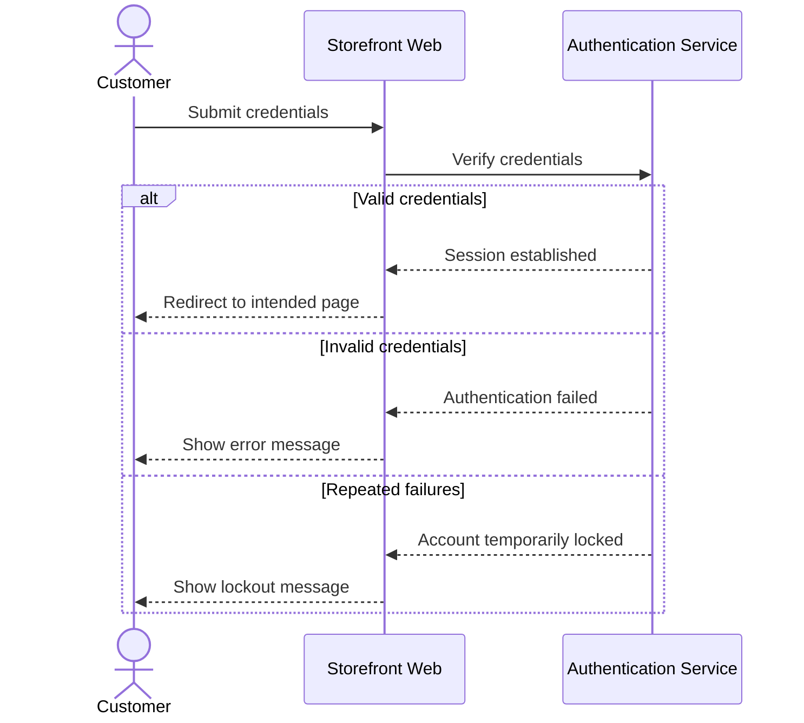

### 3.3 Password Reset

```mermaid
sequenceDiagram
    actor Customer
    participant UI as Storefront Web
    participant Auth as Authentication Service
    participant EmailSvc as Email Provider
    Customer->>UI: Request password reset
    UI->>Auth: Initiate reset for contact detail
    Auth->>EmailSvc: Send reset link/code
    EmailSvc-->>Customer: Deliver reset communication
    Customer->>UI: Submit new password with reset code
    UI->>Auth: Validate reset code and apply new password
    alt Valid reset code
        Auth-->>UI: Password updated
        UI-->>Customer: Confirm success; prompt login
    else Expired or invalid code
        Auth-->>UI: Reset failed
        UI-->>Customer: Show error; offer new reset request
    end
```

### 3.4 Logout

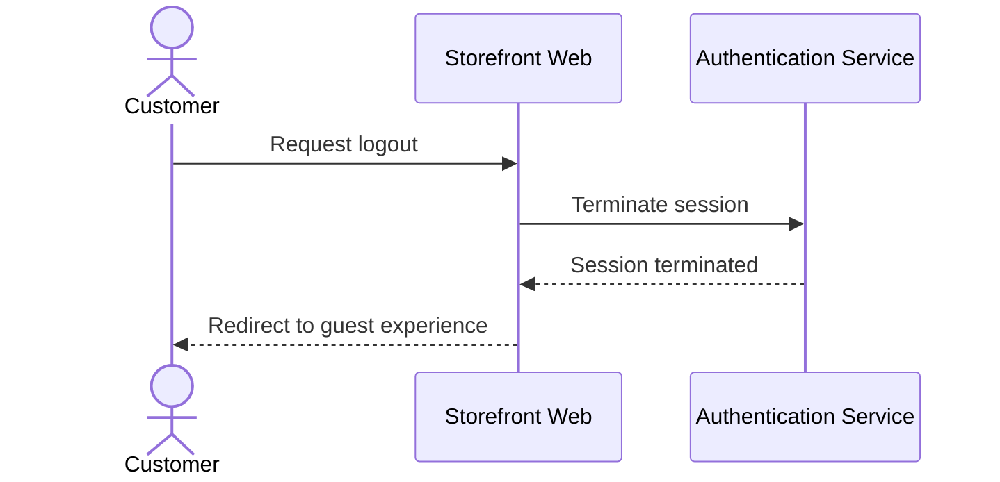

## 4. Shopping Flows

### 4.1 Browse Products

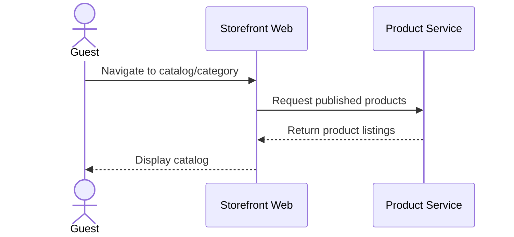

### 4.2 Search Products

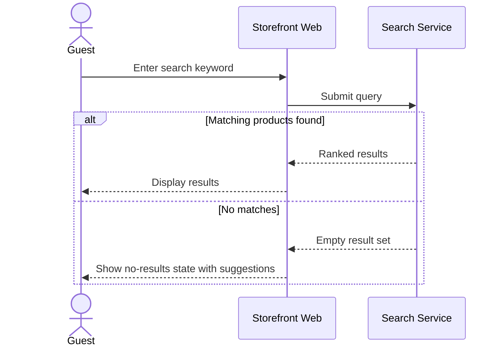

### 4.3 Filter Products

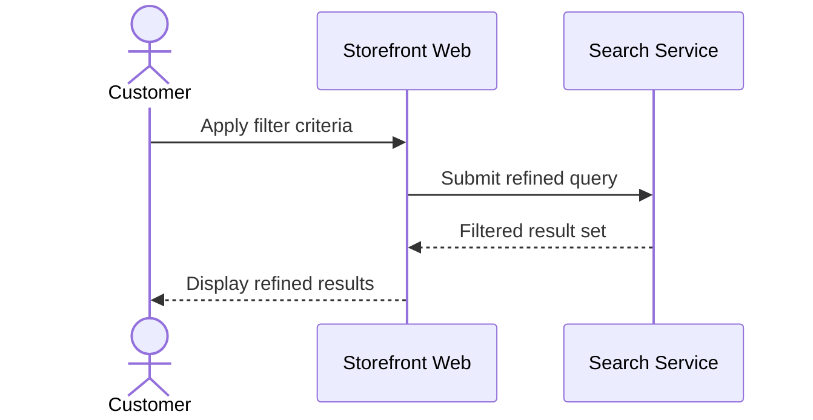

### 4.4 Wishlist

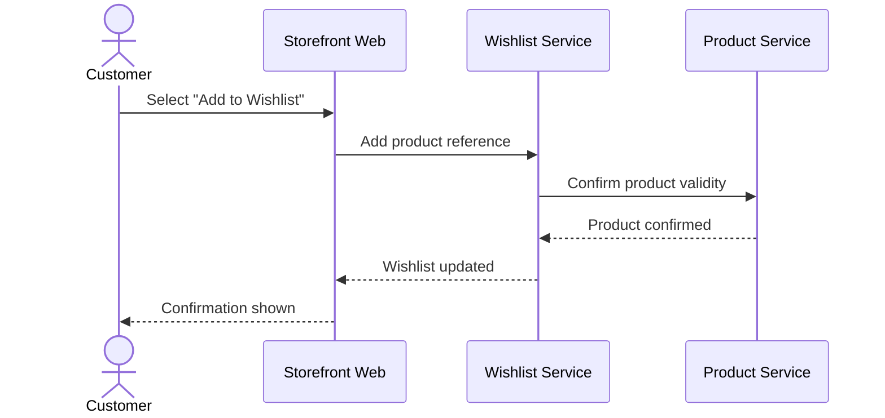

### 4.5 Product Comparison

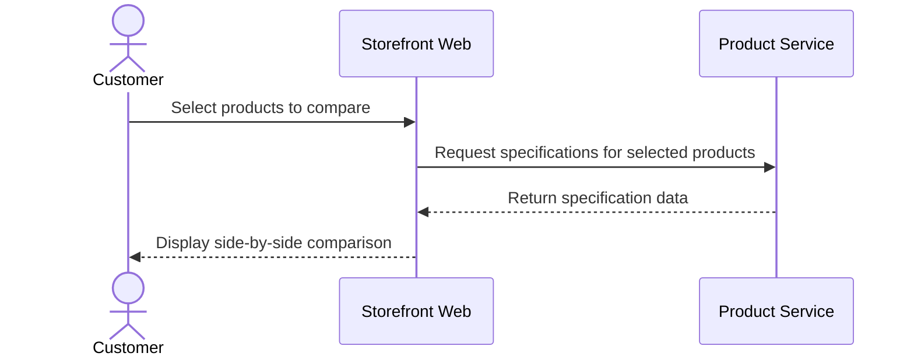

## 5. Cart Flows

### 5.1 Add to Cart

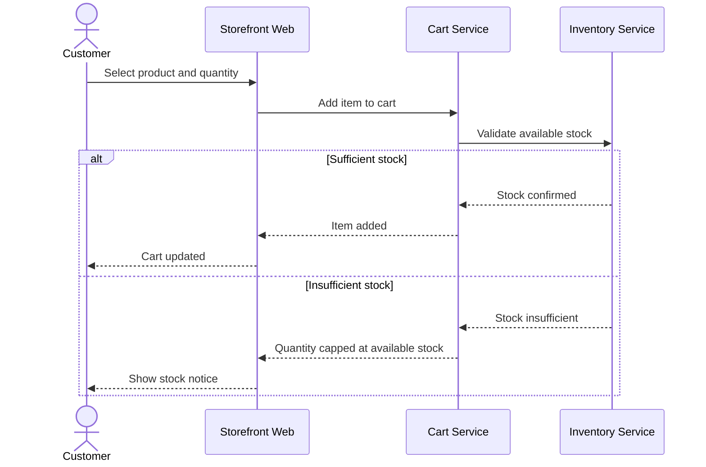

### 5.2 Update Cart

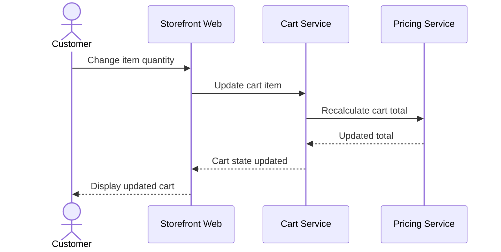

### 5.3 Remove from Cart

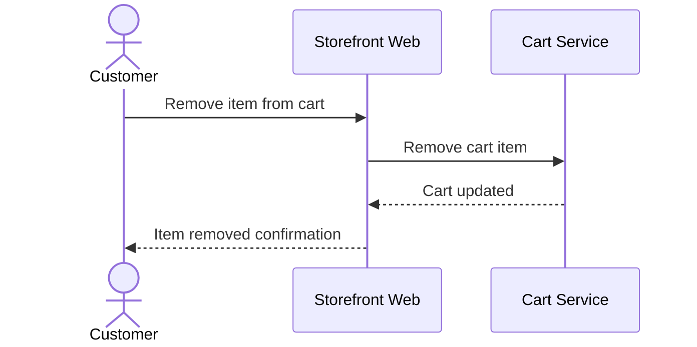

### 5.4 Apply Coupon

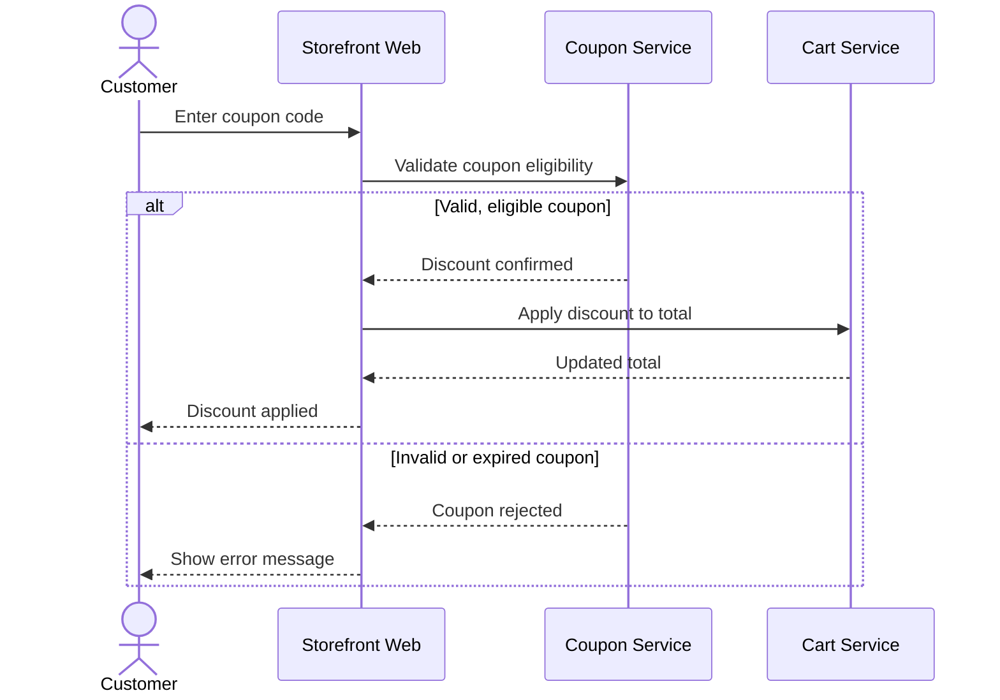

## 6. Checkout Flows

### 6.1 Checkout

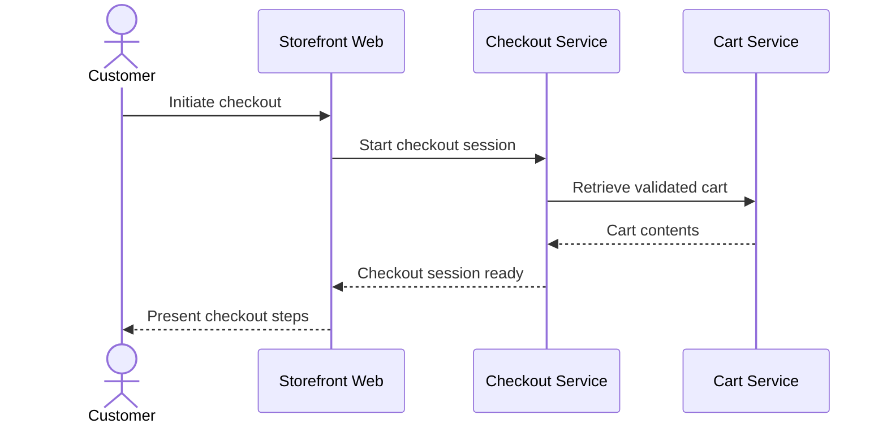

### 6.2 Address Selection

```mermaid
sequenceDiagram
    actor Customer
    participant UI as Storefront Web
    participant Checkout as Checkout Service
    participant UserProfile as User Profile Service
    Customer->>UI: Select or enter delivery address
    UI->>UserProfile: Retrieve/save address
    UserProfile-->>UI: Address confirmed
    UI->>Checkout: Set delivery address
    alt Address within serviceable area
        Checkout-->>UI: Address accepted
    else Address outside serviceable area
        Checkout-->>UI: Address rejected; suggest store pickup
    end
    UI-->>Customer: Show outcome
```

### 6.3 Shipping Selection

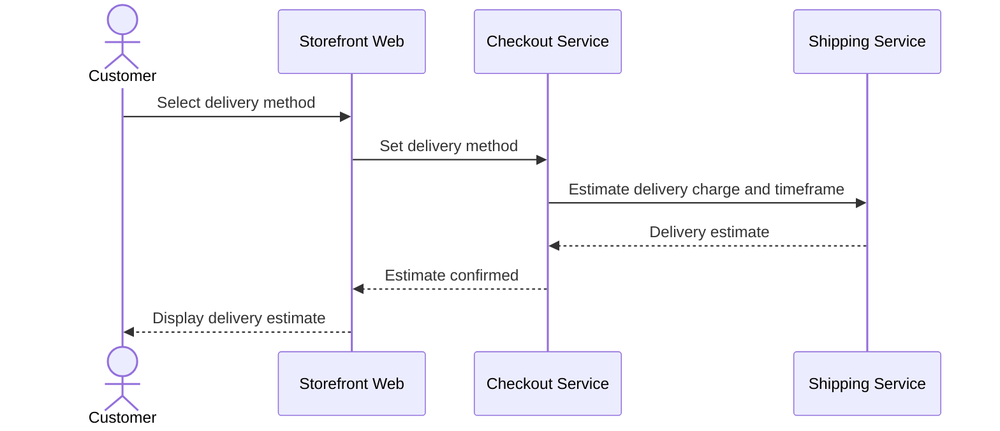

### 6.4 Payment Initialization

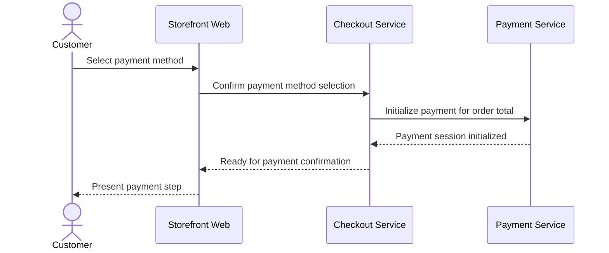

### 6.5 Payment Success

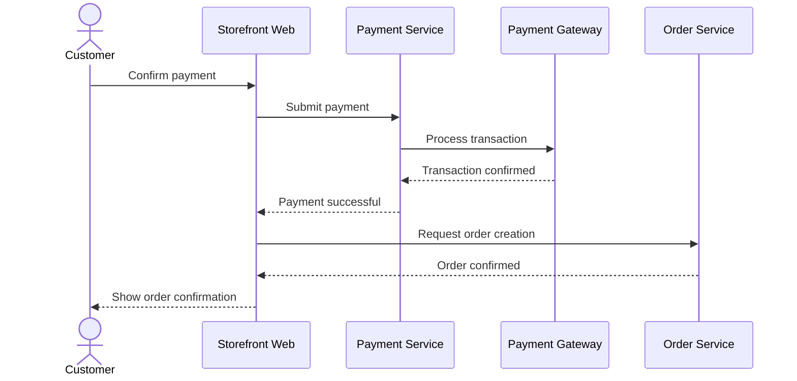

### 6.6 Payment Failure

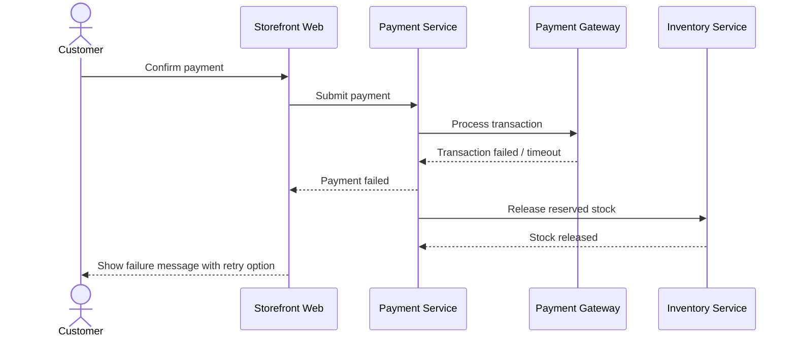

## 7. Order Flows

### 7.1 Order Creation

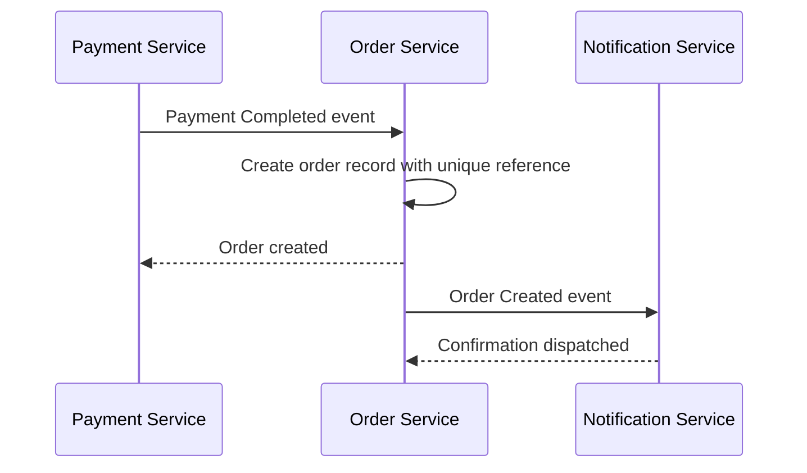

### 7.2 Invoice Generation

```mermaid
sequenceDiagram
    participant Order as Order Service
    participant Invoice as Invoice Service
    actor Customer
    participant UI as Storefront Web
    Order->>Invoice: Order Created event
    Invoice->>Invoice: Compile compliant invoice
    Invoice-->>Order: Invoice available
    Customer->>UI: Request invoice download
    UI->>Invoice: Retrieve invoice
    Invoice-->>UI: Invoice document
    UI-->>Customer: Deliver invoice
```

### 7.3 Inventory Allocation

```mermaid
sequenceDiagram
    participant Order as Order Service
    participant Inventory as Inventory Service
    Order->>Inventory: Order Created event
    Inventory->>Inventory: Deduct stock for ordered items
    alt Stock deduction successful
        Inventory-->>Order: Stock allocated
    else Stock discrepancy detected
        Inventory-->>Order: Allocation exception raised
        Order->>Order: Flag order for manual review
    end
```

### 7.4 Order Confirmation

```mermaid
sequenceDiagram
    participant Order as Order Service
    participant Notification as Notification Service
    participant EmailSvc as Email Provider
    participant SMSSvc as SMS Provider
    actor Customer
    Order->>Notification: Order Created event
    Notification->>EmailSvc: Send confirmation email
    Notification->>SMSSvc: Send confirmation SMS
    EmailSvc-->>Customer: Email delivered
    SMSSvc-->>Customer: SMS delivered
```

### 7.5 Order Cancellation

```mermaid
sequenceDiagram
    actor Customer
    participant UI as Storefront Web
    participant Order as Order Service
    participant Inventory as Inventory Service
    participant Payment as Payment Service
    Customer->>UI: Request order cancellation
    UI->>Order: Submit cancellation request
    alt Order not yet shipped
        Order->>Inventory: Release reserved stock
        Order->>Payment: Trigger refund if paid
        Order-->>UI: Order cancelled
        UI-->>Customer: Cancellation confirmed
    else Order already shipped
        Order-->>UI: Cancellation not permitted
        UI-->>Customer: Redirect to return process
    end
```

## 8. Shipping Flows

### 8.1 Shipment Creation

```mermaid
sequenceDiagram
    participant Order as Order Service
    participant Warehouse as Warehouse Service
    participant Shipping as Shipping Service
    Order->>Warehouse: Order Created event
    Warehouse->>Warehouse: Pick and pack order
    Warehouse-->>Shipping: Order packed
    Shipping->>Shipping: Create shipment record
    Shipping-->>Order: Shipment created
```

### 8.2 Courier Assignment

```mermaid
sequenceDiagram
    participant Shipping as Shipping Service
    participant Courier as Courier Service
    Shipping->>Shipping: Evaluate delivery zone and courier availability
    Shipping->>Courier: Request delivery assignment
    alt Courier accepts assignment
        Courier-->>Shipping: Assignment confirmed
    else Preferred courier unavailable
        Shipping->>Shipping: Select fallback courier
        Shipping->>Courier: Reassign delivery request
        Courier-->>Shipping: Fallback assignment confirmed
    end
```

### 8.3 Delivery Tracking

```mermaid
sequenceDiagram
    participant Courier as Courier Service
    participant Tracking as Delivery Tracking Service
    actor Customer
    participant UI as Storefront Web
    Courier->>Tracking: Status update (In Transit / Out for Delivery)
    Tracking->>Tracking: Update delivery status lifecycle
    Customer->>UI: View order tracking
    UI->>Tracking: Request current status
    Tracking-->>UI: Current delivery status
    UI-->>Customer: Display status
```

### 8.4 Order Delivered

```mermaid
sequenceDiagram
    participant Courier as Courier Service
    participant Tracking as Delivery Tracking Service
    participant Order as Order Service
    participant Notification as Notification Service
    Courier->>Tracking: Delivery confirmed
    Tracking->>Order: Order Delivered event
    Order->>Order: Update order status to Delivered/Completed
    Order->>Notification: Notify customer of delivery
```

## 9. Customer Service Flows

### 9.1 Review Submission

```mermaid
sequenceDiagram
    actor Customer
    participant UI as Storefront Web
    participant Review as Review Service
    participant Order as Order Service
    Customer->>UI: Submit product review
    UI->>Review: Submit rating and feedback
    Review->>Order: Verify completed purchase
    alt Verified purchase
        Order-->>Review: Purchase confirmed
        Review->>Review: Route to moderation
        Review-->>UI: Review pending moderation
    else No verified purchase
        Order-->>Review: No matching purchase
        Review-->>UI: Submission rejected
    end
    UI-->>Customer: Show outcome
```

### 9.2 Return Request

```mermaid
sequenceDiagram
    actor Customer
    participant UI as Storefront Web
    participant Support as Customer Support Service
    participant Order as Order Service
    Customer->>UI: Submit return request
    UI->>Support: Create return request
    Support->>Order: Validate return window eligibility
    alt Within return window
        Order-->>Support: Eligible
        Support-->>UI: Return request accepted; pending inspection
    else Return window expired
        Order-->>Support: Not eligible
        Support-->>UI: Return request rejected
    end
    UI-->>Customer: Show outcome
```

### 9.3 Refund Request

```mermaid
sequenceDiagram
    participant Support as Customer Support Service
    participant Payment as Payment Service
    participant Gateway as Payment Gateway
    actor Customer
    Support->>Payment: Return Approved event
    Payment->>Payment: Calculate refund amount
    Payment->>Gateway: Process refund
    alt Refund to original method succeeds
        Gateway-->>Payment: Refund confirmed
    else Original method cannot be credited
        Payment->>Payment: Reroute to bank transfer/mobile banking
    end
    Payment-->>Customer: Refund completed notification
```

### 9.4 Warranty Claim

```mermaid
sequenceDiagram
    actor Customer
    participant UI as Storefront Web
    participant Support as Customer Support Service
    participant Order as Order Service
    Customer->>UI: Submit warranty claim
    UI->>Support: Create warranty claim
    Support->>Order: Verify warranty coverage period
    alt Within warranty period
        Order-->>Support: Coverage confirmed
        Support-->>UI: Claim accepted; pending inspection
    else Outside warranty period or excluded cause
        Order-->>Support: Not covered
        Support-->>UI: Claim likely rejected; documented reason
    end
    UI-->>Customer: Show outcome
```

### 9.5 Support Ticket

```mermaid
sequenceDiagram
    actor Customer
    participant UI as Storefront Web
    participant Support as Customer Support Service
    Customer->>UI: Submit general inquiry
    UI->>Support: Create support case
    Support->>Support: Investigate and respond
    alt Resolved within standard policy
        Support-->>UI: Resolution provided
    else Requires escalation
        Support->>Support: Escalate to Finance/Admin
        Support-->>UI: Escalated; awaiting resolution
    end
    UI-->>Customer: Show case status
```

## 10. Notification Flows

### 10.1 Email Notification

```mermaid
sequenceDiagram
    participant SourceSvc as Triggering Service (e.g., Order Service)
    participant Notification as Notification Service
    participant EmailSvc as Email Provider
    actor Customer
    SourceSvc->>Notification: Business event occurs
    Notification->>Notification: Check customer channel preferences
    alt Email permitted
        Notification->>EmailSvc: Dispatch email
        EmailSvc-->>Customer: Email delivered
        EmailSvc-->>Notification: Delivery status
    else Email not permitted (marketing opt-out)
        Notification->>Notification: Suppress marketing email
    end
```

### 10.2 SMS Notification

```mermaid
sequenceDiagram
    participant SourceSvc as Triggering Service (e.g., Shipping Service)
    participant Notification as Notification Service
    participant SMSSvc as SMS Provider
    actor Customer
    SourceSvc->>Notification: Time-sensitive event occurs
    Notification->>SMSSvc: Dispatch SMS
    SMSSvc-->>Customer: SMS delivered
    SMSSvc-->>Notification: Delivery status
```

### 10.3 Push Notification (Future)

```mermaid
sequenceDiagram
    participant SourceSvc as Triggering Service
    participant Notification as Notification Service
    participant PushSvc as Push Notification Service - Future
    actor Customer
    participant MobileApp as Mobile App - Future
    SourceSvc->>Notification: Business event occurs
    Notification->>PushSvc: Dispatch push notification
    PushSvc-->>MobileApp: Notification delivered
    MobileApp-->>Customer: Notification displayed
```

## 11. Administration Flows

### 11.1 Product Management

```mermaid
sequenceDiagram
    actor ProductManager as Product Manager
    participant Admin as Admin Portal
    participant Product as Product Service
    participant AdminSvc as Admin Service
    ProductManager->>Admin: Create/edit product listing
    Admin->>Product: Submit product data
    Product->>Product: Validate mandatory fields
    Product-->>Admin: Saved as Draft
    ProductManager->>Admin: Submit for publish approval
    Admin->>AdminSvc: Request publish approval
    alt Approved
        AdminSvc-->>Product: Approve publish
        Product-->>Admin: Product published
    else Rejected
        AdminSvc-->>Admin: Returned with feedback
    end
```

### 11.2 Inventory Update

```mermaid
sequenceDiagram
    actor InventoryManager as Inventory Manager
    participant Admin as Admin Portal
    participant Inventory as Inventory Service
    participant AdminSvc as Admin Service
    InventoryManager->>Admin: Submit stock adjustment with reason
    Admin->>Inventory: Apply adjustment
    alt Within authorization threshold
        Inventory-->>Admin: Adjustment applied
    else Exceeds threshold
        Inventory->>AdminSvc: Request Admin authorization
        AdminSvc-->>Inventory: Authorization decision
        Inventory-->>Admin: Adjustment applied or rejected
    end
```

### 11.3 Order Approval

```mermaid
sequenceDiagram
    actor Admin
    participant AdminPortal as Admin Portal
    participant Order as Order Service
    participant AdminSvc as Admin Service
    Admin->>AdminPortal: Review flagged order exception
    AdminPortal->>Order: Retrieve order details
    Order-->>AdminPortal: Order state and history
    Admin->>AdminPortal: Approve or reject exception
    AdminPortal->>AdminSvc: Record decision
    AdminSvc->>Order: Apply approved resolution
    Order-->>AdminPortal: Order updated
```

### 11.4 Report Generation

```mermaid
sequenceDiagram
    actor FinanceOfficer as Finance Officer
    participant AdminPortal as Admin Portal
    participant Reporting as Reporting Service
    FinanceOfficer->>AdminPortal: Select report type and period
    AdminPortal->>Reporting: Request report
    Reporting->>Reporting: Compile data from Order, Inventory, Finance sources
    alt Data complete for period
        Reporting-->>AdminPortal: Report generated
    else Data incomplete for part of period
        Reporting-->>AdminPortal: Report generated with data-gap notice
    end
    AdminPortal-->>FinanceOfficer: Display report
```

## 12. Future Flows

### 12.1 Marketplace Purchase (Future)

```mermaid
sequenceDiagram
    actor Customer
    participant UI as Storefront Web
    participant Order as Order Service
    participant Marketplace as Marketplace Service - Future
    participant Seller as Marketplace Seller - Future
    Customer->>UI: Purchase marketplace-listed product
    UI->>Order: Create order
    Order->>Marketplace: Route order to seller
    Marketplace->>Seller: Notify of new order
    Seller-->>Marketplace: Fulfillment confirmation
    Marketplace-->>Order: Fulfillment status
    Order-->>UI: Order status updated
```

### 12.2 Corporate Sales (Future)

```mermaid
sequenceDiagram
    actor CorporateBuyer as Corporate Buyer - Future
    participant Portal as Corporate Portal - Future
    participant CorporateSales as Corporate Sales Service - Future
    participant Order as Order Service
    CorporateBuyer->>Portal: Submit bulk order request
    Portal->>CorporateSales: Validate against negotiated terms
    alt Within agreed terms and stock
        CorporateSales->>Order: Create corporate order
        Order-->>CorporateSales: Order confirmed
        CorporateSales-->>Portal: Order and invoice issued
    else Exceeds terms or stock
        CorporateSales-->>Portal: Request adjustment
    end
    Portal-->>CorporateBuyer: Show outcome
```

### 12.3 AI Recommendation (Future)

```mermaid
sequenceDiagram
    actor Customer
    participant UI as Storefront Web
    participant AIRec as AI Recommendation Service - Future
    participant Product as Product Service
    Customer->>UI: Browse catalog/product page
    UI->>AIRec: Request personalized recommendations
    AIRec->>Product: Retrieve catalog-relevant candidates
    Product-->>AIRec: Candidate products
    alt Sufficient behavioral confidence
        AIRec-->>UI: Personalized recommendations
    else Insufficient personal data
        AIRec-->>UI: Category-popularity fallback recommendations
    end
    UI-->>Customer: Display recommendations
```

### 12.4 POS Order (Future)

```mermaid
sequenceDiagram
    actor Customer
    participant POSTerminal as POS Terminal - Future
    participant POS as POS Integration Service - Future
    participant Inventory as Inventory Service
    participant Order as Order Service
    Customer->>POSTerminal: Complete in-store purchase
    POSTerminal->>POS: Submit transaction
    POS->>Inventory: Deduct stock
    Inventory-->>POS: Stock updated
    POS->>Order: Create order record
    Order-->>POS: Order recorded
    POS-->>POSTerminal: Transaction complete
```

## 13. Error Handling

### 13.1 Payment Failure

```mermaid
sequenceDiagram
    participant Payment as Payment Service
    participant Gateway as Payment Gateway
    participant Inventory as Inventory Service
    actor Customer
    Payment->>Gateway: Submit transaction
    Gateway-->>Payment: Failure / timeout
    Payment->>Inventory: Release reserved stock
    Payment-->>Customer: Payment failed; retry offered
```

### 13.2 Inventory Shortage

```mermaid
sequenceDiagram
    participant Checkout as Checkout Service
    participant Inventory as Inventory Service
    actor Customer
    Checkout->>Inventory: Final stock validation
    Inventory-->>Checkout: Insufficient stock detected
    Checkout-->>Customer: Order blocked; item unavailable notice
```

### 13.3 Courier Failure

```mermaid
sequenceDiagram
    participant Shipping as Shipping Service
    participant Courier as Courier Service
    Shipping->>Courier: Delivery attempt
    Courier-->>Shipping: Failed delivery attempt reported
    Shipping->>Shipping: Log failed attempt
    alt Attempts remaining
        Shipping->>Courier: Schedule re-delivery
    else Attempts exhausted
        Shipping->>Shipping: Return to warehouse
        Shipping->>Shipping: Notify customer
    end
```

### 13.4 Notification Failure

```mermaid
sequenceDiagram
    participant Notification as Notification Service
    participant EmailSvc as Email Provider
    participant Order as Order Service
    Notification->>EmailSvc: Dispatch notification
    EmailSvc-->>Notification: Delivery failed
    Notification->>Notification: Log failure (non-blocking)
    Notification--)Order: Order state remains authoritative regardless
```

## 14. Sequence Catalog

| Section | Flow | Diagram Reference |
|---|---|---|
| Authentication | User Registration, User Login, Password Reset, Logout | Section 3 |
| Shopping | Browse Products, Search Products, Filter Products, Wishlist, Product Comparison | Section 4 |
| Cart | Add to Cart, Update Cart, Remove from Cart, Apply Coupon | Section 5 |
| Checkout | Checkout, Address Selection, Shipping Selection, Payment Initialization, Payment Success, Payment Failure | Section 6 |
| Order | Order Creation, Invoice Generation, Inventory Allocation, Order Confirmation, Order Cancellation | Section 7 |
| Shipping | Shipment Creation, Courier Assignment, Delivery Tracking, Order Delivered | Section 8 |
| Customer Service | Review Submission, Return Request, Refund Request, Warranty Claim, Support Ticket | Section 9 |
| Notification | Email Notification, SMS Notification, Push Notification (Future) | Section 10 |
| Administration | Product Management, Inventory Update, Order Approval, Report Generation | Section 11 |
| Future | Marketplace Purchase, Corporate Sales, AI Recommendation, POS Order | Section 12 |
| Error Handling | Payment Failure, Inventory Shortage, Courier Failure, Notification Failure | Section 13 |

**Total Sequence Diagrams: 48** (44 business flow diagrams across Sections 3–12, plus 4 dedicated error-handling diagrams in Section 13.)

### Participants

| Participant Type | Examples |
|---|---|
| Actors | Guest, Customer, Admin, Product Manager, Inventory Manager, Finance Officer, Corporate Buyer (Future) |
| UI Surfaces | Storefront Web, Admin Portal, Mobile App (Future), POS Terminal (Future) |
| Services | Authentication, Cart, Checkout, Payment, Order, Inventory, Shipping, Notification, Review, Support, Reporting, and others per `service-architecture.md` |
| External Systems | Payment Gateway, Courier Service, Email Provider, SMS Provider, Push Notification Service (Future) |

### External Systems

| External System | Appears In |
|---|---|
| Payment Gateway | Payment Success, Payment Failure, Refund Request, Payment Failure (Error Handling) |
| Courier Service | Courier Assignment, Delivery Tracking, Order Delivered, Courier Failure |
| Email Provider | Password Reset, Order Confirmation, Email Notification, Notification Failure |
| SMS Provider | Order Confirmation, SMS Notification |
| Push Notification Service (Future) | Push Notification |

### Business Flows

| Business Flow Category | Related `use-cases.md` Reference |
|---|---|
| Authentication | UC-001, UC-002 |
| Shopping & Cart | UC-005–UC-014 |
| Checkout & Payment | UC-015–UC-018 |
| Order & Shipping | UC-019–UC-023 |
| Customer Service | UC-024–UC-029 |
| Administration | UC-032–UC-035 |
| Future | UC-039–UC-043 |

### Failure Scenarios

| Failure Scenario | Handling Approach |
|---|---|
| Payment Failure | Stock released; order not confirmed; customer offered retry (Section 13.1). |
| Inventory Shortage | Checkout blocked before order confirmation; customer informed immediately (Section 13.2). |
| Courier Failure | Bounded re-delivery attempts, then return to warehouse with customer notification (Section 13.3). |
| Notification Failure | Logged but non-blocking; order/account state remains authoritative regardless (Section 13.4). |

## 15. Governance

- **Ownership** — the Solution Architect owns this document's accuracy against actual service interaction behavior, in partnership with Engineering leads for each represented flow.
- **Versioning** — this document follows the Semantic Versioning approach defined in `00_Project_Overview/changelog.md`.
- **Review Process** — sequence diagrams are reviewed whenever a related use case (`use-cases.md`), service (`service-architecture.md`), or integration (`integration-architecture.md`) changes materially; new business flows should be added here following the guidelines in Section 2.

## 16. Document Information

| Property | Value |
|----------|-------|
| Document | sequence-diagrams.md |
| Version | 1.0.0 |
| Status | Active |
| Maintained By | StackLeo |
| Last Updated | 2026-07-17 |

---

© StackLeo. All Rights Reserved.
