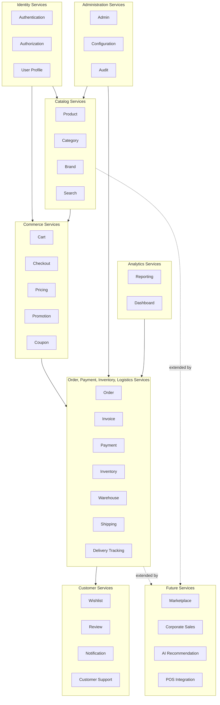
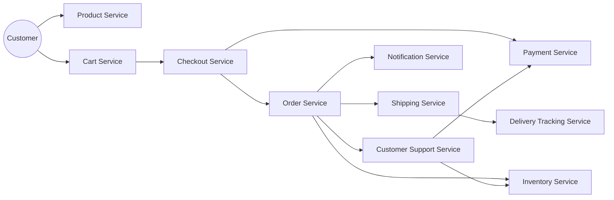
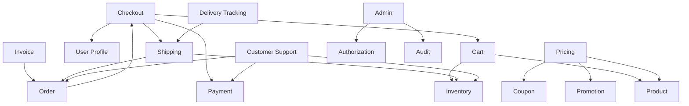
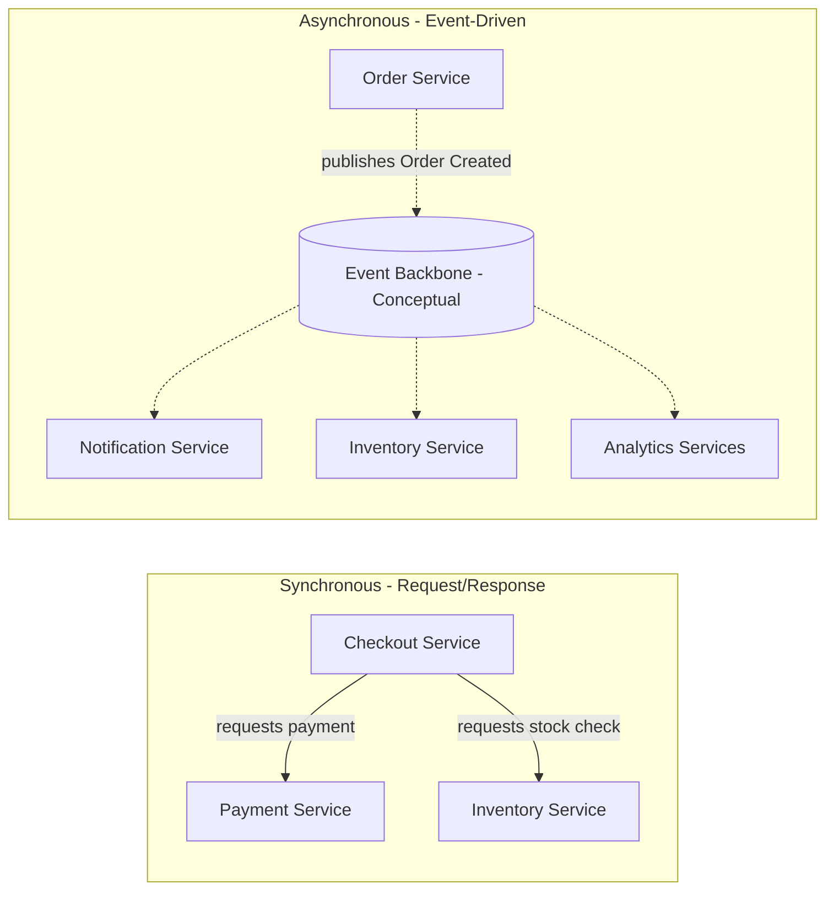

# Service Architecture

## 1. Document Purpose

This document is the official Service Architecture for **StackLeo Tech Store**. It defines the logical application services responsible for delivering business capability, building on `component-architecture.md` and `bounded-contexts.md`.

- **What Is an Application Service** — a logical grouping of business capability that exposes a coherent, purposeful contract to its consumers (other services, Presentation components, or external systems), coordinating one or more components (per `component-architecture.md`) to fulfill that capability.
- **Component vs. Service** — a component (C4 Level 3) is a unit of internal software structure; a service is a coarser-grained, purposeful grouping of components that together deliver a complete business capability and is a candidate boundary for independent evolution. Multiple components typically compose a single service (e.g., the Order Service is composed of the Order Management and Invoice components).
- **Service vs. Microservice** — a service, as defined here, is a *logical* boundary of business capability and responsibility. A microservice is a *deployment and runtime* decision — an independently deployable process. This document defines logical services only; whether and when a given service becomes an independently deployed microservice is a decision addressed in `deployment-architecture.md` and `architecture-decisions.md`, guided by the migration strategy in Section 11.
- **Relationship to the Domain Model** — every service exists to deliver capability defined by one or more entities, aggregates, or domain services in `domain-model.md`.
- **Relationship to Bounded Contexts** — each service is owned by exactly one bounded context, per `bounded-contexts.md`; no service spans multiple bounded contexts.

This document is implementation-independent. Services described here are logical business capability boundaries, not deployment units, not microservices, and not API specifications — those are addressed in dedicated documentation elsewhere in the repository.

## 2. Service Architecture Philosophy

- **Business Capability Alignment** — every service exists because it delivers a specific, named business capability traceable to `02_Product/product-features.md` or `02_Product/business-workflows.md`, never as a purely technical grouping.
- **Service Ownership** — each service has exactly one accountable owner, aligned to its bounded context owner (Section 12).
- **Service Boundaries** — boundaries are drawn along business capability lines defined in `bounded-contexts.md`, ensuring each service's scope is unambiguous and non-overlapping with its peers.
- **Single Responsibility** — a service is responsible for one business capability area, consistent with ARCH-004.
- **Loose Coupling** — services interact through minimal, well-defined interfaces and events, never through shared internal state, consistent with ARCH-007.
- **High Cohesion** — related business behavior is grouped within a single service rather than spread across several, consistent with ARCH-006.
- **Stateless Design Readiness** — services are designed to avoid holding client-specific state locally, supporting reliable scaling and eventual independent deployment, consistent with ARCH-012.
- **Event-Driven Readiness** — services communicate significant business occurrences as events (Section 5), positioning the architecture for a future formal event-streaming backbone, consistent with ARCH-013.

## 3. Service Catalog

| Category | Services | Service ID Range |
|---|---|---|
| Identity Services | Authentication, Authorization, User Profile | SVC-001–SVC-003 |
| Catalog Services | Product, Category, Brand, Search | SVC-004–SVC-007 |
| Commerce Services | Cart, Checkout, Pricing, Promotion, Coupon | SVC-008–SVC-012 |
| Order Services | Order, Invoice | SVC-013–SVC-014 |
| Payment Services | Payment | SVC-015 |
| Inventory Services | Inventory, Warehouse | SVC-016–SVC-017 |
| Logistics Services | Shipping, Delivery Tracking | SVC-018–SVC-019 |
| Customer Services | Wishlist, Review, Notification, Customer Support | SVC-020–SVC-023 |
| Analytics Services | Reporting, Dashboard | SVC-024–SVC-025 |
| Administration Services | Admin, Configuration, Audit | SVC-026–SVC-028 |
| Future Services | Marketplace, Corporate Sales, AI Recommendation, POS Integration | SVC-029–SVC-032 |

**Total Services: 32**

Each service below follows the template defined in Section 4 (numbered inline), presented across four tables per category: **Identity & Capability**, **Behavior**, **Architecture Relations**, and **Events, Interactions & Risk**.

---

## 4. Service Specifications

### 4.1 Identity Services

**Identity & Capability**

| ID | Name | Business Purpose | Business Capabilities |
|---|---|---|---|
| SVC-001 | Authentication Service | Establish verified identity for customers and internal users. | Registration, login, credential verification, session management |
| SVC-002 | Authorization Service | Enforce what an authenticated identity is permitted to do. | Role and permission enforcement |
| SVC-003 | User Profile Service | Maintain customer and internal user profile data. | Profile and address management |

**Behavior**

| ID | Responsibilities | Inputs | Outputs |
|---|---|---|---|
| SVC-001 | Verify credentials; manage session lifecycle. | Registration/login requests | Verified identity, active session |
| SVC-002 | Evaluate permission scope for requested actions. | Actor identity, requested action | Authorization decision |
| SVC-003 | Store and update profile/address data. | Profile update requests | Current profile state |

**Architecture Relations**

| ID | Related Components | Related Domains | Related Bounded Contexts | Dependencies |
|---|---|---|---|---|
| SVC-001 | COMP-004 | Identity | Identity & Access | None (foundational) |
| SVC-002 | COMP-005 | Identity | Identity & Access | SVC-001 |
| SVC-003 | COMP-006 | Customer | Customer | SVC-001 |

**Events, Interactions & Risk**

| ID | Events Consumed | Events Published | External Interactions | Risks | Future Evolution | Notes |
|---|---|---|---|---|---|---|
| SVC-001 | None | User Registered, Login Succeeded, Login Failed | None | Credential compromise | MFA readiness (NFR-026) | Foundational to all services |
| SVC-002 | User Registered | Permission Denied (security event) | None | Over-permissioned roles | ABAC-style scoping | Enforces `02_Product/user-roles.md` |
| SVC-003 | User Registered | Profile Updated | None | Inconsistent profile data across channels | Profile completeness scoring | — |

### 4.2 Catalog Services

**Identity & Capability**

| ID | Name | Business Purpose | Business Capabilities |
|---|---|---|---|
| SVC-004 | Product Service | Own the authoritative product record. | Product listing, variant, pricing state |
| SVC-005 | Category Service | Maintain the category hierarchy. | Catalog navigation structure |
| SVC-006 | Brand Service | Maintain verified brand associations. | Brand-based discovery, authenticity |
| SVC-007 | Search Service | Enable keyword-based product discovery. | Search indexing and query resolution |

**Behavior**

| ID | Responsibilities | Inputs | Outputs |
|---|---|---|---|
| SVC-004 | Maintain product completeness and publish state. | Product data | Published product records |
| SVC-005 | Maintain category structure. | Category change requests | Category-organized catalog |
| SVC-006 | Verify and maintain brand records. | Brand documentation | Verified brand records |
| SVC-007 | Index and resolve search queries. | Search queries, catalog data | Ranked results |

**Architecture Relations**

| ID | Related Components | Related Domains | Related Bounded Contexts | Dependencies |
|---|---|---|---|---|
| SVC-004 | COMP-007, COMP-011 | Catalog, Product | Catalog & Discovery | SVC-006 |
| SVC-005 | COMP-008 | Catalog | Catalog & Discovery | SVC-004 |
| SVC-006 | COMP-009 | Catalog | Catalog & Discovery | None |
| SVC-007 | COMP-010 | Catalog | Catalog & Discovery | SVC-004 |

**Events, Interactions & Risk**

| ID | Events Consumed | Events Published | External Interactions | Risks | Future Evolution | Notes |
|---|---|---|---|---|---|---|
| SVC-004 | Brand Verified | Product Published, Product Price Changed | None | Inaccurate listings | Rich media content | Product Aggregate root per `domain-model.md` |
| SVC-005 | Product Published | Category Updated | None | Broken category-product linkage | Dynamic merchandising | — |
| SVC-006 | None | Brand Verified | None | Unauthorized brand association | Brand storefront pages | — |
| SVC-007 | Product Published, Product Price Changed | Search Index Updated | None | Poor relevance ranking | AI Search (SVC-031) | — |

### 4.3 Commerce Services

**Identity & Capability**

| ID | Name | Business Purpose | Business Capabilities |
|---|---|---|---|
| SVC-008 | Cart Service | Hold customer purchase intent prior to checkout. | Cart line item management |
| SVC-009 | Checkout Service | Convert a validated cart into a confirmed order request. | Billing, shipping, payment confirmation flow |
| SVC-010 | Pricing Service | Determine applicable price for a product. | Price calculation, promotional application |
| SVC-011 | Promotion Service | Govern time-bound campaigns and flash sales. | Campaign and flash sale management |
| SVC-012 | Coupon Service | Govern discount code creation and validation. | Coupon eligibility and redemption |

**Behavior**

| ID | Responsibilities | Inputs | Outputs |
|---|---|---|---|
| SVC-008 | Validate cart contents against stock/pricing. | Product selections, quantities | Validated cart |
| SVC-009 | Collect and validate checkout inputs. | Cart, address, payment selection | Confirmed checkout request |
| SVC-010 | Calculate final price incorporating promotions. | Product, active campaigns/coupons | Final applicable price |
| SVC-011 | Enforce promotional pricing windows and stock allocation. | Campaign configuration | Active promotional pricing |
| SVC-012 | Validate and apply coupon discounts. | Coupon code, cart contents | Adjusted order total |

**Architecture Relations**

| ID | Related Components | Related Domains | Related Bounded Contexts | Dependencies |
|---|---|---|---|---|
| SVC-008 | COMP-012 | Cart | Commerce | SVC-004, SVC-016 |
| SVC-009 | COMP-013 | Checkout | Commerce | SVC-008, SVC-003, SVC-015, SVC-018 |
| SVC-010 | COMP-014 | Catalog, Promotions | Commerce | SVC-004, SVC-011, SVC-012 |
| SVC-011 | COMP-015 | Promotions | Commerce | SVC-004, SVC-016 |
| SVC-012 | COMP-016 | Promotions | Commerce | SVC-008 |

**Events, Interactions & Risk**

| ID | Events Consumed | Events Published | External Interactions | Risks | Future Evolution | Notes |
|---|---|---|---|---|---|---|
| SVC-008 | Stock Level Changed | Cart Updated, Checkout Started | None | Stock conflict at checkout | Persistent cross-device cart | Cart Aggregate per `domain-model.md` |
| SVC-009 | Cart Updated | Order Requested | Payment Gateway (via SVC-015) | Checkout drop-off | One-click checkout | Coordinates Cart → Order transition |
| SVC-010 | Coupon Redeemed, Campaign Activated | Price Calculated | None | Pricing conflicts | Dynamic pricing (Future) | Domain Service per `domain-model.md` |
| SVC-011 | None | Campaign Activated, Flash Sale Started/Ended | None | Over-discounting | AI-optimized timing | — |
| SVC-012 | None | Coupon Redeemed | None | Coupon abuse | Personalized targeting | — |

### 4.4 Order Services

**Identity & Capability**

| ID | Name | Business Purpose | Business Capabilities |
|---|---|---|---|
| SVC-013 | Order Service | Own the authoritative order lifecycle record. | Order status tracking and history |
| SVC-014 | Invoice Service | Produce compliant financial documentation. | Invoice generation and retrieval |

**Behavior**

| ID | Responsibilities | Inputs | Outputs |
|---|---|---|---|
| SVC-013 | Track order status through its lifecycle. | Confirmed checkout data | Current/historical order state |
| SVC-014 | Generate and store compliant invoices. | Confirmed order and pricing data | Customer-accessible invoice |

**Architecture Relations**

| ID | Related Components | Related Domains | Related Bounded Contexts | Dependencies |
|---|---|---|---|---|
| SVC-013 | COMP-017 | Order | Order & Fulfillment | SVC-009 |
| SVC-014 | COMP-018 | Order | Order & Fulfillment | SVC-013 |

**Events, Interactions & Risk**

| ID | Events Consumed | Events Published | External Interactions | Risks | Future Evolution | Notes |
|---|---|---|---|---|---|---|
| SVC-013 | Order Requested, Payment Completed | Order Created, Order Status Changed, Order Cancelled | None | Order state inconsistency | Order modification self-service | Order Aggregate root per `domain-model.md` |
| SVC-014 | Order Created | Invoice Generated | None | Non-compliant invoice content | Digital invoice archive | — |

### 4.5 Payment Services

**Identity & Capability**

| ID | Name | Business Purpose | Business Capabilities |
|---|---|---|---|
| SVC-015 | Payment Service | Process and verify order payment. | COD and digital payment handling, refunds |

**Behavior**

| ID | Responsibilities | Inputs | Outputs |
|---|---|---|---|
| SVC-015 | Route payment; confirm success/failure; coordinate refunds. | Payment method, amount, order reference | Payment confirmation/failure/refund status |

**Architecture Relations**

| ID | Related Components | Related Domains | Related Bounded Contexts | Dependencies |
|---|---|---|---|---|
| SVC-015 | COMP-019 | Payment | Commerce | SVC-009, External Payment Gateway |

**Events, Interactions & Risk**

| ID | Events Consumed | Events Published | External Interactions | Risks | Future Evolution | Notes |
|---|---|---|---|---|---|---|
| SVC-015 | Order Requested, Refund Approved | Payment Completed, Payment Failed, Refund Completed | Payment Gateway (see `integration-architecture.md`) | Payment gateway downtime | EMI, wallet support | Payment Aggregate per `domain-model.md` |

### 4.6 Inventory Services

**Identity & Capability**

| ID | Name | Business Purpose | Business Capabilities |
|---|---|---|---|
| SVC-016 | Inventory Service | Maintain accurate, real-time stock levels. | Stock deduction, reservation, replenishment |
| SVC-017 | Warehouse Service | Manage physical fulfillment operations. | Picking, packing, stock transfer |

**Behavior**

| ID | Responsibilities | Inputs | Outputs |
|---|---|---|---|
| SVC-016 | Deduct, reserve, replenish stock. | Order events, restocking data | Real-time stock availability |
| SVC-017 | Pick, pack, prepare orders; process transfers. | Order data, stock location data | Fulfillment-ready shipments |

**Architecture Relations**

| ID | Related Components | Related Domains | Related Bounded Contexts | Dependencies |
|---|---|---|---|---|
| SVC-016 | COMP-020 | Inventory | Order & Fulfillment | SVC-004 |
| SVC-017 | COMP-021 | Inventory | Order & Fulfillment | SVC-016 |

**Events, Interactions & Risk**

| ID | Events Consumed | Events Published | External Interactions | Risks | Future Evolution | Notes |
|---|---|---|---|---|---|---|
| SVC-016 | Order Created, Order Cancelled | Stock Level Changed, Low Stock Alert | None | Overselling | Predictive stock alerts | Inventory Aggregate per `domain-model.md` |
| SVC-017 | Order Created | Order Packed | None | Picking/packing errors | Multi-warehouse routing | — |

### 4.7 Logistics Services

**Identity & Capability**

| ID | Name | Business Purpose | Business Capabilities |
|---|---|---|---|
| SVC-018 | Shipping Service | Coordinate courier delivery of orders. | Courier assignment, delivery zone management |
| SVC-019 | Delivery Tracking Service | Track and expose delivery status. | Delivery status lifecycle tracking |

**Behavior**

| ID | Responsibilities | Inputs | Outputs |
|---|---|---|---|
| SVC-018 | Assign couriers based on delivery zone. | Order/address data, courier status | Assigned courier, shipment record |
| SVC-019 | Track and expose delivery status. | Courier-reported updates | Current delivery status |

**Architecture Relations**

| ID | Related Components | Related Domains | Related Bounded Contexts | Dependencies |
|---|---|---|---|---|
| SVC-018 | COMP-022 | Shipping | Order & Fulfillment | SVC-013, SVC-016, External Courier Services |
| SVC-019 | COMP-023 | Shipping | Order & Fulfillment | SVC-018 |

**Events, Interactions & Risk**

| ID | Events Consumed | Events Published | External Interactions | Risks | Future Evolution | Notes |
|---|---|---|---|---|---|---|
| SVC-018 | Order Packed | Shipment Created, Courier Assigned | Courier Services (see `integration-architecture.md`) | Courier service disruption | Own delivery fleet | Shipment entity per `domain-model.md` |
| SVC-019 | Courier Assigned | Delivery Status Changed, Delivery Failed, Order Delivered | Courier Services | Stale tracking data | Live map tracking | — |

### 4.8 Customer Services

**Identity & Capability**

| ID | Name | Business Purpose | Business Capabilities |
|---|---|---|---|
| SVC-020 | Wishlist Service | Maintain customer-saved products. | Wishlist management |
| SVC-021 | Review Service | Capture verified-purchase feedback. | Review submission and moderation |
| SVC-022 | Notification Service | Deliver event-driven customer communication. | Multi-channel notification dispatch |
| SVC-023 | Customer Support Service | Support return, warranty, and general support cases. | Case management |

**Behavior**

| ID | Responsibilities | Inputs | Outputs |
|---|---|---|---|
| SVC-020 | Add/remove/expose wishlist items. | Customer wishlist actions | Current wishlist state |
| SVC-021 | Verify purchase; moderate/publish reviews. | Review submission | Published product review |
| SVC-022 | Trigger and deliver notifications. | Business events | Delivered customer notifications |
| SVC-023 | Manage return, warranty, and support case lifecycle. | Customer inquiry/claim | Case resolution outcome |

**Architecture Relations**

| ID | Related Components | Related Domains | Related Bounded Contexts | Dependencies |
|---|---|---|---|---|
| SVC-020 | COMP-024 | Customer | Customer | SVC-003, SVC-004 |
| SVC-021 | COMP-025 | Reviews | Post-Purchase | SVC-003, SVC-013 |
| SVC-022 | COMP-026 | Notifications | Engagement | SVC-003, SVC-013, External Email/SMS Services |
| SVC-023 | COMP-027 | Returns, Warranty | Post-Purchase | SVC-013, SVC-015, SVC-016, SVC-022 |

**Events, Interactions & Risk**

| ID | Events Consumed | Events Published | External Interactions | Risks | Future Evolution | Notes |
|---|---|---|---|---|---|---|
| SVC-020 | Stock Level Changed | Wishlist Item Added | None | No proactive re-engagement | Price/stock alerts | — |
| SVC-021 | Order Delivered | Review Submitted, Review Published | None | Fake or abusive reviews | Review helpfulness voting | — |
| SVC-022 | Order Created, Order Status Changed, Return Approved, Refund Completed | Notification Sent, Notification Failed | Email Service, SMS Service | Delivery failure or delay | Push notifications (Mobile App) | — |
| SVC-023 | Order Delivered | Return Requested, Warranty Claim Submitted, Case Resolved | None | Fragmented case visibility | Self-service case tracking | Return/Warranty Aggregates per `domain-model.md` |

### 4.9 Analytics Services

**Identity & Capability**

| ID | Name | Business Purpose | Business Capabilities |
|---|---|---|---|
| SVC-024 | Reporting Service | Produce standard operational and financial reports. | Sales, inventory, customer reporting |
| SVC-025 | Dashboard Service | Present aggregated behavioral and performance insight. | Analytics visualization |

**Behavior**

| ID | Responsibilities | Inputs | Outputs |
|---|---|---|---|
| SVC-024 | Compile structured, role-scoped reports. | Order, Inventory, Finance data | Standard business reports |
| SVC-025 | Aggregate and visualize cross-service data. | Commerce, Order, Customer data | Behavioral/performance dashboards |

**Architecture Relations**

| ID | Related Components | Related Domains | Related Bounded Contexts | Dependencies |
|---|---|---|---|---|
| SVC-024 | COMP-028 | Analytics | Business Intelligence | SVC-013, SVC-016, SVC-015 |
| SVC-025 | COMP-029 | Analytics | Business Intelligence | SVC-013, SVC-008, SVC-003 |

**Events, Interactions & Risk**

| ID | Events Consumed | Events Published | External Interactions | Risks | Future Evolution | Notes |
|---|---|---|---|---|---|---|
| SVC-024 | Order Created, Refund Completed | Report Generated | None | Report inaccuracy | Scheduled report delivery | — |
| SVC-025 | Order Created, Cart Updated | Dashboard Refreshed | None | Data quality inconsistency | Predictive analytics (AI) | — |

### 4.10 Administration Services

**Identity & Capability**

| ID | Name | Business Purpose | Business Capabilities |
|---|---|---|---|
| SVC-026 | Admin Service | Provide centralized internal control. | Cross-service administration |
| SVC-027 | Configuration Service | Maintain platform-wide business configuration. | Business rule parameters, channel config |
| SVC-028 | Audit Service | Preserve an accountable record of administrative actions. | Immutable audit logging |

**Behavior**

| ID | Responsibilities | Inputs | Outputs |
|---|---|---|---|
| SVC-026 | Provide unified administrative access, scoped by role. | Administrative actions | Administered business state |
| SVC-027 | Store and apply platform-wide configuration. | Configuration changes | Current business configuration |
| SVC-028 | Record actor, action, timestamp for governed actions. | Administrative action events | Immutable audit trail |

**Architecture Relations**

| ID | Related Components | Related Domains | Related Bounded Contexts | Dependencies |
|---|---|---|---|---|
| SVC-026 | COMP-030 | Administration | Platform Administration | SVC-002, SVC-028 |
| SVC-027 | COMP-031 | Administration | Platform Services | SVC-002 |
| SVC-028 | COMP-032 | Administration | Identity & Access | SVC-002 |

**Events, Interactions & Risk**

| ID | Events Consumed | Events Published | External Interactions | Risks | Future Evolution | Notes |
|---|---|---|---|---|---|---|
| SVC-026 | Permission Denied | Admin Action Performed | None | Administrative error at scale | Customizable dashboard widgets | — |
| SVC-027 | None | Configuration Changed | None | Misconfiguration impact | Configuration versioning/rollback | — |
| SVC-028 | Admin Action Performed, Configuration Changed | Audit Entry Recorded | None | Incomplete logging coverage | Real-time audit alerting | — |

### 4.11 Future Services

**Identity & Capability**

| ID | Name | Business Purpose | Business Capabilities |
|---|---|---|---|
| SVC-029 | Marketplace Service | Enable third-party sellers to list and sell products. | Seller onboarding, listing approval, commission, settlement |
| SVC-030 | Corporate Sales Service | Serve organizational and bulk buyers. | Corporate accounts, negotiated pricing, bulk orders |
| SVC-031 | AI Recommendation Service | Provide AI-assisted search and recommendations. | Personalized discovery |
| SVC-032 | POS Integration Service | Integrate in-store POS with online inventory/orders. | Unified transaction handling |

**Behavior**

| ID | Responsibilities | Inputs | Outputs |
|---|---|---|---|
| SVC-029 | Onboard/govern sellers; calculate commission/settlement. | Seller applications, listings, orders | Approved listings, seller payouts |
| SVC-030 | Manage corporate accounts and negotiated terms. | Account agreements, bulk order requests | Fulfilled corporate orders |
| SVC-031 | Generate suggestions/improved ranking from behavior signals. | Browsing/order history, search queries | Personalized suggestions, ranked results |
| SVC-032 | Synchronize in-store transactions with online state. | In-store transaction data | Unified order/inventory state |

**Architecture Relations**

| ID | Related Components | Related Domains | Related Bounded Contexts | Dependencies |
|---|---|---|---|---|
| SVC-029 | COMP-033 | Marketplace | Business Expansion | SVC-004, SVC-026, SVC-015 |
| SVC-030 | COMP-034 | Corporate Sales | Business Expansion | SVC-013, SVC-002 |
| SVC-031 | COMP-035 | Analytics | Intelligence & Automation | SVC-007, SVC-013 |
| SVC-032 | COMP-036 | Order, Inventory | Business Expansion | SVC-013, SVC-016 |

**Events, Interactions & Risk**

| ID | Events Consumed | Events Published | External Interactions | Risks | Future Evolution | Notes |
|---|---|---|---|---|---|---|
| SVC-029 | Seller Verified, Product Published | Listing Approved, Commission Calculated, Seller Settled | Marketplace Partner systems (Future) | Seller quality/authenticity risk | Seller analytics dashboard | Not yet active; Phase 5 |
| SVC-030 | Order Created | Corporate Order Fulfilled | None | Non-standard pricing risk | Self-service corporate portal | Not yet active; Phase 4 |
| SVC-031 | Product Published, Order Created, Search Index Updated | Recommendation Generated | AI Platform (Future) | Reduced transparency perception | Multilingual, cross-market capability | Not yet active; Phase 6 |
| SVC-032 | None | In-Store Transaction Recorded | POS Hardware/Terminal (Future) | Inventory desynchronization | Unified omnichannel loyalty tracking | Not yet active; Phase 4–5 |

## 4.12 Overall Service Architecture

*Diagram: Overall Service Architecture.*

## 4.13 Service Collaboration Diagram

*Diagram: Service Collaboration Diagram — the core customer transaction collaboration path.*

## 4.14 Service Dependency Graph

*Diagram: Service Dependency Graph — arrows indicate "depends on."*

### Service Dependencies

| Service | Depends On (Upstream) | Depended On By (Downstream) |
|---|---|---|
| SVC-001 Authentication | None | SVC-002, SVC-003 |
| SVC-004 Product | SVC-006 | SVC-005, SVC-007, SVC-008, SVC-010, SVC-011, SVC-020, SVC-029 |
| SVC-008 Cart | SVC-004, SVC-016 | SVC-009, SVC-012 |
| SVC-009 Checkout | SVC-008, SVC-003, SVC-015, SVC-018 | SVC-013 |
| SVC-013 Order | SVC-009 | SVC-014, SVC-018, SVC-020–023, SVC-024, SVC-030, SVC-032 |
| SVC-015 Payment | SVC-009, External Payment Gateway | SVC-009, SVC-013, SVC-023, SVC-029 |
| SVC-016 Inventory | SVC-004 | SVC-008, SVC-011, SVC-017, SVC-018, SVC-023, SVC-032 |
| SVC-018 Shipping | SVC-013, SVC-016, External Courier Services | SVC-019 |
| SVC-026 Admin | SVC-002, SVC-028 | (governs all services via configuration/oversight) |
| SVC-029 Marketplace (Future) | SVC-004, SVC-026, SVC-015 | SVC-004, SVC-013 |

### Event Matrix

| Event | Published By | Consumed By |
|---|---|---|
| User Registered | Authentication Service | Authorization Service, User Profile Service |
| Product Published | Product Service | Category Service, Search Service, Analytics Services, AI Recommendation Service (Future) |
| Cart Updated | Cart Service | Checkout Service, Dashboard Service |
| Order Created | Order Service | Inventory Service, Shipping Service, Notification Service, Reporting Service, Dashboard Service, POS Integration Service (Future) |
| Payment Completed | Payment Service | Order Service, Notification Service |
| Payment Failed | Payment Service | Order Service, Notification Service |
| Shipment Created | Shipping Service | Delivery Tracking Service, Notification Service |
| Order Delivered | Delivery Tracking Service | Review Service, Customer Support Service, Order Service |
| Return Requested | Customer Support Service | Notification Service |
| Refund Completed | Payment Service | Order Service, Notification Service, Reporting Service |
| Admin Action Performed | Admin Service | Audit Service |
| Configuration Changed | Configuration Service | Audit Service, all consuming services |

---

## 5. Service Interaction Model

Service interaction remains conceptual in this document — no specific protocol, message format, or technical mechanism is prescribed.

- **Synchronous Communication** — used where an immediate response is genuinely required for the requester to proceed (e.g., Checkout Service requires an immediate response from Payment Service to know whether to confirm the order).
- **Asynchronous Communication** — used where the requester does not need to block on the outcome (e.g., Order Service does not need to wait for Notification Service to finish sending a confirmation email).
- **Event-Driven Collaboration** — the preferred default for cross-service business notification; a service publishes a fact ("Order Created") without needing to know which services, if any, will react.
- **Request/Response** — used for direct capability invocation where a service explicitly needs another service's current state or decision (e.g., Cart Service requesting current stock from Inventory Service).
- **Event Publishing** — each service publishes the domain events it is authoritative for (Section 4, "Events Published"), consistent with its role as the owning aggregate root per `domain-model.md`.
- **Event Subscription** — a service subscribes only to events genuinely relevant to its own responsibility, avoiding unnecessary coupling to unrelated business processes.

*Diagram: Event Flow Overview.*

## 6. Service Boundaries

Each service's responsibility, as documented in Section 4, is deliberately non-overlapping with its peers:

- Only **Product Service** may modify product data; **Search Service** consumes it but never writes it.
- Only **Inventory Service** may modify stock levels; **Cart Service** and **Checkout Service** query and reserve through it, never adjusting stock directly.
- Only **Order Service** owns order state; **Invoice Service**, **Shipping Service**, and **Customer Support Service** reference order data but do not alter core order state directly.
- Only **Payment Service** initiates and confirms payment transactions; no other service processes payment directly.
- Only **Audit Service** writes to the audit trail; other services emit events that Audit Service consumes and records.

This strict, non-overlapping ownership model prevents the "duplicate business rules" and "shared mutable state" anti-patterns identified in `architecture-principles.md` (Section 12).

## 7. Service Dependency Principles

- **Dependency Direction** — dependencies generally flow from customer-facing, orchestrating services (Checkout, Order) toward foundational, single-purpose services (Payment, Inventory, Shipping); foundational services do not depend back on orchestrating services.
- **Interface-Based Communication** — services interact only through their defined capability contracts (Section 4 Behavior tables), never by reaching into another service's internal data.
- **Contract-First Thinking** — a service's inputs and outputs (Section 4) are treated as a stable contract, designed before internal behavior is elaborated further.
- **Versioning Strategy** — changes to a service's contract are versioned deliberately, allowing existing consumers to continue functioning while a new contract version is adopted.
- **Backward Compatibility** — a service's contract changes must preserve existing consumer expectations wherever reasonably possible, consistent with ARCH-023; breaking changes require explicit, coordinated migration.

## 8. Reliability & Resilience

- **Retry Philosophy** — synchronous calls to dependent services (e.g., Checkout Service → Payment Service) apply bounded, sensible retry behavior for transient failures, consistent with ARCH-044.
- **Failure Isolation** — a failure within one service (e.g., Recommendation Service) must not propagate into the failure of an unrelated service (e.g., Checkout Service), consistent with ARCH-042.
- **Idempotency Concepts** — operations that may be retried (e.g., "confirm payment") are conceptually designed so that repeating the same request does not produce a duplicate business effect (e.g., a duplicate order or double charge).
- **Graceful Degradation** — non-critical service unavailability (e.g., Review Service) degrades the surrounding experience gracefully rather than blocking the core purchase flow, consistent with ARCH-043.
- **Circuit Breaker Readiness (Conceptual)** — services calling external or less-reliable dependencies are designed with the conceptual expectation that repeated failures should trigger a temporary halt to further calls, preventing cascading failure, rather than persisting in retrying a clearly unavailable dependency.

## 9. Security Considerations

- **Authentication** — every service that accepts a request from a Presentation component or another service requires the caller to present a verified identity, per SVC-001.
- **Authorization** — every service verifies that the calling identity is authorized for the specific action requested, per SVC-002, consistent with Zero Trust thinking (ARCH-034).
- **Least Privilege** — service-to-service interaction is scoped to the minimum capability necessary for the interaction's purpose, consistent with ARCH-033.
- **Secure Communication** — all service-to-service and service-to-external-system communication is protected by default, consistent with ARCH-036.
- **Auditability** — every service emits events for its governed, business-critical actions, which Audit Service (SVC-028) records immutably, consistent with ARCH-037.

## 10. Scalability Considerations

| Growth Driver | Service Architecture Readiness |
|---|---|
| Horizontal Scaling | Stateless service design (Section 2) allows any service to scale by adding instances without special-casing. |
| Marketplace | Marketplace Service (SVC-029) extends Product and Order services rather than duplicating their capability, preserving scaling characteristics of the core catalog and order services. |
| AI | AI Recommendation Service (SVC-031) is architected as a consumer of existing service events, allowing it to scale independently of the services it observes. |
| Mobile | Because services expose channel-independent contracts, a future Mobile App increases request volume without requiring new service logic. |
| Multi-Region Deployment | Stateless, event-driven services provide the structural precondition for future multi-region operation, addressed further in `deployment-architecture.md`. |

## 11. Migration Strategy

The service architecture is designed to evolve incrementally, without requiring a disruptive rewrite at any stage:

*Diagram: Service Evolution Roadmap.*

| Stage | Description | Migration Principle |
|---|---|---|
| Modular Monolith | Services (Section 4) are logically distinct but may initially be delivered within a single deployable unit. | Enforce service boundaries and contracts internally even before physical separation exists. |
| Modular Services | Services are deployed as separable units where scaling or ownership needs justify it, starting with the highest-demand or highest-risk services (e.g., Checkout, Payment). | Extract services incrementally, validating each extraction against real operational need rather than speculative benefit. |
| Event-Driven Services | Cross-service interaction shifts progressively from direct calls toward event-based collaboration (Section 5) as event volume and service count grow. | Introduce a formal event backbone only once genuine cross-service event volume justifies the operational investment. |
| Microservices (Future) | Services with sufficiently independent scaling, deployment, and ownership needs are fully extracted into independently deployable microservices. | Extract only services where the resulting operational complexity is clearly justified by the business or technical benefit, consistent with ARCH-023 (Simplicity Before Complexity). |

This progression is guided entirely by validated need, consistent with `architecture-principles.md` (ARCH-001, ARCH-023): StackLeo does not commit to microservices as a default destination, only as an available, well-prepared option should scale genuinely warrant it.

## 12. Governance

- **Service Ownership** — each service has a designated owner aligned to its bounded context owner, per `bounded-contexts.md` and the Ownership Matrix below.
- **Service Lifecycle** — a service progresses through Proposed → Active → (Deprecated) → Retired states, with lifecycle changes recorded in `architecture-decisions.md`.
- **Review Process** — service boundaries and contracts are reviewed whenever a new feature (`02_Product/product-features.md`) does not map cleanly to an existing service, or when `component-architecture.md` changes materially.
- **Change Management** — changes to a service's contract, dependencies, or events must be recorded in `00_Project_Overview/changelog.md`, and evaluated against the Service Dependency table for downstream impact.
- **Versioning** — this document follows the Semantic Versioning approach defined in `00_Project_Overview/changelog.md`.

### Ownership Matrix

| Service Category | Owning Bounded Context | Primary Owner |
|---|---|---|
| Identity Services | Identity & Access | Engineering, Security Lead |
| Catalog Services | Catalog & Discovery | Product Team, Merchandising |
| Commerce Services | Commerce | Product Team, Marketing, Finance |
| Order Services | Order & Fulfillment | Operations |
| Payment Services | Commerce | Finance |
| Inventory Services | Order & Fulfillment | Operations, Warehouse Team |
| Logistics Services | Order & Fulfillment | Operations |
| Customer Services | Customer, Post-Purchase, Engagement | Customer Support, Marketing |
| Analytics Services | Business Intelligence | Management, Finance |
| Administration Services | Platform Administration, Platform Services | Product Team, Operations |
| Future Services | Business Expansion, Intelligence & Automation | Founder / Business Owner, Product Team |

## 13. Document Information

| Property | Value |
|----------|-------|
| Document | service-architecture.md |
| Version | 1.0.0 |
| Status | Active |
| Maintained By | StackLeo |
| Last Updated | 2026-07-17 |

---

© StackLeo. All Rights Reserved.
