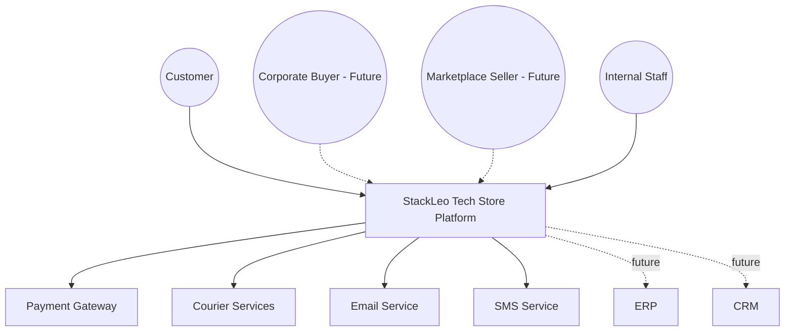
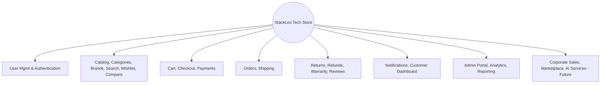
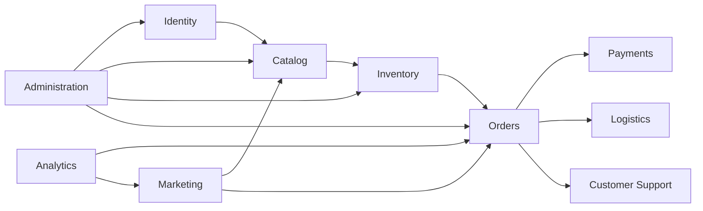
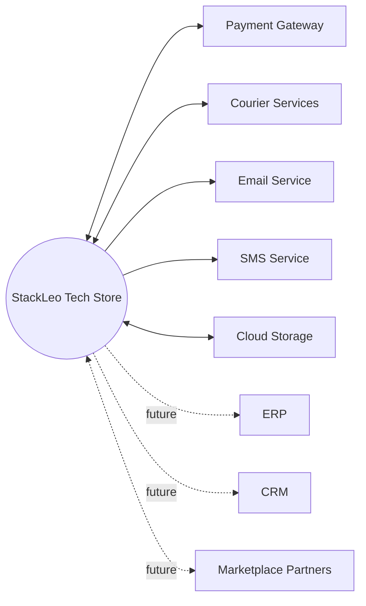

# System Overview

## 1. Document Purpose

This document provides the official System Overview for **StackLeo Tech Store** — a high-level architectural view of the entire platform. It explains what the system is, why it exists, how it is organized, what major capabilities it provides, and how its major business domains interact.

This document is intended for Architects, Product Managers, Business Analysts, Developers, QA Engineers, DevOps Engineers, and Stakeholders. It serves as the entry point into `03_System_Design`, grounding every subsequent architecture document in a shared understanding of the system as a whole.

This document is implementation-independent. It describes architectural structure and intent at a C4 Context/Container level of abstraction, informed by Domain-Driven Design (DDD) thinking. It does not describe technology choices, API design, database structure, or code, all of which are addressed in dedicated technical documentation elsewhere in the repository.

## 2. Executive Summary

StackLeo Tech Store is the digital and physical commerce platform of StackLeo, a technology and electronics retail company serving Bangladesh. The platform provides a single, trusted marketplace — reflected in its tagline, *"Everything Tech, One Marketplace"* — through which customers discover, purchase, and receive support for genuine technology products.

Architecturally, the system is organized around clearly bounded business domains (Section 6), each responsible for a coherent slice of business capability, connected through well-defined interactions rather than incidental coupling. It currently operates as a single-seller B2C platform across Web and Physical Store channels, using BDT as its supported currency and English as its supported language, with a deliberately extensible architecture designed to support B2B, corporate sales, wholesale, and multi-vendor marketplace operations; a future Mobile App, POS, and Bangla language support; and eventual multi-currency operation as StackLeo expands across South Asia and beyond.

The long-term architectural vision is a system that scales from a trustworthy single-market MVP into a diversified, omnichannel commerce platform without requiring its foundational structure to be discarded — growth is achieved by extending bounded domains, not by rearchitecting them.

*Diagram: System Context Overview (C4 Context level) — StackLeo Tech Store and its primary actors and external system relationships.*

## 3. Business Context

- **Business Problem** — customers purchasing technology products in Bangladesh face fragmented options, inconsistent pricing, uncertain product authenticity, and unreliable after-sales support, as detailed in `01_Business/business-requirements.md` (Section 3).
- **Business Opportunity** — no existing competitor combines a consistent multi-channel experience, broad technology-focused catalog, and a clear authenticity guarantee, per `01_Business/competitor-analysis.md` (Section 15).
- **Value Proposition** — a single, trustworthy marketplace offering genuine products, fair pricing, and dependable service across online and physical channels, per `01_Business/business-model.md` (Section 3).
- **Target Customers** — individual consumers in Bangladesh today, with future expansion to corporate buyers, wholesale resellers, and marketplace sellers, per `01_Business/target-market.md`.
- **Competitive Positioning** — a challenger brand differentiated by trust and channel consistency rather than scale alone, per `01_Business/swot-analysis.md` (Section 10).
- **Long-Term Product Vision** — to become the most trusted technology marketplace in Bangladesh and a recognized name in the region's technology e-commerce industry, per `01_Business/vision.md` and `02_Product/product-overview.md`.

## 4. System Vision

StackLeo Tech Store's architecture is designed to support the phased business growth strategy defined in `01_Business/business-model.md` and `02_Product/product-roadmap.md`. The system must:

- Deliver a reliable, trustworthy B2C experience as its foundational obligation.
- Extend cleanly to support corporate sales, wholesale, and multi-vendor marketplace operations without disrupting core B2C behavior.
- Support additional sales channels (Mobile App, POS) as thin, consistent extensions of the same underlying business capability, not parallel, divergent implementations.
- Accommodate future internationalization — multi-currency, multi-language, and cross-border logistics — as an additive capability rather than a foundational rewrite.
- Remain observable, secure, and resilient at every stage of this growth, consistent with the non-functional expectations defined in `02_Product/non-functional-requirements.md`.

## 5. High-Level Capabilities

| Capability | Description | Current Status |
|---|---|---|
| User Management | Customer profile, address, and account lifecycle management. | Active |
| Authentication | Secure identity verification for customers and internal users. | Active |
| Product Catalog | Centralized record of sellable products, variants, and pricing. | Active |
| Categories | Hierarchical organization of the catalog. | Active |
| Brands | Verified brand association for authenticity assurance. | Active |
| Search & Filtering | Keyword discovery and result refinement. | Active |
| Wishlist | Saving products for future consideration. | Active (Phase 2) |
| Product Comparison | Side-by-side specification comparison. | Active (Phase 2) |
| Shopping Cart | Collection of intended purchases prior to checkout. | Active |
| Checkout | Billing, shipping, and payment confirmation flow. | Active |
| Payments | Cash on Delivery and digital payment processing. | Active |
| Orders | Order lifecycle management from placement through completion. | Active |
| Shipping | Courier coordination and delivery tracking. | Active |
| Returns | Structured return and exchange handling. | Active |
| Refunds | Financial resolution for approved returns and cancellations. | Active |
| Warranty | Warranty claim intake, verification, and resolution. | Active |
| Notifications | Multi-channel customer communication. | Active |
| Reviews | Verified-purchase product ratings and feedback. | Active (Phase 2) |
| Customer Dashboard | Consolidated customer account, order, and support view. | Active |
| Admin Portal | Internal administration of catalog, orders, and operations. | Active |
| Analytics | Behavioral and performance analysis. | Active (Phase 2) |
| Reporting | Standard operational and financial reporting. | Active (Phase 2) |
| Corporate Sales | Bulk purchasing under negotiated organizational terms. | Future (Phase 4) |
| Marketplace | Multi-vendor seller listing, order routing, and settlement. | Future (Phase 5) |
| AI Services | Intelligent search, recommendations, and support automation. | Future (Phase 6) |

*Diagram: High-Level Capability Map.*

## 6. Business Domains

| Domain | Description |
|---|---|
| Identity | Customer and internal user identity, authentication, and access control. |
| Catalog | Product, category, and brand information, and how customers discover it. |
| Inventory | Stock accuracy and availability across warehouses and channels. |
| Orders | The transactional record of customer purchases and their lifecycle. |
| Payments | Payment processing, verification, and refund execution. |
| Logistics | Physical fulfillment: warehousing, courier coordination, and delivery. |
| Customer Support | Post-purchase resolution: returns, warranty, and support cases. |
| Marketing | Promotions, campaigns, and customer engagement. |
| Analytics | Business and product performance measurement. |
| Administration | Internal governance: roles, permissions, audit, and configuration. |

*Diagram: Business Domain Map. These domains correspond directly to the bounded contexts defined in `02_Product/product-modules.md` and are elaborated further in `bounded-contexts.md`.*

## 7. External Systems

| External System | Role | Current Status |
|---|---|---|
| Payment Gateway | Processes and verifies digital customer payments. | Active |
| Courier Services (SteadFast, Pathao Courier, RedX, Paperfly) | Execute physical delivery of orders. | Active |
| Email Service | Delivers transactional and marketing email. | Active |
| SMS Service | Delivers time-sensitive SMS notifications. | Active |
| Cloud Storage | Stores product media and business documents. | Active |
| ERP | Future enterprise resource planning integration for financial and operational scale. | Future |
| CRM | Future customer relationship management integration. | Future |
| Marketplace Partners | Future third-party seller systems integrated via the marketplace. | Future |

*Diagram: External System Interaction Overview.*

## 8. Architectural Characteristics

| Characteristic | Description |
|---|---|
| Scalability | The architecture must grow from MVP to enterprise and marketplace scale without redesign, per `02_Product/non-functional-requirements.md` (Section 6). |
| Reliability | Isolated component failures must not cascade into platform-wide impact. |
| Availability | Customer-facing functionality must remain highly available, consistent with a trust-focused brand. |
| Security | Identity, authorization, and data protection must be embedded by design, not layered on afterward. |
| Maintainability | The system must remain organized around clear domain boundaries to support long-term evolution. |
| Extensibility | New capability (corporate sales, marketplace, AI) must extend existing domains rather than requiring parallel systems. |
| Observability | The system must be inherently monitorable, traceable, and diagnosable. |
| Performance | Customer-facing interactions must remain fast and responsive under normal and peak load. |

These characteristics are elaborated in detail in `quality-attributes.md`, `scalability-strategy.md`, `resilience-strategy.md`, and `observability.md`, and trace directly to `02_Product/non-functional-requirements.md`.

## 9. Stakeholders

| Stakeholder | Responsibility |
|---|---|
| Founder / Business Owner | Sets overall business and architectural direction. |
| Solution Architect | Owns the coherence and integrity of the system architecture. |
| Product Manager | Ensures architecture remains aligned with product requirements and roadmap. |
| Engineering Team | Implements the system consistent with this architecture. |
| QA Team | Validates the system against functional and non-functional expectations. |
| DevOps Team | Operates and maintains the system's runtime environment. |
| Customer Support, Operations, Finance, Marketing | Business stakeholders whose workflows the system must support, per `02_Product/business-workflows.md`. |

A complete list of project-wide stakeholders, their roles, and responsibilities is maintained in `00_Project_Overview/stakeholders.md`.

## 10. Assumptions & Constraints

**Assumptions:**

- Reliable courier, payment gateway, and communication provider partnerships remain available, per `01_Business/assumptions.md`.
- The business will validate the single-seller B2C model before committing to corporate, wholesale, or marketplace expansion, per `01_Business/business-model.md` (Section 14).
- Sufficient infrastructure and connectivity exist in Bangladesh to support the availability and performance expectations defined in `non-functional-requirements.md`.

**Constraints:**

- The system's current scope is limited to Bangladesh as the primary market, per `00_Project_Overview/project-scope.md`.
- The current business model is limited to single-seller B2C operations; B2B, corporate, wholesale, and marketplace capabilities are deferred to future phases, per `product-roadmap.md`.
- Architectural investment must remain proportionate to the business's current stage of growth, per `00_Project_Overview/constraints.md`.

## 11. Risks

| Risk | Description |
|---|---|
| Premature Architectural Complexity | Over-engineering for future scale (marketplace, AI, international) before it is validated, straining current delivery capacity. |
| External Dependency Risk | Reliance on payment gateway and courier partners introduces availability and reliability risk outside direct control. |
| Domain Boundary Erosion | Organic growth blurring the bounded contexts defined in `bounded-contexts.md`, increasing coupling over time. |
| Scaling Under Concentrated Demand | Flash sales and promotional events creating concentrated load risk, per `02_Product/non-functional-requirements.md` (Performance). |
| Security & Trust Risk | Any security incident directly undermines the trust-first brand positioning central to the business, per `01_Business/mission.md`. |
| Future Expansion Risk | Marketplace and international expansion introducing regulatory, quality, and operational complexity beyond current organizational maturity. |

## 12. Future Evolution

| Future Capability | Description | Related Roadmap Phase |
|---|---|---|
| Multi-Vendor Marketplace | Curated third-party sellers extending catalog breadth. | Phase 5 |
| Mobile Applications | A dedicated Mobile App extending the Web experience. | Phase 7 (channel), earlier groundwork per roadmap |
| AI Recommendations | AI-assisted search, recommendations, and support automation. | Phase 6 |
| International Expansion | Regional growth across South Asia and beyond. | Phase 7 |
| Multi-Language (Bangla) | Bangla-language customer interface alongside English. | Considered ahead of Phase 3 |
| Multi-Currency | Support for currencies beyond BDT to serve future markets. | Phase 7 |
| POS Integration | In-store point-of-sale unified with online inventory and orders. | Phase 4–5 |

This future evolution is described in full in `02_Product/product-roadmap.md`; this document ensures the current architecture is structured to accommodate it without disruptive redesign.

## 13. Governance

- **Ownership** — the Solution Architect owns this document and is accountable for keeping the system overview aligned with actual architectural direction.
- **Review Process** — this document is reviewed at the conclusion of each phase defined in `02_Product/product-roadmap.md`, and whenever business requirements or non-functional requirements change materially.
- **Change Management** — material changes to the system's vision, capabilities, or domain structure must be recorded as a decision in `architecture-decisions.md` before being reflected here.
- **Architecture Governance** — this document is the top-level reference for architectural coherence; all other documents in `03_System_Design` must remain consistent with it, per the governance model defined in `03_System_Design/README.md`.

## 14. Document Information

| Property | Value |
|----------|-------|
| Document | system-overview.md |
| Version | 1.0.0 |
| Status | Active |
| Maintained By | StackLeo |
| Last Updated | 2026-07-17 |

---

© StackLeo. All Rights Reserved.
