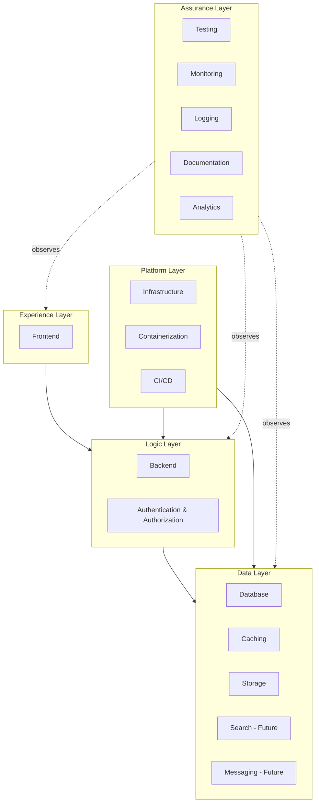
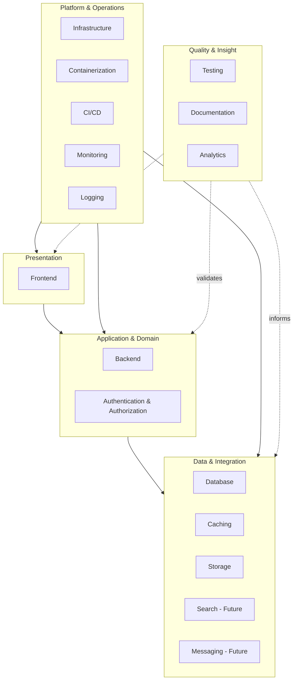
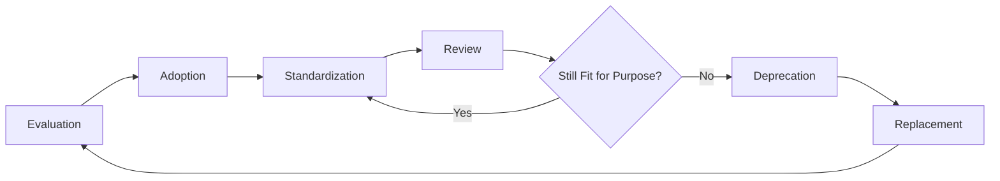
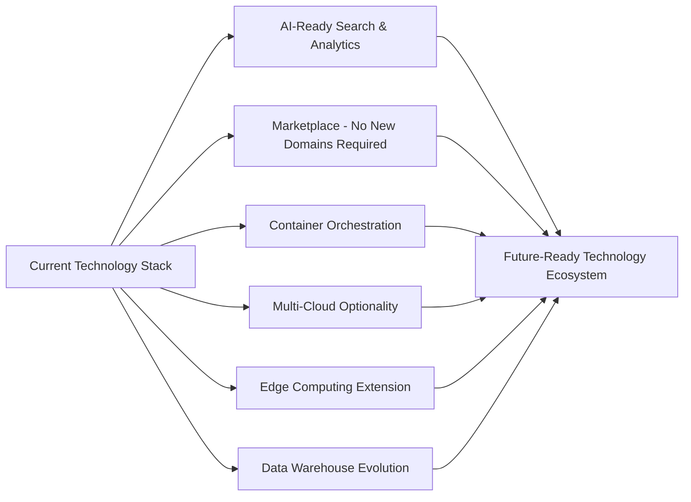

# Technology Stack Architecture

## 1. Document Purpose

This document is the official Technology Stack Architecture for **StackLeo Tech Store**. It explains the technology strategy and architectural reasoning behind the platform's technology choices — *why* categories of technology were selected, not *how* to install, configure, or use them.

This document deliberately describes technology at the category level (e.g., "relational database management system," not a named product or version), remaining cloud-provider neutral and implementation-independent, consistent with the rest of `03_System_Design`. Specific product selection, version management, and setup instructions belong to dedicated engineering documentation outside this folder.

This document builds on every preceding architecture document — particularly `architecture-principles.md`, `service-architecture.md`, and `deployment-architecture.md` — translating their structural and quality requirements into technology domain decisions.

## 2. Technology Selection Principles

Every technology category selected for StackLeo Tech Store is evaluated against the following principles:

- **Stability** — a mature, proven track record in production e-commerce or comparable systems.
- **Maintainability** — a technology the current and foreseeable engineering team can support confidently over years, not just at launch.
- **Scalability** — a demonstrated ability to scale from MVP through enterprise and marketplace demand, consistent with `quality-attributes.md` (Section 4).
- **Community Support** — an active community and knowledge base, reducing dependency on any single vendor or individual.
- **Ecosystem Maturity** — a rich surrounding ecosystem of tools, libraries, and integrations that reduces the need to build undifferentiated capability from scratch.
- **Security** — a track record of responsible vulnerability disclosure and active security maintenance.
- **Performance** — a demonstrated ability to meet the performance expectations defined in `non-functional-requirements.md` (Section 5).
- **Extensibility** — compatibility with the architectural principles defined in `architecture-principles.md` (modularity, loose coupling, event-driven readiness).
- **Cloud Readiness** — natural fit with elastic, cloud-native operation, consistent with `deployment-architecture.md`.
- **Long-Term Sustainability** — realistic expectation of continued relevance and support over the multi-year horizon implied by `product-roadmap.md`.

## 3. Technology Domains

| Domain | Role |
|---|---|
| Frontend | Presents the customer and admin experience across channels. |
| Backend | Executes business logic and enforces business rules. |
| Database | Persists authoritative business state. |
| Caching | Reduces latency and load for frequently accessed data. |
| Authentication & Authorization | Verifies identity and enforces access control. |
| Messaging (Future) | Enables asynchronous, event-driven service collaboration at scale. |
| Search (Future) | Provides fast, relevant product discovery at scale. |
| Storage | Stores unstructured assets such as product media and documents. |
| Monitoring | Observes system health and performance. |
| Logging | Aggregates structured records of system and business activity. |
| CI/CD | Automates build, test, and release processes. |
| Infrastructure | Provides the underlying compute and network foundation. |
| Containerization | Packages and isolates application runtime consistently across environments. |
| Testing | Validates functional and non-functional correctness automatically. |
| Documentation | Preserves shared understanding of business and technical decisions. |
| Analytics | Supports behavioral and business intelligence analysis. |

*Diagram: Technology Stack Overview.*

## 4. Technology Evaluation

### 4.1 Frontend

| Attribute | Description |
|---|---|
| Business Need | Deliver a fast, accessible, consistent customer and admin experience across Web today and Mobile App in the future. |
| Selected Technology Category | A modern, component-based JavaScript/TypeScript frontend framework with server-side rendering capability. |
| Why It Was Selected | Supports the performance (NFR-001, NFR-003) and accessibility (NFR-037–NFR-041) expectations, and enables component reuse toward the future Mobile App, consistent with API-first thinking (ARCH-011). |
| Alternatives Considered | Traditional server-rendered templating without a component framework; a native-only, framework-per-platform approach. |
| Benefits | Rich interactivity, strong reusable component model, mature ecosystem and tooling. |
| Trade-offs | Greater build and tooling complexity compared to simple server-rendered pages. |
| Risks | Frontend framework churn in the broader ecosystem requiring future migration effort. |
| Future Evolution | Shared component and business logic patterns extended to a future native Mobile App and future POS terminal interface. |

### 4.2 Backend

| Attribute | Description |
|---|---|
| Business Need | Execute business logic and enforce business rules reliably, in a way that supports Clean Architecture and DDD boundaries. |
| Selected Technology Category | A statically-typed, mature server-side language and runtime with a strong enterprise ecosystem. |
| Why It Was Selected | Static typing supports maintainability and reliability at scale; maturity supports long-term sustainability and hiring. |
| Alternatives Considered | A dynamically-typed scripting language runtime; an alternative statically-typed runtime with a smaller ecosystem. |
| Benefits | Strong tooling, reliable long-term maintainability, broad hiring pool. |
| Trade-offs | Potentially more verbose than dynamically-typed alternatives for small, simple capability. |
| Risks | Local talent availability in the Bangladesh market for the selected ecosystem. |
| Future Evolution | Structured to support future extraction of services (per `service-architecture.md`, Section 11) into independently deployable units if scale warrants it. |

### 4.3 Database

| Attribute | Description |
|---|---|
| Business Need | Persist authoritative, strongly consistent business state for Orders, Payments, and Inventory. |
| Selected Technology Category | A relational database management system as the primary transactional data store. |
| Why It Was Selected | Strong consistency and ACID transaction guarantees directly support the consistency-over-availability trade-off defined for critical data in `architectural-drivers.md` (Section 10). |
| Alternatives Considered | A NoSQL document store as the sole primary data store. |
| Benefits | Mature tooling, strong consistency guarantees, well-understood operational practice. |
| Trade-offs | Less flexible schema evolution compared to schema-less alternatives. |
| Risks | Write-scaling limitations at very high transaction volume, requiring deliberate scaling strategy at enterprise scale. |
| Future Evolution | Potential polyglot persistence — e.g., a specialized store for Catalog/Search data — while Orders, Payments, and Inventory remain on the relational store. |

### 4.4 Caching

| Attribute | Description |
|---|---|
| Business Need | Reduce latency and database load for frequently accessed, non-critical data (e.g., catalog browsing). |
| Selected Technology Category | An in-memory key-value caching layer. |
| Why It Was Selected | Directly supports the performance targets in `non-functional-requirements.md` (NFR-001, NFR-002) without adding load to the primary database. |
| Alternatives Considered | Relying solely on database query performance and CDN caching without an application-level cache. |
| Benefits | Significant latency reduction for high-read, low-volatility data. |
| Trade-offs | Adds cache invalidation complexity that must be carefully managed. |
| Risks | Stale data exposure if invalidation logic is incomplete or delayed. |
| Future Evolution | Distributed caching to support future multi-region deployment (per `deployment-architecture.md`, Section 8). |

### 4.5 Authentication & Authorization

| Attribute | Description |
|---|---|
| Business Need | Verify identity and enforce the role-based access model defined in `02_Product/user-roles.md`. |
| Selected Technology Category | A token-based identity and access approach supporting stateless session verification and role-based access control. |
| Why It Was Selected | Statelessness directly supports scalability (ARCH-012, ARCH-039) and Zero Trust verification at each boundary (ARCH-034). |
| Alternatives Considered | Traditional server-stored session state without token-based verification. |
| Benefits | Scales horizontally without shared session storage; consistent enforcement across services. |
| Trade-offs | Token revocation requires deliberate design consideration. |
| Risks | Token leakage or mishandling if not paired with strict secure communication practice (per `deployment-architecture.md`, Section 9). |
| Future Evolution | Multi-Factor Authentication readiness (NFR-026); potential evolution toward attribute-based access control (ABAC) per `user-roles.md` (UR-048). |

### 4.6 Messaging (Future)

| Attribute | Description |
|---|---|
| Business Need | Enable reliable, decoupled, asynchronous collaboration between services as event volume grows. |
| Selected Technology Category | An asynchronous message/event broker capability. |
| Why It Was Selected | Directly supports the Event-Driven Services stage of the migration strategy defined in `service-architecture.md` (Section 11). |
| Alternatives Considered | Continued reliance on direct, synchronous service-to-service calls for cross-service notification. |
| Benefits | Loose coupling, improved resilience, and support for cascading event patterns per `event-flows.md` (Section 6). |
| Trade-offs | Additional operational component to run, monitor, and secure. |
| Risks | Message loss or duplication if reliability strategies (per `integration-architecture.md`, Section 7) are not correctly applied. |
| Future Evolution | Adoption as a formal event bus once cross-service event volume genuinely justifies the investment, not as a default starting point. |

### 4.7 Search (Future)

| Attribute | Description |
|---|---|
| Business Need | Provide fast, relevant product discovery as catalog size and query volume grow beyond MVP scale. |
| Selected Technology Category | A dedicated search and indexing platform. |
| Why It Was Selected | Supports the search performance targets in `non-functional-requirements.md` (NFR-004) at scale, and provides the foundation for future AI Search (`product-roadmap.md`, Phase 6). |
| Alternatives Considered | Relying on the primary relational database's built-in text search capability, sufficient at current MVP catalog scale. |
| Benefits | Fast, relevant, independently scalable search, decoupled from transactional database load. |
| Trade-offs | Additional infrastructure component requiring its own operational care. |
| Risks | Index synchronization lag relative to the authoritative Product data. |
| Future Evolution | Foundation for the AI Recommendation Service (`service-architecture.md`, SVC-031) and AI Search capability. |

### 4.8 Storage

| Attribute | Description |
|---|---|
| Business Need | Durably and scalably store product images and business documents. |
| Selected Technology Category | An object storage service. |
| Why It Was Selected | Purpose-built for durable, scalable, cost-effective storage of unstructured assets, avoiding coupling storage capacity to application server capacity. |
| Alternatives Considered | Storing files directly on application server instances. |
| Benefits | Durability, elastic scalability, natural integration with CDN delivery (per `deployment-architecture.md`, Section 4). |
| Trade-offs | Dependency on the availability of an external storage service. |
| Risks | Vendor lock-in if provider-specific capability is used without an abstraction boundary, per `architecture-principles.md` (ARCH-032). |
| Future Evolution | Multi-region replication to support future international expansion. |

### 4.9 Monitoring

| Attribute | Description |
|---|---|
| Business Need | Continuously observe system health, performance, and business metrics. |
| Selected Technology Category | An infrastructure and application performance monitoring platform. |
| Why It Was Selected | Directly supports observability by design (ARCH-018) and the continuous monitoring expectations in `non-functional-requirements.md` (NFR-053). |
| Alternatives Considered | Manual, ad hoc log review without dedicated monitoring tooling. |
| Benefits | Proactive incident detection ahead of significant customer impact. |
| Trade-offs | Requires ongoing tuning investment to remain useful rather than noisy. |
| Risks | Alert fatigue from poorly tuned thresholds, reducing responsiveness over time. |
| Future Evolution | AI-assisted anomaly detection as operational data volume grows. |

### 4.10 Logging

| Attribute | Description |
|---|---|
| Business Need | Aggregate structured records of system and business activity to support diagnosis and audit. |
| Selected Technology Category | A centralized, structured log aggregation platform. |
| Why It Was Selected | Directly supports comprehensive logging (ARCH-029, NFR-052) and the audit requirements in `02_Product/user-roles.md` (Section 12). |
| Alternatives Considered | Per-instance local logging without centralized aggregation. |
| Benefits | Centralized diagnosis, cross-service traceability, and a durable audit trail. |
| Trade-offs | Storage and retention cost grows with log volume over time. |
| Risks | Sensitive data leakage into logs if logging scope is not carefully governed. |
| Future Evolution | Log-based analytics feeding future Business Intelligence capability. |

### 4.11 CI/CD

| Attribute | Description |
|---|---|
| Business Need | Deliver changes to the platform consistently, safely, and without manual repetition. |
| Selected Technology Category | An automated continuous integration and continuous delivery pipeline platform. |
| Why It Was Selected | Directly supports automation-first (ARCH-022) and the deployment lifecycle defined in `deployment-architecture.md` (Section 12). |
| Alternatives Considered | Manual build and deployment processes. |
| Benefits | Consistent, repeatable, auditable releases; faster feedback on defects. |
| Trade-offs | Initial investment required to establish and maintain the pipeline. |
| Risks | Pipeline misconfiguration causing a flawed deployment to reach Production. |
| Future Evolution | Progressive delivery patterns (e.g., staged rollout) as release frequency and risk tolerance evolve. |

### 4.12 Infrastructure

| Attribute | Description |
|---|---|
| Business Need | Provide elastic compute and network capacity supporting growth from MVP to enterprise scale. |
| Selected Technology Category | Cloud-native, elastic compute infrastructure, deliberately provider-neutral. |
| Why It Was Selected | Directly supports horizontal scaling (ARCH-038) and the environment strategy defined in `deployment-architecture.md` (Section 3). |
| Alternatives Considered | Fixed-capacity, self-hosted physical servers. |
| Benefits | Elastic capacity, reduced physical operational burden, faster provisioning. |
| Trade-offs | Recurring operational cost model rather than upfront capital expenditure. |
| Risks | Cost management complexity as usage scales without disciplined oversight. |
| Future Evolution | Multi-region, and potentially multi-cloud, operation to support South Asia and global expansion. |

### 4.13 Containerization

| Attribute | Description |
|---|---|
| Business Need | Ensure consistent application behavior across Development, QA, Staging, UAT, and Production environments. |
| Selected Technology Category | Container-based application packaging and runtime isolation. |
| Why It Was Selected | Directly supports environment consistency (`deployment-architecture.md`, Section 3) and portability across infrastructure. |
| Alternatives Considered | Traditional virtual-machine-based deployment without containerization. |
| Benefits | Environment consistency, efficient resource utilization, deployment portability. |
| Trade-offs | Introduces orchestration complexity as container count grows. |
| Risks | Container sprawl and configuration drift without disciplined governance. |
| Future Evolution | Adoption of a full container orchestration platform as service count and scaling needs grow, per Section 7. |

### 4.14 Testing

| Attribute | Description |
|---|---|
| Business Need | Verify functional and non-functional correctness objectively and repeatably. |
| Selected Technology Category | Automated testing frameworks spanning unit, integration, and end-to-end levels. |
| Why It Was Selected | Directly supports testability (`architecture-principles.md`) and the Definition of Done defined in `02_Product/acceptance-criteria.md` (Section 6). |
| Alternatives Considered | Manual testing alone, without automated regression coverage. |
| Benefits | Consistent regression prevention, faster feedback, objective verification of acceptance criteria. |
| Trade-offs | Ongoing maintenance overhead for test suites as the system evolves. |
| Risks | False confidence from superficial or poorly targeted test coverage. |
| Future Evolution | AI-assisted test case generation and coverage analysis. |

### 4.15 Documentation

| Attribute | Description |
|---|---|
| Business Need | Preserve shared, accurate understanding of business and technical decisions over time. |
| Selected Technology Category | Version-controlled, Markdown-based documentation practice, consistent with the format used throughout this repository. |
| Why It Was Selected | Directly supports documentation-first (ARCH-021) and keeps documentation alongside the code and decisions it describes. |
| Alternatives Considered | A separate wiki-based or ad hoc documentation practice, disconnected from version control. |
| Benefits | Traceable, versioned, diffable documentation that evolves alongside the system. |
| Trade-offs | Requires ongoing team discipline to keep current. |
| Risks | Documentation drift if not reviewed at the cadence defined across `03_System_Design` governance sections. |
| Future Evolution | AI-assisted documentation currency and consistency checking. |

### 4.16 Analytics

| Attribute | Description |
|---|---|
| Business Need | Support data-informed business and product decisions at scale. |
| Selected Technology Category | A business intelligence and behavioral analytics platform. |
| Why It Was Selected | Directly supports the Analytics domain defined in `02_Product/product-modules.md` (MOD-027, MOD-028). |
| Alternatives Considered | Manual, spreadsheet-based reporting. |
| Benefits | Scalable, timely, data-informed insight into customer and business performance. |
| Trade-offs | Cost and data governance overhead as data volume and complexity grow. |
| Risks | Data quality issues undermining insight reliability, per `data-flow.md` (Section 9). |
| Future Evolution | Evolution toward a dedicated data warehouse and deeper Business Intelligence capability, per Section 7. |

*Diagram: Layered Technology Architecture.*

### 4.17 Consolidated Decision Reference

#### Technology Decision Matrix

| Domain | Selected Category | Primary Selection Driver |
|---|---|---|
| Frontend | Component-based JS/TS framework with SSR | Performance, accessibility, future channel reuse |
| Backend | Statically-typed server-side language/runtime | Maintainability, reliability, DDD alignment |
| Database | Relational database management system | Strong consistency for Orders/Payments/Inventory |
| Caching | In-memory key-value cache | Latency reduction, database load relief |
| Authentication & Authorization | Token-based, stateless identity/access | Scalability, Zero Trust enforcement |
| Messaging (Future) | Asynchronous message/event broker | Event-driven readiness, service decoupling |
| Search (Future) | Dedicated search/indexing platform | Search performance and relevance at scale |
| Storage | Object storage service | Durable, scalable unstructured asset storage |
| Monitoring | APM/infrastructure monitoring platform | Proactive incident detection, observability |
| Logging | Centralized structured log aggregation | Diagnosis, audit trail |
| CI/CD | Automated CI/CD pipeline platform | Consistent, safe, repeatable delivery |
| Infrastructure | Elastic, cloud-native compute | Horizontal scalability, reduced operational burden |
| Containerization | Container-based packaging/isolation | Environment consistency, portability |
| Testing | Automated multi-level testing frameworks | Verification of functional/non-functional correctness |
| Documentation | Version-controlled Markdown documentation | Traceability alongside code and decisions |
| Analytics | BI/behavioral analytics platform | Data-informed business and product decisions |

#### Alternatives Comparison

| Domain | Selected Approach | Alternative(s) Considered | Why Alternative Was Not Selected |
|---|---|---|---|
| Frontend | Component-based framework with SSR | Server-rendered templating only; native-only per-platform apps | Weaker reuse toward future Mobile App; less rich interactivity |
| Backend | Statically-typed runtime | Dynamically-typed scripting runtime | Reduced compile-time safety at enterprise scale |
| Database | Relational database | NoSQL document store as sole primary store | Weaker consistency guarantees for financially critical data |
| Caching | In-memory key-value cache | No application-level cache | Insufficient latency reduction for high-read catalog traffic |
| Authentication & Authorization | Token-based, stateless | Server-stored session state | Weaker horizontal scalability |
| Messaging (Future) | Asynchronous broker | Continued synchronous-only integration | Limits future event-driven service decoupling |
| Search (Future) | Dedicated search platform | Database-native full-text search (current, sufficient at MVP) | Insufficient relevance/performance at future catalog scale |
| Infrastructure | Elastic cloud-native compute | Fixed, self-hosted physical servers | Poor fit for variable, growing demand |
| Containerization | Container-based packaging | VM-based deployment without containers | Less consistent, less portable across environments |

#### Risk Assessment

| Domain | Key Risk | Mitigation Direction |
|---|---|---|
| Frontend | Framework churn requiring future migration | Favor mature, widely adopted frameworks with strong community support (Section 2) |
| Backend | Local talent availability | Favor ecosystems with strong regional hiring pools; invest in team training |
| Database | Write-scaling limitations at high volume | Plan deliberate scaling strategy ahead of enterprise-scale demand |
| Caching | Stale data from incomplete invalidation | Apply disciplined cache invalidation patterns tied to domain events (`event-flows.md`) |
| Authentication & Authorization | Token leakage | Pair with strict secure communication (`deployment-architecture.md`, Section 9) |
| Messaging (Future) | Message loss or duplication | Apply reliability strategies from `integration-architecture.md` (Section 7) before adoption |
| Storage | Vendor lock-in | Maintain an abstraction boundary per ARCH-032 |
| Infrastructure | Cost management complexity at scale | Establish cost monitoring and review discipline alongside scaling |
| Containerization | Container sprawl without governance | Apply the technology governance process defined in Section 8 |
| Analytics | Data quality issues undermining insight | Apply the data quality practices defined in `data-flow.md` (Section 9) |

## 5. Architecture Alignment

| Architectural Approach | How the Technology Stack Supports It |
|---|---|
| Clean Architecture | The Backend technology category (Section 4.2) supports strict layer separation, keeping domain logic independent of the Database and Infrastructure layers, consistent with `architecture-principles.md` (Layered Architecture Concept). |
| Domain-Driven Design | The Backend and Database categories are organized around the bounded contexts defined in `bounded-contexts.md`, not around incidental technical grouping. |
| Event-Driven Readiness | The Messaging category (Section 4.6) provides the future technical foundation for the event-driven collaboration model already established conceptually in `service-architecture.md` and `event-flows.md`. |
| Cloud-Native Architecture | The Infrastructure and Containerization categories (Sections 4.12–4.13) are selected specifically for elastic, portable, cloud-native operation. |
| Scalability | Stateless Backend and Authentication design (Sections 4.2, 4.5), combined with elastic Infrastructure (Section 4.12), directly realize the scalability strategy defined in `quality-attributes.md` (Section 4). |
| Security | The Authentication & Authorization category, combined with Secrets Management and encryption practices defined in `deployment-architecture.md` (Section 9), realizes the security principles in `architecture-principles.md` (Section 7). |
| Observability | The Monitoring, Logging, and Analytics categories (Sections 4.9, 4.10, 4.16) collectively realize the observability expectations defined in `observability.md` and `non-functional-requirements.md` (Section 14). |

## 6. Technology Lifecycle

*Diagram: Technology Lifecycle.*

| Stage | Description |
|---|---|
| Evaluation | A candidate technology is assessed against the selection principles in Section 2, alongside the alternatives already considered for its domain (Section 4). |
| Adoption | The technology is introduced for a specific, bounded use case to validate fit before broader use. |
| Standardization | Once validated, the technology becomes the standard choice for its domain across the platform. |
| Review | Standardized technologies are periodically reviewed against evolving business needs, per the governance cadence in Section 8. |
| Deprecation | A technology no longer fit for purpose is formally marked for replacement, with a defined migration path for existing usage. |
| Replacement | The deprecated technology is fully migrated away from and retired, informed by lessons captured for future evaluation cycles. |

## 7. Future Technology Roadmap

| Future Direction | Technology Stack Readiness |
|---|---|
| AI | The Search (Future) and Analytics categories (Sections 4.7, 4.16) provide the data and infrastructure foundation for AI Recommendation and Fraud Detection capability, per `service-architecture.md` (SVC-031). |
| Marketplace | No new technology domain is required; Marketplace capability (`service-architecture.md`, SVC-029) is delivered using the same Backend, Database, and Messaging categories already established. |
| Kubernetes | The Containerization category (Section 4.13) is selected specifically to map cleanly onto a container orchestration platform, should scale justify its adoption. |
| Multi-Cloud | Cloud-provider neutrality (Section 1, and `deployment-architecture.md`, Section 1) preserves the option to operate across more than one cloud provider without a fundamental technology change. |
| Edge Computing | The existing CDN layer (`deployment-architecture.md`, Section 4) provides a foundation that could extend toward edge compute for latency-sensitive future capability. |
| Data Warehouse | The Analytics category (Section 4.16) is structured to evolve toward a dedicated data warehouse as cross-domain Business Intelligence needs grow, per `data-flow.md` (Section 10). |
| Search Platform | Formal adoption of the Search (Future) category (Section 4.7) as catalog scale and query complexity exceed what database-native search can efficiently support. |

*Diagram: Future Technology Evolution.*

## 8. Governance

- **Technology Approval Process** — a new technology category or a significant change to an existing one must be evaluated against the selection principles (Section 2) and reviewed by the Solution Architect before adoption.
- **Review Process** — the technology stack is reviewed at the conclusion of each phase defined in `02_Product/product-roadmap.md`, and whenever a technology's continued fitness is called into question by an incident, security advisory, or sustained maintainability concern.
- **Adoption Criteria** — a technology may move from Evaluation to Adoption (Section 6) only after demonstrating fit for a specific, bounded use case; broad adoption without prior validation is avoided.
- **Deprecation Policy** — a technology marked for deprecation must have a documented replacement path and a realistic migration timeline before existing usage is required to move away from it.
- **Standardization** — once a technology is standardized for a domain (Section 3), new work in that domain defaults to it; deviation requires explicit justification reviewed against Section 2.

## 9. Document Information

| Property | Value |
|----------|-------|
| Document | technology-stack.md |
| Version | 1.0.0 |
| Status | Active |
| Maintained By | StackLeo |
| Last Updated | 2026-07-17 |

---

© StackLeo. All Rights Reserved.
