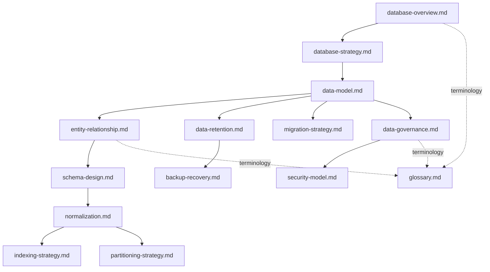

# 04_Database

## 1. Overview

This folder contains the official Database Architecture documentation for **StackLeo Tech Store**. It defines how the platform's business data is modeled, structured, secured, governed, and operated over time — translating the conceptual `domain-model.md` and `data-flow.md` documents in `03_System_Design` into a dedicated, database-focused architectural view.

This README is the navigation hub for `04_Database`. It explains the purpose of each document, the recommended reading order, and how this folder relates to the rest of the repository. It does not itself contain implementation detail: no SQL scripts, ORM code, or migrations appear anywhere in this folder — those belong to dedicated engineering documentation outside this repository's architecture layers.

## 2. Objectives

The documentation in `04_Database` exists to ensure the platform's data foundation achieves:

- **Data Integrity** — business data accurately and consistently represents real-world business facts, enforced through disciplined modeling and constraints.
- **Scalability** — the data architecture can grow from MVP through enterprise and marketplace scale without requiring a fundamental redesign, consistent with `03_System_Design/scalability-strategy.md`.
- **Security** — sensitive business and customer data is protected by design, consistent with `03_System_Design/architecture-principles.md` (Security by Design).
- **Performance** — data access patterns are structured to meet the responsiveness expectations defined in `02_Product/non-functional-requirements.md`.
- **Reliability** — data remains available, recoverable, and durable under both normal operation and failure conditions.
- **Maintainability** — the data model remains comprehensible and safely evolvable as the platform's business capability grows.
- **Governance** — data ownership, quality, retention, and access are formally and consistently governed, not left to ad hoc practice.

## 3. Documentation Guide

| Document | Description |
|---|---|
| `database-overview.md` | Introduces the database architecture's purpose, scope, and place within the overall system architecture. |
| `database-strategy.md` | Defines the high-level strategic approach to data storage, technology selection rationale, and evolution over time. |
| `data-model.md` | Defines the logical data model realizing the conceptual `domain-model.md` entities as structured data. |
| `entity-relationship.md` | Documents the relationships between data entities at a logical, implementation-independent level. |
| `schema-design.md` | Defines the logical schema organization principles governing how data is structured and grouped. |
| `normalization.md` | Explains the normalization approach applied to the data model and the rationale behind it. |
| `indexing-strategy.md` | Defines the conceptual approach to indexing for query performance. |
| `partitioning-strategy.md` | Defines the conceptual approach to partitioning data for scalability and manageability. |
| `data-retention.md` | Defines how long each category of business data is retained and why. |
| `backup-recovery.md` | Defines the backup and recovery strategy protecting business data against loss. |
| `migration-strategy.md` | Defines the strategic approach to evolving the data model safely over time. |
| `data-governance.md` | Defines data ownership, stewardship, quality, and lifecycle governance. |
| `security-model.md` | Defines how data is protected — access control, encryption, and auditability — at the database layer. |
| `glossary.md` | Defines database and data-architecture-specific terminology, extending `03_System_Design/glossary.md`. |

## 4. Reading Order

| Order | Document | Why This Order |
|---|---|---|
| 1 | `database-overview.md` | Establishes the purpose and scope of the database architecture. |
| 2 | `database-strategy.md` | Establishes the strategic direction before detailed modeling begins. |
| 3 | `data-model.md` | Defines the logical entities the rest of this folder builds upon. |
| 4 | `entity-relationship.md` | Elaborates how those entities relate to one another. |
| 5 | `schema-design.md` | Defines how the data model is organized into a coherent schema structure. |
| 6 | `normalization.md` | Explains the structural discipline applied to the schema. |
| 7 | `indexing-strategy.md` | Addresses how the schema is optimized for query performance. |
| 8 | `partitioning-strategy.md` | Addresses how the schema is organized for scalability. |
| 9 | `data-retention.md` | Defines how long data defined in the model is kept. |
| 10 | `backup-recovery.md` | Defines how that data is protected against loss. |
| 11 | `migration-strategy.md` | Defines how the model evolves safely over time. |
| 12 | `data-governance.md` | Establishes ownership and stewardship over everything defined above. |
| 13 | `security-model.md` | Defines how all of the above is protected from unauthorized access. |
| 14 | `glossary.md` | Consolidates terminology encountered throughout. |

This order mirrors the natural progression of database architectural reasoning: establish purpose and strategy first, define the logical model and its relationships, address structural and performance concerns, then address the data's lifecycle, protection, evolution, and governance — concluding with shared terminology.

*Diagram: Document Relationship Map for `04_Database`.*

## 5. Relationship with Other Folders

| Folder | Relationship |
|---|---|
| `02_Product` | Functional and non-functional requirements (`functional-requirements.md`, `non-functional-requirements.md`) define the business behavior and quality expectations the data architecture must support. |
| `03_System_Design` | `domain-model.md` and `data-flow.md` provide the conceptual entities, relationships, and information movement that `04_Database` translates into a concrete logical data architecture; `bounded-contexts.md` informs data ownership boundaries. |
| `05_API` | The API layer exposes data governed by this folder's model; API design must remain consistent with the entity and relationship definitions established here. |
| `07_Backend` | Backend services implement the data access patterns and business logic operating against the schema defined in this folder. |
| `09_Security` | Security architecture at the platform level builds on the security model defined in `security-model.md`, ensuring consistent protection from application through data layer. |
| `11_Deployment` | Deployment architecture provisions the infrastructure hosting the database, informed by the scalability, partitioning, and backup/recovery strategies defined here. |

## 6. Database Principles

- **Single Source of Truth** — every business fact has exactly one authoritative origin, consistent with the ownership model established in `03_System_Design/data-flow.md` (Section 2).
- **Data Ownership** — each bounded context owns the data corresponding to its domain, per `03_System_Design/bounded-contexts.md`, preventing competing, inconsistent copies of the same fact.
- **Normalization** — data structure avoids unnecessary duplication and inconsistency, applied deliberately per `normalization.md`, balanced against performance needs where justified.
- **Scalability** — the data architecture is designed to grow across the stages defined in `03_System_Design/scalability-strategy.md`, from MVP through enterprise and global operation.
- **Security by Design** — data protection is embedded in the model from the outset, not layered on afterward, consistent with `03_System_Design/architecture-principles.md`.
- **Data Lifecycle** — every category of business data has a deliberate, documented lifecycle — creation, active use, and eventual archival or removal — rather than being retained indefinitely by default.

## 7. Governance

- **Ownership** — the Database Architect (or, at current organizational scale, the Solution Architect acting in that capacity) owns the coherence and accuracy of `04_Database`, in partnership with the Data Steward function defined in `data-governance.md`.
- **Review Process** — this folder's documentation is reviewed at the conclusion of each phase defined in `02_Product/product-roadmap.md`, and whenever `03_System_Design/domain-model.md` or `bounded-contexts.md` changes materially.
- **Versioning** — every document in this folder follows the Semantic Versioning approach defined in `00_Project_Overview/changelog.md`.
- **Documentation Standards** — every document follows the enterprise Markdown conventions established across this repository: numbered sections, Markdown tables for structured data, Mermaid diagrams for visual relationships, and a closing Document Information table.

### Governance Summary

| Aspect | Description |
|---|---|
| Ownership | Database Architect / Solution Architect, with Data Steward support |
| Review Cadence | End of each `product-roadmap.md` phase; upon material domain model change |
| Versioning | Semantic Versioning, per `00_Project_Overview/changelog.md` |
| Change Record | All material changes recorded in `00_Project_Overview/changelog.md` |
| Compliance Alignment | Reviewed against `01_Business/business-rules.md` (Section 17, Compliance Rules) and applicable Bangladesh data regulation |

## 8. Document Information

| Property | Value |
|----------|-------|
| Folder | 04_Database |
| Version | 1.0.0 |
| Status | Active |
| Maintained By | StackLeo |
| Last Updated | 2026-07-17 |

---

© StackLeo. All Rights Reserved.
