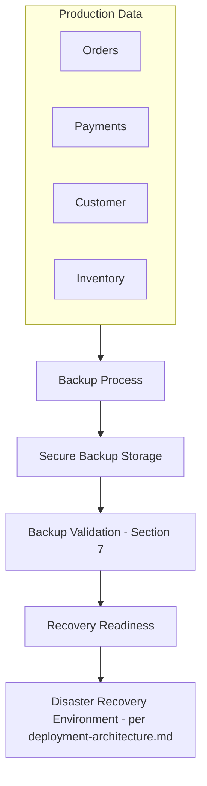
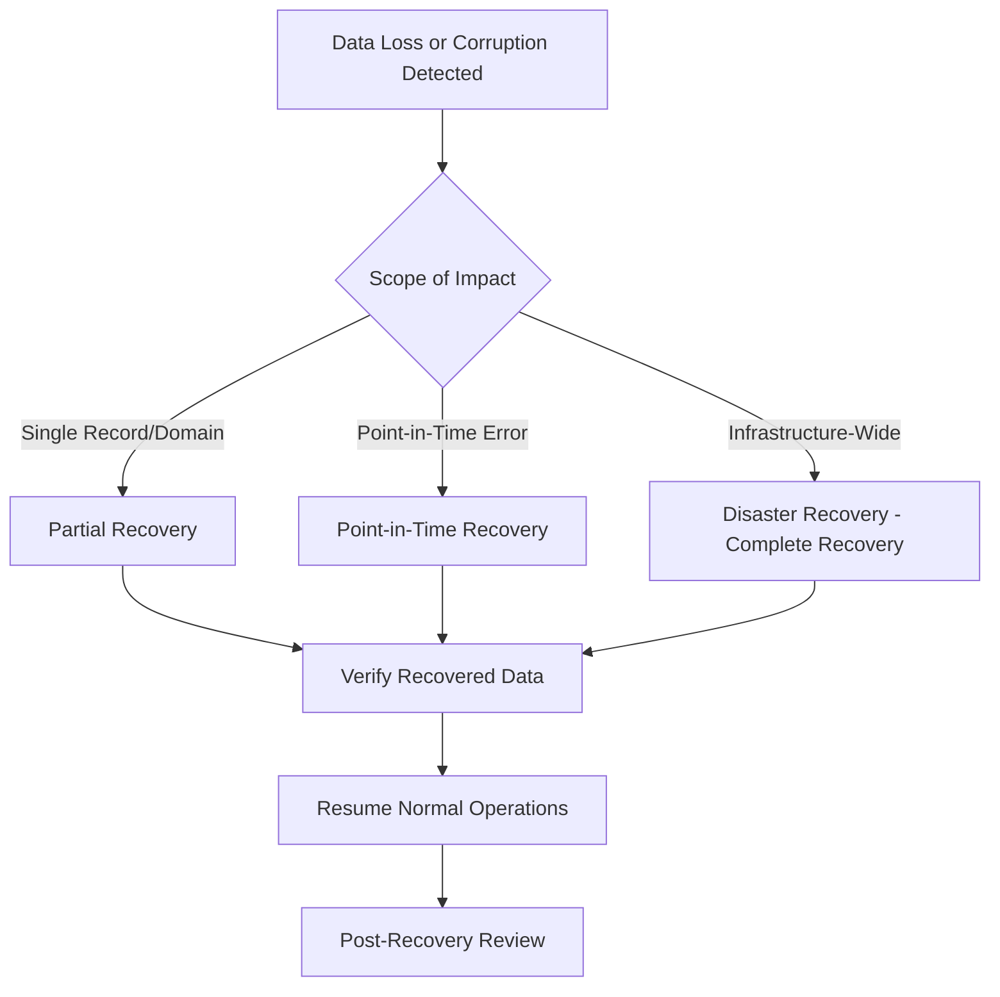
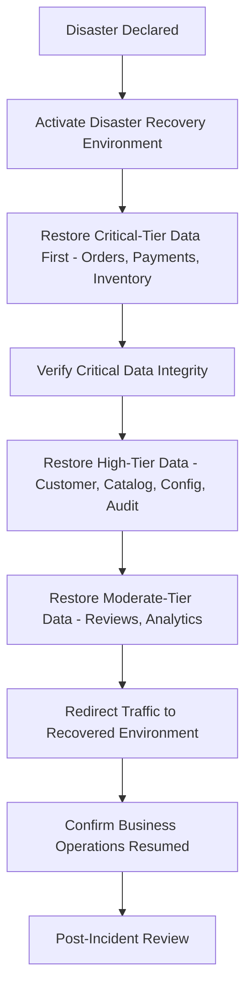
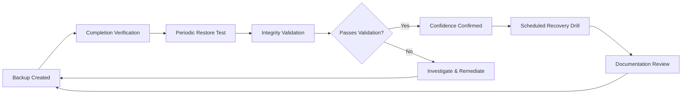

# Backup & Recovery Strategy

## 1. Document Purpose

This document is the official Backup & Recovery Strategy for **StackLeo Tech Store**. It defines how business-critical data is protected, backed up, validated, restored, and recovered to support business continuity and disaster recovery.

- **Purpose of Backups** — to ensure that a technical failure, human error, or incident never results in the permanent loss of business-critical data (Orders, Payments, Customer accounts, Inventory).
- **Relationship with Business Continuity** — backup and recovery capability is a precondition for StackLeo's ability to continue operating, or resume operating quickly, following a significant disruption.
- **Relationship with Disaster Recovery** — this document elaborates the backup and recovery foundation that `03_System_Design/deployment-architecture.md` (Section 10) references at the infrastructure level, providing the data-specific detail behind it.
- **Relationship with Data Governance** — backup and recovery practice is governed consistent with `data-governance.md`, ensuring accountability for what is protected, how, and by whom.
- **Relationship with Operational Resilience** — backup and recovery is one pillar of the broader reliability strategy defined in `03_System_Design/quality-attributes.md` (Section 6) and `architecture-principles.md` (Section 9).

This document is implementation-independent and vendor-neutral. It does not recommend specific backup products, define exact backup schedules or timings, or include SQL, scripts, or automation code — it defines backup and recovery strategy conceptually.

## 2. Backup Philosophy

- **Data Protection** — business-critical data is protected against loss as a default architectural property, not an optional add-on.
- **Business Continuity** — backups exist to serve the business's ability to continue operating, not as an isolated technical checkbox.
- **Defense in Depth** — backup strategy is one layer among several (validation, replication, monitoring) protecting against data loss, consistent with `03_System_Design/architecture-principles.md` (ARCH-035).
- **Recovery Readiness** — a backup is only as valuable as StackLeo's demonstrated ability to actually restore from it (Section 7); backup creation alone is not the goal.
- **Reliability** — backup and recovery processes themselves must be dependable, not merely assumed to work.
- **Security by Design** — backups are protected with the same rigor as the primary data they represent (Section 8), since a backup is itself a full copy of sensitive business data.
- **Backup Verification** — every backup's integrity and restorability is periodically verified (Section 7), not simply assumed based on successful completion of the backup process.
- **Least Privilege** — access to backup data and recovery capability is scoped to the minimum set of roles genuinely requiring it, consistent with ARCH-033.

*Diagram: Backup & Recovery Architecture.*

## 3. Backup Objectives

- **Recovery Point Objective (RPO)** — the concept describing the maximum acceptable amount of data loss, measured as a point in time; a lower RPO means less data can be acceptably lost in a recovery scenario.
- **Recovery Time Objective (RTO)** — the concept describing the maximum acceptable duration between an incident occurring and service being restored.
- **Backup Availability** — backups must themselves be available when needed for recovery, not merely created and forgotten.
- **Recovery Reliability** — the recovery process must work consistently and predictably when invoked, not only under ideal conditions.
- **Recovery Confidence** — StackLeo's confidence in its ability to recover is built through demonstrated testing (Section 7), not assumed from the existence of a backup process.
- **Operational Readiness** — the organization (not just the technology) is prepared to execute a recovery, with clear roles and documented procedure (Section 10).

Specific numeric RPO and RTO targets per data category are defined and maintained through dedicated operational planning, consistent with `02_Product/non-functional-requirements.md` (NFR-059); this document defines the concepts and the business priority differentiation (Section 5) that inform those targets, without prescribing exact values or schedules.

## 4. Backup Categories

| Category | Business Purpose | Benefits | Trade-offs | Recovery Considerations |
|---|---|---|---|---|
| Full Backup | A complete copy of all protected data at a point in time. | Simplest to understand and restore from; a single complete reference point. | Highest storage and processing cost per backup event. | Fastest, simplest recovery path since no reconstruction from multiple sources is needed. |
| Incremental Backup | Captures only the data that changed since the most recent backup of any kind. | Lowest ongoing storage and processing cost. | Recovery requires reconstructing state from a chain of backups, increasing recovery complexity. | Recovery time grows with the length of the incremental chain since the last full backup. |
| Differential Backup | Captures all data that changed since the most recent full backup. | Faster recovery than incremental (only two backups needed: full plus latest differential). | Higher ongoing storage cost than incremental, as each differential grows until the next full backup. | Simpler recovery than incremental, more storage-efficient than repeated full backups. |
| Snapshot-Based Backup | A point-in-time capture of the data's state, typically created with minimal disruption to ongoing operations. | Fast to create; minimal impact on live operations during capture. | May require underlying platform support; conceptually distinct from traditional file-based backup. | Enables fast point-in-time recovery (Section 6) with minimal reconstruction. |
| Archive Backup | A backup retained specifically for long-term, infrequently accessed reference, aligned with `data-retention.md` (Section 5). | Cost-optimized for data unlikely to require near-term recovery. | Recovery from archive is typically slower than from active backup tiers. | Used for historical or compliance-driven recovery scenarios, not operational continuity. |
| Long-Term Backup | A backup retained across an extended horizon to satisfy compliance or historical business need. | Provides assurance against very-long-horizon loss scenarios. | Highest cumulative storage cost over time; requires disciplined lifecycle management. | Recovery scenarios are rare and typically compliance- or dispute-driven rather than operational. |

### Backup Categories Comparison

| Category | Storage Cost | Recovery Speed | Primary Use Case |
|---|---|---|---|
| Full Backup | High | Fast | Primary recovery baseline |
| Incremental Backup | Low | Slower (chain reconstruction) | Frequent, low-cost interim protection |
| Differential Backup | Moderate | Moderate | Balance between cost and recovery speed |
| Snapshot-Based Backup | Moderate | Fast | Minimal-disruption point-in-time capture |
| Archive Backup | Low (long-term) | Slow | Long-term, infrequent-access reference |
| Long-Term Backup | Cumulative | Slow | Compliance and historical assurance |

## 5. Data Protection Strategy

| Data Category | Protection Approach | Business Priority |
|---|---|---|
| Transactional Data | Protected with the strongest recovery guarantees; recoverable with minimal data loss. | Critical |
| Customer Data | Protected with strong recovery guarantees and strict access control, consistent with `security-model.md`. | Critical |
| Product Catalog | Protected with strong recovery guarantees; catalog accuracy directly affects customer trust. | High |
| Inventory | Protected with strong recovery guarantees; inconsistent inventory recovery risks overselling. | Critical |
| Orders | Protected with the strongest recovery guarantees as StackLeo's authoritative transactional record. | Critical |
| Payments | Protected with the strongest recovery guarantees given financial and compliance significance. | Critical |
| Reviews | Protected with standard recovery guarantees; public content with lower urgency than transactional data. | Moderate |
| Audit Records | Protected with strong, immutable-aware recovery guarantees, consistent with `data-retention.md` (Section 3). | High |
| Configuration Data | Protected with strong recovery guarantees; misconfiguration recovery directly affects platform operation. | High |
| Analytics Data | Protected with standard recovery guarantees; often reconstructable from underlying transactional sources if needed. | Moderate |

### Protected Data Matrix

| Data Category | Recovery Priority Tier | Data Loss Tolerance |
|---|---|---|
| Orders, Payments, Inventory | Tier 1 (Critical) | Minimal tolerance |
| Customer Data, Product Catalog, Configuration Data, Audit Records | Tier 2 (High) | Low tolerance |
| Reviews, Analytics Data | Tier 3 (Moderate) | Moderate tolerance |

## 6. Recovery Strategy

- **Complete Recovery** — restoring the entire protected data set, typically following a severe, wide-reaching incident.
- **Partial Recovery** — restoring a specific data category or domain (e.g., only Inventory) without affecting unrelated, healthy data.
- **Point-in-Time Recovery (Concept)** — restoring data to its state at a specific prior moment, useful when an error (e.g., a flawed data change) needs to be undone without losing all subsequent legitimate activity.
- **Disaster Recovery** — recovery following a significant infrastructure-level incident, coordinated with the Disaster Recovery environment defined in `03_System_Design/deployment-architecture.md` (Section 10).
- **Business Recovery** — recovery framed around restoring the ability to conduct core business operations (per `quality-attributes.md`, Section 5), not merely restoring raw data.
- **Operational Recovery** — recovery from routine, smaller-scale operational issues (e.g., accidental deletion of a single record), typically faster and narrower in scope than disaster recovery.

### Recovery Scenarios

| Scenario | Recovery Type | Priority |
|---|---|---|
| Accidental deletion of a single Customer record | Operational, Partial Recovery | High |
| Data corruption affecting Product Catalog | Partial Recovery, Point-in-Time | High |
| Flawed administrative change to pricing | Point-in-Time Recovery | Critical |
| Infrastructure-level outage affecting the primary database | Disaster Recovery, Complete Recovery | Critical |
| Regional infrastructure disruption (Future, multi-region) | Disaster Recovery | Critical |
| Long-past dispute requiring historical Order data | Archive Recovery | Low urgency, high accuracy requirement |

*Diagram: Recovery Decision Workflow.*

*Diagram: Disaster Recovery Process.*

## 7. Backup Validation & Testing

- **Restore Testing** — backups are periodically restored, not merely created, to confirm they genuinely function when needed.
- **Backup Verification** — each backup's completion is verified against expected scope and size, catching silent failures early.
- **Integrity Validation** — restored data is checked against expected structure and content to confirm it has not been corrupted.
- **Recovery Drills** — periodic, planned exercises simulate a real recovery scenario, validating both the technical process and the organizational readiness (Section 10) to execute it.
- **Documentation Reviews** — recovery procedures are reviewed for accuracy and clarity alongside each drill, ensuring they remain usable under real incident pressure.
- **Continuous Improvement** — findings from validation, drills, and any real recovery event feed back into improving backup and recovery practice.

### Backup Validation Checklist

| Validation Activity | Purpose |
|---|---|
| Backup completion verification | Confirm each backup completed successfully and within expected scope. |
| Periodic restore testing | Confirm backups are genuinely restorable, not just created. |
| Integrity validation post-restore | Confirm restored data matches expected structure and content. |
| Recovery drill execution | Validate both technical process and organizational readiness. |
| Recovery documentation review | Ensure procedures remain accurate and usable. |
| Post-drill/incident retrospective | Capture lessons learned for continuous improvement. |

*Diagram: Backup Validation Cycle.*

## 8. Backup Security

- **Encryption Concepts** — backups are encrypted, both in transit during creation/transfer and at rest in storage, consistent with `02_Product/non-functional-requirements.md` (NFR-027).
- **Access Control** — access to backup data and recovery capability is restricted to roles with a genuine, defined need, consistent with least privilege (ARCH-033).
- **Backup Isolation** — backups are stored separately from the primary production data they protect, so that an incident affecting production does not also compromise its backups.
- **Immutable Backup Readiness** — the backup strategy anticipates immutability (backups that cannot be altered or deleted once created) as a future protection against malicious or accidental backup tampering.
- **Auditability** — access to and use of backup data is logged, consistent with `security-model.md` and `data-retention.md` (Section 6).
- **Secure Storage** — backup storage locations meet the same security standards as primary data storage, per `03_System_Design/deployment-architecture.md` (Section 9).

## 9. Future Evolution

| Future Direction | Backup & Recovery Strategy Readiness |
|---|---|
| Multi-Region | Backup and recovery strategy extends naturally to per-region backups alongside cross-region replication, per `03_System_Design/scalability-strategy.md` (Section 7). |
| Multi-Cloud | Backup strategy remains provider-neutral, preserving the option to distribute backup storage across more than one provider. |
| Marketplace | Vendor and Marketplace Order data (Future) follow the same Tier 1/Critical protection pattern as Orders and Payments once active. |
| AI-Assisted Recovery | Backup validation and anomaly detection (Section 7) are natural candidates for future AI-assisted monitoring, consistent with `03_System_Design/observability.md` (Section 11). |
| Automated Recovery | Recovery workflows (Section 6) are designed to be progressively automated as confidence and tooling maturity grow, without changing the underlying recovery philosophy. |
| Global Expansion | Backup and recovery principles remain consistent across new markets, with region-specific considerations layered on per `data-retention.md` (Section 9). |

## 10. Governance

- **Ownership** — the Database Architect, in partnership with the DevOps Lead, owns backup and recovery strategy and its execution.
- **Recovery Reviews** — recovery readiness is reviewed following every recovery drill (Section 7) and at the conclusion of each phase defined in `02_Product/product-roadmap.md`.
- **Backup Audits** — backup coverage and validation history are periodically audited against the Protected Data Matrix (Section 5).
- **Documentation Standards** — this document follows the enterprise Markdown conventions established across this repository.
- **Change Management** — material changes to backup or recovery strategy are recorded in `00_Project_Overview/changelog.md`.
- **Versioning** — this document follows the Semantic Versioning approach defined in `00_Project_Overview/changelog.md`.

### Governance Responsibilities

| Role | Responsibility |
|---|---|
| Database Architect | Owns backup and recovery strategy coherence and its alignment with `database-strategy.md`. |
| DevOps Lead | Owns execution of backup processes and recovery drills. |
| Security Lead | Ensures backup security practices (Section 8) remain effective. |
| QA Lead | Validates recovery outcomes during drills against expected data integrity. |
| Founder / Business Owner | Approves disaster recovery activation for significant incidents. |

## 11. Anti-Patterns

| Anti-Pattern | Why It Is Avoided |
|---|---|
| Never Testing Backups | A backup that has never been restored is an unverified assumption, not a genuine safeguard (Section 7). |
| Single Backup Location | Storing backups only alongside the primary data they protect risks losing both together in a single incident (Section 8, Backup Isolation). |
| No Recovery Documentation | Undocumented recovery procedures cannot be reliably executed under the pressure of a real incident. |
| Missing Validation | Backups created without integrity verification may silently fail without anyone noticing until recovery is actually needed. |
| Excessive Recovery Time | A recovery process that takes far longer than the business can tolerate defeats the purpose of having a recovery capability at all. |
| Insecure Backup Storage | A backup is a full copy of sensitive data; storing it insecurely creates a parallel security exposure to the primary data itself. |
| Assuming Backup Equals Recovery | Creating a backup successfully does not guarantee a successful recovery; the two must be validated together (Section 7). |

### Anti-Pattern Summary

| Anti-Pattern | Primary Risk | Mitigation |
|---|---|---|
| Never Testing Backups | False confidence in unverified protection | Require periodic restore testing (Section 7) |
| Single Backup Location | Correlated loss of data and its backup | Enforce backup isolation (Section 8) |
| No Recovery Documentation | Slow, error-prone recovery under pressure | Maintain and review recovery documentation (Section 7) |
| Missing Validation | Undetected backup failure | Require completion and integrity verification (Section 7) |
| Excessive Recovery Time | Recovery capability that doesn't meet business need | Align recovery approach with RTO concepts (Section 3) |
| Insecure Backup Storage | Parallel security exposure | Apply the same security rigor as primary data (Section 8) |
| Assuming Backup Equals Recovery | Recovery failure discovered only during a real incident | Validate recovery, not just backup creation (Section 7) |

## 12. Document Information

| Property | Value |
|----------|-------|
| Document | backup-recovery.md |
| Version | 1.0.0 |
| Status | Active |
| Maintained By | StackLeo |
| Last Updated | 2026-07-17 |

---

© StackLeo. All Rights Reserved.
