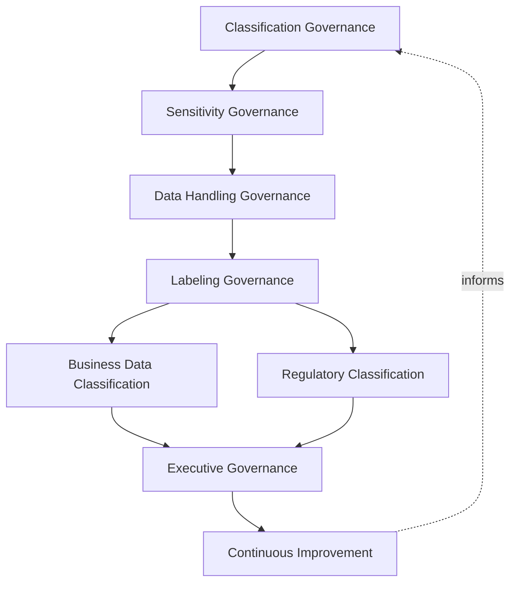
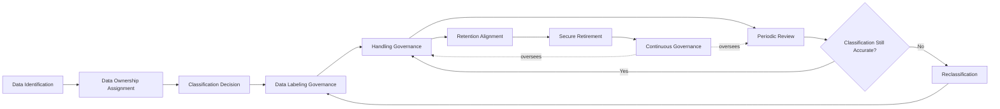
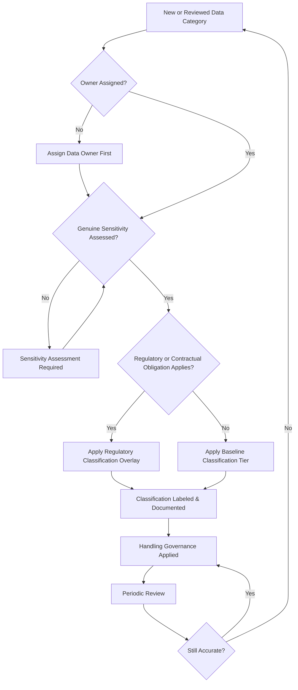
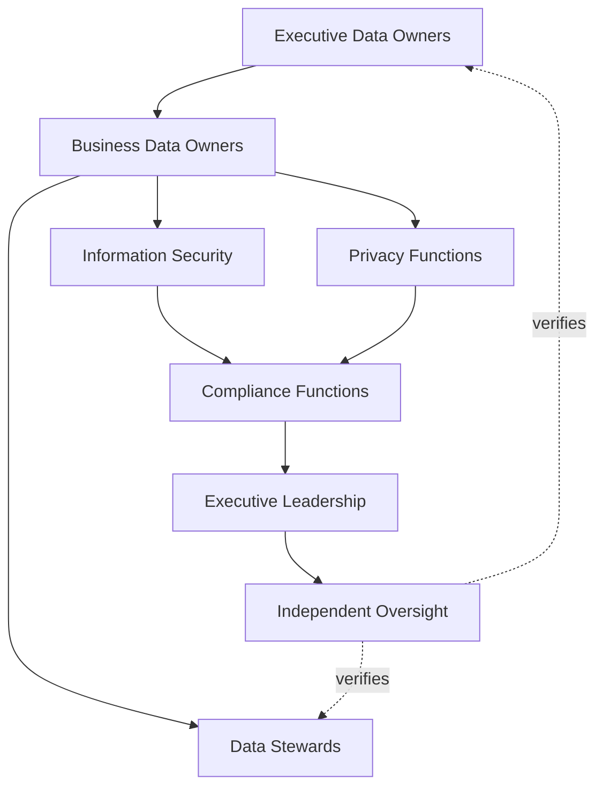
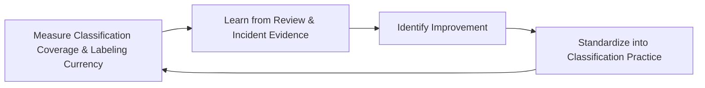
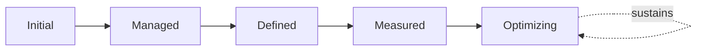

# Enterprise Data Classification & Handling Governance Strategy

## 1. Document Purpose

This document defines the official Enterprise Data Classification & Handling Governance Strategy for **StackLeo Tech Store** — the CDO/CISO/CPO-owned executive charter under which every category of business data is assessed for sensitivity, assigned a consistent classification, and governed toward handling proportionate to that classification. It establishes data classification governance, data sensitivity governance, data handling governance, labeling governance, ownership accountability, executive oversight, and long-term data classification maturity, consistent with DAMA-DMBOK, ISO/IEC 38505 (Governance of Data), ISO/IEC 27001, and TOGAF enterprise architecture thinking.

Classification is the mechanism that makes every other data governance and protection commitment consistently actionable. `data-governance.md` (Section 4) establishes StackLeo's foundational classification tiers; this strategy is the dedicated governance elaboration of that thread — referenced by `data-governance-strategy.md` and coordinated with `06_Security/security-standards.md` and `06_Security/security-controls-framework.md`, which translate a given classification into the specific protective baseline it requires — because classification carries enough distinct process, consistency, and accountability weight to warrant its own governance treatment.

- **Purpose of Data Classification Governance** — to ensure every category of data is deliberately assessed for its genuine business sensitivity and consistently classified, so that handling, protection, and access decisions elsewhere in the organization can be applied proportionately rather than uniformly or arbitrarily.
- **Relationship with Enterprise Data Governance** — this strategy is the classification-specific elaboration of `data-governance-strategy.md`; where that strategy governs data as a whole, this document governs specifically how each data category's sensitivity is assessed and labeled.
- **Relationship with Information Security** — classification is the input every technical protection decision depends on; this strategy does not define protective controls itself, but ensures `06_Security/security-controls-framework.md` and `06_Security/security-standards.md` always have a genuine, consistent classification to apply their protective baseline against.
- **Relationship with Privacy Governance** — Personal Data (Section 4.7) is a distinct classification category with obligations coordinated directly with `06_Security/privacy.md` and `06_Security/data-protection.md`, ensuring classification and privacy discipline reinforce rather than duplicate one another.
- **Relationship with Compliance Governance** — Regulated Data (Section 4.5) classification provides the structural link between a data category and the specific regulatory or contractual obligation tracked in `06_Security/compliance.md` that governs it.
- **Relationship with Risk Management** — unclassified or inconsistently classified data is a distinct, tracked risk category within `06_Security/risk-management.md` and `06_Security/security-risk-management.md`, since protection decisions cannot be proportionate without a genuine classification to reference.
- **Relationship with Enterprise Governance** — data classification governance is not a separate structure from how StackLeo governs the rest of the business; it is the classification-specific application of the same executive accountability, policy discipline, and control assurance applied enterprise-wide in `06_Security/policy-management.md` and `06_Security/internal-controls.md`.

This document is implementation-independent and vendor-neutral. It defines data classification governance philosophy, model, levels, and lifecycle conceptually — not specific DLP products, data discovery tools, cloud providers, document management systems, encryption vendors, consulting firms, security products, classification labels for specific technologies, encryption implementations, storage architectures, infrastructure configurations, deployment architectures, operational handling procedures, or code.

## 2. Data Classification Philosophy

Data classification governance at StackLeo rests on eight principles. Each exists to produce a specific business outcome — data is classified deliberately because not all data carries the same consequence if mishandled, and treating it as though it did wastes protection where it is not needed and under-protects where it is.

### 2.1 Data Has Different Business Value

Not every data category carries the same consequence if exposed, altered, or lost; classification exists to make that difference explicit and actionable.

- **Business Value** — ensures protection effort is directed where genuine consequence justifies it, rather than spread uniformly regardless of actual stakes.

### 2.2 Classification Before Protection

A data category's classification is established before, and independently of, the specific protective measures applied to it.

- **Business Value** — ensures protection decisions rest on a deliberate sensitivity assessment, not an assumption made in the course of implementation.

### 2.3 Risk-Based Classification

Classification decisions weigh the genuine business, legal, and reputational impact of mishandling, not administrative convenience or habit.

- **Business Value** — ensures classification reflects actual consequence, keeping downstream handling proportionate to genuine risk.

### 2.4 Accountability

Every classification decision traces to a specific, named, responsible party.

- **Business Value** — ensures every classification has someone genuinely responsible for defending its continued accuracy.

### 2.5 Data Ownership

Every data category's classification is assigned and maintained by its accountable data owner, never left to be inferred informally by whoever happens to handle it.

- **Business Value** — ensures classification decisions are made by the party genuinely positioned to judge the data's business sensitivity.

### 2.6 Governance by Design

Classification governance structures are established deliberately as a new data category is introduced, not retrofitted once unclassified data has already accumulated.

- **Business Value** — prevents the costly, high-visibility discovery of classification gaps only after an incident has already demonstrated their absence.

### 2.7 Business Alignment

Classification governance decisions are made in service of genuine business need, never imposed as friction disconnected from real operational purpose.

- **Business Value** — keeps classification genuinely followed rather than resented as bureaucratic overhead.

### 2.8 Continuous Improvement

Classification governance practice matures over time, informed by real review findings, incidents, and the organization's growth in scale and complexity.

- **Business Value** — keeps classification governance aligned with StackLeo's growth in data volume, business model complexity, and regulatory reach.

## 3. Enterprise Data Classification Governance Model

Data classification governance operates across eight conceptual layers, each holding accountability for a distinct dimension of classification practice.

### 3.1 Classification Governance

- **Purpose** — own the overall coherence of how data is assessed and assigned a classification across the platform.
- **Governance Scope** — oversight spanning every layer in this model and every level in Section 4.
- **Business Value** — ensures classification operates as a single coherent discipline, not a collection of disconnected local judgments.
- **Executive Expectations** — leadership trusts no data category exists without a deliberately assigned classification.

### 3.2 Sensitivity Governance

- **Purpose** — own the coherence of how genuine business, legal, and reputational sensitivity is assessed for a given data category.
- **Governance Scope** — oversight of sensitivity assessment across every level in Section 4, consistent with Risk-Based Classification (Section 2.3).
- **Business Value** — ensures classification decisions reflect actual consequence, not a generic or default assumption.
- **Executive Expectations** — leadership trusts sensitivity assessments are genuinely reasoned, not assigned by rote.

### 3.3 Data Handling Governance

- **Purpose** — own the coherence of how a data category's classification translates into expected handling behavior.
- **Governance Scope** — oversight of handling expectations across every level, applied without prescribing specific technical controls.
- **Business Value** — ensures classification has a genuine behavioral consequence, not merely a label with no practical effect.
- **Executive Expectations** — leadership trusts a data category's classification reliably predicts how it is actually handled.

### 3.4 Labeling Governance

- **Purpose** — own the coherence of how classification decisions are recorded and communicated so they can be relied upon by anyone handling the data.
- **Governance Scope** — oversight of labeling consistency and currency across every domain.
- **Business Value** — ensures a data category's classification is discoverable and unambiguous to anyone who needs to know it.
- **Executive Expectations** — leadership trusts labels remain accurate and are never allowed to silently go stale.

### 3.5 Business Data Classification

- **Purpose** — own the coherence of how classification is applied specifically to core commerce and operational data.
- **Governance Scope** — oversight of Confidential and Internal data arising from ordinary business operations (Sections 4.2–4.3).
- **Business Value** — ensures the day-to-day data volume the business generates receives consistent classification treatment.
- **Executive Expectations** — leadership trusts business-generated data is classified as a routine part of its creation, not as an afterthought.

### 3.6 Regulatory Classification

- **Purpose** — own the coherence of how classification reflects specific regulatory or contractual obligation.
- **Governance Scope** — oversight of Regulated, Financial, and Personal Data (Sections 4.5–4.7), coordinated with `06_Security/compliance.md`.
- **Business Value** — ensures the data categories carrying the greatest external obligation receive classification traceable to that obligation.
- **Executive Expectations** — leadership expects regulatory classification to be reviewed whenever applicable obligations change.

### 3.7 Executive Governance

- **Purpose** — own executive-level accountability for the classification decisions carrying the greatest organizational consequence.
- **Governance Scope** — oversight spanning Sections 3.1–3.6 wherever a classification matter rises to genuine executive concern.
- **Business Value** — ensures the most consequential classification decisions are visible at the level accountable for organizational risk.
- **Executive Expectations** — leadership expects to be informed of, not surprised by, the platform's highest-sensitivity data.

### 3.8 Continuous Improvement

- **Purpose** — govern the mechanism by which every other layer in this model matures over time.
- **Governance Scope** — consolidates findings from classification reviews, audits, and incidents across every level in Section 4.
- **Business Value** — prevents classification governance itself from becoming the next thing that quietly stagnates as the organization scales.
- **Executive Expectations** — leadership expects classification maturity to be assessed periodically, not assumed static once established.

### Enterprise Data Classification Governance Matrix

| Layer | Purpose | Business Value | Executive Expectations |
|---|---|---|---|
| Classification Governance | Own overall coherence of how data is classified | Ensures classification operates as a single coherent discipline | Trusts no data category exists without a deliberate classification |
| Sensitivity Governance | Own coherence of how sensitivity is assessed | Ensures decisions reflect actual consequence, not assumption | Trusts assessments are genuinely reasoned, not assigned by rote |
| Data Handling Governance | Own coherence of how classification drives handling | Ensures classification has a genuine behavioral consequence | Trusts classification reliably predicts actual handling |
| Labeling Governance | Own coherence of how classification is recorded and communicated | Ensures classification is discoverable and unambiguous | Trusts labels remain accurate and never go stale |
| Business Data Classification | Own coherence of classification for core commerce data | Ensures day-to-day business data receives consistent treatment | Trusts business data is classified as routine, not an afterthought |
| Regulatory Classification | Own coherence of classification tied to specific obligation | Ensures highest-obligation data traces to its specific obligation | Expects review whenever applicable obligations change |
| Executive Governance | Own executive accountability for highest-consequence decisions | Ensures the most consequential decisions are visible to leadership | Expects leadership informed of, not surprised by, top-sensitivity data |
| Continuous Improvement | Govern maturation of every other layer | Prevents governance itself from stagnating | Expects maturity to be assessed periodically |

*Diagram 1: Enterprise Data Classification Governance Framework — classification and sensitivity governance establish the foundation, handling and labeling governance make classification actionable, business and regulatory classification apply it across data categories, and executive oversight converges on continuous improvement that feeds back into the model.*

## 4. Enterprise Data Classification Levels

Data classification is governed across ten conceptual levels. The first four form StackLeo's baseline sensitivity tiers, consistent with `data-governance.md` (Section 4); the remaining six are cross-cutting categories that combine with a baseline tier to reflect additional regulatory, financial, or operational context.

### 4.1 Public Data

- **Purpose** — represent data intended for open, unrestricted visibility.
- **Governance Considerations** — governed under Business Data Classification (Section 3.5), with the lowest handling burden in this model.
- **Business Importance** — supports open commerce activity — catalog browsing, published reviews — with no confidentiality constraint.
- **Executive Expectations** — leadership expects Public classification to be applied deliberately, never as a default for data that was simply never assessed.

### 4.2 Internal Data

- **Purpose** — represent data not intended for external exposure but not highly sensitive.
- **Governance Considerations** — governed under Business Data Classification (Section 3.5), accessible to authenticated internal staff by default.
- **Business Importance** — supports day-to-day internal operation without imposing Confidential-level handling burden where it is not warranted.
- **Executive Expectations** — leadership expects Internal data to remain within internal systems absent a deliberate decision to publish it.

### 4.3 Confidential Data

- **Purpose** — represent data whose unauthorized exposure could harm customers or the business.
- **Governance Considerations** — governed under Business Data Classification (Section 3.5), accessible only to roles with a specific, defined business need.
- **Business Importance** — protects customer and business information whose exposure would cause genuine, if not catastrophic, harm.
- **Executive Expectations** — leadership expects Confidential data access to be logged and reviewable.

### 4.4 Restricted Data

- **Purpose** — represent data whose unauthorized exposure could cause serious financial, legal, or reputational harm.
- **Governance Considerations** — governed under Sensitivity Governance (Section 3.2), receiving the strictest handling expectations of the four baseline tiers.
- **Business Importance** — protects the organization's most consequential data from its most severe category of potential harm.
- **Executive Expectations** — leadership expects Restricted data access to require explicit approval and mandatory audit logging.

### 4.5 Regulated Data

- **Purpose** — represent data subject to a specific external regulatory or contractual obligation, layered atop a baseline sensitivity tier.
- **Governance Considerations** — governed under Regulatory Classification (Section 3.6), coordinated with `06_Security/compliance.md`.
- **Business Importance** — protects the business's standing with regulators and enterprise/corporate customers who impose contractual data obligations.
- **Executive Expectations** — leadership expects Regulated data to be explicitly traceable to the specific obligation that governs it.

### 4.6 Financial Data

- **Purpose** — represent payment, refund, and financial reconciliation data, layered atop the Restricted baseline tier.
- **Governance Considerations** — governed under Regulatory Classification (Section 3.6), receiving the highest combined sensitivity and regulatory scrutiny in this model.
- **Business Importance** — protects the business's financial integrity and its standing with payment partners and regulators.
- **Executive Expectations** — leadership expects Financial data classification to be reviewed with the shortest cadence this model applies.

### 4.7 Personal Data

- **Purpose** — represent data identifying or relating to an individual, layered atop a Confidential or Restricted baseline tier.
- **Governance Considerations** — governed under Regulatory Classification (Section 3.6), coordinated directly with `06_Security/privacy.md`.
- **Business Importance** — protects individuals' data and the trust relationship every customer and employee extends to StackLeo.
- **Executive Expectations** — leadership expects Personal Data classification to be reviewed whenever privacy obligations evolve.

### 4.8 AI & Analytics Data

- **Purpose** — represent training, feature, inference, and derived analytical data supporting AI-assisted and reporting capability.
- **Governance Considerations** — governed under Sensitivity Governance (Section 3.2) as a distinct, explicitly classified category, since derived data can carry sensitivity inherited from its source even after aggregation.
- **Business Importance** — protects against a category of data whose classification is easy to overlook precisely because it is once removed from its original source.
- **Executive Expectations** — leadership expects AI and analytics data to inherit classification traceable to its underlying source, never defaulted to a lower tier by assumption.

### 4.9 Third-Party Data

- **Purpose** — represent data received from or shared with external vendors, partners, and future marketplace sellers.
- **Governance Considerations** — governed under Regulatory Classification (Section 3.6), scoped to the specific terms of the third-party relationship.
- **Business Importance** — protects data whose classification depends partly on an external party's own obligations and commitments.
- **Executive Expectations** — leadership expects third-party data classification to be reviewed as part of any partnership or vendor agreement change.

### 4.10 Temporary Working Data

- **Purpose** — represent short-lived data created for a bounded operational or analytical purpose.
- **Governance Considerations** — governed under Data Handling Governance (Section 3.3), with classification and expiration both defined at creation.
- **Business Importance** — prevents transient data from silently persisting at a lower classification rigor than the source data it was derived from.
- **Executive Expectations** — leadership expects temporary working data to be classified at least as strictly as its source, never assumed lower by default.

### Data Classification Level Matrix

| Level | Purpose | Business Importance | Executive Expectations |
|---|---|---|---|
| Public Data | Represent data intended for open, unrestricted visibility | Supports open commerce activity with no confidentiality constraint | Applied deliberately, never a default for unassessed data |
| Internal Data | Represent data not for external exposure but not highly sensitive | Supports internal operation without unwarranted handling burden | Remains internal absent a deliberate decision to publish |
| Confidential Data | Represent data whose exposure could harm customers or the business | Protects information whose exposure would cause genuine harm | Access logged and reviewable |
| Restricted Data | Represent data whose exposure could cause serious harm | Protects the most consequential data from severe harm | Access requires explicit approval and mandatory audit logging |
| Regulated Data | Represent data subject to a specific external obligation | Protects standing with regulators and contractual counterparties | Explicitly traceable to the specific governing obligation |
| Financial Data | Represent payment, refund, and reconciliation data | Protects financial integrity and payment partner/regulator standing | Reviewed with the shortest cadence this model applies |
| Personal Data | Represent data identifying or relating to an individual | Protects individuals' data and the trust they extend to StackLeo | Reviewed whenever privacy obligations evolve |
| AI & Analytics Data | Represent training, feature, inference, and derived data | Protects easily-overlooked derived-data sensitivity | Inherits classification traceable to its underlying source |
| Third-Party Data | Represent data received from or shared with external parties | Protects data whose classification depends on external obligations | Reviewed as part of any partnership or vendor agreement change |
| Temporary Working Data | Represent short-lived, bounded-purpose data | Prevents transient data persisting at lower rigor than its source | Classified at least as strictly as its source, never assumed lower |

## 5. Enterprise Data Classification Lifecycle

Classification is governed across ten conceptual lifecycle stages, applicable across every level in Section 4.

### 5.1 Data Identification

- **Purpose** — recognize that a new data category exists and requires classification.
- **Governance Objectives** — require identification to occur at the point of a category's creation, never discovered incidentally afterward.
- **Business Value** — ensures no data category escapes classification simply because its existence went unnoticed.

### 5.2 Data Ownership Assignment

- **Purpose** — assign the newly identified data category to its accountable owner, consistent with Data Ownership (Section 2.5).
- **Governance Objectives** — require ownership assignment to occur before, or in parallel with, classification, never after.
- **Business Value** — ensures classification is made by the party genuinely positioned to judge the data's sensitivity.

### 5.3 Classification Decision

- **Purpose** — formally assign the data category its classification, consistent with Risk-Based Classification (Section 2.3).
- **Governance Objectives** — require the decision to be evidence-based and documented, never assumed or defaulted.
- **Business Value** — is the point at which the data's genuine sensitivity becomes explicit and actionable.

### 5.4 Data Labeling Governance

- **Purpose** — record and communicate the classification decision so it can be relied upon by anyone handling the data.
- **Governance Objectives** — require labeling to be applied consistently and to remain discoverable, consistent with Labeling Governance (Section 3.4).
- **Business Value** — ensures classification is genuinely usable, not a decision that exists only in a governance record no one consults.

### 5.5 Handling Governance

- **Purpose** — translate the classification into the handling expectations that apply to the data category.
- **Governance Objectives** — require handling expectations to be proportionate to the assigned classification, never uniform regardless of level.
- **Business Value** — ensures classification has genuine practical consequence for how data is actually treated.

### 5.6 Periodic Review

- **Purpose** — formally reassess whether a data category's classification remains genuinely accurate.
- **Governance Objectives** — require review to occur on a predictable, regular cadence, proportionate to the category's sensitivity.
- **Business Value** — catches classification that has become stale as the data's business context has changed.

### 5.7 Reclassification

- **Purpose** — formally change a data category's classification when review or a triggering event demonstrates its sensitivity has genuinely changed.
- **Governance Objectives** — require reclassification to be justified and recorded, consistent with Accountability (Section 2.4).
- **Business Value** — keeps classification an accurate reflection of current reality rather than a decision frozen at the point of creation.

### 5.8 Retention Alignment

- **Purpose** — ensure a data category's classification is reflected in its retention treatment.
- **Governance Objectives** — coordinate classification with `data-retention.md`, ensuring higher-sensitivity data receives commensurately deliberate retention decisions.
- **Business Value** — prevents highly sensitive data from being retained under generic, insufficiently deliberate retention terms.

### 5.9 Secure Retirement

- **Purpose** — formally retire a data category's classification and associated governance record once the underlying data itself has been disposed of.
- **Governance Objectives** — require retirement to be an explicit, recorded decision, coordinated with `data-governance.md` (Section 8).
- **Business Value** — prevents classification records from silently persisting for data that no longer exists.

### 5.10 Continuous Governance

- **Purpose** — sustain oversight of classification across every stage, rather than treating governance as a one-time gate.
- **Governance Objectives** — require reassessment to run continuously alongside, not only at, discrete lifecycle events.
- **Business Value** — catches unclassified or stale classification before it becomes a genuine risk.

### Data Classification Lifecycle Matrix

| Stage | Purpose | Governance Objective | Business Value |
|---|---|---|---|
| Data Identification | Recognize a new data category requires classification | Occurs at the point of creation, never discovered incidentally | Ensures no category escapes classification unnoticed |
| Data Ownership Assignment | Assign the category to its accountable owner | Occurs before or alongside classification, never after | Ensures classification is made by the genuinely positioned party |
| Classification Decision | Formally assign the data category its classification | Evidence-based and documented, never assumed | The point where genuine sensitivity becomes actionable |
| Data Labeling Governance | Record and communicate the classification decision | Applied consistently, remains discoverable | Ensures classification is genuinely usable |
| Handling Governance | Translate classification into handling expectations | Proportionate to the assigned classification | Ensures classification has genuine practical consequence |
| Periodic Review | Reassess whether classification remains accurate | Predictable cadence, proportionate to sensitivity | Catches classification that has become stale |
| Reclassification | Change classification when sensitivity genuinely changes | Justified and recorded | Keeps classification an accurate reflection of current reality |
| Retention Alignment | Reflect classification in retention treatment | Coordinated with data retention governance | Prevents sensitive data under generic retention terms |
| Secure Retirement | Retire classification once underlying data is disposed of | An explicit, recorded decision | Prevents records persisting for data that no longer exists |
| Continuous Governance | Sustain oversight across every stage | Reassessment runs continuously | Catches unclassified or stale classification before it becomes risk |

*Diagram 2: Data Classification Lifecycle — a data category proceeds from identification and ownership assignment through classification, labeling, and handling governance, with periodic review, reclassification, retention alignment, and secure retirement handling its eventual wind-down under continuous governance.*

## 6. Data Classification Principles

- **Accountability** — every classification decision traces to a specific, named, responsible party, consistent with Section 2.4.
- **Consistency** — the same category of data receives the same classification regardless of which team or system handles it.
- **Risk Awareness** — classification decisions weigh genuine business, legal, and reputational impact, consistent with Section 2.3.
- **Traceability** — every classification decision can be traced to its rationale, owner, and timing.
- **Transparency** — a data category's classification is documented and discoverable to those who need to know it, never hidden or informally understood.
- **Business Alignment** — classification governance decisions are made in service of genuine business need, never imposed as friction disconnected from purpose.
- **Regulatory Awareness** — classification decisions reflect applicable regulatory and contractual obligation where relevant, consistent with Regulatory Classification (Section 3.6).
- **Continuous Improvement** — governance practice matures over time, informed by real review findings and incidents.

### Data Classification Principles Matrix

| Principle | Description | Business Value |
|---|---|---|
| Accountability | Every decision traces to a specific, named, responsible party | Ensures classification decisions have a clear owner |
| Consistency | The same data category receives the same classification everywhere | Prevents inconsistent handling of equivalent data |
| Risk Awareness | Decisions weigh genuine business, legal, reputational impact | Ensures classification reflects actual consequence |
| Traceability | Decisions traceable to rationale, owner, timing | Enables defensible, evidence-based classification decisions |
| Transparency | Classification documented and discoverable to those who need it | Prevents classification from being hidden or informally understood |
| Business Alignment | Decisions made in service of genuine business need | Keeps classification followed rather than resented as friction |
| Regulatory Awareness | Decisions reflect applicable regulatory/contractual obligation | Ensures obligated data is never under-classified |
| Continuous Improvement | Practice matures from real review findings and incidents | Keeps classification governance aligned with organizational growth |

*Diagram 4: Enterprise Classification Decision Flow — a data category is checked for ownership and genuine sensitivity assessment, classified against baseline and regulatory overlay tiers, labeled and documented, and periodically reassessed until reconfirmed or reclassified.*

## 7. Ownership & Accountability

Governance authority for data classification is distributed deliberately across eight accountable functions, defined here at the governance-objective level, without prescribing specific operational procedures.

### 7.1 Executive Data Owners

- **Governance Objective** — executive data owners hold ultimate accountability for the classification strategy and its enforcement across the organization.
- **Business Value** — provides a single point of executive accountability for whether classification governance is genuinely functioning as intended.

### 7.2 Business Data Owners

- **Governance Objective** — each data category's business data owner is accountable for assigning and maintaining its classification.
- **Business Value** — ensures classification decisions are made by the party genuinely positioned to judge the data's business sensitivity.

### 7.3 Data Stewards

- **Governance Objective** — data stewards support the classification and labeling of data within their assigned category on the owner's behalf.
- **Business Value** — ensures classification labeling is actively maintained as an ongoing practice, not a one-time exercise.

### 7.4 Information Security

- **Governance Objective** — information security confirms that handling and protection controls applied to each classification tier meet the standard that tier requires.
- **Business Value** — ensures classification decisions are matched by genuine, proportionate technical protection.

### 7.5 Privacy Functions

- **Governance Objective** — privacy functions confirm Personal Data (Section 4.7) classification satisfies applicable privacy principles and obligations.
- **Business Value** — ensures classification protects individuals' data, not only the business's own interest in it.

### 7.6 Compliance Functions

- **Governance Objective** — compliance functions confirm that Regulated Data (Section 4.5) classification satisfies applicable regulatory and contractual obligations.
- **Business Value** — ensures classification governance protects the business's standing with regulators, partners, and enterprise customers.

### 7.7 Executive Leadership

- **Governance Objective** — executive leadership sets the risk appetite this strategy operates within and holds security leadership accountable for its execution.
- **Business Value** — ensures classification governance decisions reflect genuine organizational priority, not a delegated technical afterthought.

### 7.8 Independent Oversight

- **Governance Objective** — an independent function, separate from those who design and operate classification governance, periodically verifies it is genuinely functioning as documented.
- **Business Value** — prevents governance from being assumed effective on the word of the same function responsible for running it.

### Ownership & Accountability Matrix

| Role | Governance Objective | Business Value |
|---|---|---|
| Executive Data Owners | Hold ultimate accountability for the strategy and its enforcement | Provides a single point of executive accountability |
| Business Data Owners | Assign and maintain classification for their owned category | Ensures decisions made by the genuinely positioned party |
| Data Stewards | Support classification and labeling on the owner's behalf | Ensures labeling is actively maintained, not a one-time exercise |
| Information Security | Confirm protection controls match classification requirements | Matches classification with genuine, proportionate protection |
| Privacy Functions | Confirm Personal Data classification satisfies privacy obligations | Protects individuals' data, not only business interest |
| Compliance Functions | Confirm Regulated Data classification satisfies obligations | Protects standing with regulators, partners, enterprise customers |
| Executive Leadership | Set risk appetite and hold security leadership accountable | Ensures decisions reflect genuine organizational priority |
| Independent Oversight | Independently verify governance functions as documented | Prevents self-assessed assumption of effectiveness |

*Diagram 3: Data Ownership & Classification Model — accountability flows from executive data ownership through business ownership and stewardship into security and privacy functions, converging on compliance, executive leadership, and independent oversight.*

## 8. Executive Oversight

- **Data Classification Reviews** — the overall coherence of classification governance is formally reviewed on a regular cadence, consistent with `06_Security/security-governance.md` (Section 6).
- **Executive Reporting** — aggregated classification health — classification coverage, labeling currency, overdue reviews — is reported to executive leadership.
- **Risk Reviews** — classification-related risk from `06_Security/risk-management.md` and `06_Security/security-risk-management.md` is reviewed alongside broader enterprise and security risk, never in isolation.
- **Governance Reviews** — the governance model, levels, and lifecycle defined in this strategy (Sections 3–7) are periodically reassessed for continued fitness.
- **Documentation Governance** — this strategy's relationship to `data-governance-strategy.md` and `data-governance.md` is kept current as those documents evolve.
- **Audit Readiness** — classification decisions, reviews, and their outcomes are maintained in a state ready for internal or external audit at any time, coordinated with `06_Security/audit-governance.md`.

### Executive Oversight Matrix

| Oversight Mechanism | Purpose | Governance Role |
|---|---|---|
| Data Classification Reviews | Confirm overall classification governance coherence | Regular, predictable cadence for the strategy as a whole |
| Executive Reporting | Provide leadership a single, coherent classification picture | Reports classification coverage, labeling currency, overdue reviews |
| Risk Reviews | Review classification risk alongside broader risk visibility | Not conducted in isolation from enterprise or security risk |
| Governance Reviews | Reassess the governance model itself for continued fitness | Applies to Sections 3–7 of this strategy |
| Documentation Governance | Keep this strategy's subordinate relationships current | Updated as related documents evolve |
| Audit Readiness | Maintain decisions and reviews ready for independent review | Continuous state, coordinated with audit governance |

### Governance Responsibility Matrix

| Role | Responsibility |
|---|---|
| CDO / CISO / CPO | Owns coherence and enforcement of this strategy, in partnership with Executive Leadership. |
| Data Classification Governance Lead | Owns the operational classification model within `data-governance.md` (Section 4). |
| Business Data Owners | Own classification decisions within their assigned data domain. |
| Data Stewards | Support labeling and handling governance on behalf of their assigned owner. |
| Information Security | Owns technical protection commensurate with each classification tier. |
| Privacy Function | Owns Personal Data classification governance in coordination with `06_Security/privacy.md`. |
| Executive Leadership | Reviews significant classification risk and overall governance health. |
| Independent Oversight / Internal Audit | Independently verifies that classification governance records reflect actual practice. |

## 9. Future Readiness

This strategy is designed to remain valid as StackLeo evolves in scale, geography, and organizational complexity, without requiring redefinition of its underlying philosophy.

- **AI-Generated Data** — data newly created by AI-assisted capability is governed under Data Identification and Classification Decision (Sections 5.1, 5.3) as a genuine new data category, never assumed to inherit a lower classification simply because of its origin.
- **Intelligent Classification** — as classification activity increasingly incorporates AI-assisted sensitivity analysis, it remains governed under Sensitivity Governance (Section 3.2) at the same rigor and explainability standard as any other classification method.
- **Global Regulatory Expansion** — Regulatory Classification (Section 3.6) is defined independently of any single jurisdiction, so it extends coherently as StackLeo expands from Bangladesh into South Asia and global markets with new regulatory obligations.
- **Multi-Tenant Platforms** — where future architecture introduces tenant isolation, classification governance extends to explicitly scope sensitivity assessment per tenant.
- **Enterprise Scale** — the governance model, levels, and lifecycle defined throughout this strategy are defined independently of organizational size, so they remain coherent as data volume grows substantially.
- **Data Mesh Concepts** — Business Data Owners (Section 7.2) already hold domain-specific classification accountability, extending coherently should StackLeo's data architecture evolve toward distributed, domain-oriented models.
- **Data Ethics** — Business Alignment (Section 2.7) extends to encompass the ethical implications of classification decisions, particularly for AI & Analytics Data (Section 4.8), as such capability matures.
- **Future Digital Ecosystems** — Third-Party Data (Section 4.9) is structured to absorb genuinely new categories of external data relationship as StackLeo's ecosystem of partners and sellers grows.

## 10. Data Classification Maturity Model

Data classification governance maturity is described across five conceptual levels, consistent with DAMA-DMBOK and established process maturity thinking.

- **Initial** — classification, where it exists, is informal and inconsistent; data accumulates without a deliberately assigned classification.
- **Managed** — basic classification exists for individual data levels, but consistency across the ten levels in Section 4 varies significantly.
- **Defined** — the governance model, levels, and lifecycle are standardized, documented, and consistently applied across the organization, consistent with the model defined throughout this strategy.
- **Measured** — classification coverage, labeling currency, and overdue reviews are measured systematically, and decisions are grounded in genuine evidence rather than qualitative impression alone.
- **Optimizing** — classification governance is continuously and deliberately improved based on quantitative evidence and organizational learning; improvement itself is a managed, ongoing discipline rather than an occasional initiative.

### Data Classification Maturity Model Matrix

| Level | Characteristics | Primary Focus |
|---|---|---|
| Initial | Informal, inconsistent classification; data accumulates unclassified | Ad hoc, individually-dependent classification practice |
| Managed | Basic classification exists per level; consistency varies | Level-by-level consistency |
| Defined | Standardized governance model, levels, and lifecycle | Organization-wide consistency and clear ownership |
| Measured | Classification coverage and labeling currency measured systematically | Evidence-based classification governance decisions |
| Optimizing | Practice continuously and deliberately improved from evidence | Sustained, deliberate improvement as a discipline |

*Diagram 5: Continuous Classification Improvement Cycle — classification review and audit outcomes are measured, learned from, improved upon, and standardized back into governed practice, on a continuing basis.*

*Diagram 6: Data Classification Maturity Progression Model — maturity advances from informal, unclassified data practice toward standardized, measured, and continuously optimized data classification governance.*

## 11. Anti-Patterns

The following recurring failure patterns are explicitly recognized and avoided, as each one structurally undermines this strategy.

### Anti-Pattern Summary

| Anti-Pattern | Why It's Avoided |
|---|---|
| Unclassified Data | Contradicts Classification Before Protection (Section 2.2); data with no assigned classification has no defined handling or protection standard, creating ungoverned risk. |
| Inconsistent Classification | Contradicts Consistency (Section 6); the same category of data classified differently by different teams undermines trust in the classification itself. |
| Unknown Data Ownership | Contradicts Data Ownership (Section 2.5); a data category with no accountable owner has no one genuinely positioned to classify it. |
| Weak Executive Visibility | Contradicts Executive Reporting (Section 8); leadership cannot govern classification risk it is never shown. |
| Poor Documentation | Undermines Labeling Governance (Section 3.4) and Transparency (Section 6), leaving classification decisions unclear or unverifiable after the fact. |
| Classification Without Governance | Contradicts Governance by Design (Section 2.6); labels applied without genuine accountable process create the appearance of governance without its substance. |
| Data Silos | Contradicts Classification Governance (Section 3.1); disconnected, ungoverned data stores allow the same category of data to receive inconsistent, unreviewed classification. |
| Missing Continuous Improvement | Contradicts Continuous Improvement (Section 2.8) and Continuous Improvement (Section 3.8); without deliberate improvement, classification governance stagnates as the organization and data volume grow. |

## 12. Document Information

| Property | Value |
|----------|-------|
| Document | data-classification.md |
| Version | 1.0.0 |
| Status | Active |
| Maintained By | StackLeo |
| Last Updated | 2026-07-24 |

---

© StackLeo. All Rights Reserved.
