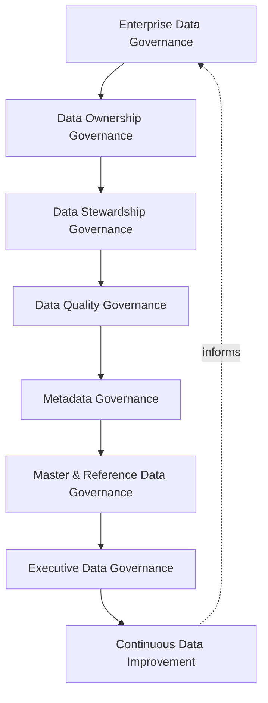
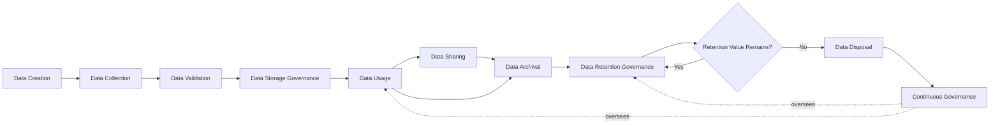
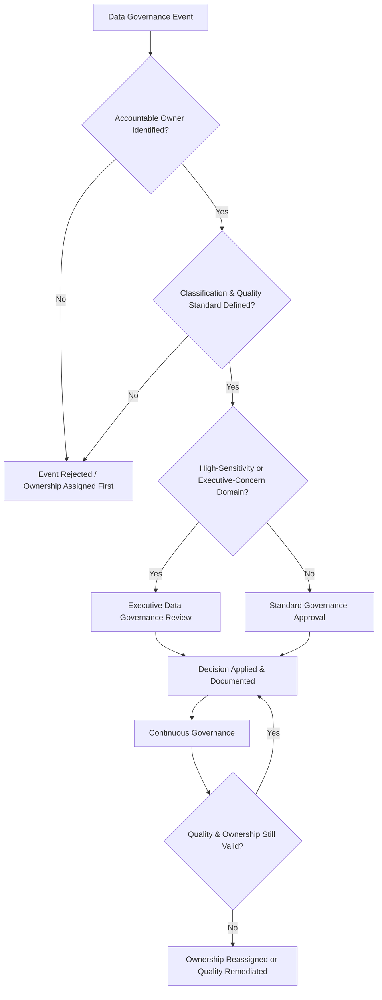
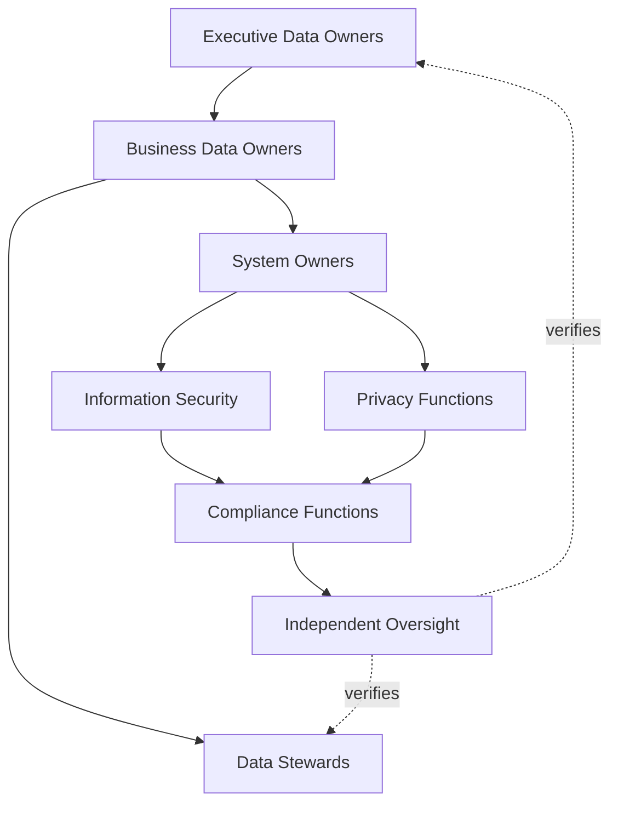
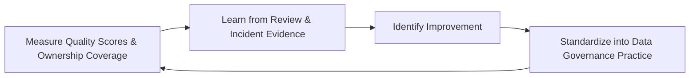
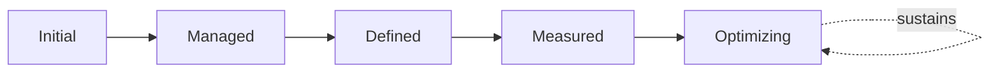

# Enterprise Data Governance Strategy

## 1. Document Purpose

This document defines the official Enterprise Data Governance Strategy for **StackLeo Tech Store** — the CDO/CISO/CPO-owned executive charter under which every category of business data is governed as a managed, accountable enterprise asset. It establishes data governance, data ownership, data stewardship, data quality governance, metadata governance, data lifecycle governance, organizational accountability, executive oversight, and long-term data governance maturity, consistent with DAMA-DMBOK, ISO/IEC 38505 (Governance of Data), ISO/IEC 27001, and TOGAF enterprise architecture thinking.

`data-governance.md` remains the operational governance framework for data practice — the document that elaborates in full operational depth data classification, ownership assignment, quality dimensions, metadata, lifecycle, and access governance for every data category StackLeo holds today. This document sits above it as executive mandate, consistent with the executive-charter relationship `identity-access-strategy.md` holds to `identity-access-management.md` and its family of IAM elaborations: it does not restate operational detail, it establishes the philosophy, accountability structure, and executive expectations that give that operational practice authority and continuity.

- **Purpose of Data Governance** — to ensure that data is treated as a strategic, managed business asset with clear ownership and defined quality standards, deliberately governed across its full life — never an unmanaged byproduct of running the platform.
- **Relationship with Enterprise Governance** — data governance is not a separate structure from how StackLeo governs the rest of the business; it is the data-specific application of the same executive accountability, policy discipline, and control assurance applied enterprise-wide in `policy-management.md`, `internal-controls.md`, and `audit-governance.md`.
- **Relationship with Information Security** — data governance and `security-governance.md` are complementary: this strategy defines who is accountable for data and to what standard; security defines how that data is technically protected. Neither substitutes for the other.
- **Relationship with Privacy Governance** — personal data is a distinct, especially sensitive category this strategy governs; its handling is coordinated in full with `06_Security/privacy.md` and `06_Security/data-protection.md`, ensuring governance and privacy discipline reinforce rather than duplicate one another.
- **Relationship with Enterprise Risk Management** — poorly governed data — unowned, low-quality, or inconsistently classified — is a distinct, tracked risk category within `06_Security/risk-management.md` and `06_Security/security-risk-management.md`, governed here at the data-specific strategic level.
- **Relationship with Compliance Governance** — this strategy provides the accountability and quality foundation regulatory and contractual data obligations tracked in `06_Security/compliance.md` depend on to be reliably satisfied in practice, not merely acknowledged in policy language.
- **Relationship with Business Operations** — every business decision, customer interaction, and growth initiative described in `01_Business/business-model.md` depends on data StackLeo can genuinely rely on; this strategy is what makes that reliance well-founded rather than assumed.

This document is implementation-independent and vendor-neutral. It defines data governance philosophy, model, domains, and lifecycle conceptually — not specific databases, cloud providers, data catalogs, governance platforms, MDM tools, analytics vendors, consulting firms, security products, database schemas, ETL pipelines, storage architectures, data lake implementations, infrastructure configurations, deployment architectures, operational workflows, or code.

## 2. Data Governance Philosophy

Data governance at StackLeo rests on eight principles. Each exists to produce a specific business outcome — data is governed deliberately because every other business capability ultimately depends on data being trustworthy.

### 2.1 Data as a Strategic Asset

StackLeo's data is managed with the same discipline applied to any other valuable business asset, never treated as an incidental technical byproduct.

- **Business Value** — ensures data receives investment and attention proportionate to the genuine business value it holds.

### 2.2 Governance Before Technology

Governance policy, ownership, and accountability are established independently of and prior to any specific data technology or platform choice.

- **Business Value** — ensures governance remains coherent and durable regardless of which specific tools StackLeo adopts or later replaces.

### 2.3 Data Ownership

Every data category has a clearly assigned, accountable owner; no data exists in an ownership vacuum.

- **Business Value** — ensures there is always someone genuinely responsible for a given category's accuracy, classification, and appropriate use.

### 2.4 Accountability

Governance roles carry genuine decision authority and responsibility, never a merely titular designation.

- **Business Value** — ensures governance is substantively real, not a documentation exercise disconnected from actual authority.

### 2.5 Data Stewardship

Day-to-day data quality management is performed deliberately by an assigned steward, distinct from but accountable to the data's owner.

- **Business Value** — ensures data quality is actively maintained on an ongoing basis, not merely captured once and left unmanaged.

### 2.6 Business Alignment

Data governance decisions are made in service of genuine business need, never imposed as friction disconnected from real operational purpose.

- **Business Value** — keeps data governance genuinely followed rather than resented as bureaucratic overhead.

### 2.7 Trustworthy Data

Data is actively maintained to a defined quality standard so that decisions, customer interactions, and compliance obligations can genuinely rely on it.

- **Business Value** — protects every downstream business decision from being built on data no one can actually vouch for.

### 2.8 Continuous Improvement

Data governance practice matures over time, informed by real quality findings, incidents, and the organization's growth in scale and complexity.

- **Business Value** — keeps data governance aligned with StackLeo's growth in data volume, business model complexity, and market reach.

## 3. Enterprise Data Governance Model

Data governance operates across eight conceptual layers, each holding accountability for a distinct dimension of data practice. Every layer here is elaborated in full operational depth in `data-governance.md`.

### 3.1 Enterprise Data Governance

- **Purpose** — own the overall coherence of how data is governed across the platform as a whole.
- **Governance Scope** — oversight spanning every layer in this model and every domain in Section 4.
- **Business Value** — ensures data governance operates as a single coherent discipline, not a collection of disconnected local practices.
- **Executive Expectations** — leadership trusts no data category exists outside this framework's visibility.

### 3.2 Data Ownership Governance

- **Purpose** — own the coherence of how accountable ownership is assigned and sustained for every data category.
- **Governance Scope** — oversight of ownership assignment across every domain in Section 4, elaborated in `data-governance.md` (Section 5).
- **Business Value** — ensures every data category has a genuinely accountable owner, consistent with Section 2.3.
- **Executive Expectations** — leadership expects ownership coverage to be complete and current, never partial or stale.

### 3.3 Data Stewardship Governance

- **Purpose** — own the coherence of day-to-day data quality management performed on the owner's behalf.
- **Governance Scope** — oversight of steward assignment and activity across every domain, consistent with Section 2.5.
- **Business Value** — ensures data quality is actively maintained continuously, not only assessed at isolated points in time.
- **Executive Expectations** — leadership trusts stewardship activity is genuinely occurring, not merely designated on paper.

### 3.4 Data Quality Governance

- **Purpose** — own the coherence of how data quality is defined, measured, and improved.
- **Governance Scope** — oversight of quality dimensions — accuracy, completeness, consistency, timeliness, validity, uniqueness — across every domain.
- **Business Value** — ensures the business can state, with genuine evidence, how much its data can be trusted.
- **Executive Expectations** — leadership expects quality issues to be identified and remediated, not left to accumulate silently.

### 3.5 Metadata Governance

- **Purpose** — own the coherence of how data's business, technical, and operational meaning is documented and shared.
- **Governance Scope** — oversight of metadata completeness across every domain, elaborated in `data-governance.md` (Section 7).
- **Business Value** — ensures data can be correctly understood and used by people beyond its immediate creators.
- **Executive Expectations** — leadership trusts metadata coverage grows toward completeness, not remains an afterthought.

### 3.6 Master & Reference Data Governance

- **Purpose** — own the coherence of the authoritative single source of truth for shared business facts.
- **Governance Scope** — oversight of the master and reference data underlying every consuming domain in Section 4.
- **Business Value** — prevents the same business fact from silently diverging across multiple, ungoverned copies.
- **Executive Expectations** — leadership trusts every core business fact has exactly one authoritative origin.

### 3.7 Executive Data Governance

- **Purpose** — own executive-level accountability for the data governance decisions carrying the greatest organizational consequence.
- **Governance Scope** — oversight spanning Sections 3.1–3.6 wherever a data governance matter rises to genuine executive concern.
- **Business Value** — ensures the most consequential data decisions are visible at the level accountable for organizational risk.
- **Executive Expectations** — leadership expects to be informed of, not surprised by, the platform's highest-risk data issues.

### 3.8 Continuous Data Improvement

- **Purpose** — govern the mechanism by which every other layer in this model matures over time.
- **Governance Scope** — consolidates findings from quality reviews, audits, and incidents across every domain in Section 4.
- **Business Value** — prevents data governance itself from becoming the next thing that quietly stagnates as the organization scales.
- **Executive Expectations** — leadership expects data governance maturity to be assessed periodically, not assumed static once established.

### Enterprise Data Governance Matrix

| Layer | Purpose | Business Value | Executive Expectations |
|---|---|---|---|
| Enterprise Data Governance | Own overall coherence of data governance across the platform | Ensures governance operates as a single coherent discipline | Trusts no data category exists outside this framework's visibility |
| Data Ownership Governance | Own coherence of how accountable ownership is assigned | Ensures every category has a genuinely accountable owner | Expects ownership coverage to be complete and current |
| Data Stewardship Governance | Own coherence of day-to-day data quality management | Ensures quality is actively maintained continuously | Trusts stewardship is genuinely occurring, not designated on paper |
| Data Quality Governance | Own coherence of how quality is defined and improved | Ensures the business can state how trustworthy its data is | Expects quality issues identified and remediated, not accumulating |
| Metadata Governance | Own coherence of documented business/technical meaning | Ensures data can be understood beyond its immediate creators | Trusts metadata coverage grows toward completeness |
| Master & Reference Data Governance | Own coherence of the authoritative single source of truth | Prevents the same fact silently diverging across copies | Trusts every core fact has exactly one authoritative origin |
| Executive Data Governance | Own executive accountability for highest-consequence decisions | Ensures the most consequential decisions are visible to leadership | Expects leadership informed of, not surprised by, top issues |
| Continuous Data Improvement | Govern maturation of every other layer | Prevents governance itself from stagnating | Expects maturity to be assessed periodically |

*Diagram 1: Enterprise Data Governance Framework — overall governance establishes the foundation, ownership and stewardship anchor accountability, quality and metadata governance sustain trustworthiness, and master data governance and executive oversight converge on continuous improvement that feeds back into the model.*

## 4. Enterprise Data Domains

Data governance applies across ten conceptual domains, each requiring a distinct governance emphasis.

### 4.1 Customer Data

- **Purpose** — represent individual shoppers' profiles, addresses, and relationship with StackLeo.
- **Governance Considerations** — governed under Data Ownership Governance (Section 3.2), coordinated closely with `06_Security/privacy.md` given its sensitivity.
- **Business Importance** — foundation of the direct-to-consumer relationship and repeat commerce central to the B2C model.
- **Executive Expectations** — leadership expects customer data governance to protect trust without adding friction to genuine shopping.

### 4.2 Product Data

- **Purpose** — represent the catalog, category, and brand information describing what StackLeo sells.
- **Governance Considerations** — governed under Data Quality Governance (Section 3.4), with accuracy and completeness directly affecting the shopping experience.
- **Business Importance** — directly shapes customer trust and purchase decisions across the marketplace.
- **Executive Expectations** — leadership expects product data accuracy to be measured and maintained, not assumed.

### 4.3 Order & Transaction Data

- **Purpose** — represent the record of what customers have purchased and the state of their fulfillment.
- **Governance Considerations** — governed under Master & Reference Data Governance (Section 3.6), given its role as the authoritative record of commerce activity.
- **Business Importance** — protects the integrity of the core commerce process the business depends on.
- **Executive Expectations** — leadership expects order and transaction data to remain internally consistent and fully traceable.

### 4.4 Financial Data

- **Purpose** — represent payments, refunds, and financial reconciliation records.
- **Governance Considerations** — governed under the highest rigor within Data Quality and Data Ownership Governance (Sections 3.2, 3.4), given regulatory and reputational sensitivity.
- **Business Importance** — protects the business's financial integrity and its standing with regulators and payment partners.
- **Executive Expectations** — leadership expects financial data governance to meet the strictest quality and accountability standard in this model.

### 4.5 Vendor & Supplier Data

- **Purpose** — represent StackLeo's suppliers, service providers, and future marketplace sellers.
- **Governance Considerations** — governed under Data Ownership Governance (Section 3.2), anticipating the multi-vendor marketplace model.
- **Business Importance** — protects the integrations and relationships the commerce experience depends on, and will underpin the future marketplace.
- **Executive Expectations** — leadership expects vendor data governance to be designed ahead of, not after, marketplace launch.

### 4.6 Employee Data

- **Purpose** — represent StackLeo's own workforce records.
- **Governance Considerations** — governed under Data Ownership Governance (Section 3.2), coordinated with `06_Security/privacy.md` and applicable employment obligations.
- **Business Importance** — protects the organization's obligations to its own people.
- **Executive Expectations** — leadership expects employee data governance to meet the same rigor as customer data governance.

### 4.7 Marketplace Data

- **Purpose** — represent the future multi-vendor marketplace's seller listings, commissions, and cross-vendor transactions.
- **Governance Considerations** — governed under Master & Reference Data Governance (Section 3.6), structured ahead of the marketplace model's launch.
- **Business Importance** — will become foundational to the multi-vendor marketplace business model as it launches.
- **Executive Expectations** — leadership expects marketplace data governance to be designed before, not retrofitted after, launch.

### 4.8 Operational Data

- **Purpose** — represent inventory, logistics, and day-to-day operational records.
- **Governance Considerations** — governed under Data Quality Governance (Section 3.4), given its direct effect on fulfillment reliability.
- **Business Importance** — protects the operational reliability customers directly experience.
- **Executive Expectations** — leadership expects operational data to reflect physical reality with minimal lag.

### 4.9 Analytics & Reporting Data

- **Purpose** — represent aggregated and derived data used for business decision-making.
- **Governance Considerations** — governed under Metadata Governance (Section 3.5), with lineage back to its authoritative source maintained at all times.
- **Business Importance** — directly informs the leadership decisions described in `01_Business/business-model.md`.
- **Executive Expectations** — leadership expects analytics to be traceable to its underlying source data, never an unverifiable black box.

### 4.10 AI & Machine Learning Data

- **Purpose** — represent training, feature, and inference data supporting AI-assisted platform capability.
- **Governance Considerations** — governed under Data Quality and Metadata Governance (Sections 3.4–3.5) as a distinct, explicitly inventoried category, anticipating growing AI-assisted capability.
- **Business Importance** — protects against a category of data whose quality directly determines the trustworthiness of AI-driven decisions.
- **Executive Expectations** — leadership expects AI and machine learning data to be governed with the same rigor as any other high-impact data domain, never as an informal technical exception.

### Enterprise Data Domain Matrix

| Domain | Purpose | Business Importance | Executive Expectations |
|---|---|---|---|
| Customer Data | Represent shoppers' profiles and relationship with StackLeo | Foundation of the direct-to-consumer relationship | Protects trust without adding shopping friction |
| Product Data | Represent catalog, category, and brand information | Directly shapes customer trust and purchase decisions | Accuracy measured and maintained, not assumed |
| Order & Transaction Data | Represent purchase records and fulfillment state | Protects the integrity of the core commerce process | Remains internally consistent and fully traceable |
| Financial Data | Represent payments, refunds, and reconciliation | Protects financial integrity and regulator/partner standing | Meets the strictest quality and accountability standard |
| Vendor & Supplier Data | Represent suppliers, providers, future marketplace sellers | Protects relationships and the future marketplace foundation | Designed ahead of, not after, marketplace launch |
| Employee Data | Represent StackLeo's own workforce records | Protects the organization's obligations to its own people | Meets the same rigor as customer data governance |
| Marketplace Data | Represent future multi-vendor listings, commissions, transactions | Will become foundational to the marketplace business model | Designed before, not retrofitted after, launch |
| Operational Data | Represent inventory, logistics, operational records | Protects the operational reliability customers experience | Reflects physical reality with minimal lag |
| Analytics & Reporting Data | Represent aggregated, derived decision-support data | Directly informs leadership business decisions | Traceable to underlying source data, never a black box |
| AI & Machine Learning Data | Represent training, feature, and inference data | Determines the trustworthiness of AI-driven decisions | Governed with the same rigor as any high-impact domain |

## 5. Enterprise Data Lifecycle

Data is governed across ten conceptual lifecycle stages, applicable across every domain in Section 4.

### 5.1 Data Creation

- **Purpose** — establish new data through a deliberate, authorized business process.
- **Governance Objectives** — require creation processes to enforce classification and quality standards from the outset.
- **Business Value** — ensures data quality is designed in at the point of origin, not repaired after the fact.

### 5.2 Data Collection

- **Purpose** — gather data from customers, partners, and systems in a governed, deliberate manner.
- **Governance Objectives** — require collection to be limited to genuine business purpose, consistent with privacy-by-design principles in `06_Security/privacy.md`.
- **Business Value** — protects the business from accumulating data it has no genuine, governed purpose for holding.

### 5.3 Data Validation

- **Purpose** — confirm newly created or collected data conforms to defined quality and business rules.
- **Governance Objectives** — require validation to occur before data enters the managed population, never assumed retroactively.
- **Business Value** — catches quality defects at the earliest, least costly point in the data's life.

### 5.4 Data Storage Governance

- **Purpose** — govern how validated data is retained in a form consistent with its classification and ownership.
- **Governance Objectives** — require storage decisions to reflect the data's governed classification, never an incidental technical default.
- **Business Value** — ensures data at rest remains organized and accountable, not scattered across ungoverned locations.

### 5.5 Data Usage

- **Purpose** — govern how data is accessed and used consistent with its classification and genuine business purpose.
- **Governance Objectives** — require usage to be monitored for appropriateness, consistent with Need-to-Know principles.
- **Business Value** — protects sensitive data from being used beyond the purpose that justified its collection.

### 5.6 Data Sharing

- **Purpose** — govern how data is shared across domains or with external systems and partners.
- **Governance Objectives** — require sharing relationships to be explicitly approved by the data's accountable owner.
- **Business Value** — prevents data from silently propagating beyond its governed boundary.

### 5.7 Data Archival

- **Purpose** — move data whose active business need has ended into a retained, non-active state.
- **Governance Objectives** — require archival eligibility to be confirmed by the data's accountable owner, coordinated with `data-retention.md`.
- **Business Value** — preserves data of continuing value without treating it as active, in-use data indefinitely.

### 5.8 Data Retention Governance

- **Purpose** — govern how long data, active or archived, is retained before disposal becomes appropriate.
- **Governance Objectives** — require retention periods to trace to genuine business, legal, or compliance rationale, coordinated with `data-retention.md` and `06_Security/compliance.md`.
- **Business Value** — prevents data from being retained indefinitely without a genuine, current justification.

### 5.9 Data Disposal

- **Purpose** — formally and permanently remove data once no business, compliance, or audit value remains.
- **Governance Objectives** — require disposal to be an explicit, approved decision, never an incidental or accidental loss.
- **Business Value** — reduces the accumulated risk and cost of retaining data with no remaining genuine purpose.

### 5.10 Continuous Governance

- **Purpose** — sustain oversight of data across every stage, rather than treating governance as a one-time gate.
- **Governance Objectives** — require reassessment of ownership, quality, and classification to run continuously alongside, not only at, discrete lifecycle events.
- **Business Value** — catches degrading data quality or unjustified retention before it becomes a genuine risk.

### Enterprise Data Lifecycle Matrix

| Stage | Purpose | Governance Objective | Business Value |
|---|---|---|---|
| Data Creation | Establish new data through an authorized process | Enforces classification and quality standards from the outset | Ensures quality is designed in, not repaired after |
| Data Collection | Gather data from customers, partners, systems | Limited to genuine business purpose | Protects against accumulating ungoverned-purpose data |
| Data Validation | Confirm data conforms to quality and business rules | Occurs before entering the managed population | Catches defects at the earliest, least costly point |
| Data Storage Governance | Govern retention consistent with classification | Reflects governed classification, never an incidental default | Ensures data at rest remains organized and accountable |
| Data Usage | Govern access consistent with classification and purpose | Usage monitored for appropriateness | Protects data from being used beyond its justified purpose |
| Data Sharing | Govern sharing across domains or with external parties | Explicitly approved by the data's accountable owner | Prevents data silently propagating beyond its boundary |
| Data Archival | Move ended-active-need data into a retained state | Eligibility confirmed by the accountable owner | Preserves value without treating it as active data indefinitely |
| Data Retention Governance | Govern how long data is retained before disposal | Traces to genuine business, legal, or compliance rationale | Prevents indefinite retention without genuine justification |
| Data Disposal | Formally, permanently remove data with no remaining value | An explicit, approved decision, never incidental | Reduces accumulated risk and cost of purposeless retention |
| Continuous Governance | Sustain oversight across every stage | Reassessment runs continuously | Catches degrading quality or unjustified retention early |

*Diagram 2: Enterprise Data Lifecycle — data proceeds from creation through collection and validation into governed storage, usage, and sharing, with archival, retention, and disposal handling its eventual wind-down under continuous governance.*

## 6. Data Governance Principles

- **Accountability** — governance roles carry genuine decision authority and responsibility, consistent with Section 2.4.
- **Ownership** — every data category has a clearly assigned, accountable owner, consistent with Section 2.3.
- **Stewardship** — day-to-day quality management is performed deliberately, distinct from but accountable to ownership.
- **Data Quality** — data is actively maintained to a defined standard, not merely captured and left unmanaged.
- **Traceability** — every data governance decision can be traced to its rationale, owner, and timing.
- **Transparency** — data ownership, classification, and quality status are documented and visible to those who need them, never hidden or informally understood.
- **Business Alignment** — governance decisions are made in service of genuine business need, never imposed as friction disconnected from purpose.
- **Continuous Improvement** — governance practice matures over time, informed by real quality findings and incidents.

### Data Governance Principles Matrix

| Principle | Description | Business Value |
|---|---|---|
| Accountability | Governance roles carry genuine decision authority | Ensures governance is substantively real, not nominal |
| Ownership | Every data category has a clearly assigned owner | Ensures someone is genuinely responsible for each category |
| Stewardship | Day-to-day quality management performed deliberately | Ensures quality is actively maintained on an ongoing basis |
| Data Quality | Data actively maintained to a defined standard | Ensures decisions rest on data that can genuinely be trusted |
| Traceability | Decisions traceable to rationale, owner, timing | Enables defensible, evidence-based governance decisions |
| Transparency | Ownership, classification, quality status documented and visible | Prevents governance from being hidden or informally understood |
| Business Alignment | Decisions made in service of genuine business need | Keeps governance followed rather than resented as friction |
| Continuous Improvement | Practice matures from real quality findings and incidents | Keeps governance aligned with organizational growth |

*Diagram 4: Enterprise Data Governance Decision Flow — a data governance event is checked for ownership and defined standards, escalated for executive review where sensitive, applied and documented, then continuously reassessed until reconfirmed or remediated.*

## 7. Data Ownership & Accountability

Governance authority for data is distributed deliberately across eight accountable functions, defined here at the governance-objective level, without prescribing specific operational procedures.

### 7.1 Executive Data Owners

- **Governance Objective** — executive data owners hold ultimate accountability for the data governance strategy and its enforcement across the organization.
- **Business Value** — provides a single point of executive accountability for whether data governance is genuinely functioning as intended.

### 7.2 Business Data Owners

- **Governance Objective** — each data category has a business data owner accountable for its accuracy, classification, and appropriate use.
- **Business Value** — ensures every data category has someone genuinely responsible for defending its continued quality and justification.

### 7.3 Data Stewards

- **Governance Objective** — data stewards execute day-to-day quality management for an assigned data category on the owner's behalf.
- **Business Value** — ensures quality management is an active, ongoing practice, not a responsibility left implicit within ownership alone.

### 7.4 System Owners

- **Governance Objective** — each system or platform component has an accountable owner responsible for the data it captures, stores, and exposes.
- **Business Value** — ensures no system's data handling behavior is left ungoverned because no one considered it theirs to own.

### 7.5 Information Security

- **Governance Objective** — information security ensures the technical protection of governed data meets the standard its classification requires, coordinated with `06_Security/security-governance.md`.
- **Business Value** — ensures governance's ownership and classification decisions are matched by genuine technical protection.

### 7.6 Privacy Functions

- **Governance Objective** — privacy functions confirm personal data governance satisfies applicable privacy principles and obligations, coordinated with `06_Security/privacy.md`.
- **Business Value** — ensures data governance protects individuals' data, not only the business's own interest in it.

### 7.7 Compliance Functions

- **Governance Objective** — compliance functions confirm that data governance satisfies applicable regulatory and contractual obligations, coordinated with `06_Security/compliance.md`.
- **Business Value** — ensures data governance protects the business's standing with regulators, partners, and enterprise customers.

### 7.8 Independent Oversight

- **Governance Objective** — an independent function, separate from those who design and operate data governance, periodically verifies it is genuinely functioning as documented.
- **Business Value** — prevents governance from being assumed effective on the word of the same function responsible for running it.

### Data Ownership & Accountability Matrix

| Role | Governance Objective | Business Value |
|---|---|---|
| Executive Data Owners | Hold ultimate accountability for the strategy and its enforcement | Provides a single point of executive accountability |
| Business Data Owners | Own accuracy, classification, and appropriate use of a category | Ensures every category has a genuinely responsible party |
| Data Stewards | Execute day-to-day quality management on the owner's behalf | Ensures quality management is active, not implicit |
| System Owners | Own the data a system captures, stores, and exposes | Ensures no system's data handling goes ungoverned |
| Information Security | Ensure technical protection matches classification requirements | Matches ownership decisions with genuine technical protection |
| Privacy Functions | Confirm personal data governance satisfies privacy obligations | Protects individuals' data, not only business interest |
| Compliance Functions | Confirm alignment with regulatory/contractual obligations | Protects standing with regulators, partners, enterprise customers |
| Independent Oversight | Independently verify governance functions as documented | Prevents self-assessed assumption of effectiveness |

*Diagram 3: Data Ownership & Stewardship Model — accountability flows from executive data ownership through business ownership and stewardship into system ownership, with security and privacy functions converging on compliance and independent oversight.*

## 8. Executive Oversight

- **Executive Data Governance Reviews** — the overall coherence of data governance is formally reviewed on a regular cadence, consistent with `06_Security/security-governance.md` (Section 6).
- **Data Quality Reporting** — aggregated data quality health — quality scores, ownership coverage, metadata completeness — is reported to executive leadership.
- **Governance Reviews** — the governance model, domains, and lifecycle defined in this strategy (Sections 3–7) are periodically reassessed for continued fitness.
- **Risk Reviews** — data-related risk from `06_Security/risk-management.md` and `06_Security/security-risk-management.md` is reviewed alongside broader enterprise and security risk, never in isolation.
- **Documentation Governance** — this strategy's relationship to `data-governance.md` is kept current as that document evolves.
- **Audit Readiness** — data governance decisions, reviews, and their outcomes are maintained in a state ready for internal or external audit at any time, coordinated with `06_Security/audit-governance.md`.

### Executive Oversight Matrix

| Oversight Mechanism | Purpose | Governance Role |
|---|---|---|
| Executive Data Governance Reviews | Confirm overall data governance coherence | Regular, predictable cadence for the strategy as a whole |
| Data Quality Reporting | Provide leadership a single, coherent data quality picture | Reports quality scores, ownership coverage, metadata completeness |
| Governance Reviews | Reassess the governance model itself for continued fitness | Applies to Sections 3–7 of this strategy |
| Risk Reviews | Review data risk alongside broader risk visibility | Not conducted in isolation from enterprise or security risk |
| Documentation Governance | Keep this strategy's subordinate relationship current | Updated as `data-governance.md` evolves |
| Audit Readiness | Maintain decisions and reviews ready for independent review | Continuous state, coordinated with audit governance |

### Governance Responsibility Matrix

| Role | Responsibility |
|---|---|
| CDO / CISO / CPO | Owns coherence and enforcement of this strategy, in partnership with Executive Leadership. |
| Data Governance Lead | Owns the operational governance model in `data-governance.md` for every domain. |
| Business Data Owners | Own accuracy, classification, and appropriate use within their assigned domain (Section 4). |
| Data Stewards | Execute day-to-day quality management on behalf of their assigned Business Data Owner. |
| Information Security | Owns technical protection commensurate with each data category's classification. |
| Privacy Function | Owns governance of personal data categories in coordination with `06_Security/privacy.md`. |
| Executive Leadership | Reviews significant data governance risk and overall governance health. |
| Independent Oversight / Internal Audit | Independently verifies that data governance records reflect actual practice. |

## 9. Future Readiness

This strategy is designed to remain valid as StackLeo evolves in scale, geography, and organizational complexity, without requiring redefinition of its underlying philosophy.

- **AI-Driven Data Governance** — as governance activity increasingly incorporates AI-assisted quality and classification analysis, it remains governed under Data Quality Governance (Section 3.4) at the same rigor and explainability standard as any other governance method.
- **Intelligent Data Catalogs** — Metadata Governance (Section 3.5) is structured so that business, technical, and operational metadata already populate a future formal data catalog without requiring rework.
- **Data Mesh Concepts** — Data Ownership Governance (Section 3.2) is defined independently of centralized or decentralized architecture, so domain-oriented data ownership extends coherently should StackLeo's data architecture evolve toward distributed models.
- **Global Expansion** — the governance model, domains, and lifecycle (Sections 3–5) are defined independently of jurisdiction, so they extend coherently as StackLeo expands from Bangladesh into South Asia and global markets.
- **Multi-Tenant Platforms** — where future architecture introduces tenant isolation, data governance extends to explicitly scope ownership and classification per tenant.
- **Enterprise Scale** — the governance model, domains, and lifecycle defined throughout this strategy are defined independently of organizational size, so they remain coherent as data volume grows substantially.
- **Data Ethics** — Business Alignment and Trustworthy Data (Sections 2.6–2.7) extend to encompass the ethical use of data, particularly for AI & Machine Learning Data (Section 4.10), as such capability matures.
- **Future Digital Ecosystems** — Vendor & Supplier and Marketplace Data (Sections 4.5, 4.7) are structured to absorb genuinely new categories of data relationship as StackLeo's ecosystem of partners and sellers grows.

## 10. Data Governance Maturity Model

Data governance maturity is described across five conceptual levels, consistent with DAMA-DMBOK and established process maturity thinking.

- **Initial** — data governance, where it exists, is informal and inconsistent; data accumulates without clear ownership or quality standards.
- **Managed** — basic governance exists for individual data domains, but consistency across the ten domains in Section 4 varies significantly.
- **Defined** — the governance model, domains, and lifecycle are standardized, documented, and consistently applied across the organization, consistent with the model defined throughout this strategy.
- **Measured** — data quality scores, ownership coverage, and metadata completeness are measured systematically, and decisions are grounded in genuine evidence rather than qualitative impression alone.
- **Optimizing** — data governance is continuously and deliberately improved based on quantitative evidence and organizational learning; improvement itself is a managed, ongoing discipline rather than an occasional initiative.

### Data Governance Maturity Model Matrix

| Level | Characteristics | Primary Focus |
|---|---|---|
| Initial | Informal, inconsistent governance; data accumulates without ownership or standards | Ad hoc, individually-dependent data practice |
| Managed | Basic governance exists per domain; consistency varies | Domain-level consistency |
| Defined | Standardized governance model, domains, and lifecycle | Organization-wide consistency and clear ownership |
| Measured | Quality scores and ownership coverage measured systematically | Evidence-based data governance decisions |
| Optimizing | Practice continuously and deliberately improved from evidence | Sustained, deliberate improvement as a discipline |

*Diagram 5: Continuous Data Governance Improvement Cycle — quality review and audit outcomes are measured, learned from, improved upon, and standardized back into governed practice, on a continuing basis.*

*Diagram 6: Data Governance Maturity Progression Model — maturity advances from informal, unowned data practice toward standardized, measured, and continuously optimized data governance.*

## 11. Anti-Patterns

The following recurring failure patterns are explicitly recognized and avoided, as each one structurally undermines this strategy.

### Anti-Pattern Summary

| Anti-Pattern | Why It's Avoided |
|---|---|
| Data Without Ownership | Contradicts Data Ownership (Section 2.3); data with no accountable owner has no one specifically responsible for its accuracy, quality, or appropriate use. |
| Poor Data Quality | Contradicts Trustworthy Data (Section 2.7); data actively maintained to no defined standard cannot be relied upon for genuine business decisions. |
| Data Silos | Contradicts Master & Reference Data Governance (Section 3.6); disconnected, ungoverned data stores allow the same business fact to silently diverge. |
| Weak Executive Visibility | Contradicts Data Quality Reporting (Section 8); leadership cannot govern data risk it is never shown. |
| Poor Documentation | Undermines Metadata Governance (Section 3.5) and Transparency (Section 6), leaving data difficult for anyone beyond its creators to understand or use correctly. |
| Duplicate Data Sources | Contradicts Master & Reference Data Governance (Section 3.6); storing the same business fact ungoverned in multiple locations risks silent inconsistency. |
| Compliance Without Governance | Contradicts Compliance Functions (Section 7.7); satisfying a regulatory checklist without genuine underlying governance leaves the organization compliant on paper and exposed in practice. |
| Missing Continuous Improvement | Contradicts Continuous Improvement (Section 2.8) and Continuous Data Improvement (Section 3.8); without deliberate improvement, governance stagnates as the organization and data volume grow. |

## 12. Document Information

| Property | Value |
|----------|-------|
| Document | data-governance-strategy.md |
| Version | 1.0.0 |
| Status | Active |
| Maintained By | StackLeo |
| Last Updated | 2026-07-24 |

---

© StackLeo. All Rights Reserved.
