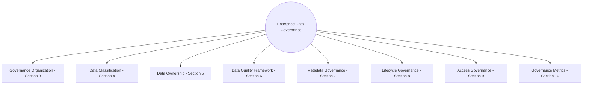
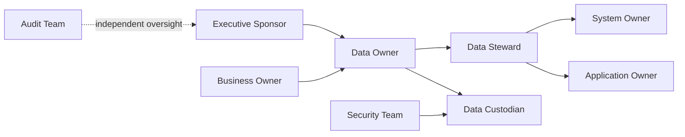
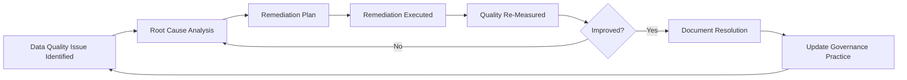
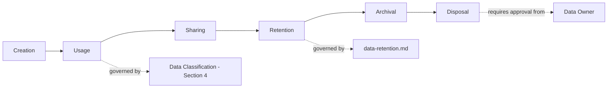
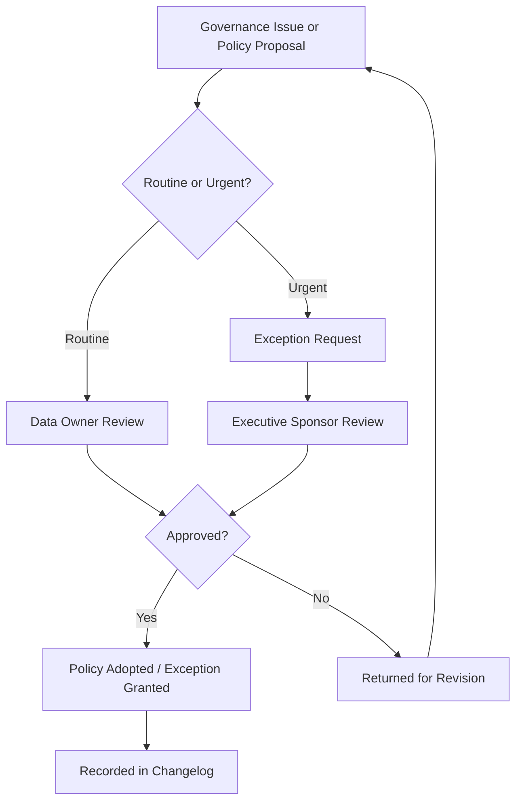

# Enterprise Data Governance Framework

## 1. Document Purpose

This document is the official Enterprise Data Governance Framework for **StackLeo Tech Store**. It defines the policies, ownership, accountability, quality standards, lifecycle governance, and metadata management principles that ensure StackLeo's business data remains trustworthy, well-managed, and fit for purpose.

- **Purpose of Data Governance** — to ensure that data is treated as a managed, accountable business asset with clear ownership, rather than an unmanaged byproduct of running the platform.
- **Business Value of Governed Data** — well-governed data is trustworthy data; every business decision, customer interaction, and compliance obligation depends on data StackLeo can actually rely on.
- **Relationship with Enterprise Architecture** — this framework governs the data structures defined across `04_Database` and the domain model in `03_System_Design/domain-model.md`, ensuring architecture and governance remain aligned.
- **Relationship with Security** — data governance and `security-model.md` are complementary: governance defines who is accountable for data; security defines how that data is technically protected.
- **Relationship with Compliance Readiness** — this framework provides the accountability and quality foundation required for compliance obligations defined in `01_Business/business-rules.md` (Section 17) and `02_Product/non-functional-requirements.md` (NFR-035, NFR-036).
- **Relationship with Business Decision-Making** — leadership decisions (per `01_Business/objectives.md`) are only as good as the data informing them; governance is what makes that data dependable.

This document is implementation-independent and vendor-neutral. It does not define database schemas, SQL, vendor-specific governance platforms, or implementation scripts — it defines governance policy and organization conceptually, aligned with DAMA-DMBOK principles.

## 2. Governance Principles

- **Data as a Strategic Asset** — StackLeo's data is managed with the same discipline applied to any other valuable business asset, consistent with `database-overview.md` (Section 2).
- **Single Source of Truth** — every business fact has exactly one authoritative origin, consistent with `03_System_Design/data-flow.md` (Section 2).
- **Data Ownership** — every data category has a clearly assigned, accountable owner (Section 5); no data exists in an ownership vacuum.
- **Accountability** — governance roles (Section 3) carry genuine decision authority and responsibility, not merely titular designation.
- **Transparency** — data ownership, classification, and quality status are documented and visible to those who need them, not hidden or informally understood.
- **Data Quality** — data is actively maintained to a defined standard (Section 6), not merely captured and left unmanaged.
- **Privacy by Design** — data handling defaults to the minimum necessary collection and access, consistent with ARCH-015 and BR-128.
- **Security by Design** — governance and protection are embedded from the outset, consistent with `security-model.md`.
- **Lifecycle Governance** — data is governed across its full lifecycle (Section 8), from creation through disposal, not only at the point of creation.
- **Continuous Improvement** — governance practice is refined based on observed outcomes (Section 10), not fixed permanently at initial design.

*Diagram: Enterprise Data Governance Model.*

## 3. Data Governance Organization

| Role | Responsibilities | Decision Authority | Collaboration Model |
|---|---|---|---|
| Executive Sponsor | Champions data governance as a business priority; resolves cross-functional governance conflicts. | Final authority on governance policy and resourcing. | Engages with Data Owners and the Founder / Business Owner on strategic direction. |
| Data Owner | Accountable for a specific data category's accuracy, classification, and appropriate use (Section 5). | Approves access requests and classification changes for owned data. | Works with Data Stewards for day-to-day quality management. |
| Data Steward | Executes day-to-day data quality management for an assigned data category. | Recommends quality remediation actions; escalates unresolved issues to the Data Owner. | Works closely with System Owners and Application Owners on data capture and correction. |
| Data Custodian | Manages the technical storage, protection, and availability of data. | Implements technical controls per Data Owner and Security Team direction. | Works with the Database Architect and DevOps Lead on technical execution. |
| System Owner | Accountable for a specific system's (e.g., a Service per `service-architecture.md`) data handling behavior. | Approves system-level changes affecting governed data. | Works with Data Owners to ensure system behavior aligns with governance policy. |
| Application Owner | Accountable for a customer- or staff-facing application's data capture and presentation. | Approves application-level changes affecting how data is captured or displayed. | Works with Product Manager and System Owners on aligned data handling. |
| Business Owner | Represents the business function's interest in and need for specific data. | Defines business requirements for data use, per `02_Product/functional-requirements.md`. | Works with Data Owners to ensure governance supports genuine business need. |
| Security Team | Ensures data protection controls meet defined security standards. | Approves security-relevant access and classification decisions. | Works with Data Custodians and Data Owners on protection implementation. |
| Audit Team | Independently verifies governance compliance and data handling accuracy. | Raises findings; does not directly implement remediation. | Reports independently to the Executive Sponsor, preserving audit independence. |

*Diagram: Data Ownership & Accountability Flow.*

## 4. Data Classification

| Classification | Business Impact | Access Expectations | Handling Requirements | Protection Considerations |
|---|---|---|---|---|
| Public | Low; intended for open, unrestricted visibility. | Accessible to any actor, including Guests. | No special handling required. | Integrity protection only (preventing unauthorized modification); no confidentiality requirement. |
| Internal | Moderate; not intended for external exposure but not highly sensitive. | Accessible to authenticated internal staff by default. | Handled within internal systems; not published externally without review. | Standard access control per `02_Product/user-roles.md`. |
| Confidential | High; unauthorized exposure could harm customers or the business. | Accessible only to roles with a specific, defined business need. | Handled per `security-model.md`; access logged. | Encryption and least-privilege access required. |
| Restricted | Highest; unauthorized exposure could cause serious harm (financial, legal, reputational). | Accessible only to a narrowly defined, approved set of roles. | Handled with the strictest controls; access requires explicit approval. | Encryption, strict least-privilege access, and mandatory audit logging required. |

### Data Classification Matrix

| Data Category | Classification |
|---|---|
| Product Catalog, Category, Brand | Public |
| Reviews (published) | Public |
| Inventory levels (aggregate/display) | Internal |
| Operational Logs | Internal |
| Customer Profile, Address | Confidential |
| Order, Shipment | Confidential |
| Payment, Refund, Transaction | Restricted |
| Audit Records | Restricted |
| Corporate Account Terms (Future) | Restricted |
| Marketplace Commission Data (Future) | Restricted |

## 5. Data Ownership Model

| Data Category | Owner | Accountability Boundary |
|---|---|---|
| Customer Data | Product Manager (Customer domain) | Accountable for profile accuracy, privacy compliance, and appropriate use across all consuming services. |
| Product Data | Product Manager (Catalog domain) | Accountable for catalog accuracy, completeness, and publish governance. |
| Inventory Data | Inventory Manager | Accountable for stock accuracy and reconciliation against physical reality. |
| Orders | Operations Manager | Accountable for order data accuracy and lifecycle integrity. |
| Payments | Finance Officer | Accountable for financial data accuracy, reconciliation, and compliance. |
| Shipping | Operations Manager | Accountable for delivery data accuracy and courier data handling. |
| Reviews | Product Manager (Engagement domain) | Accountable for review authenticity and moderation governance. |
| Notifications | Marketing Manager | Accountable for notification content accuracy and consent compliance. |
| Audit Records | Security Lead | Accountable for audit trail completeness and immutability. |
| Analytics | Business Analyst | Accountable for analytical data accuracy and appropriate aggregation/anonymization. |
| Marketplace Data (Future) | Product Manager (Business Expansion domain) | Accountable for seller data accuracy and marketplace-specific compliance, once active. |

Ownership boundaries follow the bounded contexts defined in `03_System_Design/bounded-contexts.md`; a Data Owner is accountable only for data within their assigned domain, never for data owned by another domain, consistent with `data-model.md` (Section 6).

## 6. Data Quality Framework

| Dimension | Description | Governance Process |
|---|---|---|
| Accuracy | Data correctly reflects the real-world business fact it represents. | Data Stewards periodically verify sample accuracy against source-of-truth business events. |
| Completeness | Mandatory business attributes are present. | Enforced at data creation per business rules (e.g., BR-013); monitored for gaps. |
| Consistency | The same fact resolves identically regardless of where it is referenced. | Enforced through normalization discipline (`normalization.md`) and single source of truth. |
| Timeliness | Data reflects current state within an acceptable delay. | Monitored against the freshness expectations in `03_System_Design/data-flow.md` (Section 9). |
| Validity | Data conforms to defined business rules and formats. | Enforced through business validation, per `01_Business/business-rules.md`. |
| Uniqueness | No unintended duplication of the same business fact. | Enforced through business-key uniqueness rules (e.g., BR-001, SKU uniqueness). |
| Reliability | Data behaves predictably and consistently under normal and failure conditions. | Monitored through the reliability practices in `03_System_Design/quality-attributes.md` (Section 6). |

*Diagram: Data Quality Continuous Improvement Cycle.*

## 7. Metadata Governance

- **Business Metadata** — descriptions of what data means in business terms (e.g., the definitions in `03_System_Design/glossary.md`), ensuring shared understanding across teams.
- **Technical Metadata** — descriptions of how data is structured and organized (per `schema-design.md`, `data-model.md`), supporting technical stewardship.
- **Operational Metadata** — information about data's operational behavior (e.g., update frequency, data volume trends), informing capacity and quality monitoring.
- **Data Catalog Readiness** — this framework's classification (Section 4) and ownership (Section 5) models are structured to populate a future formal data catalog without requiring rework.
- **Lineage Awareness** — the data flow relationships documented in `03_System_Design/data-flow.md` provide the foundation for tracing where a given piece of data originated and how it has moved through the platform.
- **Documentation Standards** — every governed data category's metadata is documented consistently across `04_Database`, following the enterprise Markdown conventions established across this repository.

## 8. Data Lifecycle Governance

| Lifecycle Stage | Governance Concept | Approval / Accountability |
|---|---|---|
| Creation | Data is created only through an authorized business process. | Data Owner accountable for ensuring creation processes enforce classification and quality standards. |
| Usage | Data is accessed and used consistent with its classification (Section 4) and business purpose. | Data Steward monitors usage patterns for appropriateness. |
| Sharing | Data shared across domains or with external systems follows defined integration boundaries, per `03_System_Design/integration-architecture.md`. | Data Owner approves new sharing relationships. |
| Retention | Data is retained per the business rationale defined in `data-retention.md`. | Data Steward monitors retention compliance for their assigned category. |
| Archival | Data moves to archival status per `data-retention.md` (Section 5) and `partitioning-strategy.md` (Section 6). | Data Owner confirms archival eligibility. |
| Disposal | Data is securely disposed of once no business, compliance, or audit value remains. | Requires explicit Data Owner and, for historically significant data, Founder / Business Owner approval, per `data-retention.md` (Section 6). |

*Diagram: Data Lifecycle Governance Workflow.*

## 9. Data Access Governance

- **Least Privilege** — access to governed data is scoped to the minimum necessary for a role's defined responsibility, consistent with ARCH-033 and `02_Product/user-roles.md`.
- **Need-to-Know** — access is granted based on genuine business need, not organizational convenience or seniority alone.
- **Segregation of Duties** — no single role may both create and approve a change to the same governed, high-impact data, consistent with `02_Product/user-roles.md` (Section 11).
- **Access Reviews** — access grants to Confidential and Restricted data (Section 4) are periodically reviewed for continued justification, consistent with `02_Product/user-roles.md` (UR-034).
- **Auditability** — access to Restricted data is logged and reviewable, consistent with `security-model.md`.
- **Privileged Access** — elevated access (e.g., Super Admin) is granted sparingly, monitored closely, and subject to the emergency access governance defined in `02_Product/user-roles.md` (Section 14.5).

## 10. Monitoring & Governance Metrics

| Metric | Description | Why It Matters |
|---|---|---|
| Data Quality Score | An aggregated measure of accuracy, completeness, and consistency across governed data categories. | Provides an early warning of degrading data trustworthiness before it affects business decisions. |
| Governance Compliance | The proportion of data categories with an assigned, active Data Owner and current classification. | Ensures no data exists in an ownership vacuum (Section 13). |
| Metadata Coverage | The proportion of data categories with complete business and technical metadata (Section 7). | Supports future data catalog readiness and cross-team understanding. |
| Ownership Coverage | The proportion of governed data categories with a currently assigned, active owner. | Directly measures accountability completeness. |
| Audit Readiness | The proportion of Restricted/Confidential data categories with verified, current audit logging. | Directly supports compliance and dispute-resolution readiness. |
| Issue Resolution | The average time to resolve identified data quality issues (Section 6). | Measures the effectiveness of the continuous improvement cycle. |

### Governance KPI Dashboard

| KPI | Target Direction | Review Cadence |
|---|---|---|
| Data Quality Score | Improving or stable at a high level | Periodic, aligned with `03_System_Design/observability.md` |
| Governance Compliance | Trending toward 100% | Each `product-roadmap.md` phase conclusion |
| Metadata Coverage | Trending toward 100% | Each `product-roadmap.md` phase conclusion |
| Ownership Coverage | 100% at all times | Continuous, reviewed at each governance review |
| Audit Readiness | 100% for Restricted/Confidential categories | Continuous |
| Issue Resolution Time | Trending downward | Per quality issue occurrence |

## 11. Future Evolution

| Future Direction | Data Governance Readiness |
|---|---|
| AI Governance | The classification (Section 4) and ownership (Section 5) models extend naturally to govern AI training data and model outputs as AI capability (Phase 6) is introduced. |
| Data Marketplace | Should StackLeo's own data ever be shared with trusted partners, the classification and access governance model (Sections 4, 9) already provides the necessary control foundation. |
| Business Intelligence | The metadata and lineage awareness (Section 7) directly support a future Business Intelligence capability, per `database-strategy.md` (Section 9). |
| Multi-Region | Data ownership and classification remain consistent across regions, with region-specific compliance layered on per `data-retention.md` (Section 9). |
| Multi-Cloud | Governance principles remain provider-neutral, consistent with `03_System_Design/deployment-architecture.md` (Section 1). |
| Enterprise Data Catalog | Sections 4, 5, and 7 of this document are structured to populate a future formal data catalog tool without requiring a redesign of the underlying governance model. |
| Master Data Management (MDM) | The single source of truth and Master Data concepts already established in `data-model.md` and `normalization.md` (Section 6) provide the conceptual foundation for a future formal MDM capability. |

## 12. Governance Process

- **Policy Creation** — new governance policy is proposed by a Data Owner or the Executive Sponsor, evaluated against the principles in Section 2.
- **Review Cycle** — this framework, and each data category's classification and ownership, are reviewed at the conclusion of each phase defined in `02_Product/product-roadmap.md`.
- **Change Management** — governance policy changes are recorded in `00_Project_Overview/changelog.md`.
- **Exception Handling** — a documented, time-bound exception process exists for cases where strict policy application would block a genuine, urgent business need; exceptions require Data Owner and Executive Sponsor approval.
- **Issue Escalation** — unresolved data quality or governance issues escalate from Data Steward to Data Owner to Executive Sponsor, consistent with the organization model in Section 3.
- **Documentation Standards** — this document follows the enterprise Markdown conventions established across this repository.
- **Versioning** — this document follows the Semantic Versioning approach defined in `00_Project_Overview/changelog.md`.

### Governance Process Summary

| Process | Trigger | Owner |
|---|---|---|
| Policy Creation | New governance need identified | Data Owner / Executive Sponsor |
| Review Cycle | Roadmap phase conclusion | Executive Sponsor |
| Change Management | Any policy or ownership change | Data Owner |
| Exception Handling | Urgent, policy-conflicting business need | Data Owner + Executive Sponsor |
| Issue Escalation | Unresolved quality/governance issue | Data Steward → Data Owner → Executive Sponsor |

*Diagram: Governance Decision Process.*

## 13. Anti-Patterns

| Anti-Pattern | Why It Is Avoided |
|---|---|
| Unknown Ownership | Data without an assigned owner (Section 5) has no accountable party for its accuracy, quality, or appropriate use. |
| Duplicate Business Data | Storing the same business fact in more than one ungoverned location violates single source of truth (Section 2) and risks silent inconsistency. |
| Poor Metadata | Undocumented data (Section 7) is difficult for anyone outside its immediate creators to understand or use correctly. |
| Unclassified Data | Data without a defined classification (Section 4) has no defined handling or protection standard, creating ungoverned risk. |
| Shadow Databases | Unofficial, ungoverned data stores created outside this framework bypass ownership, classification, and quality controls entirely. |
| Inconsistent Policies | Applying different governance standards to similar data categories creates confusion and undermines trust in the framework itself. |
| Missing Accountability | Governance roles (Section 3) that exist only nominally, without genuine decision authority or responsibility, fail to provide real oversight. |

### Anti-Pattern Summary

| Anti-Pattern | Primary Risk | Mitigation |
|---|---|---|
| Unknown Ownership | No accountable party | Enforce 100% Ownership Coverage (Section 10) |
| Duplicate Business Data | Silent inconsistency | Enforce single source of truth (Section 2) |
| Poor Metadata | Reduced cross-team understanding | Enforce Metadata Coverage targets (Section 10) |
| Unclassified Data | Ungoverned handling risk | Require classification for every new data category (Section 4) |
| Shadow Databases | Bypassed governance entirely | Require all data stores to be registered within this framework |
| Inconsistent Policies | Undermined trust in governance | Apply Sections 4–9 consistently across all domains |
| Missing Accountability | Governance in name only | Ensure roles (Section 3) carry genuine decision authority |

## 14. Document Information

| Property | Value |
|----------|-------|
| Document | data-governance.md |
| Version | 1.0.0 |
| Status | Active |
| Maintained By | StackLeo |
| Last Updated | 2026-07-17 |

---

© StackLeo. All Rights Reserved.
