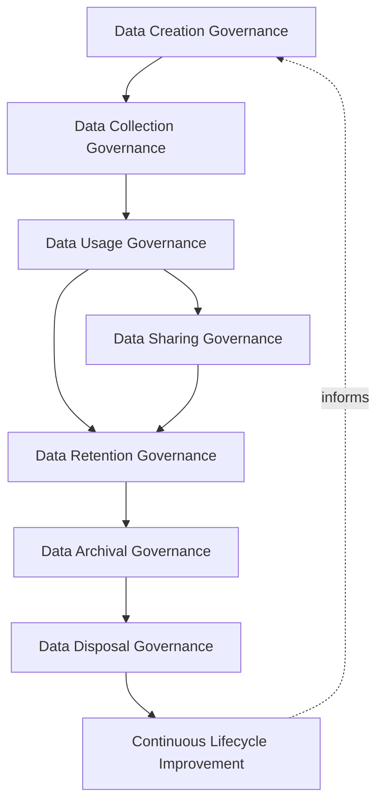
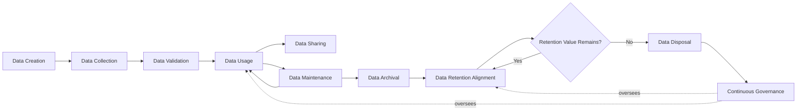
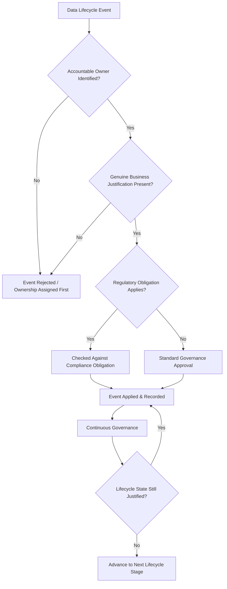
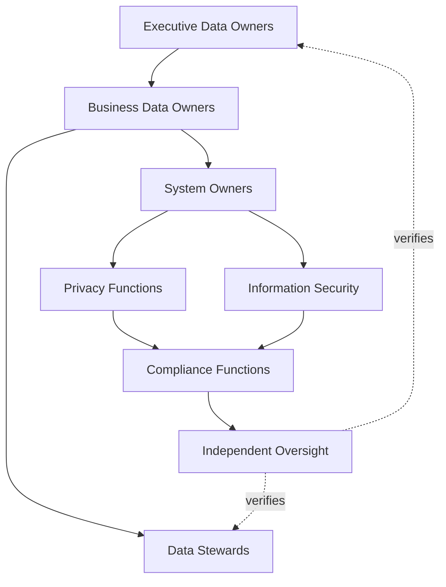
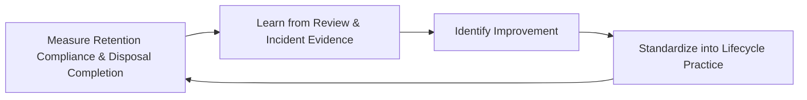
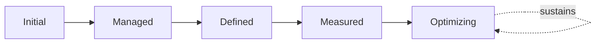

# Enterprise Data Lifecycle Governance Strategy

## 1. Document Purpose

This document defines the official Enterprise Data Lifecycle Governance Strategy for **StackLeo Tech Store** — the CDO/CISO/CPO-owned executive charter under which every category of business data is governed across its complete life, from creation through disposal. It establishes governance for data creation, collection, validation, usage, sharing, archival, retention alignment, disposal, organizational accountability, executive oversight, and long-term data lifecycle maturity, consistent with DAMA-DMBOK, ISO/IEC 38505 (Governance of Data), ISO/IEC 27001, and TOGAF enterprise architecture thinking.

`data-governance.md` (Section 8) introduces the general data lifecycle as part of its broader governance model, and `data-retention.md` elaborates retention, archival, and deletion in full operational depth. This document is the dedicated executive elaboration that ties those threads together: it governs data's *state across time* — whether it is being created, actively used, shared, archived, or disposed of — as a coherent whole, consistent with the executive-charter relationship `data-governance-strategy.md` holds over `data-governance.md`.

- **Purpose of Data Lifecycle Governance** — to ensure every category of data is governed deliberately across its complete life — from the moment it is created to the moment it is disposed of — so that data never persists, is shared, or is destroyed without a genuine, accountable, and current business justification.
- **Relationship with Enterprise Data Governance** — this strategy is the lifecycle-specific elaboration of `data-governance-strategy.md`; where that strategy governs data as a whole, this document governs specifically how data's state changes across time.
- **Relationship with Data Classification** — a data category's classification, governed under `data-classification.md`, determines the rigor its lifecycle governance requires; higher-sensitivity data warrants more deliberate creation, sharing, retention, and disposal decisions.
- **Relationship with Privacy Governance** — personal data's lifecycle — particularly collection, sharing, and disposal — is coordinated directly with `06_Security/privacy.md` and `06_Security/data-protection.md`, ensuring individuals' data is never retained or shared beyond its genuine, governed purpose.
- **Relationship with Information Security** — data at each lifecycle stage requires protection proportionate to its classification; this strategy governs the lifecycle decisions themselves, while `06_Security/security-governance.md` and `06_Security/security-controls-framework.md` govern the technical protection applied throughout.
- **Relationship with Compliance Governance** — retention and disposal decisions frequently trace directly to regulatory or contractual obligation; this strategy ensures those obligations, tracked in `06_Security/compliance.md`, are reliably reflected in how data is actually retained and disposed of.
- **Relationship with Enterprise Governance** — data lifecycle governance is not a separate structure from how StackLeo governs the rest of the business; it is the lifecycle-specific application of the same executive accountability, policy discipline, and control assurance applied enterprise-wide in `06_Security/policy-management.md` and `06_Security/internal-controls.md`.

This document is implementation-independent and vendor-neutral. It defines data lifecycle governance philosophy, model, domains, and stages conceptually — not specific databases, cloud providers, backup vendors, storage technologies, archive platforms, data lakes, security products, database schemas, storage architectures, retention schedules, ETL pipelines, backup procedures, archival implementations, infrastructure configurations, deployment architectures, operational workflows, or code.

## 2. Data Lifecycle Philosophy

Data lifecycle governance at StackLeo rests on eight principles. Each exists to produce a specific business outcome — data is governed across its full life because its value, sensitivity, and appropriate handling change as it moves from creation toward eventual disposal.

### 2.1 Data Has a Lifecycle

Every data category moves through a predictable progression of states — creation, active use, eventual archival, and disposal — and is governed with that progression explicitly in mind, never treated as a static, permanent artifact.

- **Business Value** — ensures governance anticipates how data's relevance and risk change over time, rather than applying a single, unchanging treatment throughout its life.

### 2.2 Governance Across Every Stage

Deliberate governance is applied at every lifecycle stage, not concentrated only at creation or only at disposal while the stages between go unattended.

- **Business Value** — prevents gaps in oversight that allow unjustified risk to accumulate silently in the stages between creation and disposal.

### 2.3 Data Stewardship

Day-to-day lifecycle management — monitoring usage, sharing, and retention status — is performed deliberately by an assigned steward, distinct from but accountable to the data's owner.

- **Business Value** — ensures lifecycle state is actively monitored on an ongoing basis, not merely assumed correct between formal reviews.

### 2.4 Accountability

Every lifecycle decision — creation, sharing, archival, or disposal — traces to a specific, named, responsible party.

- **Business Value** — ensures every lifecycle transition has someone genuinely responsible for defending its justification.

### 2.5 Business Value Preservation

Data is retained for as long as, and only as long as, it continues to hold genuine business, legal, or compliance value.

- **Business Value** — balances the risk of premature loss against the cost and exposure of retaining data beyond its genuine usefulness.

### 2.6 Governance by Design

Lifecycle governance structures are established deliberately as a new data category is introduced, not retrofitted once ungoverned accumulation has already occurred.

- **Business Value** — prevents the costly, high-visibility discovery of lifecycle governance gaps only after an incident or audit has already demonstrated their absence.

### 2.7 Risk Awareness

Lifecycle governance decisions weigh the genuine business, legal, and reputational consequence of each stage transition, directing scrutiny toward the transitions carrying the greatest risk.

- **Business Value** — ensures governance attention is proportionate to what a given lifecycle decision could actually cost the business if handled poorly.

### 2.8 Continuous Improvement

Data lifecycle governance practice matures over time, informed by real review findings, incidents, and the organization's growth in scale and complexity.

- **Business Value** — keeps lifecycle governance aligned with StackLeo's growth in data volume, business model complexity, and regulatory reach.

## 3. Enterprise Data Lifecycle Governance Model

Data lifecycle governance operates across eight conceptual layers, each holding accountability for a distinct stage-family of a data category's life.

### 3.1 Data Creation Governance

- **Purpose** — own the coherence of how new data is deliberately created through authorized business processes.
- **Governance Scope** — oversight of Data Creation (Section 5.1) across every domain in Section 4.
- **Business Value** — ensures data quality and classification are designed in at the point of origin, consistent with `data-classification.md`.
- **Executive Expectations** — leadership trusts no data category is created outside a deliberate, authorized process.

### 3.2 Data Collection Governance

- **Purpose** — own the coherence of how data is gathered from customers, partners, and systems.
- **Governance Scope** — oversight of Data Collection (Section 5.2), coordinated with `06_Security/privacy.md` for personal data.
- **Business Value** — ensures collection is limited to genuine business purpose, never accumulated without a governed reason.
- **Executive Expectations** — leadership trusts collection practice never exceeds genuine, stated business need.

### 3.3 Data Usage Governance

- **Purpose** — own the coherence of how data is accessed and used consistent with its classification and business purpose.
- **Governance Scope** — oversight of Data Usage (Section 5.4) across every domain, coordinated with `data-classification.md`.
- **Business Value** — ensures data is used only for the purpose that justified its collection or creation in the first place.
- **Executive Expectations** — leadership trusts usage is monitored for consistency with genuine, defined purpose.

### 3.4 Data Sharing Governance

- **Purpose** — own the coherence of how data is shared across domains or with external systems and partners.
- **Governance Scope** — oversight of Data Sharing (Section 5.5), requiring explicit accountable-owner approval for new sharing relationships.
- **Business Value** — prevents data from silently propagating beyond its governed boundary.
- **Executive Expectations** — leadership trusts every sharing relationship is deliberately approved, never assumed or informally arranged.

### 3.5 Data Retention Governance

- **Purpose** — own the coherence of how long data, active or archived, is retained before disposal becomes appropriate.
- **Governance Scope** — oversight of Data Retention Alignment (Section 5.8), coordinated with `data-retention.md` and `06_Security/compliance.md`.
- **Business Value** — ensures retention periods trace to genuine business, legal, or compliance rationale, never indefinite by default.
- **Executive Expectations** — leadership trusts retention decisions are periodically reconfirmed, not fixed once and forgotten.

### 3.6 Data Archival Governance

- **Purpose** — own the coherence of how data whose active need has ended is moved into a retained, non-active state.
- **Governance Scope** — oversight of Data Archival (Section 5.7), coordinated with `data-retention.md` (Section 5).
- **Business Value** — preserves data of continuing value without treating it as active, in-use data indefinitely.
- **Executive Expectations** — leadership trusts archival eligibility is confirmed deliberately, not left to informal accumulation.

### 3.7 Data Disposal Governance

- **Purpose** — own the coherence of how data is formally and permanently removed once no business, compliance, or audit value remains.
- **Governance Scope** — oversight of Data Disposal (Section 5.9), the highest-consequence stage in this model when handled prematurely or excessively delayed.
- **Business Value** — reduces the accumulated risk and cost of retaining data with no remaining genuine purpose, without discarding data still genuinely needed.
- **Executive Expectations** — leadership expects disposal to be an explicit, approved decision, never incidental or accidental.

### 3.8 Continuous Lifecycle Improvement

- **Purpose** — govern the mechanism by which every other layer in this model matures over time.
- **Governance Scope** — consolidates findings from lifecycle reviews, audits, and incidents across every domain in Section 4.
- **Business Value** — prevents lifecycle governance itself from becoming the next thing that quietly stagnates as the organization scales.
- **Executive Expectations** — leadership expects lifecycle governance maturity to be assessed periodically, not assumed static once established.

### Enterprise Data Lifecycle Governance Matrix

| Layer | Purpose | Business Value | Executive Expectations |
|---|---|---|---|
| Data Creation Governance | Own coherence of how new data is authorized and created | Ensures quality and classification are designed in from the outset | Trusts no data is created outside a deliberate, authorized process |
| Data Collection Governance | Own coherence of how data is gathered | Ensures collection is limited to genuine business purpose | Trusts collection never exceeds genuine, stated need |
| Data Usage Governance | Own coherence of how data is accessed and used | Ensures data is used only for its justifying purpose | Trusts usage is monitored for consistency with defined purpose |
| Data Sharing Governance | Own coherence of how data is shared internally/externally | Prevents data silently propagating beyond its boundary | Trusts sharing is deliberately approved, never assumed |
| Data Retention Governance | Own coherence of how long data is retained | Ensures retention traces to genuine business/legal/compliance rationale | Trusts retention is periodically reconfirmed, not fixed forever |
| Data Archival Governance | Own coherence of moving ended-need data to a retained state | Preserves value without treating it as active data indefinitely | Trusts archival eligibility is confirmed deliberately |
| Data Disposal Governance | Own coherence of permanent removal once value has ended | Reduces risk/cost of purposeless retention without premature loss | Expects disposal to be explicit and approved, never incidental |
| Continuous Lifecycle Improvement | Govern maturation of every other layer | Prevents governance itself from stagnating | Expects maturity to be assessed periodically |

*Diagram 1: Enterprise Data Lifecycle Governance Framework — creation and collection governance establish the foundation, usage and sharing govern data's active life, retention and archival govern its wind-down, and disposal governance closes the cycle, with continuous improvement feeding back into the model.*

## 4. Enterprise Data Lifecycle Domains

Data lifecycle governance applies across ten conceptual domains, each requiring a distinct lifecycle emphasis.

### 4.1 Customer Data

- **Purpose** — represent individual shoppers' profiles, addresses, and relationship with StackLeo.
- **Lifecycle Considerations** — lifecycle events are triggered by account creation, activity, dormancy, and closure, coordinated with `06_Security/privacy.md`.
- **Business Importance** — foundation of the direct-to-consumer relationship and repeat commerce.
- **Executive Expectations** — leadership expects customer data lifecycle governance to protect trust without adding friction to genuine shopping.

### 4.2 Product Data

- **Purpose** — represent the catalog, category, and brand information describing what StackLeo sells.
- **Lifecycle Considerations** — lifecycle events are triggered by product introduction, update, and discontinuation.
- **Business Importance** — directly shapes customer trust and purchase decisions across the marketplace.
- **Executive Expectations** — leadership expects discontinued product data to be archived deliberately, not left indefinitely active.

### 4.3 Order & Transaction Data

- **Purpose** — represent the record of what customers have purchased and the state of their fulfillment.
- **Lifecycle Considerations** — lifecycle events are triggered by order completion, dispute resolution, and eventual archival.
- **Business Importance** — protects the integrity of the core commerce process the business depends on.
- **Executive Expectations** — leadership expects order data retention to be aligned with genuine business, warranty, and compliance need.

### 4.4 Financial Data

- **Purpose** — represent payments, refunds, and financial reconciliation records.
- **Lifecycle Considerations** — lifecycle events are governed with the highest rigor in this model, coordinated with `06_Security/compliance.md` and `data-retention.md`.
- **Business Importance** — protects the business's financial integrity and its standing with regulators and payment partners.
- **Executive Expectations** — leadership expects financial data lifecycle decisions to be traceable to specific regulatory obligation.

### 4.5 Employee Data

- **Purpose** — represent StackLeo's own workforce records.
- **Lifecycle Considerations** — lifecycle events are triggered by employment status change, coordinated with `06_Security/identity-lifecycle.md`.
- **Business Importance** — protects the organization's obligations to its own people.
- **Executive Expectations** — leadership expects employee data disposal to occur promptly once retention obligations expire.

### 4.6 Vendor & Supplier Data

- **Purpose** — represent StackLeo's suppliers, service providers, and future marketplace sellers.
- **Lifecycle Considerations** — lifecycle events are triggered by the vendor relationship's own lifecycle — onboarding, renewal, termination.
- **Business Importance** — protects the integrations and relationships the commerce experience depends on.
- **Executive Expectations** — leadership expects vendor data to be archived or disposed of promptly at relationship end.

### 4.7 Marketplace Data

- **Purpose** — represent the future multi-vendor marketplace's seller listings, commissions, and cross-vendor transactions.
- **Lifecycle Considerations** — lifecycle governance is structured ahead of the marketplace model's launch, anticipating seller onboarding and offboarding events.
- **Business Importance** — will become foundational to the multi-vendor marketplace business model as it launches.
- **Executive Expectations** — leadership expects marketplace data lifecycle governance to be designed before, not retrofitted after, launch.

### 4.8 Analytics Data

- **Purpose** — represent aggregated and derived data used for business decision-making.
- **Lifecycle Considerations** — lifecycle events track the underlying source data's own lifecycle, with lineage maintained back to origin.
- **Business Importance** — directly informs the leadership decisions described in `01_Business/business-model.md`.
- **Executive Expectations** — leadership expects analytics data disposal to be coordinated with the disposal of its underlying source data.

### 4.9 AI & Machine Learning Data

- **Purpose** — represent training, feature, and inference data supporting AI-assisted platform capability.
- **Lifecycle Considerations** — lifecycle governance is applied as a distinct, explicitly inventoried category, anticipating growing AI-assisted capability.
- **Business Importance** — protects against a category of data whose quality and continued relevance directly determine AI-driven decision trustworthiness.
- **Executive Expectations** — leadership expects AI and machine learning data to be governed with the same lifecycle rigor as any other high-impact domain.

### 4.10 Regulatory Records

- **Purpose** — represent data retained specifically to satisfy a regulatory, legal, or audit obligation.
- **Lifecycle Considerations** — lifecycle governance is driven by the specific obligation's retention requirement, coordinated with `06_Security/compliance.md` and `06_Security/audit-governance.md`.
- **Business Importance** — protects the business's ability to demonstrate compliance when required.
- **Executive Expectations** — leadership expects regulatory records to be retained for exactly as long as obligation requires, no longer and no less.

### Enterprise Data Lifecycle Domain Matrix

| Domain | Purpose | Business Importance | Executive Expectations |
|---|---|---|---|
| Customer Data | Represent shoppers' profiles and relationship with StackLeo | Foundation of the direct-to-consumer relationship | Protects trust without adding shopping friction |
| Product Data | Represent catalog, category, and brand information | Directly shapes customer trust and purchase decisions | Discontinued data archived deliberately, not left active |
| Order & Transaction Data | Represent purchase records and fulfillment state | Protects the integrity of the core commerce process | Retention aligned with genuine business/warranty/compliance need |
| Financial Data | Represent payments, refunds, and reconciliation | Protects financial integrity and regulator/partner standing | Decisions traceable to specific regulatory obligation |
| Employee Data | Represent StackLeo's own workforce records | Protects the organization's obligations to its own people | Disposal occurs promptly once retention obligations expire |
| Vendor & Supplier Data | Represent suppliers, providers, future marketplace sellers | Protects relationships the commerce experience depends on | Archived or disposed of promptly at relationship end |
| Marketplace Data | Represent future multi-vendor listings, commissions, transactions | Will become foundational to the marketplace business model | Designed before, not retrofitted after, launch |
| Analytics Data | Represent aggregated, derived decision-support data | Directly informs leadership business decisions | Disposal coordinated with underlying source data disposal |
| AI & Machine Learning Data | Represent training, feature, and inference data | Determines the trustworthiness of AI-driven decisions | Governed with the same rigor as any high-impact domain |
| Regulatory Records | Represent data retained to satisfy a specific obligation | Protects the ability to demonstrate compliance when required | Retained exactly as long as obligation requires, no more, no less |

## 5. Enterprise Data Lifecycle Stages

Data is governed across ten conceptual lifecycle stages, applicable across every domain in Section 4.

### 5.1 Data Creation

- **Purpose** — establish new data through a deliberate, authorized business process.
- **Governance Objectives** — require creation processes to enforce classification and quality standards from the outset, consistent with `data-classification.md`.
- **Business Value** — ensures data quality and governance posture are designed in at the point of origin, not repaired after the fact.

### 5.2 Data Collection

- **Purpose** — gather data from customers, partners, and systems in a governed, deliberate manner.
- **Governance Objectives** — require collection to be limited to genuine business purpose, consistent with privacy-by-design principles.
- **Business Value** — protects the business from accumulating data it has no genuine, governed purpose for holding.

### 5.3 Data Validation

- **Purpose** — confirm newly created or collected data conforms to defined quality and business rules.
- **Governance Objectives** — require validation to occur before data enters the managed, active population.
- **Business Value** — catches quality defects at the earliest, least costly point in the data's life.

### 5.4 Data Usage

- **Purpose** — govern how data is accessed and used consistent with its classification and genuine business purpose.
- **Governance Objectives** — require usage to be monitored for appropriateness, consistent with Need-to-Know principles.
- **Business Value** — protects sensitive data from being used beyond the purpose that justified its collection.

### 5.5 Data Sharing

- **Purpose** — govern how data is shared across domains or with external systems and partners.
- **Governance Objectives** — require sharing relationships to be explicitly approved by the data's accountable owner.
- **Business Value** — prevents data from silently propagating beyond its governed boundary.

### 5.6 Data Maintenance

- **Purpose** — keep active data's attributes and quality current as circumstances change.
- **Governance Objectives** — require maintenance to be triggered by genuine change events, not left to drift indefinitely.
- **Business Value** — ensures data remains an accurate reflection of current business reality throughout its active use.

### 5.7 Data Archival

- **Purpose** — move data whose active business need has ended into a retained, non-active state.
- **Governance Objectives** — require archival eligibility to be confirmed by the data's accountable owner, coordinated with `data-retention.md`.
- **Business Value** — preserves data of continuing value without treating it as active, in-use data indefinitely.

### 5.8 Data Retention Alignment

- **Purpose** — ensure a data category's actual retention treatment reflects its governed retention rationale.
- **Governance Objectives** — coordinate retention alignment with `data-retention.md` and `06_Security/compliance.md`, ensuring higher-obligation data receives commensurately deliberate treatment.
- **Business Value** — prevents data from being retained indefinitely without a genuine, current justification.

### 5.9 Data Disposal

- **Purpose** — formally and permanently remove data once no business, compliance, or audit value remains.
- **Governance Objectives** — require disposal to be an explicit, approved decision, never an incidental or accidental loss.
- **Business Value** — reduces the accumulated risk and cost of retaining data with no remaining genuine purpose.

### 5.10 Continuous Governance

- **Purpose** — sustain oversight of data across every stage, rather than treating governance as a one-time gate.
- **Governance Objectives** — require reassessment of usage, retention, and disposal eligibility to run continuously alongside, not only at, discrete lifecycle events.
- **Business Value** — catches unjustified retention or premature disposal risk before it becomes a genuine problem.

### Enterprise Data Lifecycle Stage Matrix

| Stage | Purpose | Governance Objective | Business Value |
|---|---|---|---|
| Data Creation | Establish new data through an authorized process | Enforces classification and quality standards from the outset | Ensures governance posture is designed in, not repaired after |
| Data Collection | Gather data from customers, partners, systems | Limited to genuine business purpose | Protects against accumulating ungoverned-purpose data |
| Data Validation | Confirm data conforms to quality and business rules | Occurs before entering the active population | Catches defects at the earliest, least costly point |
| Data Usage | Govern access consistent with classification and purpose | Usage monitored for appropriateness | Protects data from being used beyond its justified purpose |
| Data Sharing | Govern sharing across domains or with external parties | Explicitly approved by the data's accountable owner | Prevents data silently propagating beyond its boundary |
| Data Maintenance | Keep active data's attributes and quality current | Triggered by genuine change events | Keeps data an accurate reflection of current business reality |
| Data Archival | Move ended-active-need data into a retained state | Eligibility confirmed by the accountable owner | Preserves value without treating it as active data indefinitely |
| Data Retention Alignment | Ensure actual treatment reflects governed rationale | Coordinated with data retention and compliance obligations | Prevents indefinite retention without genuine justification |
| Data Disposal | Formally, permanently remove data with no remaining value | An explicit, approved decision, never incidental | Reduces accumulated risk and cost of purposeless retention |
| Continuous Governance | Sustain oversight across every stage | Reassessment runs continuously | Catches unjustified retention or premature disposal risk early |

*Diagram 2: Enterprise Data Lifecycle Flow — data proceeds from creation through collection, validation, usage, and sharing into ongoing maintenance, with archival, retention alignment, and disposal handling its eventual wind-down under continuous governance.*

## 6. Data Lifecycle Governance Principles

- **Accountability** — every lifecycle decision traces to a specific, named, responsible party, consistent with Section 2.4.
- **Stewardship** — day-to-day lifecycle state monitoring is performed deliberately, distinct from but accountable to ownership.
- **Traceability** — every lifecycle event can be traced to its rationale, owner, and timing.
- **Transparency** — a data category's lifecycle state is documented and visible to those who need to know it, never hidden or informally understood.
- **Data Integrity** — data remains accurate and consistent as it moves through creation, use, sharing, and archival, never silently corrupted by lifecycle transitions.
- **Business Alignment** — lifecycle governance decisions are made in service of genuine business need, never imposed as friction disconnected from purpose.
- **Regulatory Awareness** — lifecycle decisions, particularly retention and disposal, reflect applicable regulatory and contractual obligation where relevant.
- **Continuous Improvement** — governance practice matures over time, informed by real review findings and incidents.

### Data Lifecycle Governance Principles Matrix

| Principle | Description | Business Value |
|---|---|---|
| Accountability | Every decision traces to a specific, named, responsible party | Ensures lifecycle decisions have a clear owner |
| Stewardship | Day-to-day state monitoring performed deliberately | Ensures lifecycle state is actively maintained, not assumed |
| Traceability | Events traceable to rationale, owner, timing | Enables defensible, evidence-based lifecycle decisions |
| Transparency | Lifecycle state documented and visible to those who need it | Prevents governance from being hidden or informally understood |
| Data Integrity | Data remains accurate and consistent through every transition | Prevents silent corruption during lifecycle movement |
| Business Alignment | Decisions made in service of genuine business need | Keeps governance followed rather than resented as friction |
| Regulatory Awareness | Decisions reflect applicable regulatory/contractual obligation | Ensures obligated data is never under-governed |
| Continuous Improvement | Practice matures from real review findings and incidents | Keeps lifecycle governance aligned with organizational growth |

*Diagram 4: Enterprise Data Lifecycle Decision Flow — a lifecycle event is checked for ownership and business justification, reviewed against compliance obligation where applicable, applied and recorded, then continuously reassessed until reconfirmed or advanced to its next stage.*

## 7. Ownership & Accountability

Governance authority for data lifecycle is distributed deliberately across eight accountable functions, defined here at the governance-objective level, without prescribing specific operational procedures.

### 7.1 Executive Data Owners

- **Governance Objective** — executive data owners hold ultimate accountability for the lifecycle governance strategy and its enforcement across the organization.
- **Business Value** — provides a single point of executive accountability for whether lifecycle governance is genuinely functioning as intended.

### 7.2 Business Data Owners

- **Governance Objective** — each data category's business data owner is accountable for its lifecycle decisions — creation authorization, sharing approval, archival and disposal confirmation.
- **Business Value** — ensures lifecycle decisions are made by the party genuinely positioned to judge the data's continuing business value.

### 7.3 Data Stewards

- **Governance Objective** — data stewards monitor day-to-day lifecycle state for their assigned category on the owner's behalf.
- **Business Value** — ensures lifecycle state is actively monitored as an ongoing practice, not a responsibility left implicit within ownership alone.

### 7.4 System Owners

- **Governance Objective** — each system or platform component has an accountable owner responsible for the lifecycle behavior of the data it captures and stores.
- **Business Value** — ensures no system's data lifecycle behavior is left ungoverned because no one considered it theirs to own.

### 7.5 Privacy Functions

- **Governance Objective** — privacy functions confirm personal data lifecycle governance satisfies applicable privacy principles and obligations.
- **Business Value** — ensures data lifecycle governance protects individuals' data, not only the business's own interest in it.

### 7.6 Information Security

- **Governance Objective** — information security ensures data receives protection proportionate to its classification at every lifecycle stage, coordinated with `06_Security/security-governance.md`.
- **Business Value** — ensures lifecycle transitions never leave data under-protected relative to its genuine sensitivity.

### 7.7 Compliance Functions

- **Governance Objective** — compliance functions confirm that lifecycle governance, particularly retention and disposal, satisfies applicable regulatory and contractual obligations.
- **Business Value** — ensures lifecycle governance protects the business's standing with regulators, partners, and enterprise customers.

### 7.8 Independent Oversight

- **Governance Objective** — an independent function, separate from those who design and operate lifecycle governance, periodically verifies it is genuinely functioning as documented.
- **Business Value** — prevents governance from being assumed effective on the word of the same function responsible for running it.

### Ownership & Accountability Matrix

| Role | Governance Objective | Business Value |
|---|---|---|
| Executive Data Owners | Hold ultimate accountability for the strategy and its enforcement | Provides a single point of executive accountability |
| Business Data Owners | Own lifecycle decisions within their assigned category | Ensures decisions made by the genuinely positioned party |
| Data Stewards | Monitor day-to-day lifecycle state on the owner's behalf | Ensures lifecycle state is actively monitored, not implicit |
| System Owners | Own the lifecycle behavior of the data a system handles | Ensures no system's data lifecycle goes ungoverned |
| Privacy Functions | Confirm personal data lifecycle satisfies privacy obligations | Protects individuals' data, not only business interest |
| Information Security | Ensure protection matches classification at every stage | Prevents transitions from leaving data under-protected |
| Compliance Functions | Confirm retention/disposal satisfy regulatory obligations | Protects standing with regulators, partners, enterprise customers |
| Independent Oversight | Independently verify governance functions as documented | Prevents self-assessed assumption of effectiveness |

*Diagram 3: Data Ownership & Stewardship Model — accountability flows from executive data ownership through business ownership and stewardship into system ownership, with privacy and security functions converging on compliance and independent oversight.*

## 8. Executive Oversight

- **Data Lifecycle Reviews** — the overall coherence of data lifecycle governance is formally reviewed on a regular cadence, consistent with `06_Security/security-governance.md` (Section 6).
- **Executive Reporting** — aggregated lifecycle health — retention compliance, archival timeliness, disposal completion — is reported to executive leadership.
- **Governance Reviews** — the governance model, domains, and stages defined in this strategy (Sections 3–7) are periodically reassessed for continued fitness.
- **Risk Reviews** — lifecycle-related risk from `06_Security/risk-management.md` and `06_Security/security-risk-management.md` is reviewed alongside broader enterprise and security risk, never in isolation.
- **Documentation Governance** — this strategy's relationship to `data-governance-strategy.md`, `data-governance.md`, `data-classification.md`, and `data-retention.md` is kept current as those documents evolve.
- **Audit Readiness** — data lifecycle decisions, reviews, and their outcomes are maintained in a state ready for internal or external audit at any time, coordinated with `06_Security/audit-governance.md`.

### Executive Oversight Matrix

| Oversight Mechanism | Purpose | Governance Role |
|---|---|---|
| Data Lifecycle Reviews | Confirm overall lifecycle governance coherence | Regular, predictable cadence for the strategy as a whole |
| Executive Reporting | Provide leadership a single, coherent lifecycle picture | Reports retention compliance, archival timeliness, disposal completion |
| Governance Reviews | Reassess the governance model itself for continued fitness | Applies to Sections 3–7 of this strategy |
| Risk Reviews | Review lifecycle risk alongside broader risk visibility | Not conducted in isolation from enterprise or security risk |
| Documentation Governance | Keep this strategy's subordinate relationships current | Updated as related documents evolve |
| Audit Readiness | Maintain decisions and reviews ready for independent review | Continuous state, coordinated with audit governance |

### Governance Responsibility Matrix

| Role | Responsibility |
|---|---|
| CDO / CISO / CPO | Owns coherence and enforcement of this strategy, in partnership with Executive Leadership. |
| Data Lifecycle Governance Lead | Owns the operational lifecycle model within `data-governance.md` (Section 8) and `data-retention.md`. |
| Business Data Owners | Own lifecycle decisions within their assigned data domain. |
| Data Stewards | Monitor lifecycle state on behalf of their assigned owner. |
| Information Security | Owns protection commensurate with classification at every lifecycle stage. |
| Privacy Function | Owns personal data lifecycle governance in coordination with `06_Security/privacy.md`. |
| Executive Leadership | Reviews significant lifecycle risk and overall governance health. |
| Independent Oversight / Internal Audit | Independently verifies that lifecycle governance records reflect actual practice. |

## 9. Future Readiness

This strategy is designed to remain valid as StackLeo evolves in scale, geography, and organizational complexity, without requiring redefinition of its underlying philosophy.

- **AI-Generated Data** — data newly created by AI-assisted capability is governed under Data Creation Governance (Section 3.1) as a genuine new data category, with its own lifecycle explicitly tracked from origin.
- **Intelligent Lifecycle Governance** — as lifecycle activity increasingly incorporates AI-assisted analysis to identify archival or disposal candidates, it remains governed under Continuous Governance (Section 5.10) at the same rigor and explainability standard as any other governance method.
- **Data Mesh Concepts** — Business Data Owners (Section 7.2) already hold domain-specific lifecycle accountability, extending coherently should StackLeo's data architecture evolve toward distributed, domain-oriented models.
- **Global Expansion** — the governance model, domains, and stages (Sections 3–5) are defined independently of jurisdiction, so they extend coherently as StackLeo expands from Bangladesh into South Asia and global markets.
- **Multi-Tenant Platforms** — where future architecture introduces tenant isolation, lifecycle governance extends to explicitly scope retention and disposal per tenant.
- **Enterprise Scale** — the governance model, domains, and stages defined throughout this strategy are defined independently of organizational size, so they remain coherent as data volume grows substantially.
- **Digital Trust** — this strategy's governance discipline is treated as a direct contributor to the digital trust customers, partners, and regulators extend to StackLeo, not merely an internal control exercise.
- **Future Regulatory Evolution** — Data Retention Governance (Section 3.5) and Regulatory Records (Section 4.10) are structured to absorb genuinely new regulatory obligations as StackLeo's market presence and applicable jurisdictions grow.

## 10. Data Lifecycle Governance Maturity Model

Data lifecycle governance maturity is described across five conceptual levels, consistent with DAMA-DMBOK and established process maturity thinking.

- **Initial** — lifecycle governance, where it exists, is informal and inconsistent; data accumulates without clear stage-by-stage oversight.
- **Managed** — basic lifecycle governance exists for individual data domains, but consistency across the ten domains in Section 4 varies significantly.
- **Defined** — the governance model, domains, and stages are standardized, documented, and consistently applied across the organization, consistent with the model defined throughout this strategy.
- **Measured** — retention compliance, archival timeliness, and disposal completion are measured systematically, and decisions are grounded in genuine evidence rather than qualitative impression alone.
- **Optimizing** — data lifecycle governance is continuously and deliberately improved based on quantitative evidence and organizational learning; improvement itself is a managed, ongoing discipline rather than an occasional initiative.

### Data Lifecycle Governance Maturity Model Matrix

| Level | Characteristics | Primary Focus |
|---|---|---|
| Initial | Informal, inconsistent governance; data accumulates without stage oversight | Ad hoc, individually-dependent lifecycle practice |
| Managed | Basic governance exists per domain; consistency varies | Domain-level consistency |
| Defined | Standardized governance model, domains, and stages | Organization-wide consistency and clear ownership |
| Measured | Retention compliance and disposal completion measured systematically | Evidence-based lifecycle governance decisions |
| Optimizing | Practice continuously and deliberately improved from evidence | Sustained, deliberate improvement as a discipline |

*Diagram 5: Continuous Data Lifecycle Improvement Cycle — lifecycle review and audit outcomes are measured, learned from, improved upon, and standardized back into governed practice, on a continuing basis.*

*Diagram 6: Data Lifecycle Governance Maturity Progression Model — maturity advances from informal, unmanaged data practice toward standardized, measured, and continuously optimized data lifecycle governance.*

## 11. Anti-Patterns

The following recurring failure patterns are explicitly recognized and avoided, as each one structurally undermines this strategy.

### Anti-Pattern Summary

| Anti-Pattern | Why It's Avoided |
|---|---|
| Data Without Ownership | Contradicts Data Business Data Owners (Section 7.2); data with no accountable owner has no one specifically responsible for its lifecycle decisions. |
| Unknown Lifecycle State | Contradicts Data Has a Lifecycle (Section 2.1); data whose current stage is unclear cannot be governed toward an appropriate next transition. |
| Excessive Data Retention | Contradicts Business Value Preservation (Section 2.5); retaining data beyond its genuine value increases exposure and cost without corresponding benefit. |
| Premature Data Disposal | Contradicts Business Value Preservation (Section 2.5); disposing of data still holding genuine business, legal, or compliance value destroys recoverable value. |
| Weak Executive Visibility | Contradicts Executive Reporting (Section 8); leadership cannot govern lifecycle risk it is never shown. |
| Poor Documentation | Undermines Documentation Governance (Section 8) and Transparency (Section 6), leaving lifecycle decisions unclear or unverifiable after the fact. |
| Lifecycle Without Governance | Contradicts Governance by Design (Section 2.6); data moving through its stages without deliberate oversight defeats the purpose of this entire strategy. |
| Missing Continuous Improvement | Contradicts Continuous Improvement (Section 2.8) and Continuous Lifecycle Improvement (Section 3.8); without deliberate improvement, governance stagnates as the organization and data volume grow. |

## 12. Document Information

| Property | Value |
|----------|-------|
| Document | data-lifecycle-governance.md |
| Version | 1.0.0 |
| Status | Active |
| Maintained By | StackLeo |
| Last Updated | 2026-07-24 |

---

© StackLeo. All Rights Reserved.
