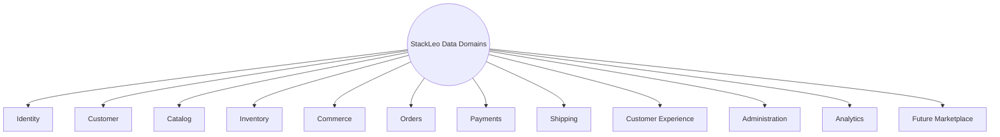
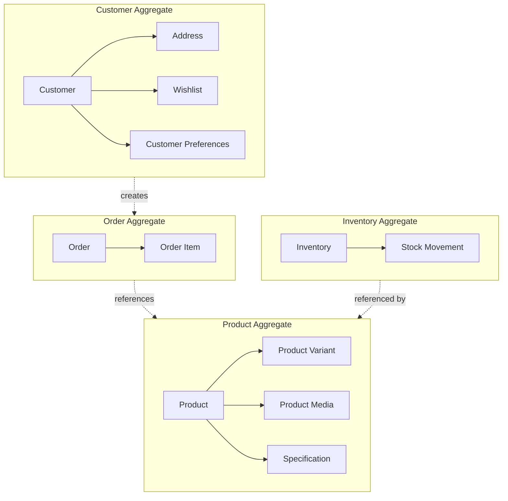
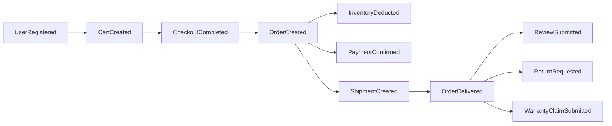
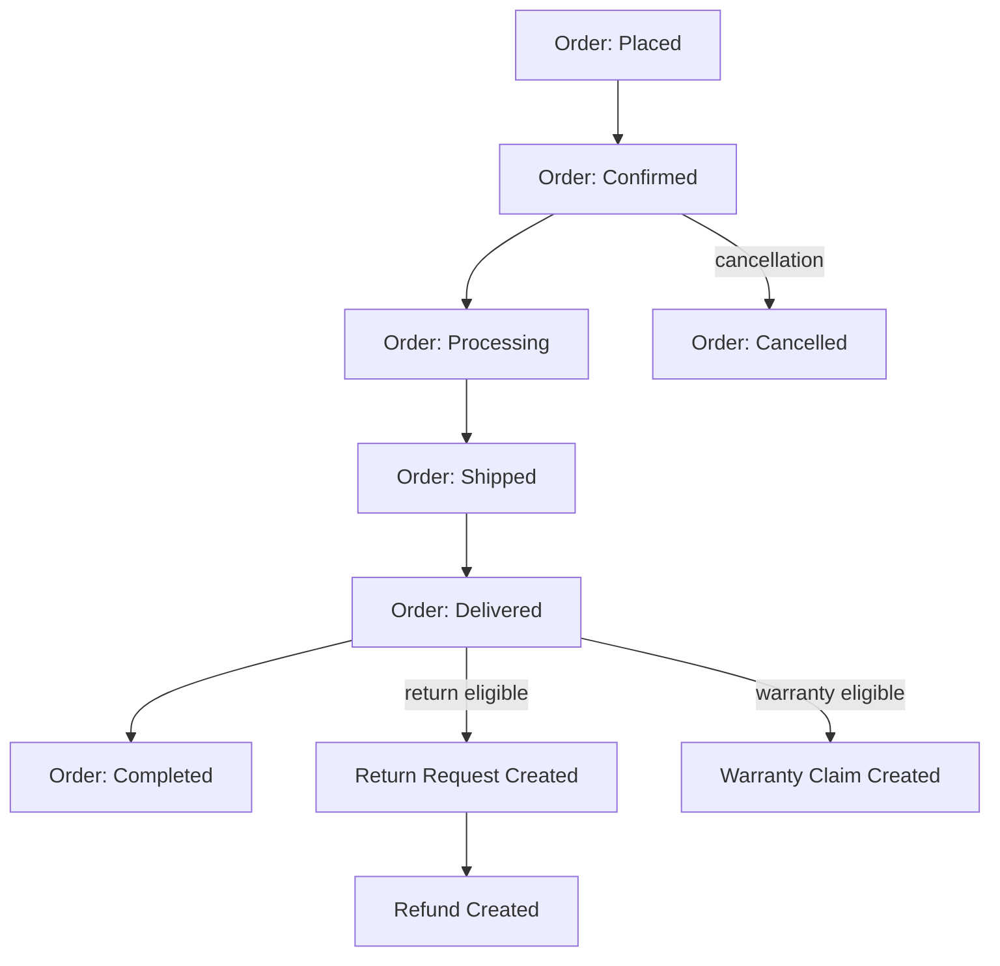

# Conceptual & Logical Data Model

## 1. Document Purpose

This document is the official Conceptual and Logical Data Model for **StackLeo Tech Store**. It defines the business entities, relationships, ownership, lifecycle, and business semantics of data across the platform, extending `03_System_Design/domain-model.md` with the additional entity detail needed to inform downstream schema design.

- **Conceptual Data Model** — describes *what* business concepts exist and how they relate, in pure business language, independent of any technical realization.
- **Logical Data Model** — elaborates the conceptual model with the business-level attributes and relationship detail needed to design a schema later, still without committing to a specific database technology, table, column, or key structure.
- **Conceptual vs. Logical vs. Physical** — the conceptual model answers "what business things exist"; the logical model answers "what do we need to know about each, and how do they relate, in enough detail to design with"; the physical model (out of scope for this document, addressed in `schema-design.md` and beyond) answers "how is this actually stored." This document covers the conceptual and logical levels only.
- **Relationship with Business Architecture** — every entity in this document traces to a business concept defined in `01_Business` and `02_Product`, never to incidental technical convenience.
- **Relationship with System Architecture** — this document elaborates the entities introduced in `03_System_Design/domain-model.md`, adding the finer-grained entities (e.g., Role, Permission, Product Media) needed for a complete logical model, while remaining strictly consistent with the bounded contexts defined in `bounded-contexts.md`.

This document is implementation-independent. It does not define SQL, tables, columns, primary keys, foreign keys, or ORM models — those belong to `schema-design.md` and dedicated engineering documentation.

## 2. Data Modeling Principles

- **Business-First Modeling** — every entity and relationship originates from a genuine business concept, never from technical convenience or a specific storage technology's constraints.
- **Single Source of Truth** — every entity has exactly one owning domain, consistent with `03_System_Design/data-flow.md` (Section 2).
- **Data Ownership** — each entity's creation and modification is governed by its owning domain (Section 6), consistent with `bounded-contexts.md`.
- **High Cohesion** — closely related business concepts (e.g., Product and Product Variant) are modeled together within the same domain.
- **Loose Coupling** — entities in different domains reference one another by identity, not by embedding each other's internal detail.
- **Reusability** — entities are modeled once and referenced everywhere they are needed, rather than being redefined per use case.
- **Extensibility** — the model anticipates future entities (Vendor, Marketplace Order) as extensions of existing domains, not disconnected structures.
- **Scalability** — entities anticipated to grow large in volume (Order, Stock Movement) are modeled with that growth in mind, informing future partitioning strategy (`partitioning-strategy.md`).

## 3. Core Business Domains

### Entity Catalog

| Domain | Entity Count | Entities |
|---|---|---|
| Identity | 4 | User, Role, Permission, Session |
| Customer | 4 | Customer, Address, Wishlist, Customer Preferences |
| Catalog | 7 | Product, Brand, Category, Product Variant, Product Media, Specification, Attribute |
| Inventory | 4 | Warehouse, Inventory, Stock Movement, Supplier (Future) |
| Commerce | 3 | Cart, Coupon, Promotion |
| Orders | 3 | Order, Order Item, Invoice |
| Payments | 3 | Payment, Refund, Transaction |
| Shipping | 3 | Shipment, Delivery Tracking, Courier |
| Customer Experience | 5 | Review, Rating, Support Ticket, Warranty Claim, Return Request |
| Administration | 3 | Admin User, Audit Record, Notification |
| Analytics | 2 | Business Metrics, Operational Metrics |
| Future Marketplace | 4 | Vendor, Vendor Product, Marketplace Order, Commission |

**Total Conceptual Entities: 45**

Each domain below is presented as a table of conceptual entities: **Entity, Description, Business Purpose, Related Entities**. Business-level conceptual attributes are described in prose, not as column definitions.

### 3.1 Identity

| Entity | Description | Business Purpose | Related Entities |
|---|---|---|---|
| User | The identity and credential record used to authenticate an actor, whether Customer or internal staff. | Establishes verified identity underlying all account-scoped action. | Customer, Admin User, Role, Session |
| Role | A named collection of permissions assigned to internal or partner actors. | Enforces the RBAC model defined in `02_Product/user-roles.md`. | User, Permission |
| Permission | A discrete, named capability that may be granted to a Role. | The atomic unit of access control. | Role |
| Session | The state representing an authenticated actor's ongoing interaction with the platform. | Enables continued access without re-authenticating on every request. | User |

### 3.2 Customer

| Entity | Description | Business Purpose | Related Entities |
|---|---|---|---|
| Customer | An individual who has registered to purchase from StackLeo Tech Store. | The core relationship the platform exists to serve. | User, Address, Wishlist, Customer Preferences |
| Address | A customer-maintained, reusable delivery location. | Represents where a customer's orders can be delivered. | Customer, Shipment |
| Wishlist | A customer's saved collection of products of interest. | Represents future purchase intent. | Customer, Product |
| Customer Preferences | A customer's communication and channel preferences. | Governs notification delivery consent, per BR-122. | Customer, Notification |

### 3.3 Catalog

| Entity | Description | Business Purpose | Related Entities |
|---|---|---|---|
| Product | A distinct sellable item offered through the catalog. | Represents what a customer can browse and purchase. | Brand, Category, Product Variant, Specification, Product Media |
| Brand | A verified manufacturer or brand identity associated with products. | Provides authenticity assurance. | Product |
| Category | A grouping used to organize products for navigation. | Provides structured, navigable catalog organization. | Product |
| Product Variant | A specific configuration of a product (e.g., color, storage capacity). | Represents purchasable distinctions within a single product. | Product, Inventory |
| Product Media | Images and other visual assets associated with a product or variant. | Supports customer product evaluation. | Product, Product Variant |
| Specification | A structured technical detail describing a product (e.g., processor, capacity). | Supports informed comparison and purchase decisions. | Product, Attribute |
| Attribute | A named, reusable characteristic type (e.g., "Color," "Storage") used to define product variants and specifications. | Provides a consistent vocabulary for describing product differences. | Product Variant, Specification |

### 3.4 Inventory

| Entity | Description | Business Purpose | Related Entities |
|---|---|---|---|
| Warehouse | A physical or store location holding stock. | Represents where inventory physically resides. | Inventory, Stock Movement |
| Inventory | The stock record for a specific Product Variant (SKU) at a given Warehouse. | Represents true, current stock availability. | Product Variant, Warehouse |
| Stock Movement | A recorded change in stock quantity (receipt, deduction, transfer, adjustment). | Provides an auditable history of how stock levels changed. | Inventory, Warehouse |
| Supplier (Future) | An external party supplying products to StackLeo for resale. | Supports future formalized vendor/supplier management. | Product, Stock Movement |

### 3.5 Commerce

| Entity | Description | Business Purpose | Related Entities |
|---|---|---|---|
| Cart | A customer's in-progress, pre-commitment collection of intended purchases. | Represents current purchase intent prior to checkout. | Customer, Product Variant, Coupon |
| Coupon | A discount code redeemable under defined eligibility conditions. | Drives promotional conversion within controlled margin impact. | Cart, Promotion |
| Promotion | A time-bound campaign offering discounted pricing on eligible products. | Drives targeted sales volume during defined periods. | Product, Coupon |

### 3.6 Orders

| Entity | Description | Business Purpose | Related Entities |
|---|---|---|---|
| Order | The authoritative record of a confirmed customer transaction. | Represents what was purchased, for how much, and its fulfillment state. | Customer, Order Item, Payment, Shipment, Invoice |
| Order Item | A single product/variant, quantity, and price within an Order. | Represents one committed purchase line, frozen at the price of purchase. | Order, Product Variant |
| Invoice | Compliant financial documentation issued for a confirmed order. | Ensures legal compliance and customer financial transparency. | Order |

### 3.7 Payments

| Entity | Description | Business Purpose | Related Entities |
|---|---|---|---|
| Payment | The financial transaction record associated with an Order. | Represents how and whether an Order has been paid for. | Order, Transaction, Refund |
| Refund | A recorded financial reversal issued against an approved Return, Cancellation, or Warranty resolution. | Ensures fair, traceable financial resolution for customers. | Payment, Return Request |
| Transaction | A discrete financial event (authorization, capture, refund) associated with a Payment. | Provides a granular, auditable financial history. | Payment |

### 3.8 Shipping

| Entity | Description | Business Purpose | Related Entities |
|---|---|---|---|
| Shipment | The physical fulfillment record for an Order, coordinated with a courier or store pickup. | Represents the physical journey of an Order to the customer. | Order, Address, Courier, Delivery Tracking |
| Delivery Tracking | The recorded status history of a Shipment's delivery progress. | Provides customer and operational visibility into delivery. | Shipment |
| Courier | An external delivery partner responsible for executing a Shipment. | Represents StackLeo's multi-courier delivery relationships. | Shipment |

### 3.9 Customer Experience

| Entity | Description | Business Purpose | Related Entities |
|---|---|---|---|
| Review | A customer's verified-purchase written feedback on a product. | Represents trustworthy, purchase-verified product feedback. | Customer, Product, Order, Rating |
| Rating | The numeric score component accompanying a Review. | Provides a quick, quantifiable trust signal alongside written feedback. | Review |
| Support Ticket | A general customer inquiry or issue routed to Customer Support. | Represents customer service interactions outside Return/Warranty scope. | Customer, Order |
| Warranty Claim | A customer's request to resolve a product defect under warranty. | Represents a genuine, evaluated defect resolution request. | Customer, Order Item, Product |
| Return Request | A customer's request to return or exchange a delivered product. | Represents a genuine, evaluated post-purchase resolution request. | Customer, Order, Refund |

### 3.10 Administration

| Entity | Description | Business Purpose | Related Entities |
|---|---|---|---|
| Admin User | An internal staff identity with a defined role and permission scope. | Represents internal operators of the platform. | User, Role, Audit Record |
| Audit Record | An immutable record of a governed administrative or business-critical action. | Supports accountability, dispute resolution, and compliance. | Admin User |
| Notification | A record of a business event communicated to a customer. | Represents a delivered (or attempted) customer communication. | Customer, Customer Preferences |

### 3.11 Analytics

| Entity | Description | Business Purpose | Related Entities |
|---|---|---|---|
| Business Metrics | Aggregated measures of business outcomes (conversion, revenue, retention). | Supports strategic and operational decision-making. | Order, Customer, Product |
| Operational Metrics | Aggregated measures of technical and operational performance. | Supports reliability and performance management. | (Cross-domain, derived) |

### 3.12 Future Marketplace

| Entity | Description | Business Purpose | Related Entities |
|---|---|---|---|
| Vendor | A future verified third-party marketplace participant. | Represents an independent seller's business relationship with the platform. | Vendor Product, Commission |
| Vendor Product | A product listing offered by a Vendor through the marketplace. | Extends the core Product catalog with seller-owned listings. | Vendor, Product |
| Marketplace Order | An order placed against a Vendor's listing, routed for seller fulfillment. | Represents a marketplace-specific transaction extending the core Order model. | Order, Vendor |
| Commission | The recorded fee StackLeo retains from a Marketplace Order. | Represents the marketplace revenue model. | Marketplace Order, Vendor |



*Diagram: Conceptual Domain Model.*

## 4. Entity Relationships

Relationships are described in business terms — ownership, conceptual cardinality, lifecycle dependency, and governing business rules — without defining relational constraints.

| Relationship | Ownership | Conceptual Cardinality | Lifecycle Dependency | Governing Business Rule |
|---|---|---|---|---|
| Customer — Address | Customer owns its Addresses | One Customer to many Addresses | Addresses may be removed independently of the Customer | BR-008, BR-009 |
| Product — Product Variant | Product owns its Variants | One Product to many Variants | Variants cannot outlive their Product | BR-018, BR-019 |
| Product — Category | Category referenced by Product | Many Products to one primary Category | Category cannot be removed while Products remain assigned | BR-016, BR-017 |
| Cart — Product Variant | Cart references Product Variant by identity | Many Cart Items to one Product Variant | Cart Items are removed independently of the referenced Product | BR-040 |
| Order — Order Item | Order owns its Order Items | One Order to many Order Items | Order Items are immutable once the Order is confirmed | BR-024 |
| Order — Payment | Order associated with one Payment | One Order to one Payment (per transaction) | Payment lifecycle is tied to, but distinct from, Order lifecycle | BR-057 |
| Order — Shipment | Order fulfilled via one or more Shipments | One Order to one or more Shipments (split fulfillment) | Shipment cannot exist without a confirmed Order | BR-074 |
| Order — Return Request | Return Request references an Order | One Order to zero or more Return Requests | Return Request cannot outlive its Order reference | BR-RET-001 |
| Order Item — Warranty Claim | Warranty Claim references an Order Item | One Order Item to zero or more Warranty Claims | Claim eligibility is tied to Order Item purchase date | WR-013 |
| Inventory — Product Variant | Inventory tracks a Product Variant's stock | One Product Variant to one Inventory record per Warehouse | Inventory record persists independent of individual Orders | BR-019, BR-030 |
| Vendor — Vendor Product (Future) | Vendor owns its Vendor Products | One Vendor to many Vendor Products | Vendor Products cannot outlive their Vendor's active status | BR-106, BR-109 |

```mermaid
flowchart LR
    Customer -->|owns| Address
    Customer -->|owns| Wishlist
    Customer -->|creates| Cart
    Customer -->|places| Order
    Cart -->|contains| CartItems[Cart Items]
    CartItems -->|reference| ProductVariant[Product Variant]
    Order -->|contains| OrderItem[Order Item]
    OrderItem -->|references| ProductVariant
    Order -->|has| Payment
    Order -->|fulfilled via| Shipment
    Shipment -->|delivers to| Address
    Order -->|may lead to| ReturnRequest[Return Request]
    Order -->|may lead to| WarrantyClaim[Warranty Claim]
    Product -->|has| ProductVariant
    Product -->|belongs to| Category
    Product -->|associated with| Brand
    ProductVariant -->|tracked by| Inventory
    Inventory -->|located at| Warehouse
    Vendor -.future.->|owns| VendorProduct[Vendor Product]
    VendorProduct -.future.->|extends| Product
```

*Diagram: Logical Entity Relationship Overview.*

## 5. Aggregate Boundaries

Aggregates define the consistency boundary within which business rules are enforced atomically, per DDD principles. Each aggregate has exactly one **Aggregate Root**, through which all changes to its members must occur.

| Aggregate | Aggregate Root | Aggregate Members | Business Consistency Boundary |
|---|---|---|---|
| Customer Aggregate | Customer | Address, Wishlist, Customer Preferences | Customer identity, contact detail, and personal context change together consistently. |
| Product Aggregate | Product | Product Variant, Product Media, Specification | A product and its variants share pricing/content consistency and publish state. |
| Cart Aggregate | Cart | Cart Items | Cart contents and totals must remain consistent as items are added, changed, or removed. |
| Order Aggregate | Order | Order Item | An order's items, status, and totals must remain consistent and immutable once confirmed. |
| Inventory Aggregate | Inventory | Stock Movement | Stock level changes must be atomic to prevent overselling. |
| Payment Aggregate | Payment | Transaction | Payment status and its underlying transaction history must remain consistent. |
| Shipment Aggregate | Shipment | Delivery Tracking | Shipment status and its tracking history must remain consistent. |
| Warranty Aggregate | Warranty Claim | — | Claim status, inspection findings, and resolution must remain consistent throughout the claim lifecycle. |
| Return Aggregate | Return Request | Refund (reference) | Return status, inspection findings, and resolution must remain consistent. |
| Review Aggregate | Review | Rating | Rating and written feedback change together consistently as a single customer submission. |
| Vendor Aggregate (Future) | Vendor | Vendor Product | Vendor verification status and their listings must remain consistent. |



*Diagram: Aggregate Boundary Diagram.*

## 6. Data Ownership

| Entity Group | Owning Domain (per `bounded-contexts.md`) | Owning Service (per `service-architecture.md`) |
|---|---|---|
| User, Role, Permission, Session | Identity & Access | Authentication Service, Authorization Service |
| Customer, Address, Wishlist, Customer Preferences | Customer | User Profile Service, Wishlist Service |
| Product, Brand, Category, Product Variant, Product Media, Specification, Attribute | Catalog & Discovery | Product Service, Category Service, Brand Service |
| Warehouse, Inventory, Stock Movement, Supplier | Order & Fulfillment | Inventory Service, Warehouse Service |
| Cart, Coupon, Promotion | Commerce | Cart Service, Coupon Service, Promotion Service |
| Order, Order Item, Invoice | Order & Fulfillment | Order Service, Invoice Service |
| Payment, Refund, Transaction | Commerce | Payment Service |
| Shipment, Delivery Tracking, Courier | Order & Fulfillment | Shipping Service, Delivery Tracking Service |
| Review, Rating | Post-Purchase | Review Service |
| Support Ticket, Warranty Claim, Return Request | Post-Purchase | Customer Support Service |
| Admin User, Audit Record | Platform Administration | Admin Service, Audit Service |
| Notification | Engagement | Notification Service |
| Business Metrics, Operational Metrics | Business Intelligence | Reporting Service, Dashboard Service |
| Vendor, Vendor Product, Marketplace Order, Commission | Business Expansion | Marketplace Service |

## 7. Entity Lifecycle

| Entity | Creation | Active Use | Update Triggers | End of Life |
|---|---|---|---|---|
| Customer | Registration and verification | Ongoing account activity | Profile edits, status changes | Retained for account lifetime; closure per retention policy |
| Product | Created by Product Team | Published and browsable | Content, pricing, stock updates | Discontinued; remains referenced in historical Orders |
| Inventory | Created alongside a new Product Variant | Continuously updated with each Order/restock | Deduction, reservation, replenishment | Persists for the life of its Product Variant |
| Cart | Created on first item addition | Active while customer is shopping | Item additions, removals, quantity changes | Expires after inactivity; not retained long-term |
| Order | Created at checkout completion | Progresses through fulfillment status | Status changes | Retained permanently as the authoritative transactional record |
| Payment | Created at checkout/payment attempt | Active until finalized | Status changes (Confirmed, Failed, Refunded) | Retained permanently, tied to its Order |
| Shipment | Created at order packing/dispatch | Active until delivery | Status changes through delivery lifecycle | Retained as part of the Order's permanent fulfillment record |
| Review | Created on customer submission | Active once published | Edits by the customer; moderation actions | Retained indefinitely, subject to policy-violation removal |



*Diagram: Customer Journey Data Model.*



*Diagram: Order Lifecycle Data Model.*

## 8. Future Evolution

| Future Capability | Data Model Impact |
|---|---|
| AI | No new core entities required; AI-assisted capability consumes existing Product, Order, and behavioral data as a read-only enhancement layer. |
| Marketplace | Vendor, Vendor Product, Marketplace Order, and Commission entities (Section 3.12) extend the existing Catalog and Order domains. |
| Corporate Sales | A future Corporate Account entity extends the Order domain with negotiated-term validation, consistent with `03_System_Design/domain-model.md` (Section 4.10). |
| Multi-Region | Address and Shipment entities extend to accommodate region-specific formats, without altering their conceptual role. |
| Business Intelligence | Business Metrics and Operational Metrics entities (Section 3.11) mature into a dedicated analytical layer, separated from transactional entities per `database-strategy.md` (Section 3). |

## 9. Governance

- **Modeling Standards** — every new entity must be justified by a genuine business concept (Section 2), assigned to exactly one owning domain (Section 6), and documented using the format established in Section 3.
- **Review Process** — this document is reviewed whenever `03_System_Design/domain-model.md` or `02_Product/product-modules.md` changes materially, and at the conclusion of each phase defined in `02_Product/product-roadmap.md`.
- **Versioning** — this document follows the Semantic Versioning approach defined in `00_Project_Overview/changelog.md`.
- **Ownership** — the Database Architect, in partnership with the Business Analyst, owns this document's accuracy and its consistency with `03_System_Design/domain-model.md`.

## 10. Document Information

| Property | Value |
|----------|-------|
| Document | data-model.md |
| Version | 1.0.0 |
| Status | Active |
| Maintained By | StackLeo |
| Last Updated | 2026-07-17 |

---

© StackLeo. All Rights Reserved.
