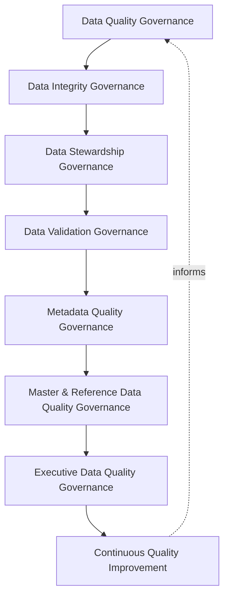
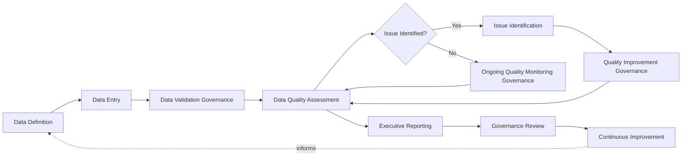
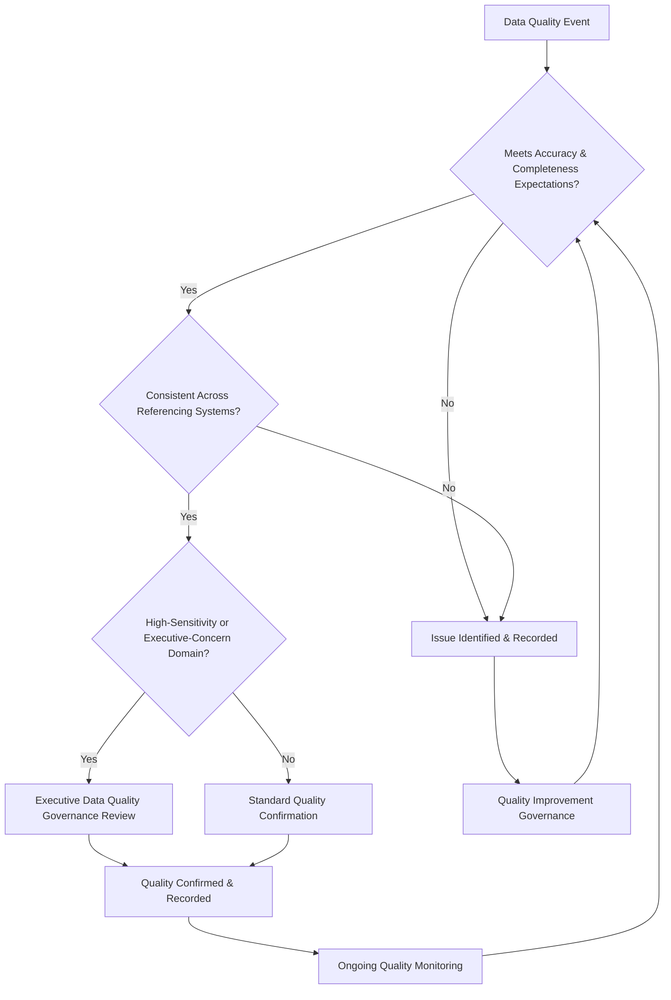
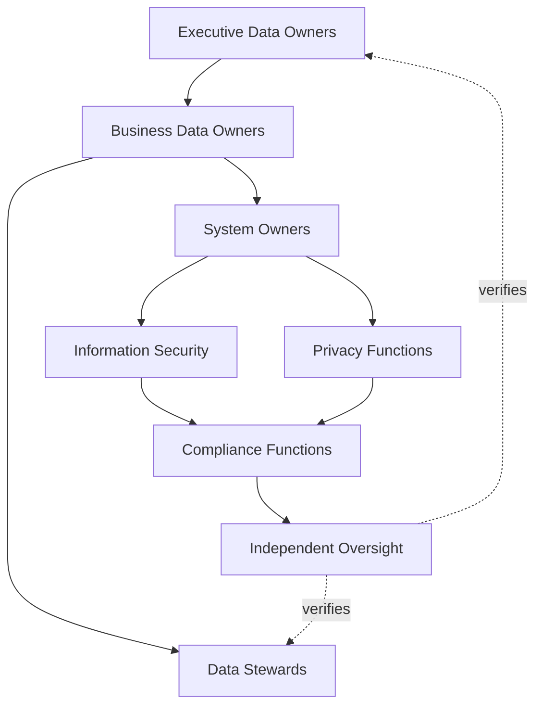
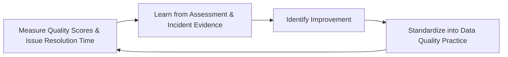
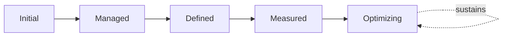

# Enterprise Data Quality Governance Strategy

## 1. Document Purpose

This document defines the official Enterprise Data Quality Governance Strategy for **StackLeo Tech Store** — the CDO/CISO/CPO-owned executive charter under which the accuracy, integrity, and trustworthiness of every category of business data is deliberately governed. It establishes data quality governance, data integrity governance, data stewardship, quality ownership, organizational accountability, executive oversight, continuous quality improvement, and long-term data quality maturity, consistent with DAMA-DMBOK, ISO/IEC 38505 (Governance of Data), ISO/IEC 27001, and TOGAF enterprise architecture thinking.

`data-governance.md` (Section 6) establishes StackLeo's foundational data quality dimensions — accuracy, completeness, consistency, timeliness, validity, uniqueness, and reliability. This document is the dedicated executive elaboration of that thread, consistent with the executive-charter relationship `data-governance-strategy.md` holds over `data-governance.md`: it governs quality as a standing organizational discipline, coordinated with the sensitivity governed in `data-classification.md` and the state governed in `data-lifecycle-governance.md`, because quality carries enough distinct measurement, accountability, and improvement discipline to warrant its own governance treatment.

- **Purpose of Data Quality Governance** — to ensure data is actively and continuously maintained to a defined, measurable standard, so that every business decision, customer interaction, and compliance obligation depends on data StackLeo can genuinely rely on rather than assume.
- **Relationship with Enterprise Data Governance** — this strategy is the quality-specific elaboration of `data-governance-strategy.md`; where that strategy governs data as a whole, this document governs specifically how data's trustworthiness is defined, measured, and improved.
- **Relationship with Data Classification** — a data category's classification, governed under `data-classification.md`, informs the rigor its quality governance requires; higher-sensitivity data warrants more deliberate validation and monitoring.
- **Relationship with Data Lifecycle Governance** — quality is assessed and enforced at specific points across the lifecycle governed in `data-lifecycle-governance.md`, particularly at Data Creation and Data Maintenance, rather than as a separate, disconnected activity.
- **Relationship with Privacy Governance** — poor-quality personal data — inaccurate, duplicated, or inconsistent — directly undermines the accuracy obligations coordinated with `06_Security/privacy.md`; this strategy ensures individuals' data is not only protected but genuinely correct.
- **Relationship with Compliance Governance** — data quality evidence is frequently required to demonstrate regulatory and contractual obligations are genuinely satisfied, coordinated with `06_Security/compliance.md`.
- **Relationship with Enterprise Governance** — data quality governance is not a separate structure from how StackLeo governs the rest of the business; it is the quality-specific application of the same executive accountability, policy discipline, and control assurance applied enterprise-wide in `06_Security/policy-management.md` and `06_Security/internal-controls.md`.

This document is implementation-independent and vendor-neutral. It defines data quality governance philosophy, model, domains, and lifecycle conceptually — not specific data quality platforms, MDM tools, ETL tools, databases, cloud providers, analytics vendors, consulting firms, security products, validation rules, cleansing procedures, database constraints, ETL implementations, infrastructure configurations, deployment architectures, monitoring implementations, operational workflows, or code.

## 2. Data Quality Philosophy

Data quality governance at StackLeo rests on eight principles. Each exists to produce a specific business outcome — quality is governed deliberately because every decision, interaction, and obligation built on data is only as sound as the data itself.

### 2.1 Trusted Data Enables Trusted Decisions

Every business decision is only as reliable as the data informing it; quality governance exists specifically to make that reliability genuine rather than assumed.

- **Business Value** — protects leadership decisions described in `01_Business/business-model.md` from being built on data no one can actually vouch for.

### 2.2 Quality Before Consumption

Data quality is assessed and enforced before data is broadly used or shared, not discovered as a problem only after it has already influenced a decision.

- **Business Value** — prevents low-quality data from propagating its consequences across every downstream process that consumes it.

### 2.3 Data Integrity as a Business Asset

The internal consistency and correctness of data is treated as a valuable business asset in its own right, deserving deliberate investment.

- **Business Value** — ensures integrity receives resourcing proportionate to the genuine cost of its absence, not treated as a free byproduct of other work.

### 2.4 Accountability

Every data quality decision and remediation traces to a specific, named, responsible party.

- **Business Value** — ensures every quality issue has someone genuinely responsible for resolving it, not diffused across an unaccountable group.

### 2.5 Data Stewardship

Day-to-day quality management is performed deliberately by an assigned steward, distinct from but accountable to the data's owner.

- **Business Value** — ensures quality is actively maintained on an ongoing basis, not assessed only at isolated, infrequent intervals.

### 2.6 Governance by Design

Quality governance structures are established deliberately as a new data category is introduced, not retrofitted once quality problems have already accumulated.

- **Business Value** — prevents the costly, high-visibility discovery of quality gaps only after they have already degraded a business decision or customer experience.

### 2.7 Business Alignment

Data quality governance decisions are made in service of genuine business need, never imposed as friction disconnected from real operational purpose.

- **Business Value** — keeps quality governance genuinely followed rather than resented as bureaucratic overhead.

### 2.8 Continuous Improvement

Data quality governance practice matures over time, informed by real issue findings, incidents, and the organization's growth in scale and complexity.

- **Business Value** — keeps data quality governance aligned with StackLeo's growth in data volume, business model complexity, and market reach.

## 3. Enterprise Data Quality Governance Model

Data quality governance operates across eight conceptual layers, each holding accountability for a distinct dimension of quality practice.

### 3.1 Data Quality Governance

- **Purpose** — own the overall coherence of how data quality is defined, measured, and governed across the platform.
- **Governance Scope** — oversight spanning every layer in this model and every domain in Section 4.
- **Business Value** — ensures quality governance operates as a single coherent discipline, not a collection of disconnected local checks.
- **Executive Expectations** — leadership trusts no data category exists without a genuinely governed quality standard.

### 3.2 Data Integrity Governance

- **Purpose** — own the coherence of how data remains internally consistent and correct as it is created, used, and shared.
- **Governance Scope** — oversight of Data Integrity (Section 2.3) across every domain, coordinated with `data-lifecycle-governance.md`.
- **Business Value** — ensures data does not silently degrade or become internally contradictory as it moves through its life.
- **Executive Expectations** — leadership trusts integrity is actively protected at every point data is touched, not only at creation.

### 3.3 Data Stewardship Governance

- **Purpose** — own the coherence of day-to-day quality management performed on the data owner's behalf.
- **Governance Scope** — oversight of steward assignment and activity across every domain, consistent with Section 2.5.
- **Business Value** — ensures quality is actively maintained continuously, not only assessed at isolated points in time.
- **Executive Expectations** — leadership trusts stewardship activity is genuinely occurring, not merely designated on paper.

### 3.4 Data Validation Governance

- **Purpose** — own the coherence of how new or modified data is confirmed to meet defined quality expectations.
- **Governance Scope** — oversight of validation practice across every domain, applied without prescribing specific validation rules.
- **Business Value** — catches quality defects at the earliest, least costly point in the data's life.
- **Executive Expectations** — leadership trusts validation occurs consistently, never bypassed for convenience.

### 3.5 Metadata Quality Governance

- **Purpose** — own the coherence of how completely and accurately data's meaning is documented.
- **Governance Scope** — oversight of metadata quality across every domain, coordinated with `data-governance.md` (Section 7).
- **Business Value** — ensures data can be correctly understood and used by people beyond its immediate creators.
- **Executive Expectations** — leadership trusts metadata quality is tracked with the same rigor as the data it describes.

### 3.6 Master & Reference Data Quality Governance

- **Purpose** — own the coherence of quality for the authoritative single source of truth underlying shared business facts.
- **Governance Scope** — oversight of master and reference data quality across every consuming domain in Section 4.
- **Business Value** — protects every downstream domain that depends on a shared fact from inheriting a quality defect at its source.
- **Executive Expectations** — leadership trusts master and reference data receives the highest quality scrutiny in this model.

### 3.7 Executive Data Quality Governance

- **Purpose** — own executive-level accountability for the quality issues carrying the greatest organizational consequence.
- **Governance Scope** — oversight spanning Sections 3.1–3.6 wherever a quality matter rises to genuine executive concern.
- **Business Value** — ensures the most consequential quality issues are visible at the level accountable for organizational risk.
- **Executive Expectations** — leadership expects to be informed of, not surprised by, the platform's highest-impact quality issues.

### 3.8 Continuous Quality Improvement

- **Purpose** — govern the mechanism by which every other layer in this model matures over time.
- **Governance Scope** — consolidates findings from quality assessments, audits, and incidents across every domain in Section 4.
- **Business Value** — prevents quality governance itself from becoming the next thing that quietly stagnates as the organization scales.
- **Executive Expectations** — leadership expects data quality maturity to be assessed periodically, not assumed static once established.

### Enterprise Data Quality Governance Matrix

| Layer | Purpose | Business Value | Executive Expectations |
|---|---|---|---|
| Data Quality Governance | Own overall coherence of how quality is defined and measured | Ensures quality governance operates as a single coherent discipline | Trusts no data category lacks a genuinely governed quality standard |
| Data Integrity Governance | Own coherence of data remaining internally consistent and correct | Ensures data doesn't silently degrade as it moves through its life | Trusts integrity is protected at every point, not only creation |
| Data Stewardship Governance | Own coherence of day-to-day quality management | Ensures quality is actively maintained continuously | Trusts stewardship is genuinely occurring, not designated on paper |
| Data Validation Governance | Own coherence of confirming data meets quality expectations | Catches defects at the earliest, least costly point | Trusts validation occurs consistently, never bypassed |
| Metadata Quality Governance | Own coherence of documented data meaning | Ensures data can be understood beyond its immediate creators | Trusts metadata quality tracked with the same rigor as the data |
| Master & Reference Data Quality Governance | Own coherence of quality for the authoritative source of truth | Protects downstream domains from inheriting source defects | Trusts master/reference data gets the highest quality scrutiny |
| Executive Data Quality Governance | Own executive accountability for highest-consequence issues | Ensures the most consequential issues are visible to leadership | Expects leadership informed of, not surprised by, top issues |
| Continuous Quality Improvement | Govern maturation of every other layer | Prevents governance itself from stagnating | Expects maturity to be assessed periodically |

*Diagram 1: Enterprise Data Quality Governance Framework — overall quality and integrity governance establish the foundation, stewardship and validation sustain trustworthiness day to day, metadata and master data governance protect shared facts, and executive oversight converges on continuous improvement that feeds back into the model.*

## 4. Enterprise Data Quality Domains

Data quality is governed across ten conceptual domains, each requiring a distinct quality emphasis.

### 4.1 Customer Data

- **Purpose** — represent individual shoppers' profiles, addresses, and relationship with StackLeo.
- **Quality Considerations** — governed under Data Stewardship Governance (Section 3.3), with accuracy directly affecting delivery and communication reliability.
- **Business Importance** — foundation of the direct-to-consumer relationship and repeat commerce.
- **Executive Expectations** — leadership expects customer data accuracy to be actively monitored, not assumed correct at entry.

### 4.2 Product Data

- **Purpose** — represent the catalog, category, and brand information describing what StackLeo sells.
- **Quality Considerations** — governed under Master & Reference Data Quality Governance (Section 3.6), given its role as a shared, widely consumed fact.
- **Business Importance** — directly shapes customer trust and purchase decisions across the marketplace.
- **Executive Expectations** — leadership expects product data completeness and accuracy to be measured, not assumed.

### 4.3 Order & Transaction Data

- **Purpose** — represent the record of what customers have purchased and the state of their fulfillment.
- **Quality Considerations** — governed under Data Integrity Governance (Section 3.2), given its role as the authoritative record of commerce activity.
- **Business Importance** — protects the integrity of the core commerce process the business depends on.
- **Executive Expectations** — leadership expects order data to remain internally consistent across every system that references it.

### 4.4 Financial Data

- **Purpose** — represent payments, refunds, and financial reconciliation records.
- **Quality Considerations** — governed under the highest rigor within Data Integrity and Validation Governance (Sections 3.2, 3.4), given regulatory and reputational sensitivity.
- **Business Importance** — protects the business's financial integrity and its standing with regulators and payment partners.
- **Executive Expectations** — leadership expects financial data quality to meet the strictest validation standard in this model.

### 4.5 Vendor & Supplier Data

- **Purpose** — represent StackLeo's suppliers, service providers, and future marketplace sellers.
- **Quality Considerations** — governed under Data Stewardship Governance (Section 3.3), anticipating the multi-vendor marketplace model.
- **Business Importance** — protects the integrations and relationships the commerce experience depends on.
- **Executive Expectations** — leadership expects vendor data quality governance to be designed ahead of, not after, marketplace launch.

### 4.6 Employee Data

- **Purpose** — represent StackLeo's own workforce records.
- **Quality Considerations** — governed under Data Stewardship Governance (Section 3.3), coordinated with `06_Security/privacy.md`.
- **Business Importance** — protects the organization's obligations to its own people.
- **Executive Expectations** — leadership expects employee data accuracy to meet the same rigor as customer data.

### 4.7 Marketplace Data

- **Purpose** — represent the future multi-vendor marketplace's seller listings, commissions, and cross-vendor transactions.
- **Quality Considerations** — governed under Master & Reference Data Quality Governance (Section 3.6), structured ahead of the marketplace model's launch.
- **Business Importance** — will become foundational to the multi-vendor marketplace business model as it launches.
- **Executive Expectations** — leadership expects marketplace data quality governance to be designed before, not retrofitted after, launch.

### 4.8 Analytics & Reporting Data

- **Purpose** — represent aggregated and derived data used for business decision-making.
- **Quality Considerations** — governed under Metadata Quality Governance (Section 3.5), with lineage traceable back to its authoritative source.
- **Business Importance** — directly informs the leadership decisions described in `01_Business/business-model.md`.
- **Executive Expectations** — leadership expects analytics quality to be traceable to and no better than its underlying source data.

### 4.9 AI & Machine Learning Data

- **Purpose** — represent training, feature, and inference data supporting AI-assisted platform capability.
- **Quality Considerations** — governed under Data Validation Governance (Section 3.4) as a distinct, explicitly inventoried category, given that quality defects here can propagate into every AI-driven decision.
- **Business Importance** — protects against a category of data whose quality directly determines the trustworthiness of AI-driven decisions.
- **Executive Expectations** — leadership expects AI and machine learning data quality to be governed with the same rigor as any other high-impact domain.

### 4.10 Regulatory & Compliance Data

- **Purpose** — represent data whose accuracy is required to satisfy a specific regulatory, legal, or audit obligation.
- **Quality Considerations** — governed under Executive Data Quality Governance (Section 3.7), coordinated with `06_Security/compliance.md`.
- **Business Importance** — protects the business's ability to demonstrate compliance with genuine, verifiable evidence.
- **Executive Expectations** — leadership expects regulatory and compliance data quality to be verified before, not discovered during, an audit.

### Enterprise Data Quality Domain Matrix

| Domain | Purpose | Business Importance | Executive Expectations |
|---|---|---|---|
| Customer Data | Represent shoppers' profiles and relationship with StackLeo | Foundation of the direct-to-consumer relationship | Accuracy actively monitored, not assumed correct at entry |
| Product Data | Represent catalog, category, and brand information | Directly shapes customer trust and purchase decisions | Completeness and accuracy measured, not assumed |
| Order & Transaction Data | Represent purchase records and fulfillment state | Protects the integrity of the core commerce process | Remains internally consistent across every referencing system |
| Financial Data | Represent payments, refunds, and reconciliation | Protects financial integrity and regulator/partner standing | Meets the strictest validation standard in this model |
| Vendor & Supplier Data | Represent suppliers, providers, future marketplace sellers | Protects relationships the commerce experience depends on | Designed ahead of, not after, marketplace launch |
| Employee Data | Represent StackLeo's own workforce records | Protects the organization's obligations to its own people | Meets the same rigor as customer data governance |
| Marketplace Data | Represent future multi-vendor listings, commissions, transactions | Will become foundational to the marketplace business model | Designed before, not retrofitted after, launch |
| Analytics & Reporting Data | Represent aggregated, derived decision-support data | Directly informs leadership business decisions | Traceable to, and no better than, underlying source data |
| AI & Machine Learning Data | Represent training, feature, and inference data | Determines the trustworthiness of AI-driven decisions | Governed with the same rigor as any high-impact domain |
| Regulatory & Compliance Data | Represent data required to satisfy a specific obligation | Protects the ability to demonstrate compliance with evidence | Verified before, not discovered during, an audit |

## 5. Enterprise Data Quality Lifecycle

Data quality is governed across ten conceptual lifecycle stages, applicable across every domain in Section 4.

### 5.1 Data Definition

- **Purpose** — establish what "correct" genuinely means for a given data category before data is created.
- **Governance Objectives** — require quality expectations to be defined explicitly, never left implicit or assumed shared understanding.
- **Business Value** — ensures everyone handling a data category shares the same definition of what quality means for it.

### 5.2 Data Entry

- **Purpose** — govern how data first enters the managed population, whether through direct creation or collection.
- **Governance Objectives** — require entry processes to be designed against the quality expectations defined in Section 5.1.
- **Business Value** — ensures quality is designed in at the point of origin, the least costly point to address it.

### 5.3 Data Validation Governance

- **Purpose** — confirm entered or modified data conforms to its defined quality expectations.
- **Governance Objectives** — require validation to occur before data enters broad use, consistent with Quality Before Consumption (Section 2.2).
- **Business Value** — catches quality defects before they propagate into downstream decisions and processes.

### 5.4 Data Quality Assessment

- **Purpose** — formally measure a data category's quality against its defined dimensions — accuracy, completeness, consistency, timeliness.
- **Governance Objectives** — require assessment to occur on a predictable, regular cadence, proportionate to the domain's importance.
- **Business Value** — provides genuine, current evidence of how much a given data category can actually be trusted.

### 5.5 Issue Identification

- **Purpose** — recognize when assessment or ordinary use reveals a genuine quality defect.
- **Governance Objectives** — require issues to be recorded and attributed to a specific data category and root cause, never left as informal, undocumented observation.
- **Business Value** — ensures quality problems are captured formally rather than tolerated as background noise.

### 5.6 Quality Improvement Governance

- **Purpose** — govern how identified issues are remediated.
- **Governance Objectives** — require remediation to trace to a specific, accountable steward, consistent with Section 2.5.
- **Business Value** — ensures identified issues actually get resolved, not merely logged and forgotten.

### 5.7 Ongoing Quality Monitoring Governance

- **Purpose** — sustain awareness of a data category's quality state between formal assessment cycles.
- **Governance Objectives** — require monitoring to be a continuous, standing activity, not confined to periodic assessment alone.
- **Business Value** — narrows the window during which a quality defect can persist undetected.

### 5.8 Executive Reporting

- **Purpose** — communicate quality state, trends, and issues to executive leadership.
- **Governance Objectives** — require reporting to occur on a predictable cadence, consistent with Section 8.
- **Business Value** — ensures leadership maintains genuine visibility into how trustworthy the organization's data actually is.

### 5.9 Governance Review

- **Purpose** — formally reassess whether this strategy's model, domains, and lifecycle remain fit for purpose.
- **Governance Objectives** — require review to occur periodically, consistent with Executive Data Quality Reviews (Section 8).
- **Business Value** — keeps quality governance itself from becoming the next thing that silently drifts out of relevance.

### 5.10 Continuous Improvement

- **Purpose** — apply lessons from quality findings to strengthen future definition, validation, and monitoring practice.
- **Governance Objectives** — require findings to be genuinely analyzed for recurring patterns, not treated as isolated, one-off exceptions.
- **Business Value** — turns each quality cycle into an input that makes the next cycle, and the practice generating the data, genuinely better.

### Data Quality Lifecycle Matrix

| Stage | Purpose | Governance Objective | Business Value |
|---|---|---|---|
| Data Definition | Establish what "correct" means for a data category | Expectations defined explicitly, never assumed shared | Ensures everyone shares the same definition of quality |
| Data Entry | Govern how data first enters the managed population | Designed against defined quality expectations | Ensures quality is designed in at the point of origin |
| Data Validation Governance | Confirm entered/modified data meets expectations | Occurs before data enters broad use | Catches defects before they propagate downstream |
| Data Quality Assessment | Measure quality against defined dimensions | Predictable cadence, proportionate to domain importance | Provides genuine, current evidence of trustworthiness |
| Issue Identification | Recognize genuine quality defects | Recorded and attributed to category and root cause | Ensures problems are captured formally, not tolerated |
| Quality Improvement Governance | Govern remediation of identified issues | Traces to a specific, accountable steward | Ensures identified issues actually get resolved |
| Ongoing Quality Monitoring Governance | Sustain awareness between assessment cycles | A continuous, standing activity | Narrows the window a defect can persist undetected |
| Executive Reporting | Communicate quality state, trends, issues | Occurs on a predictable cadence | Ensures leadership maintains genuine visibility |
| Governance Review | Reassess whether the strategy remains fit for purpose | Occurs periodically | Prevents governance itself from drifting out of relevance |
| Continuous Improvement | Apply lessons to strengthen future practice | Findings genuinely analyzed for recurring patterns | Makes each cycle, and the practice generating data, better |

*Diagram 2: Enterprise Data Quality Lifecycle — quality expectations are defined and designed into data entry and validation, formally assessed, with identified issues remediated and monitoring sustained, before reporting, review, and continuous improvement close and inform the cycle.*

## 6. Data Quality Governance Principles

- **Accuracy** — data correctly reflects the real-world business fact it represents.
- **Completeness** — mandatory business attributes are present, never silently missing.
- **Consistency** — the same business fact resolves identically regardless of where it is referenced.
- **Timeliness** — data reflects current state within an acceptable, defined delay.
- **Integrity** — data remains internally consistent and correct as it moves through creation, use, and sharing, consistent with Section 2.3.
- **Accountability** — every quality decision and remediation traces to a specific, named, responsible party.
- **Traceability** — every quality assessment and remediation can be traced to its evidentiary basis, owner, and timing.
- **Continuous Improvement** — governance practice matures over time, informed by real issue findings and incidents.

### Data Quality Principles Matrix

| Principle | Description | Business Value |
|---|---|---|
| Accuracy | Data correctly reflects the real-world fact it represents | Ensures decisions built on data reflect genuine reality |
| Completeness | Mandatory attributes are present, never silently missing | Prevents decisions built on incomplete information |
| Consistency | The same fact resolves identically wherever referenced | Prevents silent divergence undermining trust in the data |
| Timeliness | Data reflects current state within an acceptable delay | Ensures decisions rest on sufficiently current information |
| Integrity | Data remains internally consistent through every transition | Prevents silent corruption as data moves through its life |
| Accountability | Every decision and remediation traces to a responsible party | Ensures quality issues have someone genuinely resolving them |
| Traceability | Assessments and remediation traceable to evidence, owner, timing | Enables defensible, evidence-based quality governance |
| Continuous Improvement | Practice matures from real issue findings and incidents | Keeps quality governance aligned with organizational growth |

*Diagram 4: Enterprise Data Quality Decision Flow — a data quality event is checked for accuracy, completeness, and consistency, escalated for executive review where sensitive, confirmed and recorded, then continuously monitored until reconfirmed or remediated.*

## 7. Ownership & Accountability

Governance authority for data quality is distributed deliberately across eight accountable functions, defined here at the governance-objective level, without prescribing specific operational quality procedures.

### 7.1 Executive Data Owners

- **Governance Objective** — executive data owners hold ultimate accountability for the data quality strategy and its enforcement across the organization.
- **Business Value** — provides a single point of executive accountability for whether quality governance is genuinely functioning as intended.

### 7.2 Business Data Owners

- **Governance Objective** — each data category's business data owner is accountable for its overall quality standard and outcome.
- **Business Value** — ensures every data category has someone genuinely responsible for defending its continued quality.

### 7.3 Data Stewards

- **Governance Objective** — data stewards execute day-to-day quality management for an assigned data category on the owner's behalf.
- **Business Value** — ensures quality management is an active, ongoing practice, not a responsibility left implicit within ownership alone.

### 7.4 System Owners

- **Governance Objective** — each system or platform component has an accountable owner responsible for the quality of the data it captures and processes.
- **Business Value** — ensures no system's data quality behavior is left ungoverned because no one considered it theirs to own.

### 7.5 Information Security

- **Governance Objective** — information security ensures data integrity is protected against unauthorized modification, coordinated with `06_Security/security-governance.md`.
- **Business Value** — ensures quality governance's integrity commitment is matched by genuine technical protection.

### 7.6 Privacy Functions

- **Governance Objective** — privacy functions confirm personal data quality governance supports the accuracy obligations coordinated with `06_Security/privacy.md`.
- **Business Value** — ensures data quality protects individuals from decisions made on inaccurate personal data.

### 7.7 Compliance Functions

- **Governance Objective** — compliance functions confirm that Regulatory & Compliance Data (Section 4.10) quality satisfies applicable obligations.
- **Business Value** — ensures data quality governance protects the business's standing with regulators, partners, and enterprise customers.

### 7.8 Independent Oversight

- **Governance Objective** — an independent function, separate from those who design and operate quality governance, periodically verifies it is genuinely functioning as documented.
- **Business Value** — prevents governance from being assumed effective on the word of the same function responsible for running it.

### Ownership & Accountability Matrix

| Role | Governance Objective | Business Value |
|---|---|---|
| Executive Data Owners | Hold ultimate accountability for the strategy and its enforcement | Provides a single point of executive accountability |
| Business Data Owners | Own the overall quality standard and outcome for their category | Ensures every category has a genuinely responsible party |
| Data Stewards | Execute day-to-day quality management on the owner's behalf | Ensures quality management is active, not implicit |
| System Owners | Own the quality of data a system captures and processes | Ensures no system's data quality goes ungoverned |
| Information Security | Protect data integrity against unauthorized modification | Matches integrity commitment with genuine technical protection |
| Privacy Functions | Confirm personal data quality supports accuracy obligations | Protects individuals from decisions on inaccurate data |
| Compliance Functions | Confirm regulatory/compliance data quality satisfies obligations | Protects standing with regulators, partners, enterprise customers |
| Independent Oversight | Independently verify governance functions as documented | Prevents self-assessed assumption of effectiveness |

*Diagram 3: Data Stewardship & Ownership Model — accountability flows from executive data ownership through business ownership and stewardship into system ownership, with security and privacy functions converging on compliance and independent oversight.*

## 8. Executive Oversight

- **Executive Data Quality Reviews** — the overall coherence of data quality governance is formally reviewed on a regular cadence, consistent with `06_Security/security-governance.md` (Section 6).
- **Data Quality Reporting** — aggregated quality health — quality scores, issue resolution time, ownership coverage — is reported to executive leadership.
- **Governance Reviews** — the governance model, domains, and lifecycle defined in this strategy (Sections 3–7) are periodically reassessed for continued fitness.
- **Risk Reviews** — data quality risk from `06_Security/risk-management.md` and `06_Security/security-risk-management.md` is reviewed alongside broader enterprise and security risk, never in isolation.
- **Documentation Governance** — this strategy's relationship to `data-governance-strategy.md`, `data-governance.md`, `data-classification.md`, and `data-lifecycle-governance.md` is kept current as those documents evolve.
- **Audit Readiness** — data quality decisions, assessments, and their outcomes are maintained in a state ready for internal or external audit at any time, coordinated with `06_Security/audit-governance.md`.

### Executive Oversight Matrix

| Oversight Mechanism | Purpose | Governance Role |
|---|---|---|
| Executive Data Quality Reviews | Confirm overall data quality governance coherence | Regular, predictable cadence for the strategy as a whole |
| Data Quality Reporting | Provide leadership a single, coherent quality picture | Reports quality scores, issue resolution time, ownership coverage |
| Governance Reviews | Reassess the governance model itself for continued fitness | Applies to Sections 3–7 of this strategy |
| Risk Reviews | Review data quality risk alongside broader risk visibility | Not conducted in isolation from enterprise or security risk |
| Documentation Governance | Keep this strategy's subordinate relationships current | Updated as related documents evolve |
| Audit Readiness | Maintain decisions and assessments ready for independent review | Continuous state, coordinated with audit governance |

### Governance Responsibility Matrix

| Role | Responsibility |
|---|---|
| CDO / CISO / CPO | Owns coherence and enforcement of this strategy, in partnership with Executive Leadership. |
| Data Quality Governance Lead | Owns the operational quality framework within `data-governance.md` (Section 6). |
| Business Data Owners | Own the quality standard and outcome within their assigned data domain. |
| Data Stewards | Execute day-to-day quality management on behalf of their assigned owner. |
| Information Security | Owns integrity protection against unauthorized data modification. |
| Privacy Function | Owns personal data quality governance in coordination with `06_Security/privacy.md`. |
| Executive Leadership | Reviews significant data quality risk and overall governance health. |
| Independent Oversight / Internal Audit | Independently verifies that data quality governance records reflect actual practice. |

## 9. Future Readiness

This strategy is designed to remain valid as StackLeo evolves in scale, geography, and organizational complexity, without requiring redefinition of its underlying philosophy.

- **AI-Assisted Data Quality** — as quality assessment increasingly incorporates AI-assisted analysis to detect defects and anomalies, it remains governed under Data Quality Assessment (Section 5.4) at the same rigor and explainability standard as any other assessment method.
- **Intelligent Quality Governance** — Ongoing Quality Monitoring Governance (Section 5.7) and Continuous Quality Improvement (Section 3.8) are structured to absorb increasingly automated, evidence-driven quality insight as it becomes available.
- **Data Mesh Concepts** — Business Data Owners (Section 7.2) already hold domain-specific quality accountability, extending coherently should StackLeo's data architecture evolve toward distributed, domain-oriented models.
- **Global Expansion** — the governance model, domains, and lifecycle (Sections 3–5) are defined independently of jurisdiction, so they extend coherently as StackLeo expands from Bangladesh into South Asia and global markets.
- **Multi-Tenant Platforms** — where future architecture introduces tenant isolation, quality governance extends to explicitly scope quality standards per tenant.
- **Enterprise Scale** — the governance model, domains, and lifecycle defined throughout this strategy are defined independently of organizational size, so they remain coherent as data volume grows substantially.
- **Data Trust Frameworks** — this strategy's governance discipline is treated as a direct contributor to the digital trust customers, partners, and regulators extend to StackLeo, remaining structured to absorb emerging, more formal trust frameworks as they mature.
- **Future Digital Ecosystems** — Vendor & Supplier and Marketplace Data (Sections 4.5, 4.7) are structured to absorb genuinely new categories of external data quality dependency as StackLeo's ecosystem of partners and sellers grows.

## 10. Data Quality Governance Maturity Model

Data quality governance maturity is described across five conceptual levels, consistent with DAMA-DMBOK and established process maturity thinking.

- **Initial** — quality governance, where it exists, is informal and inconsistent; issues are discovered reactively, and ownership is unclear.
- **Managed** — basic quality governance exists for individual data domains, but consistency across the ten domains in Section 4 varies significantly.
- **Defined** — the governance model, domains, and lifecycle are standardized, documented, and consistently applied across the organization, consistent with the model defined throughout this strategy.
- **Measured** — quality scores, issue resolution time, and ownership coverage are measured systematically, and decisions are grounded in genuine evidence rather than qualitative impression alone.
- **Optimizing** — data quality governance is continuously and deliberately improved based on quantitative evidence and organizational learning; improvement itself is a managed, ongoing discipline rather than an occasional initiative.

### Data Quality Maturity Model Matrix

| Level | Characteristics | Primary Focus |
|---|---|---|
| Initial | Informal, inconsistent governance; issues discovered reactively | Ad hoc, individually-dependent quality practice |
| Managed | Basic governance exists per domain; consistency varies | Domain-level consistency |
| Defined | Standardized governance model, domains, and lifecycle | Organization-wide consistency and clear ownership |
| Measured | Quality scores and issue resolution measured systematically | Evidence-based data quality governance decisions |
| Optimizing | Practice continuously and deliberately improved from evidence | Sustained, deliberate improvement as a discipline |

*Diagram 5: Continuous Data Quality Improvement Cycle — quality assessment and audit outcomes are measured, learned from, improved upon, and standardized back into governed practice, on a continuing basis.*

*Diagram 6: Data Quality Maturity Progression Model — maturity advances from informal, reactively-discovered quality practice toward standardized, measured, and continuously optimized data quality governance.*

## 11. Anti-Patterns

The following recurring failure patterns are explicitly recognized and avoided, as each one structurally undermines this strategy.

### Anti-Pattern Summary

| Anti-Pattern | Why It's Avoided |
|---|---|
| Poor Data Accuracy | Contradicts Accuracy (Section 6); data that does not reflect real-world fact undermines every decision built on it. |
| Duplicate Records | Contradicts Consistency (Section 6); the same business fact recorded multiple times risks silent divergence and confusion. |
| Inconsistent Data | Contradicts Consistency (Section 6); the same fact resolving differently depending on where it is referenced destroys confidence in the data. |
| Unknown Data Ownership | Contradicts Business Data Owners (Section 7.2); a data category with no accountable owner has no one genuinely responsible for its quality. |
| Weak Executive Visibility | Contradicts Data Quality Reporting (Section 8); leadership cannot govern quality risk it is never shown. |
| Poor Documentation | Undermines Metadata Quality Governance (Section 3.5) and Traceability (Section 6), leaving quality decisions unclear or unverifiable after the fact. |
| Quality Without Governance | Contradicts Governance by Design (Section 2.6); ad hoc quality fixes applied without genuine accountable process create the appearance of quality without its substance. |
| Missing Continuous Improvement | Contradicts Continuous Improvement (Section 2.8) and Continuous Quality Improvement (Section 3.8); without deliberate improvement, quality governance stagnates as the organization and data volume grow. |

## 12. Document Information

| Property | Value |
|----------|-------|
| Document | data-quality-governance.md |
| Version | 1.0.0 |
| Status | Active |
| Maintained By | StackLeo |
| Last Updated | 2026-07-24 |

---

© StackLeo. All Rights Reserved.
