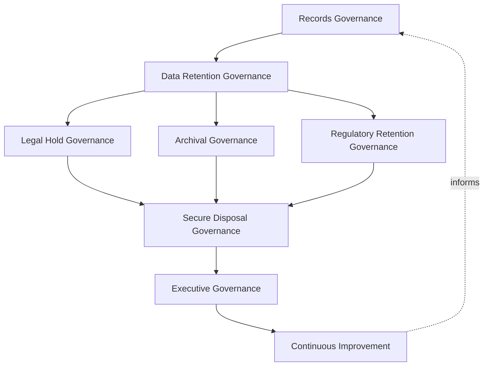
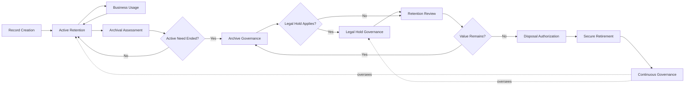
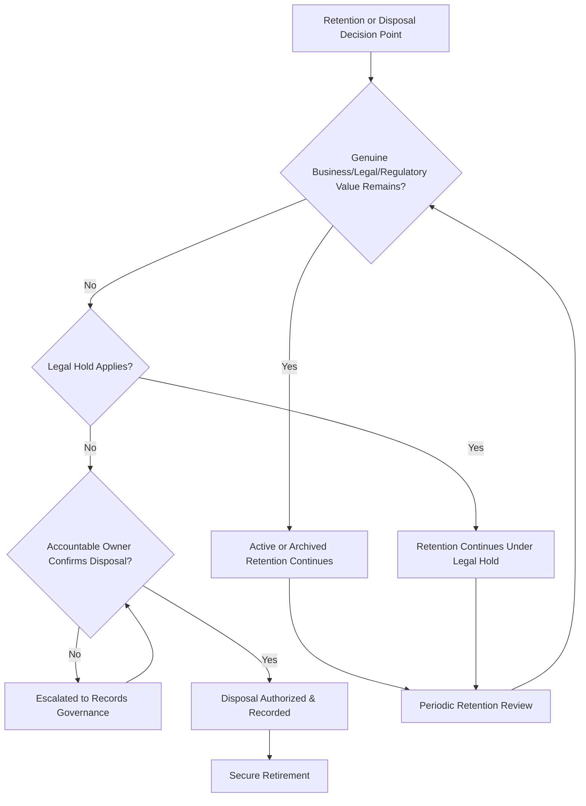
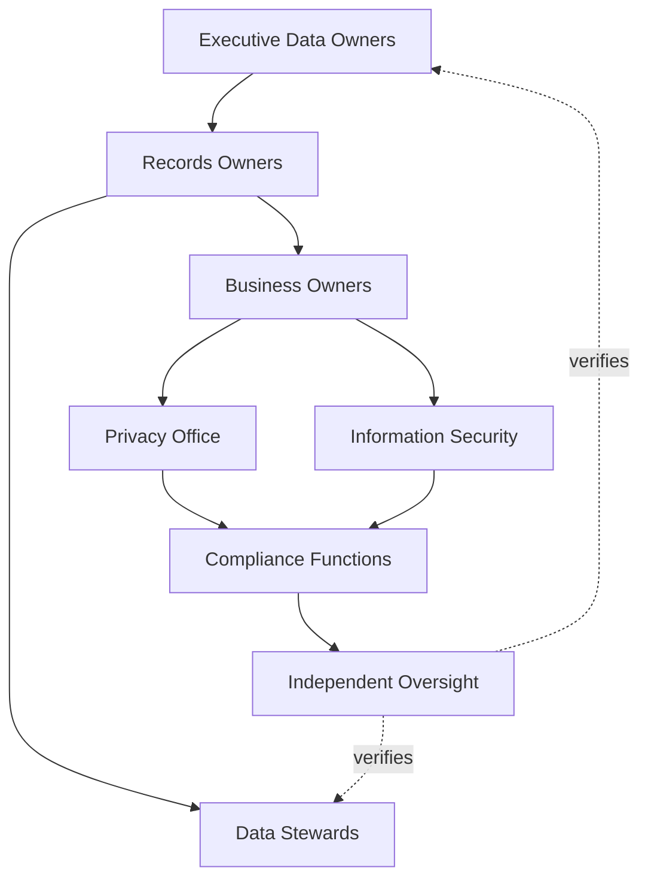
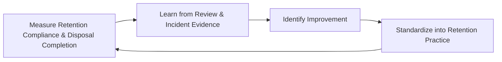
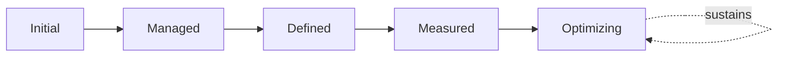

# Enterprise Data Retention & Disposal Governance Strategy

## 1. Document Purpose

This document defines the official Enterprise Data Retention & Disposal Governance Strategy for **StackLeo Tech Store** — the CDO/CPO/CISO-owned executive charter under which every record's retention and eventual disposal is deliberately governed. It establishes governance for data retention, records retention, archival governance, legal hold governance, secure disposal governance, organizational accountability, executive oversight, and long-term retention maturity, consistent with DAMA-DMBOK, ISO/IEC 27001, ISO/IEC 27701, and TOGAF enterprise architecture thinking.

`data-retention.md` remains the operational governance framework for retention practice — the document that elaborates in full operational depth StackLeo's retention strategy, archival strategy, deletion strategy, and backup relationship. This document sits above it as executive mandate, consistent with the executive-charter relationship `data-governance-strategy.md` holds over `data-governance.md`: it does not restate operational detail, it establishes the philosophy, accountability structure, and executive expectations that give that operational practice authority and continuity, coordinated with `data-lifecycle-governance.md` (Sections 3.5–3.7) and `privacy-governance.md`.

- **Purpose of Data Retention Governance** — to ensure every record is retained for exactly as long as it continues to hold genuine business, legal, or regulatory value, and is disposed of deliberately and securely once that value has genuinely ended — never retained by default and never destroyed prematurely.
- **Relationship with Enterprise Data Governance** — this strategy is the retention-specific elaboration of `data-governance-strategy.md`; where that strategy governs data as a whole, this document governs specifically how long data persists and when it is disposed of.
- **Relationship with Data Lifecycle Governance** — `data-lifecycle-governance.md` (Sections 3.5–3.7) introduces retention, archival, and disposal as lifecycle stages; this strategy is their dedicated, full governance elaboration, given the distinct legal, regulatory, and records-management discipline retention and disposal decisions carry.
- **Relationship with Privacy Governance** — personal data retention and disposal are governed under this strategy in coordination with `privacy-governance.md`, ensuring individuals' data is never retained beyond its lawful, justified purpose.
- **Relationship with Information Security** — records at every retention stage require protection proportionate to their classification; this strategy governs the retention decision itself, while `security-governance.md` and `security-controls-framework.md` govern the technical protection applied throughout.
- **Relationship with Compliance Governance** — retention periods frequently trace directly to specific regulatory or contractual obligation; this strategy ensures those obligations, tracked in `06_Security/compliance.md`, are reliably reflected in how records are actually retained and disposed of.
- **Relationship with Enterprise Governance** — data retention governance is not a separate structure from how StackLeo governs the rest of the business; it is the retention-specific application of the same executive accountability, policy discipline, and control assurance applied enterprise-wide in `06_Security/policy-management.md` and `06_Security/internal-controls.md`.

This document is implementation-independent and vendor-neutral. It defines data retention governance philosophy, model, domains, and lifecycle conceptually — not specific backup vendors, storage providers, archival platforms, records management software, cloud providers, consulting firms, security products, retention schedules, backup policies, archive configurations, secure deletion techniques, storage architectures, infrastructure configurations, deployment architectures, operational procedures, or code.

## 2. Data Retention Governance Philosophy

Data retention governance at StackLeo rests on eight principles. Each exists to produce a specific business outcome — retention and disposal are governed deliberately because both extremes — retaining everything and disposing prematurely — carry genuine, distinct business cost.

### 2.1 Retain Data for Legitimate Business Value

Data is retained only for as long as it continues to serve a genuine business, legal, or regulatory purpose, never by default or inertia.

- **Business Value** — limits the accumulated cost and exposure of holding data that no longer serves any real purpose.

### 2.2 Dispose of Data Responsibly

When retention value has genuinely ended, data is disposed of deliberately and completely, never left to linger simply because disposal was inconvenient.

- **Business Value** — reduces the risk surface data with no remaining purpose otherwise represents indefinitely.

### 2.3 Accountability

Every retention and disposal decision traces to a specific, named, responsible party.

- **Business Value** — ensures every record's continued existence or eventual removal has someone genuinely responsible for defending it.

### 2.4 Records as Business Assets

Records are treated as a managed business asset with a defined value and a defined useful life, not an incidental technical byproduct.

- **Business Value** — ensures records receive investment and attention proportionate to the genuine business or legal value they hold.

### 2.5 Governance by Design

Retention governance structures are established deliberately as a new record category is introduced, not retrofitted once ungoverned accumulation has already occurred.

- **Business Value** — prevents the costly, high-visibility discovery of retention gaps only after an incident or audit has already demonstrated their absence.

### 2.6 Risk Awareness

Retention and disposal decisions weigh the genuine business, legal, and reputational risk on both sides — the risk of retaining too long and the risk of disposing too soon.

- **Business Value** — ensures governance attention is proportionate to what a given retention or disposal decision could actually cost the business if handled poorly.

### 2.7 Regulatory Awareness

Retention decisions reflect applicable regulatory and contractual obligation where relevant, never assumed to default to a generic, ungoverned period.

- **Business Value** — protects the business's standing with regulators and contractual counterparties who impose specific retention requirements.

### 2.8 Continuous Improvement

Retention governance practice matures over time, informed by real review findings, incidents, and the organization's growth in scale and regulatory reach.

- **Business Value** — keeps retention governance aligned with StackLeo's growth in data volume, business model complexity, and market reach.

## 3. Enterprise Data Retention Governance Model

Data retention governance operates across eight conceptual layers, each holding accountability for a distinct dimension of retention and disposal practice.

### 3.1 Records Governance

- **Purpose** — own the overall coherence of how records are recognized, categorized, and governed as a distinct asset class.
- **Governance Scope** — oversight spanning every layer in this model and every domain in Section 4.
- **Business Value** — ensures records governance operates as a single coherent discipline, not a collection of disconnected local practices.
- **Executive Expectations** — leadership trusts no record category exists outside this framework's visibility.

### 3.2 Data Retention Governance

- **Purpose** — own the coherence of how long each record category is retained.
- **Governance Scope** — oversight of Active Retention and Retention Review (Sections 5.2, 5.7) across every domain in Section 4.
- **Business Value** — ensures retention periods trace to genuine business, legal, or regulatory rationale, consistent with Section 2.1.
- **Executive Expectations** — leadership trusts retention periods are periodically reconfirmed, not fixed once and forgotten.

### 3.3 Legal Hold Governance

- **Purpose** — own the coherence of how normal retention and disposal is suspended when litigation, investigation, or regulatory inquiry requires preservation.
- **Governance Scope** — oversight of Legal Hold Governance (Section 5.6) across every domain, overriding standard retention and disposal timelines where genuinely warranted.
- **Business Value** — protects the business's legal position by ensuring relevant records are never disposed of while a genuine preservation obligation exists.
- **Executive Expectations** — leadership trusts legal holds are applied and lifted deliberately, never informally managed.

### 3.4 Archival Governance

- **Purpose** — own the coherence of how records whose active need has ended are moved into a retained, non-active state.
- **Governance Scope** — oversight of Archival Assessment and Archive Governance (Sections 5.4–5.5), coordinated with `data-lifecycle-governance.md` (Section 3.6).
- **Business Value** — preserves records of continuing value without treating them as active, in-use data indefinitely.
- **Executive Expectations** — leadership trusts archival eligibility is confirmed deliberately, not left to informal accumulation.

### 3.5 Secure Disposal Governance

- **Purpose** — own the coherence of how records are formally and permanently removed once no business, legal, or regulatory value remains.
- **Governance Scope** — oversight of Disposal Authorization and Secure Retirement (Sections 5.8–5.9), the highest-consequence stage in this model when handled prematurely or excessively delayed.
- **Business Value** — reduces the accumulated risk and cost of retaining records with no remaining genuine purpose, without discarding records still genuinely needed.
- **Executive Expectations** — leadership expects disposal to be an explicit, approved decision, never incidental or accidental.

### 3.6 Regulatory Retention Governance

- **Purpose** — own the coherence of how retention reflects specific regulatory or contractual obligation.
- **Governance Scope** — oversight of Regulatory Records (Section 4.9), coordinated with `06_Security/compliance.md`.
- **Business Value** — ensures the records carrying the greatest external obligation receive retention traceable to that obligation.
- **Executive Expectations** — leadership expects regulatory retention periods to be reviewed whenever applicable obligations change.

### 3.7 Executive Governance

- **Purpose** — own executive-level accountability for the retention and disposal decisions carrying the greatest organizational consequence.
- **Governance Scope** — oversight spanning Sections 3.1–3.6 wherever a retention matter rises to genuine executive concern.
- **Business Value** — ensures the most consequential retention decisions are visible at the level accountable for organizational risk.
- **Executive Expectations** — leadership expects to be informed of, not surprised by, the platform's highest-risk retention matters.

### 3.8 Continuous Improvement

- **Purpose** — govern the mechanism by which every other layer in this model matures over time.
- **Governance Scope** — consolidates findings from retention reviews, audits, and incidents across every domain in Section 4.
- **Business Value** — prevents retention governance itself from becoming the next thing that quietly stagnates as the organization scales.
- **Executive Expectations** — leadership expects retention governance maturity to be assessed periodically, not assumed static once established.

### Enterprise Data Retention Governance Matrix

| Layer | Purpose | Business Value | Executive Expectations |
|---|---|---|---|
| Records Governance | Own overall coherence of how records are recognized and governed | Ensures records governance operates as a single coherent discipline | Trusts no record category exists outside this framework's visibility |
| Data Retention Governance | Own coherence of how long each record category is retained | Ensures periods trace to genuine business/legal/regulatory rationale | Trusts periods are periodically reconfirmed, not fixed forever |
| Legal Hold Governance | Own coherence of preservation obligations overriding normal retention | Protects the business's legal position during litigation/investigation | Trusts holds are applied and lifted deliberately |
| Archival Governance | Own coherence of moving ended-need records to a retained state | Preserves value without treating records as active data indefinitely | Trusts archival eligibility is confirmed deliberately |
| Secure Disposal Governance | Own coherence of permanent removal once value has ended | Reduces risk/cost of purposeless retention without premature loss | Expects disposal to be explicit and approved, never incidental |
| Regulatory Retention Governance | Own coherence of retention tied to specific obligation | Ensures highest-obligation records trace to their specific obligation | Expects review whenever applicable obligations change |
| Executive Governance | Own executive accountability for highest-consequence decisions | Ensures the most consequential decisions are visible to leadership | Expects leadership informed of, not surprised by, top matters |
| Continuous Improvement | Govern maturation of every other layer | Prevents governance itself from stagnating | Expects maturity to be assessed periodically |

*Diagram 1: Enterprise Data Retention Governance Framework — records and retention governance establish the foundation, legal hold and regulatory retention govern preservation obligations, archival governance manages wind-down, and secure disposal converges with executive oversight on continuous improvement that feeds back into the model.*

## 4. Enterprise Data Retention Domains

Records retention is governed across ten conceptual domains, each requiring a distinct retention emphasis.

### 4.1 Customer Records

- **Purpose** — represent individual shoppers' profiles, order history, and account relationship records.
- **Retention Considerations** — governed under Data Retention Governance (Section 3.2), coordinated with `privacy-governance.md`.
- **Business Importance** — foundation of the direct-to-consumer relationship and repeat commerce.
- **Executive Expectations** — leadership expects customer record retention to be justified by genuine ongoing relationship value, not indefinite default.

### 4.2 Product Records

- **Purpose** — represent historical catalog, pricing, and product lifecycle records.
- **Retention Considerations** — governed under Archival Governance (Section 3.4), given the operational value of discontinued product history.
- **Business Importance** — supports historical reporting, warranty support, and catalog evolution analysis.
- **Executive Expectations** — leadership expects discontinued product records to be archived deliberately, not retained as active data indefinitely.

### 4.3 Order & Transaction Records

- **Purpose** — represent the record of what customers have purchased and how it was fulfilled.
- **Retention Considerations** — governed under Regulatory Retention Governance (Section 3.6), given financial, warranty, and dispute-resolution relevance.
- **Business Importance** — protects the business's ability to resolve disputes and demonstrate transaction history when required.
- **Executive Expectations** — leadership expects order record retention periods to be explicitly justified and periodically reviewed.

### 4.4 Financial Records

- **Purpose** — represent payment, refund, and financial reconciliation records.
- **Retention Considerations** — governed under the highest rigor within Regulatory Retention Governance (Section 3.6), given regulatory and audit sensitivity.
- **Business Importance** — protects the business's financial integrity and its standing with regulators and payment partners.
- **Executive Expectations** — leadership expects financial record retention to meet the strictest regulatory-traceability standard in this model.

### 4.5 Employee Records

- **Purpose** — represent StackLeo's own workforce records.
- **Retention Considerations** — governed under Data Retention Governance (Section 3.2), coordinated with `06_Security/identity-lifecycle.md` and applicable employment obligations.
- **Business Importance** — protects the organization's obligations to its own current and former people.
- **Executive Expectations** — leadership expects employee record disposal to occur promptly once retention obligations expire.

### 4.6 Vendor & Supplier Records

- **Purpose** — represent StackLeo's suppliers, service providers, and contractual relationship history.
- **Retention Considerations** — governed under Data Retention Governance (Section 3.2), tied to the vendor relationship's own lifecycle.
- **Business Importance** — protects the integrations and contractual relationships the commerce experience depends on.
- **Executive Expectations** — leadership expects vendor records to be archived or disposed of promptly at relationship end.

### 4.7 Marketplace Records

- **Purpose** — represent the future multi-vendor marketplace's seller listings, commissions, and cross-vendor transaction history.
- **Retention Considerations** — governed under Regulatory Retention Governance (Section 3.6), structured ahead of the marketplace model's launch.
- **Business Importance** — will become foundational to the multi-vendor marketplace business model as it launches.
- **Executive Expectations** — leadership expects marketplace record retention governance to be designed before, not retrofitted after, launch.

### 4.8 Analytics & AI Records

- **Purpose** — represent aggregated, derived, and AI training/inference records.
- **Retention Considerations** — governed under Archival Governance (Section 3.4), with retention tracking the underlying source record's own retention status.
- **Business Importance** — protects against a category of records whose continued relevance is easy to overlook precisely because they are derived.
- **Executive Expectations** — leadership expects analytics and AI record disposal to be coordinated with the disposal of underlying source records.

### 4.9 Regulatory Records

- **Purpose** — represent records retained specifically to satisfy a regulatory, legal, or audit obligation.
- **Retention Considerations** — governed under Regulatory Retention Governance (Section 3.6), coordinated with `06_Security/compliance.md` and `06_Security/audit-governance.md`.
- **Business Importance** — protects the business's ability to demonstrate compliance when required.
- **Executive Expectations** — leadership expects regulatory records to be retained for exactly as long as obligation requires, no longer and no less.

### 4.10 Third-Party Records

- **Purpose** — represent records documenting data received from or shared with external vendors, partners, and integrations.
- **Retention Considerations** — governed under Records Governance (Section 3.1), scoped to the specific terms of the third-party relationship.
- **Business Importance** — protects records whose retention depends partly on an external party's own obligations and commitments.
- **Executive Expectations** — leadership expects third-party record retention to be reviewed as part of any partnership or vendor agreement change.

### Enterprise Records Domain Matrix

| Domain | Purpose | Business Importance | Executive Expectations |
|---|---|---|---|
| Customer Records | Represent shoppers' profiles, order history, account records | Foundation of the direct-to-consumer relationship | Retention justified by genuine ongoing value, not indefinite default |
| Product Records | Represent historical catalog, pricing, product lifecycle records | Supports historical reporting and catalog evolution analysis | Discontinued records archived deliberately, not left active |
| Order & Transaction Records | Represent purchase records and fulfillment history | Protects dispute resolution and transaction history capability | Retention periods explicitly justified and periodically reviewed |
| Financial Records | Represent payments, refunds, and reconciliation | Protects financial integrity and regulator/partner standing | Meets the strictest regulatory-traceability standard |
| Employee Records | Represent StackLeo's own workforce records | Protects obligations to current and former employees | Disposal occurs promptly once retention obligations expire |
| Vendor & Supplier Records | Represent suppliers, providers, contractual history | Protects contractual relationships commerce depends on | Archived or disposed of promptly at relationship end |
| Marketplace Records | Represent future multi-vendor listings, commissions, transactions | Will become foundational to the marketplace business model | Designed before, not retrofitted after, launch |
| Analytics & AI Records | Represent aggregated, derived, and AI training/inference records | Protects easily-overlooked derived-record relevance | Disposal coordinated with underlying source record disposal |
| Regulatory Records | Represent records satisfying a specific obligation | Protects the ability to demonstrate compliance when required | Retained exactly as long as obligation requires, no more, no less |
| Third-Party Records | Represent data received from or shared with external parties | Protects records whose retention depends on external obligations | Reviewed as part of any partnership or vendor agreement change |

## 5. Enterprise Data Retention Lifecycle

Records are governed across ten conceptual lifecycle stages, applicable across every domain in Section 4.

### 5.1 Record Creation

- **Purpose** — establish a new record through a deliberate, authorized business process.
- **Governance Objectives** — require the record's retention rationale to be identified at the point of creation, never assigned retroactively.
- **Business Value** — ensures retention governance begins at the earliest, least costly point in the record's life.

### 5.2 Active Retention

- **Purpose** — retain a record in active use for as long as its genuine, current business purpose requires.
- **Governance Objectives** — require active retention to reflect a genuine, current purpose, consistent with Section 2.1.
- **Business Value** — ensures active records remain readily available for the purpose that justifies their continued active state.

### 5.3 Business Usage

- **Purpose** — govern how an actively retained record is used consistent with its purpose.
- **Governance Objectives** — require usage to be monitored for consistency with the record's original retention justification.
- **Business Value** — ensures records are not retained under one justification while actually being used for another, ungoverned purpose.

### 5.4 Archival Assessment

- **Purpose** — determine whether a record's active business need has genuinely ended.
- **Governance Objectives** — require assessment to occur on a predictable, regular cadence, proportionate to the domain's importance.
- **Business Value** — catches records whose active need has ended before they continue accumulating active-state cost or risk unnecessarily.

### 5.5 Archive Governance

- **Purpose** — move a record whose active need has ended into a retained, non-active state.
- **Governance Objectives** — require archival eligibility to be confirmed by the record's accountable owner, consistent with Section 3.4.
- **Business Value** — preserves records of continuing value without treating them as active data indefinitely.

### 5.6 Legal Hold Governance

- **Purpose** — suspend normal retention and disposal timelines where litigation, investigation, or regulatory inquiry requires preservation.
- **Governance Objectives** — require a legal hold to be explicitly applied and explicitly lifted, never informally managed or assumed.
- **Business Value** — protects the business's legal position by ensuring relevant records are never disposed of during a genuine preservation obligation.

### 5.7 Retention Review

- **Purpose** — formally reassess whether a record's retention remains genuinely justified.
- **Governance Objectives** — require review to occur on a predictable, regular cadence, proportionate to the record's classification and regulatory relevance.
- **Business Value** — catches records whose retention justification has become stale before they accumulate unnecessary cost or risk.

### 5.8 Disposal Authorization

- **Purpose** — formally decide, once retention review confirms no remaining value, that a record is authorized for disposal.
- **Governance Objectives** — require authorization to trace to a specific, accountable owner, distinct from an automatic or default outcome.
- **Business Value** — ensures disposal is a deliberate decision, never an accident or an unexamined default.

### 5.9 Secure Retirement

- **Purpose** — formally and permanently remove the record once disposal has been authorized.
- **Governance Objectives** — require retirement to be complete and confirmed, coordinated with `data-lifecycle-governance.md` (Section 5.9).
- **Business Value** — prevents records from continuing to exist in a partially disposed, ambiguous state.

### 5.10 Continuous Governance

- **Purpose** — sustain oversight of records across every stage, rather than treating governance as a one-time gate.
- **Governance Objectives** — require reassessment of retention justification and legal hold status to run continuously alongside, not only at, discrete lifecycle events.
- **Business Value** — catches unjustified retention or an unlifted legal hold before it becomes a genuine risk.

### Enterprise Data Retention Lifecycle Matrix

| Stage | Purpose | Governance Objective | Business Value |
|---|---|---|---|
| Record Creation | Establish a new record through an authorized process | Retention rationale identified at creation, never retroactive | Ensures governance begins at the earliest, least costly point |
| Active Retention | Retain a record while genuine business purpose requires | Reflects a genuine, current purpose | Ensures active records remain available for their justifying purpose |
| Business Usage | Govern use consistent with the record's purpose | Usage monitored for consistency with original justification | Prevents records retained under one purpose, used for another |
| Archival Assessment | Determine whether active need has genuinely ended | Predictable cadence, proportionate to domain importance | Catches ended-need records before unnecessary accumulation |
| Archive Governance | Move ended-need records into a retained state | Eligibility confirmed by the accountable owner | Preserves value without treating records as active indefinitely |
| Legal Hold Governance | Suspend normal timelines for preservation obligations | Explicitly applied and explicitly lifted, never informal | Protects legal position during genuine preservation obligations |
| Retention Review | Reassess whether retention remains justified | Predictable cadence, proportionate to classification | Catches stale retention justification before it accumulates risk |
| Disposal Authorization | Decide a record is authorized for disposal | Traces to a specific, accountable owner | Ensures disposal is deliberate, never accidental or default |
| Secure Retirement | Permanently remove the record once authorized | Complete and confirmed removal | Prevents records existing in a partially disposed, ambiguous state |
| Continuous Governance | Sustain oversight across every stage | Reassessment runs continuously | Catches unjustified retention or unlifted holds before they become risk |

*Diagram 2: Enterprise Data Retention Lifecycle — a record proceeds from creation through active retention and use into archival assessment and archive governance, with legal hold suspending normal timelines where warranted, before retention review, disposal authorization, and secure retirement close the cycle under continuous governance.*

## 6. Data Retention Governance Principles

- **Accountability** — every retention and disposal decision traces to a specific, named, responsible party, consistent with Section 2.3.
- **Business Value** — retention decisions reflect a record's genuine, current business value, never an unexamined default.
- **Regulatory Awareness** — retention decisions reflect applicable regulatory and contractual obligation where relevant, consistent with Section 2.7.
- **Traceability** — every retention and disposal decision can be traced to its rationale, owner, and timing.
- **Transparency** — a record's retention status and rationale are documented and visible to those who need to know it, never hidden or informally understood.
- **Data Minimization** — records are not retained beyond the minimum period genuine business, legal, or regulatory need requires.
- **Risk Awareness** — retention and disposal decisions weigh the genuine risk on both sides — retaining too long and disposing too soon.
- **Continuous Improvement** — governance practice matures over time, informed by real review findings and incidents.

### Data Retention Governance Principles Matrix

| Principle | Description | Business Value |
|---|---|---|
| Accountability | Every decision traces to a specific, named, responsible party | Ensures retention decisions have a clear owner |
| Business Value | Decisions reflect genuine, current business value | Prevents retention as an unexamined default |
| Regulatory Awareness | Decisions reflect applicable regulatory/contractual obligation | Ensures obligated records are never under-retained |
| Traceability | Decisions traceable to rationale, owner, timing | Enables defensible, evidence-based retention decisions |
| Transparency | Retention status and rationale documented and visible | Prevents governance from being hidden or informally understood |
| Data Minimization | Records not retained beyond the minimum genuine need requires | Limits accumulated exposure and cost of unnecessary retention |
| Risk Awareness | Decisions weigh risk on both retention and disposal sides | Ensures neither extreme is favored without genuine justification |
| Continuous Improvement | Practice matures from real review findings and incidents | Keeps retention governance aligned with organizational growth |

*Diagram 4: Enterprise Retention Governance Decision Flow — a retention decision point is checked for genuine remaining value and legal hold status, escalated where ownership is unconfirmed, and resolved into continued retention or authorized, recorded disposal, subject to periodic review.*

## 7. Ownership & Accountability

Governance authority for retention and disposal is distributed deliberately across eight accountable functions, defined here at the governance-objective level, without prescribing specific operational retention activities.

### 7.1 Executive Data Owners

- **Governance Objective** — executive data owners hold ultimate accountability for the retention governance strategy and its enforcement across the organization.
- **Business Value** — provides a single point of executive accountability for whether retention governance is genuinely functioning as intended.

### 7.2 Records Owners

- **Governance Objective** — each record category has a records owner accountable for its retention rationale and eventual disposal authorization.
- **Business Value** — ensures every record category has someone genuinely responsible for defending its continued retention.

### 7.3 Business Owners

- **Governance Objective** — business functions own the justification for the genuine business value a given record continues to hold.
- **Business Value** — keeps retention decisions grounded in real business responsibility rather than administrative convenience.

### 7.4 Data Stewards

- **Governance Objective** — data stewards monitor day-to-day retention status for their assigned record category on the owner's behalf.
- **Business Value** — ensures retention status is actively monitored as an ongoing practice, not a responsibility left implicit within ownership alone.

### 7.5 Privacy Office

- **Governance Objective** — the privacy office confirms personal record retention satisfies applicable privacy obligations, coordinated with `privacy-governance.md`.
- **Business Value** — ensures retention governance protects individuals' data from being held beyond its lawful purpose.

### 7.6 Information Security

- **Governance Objective** — information security ensures records receive protection proportionate to their classification throughout retention, coordinated with `06_Security/security-governance.md`.
- **Business Value** — ensures retention decisions never leave a record under-protected relative to its genuine sensitivity.

### 7.7 Compliance Functions

- **Governance Objective** — compliance functions confirm that retention governance, particularly Regulatory Records (Section 4.9), satisfies applicable regulatory and contractual obligations.
- **Business Value** — ensures retention governance protects the business's standing with regulators, partners, and enterprise customers.

### 7.8 Independent Oversight

- **Governance Objective** — an independent function, separate from those who design and operate retention governance, periodically verifies it is genuinely functioning as documented.
- **Business Value** — prevents governance from being assumed effective on the word of the same function responsible for running it.

### Ownership & Accountability Matrix

| Role | Governance Objective | Business Value |
|---|---|---|
| Executive Data Owners | Hold ultimate accountability for the strategy and its enforcement | Provides a single point of executive accountability |
| Records Owners | Own retention rationale and disposal authorization for a category | Ensures every category has a genuinely responsible party |
| Business Owners | Own the justification for a record's continuing business value | Keeps retention grounded in genuine business responsibility |
| Data Stewards | Monitor day-to-day retention status on the owner's behalf | Ensures retention status is actively monitored, not implicit |
| Privacy Office | Confirm personal record retention satisfies privacy obligations | Protects individuals' data from being held beyond lawful purpose |
| Information Security | Ensure protection matches classification throughout retention | Prevents decisions from leaving records under-protected |
| Compliance Functions | Confirm retention satisfies regulatory/contractual obligations | Protects standing with regulators, partners, enterprise customers |
| Independent Oversight | Independently verify governance functions as documented | Prevents self-assessed assumption of effectiveness |

*Diagram 3: Records Ownership & Accountability Model — accountability flows from executive data ownership through records ownership into business ownership and stewardship, with privacy and security functions converging on compliance and independent oversight.*

## 8. Executive Oversight

- **Executive Retention Reviews** — the overall coherence of retention governance is formally reviewed on a regular cadence, consistent with `06_Security/security-governance.md` (Section 6).
- **Governance Reporting** — aggregated retention health — retention compliance, archival timeliness, disposal completion — is reported to executive leadership.
- **Risk Reviews** — retention-related risk from `06_Security/risk-management.md` and `06_Security/security-risk-management.md` is reviewed alongside broader enterprise and security risk, never in isolation.
- **Legal Hold Oversight** — active legal holds are reviewed by executive leadership to confirm they remain genuinely warranted and are lifted promptly once resolved.
- **Documentation Governance** — this strategy's relationship to `data-governance-strategy.md`, `data-lifecycle-governance.md`, `data-retention.md`, and `privacy-governance.md` is kept current as those documents evolve.
- **Audit Readiness** — retention and disposal decisions, reviews, and their outcomes are maintained in a state ready for internal or external audit at any time, coordinated with `06_Security/audit-governance.md`.

### Executive Oversight Matrix

| Oversight Mechanism | Purpose | Governance Role |
|---|---|---|
| Executive Retention Reviews | Confirm overall retention governance coherence | Regular, predictable cadence for the strategy as a whole |
| Governance Reporting | Provide leadership a single, coherent retention picture | Reports retention compliance, archival timeliness, disposal completion |
| Risk Reviews | Review retention risk alongside broader risk visibility | Not conducted in isolation from enterprise or security risk |
| Legal Hold Oversight | Confirm holds remain warranted and are lifted promptly | Direct executive visibility into active preservation obligations |
| Documentation Governance | Keep this strategy's subordinate relationships current | Updated as related documents evolve |
| Audit Readiness | Maintain decisions and reviews ready for independent review | Continuous state, coordinated with audit governance |

### Governance Responsibility Matrix

| Role | Responsibility |
|---|---|
| CDO / CPO / CISO | Owns coherence and enforcement of this strategy, in partnership with Executive Leadership. |
| Data Retention Governance Lead | Owns the operational retention model within `data-retention.md`. |
| Records Owners | Own retention rationale and disposal authorization within their assigned domain. |
| Data Stewards | Monitor retention status on behalf of their assigned owner. |
| Privacy Office | Owns personal record retention governance in coordination with `privacy-governance.md`. |
| Information Security | Owns protection commensurate with classification throughout retention. |
| Legal / Compliance Function | Owns legal hold determination and regulatory retention obligation tracking. |
| Independent Oversight / Internal Audit | Independently verifies that retention governance records reflect actual practice. |

## 9. Future Readiness

This strategy is designed to remain valid as StackLeo evolves in scale, geography, and organizational complexity, without requiring redefinition of its underlying philosophy.

- **AI-Generated Records** — records newly created by AI-assisted capability are governed under Record Creation (Section 5.1) as a genuine new record category, with retention rationale identified from origin, never assumed to inherit indefinite retention by default.
- **Intelligent Retention Governance** — as retention activity increasingly incorporates AI-assisted analysis to identify archival or disposal candidates, it remains governed under Continuous Governance (Section 5.10) at the same rigor and explainability standard as any other governance method.
- **Global Regulatory Expansion** — Regulatory Retention Governance (Section 3.6) is defined independently of any single jurisdiction, so it extends coherently as StackLeo expands from Bangladesh into South Asia and global markets with new regulatory obligations.
- **Multi-Tenant Platforms** — where future architecture introduces tenant isolation, retention governance extends to explicitly scope retention and disposal per tenant.
- **Enterprise Scale** — the governance model, domains, and lifecycle defined throughout this strategy are defined independently of organizational size, so they remain coherent as record volume grows substantially.
- **Digital Trust** — this strategy's governance discipline is treated as a direct contributor to the digital trust customers, partners, and regulators extend to StackLeo, not merely an internal control exercise.
- **Sustainable Information Governance** — Dispose of Data Responsibly (Section 2.2) extends to encompass the operational and environmental efficiency of not retaining records indefinitely beyond genuine need.
- **Future Digital Enterprises** — Marketplace and Third-Party Records (Sections 4.7, 4.10) are structured to absorb genuinely new categories of record relationship as StackLeo's ecosystem of partners and sellers grows.

## 10. Data Retention Governance Maturity Model

Data retention governance maturity is described across five conceptual levels, consistent with DAMA-DMBOK and established process maturity thinking.

- **Initial** — retention governance, where it exists, is informal and inconsistent; records accumulate indefinitely without a genuine retention rationale.
- **Managed** — basic retention governance exists for individual record domains, but consistency across the ten domains in Section 4 varies significantly.
- **Defined** — the governance model, domains, and lifecycle are standardized, documented, and consistently applied across the organization, consistent with the model defined throughout this strategy.
- **Measured** — retention compliance, archival timeliness, and disposal completion are measured systematically, and decisions are grounded in genuine evidence rather than qualitative impression alone.
- **Optimizing** — retention governance is continuously and deliberately improved based on quantitative evidence and organizational learning; improvement itself is a managed, ongoing discipline rather than an occasional initiative.

### Data Retention Governance Maturity Model Matrix

| Level | Characteristics | Primary Focus |
|---|---|---|
| Initial | Informal, inconsistent governance; records accumulate without rationale | Ad hoc, individually-dependent retention practice |
| Managed | Basic governance exists per domain; consistency varies | Domain-level consistency |
| Defined | Standardized governance model, domains, and lifecycle | Organization-wide consistency and clear ownership |
| Measured | Retention compliance and disposal completion measured systematically | Evidence-based retention governance decisions |
| Optimizing | Practice continuously and deliberately improved from evidence | Sustained, deliberate improvement as a discipline |

*Diagram 5: Continuous Data Retention Improvement Cycle — retention review and audit outcomes are measured, learned from, improved upon, and standardized back into governed practice, on a continuing basis.*

*Diagram 6: Data Retention Governance Maturity Progression Model — maturity advances from informal, indefinite record accumulation toward standardized, measured, and continuously optimized data retention governance.*

## 11. Anti-Patterns

The following recurring failure patterns are explicitly recognized and avoided, as each one structurally undermines this strategy.

### Anti-Pattern Summary

| Anti-Pattern | Why It's Avoided |
|---|---|
| Retaining Everything Forever | Contradicts Retain Data for Legitimate Business Value (Section 2.1); indefinite default retention accumulates cost and exposure with no corresponding benefit. |
| Premature Disposal | Contradicts Business Value (Section 6); disposing of records still holding genuine business, legal, or regulatory value destroys recoverable value. |
| Unknown Record Ownership | Contradicts Records Owners (Section 7.2); a record category with no accountable owner has no one genuinely responsible for its retention or disposal. |
| Weak Executive Visibility | Contradicts Governance Reporting (Section 8); leadership cannot govern retention risk it is never shown. |
| Poor Documentation | Undermines Documentation Governance (Section 8) and Transparency (Section 6), leaving retention decisions unclear or unverifiable after the fact. |
| Legal Hold Without Governance | Contradicts Legal Hold Governance (Section 3.3); an informally managed hold risks either premature disposal of relevant records or holds that are never lifted once resolved. |
| Compliance Without Governance | Contradicts Compliance Functions (Section 7.7); satisfying a regulatory checklist without genuine underlying governance leaves the organization compliant on paper and exposed in practice. |
| Missing Continuous Improvement | Contradicts Continuous Improvement (Section 2.8) and Continuous Improvement (Section 3.8); without deliberate improvement, retention governance stagnates as the organization and record volume grow. |

## 12. Document Information

| Property | Value |
|----------|-------|
| Document | data-retention-governance.md |
| Version | 1.0.0 |
| Status | Active |
| Maintained By | StackLeo |
| Last Updated | 2026-07-24 |

---

© StackLeo. All Rights Reserved.
