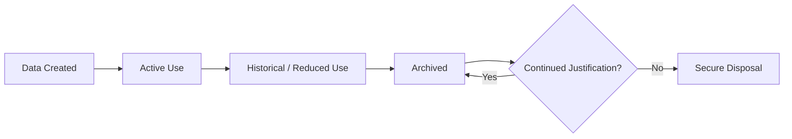
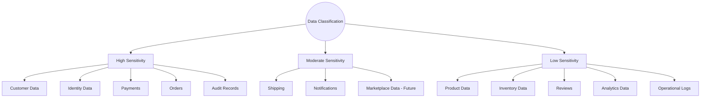
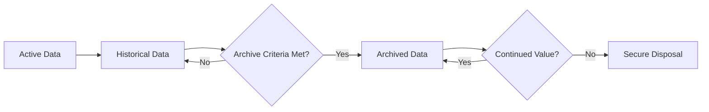
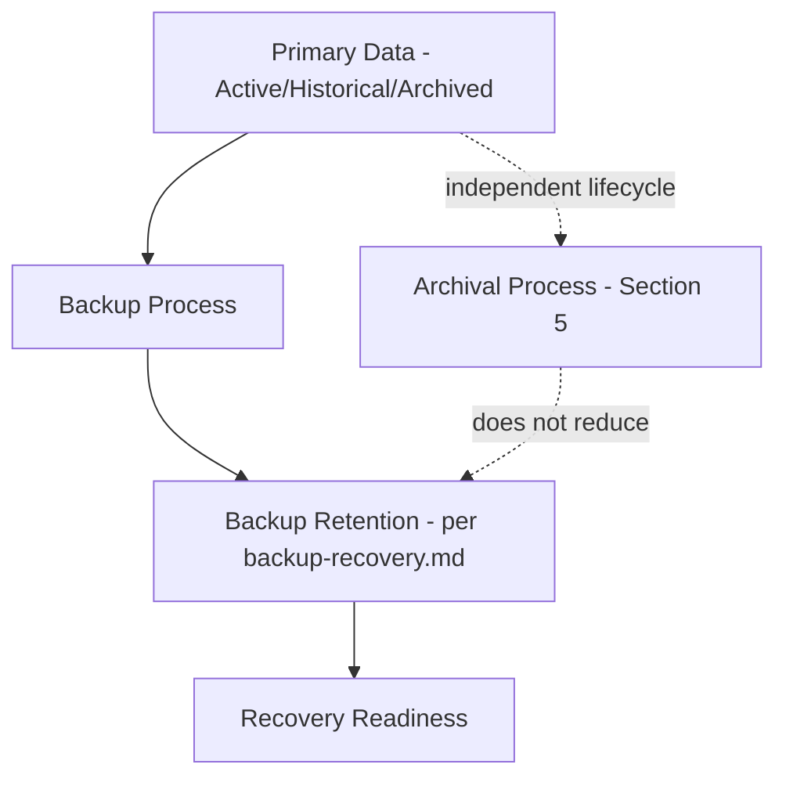
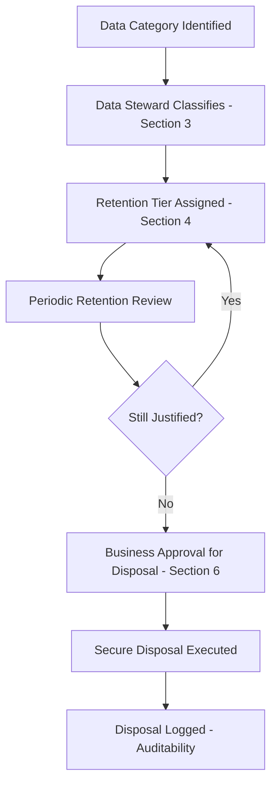

# Data Retention & Lifecycle Strategy

## 1. Document Purpose

This document is the official Data Retention & Lifecycle Strategy for **StackLeo Tech Store**. It defines how business data is retained, archived, anonymized, recovered, and securely disposed of throughout its lifecycle.

- **Purpose of Data Retention** — to ensure StackLeo keeps data for exactly as long as it has genuine business, operational, or compliance value, and no longer, avoiding both premature loss of valuable data and indefinite, unjustified accumulation.
- **Relationship with Business Continuity** — retention strategy directly supports the recovery objectives defined in `backup-recovery.md`, ensuring critical data remains available when the business needs it.
- **Relationship with Security** — retained data is a standing security surface; retention strategy works alongside `security-model.md` to minimize unnecessary exposure.
- **Relationship with Governance** — retention decisions are governed deliberately (Section 10), consistent with `data-governance.md`, rather than left to ad hoc, per-team practice.
- **Relationship with Compliance Readiness** — this document establishes the business-driven retention *principles* StackLeo applies; specific legally mandated retention periods are determined separately through dedicated legal and compliance review, consistent with `01_Business/business-rules.md` (Section 17) and `02_Product/non-functional-requirements.md` (NFR-035, NFR-036), and are intentionally not enumerated in this document.

This document is implementation-independent and does not enumerate specific legal retention periods or reference country-specific regulation. It defines the business rationale and lifecycle strategy; specific mandated durations are maintained separately through legal and compliance review, outside this document's scope.

## 2. Data Lifecycle Philosophy

- **Data as a Business Asset** — retained data is treated as a valuable asset (per `database-overview.md`, Section 2), but one that carries ongoing cost and risk, not a free byproduct of operation.
- **Data Minimization** — data is collected and retained only to the extent genuinely necessary for its business purpose, consistent with ARCH-015.
- **Need-to-Retain Principle** — the default question for any data category is "why must this be kept," not "why should this be removed" — retention must be actively justified, not assumed.
- **Business Value** — retention duration is driven by how long a data category continues to provide genuine business, operational, or compliance value (Section 4).
- **Privacy by Design** — customer data retention defaults to the minimum necessary, consistent with `01_Business/business-rules.md` (BR-128).
- **Secure Disposal** — data that has reached the end of its useful life is disposed of deliberately and securely (Section 6), not simply left indefinitely or removed carelessly.
- **Lifecycle Governance** — every data category has an explicitly assigned lifecycle owner (Section 10), accountable for its retention practice remaining current and justified.

*Diagram: Complete Data Lifecycle.*

## 3. Data Classification

| Category | Business Value | Sensitivity | Lifecycle | Archival Readiness |
|---|---|---|---|---|
| Customer Data | Enables the core customer relationship and personalized service. | High — personal data | Active for the account's lifetime; reduced value after account closure | High — well-suited to archival upon closure, per Section 5 |
| Identity Data | Enables secure authentication and authorization. | High — security-critical | Active while the account/session is valid | Moderate — session data ages quickly; credential history has longer-term audit value |
| Product Data | Represents the sellable catalog and its history. | Low-to-moderate — largely public-facing | Active while published; retains reference value after discontinuation | High — discontinued products archive cleanly while remaining referenceable |
| Inventory Data | Represents current and historical stock position. | Low — internal operational | Active continuously; historical movements age in relevance | High — movement history archives well once operationally stale |
| Orders | The authoritative transactional and financial record. | High — financial and personal data | Permanently active as an authoritative reference | Moderate — retained long-term; archival applies to reduce active-tier storage, not to remove |
| Payments | Financial transaction record tied to Orders. | Highest — financial data | Permanently active, tied to Order | Moderate — same pattern as Orders |
| Shipping | Delivery and tracking history tied to Orders. | Moderate — contains address/contact data | Active through delivery; reference value after | High — archives cleanly once delivery is confirmed and the return/warranty window closes |
| Reviews | Public trust signal informing future buyers. | Low — public-facing content | Long-lived, ongoing public value | Low — rarely benefits from archival while still publicly displayed |
| Notifications | Record of customer communication and delivery status. | Moderate — contains contact data | Short active relevance window | High — strong, early archival candidate |
| Audit Records | Accountability record for governed administrative actions. | High — security and compliance value | Long, compliance-driven relevance | High — archived, never casually deleted |
| Operational Logs | Diagnostic and operational history. | Low-to-moderate | Short-to-moderate operational relevance window | High — strong archival/disposal candidate once diagnostic value passes |
| Analytics Data | Aggregated behavioral and performance insight. | Low — aggregated, often de-identified | Ongoing, cumulative value | High — naturally suited to long-term archival/warehouse consumption |
| Marketplace Data (Future) | Seller, listing, and settlement records. | High — business and financial data | Active while Vendor relationship is active | Moderate — anticipated to follow the Orders/Payments pattern once active |

*Diagram: Data Classification Hierarchy.*

## 4. Retention Strategy

Retention approach is described by business rationale rather than fixed timelines; specific durations are determined through dedicated legal and compliance review, outside this document's scope.

| Data Tier | Conceptual Retention Approach | Business Rationale |
|---|---|---|
| Active Data | Retained fully accessible for as long as it supports an ongoing business process (an open Cart, an in-progress Order). | Directly required for current operations; no retention question arises while genuinely active. |
| Historical Data | Retained accessible, but with reduced access frequency, once its originating process concludes (a completed Order). | Retains reference value for customer service, warranty, and dispute resolution. |
| Archived Data | Moved to a lower-cost, less immediately accessible tier once historical relevance diminishes. | Balances continued availability against the cost of retaining everything at full accessibility indefinitely. |
| Audit Data | Retained for an extended, compliance-driven duration, determined through legal review rather than business convenience. | Supports accountability and dispute resolution well beyond the originating transaction's active life. |
| Analytics Data | Retained in aggregated or de-identified form for long-term trend analysis. | Aggregation reduces the sensitivity and retention risk of underlying detailed records. |
| Backup Data | Retained according to the recovery objectives defined in `backup-recovery.md`, independent of the primary data's own retention tier. | Backup retention serves business continuity, not historical reference, and follows its own governed schedule. |

### Retention Strategy Matrix

| Data Tier | Primary Purpose | Access Frequency | Storage Cost Priority |
|---|---|---|---|
| Active Data | Support current operations | High | Performance prioritized over cost |
| Historical Data | Support reference and dispute resolution | Moderate | Balanced |
| Archived Data | Preserve long-term reference/compliance value | Low | Cost-optimized |
| Audit Data | Support accountability and compliance | Very low, but must remain retrievable | Cost-optimized, integrity-prioritized |
| Analytics Data | Support business intelligence | Variable, often batch-oriented | Cost-optimized at scale |
| Backup Data | Support recovery, not reference | Very low (invoked only on recovery) | Cost-optimized per `backup-recovery.md` |

## 5. Archival Strategy

- **Archive Criteria** — a data record becomes eligible for archival once it no longer supports active business processes but retains historical, compliance, or reference value (Section 3).
- **Archive Lifecycle** — archived data moves through its own lifecycle: archival, periodic integrity verification, and eventual disposal once even archival value is exhausted (Section 6).
- **Archive Accessibility** — archived data remains retrievable, though typically with higher latency or a more deliberate retrieval process than active data, consistent with its reduced access frequency (Section 4).
- **Archive Integrity** — archived data is protected against corruption and unauthorized modification with the same rigor as active data, consistent with `security-model.md`.
- **Archive Recovery** — archived data can be restored to an accessible state when a genuine business or compliance need arises (e.g., a long-past dispute resurfacing).
- **Cost Optimization** — archival is a primary mechanism for controlling long-term storage cost without sacrificing the ability to meet genuine future reference needs.

### Archival Decision Matrix

| Trigger | Archival Action | Governing Consideration |
|---|---|---|
| Data no longer supports an active business process | Evaluate for archival eligibility | Section 3 classification and Section 4 tier |
| Data retains compliance or dispute-resolution value | Archive rather than dispose | Legal/compliance review determines duration |
| Data has no remaining business, compliance, or historical value | Proceed to secure disposal (Section 6) | Requires explicit business approval |
| Data volume materially affects active-tier performance | Prioritize for archival ahead of schedule | Coordinated with `partitioning-strategy.md` (Section 6, Hot/Warm/Cold) |

*Diagram: Active → Archive → Disposal Flow.*

## 6. Data Deletion Strategy

- **Logical Deletion** — the default deletion approach for business-significant data (per `schema-design.md`, Section 7): the record is marked as removed but not physically erased, preserving recoverability and audit trail.
- **Physical Deletion** — reserved for data with no lasting business, compliance, or audit value (e.g., an abandoned Cart, per `normalization.md`, Section 6), or for data whose physical removal is specifically required by policy or a validated customer request.
- **Secure Disposal** — physical deletion, when it occurs, is performed in a manner that ensures the data cannot be practically recovered afterward.
- **Business Approval** — physical deletion of any data category with historical significance requires explicit business approval, never performed unilaterally by an automated process without governance oversight (Section 10).
- **Auditability** — every deletion action, logical or physical, is itself logged, consistent with `schema-design.md` (Section 6) and `security-model.md`.
- **Recovery Considerations** — logical deletion preserves the ability to recover mistakenly removed data; physical deletion is treated as irreversible and is approached accordingly.

## 7. Data Anonymization & Pseudonymization

- **Purpose** — to preserve the analytical or historical value of data while reducing or removing its ability to identify a specific individual.
- **Business Scenarios** — used when a Customer's identifying detail is no longer needed but the underlying transactional pattern retains analytical value (e.g., aggregate purchasing trends).
- **Privacy Benefits** — anonymized or pseudonymized data carries substantially reduced privacy risk, supporting the data minimization principle (Section 2) even for data retained long-term.
- **Analytics Use Cases** — the Analytics domain (per `database-strategy.md`, Section 3) is a natural consumer of anonymized data, since aggregate business intelligence rarely requires individual identification.
- **Risk Reduction** — reducing identifiability lowers the impact of any future data exposure, consistent with the defense-in-depth principle in `03_System_Design/architecture-principles.md` (ARCH-035).

This section remains conceptual; specific anonymization or pseudonymization techniques are addressed in dedicated technical documentation outside this repository's architecture layers.

## 8. Backup Relationship

- **Backup Strategy** — retention strategy and backup strategy (`backup-recovery.md`) are related but distinct: retention governs how long *primary* data is kept; backup governs how *recoverable* that data is against loss, independent of its retention tier.
- **Disaster Recovery** — backup retention is aligned with the recovery objectives defined in `backup-recovery.md` and `03_System_Design/deployment-architecture.md` (Section 10), ensuring backups exist for as long as meaningful recovery might be needed.
- **Business Continuity** — retained backups support business continuity independent of the primary data's own archival state; a primary record's archival does not diminish the importance of its backup coverage while it remains within backup retention.
- **Recovery Objectives** — Recovery Point Objective (RPO) and Recovery Time Objective (RTO) targets, defined in `backup-recovery.md`, apply uniformly regardless of whether the underlying data is in an active or archived tier.

*Diagram: Backup & Retention Relationship.*

## 9. Future Evolution

| Future Direction | Data Retention Strategy Readiness |
|---|---|
| AI | AI-assisted capability consumes anonymized/aggregated data (Section 7) wherever individual identification is not genuinely required, minimizing privacy exposure as AI capability grows. |
| Data Warehouse | Archived and analytics-classified data (Section 3) is structured to feed a future Data Warehouse without requiring a redesign of retention classification. |
| Marketplace | Marketplace Data retention (Section 3) is anticipated to follow the same Orders/Payments-aligned pattern once active, ahead of Phase 5. |
| Global Expansion | Retention principles remain consistent across markets; specific durations are determined per-market through dedicated legal review as each market activates, per `02_Product/non-functional-requirements.md` (NFR-036). |
| Multi-Region | Regional data residency considerations (per `03_System_Design/scalability-strategy.md`, Section 7) are layered onto this retention strategy without altering its core lifecycle philosophy. |
| Advanced Compliance Programs | This document's business-driven retention principles provide the foundation onto which more formal compliance program requirements can be layered as StackLeo's regulatory footprint grows. |

## 10. Governance

- **Ownership** — the Data Steward function (per `data-governance.md`) owns the retention classification and lifecycle status of each data category, with the Database Architect owning this document's overall coherence.
- **Review Cycle** — this document, and the classification in Section 3, are reviewed at the conclusion of each phase defined in `02_Product/product-roadmap.md`.
- **Retention Reviews** — each data category's retention tier and archival eligibility (Sections 3–5) are reviewed periodically to confirm they remain justified.
- **Change Management** — changes to retention classification or lifecycle approach are recorded in `00_Project_Overview/changelog.md`.
- **Documentation Standards** — this document follows the enterprise Markdown conventions established across this repository.
- **Versioning** — this document follows the Semantic Versioning approach defined in `00_Project_Overview/changelog.md`.

### Governance Responsibilities

| Role | Responsibility |
|---|---|
| Data Steward | Owns retention classification and lifecycle status for assigned data categories. |
| Database Architect | Owns this document's overall coherence and its alignment with `database-strategy.md`. |
| Security Lead | Ensures disposal practices (Section 6) meet security expectations, per `security-model.md`. |
| Legal/Compliance Function | Determines specific legally mandated retention durations, outside this document's scope. |
| Founder / Business Owner | Approves physical deletion of any historically significant data category (Section 6). |

*Diagram: Retention Governance Workflow.*

## 11. Anti-Patterns

| Anti-Pattern | Why It Is Avoided |
|---|---|
| Keeping Data Forever | Indefinite retention without justification increases privacy risk and storage cost without corresponding business benefit, contrary to the Need-to-Retain principle (Section 2). |
| Deleting Data Too Early | Premature deletion of data still holding business, compliance, or dispute-resolution value creates operational and legal risk. |
| Duplicate Archives | Maintaining multiple, inconsistent archive copies of the same data undermines single source of truth (`database-strategy.md`, Section 2) and complicates disposal. |
| Missing Audit Trails | Failing to log retention and disposal actions (Section 6) undermines accountability and compliance readiness. |
| Unclassified Data | Data introduced without classification (Section 3) has no defined retention approach, creating ungoverned risk by default. |
| Inconsistent Retention Rules | Applying different, undocumented retention practices to similar data categories creates confusion and compliance risk. |
| Poor Disposal Practices | Disposal that fails to ensure data is genuinely unrecoverable undermines the purpose of secure disposal (Section 6). |

### Anti-Pattern Summary

| Anti-Pattern | Primary Risk | Mitigation |
|---|---|---|
| Keeping Data Forever | Unjustified privacy and cost exposure | Apply Need-to-Retain principle and periodic review (Section 10) |
| Deleting Data Too Early | Operational and legal risk | Require Section 5 archival evaluation before disposal |
| Duplicate Archives | Inconsistent, hard-to-govern copies | Enforce single source of truth for archived data |
| Missing Audit Trails | Reduced accountability | Log every retention/disposal action (Section 6) |
| Unclassified Data | Ungoverned default risk | Require classification (Section 3) for every new data category |
| Inconsistent Retention Rules | Compliance and operational confusion | Apply the Retention Strategy Matrix (Section 4) consistently |
| Poor Disposal Practices | Data recoverable after intended disposal | Require secure disposal validation (Section 6) |

## 12. Document Information

| Property | Value |
|----------|-------|
| Document | data-retention.md |
| Version | 1.0.0 |
| Status | Active |
| Maintained By | StackLeo |
| Last Updated | 2026-07-17 |

---

© StackLeo. All Rights Reserved.
