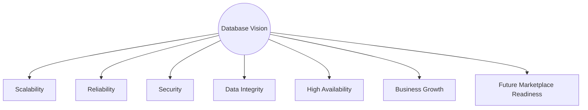
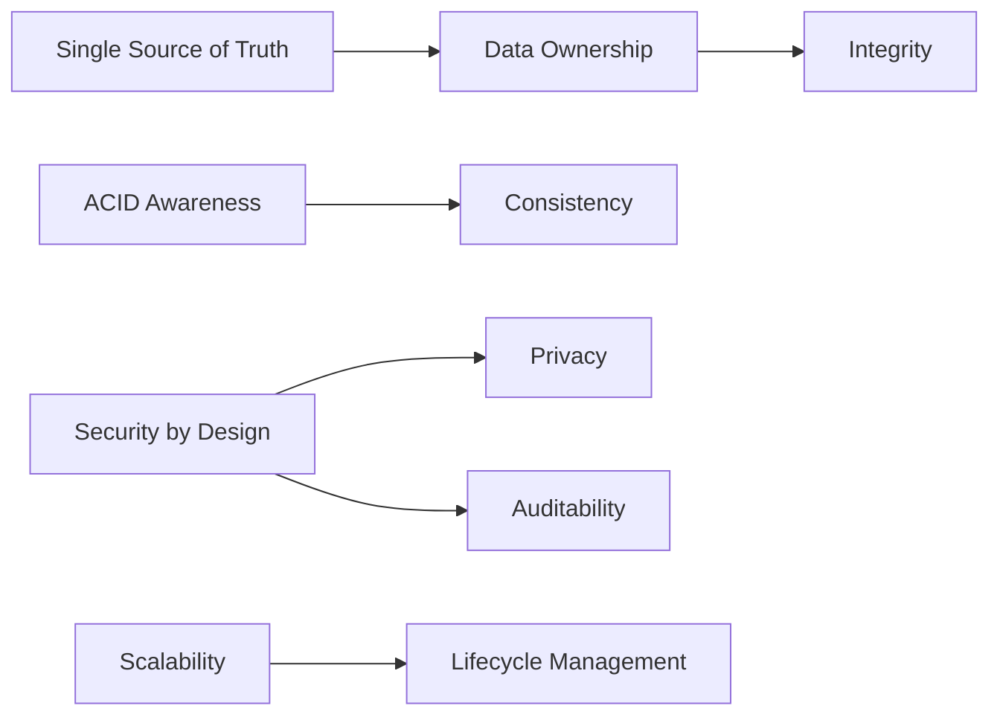
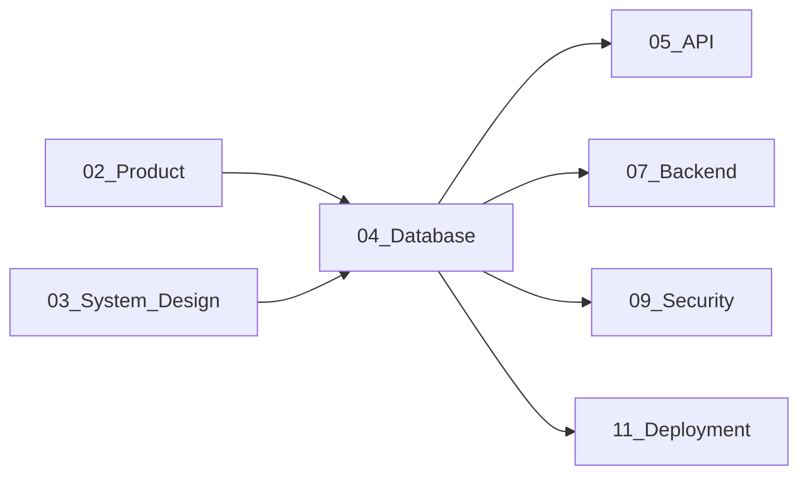
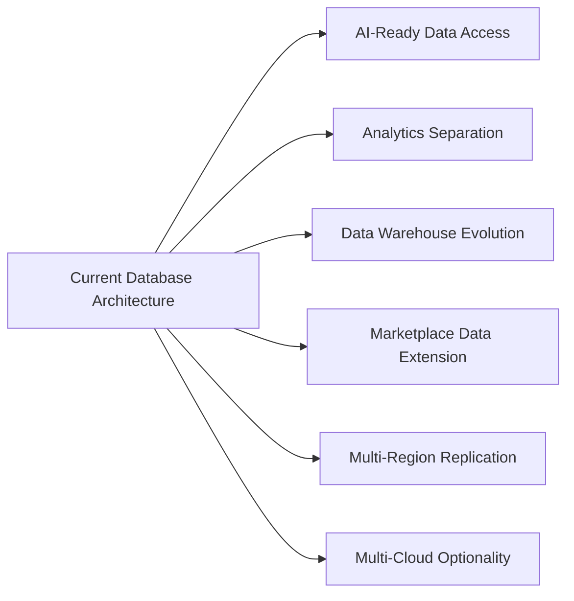

# Database Overview

## 1. Document Purpose

This document is the official Database Overview for **StackLeo Tech Store**. It explains the overall database architecture vision, principles, scope, objectives, and future direction, at a level implementation teams and architects can both rely on.

- **Purpose of the Database Architecture** — to define how the platform's business data is structured, protected, and evolved so that it remains an accurate, trustworthy, and durable representation of the business over the platform's entire lifetime.
- **Relationship with Business Architecture** — the database exists to serve the business entities, rules, and workflows defined in `01_Business` and `02_Product`; every data decision traces back to a genuine business need, never to incidental technical convenience.
- **Relationship with System Architecture** — this document and the rest of `04_Database` translate the conceptual `domain-model.md` and `data-flow.md` documents in `03_System_Design` into a dedicated, database-focused architectural layer, remaining consistent with the bounded contexts defined in `bounded-contexts.md`.
- **Relationship with Application Architecture** — the database is the durable foundation beneath the services defined in `03_System_Design/service-architecture.md`; application logic depends on the database's guarantees, but the database itself remains independent of any specific application technology choice, consistent with Clean Architecture (`architecture-principles.md`).

This document is implementation-independent. It does not include SQL, schema definitions, table structures, or ORM examples — those belong to dedicated technical documentation and engineering practice outside `04_Database`.

## 2. Database Vision

The long-term vision for StackLeo's database platform is to be a **trustworthy, durable foundation** capable of supporting the business's full growth trajectory — from a single-market MVP to an enterprise-scale, multi-vendor commerce ecosystem — without requiring its foundational structure to be discarded at any stage.

- **Scalability** — the database platform grows in capacity and throughput in step with the growth stages defined in `03_System_Design/scalability-strategy.md`, from Startup through Global stage.
- **Reliability** — business-critical data (orders, payments, inventory) is never lost or silently corrupted, even under failure conditions.
- **Security** — customer and business data is protected as a first-class design property, not a bolted-on afterthought, consistent with `03_System_Design/architecture-principles.md` (Security by Design).
- **Data Integrity** — the database enforces, wherever structurally possible, that stored data reflects valid, consistent business facts.
- **High Availability** — data access supports the availability expectations defined in `02_Product/non-functional-requirements.md` (Section 7), consistent with the trust-focused brand positioning.
- **Business Growth** — the data platform is a growth enabler, not a constraint, supporting B2C today and B2B, corporate sales, wholesale, and marketplace operations as they activate.
- **Future Marketplace Readiness** — the data architecture anticipates the future multi-vendor Marketplace (Phase 5) as an extension of existing Catalog and Order data, not a parallel, disconnected structure.

*Diagram: High-Level Database Context.*

## 3. Scope

| In Scope | Description |
|---|---|
| Operational Data | Data supporting day-to-day business operations across all bounded contexts. |
| Transactional Data | Data representing completed or in-progress business transactions (Orders, Payments). |
| Customer Data | Customer profile, address, and account data. |
| Product Data | Catalog, category, brand, and product variant data. |
| Inventory Data | Real-time stock levels across warehouse and store locations. |
| Orders | The authoritative transactional record of customer purchases. |
| Payments | Payment authorization, confirmation, and refund records. |
| Shipping | Shipment and delivery tracking records. |
| Reviews | Verified-purchase customer product feedback. |
| Notifications | Records of customer communications and delivery status. |
| Corporate Sales (Future) | Corporate account terms and bulk order records. |
| Marketplace (Future) | Seller, listing, and settlement records. |

| Out of Scope | Rationale |
|---|---|
| Specific database technology selection and configuration | Addressed in dedicated engineering documentation, not architecture documentation. |
| Physical schema, table, and index definitions | Addressed in `schema-design.md` and `indexing-strategy.md` at a strategic, not implementation, level; concrete definitions belong to engineering. |
| Query language or ORM-specific patterns | Implementation detail outside the scope of architecture documentation. |
| Third-party system's internal data structures | Owned by their respective external systems, per `03_System_Design/integration-architecture.md`. |

### Scope Matrix

| Data Category | Owning Domain (per `domain-model.md`) | Current Status |
|---|---|---|
| Customer, User | Identity, Customer | Active |
| Product, Category, Brand, Variant | Catalog, Product | Active |
| Inventory | Inventory | Active |
| Cart | Cart | Active |
| Order | Order | Active |
| Payment | Payment | Active |
| Shipment | Shipping | Active |
| Review | Reviews | Active |
| Notification | Notifications | Active |
| Corporate Account | Corporate Sales | Future (Phase 4) |
| Seller, Marketplace Store | Marketplace | Future (Phase 5) |

## 4. Database Principles

| Principle | Description |
|---|---|
| Single Source of Truth | Every business fact has exactly one authoritative origin, consistent with `03_System_Design/data-flow.md` (Section 2). |
| ACID Awareness | Business-critical transactions (Order creation, Payment processing, Inventory deduction) are designed with atomicity, consistency, isolation, and durability as explicit requirements, not assumptions. |
| Data Ownership | Each bounded context owns the data corresponding to its domain, per `03_System_Design/bounded-contexts.md`. |
| Consistency | Financially and operationally critical data flows with strong consistency guarantees; less critical, read-heavy data may tolerate eventual consistency, per `03_System_Design/architectural-drivers.md` (Section 10). |
| Integrity | Data structures enforce valid business states wherever structurally possible, reducing reliance on application-level validation alone. |
| Security by Design | Access control, encryption, and data minimization are embedded in the data architecture from the outset. |
| Scalability | The data architecture accommodates horizontal growth strategies defined in `03_System_Design/scalability-strategy.md`. |
| Auditability | Governed data changes are traceable to a specific actor and point in time, consistent with `02_Product/user-roles.md` (Section 12). |
| Privacy | Customer data collection and retention are minimized to genuine business necessity, consistent with `01_Business/business-rules.md` (BR-128). |
| Lifecycle Management | Every data category has a deliberate lifecycle — creation, active use, archival — defined in `data-retention.md`, not indefinite retention by default. |

### Principles Summary

| Principle Group | Representative Principles |
|---|---|
| Trust Foundation | Single Source of Truth, Data Ownership, Integrity |
| Transactional Discipline | ACID Awareness, Consistency |
| Protection | Security by Design, Privacy, Auditability |
| Growth Readiness | Scalability, Lifecycle Management |

*Diagram: Database Relationship Overview — how core principles reinforce one another.*

## 5. Database Objectives

| Objective | Description |
|---|---|
| Performance | Data access patterns meet the responsiveness targets defined in `02_Product/non-functional-requirements.md` (Section 5). |
| Availability | Business-critical data remains accessible consistent with the availability expectations in `03_System_Design/quality-attributes.md` (Section 5). |
| Reliability | Data operations behave predictably under both normal and failure conditions, consistent with `backup-recovery.md`. |
| Maintainability | The data model remains comprehensible and safely evolvable, consistent with `migration-strategy.md`. |
| Extensibility | New business capability (Corporate Sales, Marketplace) extends the existing data model rather than requiring a parallel one. |
| Compliance | Data handling satisfies applicable Bangladesh regulation, per `01_Business/business-rules.md` (Section 17), with readiness for future market-specific requirements. |
| Operational Excellence | Data operations (backup, recovery, monitoring) are disciplined, automated where appropriate, and consistently governed. |

## 6. Relationship with Other Documentation

| Documentation | Relationship |
|---|---|
| Product Documentation (`02_Product`) | `functional-requirements.md` and `non-functional-requirements.md` define the business behavior and quality expectations the database architecture must support. |
| System Design (`03_System_Design`) | `domain-model.md`, `bounded-contexts.md`, and `data-flow.md` provide the conceptual foundation this folder translates into a database-specific architecture. |
| API Documentation (`05_API`) | API contracts expose data governed by this folder's model; API design must remain consistent with entity and relationship definitions established here. |
| Backend Documentation (`07_Backend`) | Backend services implement data access patterns operating against the logical model defined in this folder. |
| Security Documentation (`09_Security`) | Platform-wide security architecture builds on `security-model.md`, ensuring consistent protection from application through data layer. |
| Deployment Documentation (`11_Deployment`) | Deployment architecture provisions the infrastructure hosting the database, informed by this folder's scalability and recovery strategies. |

*Diagram: Information Flow Overview — how business and system context flows into the database architecture, and how the database architecture in turn informs downstream layers.*

## 7. Future Vision

| Future Direction | Database Architecture Readiness |
|---|---|
| AI | The data model is structured so AI-assisted capability (recommendations, fraud detection, per `03_System_Design/service-architecture.md`, SVC-031) can consume existing data without requiring a parallel data store. |
| Analytics | Analytics consumption is architecturally separated from transactional data flows, protecting transactional performance and consistency, per `03_System_Design/data-flow.md` (Section 10). |
| Data Warehouse | A future dedicated data warehouse may consume from the operational data defined in this folder as a read-only aggregation point, without becoming an alternate source of truth. |
| Marketplace | Seller, Marketplace Store, and Listing data (Phase 5) extend the existing Product and Order data model, consistent with `03_System_Design/domain-model.md` (Section 11). |
| Multi-Region | The data architecture is designed to be replicable across regions to support future South Asia and global expansion, consistent with `03_System_Design/scalability-strategy.md` (Section 7). |
| Multi-Cloud | Database architecture decisions remain provider-neutral, preserving future multi-cloud optionality consistent with `03_System_Design/deployment-architecture.md` (Section 1). |

*Diagram: Future Database Evolution.*

## 8. Governance

- **Ownership** — the Database Architect (or Solution Architect acting in that capacity at current organizational scale) owns this document's accuracy and its alignment with `03_System_Design`.
- **Review Process** — this document is reviewed at the conclusion of each phase defined in `02_Product/product-roadmap.md`, and whenever `03_System_Design/domain-model.md` or `bounded-contexts.md` changes materially.
- **Documentation Standards** — this document follows the enterprise Markdown conventions established across this repository, consistent with `04_Database/README.md` (Section 7).
- **Versioning** — this document follows the Semantic Versioning approach defined in `00_Project_Overview/changelog.md`.

### Governance Matrix

| Role | Responsibility |
|---|---|
| Database Architect / Solution Architect | Owns overall database architecture coherence and this document's accuracy. |
| Data Steward (per `data-governance.md`) | Owns data quality and stewardship for each governed data category. |
| Security Lead | Ensures `security-model.md` remains aligned with platform-wide security architecture. |
| Product Manager | Ensures database scope remains aligned with `02_Product` requirements and roadmap. |

## 9. Document Information

| Property | Value |
|----------|-------|
| Document | database-overview.md |
| Version | 1.0.0 |
| Status | Active |
| Maintained By | StackLeo |
| Last Updated | 2026-07-17 |

---

© StackLeo. All Rights Reserved.
