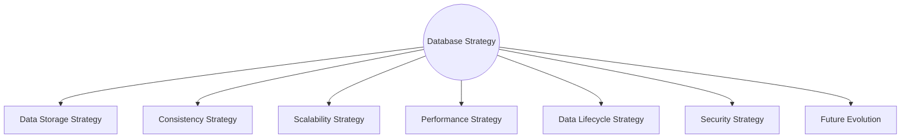
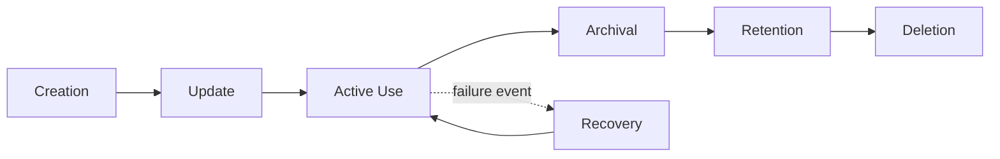
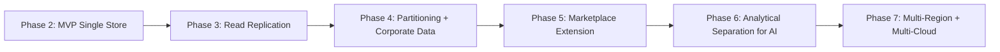

# Database Strategy

## 1. Document Purpose

This document is the official Database Strategy for **StackLeo Tech Store**. It defines the long-term strategy for managing, scaling, securing, and evolving the platform's data architecture.

- **Purpose of Database Strategy** — to establish a deliberate, forward-looking direction for how StackLeo's data is stored, accessed, protected, and grown, rather than allowing the data architecture to emerge accidentally from feature-by-feature decisions.
- **Relationship with Business Strategy** — this strategy exists to serve the phased business growth defined in `01_Business/business-model.md`; every strategic data decision is justified by a genuine business need, consistent with `03_System_Design/architecture-principles.md` (ARCH-001).
- **Relationship with System Architecture** — this strategy operationalizes the data principles introduced conceptually in `03_System_Design/data-flow.md` and `database-overview.md`, translating them into a concrete strategic direction for the data platform.
- **Long-Term Data Platform Vision** — a data platform that scales confidently from a single-market MVP to an enterprise, multi-vendor, multi-region commerce ecosystem, without requiring its foundational strategy to be abandoned at any stage.

This document is implementation-independent. It does not define SQL, schemas, tables, or specific database products or versions — it describes strategic direction at a conceptual level, consistent with the rest of `04_Database`.

## 2. Strategic Principles

- **Data as a Strategic Asset** — StackLeo's data (customer relationships, order history, catalog authenticity records) is treated as a durable business asset in its own right, not merely a byproduct of running the platform.
- **Single Source of Truth** — every business fact has exactly one authoritative origin, per `03_System_Design/data-flow.md` (Section 2).
- **Data Ownership** — each bounded context owns its corresponding data, per `03_System_Design/bounded-contexts.md`.
- **Data Integrity** — the data platform is structured to prevent invalid or inconsistent business states wherever structurally possible.
- **Security by Design** — data protection is embedded in strategic decisions from the outset, not retrofitted.
- **Scalability** — the strategy anticipates growth through the stages defined in `03_System_Design/scalability-strategy.md`.
- **Reliability** — the strategy ensures business-critical data survives failure conditions without loss or corruption.
- **Extensibility** — the strategy allows new business capability (Corporate Sales, Marketplace) to extend the existing data platform rather than requiring a parallel one.

## 3. Data Storage Strategy

Different categories of business data have genuinely different storage needs, driven by how they are created, how often they change, and how critical their consistency is:

| Data Category | Description | Storage Characteristics Needed |
|---|---|---|
| Transactional Data | Orders, Payments, Inventory movements — data representing a business transaction. | Strong consistency, durability, and transactional integrity are non-negotiable. |
| Reference Data | Categories, Brands, and other relatively stable lookup data. | Read-heavy, low-volatility; optimized for fast retrieval rather than frequent change. |
| Master Data | Product, Customer — core, authoritative business entities other data refers to. | Requires strict single-source-of-truth discipline given how broadly it is referenced. |
| Operational Data | Day-to-day working data supporting active business processes (Cart, active Warranty Claims). | Moderate consistency needs; often has a bounded, relatively short active lifecycle. |
| Analytical Data (Future) | Aggregated behavioral and performance data supporting business intelligence. | Optimized for read-heavy aggregation; tolerates eventual consistency (Section 4). |
| Archival Data | Historical data retained beyond its active business use for compliance or reference. | Optimized for durability and cost efficiency over access speed. |

Because these categories have genuinely different needs, the strategy allows for **polyglot persistence** in the future (Section 9) — using different storage approaches for different categories — while starting from a single, well-understood relational store for MVP simplicity, per `03_System_Design/architecture-decisions.md` (ADR-010).

*Diagram: Database Strategy Overview.*

## 4. Consistency Strategy

- **ACID Awareness** — transactions affecting Orders, Payments, and Inventory are treated as requiring atomicity, consistency, isolation, and durability as explicit, non-negotiable properties.
- **Eventual Consistency (Concept)** — a model where data is allowed to be briefly inconsistent across copies, converging to correctness over a short time window; acceptable where immediate, universal consistency is not business-critical.
- **Strong Consistency (Concept)** — a model where every read reflects the most recent confirmed write; required wherever incorrect immediate visibility would cause genuine business harm (e.g., overselling stock).
- **Business Trade-offs** — consistency is not a purely technical choice; it is selected per data category based on the cost of being wrong, consistent with `03_System_Design/architectural-drivers.md` (Section 10).
- **Data Integrity** — regardless of consistency model, every data category maintains structural integrity — no orphaned references, no contradictory state — through disciplined modeling.

### Consistency Models

| Data Category | Consistency Model | Rationale |
|---|---|---|
| Orders | Strong | Incorrect order state directly causes financial and fulfillment errors. |
| Payments | Strong | Incorrect payment state risks duplicate charges or unrecorded revenue. |
| Inventory | Strong | Weak consistency risks overselling, directly harming customer trust. |
| Product Catalog | Strong for publish state; eventual acceptable for downstream search indexing | Publish state must be authoritative; search index lag is tolerable within a short window. |
| Reviews | Eventual | A brief delay before a review appears publicly does not cause business harm. |
| Analytics (Future) | Eventual | Aggregated insight does not require real-time precision. |
| Notifications | Eventual | Delivery status delay does not affect the underlying business state it reports on. |

## 5. Scalability Strategy

- **Read Scaling** — read-heavy workloads (catalog browsing, search) are architected to scale independently of write-heavy workloads (checkout, order creation), consistent with `03_System_Design/scalability-strategy.md` (Section 4).
- **Write Scaling** — write-heavy, critical paths are kept lean, with non-essential work deferred asynchronously (per `03_System_Design/integration-architecture.md`, Section 6).
- **Horizontal Scaling Readiness** — the strategy favors approaches (read replicas, partitioning) that add capacity through addition rather than requiring ever-larger single instances.
- **Vertical Scaling Readiness** — reserved as a near-term, secondary lever, consistent with `03_System_Design/architecture-decisions.md` (ADR-017).
- **Partitioning Readiness** — high-volume data (Orders, Inventory history) is structured so it can be partitioned by a meaningful business dimension (e.g., time, region) as volume grows, per `partitioning-strategy.md`.
- **Replication Readiness** — the strategy anticipates read replication to support both read scaling and disaster recovery (`backup-recovery.md`).
- **Multi-Region Readiness** — the data strategy is structured to support future regional replication, consistent with `03_System_Design/scalability-strategy.md` (Section 7).

### Scalability Strategy Matrix

| Growth Stage (per `scalability-strategy.md`) | Scalability Focus |
|---|---|
| Startup Stage | Single, well-understood data store; correctness over scale. |
| Growth Stage | Read replication introduced for catalog and search-adjacent read load. |
| Expansion Stage | Partitioning readiness evaluated for high-volume transactional history. |
| Enterprise Stage | Selective polyglot persistence for domains with distinct scaling needs (e.g., Marketplace). |
| Global Stage | Multi-region replication for regional performance and disaster recovery. |

*Diagram: Scalability Evolution.*

## 6. Performance Strategy

- **Read Optimization** — read-heavy paths are optimized independently of write-heavy paths, consistent with `03_System_Design/scalability-strategy.md` (Section 5).
- **Write Optimization** — critical write paths (checkout, payment, inventory deduction) are kept minimal and focused, deferring non-essential processing.
- **Caching Readiness** — frequently accessed, low-volatility data is designed to be cacheable at the application layer, per `03_System_Design/technology-stack.md` (Section 4.4), reducing direct database load.
- **Query Efficiency** — data structures are designed with anticipated access patterns in mind (per `entity-relationship.md`), avoiding structures that would force inefficient data retrieval.
- **Data Lifecycle Optimization** — data no longer in active use (Section 7) is moved out of the primary performance-critical path, keeping the active data set lean and fast.

## 7. Data Lifecycle Strategy

*Diagram: Data Lifecycle Flow.*

| Stage | Description |
|---|---|
| Creation | Data is created as the result of a genuine business event (e.g., Order placement), consistent with `03_System_Design/event-flows.md`. |
| Update | Data is modified only through its owning domain's authorized process, preserving single source of truth. |
| Archival | Data no longer in active business use is moved to a lower-cost, durability-optimized state, per `data-retention.md`. |
| Retention | Archived data is retained for a defined period based on business and compliance need, per `data-retention.md`. |
| Deletion | Data is removed once its retention period concludes and no legal or business justification for continued retention remains. |
| Recovery | Data can be restored from backup in the event of loss or corruption, per `backup-recovery.md`. |

### Data Lifecycle Matrix

| Data Category | Active Lifespan | Archival Trigger | Deletion Consideration |
|---|---|---|---|
| Cart | Short (session/inactivity-bound) | Expiration after inactivity | Not retained long-term |
| Order | Long (permanent active reference) | Rarely archived; remains authoritative | Retained per compliance requirements |
| Payment | Long (tied to Order) | Rarely archived | Retained per financial compliance requirements |
| Notification | Medium | Archived after a defined period | Eligible for deletion per retention policy |
| Review | Long (public trust record) | Rarely archived | Removed only for policy violations |
| Audit Log | Long (compliance-driven) | Rarely archived | Retained per `01_Business/business-rules.md` (BR-104) |

## 8. Security Strategy

- **Encryption Concepts** — data is protected through encryption both in transit and at rest, consistent with `02_Product/non-functional-requirements.md` (NFR-027).
- **Access Control** — data access is scoped to the minimum necessary per actor and process, consistent with least privilege (`03_System_Design/architecture-principles.md`, ARCH-033).
- **Auditability** — governed data changes are traceable to a specific actor and timestamp, consistent with `02_Product/user-roles.md` (Section 12).
- **Data Privacy** — customer data collection and storage are minimized to genuine business necessity, consistent with ARCH-015 and BR-128.
- **Sensitive Data Classification** — data is classified by sensitivity (per `03_System_Design/data-flow.md`, Section 4), informing the level of protection applied.
- **Compliance Readiness** — the strategy anticipates evolving compliance requirements as StackLeo expands into new markets, consistent with `02_Product/non-functional-requirements.md` (NFR-036).

### Security Strategy Summary

| Security Concern | Strategic Approach |
|---|---|
| Data in Transit | Encrypted by default across all boundaries, per `03_System_Design/deployment-architecture.md` (Section 9). |
| Data at Rest | Encrypted for sensitive and highly confidential data categories (Payment, Corporate Sales). |
| Access Control | Role-scoped, least-privilege access consistent with `02_Product/user-roles.md`. |
| Audit | Immutable logging of governed changes, per `security-model.md`. |
| Privacy | Data minimization applied per data category classification. |
| Compliance | Reviewed against Bangladesh regulation today, extensible to future markets. |

## 9. Future Evolution

| Future Direction | Database Strategy Readiness |
|---|---|
| Polyglot Persistence | The data storage strategy (Section 3) already anticipates using different storage approaches for different data categories as genuine need emerges. |
| Data Warehouse | Analytical data (Section 3) is architecturally separated from transactional data, ready to feed a future dedicated warehouse without disrupting transactional performance. |
| Business Intelligence | Builds on the Data Warehouse evolution, consuming aggregated, eventually-consistent data. |
| AI | AI-assisted capability consumes existing operational and analytical data without requiring a parallel data store, consistent with `03_System_Design/architecture-decisions.md` (ADR-020). |
| Marketplace | Seller and Marketplace Store data (Phase 5) extend the existing Product and Order storage strategy rather than requiring a separate platform. |
| Multi-Cloud | Strategic decisions remain provider-neutral, preserving future multi-cloud optionality. |
| Global Expansion | Multi-region replication readiness (Section 5) directly supports StackLeo's South Asia and global expansion vision. |

### Future Evolution Roadmap

| Roadmap Phase (per `product-roadmap.md`) | Database Strategy Milestone |
|---|---|
| Phase 2 (MVP Launch) | Single, well-understood relational store; strong consistency for critical domains. |
| Phase 3 (Business Growth) | Read replication; caching readiness activated. |
| Phase 4 (Enterprise) | Partitioning readiness evaluated; Corporate Sales data introduced. |
| Phase 5 (Marketplace) | Marketplace data extends existing model; selective polyglot persistence considered. |
| Phase 6 (AI & Automation) | Analytical data separation matures to support AI and forecasting workloads. |
| Phase 7 (Global Expansion) | Multi-region replication and multi-cloud optionality activated. |

*Diagram: Future Data Platform Vision.*

## 10. Governance

- **Ownership** — the Database Architect (or Solution Architect acting in that capacity) owns this strategy's accuracy and its alignment with `01_Business/business-model.md` and `02_Product/product-roadmap.md`.
- **Decision Process** — strategic data decisions are evaluated against the principles in Section 2 before adoption, consistent with `03_System_Design/architecture-principles.md` (Section 11).
- **Review Cycle** — this document is reviewed at the conclusion of each phase defined in `02_Product/product-roadmap.md`.
- **Versioning** — this document follows the Semantic Versioning approach defined in `00_Project_Overview/changelog.md`.
- **Documentation Standards** — this document follows the enterprise Markdown conventions established across this repository, consistent with `04_Database/README.md`.

## 11. Document Information

| Property | Value |
|----------|-------|
| Document | database-strategy.md |
| Version | 1.0.0 |
| Status | Active |
| Maintained By | StackLeo |
| Last Updated | 2026-07-17 |

---

© StackLeo. All Rights Reserved.
