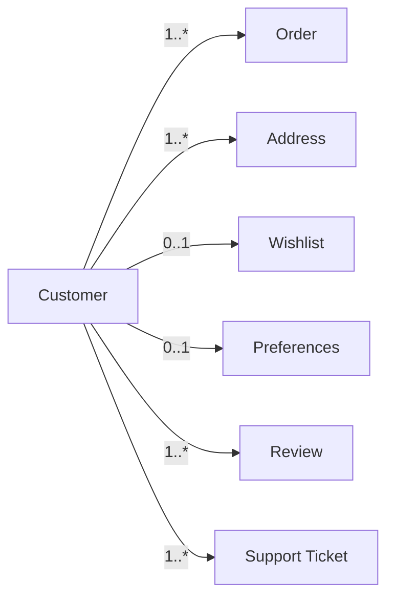
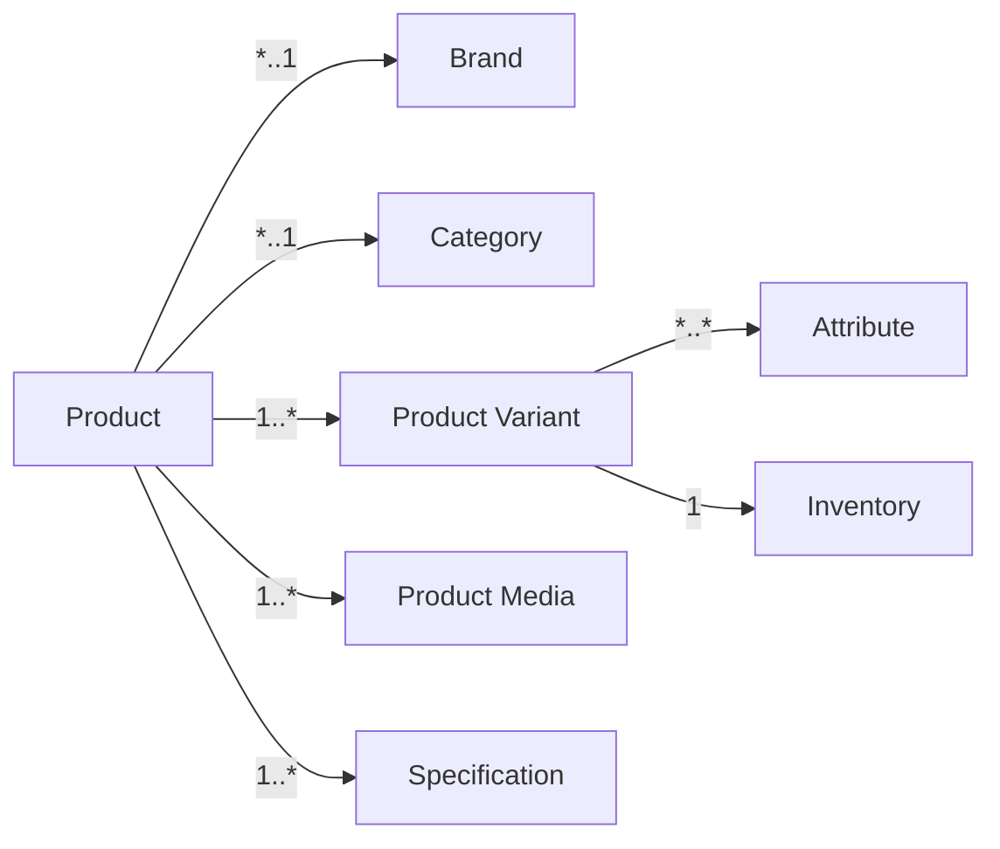
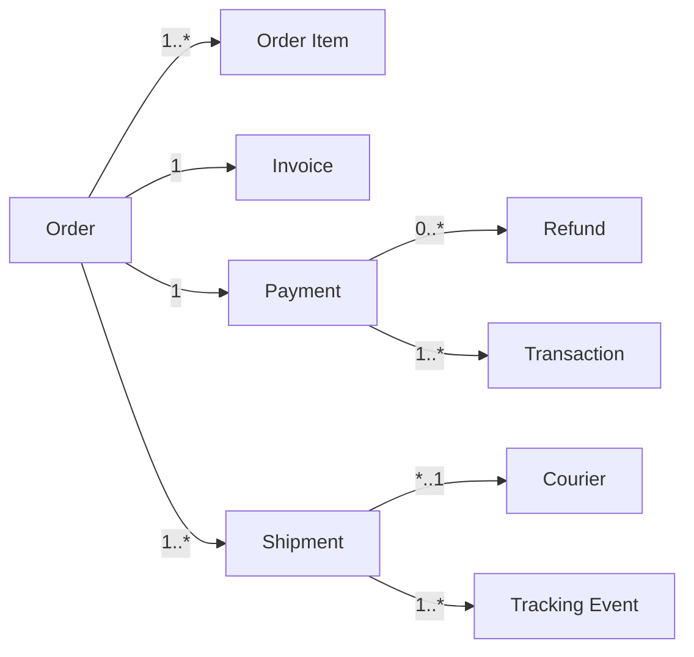

# Entity Relationship Architecture

## 1. Document Purpose

This document is the official Entity Relationship Architecture for **StackLeo Tech Store**. It explains the conceptual and logical relationships between the business entities defined in `data-model.md` — how they connect, who owns whom, and how their lifecycles depend on one another.

- **What Is Entity Relationship Architecture** — the discipline of defining how business entities relate to one another: which entity owns which, how many of one can relate to how many of another, and what happens to a dependent entity when its owner changes.
- **Conceptual vs. Logical vs. Physical Relationships** — a conceptual relationship states that two business concepts are related (e.g., "a Customer has Orders"); a logical relationship (this document's focus) adds cardinality, ownership, and lifecycle detail; a physical relationship (out of scope here, addressed in `schema-design.md`) implements that logical relationship using a specific technical mechanism.
- **Relationship with the Data Model** — this document elaborates the relationships already introduced in `data-model.md` (Section 4) with the full cardinality, ownership, and lifecycle detail needed before physical schema design.
- **Relationship with Domain-Driven Design** — relationships here are classified using DDD composition/aggregation thinking (Section 6), directly extending the aggregate boundaries defined in `data-model.md` (Section 5) and `03_System_Design/domain-model.md` (Section 6).

This document is implementation-independent. It does not define SQL, database schemas, primary keys, foreign keys, or ORM models — those belong to `schema-design.md` and dedicated engineering documentation.

## 2. Relationship Modeling Principles

- **Business-First Relationships** — every relationship documented here reflects a genuine business connection, never an incidental technical convenience.
- **Single Source of Truth** — a relationship is always described from the perspective of the entity that authoritatively owns it, per `03_System_Design/data-flow.md` (Section 2).
- **Ownership** — every relationship has a clear owning (parent) entity and a dependent (child) entity, per Section 5.
- **High Cohesion** — relationships within a single aggregate (per `data-model.md`, Section 5) are treated as tightly bound; relationships across aggregates are treated as loosely bound references.
- **Loose Coupling** — cross-domain relationships reference the related entity by identity only, never by duplicating its internal detail.
- **Consistency Boundaries** — relationships within an aggregate boundary must remain consistent atomically; relationships crossing an aggregate boundary may tolerate eventual consistency, per `database-strategy.md` (Section 4).
- **Lifecycle Dependencies** — every relationship states explicitly whether the dependent entity can outlive its owner, per Section 7.

## 3. Core Entity Relationships

Each domain below documents its relationships with conceptual **Cardinality** and **Business Meaning**. Full cardinality rationale, ownership, composition/aggregation classification, and lifecycle dependency are consolidated in Sections 4–7.

### 3.1 Identity

| Relationship | Cardinality | Business Meaning |
|---|---|---|
| User ↔ Role | Many-to-Many | A User (particularly internal staff) may hold one or more Roles, and a Role may be assigned to many Users. |
| Role ↔ Permission | Many-to-Many | A Role bundles one or more Permissions, and a Permission may be included in multiple Roles. |
| User ↔ Session | One-to-Many | A User may have multiple concurrent or historical Sessions. |

### 3.2 Customer

| Relationship | Cardinality | Business Meaning |
|---|---|---|
| Customer ↔ Address | One-to-Many | A Customer may maintain multiple saved delivery Addresses. |
| Customer ↔ Wishlist | One-to-One | Each Customer has exactly one Wishlist collection. |
| Customer ↔ Preferences | One-to-One | Each Customer has exactly one set of communication/channel Preferences. |

### 3.3 Product Catalog

| Relationship | Cardinality | Business Meaning |
|---|---|---|
| Product ↔ Brand | Many-to-One | Many Products are associated with one verified Brand. |
| Product ↔ Category | Many-to-One | Many Products belong to one primary Category. |
| Product ↔ Product Variant | One-to-Many | A Product has one or more purchasable Variants. |
| Product ↔ Product Media | One-to-Many | A Product has one or more associated media assets. |
| Product ↔ Specification | One-to-Many | A Product has one or more structured technical Specifications. |
| Product ↔ Attribute | Many-to-Many | A Product's Variants and Specifications draw from a shared, reusable set of Attributes. |

### 3.4 Inventory

| Relationship | Cardinality | Business Meaning |
|---|---|---|
| Warehouse ↔ Inventory | One-to-Many | A Warehouse holds Inventory records for many Product Variants. |
| Inventory ↔ Product (Variant) | One-to-One (per Warehouse) | Each Product Variant has one Inventory record per Warehouse location. |
| Inventory ↔ Stock Movement | One-to-Many | An Inventory record accumulates many Stock Movement events over time. |

### 3.5 Commerce

| Relationship | Cardinality | Business Meaning |
|---|---|---|
| Customer ↔ Cart | One-to-One (active) | A Customer has one active Cart at a time. |
| Cart ↔ Product | Many-to-Many (via Cart Item) | A Cart contains many Products, and a Product may appear in many Carts. |
| Coupon ↔ Cart | Many-to-Many | A Coupon may be applied to many Carts (within its usage limits), and a Cart may reference an applied Coupon. |
| Promotion ↔ Product | Many-to-Many | A Promotion applies to many Products, and a Product may be included in multiple Promotions. |

### 3.6 Orders

| Relationship | Cardinality | Business Meaning |
|---|---|---|
| Customer ↔ Order | One-to-Many | A Customer places many Orders over their account lifetime. |
| Order ↔ Order Item | One-to-Many | An Order contains one or more Order Items. |
| Order ↔ Invoice | One-to-One | Each confirmed Order has exactly one Invoice. |

### 3.7 Payments

| Relationship | Cardinality | Business Meaning |
|---|---|---|
| Order ↔ Payment | One-to-One (per transaction) | Each Order is associated with one Payment record per payment attempt cycle. |
| Payment ↔ Refund | One-to-Many | A Payment may have zero or more associated Refunds (full or partial). |
| Payment ↔ Transaction | One-to-Many | A Payment accumulates one or more discrete financial Transactions (authorization, capture, refund). |

### 3.8 Shipping

| Relationship | Cardinality | Business Meaning |
|---|---|---|
| Order ↔ Shipment | One-to-Many | An Order is fulfilled via one or more Shipments (accounting for split fulfillment). |
| Shipment ↔ Courier | Many-to-One | Many Shipments are handled by one assigned Courier partner. |
| Shipment ↔ Tracking Event | One-to-Many | A Shipment accumulates many Tracking Events over its delivery lifecycle. |

### 3.9 Customer Experience

| Relationship | Cardinality | Business Meaning |
|---|---|---|
| Customer ↔ Review | One-to-Many | A Customer may submit multiple Reviews (one per distinct purchase). |
| Product ↔ Review | One-to-Many | A Product accumulates many Reviews from different Customers. |
| Customer ↔ Support Ticket | One-to-Many | A Customer may raise multiple Support Tickets over time. |
| Customer ↔ Warranty Claim | One-to-Many | A Customer may submit multiple Warranty Claims across different purchases. |
| Customer ↔ Return Request | One-to-Many | A Customer may submit multiple Return Requests across different orders. |

### 3.10 Administration

| Relationship | Cardinality | Business Meaning |
|---|---|---|
| Admin ↔ Audit Record | One-to-Many | An Admin User's governed actions each produce an Audit Record. |
| Notification ↔ Customer | Many-to-One | Many Notifications are addressed to one Customer over time. |

### 3.11 Analytics

| Relationship | Cardinality | Business Meaning |
|---|---|---|
| Metrics ↔ Business Domains | Many-to-Many | Business and Operational Metrics are derived from, and reference, data across many business domains simultaneously. |

### 3.12 Marketplace (Future)

| Relationship | Cardinality | Business Meaning |
|---|---|---|
| Vendor ↔ Product (Vendor Product) | One-to-Many | A Vendor lists one or more Vendor Products extending the core catalog. |
| Vendor ↔ Order (Marketplace Order) | One-to-Many | A Vendor fulfills many Marketplace Orders routed to them. |
| Vendor ↔ Commission | One-to-Many | A Vendor accumulates a Commission record for each settled Marketplace Order. |

```mermaid
flowchart TD
    Customer -->|1..*| Order
    Customer -->|1..*| Address
    Customer -->|0..1| Cart
    Order -->|1..*| OrderItem[Order Item]
    Order -->|1| Payment
    Order -->|1..*| Shipment
    Product -->|1..*| ProductVariant[Product Variant]
    Product -->|*..1| Category
    Product -->|*..1| Brand
    ProductVariant -->|1| Inventory
    Warehouse -->|1..*| Inventory
    Vendor -.future.->|1..*| VendorProduct[Vendor Product]
```

*Diagram: High-Level Entity Relationship Diagram.*

## 4. Cardinality

Cardinality expresses the business-meaningful count of how entities relate, independent of any technical key structure:

- **One-to-One** — each instance of one entity relates to exactly one instance of another (e.g., Order ↔ Invoice).
- **One-to-Many** — one instance of an entity relates to many instances of another (e.g., Customer ↔ Order).
- **Many-to-Many** — many instances of one entity relate to many instances of another, typically representing a shared, reusable association (e.g., Promotion ↔ Product).

### Cardinality Matrix

| Relationship | Cardinality |
|---|---|
| User ↔ Role | Many-to-Many |
| Role ↔ Permission | Many-to-Many |
| User ↔ Session | One-to-Many |
| Customer ↔ Address | One-to-Many |
| Customer ↔ Wishlist | One-to-One |
| Customer ↔ Preferences | One-to-One |
| Product ↔ Brand | Many-to-One |
| Product ↔ Category | Many-to-One |
| Product ↔ Product Variant | One-to-Many |
| Product ↔ Product Media | One-to-Many |
| Product ↔ Specification | One-to-Many |
| Product ↔ Attribute | Many-to-Many |
| Warehouse ↔ Inventory | One-to-Many |
| Inventory ↔ Product Variant | One-to-One (per Warehouse) |
| Inventory ↔ Stock Movement | One-to-Many |
| Customer ↔ Cart | One-to-One (active) |
| Cart ↔ Product | Many-to-Many |
| Coupon ↔ Cart | Many-to-Many |
| Promotion ↔ Product | Many-to-Many |
| Customer ↔ Order | One-to-Many |
| Order ↔ Order Item | One-to-Many |
| Order ↔ Invoice | One-to-One |
| Order ↔ Payment | One-to-One (per transaction) |
| Payment ↔ Refund | One-to-Many |
| Payment ↔ Transaction | One-to-Many |
| Order ↔ Shipment | One-to-Many |
| Shipment ↔ Courier | Many-to-One |
| Shipment ↔ Tracking Event | One-to-Many |
| Customer ↔ Review | One-to-Many |
| Product ↔ Review | One-to-Many |
| Customer ↔ Support Ticket | One-to-Many |
| Customer ↔ Warranty Claim | One-to-Many |
| Customer ↔ Return Request | One-to-Many |
| Admin ↔ Audit Record | One-to-Many |
| Notification ↔ Customer | Many-to-One |
| Metrics ↔ Business Domains | Many-to-Many |
| Vendor ↔ Product (Vendor Product) | One-to-Many |
| Vendor ↔ Order (Marketplace Order) | One-to-Many |
| Vendor ↔ Commission | One-to-Many |

## 5. Ownership

- **Parent Entity** — the entity that authoritatively owns the relationship and controls the dependent entity's existence within it.
- **Child Entity** — the entity whose existence, in the context of the relationship, is governed by its parent.
- **Ownership Rules** — a child entity may only be created, modified, or removed through a process authorized by its parent's owning domain (`data-model.md`, Section 6).
- **Data Responsibility** — the parent's owning service is accountable for the referential and business validity of its relationship to the child, per `03_System_Design/service-architecture.md` (Section 6).

### Ownership Matrix

| Relationship | Parent Entity | Child Entity | Data Responsibility |
|---|---|---|---|
| Customer ↔ Address | Customer | Address | Customer Service ensures addresses belong only to their owning customer. |
| Product ↔ Product Variant | Product | Product Variant | Product Service ensures variants cannot exist without their parent Product. |
| Product ↔ Product Media | Product | Product Media | Product Service manages media lifecycle alongside its Product. |
| Warehouse ↔ Inventory | Warehouse | Inventory | Warehouse Service ensures Inventory records reference a valid Warehouse. |
| Inventory ↔ Stock Movement | Inventory | Stock Movement | Inventory Service ensures movements are always tied to a valid Inventory record. |
| Customer ↔ Cart | Customer | Cart | Cart Service ensures a Cart is always scoped to its owning Customer. |
| Cart ↔ Cart Item | Cart | Cart Item | Cart Service governs Cart Item lifecycle entirely within its parent Cart. |
| Order ↔ Order Item | Order | Order Item | Order Service ensures Order Items are immutable once their parent Order is confirmed. |
| Order ↔ Invoice | Order | Invoice | Invoice Service generates exactly one Invoice per confirmed Order. |
| Order ↔ Payment | Order | Payment | Payment Service ties every Payment to a specific Order. |
| Payment ↔ Refund | Payment | Refund | Payment Service ensures Refunds reference a valid, prior Payment. |
| Order ↔ Shipment | Order | Shipment | Shipping Service ensures Shipments cannot exist without a confirmed Order. |
| Shipment ↔ Tracking Event | Shipment | Tracking Event | Delivery Tracking Service ties tracking history to its parent Shipment. |
| Customer ↔ Review | Customer | Review | Review Service ensures Reviews are attributable to a verified Customer purchase. |
| Customer ↔ Warranty Claim | Customer | Warranty Claim | Customer Support Service ensures claims are tied to the requesting Customer's Order. |
| Admin User ↔ Audit Record | Admin User | Audit Record | Audit Service ensures every record is attributable to a specific actor. |
| Vendor ↔ Vendor Product (Future) | Vendor | Vendor Product | Marketplace Service ensures listings cannot exist without an approved Vendor. |

## 6. Composition vs. Aggregation

- **Composition** — a strong "owns and cannot exist without" relationship: the child has no independent lifecycle and is removed when its parent is removed (e.g., Order Item cannot exist without its Order).
- **Aggregation** — a weaker "references, but independently exists" relationship: the related entity has its own independent lifecycle and merely participates in the relationship (e.g., Product referenced by a Cart Item continues to exist if the Cart is abandoned).
- **Independent Lifecycle Entities** — entities such as Product, Customer, and Vendor that exist and persist regardless of any single relationship they participate in.
- **Dependent Lifecycle Entities** — entities such as Order Item, Cart Item, and Stock Movement that have no meaning or existence outside their owning parent.

### Composition vs. Aggregation Matrix

| Relationship | Type | Lifecycle | Reasoning |
|---|---|---|---|
| Order ↔ Order Item | Composition | Dependent | Order Items have no meaning outside their Order and are immutable once confirmed. |
| Cart ↔ Cart Item | Composition | Dependent | Cart Items exist only as part of their Cart's current state. |
| Product ↔ Product Variant | Composition | Dependent | A Variant cannot exist without its parent Product. |
| Product ↔ Product Media | Composition | Dependent | Media assets are meaningless without their associated Product. |
| Inventory ↔ Stock Movement | Composition | Dependent | A Stock Movement record only has meaning in the context of its Inventory. |
| Payment ↔ Transaction | Composition | Dependent | A Transaction is a granular event within its parent Payment's history. |
| Shipment ↔ Tracking Event | Composition | Dependent | Tracking Events have no independent existence outside their Shipment. |
| Role ↔ Permission | Aggregation | Independent | Permissions exist independently and are reused across many Roles. |
| Cart ↔ Product | Aggregation | Independent | A Product referenced in a Cart continues to exist independent of that Cart. |
| Order ↔ Product Variant (via Order Item) | Aggregation | Independent | The Product Variant referenced by an Order Item persists independently in the Catalog. |
| Promotion ↔ Product | Aggregation | Independent | Products participate in Promotions without being owned by them. |
| Customer ↔ Order | Aggregation | Independent | Orders reference their Customer but are retained even if the Customer account is later closed, per compliance retention. |
| Vendor ↔ Vendor Product (Future) | Composition | Dependent | A Vendor Product listing has no meaning without its owning Vendor. |
| Warehouse ↔ Inventory | Aggregation | Independent | An Inventory record's Product Variant reference persists independent of any single Warehouse. |

## 7. Lifecycle Dependency

- **Creation Dependency** — whether the dependent entity requires its parent to already exist before it can be created.
- **Update Dependency** — whether changes to the parent require or trigger corresponding changes to the dependent entity.
- **Archive Dependency** — whether archiving the parent implies archiving the dependent entity alongside it.
- **Deletion Dependency** — whether removing the parent requires or forbids removal of the dependent entity.

### Lifecycle Dependency Matrix

| Relationship | Creation Dependency | Update Dependency | Archive/Deletion Dependency |
|---|---|---|---|
| Order ↔ Order Item | Order Item cannot be created before its Order | Order Items are immutable after Order confirmation | Order Items are archived/retained alongside their Order permanently |
| Cart ↔ Cart Item | Cart Item requires an existing Cart | Cart Item updates freely until checkout | Cart Items expire alongside Cart inactivity (BR-046) |
| Product ↔ Product Variant | Variant requires an existing Product | Variant pricing/stock updates independently within Product constraints | Discontinuing a Product discontinues its Variants |
| Warehouse ↔ Inventory | Inventory record requires an existing Warehouse | Inventory updates continuously via Stock Movements | Inventory records are reassigned or archived if a Warehouse is decommissioned |
| Order ↔ Payment | Payment requires a checkout-confirmed Order context | Payment status updates independently of Order status changes | Payment records are retained permanently, tied to their Order |
| Order ↔ Shipment | Shipment requires a confirmed Order | Shipment status updates independently through delivery lifecycle | Shipment records are retained permanently as part of Order history |
| Customer ↔ Review | Review requires a completed, verified Order | Review may be edited by the Customer post-publication | Reviews persist independent of later Order archival |
| Vendor ↔ Vendor Product (Future) | Vendor Product requires an approved Vendor | Listing updates require Vendor's continued active status | Vendor Products are deactivated if the Vendor is suspended |

## 8. Future Evolution

| Future Capability | Entity Relationship Impact |
|---|---|
| Marketplace | Vendor, Vendor Product, and Marketplace Order relationships (Section 3.12) extend the existing Product and Order relationship model without altering it. |
| Corporate Sales | A future Corporate Account ↔ Order relationship extends the existing Customer ↔ Order pattern with negotiated-term validation. |
| AI | AI-assisted capability consumes existing relationships (e.g., Product ↔ Review, Customer ↔ Order) as read-only signals, introducing no new relationship types. |
| Multi-Region | Address and Shipment relationships extend to accommodate region-specific formats without altering their cardinality or ownership model. |
| Analytics | The Metrics ↔ Business Domains relationship (Section 3.11) matures into a dedicated analytical layer, consuming but not modifying transactional relationships. |



*Diagram: Customer Domain Relationships.*



*Diagram: Product Domain Relationships.*



*Diagram: Order Domain Relationships.*

```mermaid
flowchart LR
    Vendor -.future.->|1..*| VendorProduct[Vendor Product]
    VendorProduct -.future.->|extends| Product
    Vendor -.future.->|1..*| MarketplaceOrder[Marketplace Order]
    MarketplaceOrder -.future.->|extends| Order
    Vendor -.future.->|1..*| Commission
    Commission -.future.->|derived from| MarketplaceOrder
```

*Diagram: Marketplace Relationship Model (Future).*

## 9. Governance

- **Modeling Standards** — every new relationship must specify cardinality, ownership, composition/aggregation classification, and lifecycle dependency before being added to this document, consistent with the template established in Sections 3–7.
- **Review Process** — this document is reviewed whenever `data-model.md` or `03_System_Design/domain-model.md` changes materially, and at the conclusion of each phase defined in `02_Product/product-roadmap.md`.
- **Versioning** — this document follows the Semantic Versioning approach defined in `00_Project_Overview/changelog.md`.
- **Ownership** — the Database Architect, in partnership with the Business Analyst, owns this document's accuracy and its consistency with `data-model.md`.

## 10. Document Information

| Property | Value |
|----------|-------|
| Document | entity-relationship.md |
| Version | 1.0.0 |
| Status | Active |
| Maintained By | StackLeo |
| Last Updated | 2026-07-17 |

---

© StackLeo. All Rights Reserved.
