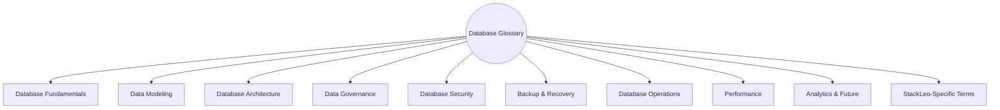
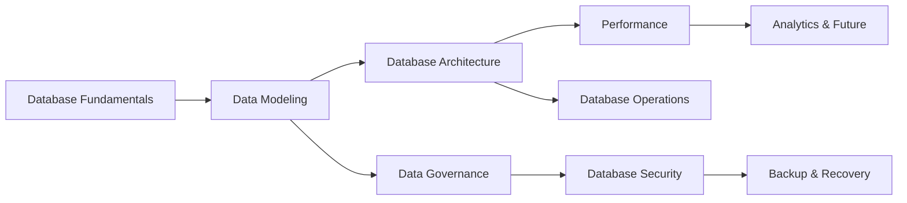
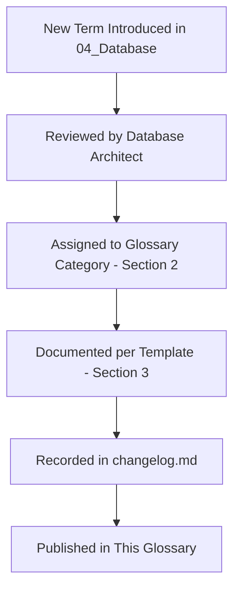
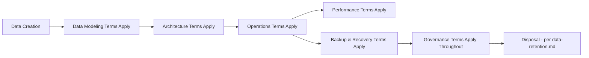

# Database Glossary and Canonical Terminology

## 1. Document Purpose

This document is the official Database Glossary and Canonical Terminology reference for **StackLeo Tech Store**. It establishes standardized definitions for database, data architecture, governance, security, and operational terminology used throughout `04_Database`.

- **Purpose of the Glossary** — to ensure every reader of `04_Database` interprets its terminology identically, whether they are an Architect, a Database Reliability Engineer, or a Business Analyst.
- **Importance of Consistent Terminology** — data architecture terms (e.g., "partitioning" vs. "sharding," or "backup" vs. "archive") are frequently confused; a single authoritative reference prevents that confusion from propagating into design or operational mistakes.
- **Benefits for Architecture, Engineering, QA, DevOps, Security, and Business Teams** — a shared vocabulary reduces miscommunication across the many roles that depend on `04_Database`, from the Solution Architect designing the schema to the Business Analyst validating it against business need.
- **Governance of Terminology** — this glossary is governed consistent with Section 6, ensuring it remains current as `04_Database` evolves.

This document extends `03_System_Design/glossary.md` with database-specific terminology and is implementation-independent, describing concepts rather than any specific technology's terminology.

## 2. Glossary Categories

| Category | Term Count |
|---|---|
| Database Fundamentals | 11 |
| Data Modeling | 12 |
| Database Architecture | 10 |
| Data Governance | 9 |
| Database Security | 9 |
| Backup & Recovery | 9 |
| Database Operations | 8 |
| Performance | 7 |
| Analytics & Future | 7 |
| StackLeo-Specific Terms | 8 |

**Total Glossary Terms: 90**

### Glossary Index

| Term | Category |
|---|---|
| ABAC | Database Security |
| Admin Portal | StackLeo-Specific Terms |
| Aggregate | Data Modeling |
| Aggregate Root | Data Modeling |
| AI Readiness | Analytics & Future |
| Analytics Platform | StackLeo-Specific Terms |
| Archive | Backup & Recovery |
| Auditability | Data Governance |
| Availability | Database Architecture |
| Backup | Backup & Recovery |
| Bounded Context | Data Modeling |
| Business Continuity | Backup & Recovery |
| Business Intelligence | Analytics & Future |
| Caching | Performance |
| Capacity Planning | Database Operations |
| Cardinality | Data Modeling |
| Cold Data | Performance |
| Column | Database Fundamentals |
| Conceptual Model | Data Modeling |
| Connection Pool | Performance |
| Consistency | Database Architecture |
| Constraint | Database Fundamentals |
| Corporate Sales | StackLeo-Specific Terms |
| Customer Portal | StackLeo-Specific Terms |
| Data Classification | Data Governance |
| Data Lake | Analytics & Future |
| Data Lifecycle | Data Governance |
| Data Lineage | Data Governance |
| Data Owner | Data Governance |
| Data Quality | Data Governance |
| Data Steward | Data Governance |
| Data Warehouse | Analytics & Future |
| Database | Database Fundamentals |
| Denormalization | Data Modeling |
| Disaster Recovery | Backup & Recovery |
| Domain Model | Data Modeling |
| Durability | Database Architecture |
| ELT | Analytics & Future |
| Encryption | Database Security |
| Encryption at Rest | Database Security |
| Encryption in Transit | Database Security |
| Entity | Data Modeling |
| ETL | Analytics & Future |
| Event Streaming | Analytics & Future |
| Failover | Database Architecture |
| Health Check | Database Operations |
| High Availability | Database Architecture |
| Hot Data | Performance |
| Index | Database Fundamentals |
| Inventory Domain | StackLeo-Specific Terms |
| Key Rotation | Database Security |
| Latency | Performance |
| Least Privilege | Database Security |
| Logical Model | Data Modeling |
| Maintenance Window | Database Operations |
| Marketplace | StackLeo-Specific Terms |
| Master Data | Data Governance |
| Metadata | Data Governance |
| Migration | Database Operations |
| Monitoring | Database Operations |
| Normalization | Data Modeling |
| Observability | Database Operations |
| Partitioning | Database Architecture |
| Physical Model | Data Modeling |
| Product Catalog | StackLeo-Specific Terms |
| Query | Database Fundamentals |
| Query Optimization | Performance |
| RBAC | Database Security |
| Read Replica | Database Architecture |
| Record | Database Fundamentals |
| Recovery | Backup & Recovery |
| Relationship | Data Modeling |
| Replication | Database Architecture |
| Restore | Backup & Recovery |
| Roll-forward | Database Operations |
| Rollback | Database Operations |
| Row | Database Fundamentals |
| RPO | Backup & Recovery |
| RTO | Backup & Recovery |
| Scalability | Database Architecture |
| Schema | Database Fundamentals |
| Secrets Management | Database Security |
| Sharding | Database Architecture |
| Snapshot | Backup & Recovery |
| StackLeo Tech Store | StackLeo-Specific Terms |
| Table | Database Fundamentals |
| Throughput | Performance |
| Transaction | Database Fundamentals |
| View | Database Fundamentals |
| Zero Trust | Database Security |

*Diagram: Database Terminology Map.*

## 3. Glossary Entry Template

Every entry defines: **Term, Category, Definition, Business Context, Related Terms, Notes**. Entries are presented alphabetically within each category as a table.

### 3.1 Database Fundamentals

| Term | Definition | Business Context | Related Terms | Notes |
|---|---|---|---|---|
| Column | A named attribute within a row, holding one piece of data. | Represents a single business attribute (e.g., a Product's price). | Row, Table | Conceptual term; no physical column structure defined in this repository. |
| Constraint | A rule enforced on stored data to preserve validity. | Structurally enforces business rules (e.g., non-negative stock, BR-030). | Data Integrity | See `normalization.md` (Section 7). |
| Database | An organized collection of structured business data. | Holds the authoritative record of StackLeo's business state. | Schema, Table | — |
| Index | A structure that accelerates data retrieval for specific query patterns. | Supports fast, predictable customer- and business-facing queries. | Query Optimization | See `indexing-strategy.md`. |
| Query | A request for specific data meeting defined criteria. | The mechanism through which business processes retrieve needed data. | Query Optimization | — |
| Record | A single instance of an entity's data. | Represents one specific business fact (e.g., one Order). | Row, Entity | "Record" and "Row" are used interchangeably in this glossary. |
| Row | A single record within a table. | See Record. | Record, Table | — |
| Schema | The organized structure defining how data is arranged. | Reflects the domain organization defined in `schema-design.md`. | Table, Database | — |
| Table | A structured collection of related records. | Represents a business entity's stored instances (e.g., all Orders). | Row, Column, Schema | — |
| Transaction | A unit of work treated as a single, indivisible operation. | Ensures operations like Order creation succeed or fail as a whole. | ACID | See `database-strategy.md` (Section 4). |
| View | A structured, often filtered or aggregated, presentation of underlying data. | Supports simplified or role-scoped presentation of complex data. | Query | Conceptual; no physical view structure defined in this repository. |

### 3.2 Data Modeling

| Term | Definition | Business Context | Related Terms | Notes |
|---|---|---|---|---|
| Aggregate | A cluster of related entities treated as a single consistency unit. | Ensures business rules are enforced consistently for related data. | Aggregate Root, Bounded Context | See `data-model.md` (Section 5). |
| Aggregate Root | The single entity through which all changes to an aggregate must occur. | Guarantees an aggregate's business rules remain consistently enforced. | Aggregate | See `03_System_Design/domain-model.md` (Section 6). |
| Bounded Context | A boundary within which a specific domain model applies consistently. | Prevents business terms from meaning different things in different parts of the system. | Domain Model | See `03_System_Design/bounded-contexts.md`. |
| Cardinality | The business-meaningful count of how entities relate. | Describes relationships like "a Customer has many Orders." | Relationship | See `entity-relationship.md` (Section 4). |
| Conceptual Model | A model describing business concepts and relationships, independent of technical realization. | The highest level of abstraction in data modeling. | Logical Model, Physical Model | See `data-model.md` (Section 1). |
| Denormalization | A deliberate, governed exception to normalization for a validated performance or usability need. | Balances data integrity against read performance. | Normalization | See `normalization.md` (Section 4). |
| Domain Model | A model of core business concepts, entities, and relationships. | Represents StackLeo's business in structured form. | Bounded Context, Entity | See `03_System_Design/domain-model.md`. |
| Entity | A business concept with a distinct, continuous identity that persists through change. | The basic building block of the domain and data models. | Aggregate, Attribute | See `data-model.md` (Section 3). |
| Logical Model | A model elaborating the conceptual model with business-level attribute and relationship detail. | Bridges conceptual understanding and physical schema design. | Conceptual Model, Physical Model | See `data-model.md` (Section 1). |
| Normalization | Structuring data so each business fact is stored exactly once. | Prevents inconsistency between duplicated copies of the same fact. | Denormalization | See `normalization.md`. |
| Physical Model | The technical realization of the logical model in an actual storage structure. | Out of scope for this repository's architecture documentation. | Logical Model | Addressed in dedicated engineering documentation, not `04_Database`. |
| Relationship | A conceptual connection between two or more entities. | Represents how business concepts relate (e.g., Customer places Order). | Cardinality | See `entity-relationship.md`. |

### 3.3 Database Architecture

| Term | Definition | Business Context | Related Terms | Notes |
|---|---|---|---|---|
| Availability | The proportion of time a system is capable of correctly serving requests. | Directly affects the trust-focused customer experience. | High Availability | See `03_System_Design/quality-attributes.md` (Section 5). |
| Consistency | The property that all readers of the same data see the same, correct value. | Critical for Orders, Payments, and Inventory accuracy. | Durability | See `database-strategy.md` (Section 4). |
| Durability | The guarantee that confirmed data changes survive subsequent failures. | Ensures a confirmed Order is never silently lost. | Consistency | Part of the ACID concept. |
| Failover | The process of automatically redirecting operation to a healthy alternative upon failure. | Preserves availability during a component failure. | High Availability, Replication | See `03_System_Design/deployment-architecture.md` (Section 7). |
| High Availability | An architectural property ensuring minimal downtime. | Supports the trust-focused brand positioning. | Availability, Failover | — |
| Partitioning | Dividing a large dataset into smaller, meaningful segments within a single logical database. | Keeps large structures (e.g., Orders) performant as they grow. | Sharding | See `partitioning-strategy.md`. |
| Read Replica | A copy of data maintained to serve read-only queries, separate from the primary write source. | Supports read scaling without impacting write performance. | Replication | See `database-strategy.md` (Section 5). |
| Replication | Maintaining synchronized copies of data across multiple locations. | Supports both read scaling and disaster recovery. | Read Replica, Failover | — |
| Scalability | The ability to handle growing demand by adding capacity. | Directly supports StackLeo's growth stages. | High Availability | See `03_System_Design/scalability-strategy.md`. |
| Sharding | Distributing data across multiple independent database instances. | A more significant scaling step than partitioning, reserved for genuine large-scale need. | Partitioning | See `partitioning-strategy.md` (Section 7). |

### 3.4 Data Governance

| Term | Definition | Business Context | Related Terms | Notes |
|---|---|---|---|---|
| Auditability | The property that data changes can be traced to a specific actor and time. | Supports accountability and compliance. | Audit Record | See `data-governance.md` (Section 3). |
| Data Classification | Categorizing data by sensitivity to inform its handling and protection. | Determines encryption, access, and audit requirements. | Data Owner | See `data-governance.md` (Section 4). |
| Data Lifecycle | The stages a piece of data passes through, from creation to disposal. | Ensures data is retained deliberately, not indefinitely by default. | Data Retention | See `data-retention.md`. |
| Data Lineage | The traceable history of where data originated and how it has moved. | Supports trust in reported figures and troubleshooting. | Metadata | See `data-governance.md` (Section 7). |
| Data Owner | The role accountable for a specific data category's accuracy and appropriate use. | Ensures every data category has genuine accountability. | Data Steward | See `data-governance.md` (Section 3). |
| Data Quality | The accuracy, completeness, consistency, and reliability of data. | Directly affects the trustworthiness of business decisions. | Data Steward | See `data-governance.md` (Section 6). |
| Data Steward | The role executing day-to-day data quality management for an assigned category. | Operationalizes the Data Owner's accountability. | Data Owner | See `data-governance.md` (Section 3). |
| Master Data | Core, authoritative business reference data other data refers to. | Anchors consistency across the platform (e.g., Product, Customer). | Data Governance | See `database-strategy.md` (Section 3). |
| Metadata | Data describing other data (e.g., classification, timestamps). | Supports data governance and future data catalog readiness. | Data Lineage | See `data-governance.md` (Section 7). |

### 3.5 Database Security

| Term | Definition | Business Context | Related Terms | Notes |
|---|---|---|---|---|
| ABAC | Attribute-Based Access Control; authorization based on attributes such as region or warehouse. | Anticipated future extension to RBAC as StackLeo scales geographically. | RBAC | See `security-model.md` (Section 5). |
| Encryption | Protecting data through cryptographic transformation. | Protects Confidential and Restricted data from unauthorized exposure. | Encryption at Rest, Encryption in Transit | See `security-model.md` (Section 4). |
| Encryption at Rest | Encryption applied to stored data. | Protects data if underlying storage is accessed without authorization. | Encryption | — |
| Encryption in Transit | Encryption applied to data while moving across a network. | Protects data from interception during transmission. | Encryption | — |
| Key Rotation | Periodically replacing cryptographic keys. | Limits the impact window of any single key's potential compromise. | Secrets Management | See `security-model.md` (Section 4). |
| Least Privilege | Granting only the access necessary for a defined responsibility. | Limits the impact of compromised or misused credentials. | RBAC, Zero Trust | See ARCH-033. |
| RBAC | Role-Based Access Control; authorization based on assigned organizational roles. | StackLeo's current authorization model. | ABAC | See `02_Product/user-roles.md`. |
| Secrets Management | Secure storage and controlled access of credentials and keys. | Prevents sensitive configuration from being embedded in code. | Key Rotation | See `security-model.md` (Section 6). |
| Zero Trust | A security posture where no request is trusted by default regardless of origin. | Ensures every data access is verified, not assumed. | Least Privilege | See ARCH-034. |

### 3.6 Backup & Recovery

| Term | Definition | Business Context | Related Terms | Notes |
|---|---|---|---|---|
| Archive | Data moved to a lower-cost, less immediately accessible tier once active relevance diminishes. | Balances continued availability against storage cost. | Snapshot | See `data-retention.md` (Section 5). |
| Backup | A protective copy of data created to guard against loss. | Foundational safeguard against technical failure or human error. | Restore, Recovery | See `backup-recovery.md`. |
| Business Continuity | The organization's ability to continue operating despite disruption. | The ultimate business purpose backup and recovery serve. | Disaster Recovery | See `backup-recovery.md` (Section 1). |
| Disaster Recovery | Recovery following a significant infrastructure-level incident. | Coordinated with the Disaster Recovery environment strategy. | Business Continuity | See `03_System_Design/deployment-architecture.md` (Section 10). |
| Recovery | The process of restoring data or service following loss or failure. | Confirms a backup's genuine value beyond mere existence. | Backup, Restore | See `backup-recovery.md` (Section 6). |
| Restore | The specific act of reinstating data from a backup. | A component action within the broader Recovery process. | Recovery | — |
| RPO | Recovery Point Objective; the maximum acceptable data loss, measured as a point in time. | Informs how frequently backups must occur for each data category. | RTO | See `backup-recovery.md` (Section 3). |
| RTO | Recovery Time Objective; the maximum acceptable time to restore service. | Informs how quickly recovery capability must operate. | RPO | See `backup-recovery.md` (Section 3). |
| Snapshot | A point-in-time capture of data's state. | Enables fast point-in-time recovery. | Backup, Archive | See `backup-recovery.md` (Section 4). |

### 3.7 Database Operations

| Term | Definition | Business Context | Related Terms | Notes |
|---|---|---|---|---|
| Capacity Planning | Forecasting and preparing for future resource needs. | Prevents both under- and over-provisioning as the platform grows. | Monitoring | See `03_System_Design/scalability-strategy.md` (Section 8). |
| Health Check | A means by which a component confirms its own operational status. | Supports failover and monitoring decisions. | Monitoring | See `03_System_Design/observability.md` (Section 9). |
| Maintenance Window | A planned period for performing operational work with minimized customer impact. | Balances necessary maintenance against availability expectations. | Migration | See `03_System_Design/deployment-architecture.md` (Section 3). |
| Migration | The safe evolution of schema or data from one state to another. | Allows the schema to grow without disrupting business continuity. | Rollback, Roll-forward | See `migration-strategy.md`. |
| Monitoring | Continuous observation of system health and performance. | Enables timely detection of issues before significant impact. | Observability | See `03_System_Design/observability.md`. |
| Observability | The property that a system's internal state can be inferred from its external outputs. | The architectural foundation underpinning reliable monitoring. | Monitoring | See `03_System_Design/observability.md` (Section 1). |
| Roll-forward | Correcting a migration issue by fixing forward rather than reverting. | Sometimes safer than rollback late in a migration. | Rollback | See `migration-strategy.md` (Section 7). |
| Rollback | Reverting to a previous, known-good state following a problematic change. | Limits the duration and impact of a flawed migration. | Roll-forward | See `migration-strategy.md` (Section 7). |

### 3.8 Performance

| Term | Definition | Business Context | Related Terms | Notes |
|---|---|---|---|---|
| Caching | Holding frequently accessed data in a fast-access layer to reduce latency and load. | Improves customer-facing performance for high-read data. | Hot Data | See `technology-stack.md` (Section 4.4). |
| Cold Data | Rarely accessed data retained primarily for historical or compliance purposes. | Candidate for archival and cost-optimized storage. | Hot Data, Archive | See `partitioning-strategy.md` (Section 6). |
| Connection Pool | A managed set of reusable connections to a data store. | Conceptual efficiency mechanism; not implementation-prescribed in this repository. | Query Optimization | Conceptual reference only. |
| Hot Data | Frequently accessed, actively used data. | Prioritized for fast-access storage and caching. | Cold Data, Caching | See `partitioning-strategy.md` (Section 6). |
| Latency | The time taken to respond to a request. | Directly affects customer-facing responsiveness. | Throughput | See `02_Product/non-functional-requirements.md` (Section 5). |
| Query Optimization | Improving the efficiency of data retrieval. | Supports fast, predictable customer- and business-facing queries. | Index, Caching | See `indexing-strategy.md` (Section 5). |
| Throughput | The volume of requests or transactions processed per unit time. | Informs capacity planning for growing order volume. | Latency | See `03_System_Design/scalability-strategy.md` (Section 8). |

### 3.9 Analytics & Future

| Term | Definition | Business Context | Related Terms | Notes |
|---|---|---|---|---|
| AI Readiness | The degree to which data and architecture can support future AI-assisted capability. | Ensures AI (Phase 6) can be introduced without redesigning existing domains. | Data Warehouse | See `database-strategy.md` (Section 9). |
| Business Intelligence | The practice of analyzing business data to support decision-making. | Builds on the Data Warehouse evolution. | Data Warehouse | See `database-strategy.md` (Section 9). |
| Data Lake | A storage approach holding data in a raw or minimally processed form for flexible future use. | A conceptual future option for very broad, unstructured data retention. | Data Warehouse | Not yet adopted; conceptual future consideration. |
| Data Warehouse | A dedicated store optimized for aggregated, analytical queries, separate from transactional data. | Protects transactional performance while enabling deep analysis. | ETL, ELT | See `database-strategy.md` (Section 9). |
| ELT | Extract, Load, Transform; a data integration pattern where data is loaded before transformation. | A candidate pattern for future analytics data pipelines. | ETL | Conceptual; no specific pipeline technology implied. |
| ETL | Extract, Transform, Load; a data integration pattern where data is transformed before loading. | A candidate pattern for future analytics data pipelines. | ELT | Conceptual; no specific pipeline technology implied. |
| Event Streaming | A continuous, ordered flow of business events available for multiple consumers over time. | The future evolution of StackLeo's event-driven collaboration model. | Event-Driven Architecture | See `03_System_Design/service-architecture.md` (Section 11). |

### 3.10 StackLeo-Specific Terms

| Term | Definition | Business Context | Related Terms | Notes |
|---|---|---|---|---|
| Admin Portal | The internal, staff-facing presentation surface for platform administration. | See `03_System_Design/glossary.md` (Section 3.9). | Customer Portal | Cross-referenced from `03_System_Design/glossary.md`. |
| Analytics Platform | The conceptual capability aggregating Business and Operational Metrics for insight. | Realized through the Analytics domain defined in `data-model.md` (Section 3.11). | Data Warehouse, Business Intelligence | — |
| Corporate Sales | StackLeo's future capability for serving organizational and bulk buyers. | See `01_Business/business-model.md` (Section 10). | Wholesale | Not yet active; Phase 4. |
| Customer Portal | The customer-facing presentation surface encompassing browsing, purchasing, and self-service. | See `03_System_Design/glossary.md` (Section 3.9). | Admin Portal | — |
| Inventory Domain | The bounded context owning stock accuracy and availability across warehouses and channels. | See `data-model.md` (Section 3.4). | Warehouse, Stock Movement | — |
| Marketplace | StackLeo's future multi-vendor business model. | See `01_Business/business-model.md` (Section 15). | Vendor, Vendor Product | Not yet active; Phase 5. |
| Product Catalog | The authoritative, centralized collection of all sellable products. | See `data-model.md` (Section 3.3). | Product, Category, Brand | — |
| StackLeo Tech Store | The official name of the platform documented throughout this repository. | The subject of every document in this repository. | — | Tagline: "Everything Tech, One Marketplace." |

*Diagram: Data Architecture Concept Map.*

## 4. Acronyms

| Acronym | Meaning |
|---|---|
| ABAC | Attribute-Based Access Control |
| ACID | Atomicity, Consistency, Isolation, Durability |
| ADR | Architecture Decision Record |
| CDC | Change Data Capture |
| CRUD | Create, Read, Update, Delete |
| DBRE | Database Reliability Engineering |
| DDL | Data Definition Language |
| DDD | Domain-Driven Design |
| DML | Data Manipulation Language |
| ELT | Extract, Load, Transform |
| ETL | Extract, Transform, Load |
| KPI | Key Performance Indicator |
| MDM | Master Data Management |
| MFA | Multi-Factor Authentication |
| OLAP | Online Analytical Processing |
| OLTP | Online Transactional Processing |
| RACI | Responsible, Accountable, Consulted, Informed |
| RBAC | Role-Based Access Control |
| RPO | Recovery Point Objective |
| RTO | Recovery Time Objective |
| SKU | Stock Keeping Unit |
| SLA | Service Level Agreement |
| SLI | Service Level Indicator |
| SLO | Service Level Objective |
| SQL | Structured Query Language (referenced as a category example only; see `04_Database/README.md`) |

## 5. Naming Standards

| Element | Convention | Example Reference |
|---|---|---|
| Database Objects | Singular, business-meaningful nouns; conceptual naming only (per `schema-design.md`, Section 4) | A structure representing "Order," not "Orders" |
| Documents | Lowercase kebab-case filenames | `entity-relationship.md` |
| Business Entities | Singular, capitalized business nouns | `Customer`, `Order`, `Warranty Claim` |
| Domains | Title Case, business-capability-aligned names | `Product Catalog`, `Order & Fulfillment` |
| Events | Past-tense business fact names | `OrderCreated`, `PaymentSucceeded` (per `03_System_Design/event-flows.md`) |
| Metrics | Descriptive, business-outcome-oriented names | `Order Success Rate`, `Data Quality Score` |
| Data Assets | Classification-prefixed, domain-scoped naming (conceptual) | A Restricted-tier Payment asset clearly distinguishable from a Public-tier Catalog asset |

## 6. Governance

- **Glossary Ownership** — the Database Architect, in partnership with the Business Analyst, owns this glossary's accuracy and completeness.
- **Review Process** — this glossary is reviewed whenever a new document in `04_Database` introduces terminology not yet defined here, and at the conclusion of each phase defined in `02_Product/product-roadmap.md`.
- **Canonical Terminology Management** — where a term's meaning could differ between `03_System_Design/glossary.md` and this document, this glossary is authoritative for database-specific sense, while `03_System_Design/glossary.md` remains authoritative for general architectural sense.
- **Change Control** — additions, removals, or definition changes are recorded in `00_Project_Overview/changelog.md`.
- **Documentation Standards** — this document follows the enterprise Markdown conventions established across this repository.
- **Versioning** — this document follows the Semantic Versioning approach defined in `00_Project_Overview/changelog.md`.

### Governance Matrix

| Role | Responsibility |
|---|---|
| Database Architect | Maintains database, architecture, performance, and operations term accuracy. |
| Business Analyst | Maintains business context accuracy across all glossary entries. |
| Security Lead | Maintains Database Security category term accuracy. |
| Data Steward | Maintains Data Governance category term accuracy. |
| All Contributors | Introduce new terms promptly upon first use in any `04_Database` document. |

*Diagram: Governance Relationship Overview.*

*Diagram: Database Lifecycle Terminology Flow.*

## 7. Document Information

| Property | Value |
|----------|-------|
| Document | glossary.md |
| Version | 1.0.0 |
| Status | Active |
| Maintained By | StackLeo |
| Last Updated | 2026-07-17 |

---

© StackLeo. All Rights Reserved.
