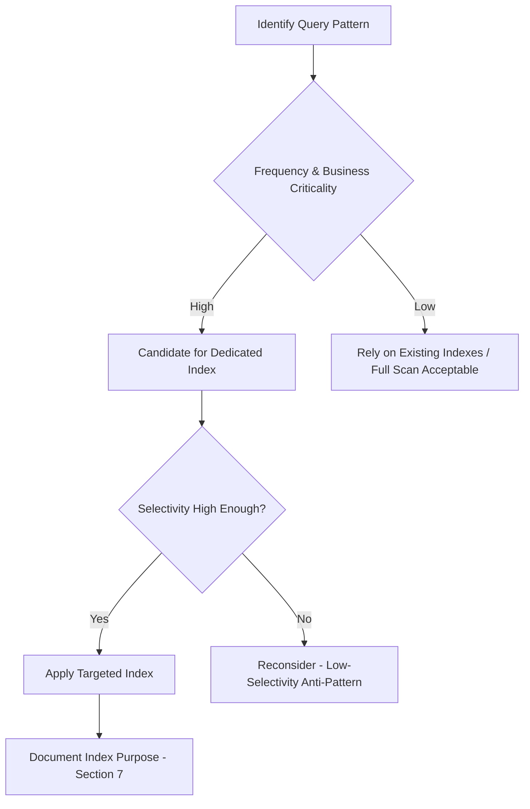
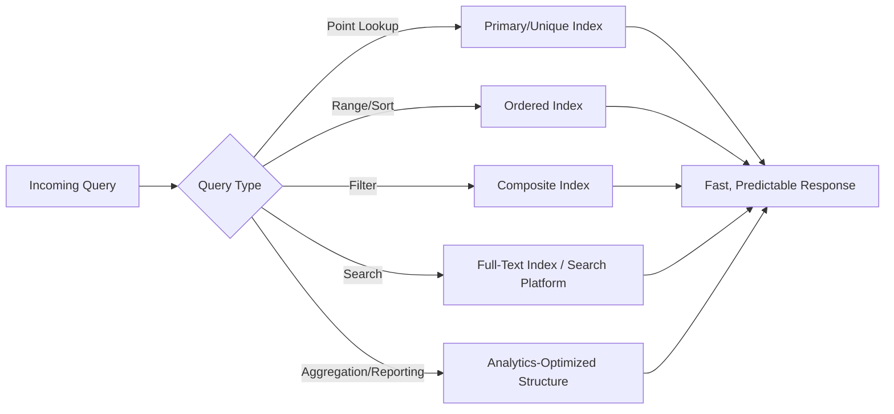
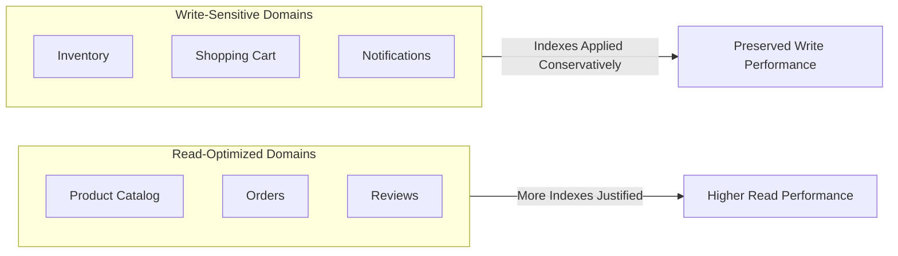
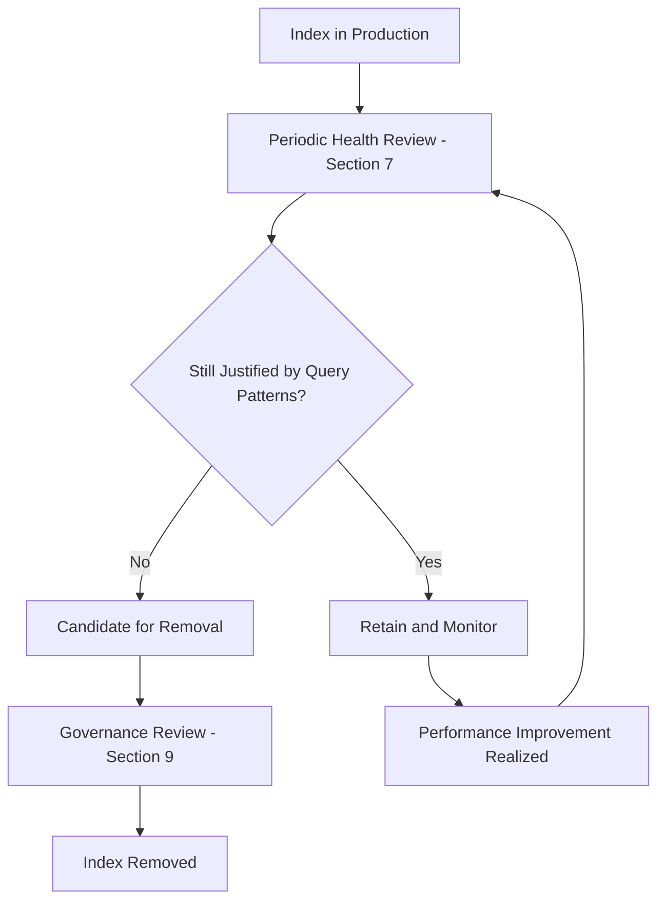

# Database Indexing Strategy

## 1. Document Purpose

This document is the official Database Indexing Strategy for **StackLeo Tech Store**. It defines enterprise-level indexing principles to optimize query performance, scalability, and maintainability, while balancing read efficiency, write cost, and storage overhead.

- **Purpose of Indexing** — to make the platform's most business-critical and frequent query patterns fast and predictable, without indiscriminately indexing every possible access path.
- **Relationship with Schema Design** — indexing is applied to the structures already defined in `schema-design.md` and `data-model.md`; index decisions never drive schema structure, only complement it.
- **Relationship with Normalization** — normalization (per `normalization.md`) protects data integrity but can introduce additional relationship traversal cost; indexing is the primary conceptual counterbalance, making normalized structures perform well without resorting to denormalization by default.
- **Relationship with Performance Engineering** — indexing strategy directly supports the performance targets defined in `02_Product/non-functional-requirements.md` (Section 5) and the read/write optimization principles in `03_System_Design/scalability-strategy.md` (Section 5).

This document is implementation-independent and vendor-neutral. It does not include SQL, `CREATE INDEX` statements, vendor-specific indexing features, or ORM examples — it defines indexing strategy conceptually.

## 2. Indexing Philosophy

- **Performance-First Mindset** — indexing decisions start from a genuine, observed or anticipated query need, not from a reflexive assumption that "more indexes are better."
- **Business-Driven Optimization** — the query patterns that matter most (Section 4) are those directly supporting core business capability (checkout, catalog browsing), prioritized ahead of infrequent or internal-only access paths.
- **Selective Indexing** — indexes are applied deliberately to the columns and combinations that genuinely benefit from them, consistent with `03_System_Design/architecture-principles.md` (ARCH-023, Simplicity Before Complexity).
- **Maintainability** — every index is documented with the query pattern it exists to serve, so its continued justification can be evaluated over time (Section 7).
- **Scalability** — indexing strategy anticipates the data volume growth defined in `03_System_Design/scalability-strategy.md` (Section 3), avoiding approaches that degrade as tables grow.
- **Storage Efficiency** — indexes are not applied speculatively; each has a genuine storage cost that must be justified by its performance benefit.
- **Cost Awareness** — every additional index has a write-performance cost (Section 6); indexing decisions weigh this cost against the read benefit deliberately.

## 3. Index Categories

| Index Category | Concept | Appropriate Business Scenario |
|---|---|---|
| Primary Index | The index inherently associated with a structure's unique identifier. | Applied universally; supports direct lookup of a specific entity (e.g., retrieving a specific Order by its identifier). |
| Secondary Index | An index on a non-identifying column or combination, supporting lookups other than by primary identifier. | Looking up a Customer by contact detail; looking up Orders by status. |
| Composite Index | An index spanning multiple columns together, supporting queries that filter or sort on that combination. | Looking up Inventory by Warehouse and Product Variant together. |
| Covering Index (Concept) | An index structured so a query can be satisfied entirely from the index itself, without needing to access the underlying structure. | High-frequency, narrow queries such as checking Product availability status for display. |
| Unique Index (Concept) | An index that also enforces that no two records share the same value for the indexed column(s). | Enforcing Customer contact detail uniqueness (BR-001); enforcing SKU uniqueness. |
| Full-Text Search Readiness | Indexing structured to support relevance-ranked text search rather than exact matching. | Product keyword search (`02_Product/functional-requirements.md`, FR-009), pending evolution toward a dedicated Search platform per `03_System_Design/technology-stack.md` (Section 4.7). |
| Spatial Index Readiness (Future) | Indexing structured to support location-based queries. | Anticipated for future delivery zone optimization or store-locator capability as physical retail and logistics capability mature. |

### Index Categories Summary

| Category | Primary Use Case | Current Status |
|---|---|---|
| Primary Index | Unique entity lookup | Active, universal |
| Secondary Index | Non-identifier lookup | Active, applied per domain need (Section 4) |
| Composite Index | Multi-column filter/sort | Active, applied per domain need |
| Covering Index | High-frequency narrow queries | Applied selectively where justified |
| Unique Index | Business-key uniqueness enforcement | Active, applied per BR-001, SKU rules |
| Full-Text Search Readiness | Keyword search | Active at MVP scale; evolving toward dedicated Search platform |
| Spatial Index Readiness | Location-based queries | Future |

## 4. Domain-Based Indexing Strategy

| Domain | Typical Query Patterns | Read Optimization Goals | Write Considerations | Expected Growth | Future Scalability |
|---|---|---|---|---|---|
| Identity | Lookup by contact detail; session validation | Fast login and session verification | Moderate write frequency (login events) | Grows with customer base | Stable; scales linearly with users |
| Customer | Lookup by Customer identifier; address retrieval | Fast profile and address retrieval at checkout | Low write frequency (profile edits) | Grows with customer base | Stable |
| Product Catalog | Lookup by identifier; filter by category/brand/price | Fast catalog browsing and product detail rendering | Low-to-moderate write frequency (catalog updates) | Grows steadily with catalog breadth | High priority for future Marketplace-driven growth |
| Categories | Hierarchical lookup; category-to-product association | Fast category navigation | Low write frequency | Slow, deliberate growth | Stable |
| Brands | Lookup by identifier; brand-to-product association | Fast brand page rendering | Low write frequency | Slow, deliberate growth | Stable |
| Inventory | Lookup by Product Variant and Warehouse; low-stock filtering | Fast, near-real-time stock availability checks | High write frequency (every order, restock) | Grows with order volume and warehouse count | Critical priority as multi-warehouse (Phase 4) activates |
| Shopping Cart | Lookup by Customer/session | Fast cart retrieval and update | High write frequency (frequent item changes) | Bounded by active customer session count | Stable; naturally self-limiting via expiration (BR-046) |
| Orders | Lookup by identifier; filter by Customer, status, date range | Fast order history and status retrieval | Moderate write frequency (status transitions) | High, steady growth; StackLeo's largest long-term data volume | Critical priority for future partitioning (`partitioning-strategy.md`) |
| Payments | Lookup by Order; filter by status | Fast payment verification and reconciliation | Moderate write frequency | Grows in step with Orders | High priority, tied to Order growth |
| Shipping | Lookup by Order; filter by delivery status/zone | Fast tracking status retrieval | Moderate write frequency (status updates) | Grows in step with Orders | High priority, tied to Order growth |
| Reviews | Lookup by Product; filter by rating | Fast product review display | Low write frequency | Grows steadily with order volume | Moderate priority |
| Notifications | Lookup by Customer; filter by delivery status | Fast delivery status auditing | High write frequency (every notification event) | High volume, but low query frequency per record | Candidate for future archival/partitioning |
| Marketplace (Future) | Lookup by Vendor; filter by listing status | Fast seller storefront and listing browsing | Moderate-to-high write frequency as sellers grow | Potentially rapid growth once active | High priority ahead of Phase 5 |
| Analytics (Future) | Aggregation across large historical ranges | Fast dashboard and report generation | Low write frequency (batch/event-fed) | High cumulative volume over time | Addressed primarily through the Data Warehouse evolution (`database-strategy.md`, Section 9), not transactional indexing alone |

*Diagram: Indexing Decision Framework.*

## 5. Query Optimization Strategy

- **Point Lookup** — retrieving a single, specific record by its identifier (e.g., a specific Order); supported directly by primary and unique indexes.
- **Range Queries** — retrieving records within a bounded range (e.g., Orders placed within a date range); supported by indexes ordered on the range-queried column.
- **Sorting** — presenting results in a defined order (e.g., newest Orders first); supported by indexes aligned with the common sort order to avoid expensive separate sorting.
- **Pagination** — retrieving results in bounded pages (per `02_Product/non-functional-requirements.md`, NFR-006); supported by indexes that make sequential page retrieval efficient rather than degrading on later pages.
- **Filtering** — narrowing results by one or more criteria (e.g., Products by Category and Brand); supported by composite indexes aligned with common filter combinations.
- **Search** — relevance-ranked, free-text discovery; addressed primarily through the Full-Text Search Readiness category (Section 3) and, at scale, the dedicated Search platform.
- **Aggregation** — computing summary values (e.g., total Orders per day); optimized primarily through the Analytics domain's separated structures (`normalization.md`, Section 4), not transactional indexing.
- **Reporting** — structured, often scheduled, retrieval of business summaries; similarly optimized primarily through Reporting Service's dedicated structures rather than heavy transactional indexing.

*Diagram: Query Optimization Flow.*

## 6. Performance Trade-offs

- **Read vs. Write Performance** — every index accelerates the reads it supports but adds overhead to every write affecting the indexed column(s); this trade-off is evaluated explicitly per domain (Section 4).
- **Storage Overhead** — each index consumes additional storage proportional to the indexed data's volume, a genuine but currently secondary cost consideration relative to query performance.
- **Maintenance Cost** — every index must be kept current as data changes, and its continued value must be periodically reassessed (Section 7).
- **Insert Performance** — high-write domains (Inventory, Cart, Notifications) are indexed conservatively, applying only indexes with a clear, validated read benefit.
- **Update Performance** — frequently updated columns (e.g., Order status) are indexed carefully, balancing status-query performance against update frequency.
- **Delete Performance** — logically deleted or archived records (per `schema-design.md`, Section 7) are considered when evaluating whether an index remains beneficial for the active, non-archived working set.

### Performance Trade-off Analysis

| Domain | Write Frequency | Indexing Posture | Rationale |
|---|---|---|---|
| Inventory | High | Conservative, targeted | Every additional index adds cost to the platform's most frequent write path. |
| Cart | High | Minimal | Cart's short lifecycle and self-expiration (BR-046) limit the long-term value of extensive indexing. |
| Orders | Moderate | Comprehensive on key query patterns | High business criticality justifies more thorough indexing despite moderate write cost. |
| Product Catalog | Low-to-moderate | Comprehensive | Read-heavy, customer-facing workload justifies prioritizing read optimization. |
| Notifications | High | Minimal, favor archival | High write volume with low per-record query frequency favors archival over extensive indexing. |

Additional indexes are justified only when a specific, observed or clearly anticipated query pattern (Section 4) demonstrably benefits, and the resulting write-performance cost has been explicitly considered — never applied reflexively.

*Diagram: Read vs. Write Trade-off Model.*

## 7. Monitoring & Maintenance

- **Index Health Reviews** — indexes are periodically reviewed against actual observed query patterns, consistent with `03_System_Design/observability.md` (Section 4, Metrics Strategy).
- **Unused Index Detection** — indexes that are not meaningfully contributing to query performance are identified and considered for removal, reducing unnecessary write and storage cost.
- **Redundant Index Identification** — overlapping indexes serving the same or a subset of the same query patterns are identified and consolidated.
- **Performance Reviews** — indexing effectiveness is reviewed alongside the broader performance reviews defined in `03_System_Design/observability.md` (Section 12).
- **Capacity Planning** — index storage growth is factored into the capacity planning process defined in `03_System_Design/scalability-strategy.md` (Section 8).
- **Continuous Optimization** — indexing strategy evolves iteratively based on real, observed usage patterns rather than being fixed permanently at initial design time.

### Monitoring Checklist

| Monitoring Activity | Cadence | Purpose |
|---|---|---|
| Index Health Review | Periodic, per `observability.md` cadence | Confirm indexes remain aligned with actual query patterns. |
| Unused Index Detection | Periodic | Identify and remove indexes with no meaningful read benefit. |
| Redundant Index Identification | Periodic | Consolidate overlapping indexes. |
| Performance Review | Following significant traffic events (e.g., flash sales) | Confirm indexing held up under peak load. |
| Capacity Planning Review | Aligned with `scalability-strategy.md` (Section 8) cadence | Ensure index storage growth is anticipated. |

## 8. Future Evolution

| Future Direction | Indexing Strategy Readiness |
|---|---|
| Large Product Catalogs | Composite and covering index strategy (Section 3) is designed to remain effective as catalog breadth grows toward Marketplace scale. |
| Marketplace Growth | Vendor and Vendor Product indexing (Section 4) is planned ahead of Phase 5 to avoid retrofitting under production load. |
| AI-Powered Search | Full-Text Search Readiness (Section 3) provides the foundation for eventual migration to a dedicated Search platform and AI-assisted relevance ranking. |
| Business Intelligence | Analytical query needs are directed toward dedicated Analytics structures (Section 5) rather than transactional indexing growth. |
| Data Warehouse | Historical, high-volume domains (Orders, Notifications) are candidates for archival-aware indexing as a future Data Warehouse absorbs long-term analytical query load. |
| Multi-Region | Indexing strategy extends naturally to region-scoped structures (`schema-design.md`, Section 8) without requiring a different indexing philosophy. |
| Global Expansion | Indexing strategy remains consistent across regions, supporting predictable performance as StackLeo's data footprint grows internationally. |

## 9. Governance

- **Index Review Process** — proposed indexes are evaluated against the Indexing Decision Framework (Section 4 diagram) before adoption, confirming genuine business or performance justification.
- **Approval Workflow** — new indexes affecting high-write domains (Inventory, Orders, Payments) require explicit review against the trade-offs defined in Section 6.
- **Change Management** — index additions, removals, or material changes are recorded in `00_Project_Overview/changelog.md`.
- **Documentation Standards** — every index's purpose and supported query pattern are documented, consistent with the domain matrix in Section 4.
- **Versioning** — this document follows the Semantic Versioning approach defined in `00_Project_Overview/changelog.md`.

## 10. Anti-Patterns

| Anti-Pattern | Why It Is Avoided |
|---|---|
| Over-Indexing | Applying an index for every conceivable query pattern degrades write performance and storage efficiency without proportional read benefit. |
| Under-Indexing | Failing to index genuinely frequent, business-critical query patterns forces expensive, slow full-structure scans, harming customer-facing performance. |
| Duplicate Indexes | Maintaining multiple indexes serving the same query pattern wastes storage and write performance without additional benefit. |
| Wide Composite Indexes | Composite indexes spanning excessive, rarely-co-queried columns are costly to maintain and often serve only a narrow subset of actual query patterns. |
| Ignoring Query Patterns | Designing indexes speculatively, without reference to actual or clearly anticipated query behavior (Section 4), risks optimizing for the wrong access paths. |
| Indexing Low-Selectivity Columns | Indexing a column with few distinct values (e.g., a boolean flag alone) provides little performance benefit relative to its maintenance cost. |
| Premature Optimization | Applying advanced or extensive indexing ahead of any validated need, contrary to `03_System_Design/architecture-principles.md` (ARCH-023). |

### Anti-Pattern Summary

| Anti-Pattern | Primary Risk | Mitigation |
|---|---|---|
| Over-Indexing | Write performance degradation | Require Section 4 justification for every index |
| Under-Indexing | Slow, customer-impacting queries | Prioritize business-critical query patterns (Section 4) |
| Duplicate Indexes | Wasted storage and write cost | Periodic redundancy review (Section 7) |
| Wide Composite Indexes | High maintenance cost, narrow benefit | Design composites around actual, common filter/sort combinations |
| Ignoring Query Patterns | Misaligned optimization effort | Base every index on documented query patterns (Section 4) |
| Indexing Low-Selectivity Columns | Poor cost-to-benefit ratio | Evaluate selectivity before applying an index |
| Premature Optimization | Wasted effort, unjustified complexity | Require validated need (Section 2) before adoption |

*Diagram: Index Lifecycle.*

*Diagram: Performance Improvement Pipeline.*

## 11. Document Information

| Property | Value |
|----------|-------|
| Document | indexing-strategy.md |
| Version | 1.0.0 |
| Status | Active |
| Maintained By | StackLeo |
| Last Updated | 2026-07-17 |

---

© StackLeo. All Rights Reserved.
